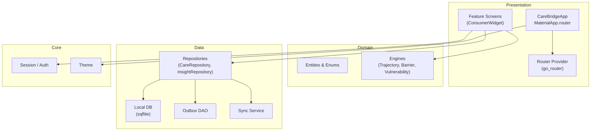
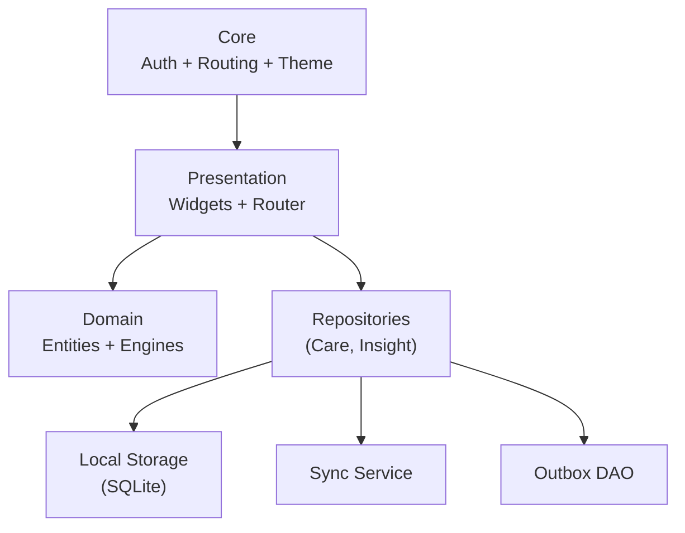
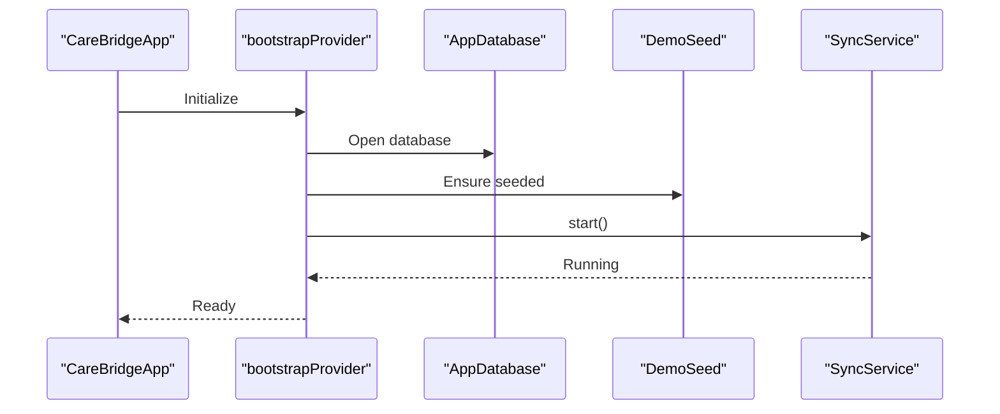
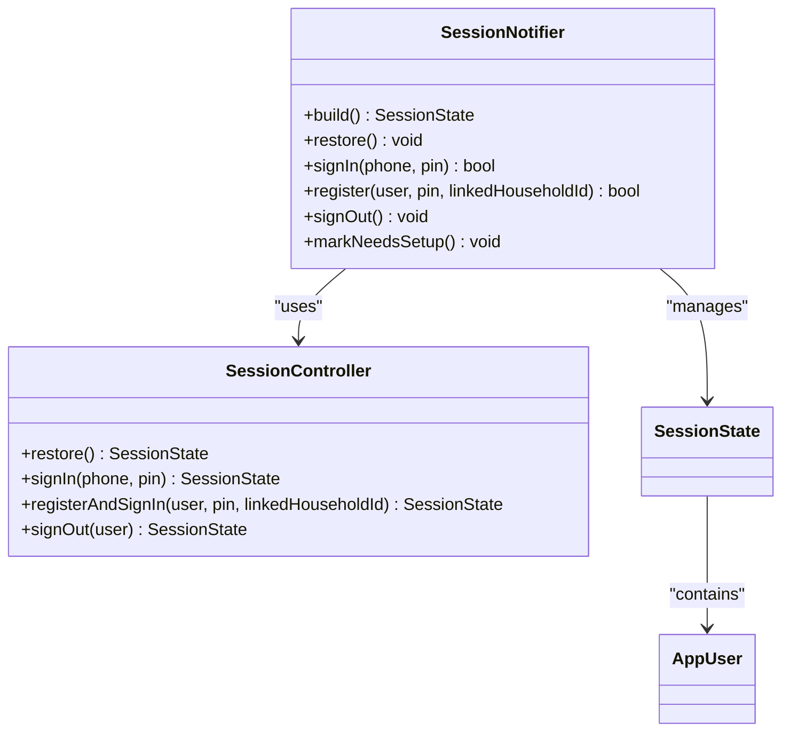
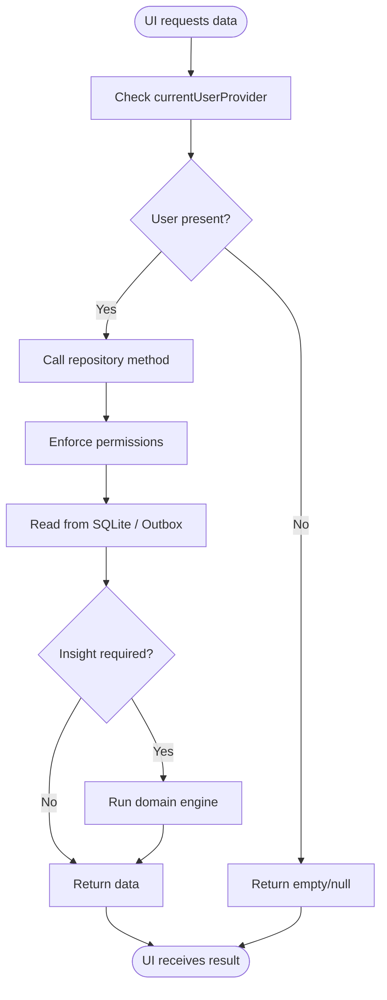
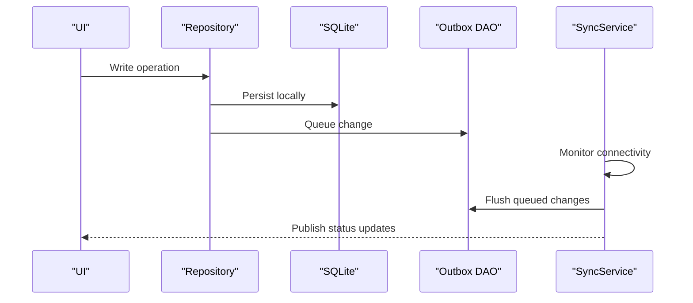
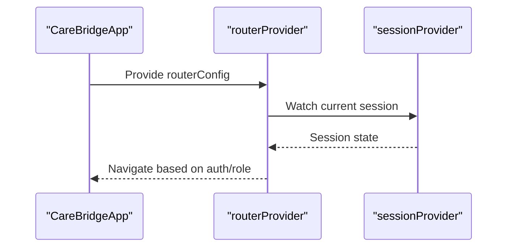
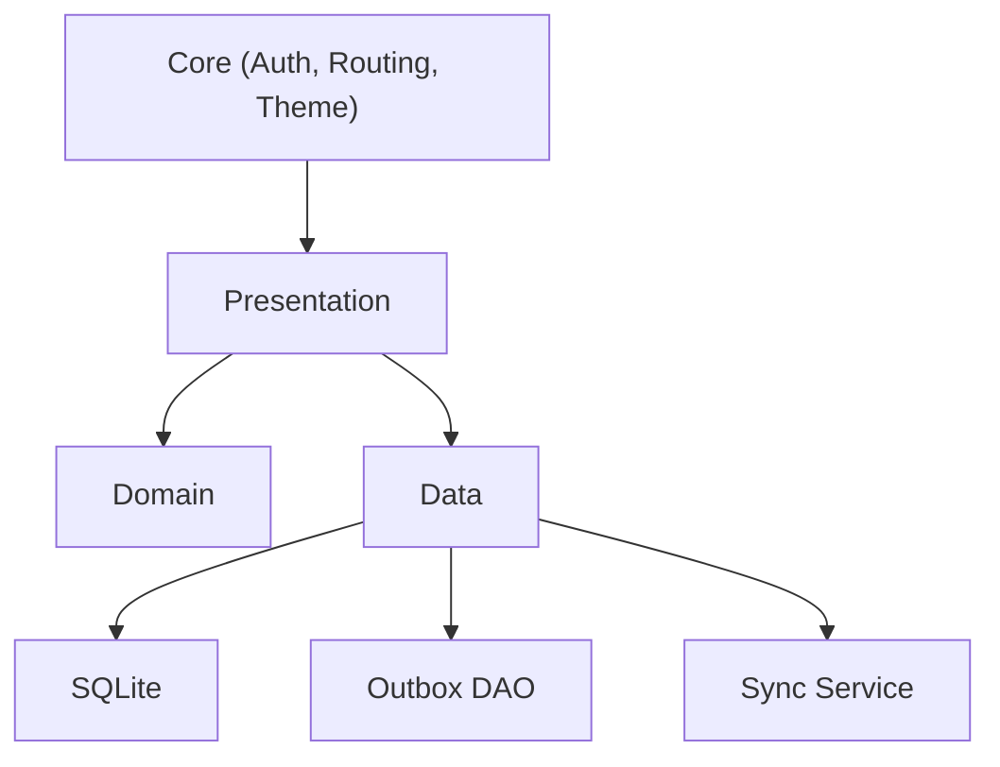

# Architecture Overview

<cite>
**Referenced Files in This Document**
- [main.dart](file://lib/main.dart)
- [providers.dart](file://lib/app/providers.dart)
- [pubspec.yaml](file://pubspec.yaml)
</cite>

## Table of Contents
1. [Introduction](#introduction)
2. [Project Structure](#project-structure)
3. [Core Components](#core-components)
4. [Architecture Overview](#architecture-overview)
5. [Detailed Component Analysis](#detailed-component-analysis)
6. [Dependency Analysis](#dependency-analysis)
7. [Performance Considerations](#performance-considerations)
8. [Troubleshooting Guide](#troubleshooting-guide)
9. [Conclusion](#conclusion)

## Introduction
This document explains CareBridge AI’s clean architecture implementation with a clear separation between Presentation, Domain, and Data layers. It describes how the app uses Repository abstractions to decouple business logic from storage, Riverpod Providers for state management (Provider Pattern), and an Offline-First strategy backed by SQLite with secure credential storage and background synchronization. The goal is to make the system understandable for both technical and non-technical readers while providing concrete diagrams and references to source files.

## Project Structure
At a high level, the application follows a layered structure:
- Presentation: Flutter widgets and routing configuration that consume providers and render UI.
- Domain: Business entities, engines, and enums that encapsulate core logic independent of platform or storage.
- Data: Repositories, local database access (SQLite via sqflite), outbox DAOs, and sync services coordinating offline-first data flows.
- Core: Cross-cutting concerns such as authentication/session, routing, and theming.

The entry point initializes the Riverpod scope, configures routing, and applies the theme. All heavy initialization (database, seeding, sync) is deferred until needed through providers.

[No sources needed since this diagram shows conceptual workflow, not actual code structure]

**Section sources**
- [main.dart:16-34](file://lib/main.dart#L16-L34)
- [pubspec.yaml:12-55](file://pubspec.yaml#L12-L55)

## Core Components
- Application bootstrap and provider wiring: A single file centralizes dependency injection using Riverpod providers. It opens the database, seeds demo data idempotently, and starts the sync service.
- Session and authentication: A session controller and notifier manage sign-in, registration, sign-out, and restoration across app restarts.
- Repositories: Abstractions over local storage and insight computations enforce role-based access control before touching data.
- Sync service: Manages background synchronization and exposes status streams for UI feedback.
- Feature providers: FutureProvider and family providers expose domain queries and computations to the UI layer.

Key responsibilities:
- Presentation consumes providers and renders UI without direct database access.
- Domain contains pure logic (engines) and entity definitions.
- Data implements repositories and persistence; it enforces permissions and orchestrates sync.

**Section sources**
- [providers.dart:1-42](file://lib/app/providers.dart#L1-L42)
- [providers.dart:44-64](file://lib/app/providers.dart#L44-L64)
- [providers.dart:66-128](file://lib/app/providers.dart#L66-L128)
- [providers.dart:137-339](file://lib/app/providers.dart#L137-L339)

## Architecture Overview
The app adheres to Clean Architecture principles:
- Presentation depends on Domain and Data abstractions via Providers.
- Domain remains free of framework and storage details.
- Data implements repositories and persistence mechanisms behind interfaces consumed by the presentation.

**Diagram sources**
- [providers.dart:1-42](file://lib/app/providers.dart#L1-L42)
- [providers.dart:44-64](file://lib/app/providers.dart#L44-L64)
- [providers.dart:66-128](file://lib/app/providers.dart#L66-L128)
- [providers.dart:137-339](file://lib/app/providers.dart#L137-L339)

## Detailed Component Analysis

### Bootstrap and Dependency Injection
- The bootstrap provider ensures the database is ready, seeds demo data once, and starts the sync service.
- Repository providers are exposed for feature use.
- Sync status is streamed to the UI for offline indicators.

**Diagram sources**
- [providers.dart:31-42](file://lib/app/providers.dart#L31-L42)

**Section sources**
- [providers.dart:31-42](file://lib/app/providers.dart#L31-L42)

### Session Management and Authentication
- SessionController handles restore, sign-in, register-and-sign-in, and sign-out.
- SessionNotifier manages state transitions and exposes methods to screens.
- currentUserProvider and linkedHouseholdProvider derive current user context for RBAC.

**Diagram sources**
- [providers.dart:66-128](file://lib/app/providers.dart#L66-L128)

**Section sources**
- [providers.dart:66-128](file://lib/app/providers.dart#L66-L128)

### Repositories and Data Abstraction
- CareRepository and InsightRepository abstract local storage and insight computations.
- They accept the acting AppUser to enforce permission checks before accessing data.
- Feature providers call repository methods to fetch households, members, assessments, growth series, visit history, barriers, contacts, referrals, and insights.

**Diagram sources**
- [providers.dart:137-339](file://lib/app/providers.dart#L137-L339)

**Section sources**
- [providers.dart:137-339](file://lib/app/providers.dart#L137-L339)

### Offline-First Strategy and Background Sync
- SQLite provides local persistence for all operational data.
- Outbox DAO captures changes when offline; sync service reconciles with remote when connectivity is available.
- SyncStatusSummary stream drives offline banner visibility and user feedback.

**Diagram sources**
- [providers.dart:44-64](file://lib/app/providers.dart#L44-L64)

**Section sources**
- [providers.dart:44-64](file://lib/app/providers.dart#L44-L64)

### Routing and Role Guards
- go_router integrates with Riverpod to provide session-driven redirects.
- The router provider owns navigation decisions based on authentication state and roles.

**Diagram sources**
- [main.dart:20-34](file://lib/main.dart#L20-L34)

**Section sources**
- [main.dart:20-34](file://lib/main.dart#L20-L34)

### Technical Decisions
- SQLite (sqflite) for robust local storage with FFI support for desktop testing.
- flutter_secure_storage for secure credentials and PIN storage.
- Riverpod for reactive state management and dependency injection.
- go_router for declarative routing with guards.
- Connectivity awareness to drive sync behavior and offline indicators.

**Section sources**
- [pubspec.yaml:12-55](file://pubspec.yaml#L12-L55)

## Dependency Analysis
The dependency graph emphasizes unidirectional flow: Presentation depends on Domain and Data abstractions; Data depends on storage and sync; Domain remains isolated.

**Diagram sources**
- [providers.dart:1-42](file://lib/app/providers.dart#L1-L42)
- [providers.dart:44-64](file://lib/app/providers.dart#L44-L64)
- [providers.dart:66-128](file://lib/app/providers.dart#L66-L128)
- [providers.dart:137-339](file://lib/app/providers.dart#L137-L339)

**Section sources**
- [providers.dart:1-42](file://lib/app/providers.dart#L1-L42)
- [providers.dart:44-64](file://lib/app/providers.dart#L44-L64)
- [providers.dart:66-128](file://lib/app/providers.dart#L66-L128)
- [providers.dart:137-339](file://lib/app/providers.dart#L137-L339)

## Performance Considerations
- Lazy initialization: Database, seeding, and sync are started only when needed via providers.
- Streamed sync status avoids polling and reduces unnecessary rebuilds.
- Family providers cache results per parameter (e.g., householdId, personId) to prevent redundant queries.
- Permission checks at repository boundaries minimize expensive operations when users lack access.

[No sources needed since this section provides general guidance]

## Troubleshooting Guide
Common issues and resolutions:
- App fails to start due to missing bootstrap: Ensure bootstrapProvider completes before dependent providers.
- Session restoration hangs: Verify secure storage availability and correct PIN handling.
- Offline banner not updating: Confirm sync service publishes status and connectivity monitoring is active.
- Permission errors: Validate AppUser capabilities and ensure repository methods enforce RBAC consistently.

**Section sources**
- [providers.dart:31-42](file://lib/app/providers.dart#L31-L42)
- [providers.dart:66-128](file://lib/app/providers.dart#L66-L128)
- [providers.dart:44-64](file://lib/app/providers.dart#L44-L64)

## Conclusion
CareBridge AI’s architecture cleanly separates concerns across Presentation, Domain, and Data layers, leveraging Riverpod for state management and repositories for data abstraction. The Offline-First strategy ensures resilience in low-connectivity environments, while secure storage and role-based access protect sensitive data. This design supports maintainability, testability, and scalability for community health workflows.

[No sources needed since this section summarizes without analyzing specific files]