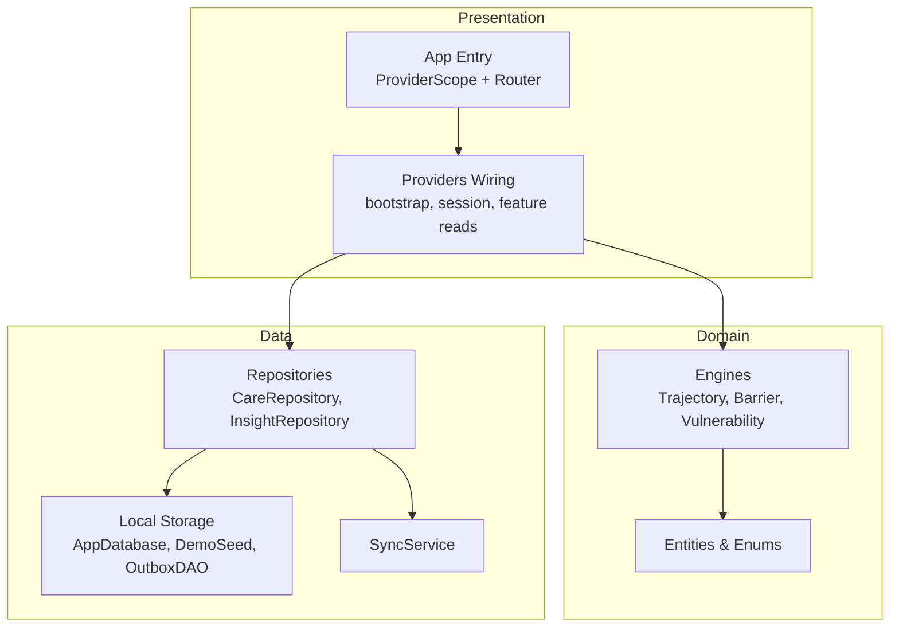
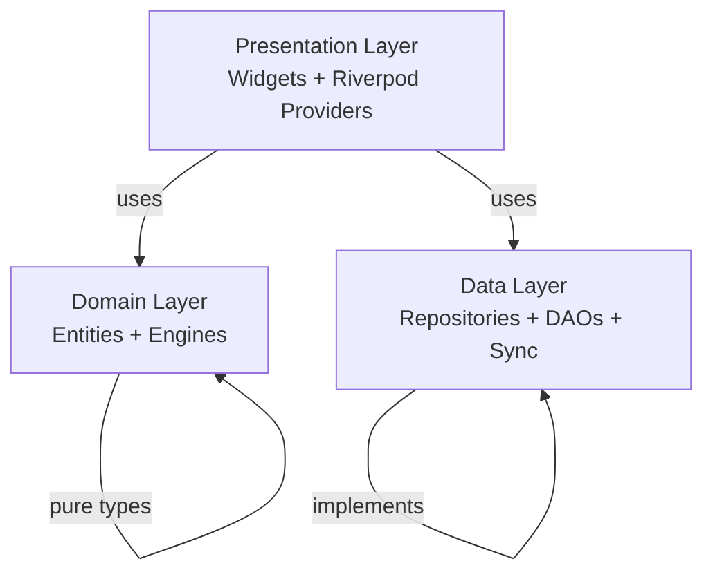
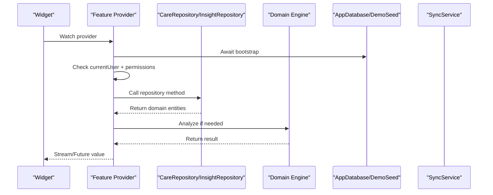
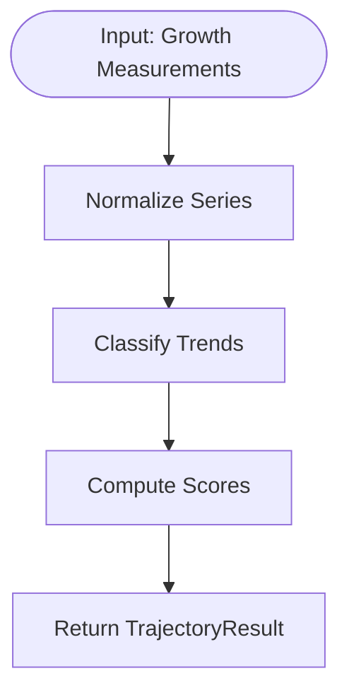
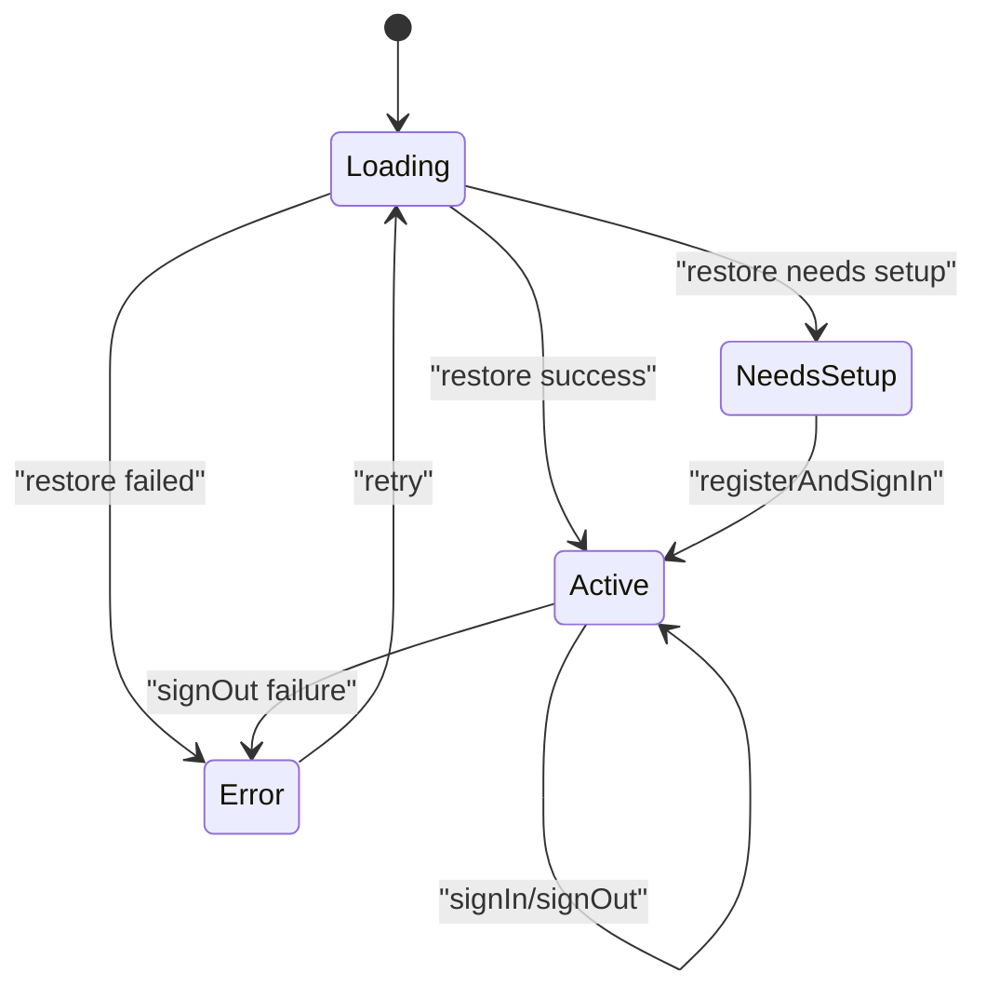
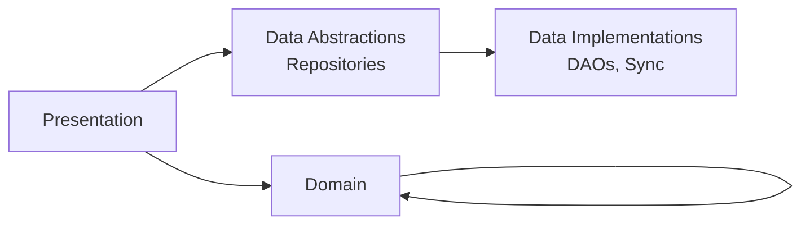

# Clean Architecture Patterns

<cite>
**Referenced Files in This Document**
- [main.dart](file://lib/main.dart)
- [providers.dart](file://lib/app/providers.dart)
</cite>

## Table of Contents
1. [Introduction](#introduction)
2. [Project Structure](#project-structure)
3. [Core Components](#core-components)
4. [Architecture Overview](#architecture-overview)
5. [Detailed Component Analysis](#detailed-component-analysis)
6. [Dependency Analysis](#dependency-analysis)
7. [Performance Considerations](#performance-considerations)
8. [Troubleshooting Guide](#troubleshooting-guide)
9. [Conclusion](#conclusion)

## Introduction
This document explains CareBridge AI’s clean architecture implementation with a strict three-layer separation: Presentation → Domain → Data. It details how each layer depends only on layers below it, the Repository Pattern used to abstract data access, and how providers orchestrate dependencies across layers to maintain a single source of truth. The goal is to make the system testable, maintainable, and scalable for a complex healthcare application serving frontline health workers and caregivers.

## Project Structure
CareBridge AI organizes code into clear architectural layers:
- Presentation (UI and state wiring via Riverpod providers)
- Domain (business logic, entities, and engines)
- Data (repositories, DAOs, local storage, and sync services)

The application entry point initializes the provider scope and delegates routing and theming to core modules. All business and data concerns are resolved through providers, ensuring UI components remain decoupled from infrastructure.



**Diagram sources**
- [main.dart:16-34](file://lib/main.dart#L16-L34)
- [providers.dart:38-56](file://lib/app/providers.dart#L38-L56)

**Section sources**
- [main.dart:16-34](file://lib/main.dart#L16-L34)
- [providers.dart:1-30](file://lib/app/providers.dart#L1-L30)

## Core Components
- Application bootstrap: Initializes database, seeds demo data, and starts sync service before any feature data is requested.
- Session management: Provides a single source of truth for signed-in user state and permissions.
- Feature providers: Encapsulate read operations with permission checks, delegating to repositories and domain engines.
- Repositories: Abstract data access behind interfaces that enforce RBAC and hide DAOs from the UI.
- Domain engines: Pure analysis functions operating on domain entities.

Key responsibilities:
- Presentation: Watches providers, renders UI, triggers actions via notifiers.
- Domain: Defines entities, enums, and analytical engines; no I/O.
- Data: Implements repositories using DAOs and sync services; enforces scope and permissions.

**Section sources**
- [providers.dart:38-56](file://lib/app/providers.dart#L38-L56)
- [providers.dart:68-128](file://lib/app/providers.dart#L68-L128)
- [providers.dart:145-156](file://lib/app/providers.dart#L145-L156)

## Architecture Overview
The clean architecture enforces unidirectional dependencies:
- Presentation depends on Domain and Data abstractions (repositories), never on DAOs or databases.
- Domain depends only on its own entities and pure logic.
- Data implements repositories and interacts with storage and sync services.



**Diagram sources**
- [providers.dart:1-30](file://lib/app/providers.dart#L1-L30)
- [providers.dart:38-56](file://lib/app/providers.dart#L38-L56)

## Detailed Component Analysis

### Provider Orchestration and Single Source of Truth
Providers centralize dependency wiring and ensure consistent behavior across screens:
- Bootstrap provider guarantees DB readiness and seed completion before feature reads.
- Session provider exposes current user and linked household context.
- Feature providers perform permission checks and delegate to repositories or engines.



**Diagram sources**
- [providers.dart:38-42](file://lib/app/providers.dart#L38-L42)
- [providers.dart:145-156](file://lib/app/providers.dart#L145-L156)
- [providers.dart:256-260](file://lib/app/providers.dart#L256-L260)

**Section sources**
- [providers.dart:38-42](file://lib/app/providers.dart#L38-L42)
- [providers.dart:68-128](file://lib/app/providers.dart#L68-L128)
- [providers.dart:145-156](file://lib/app/providers.dart#L145-L156)
- [providers.dart:256-260](file://lib/app/providers.dart#L256-L260)

### Repository Pattern Implementation
Repositories shield UI from database details and enforce RBAC:
- CareRepository: Exposes methods like visibleHouseholds, visitQueue, household, person, maternalRecord, birthRecord, growthSeries, visitHistory, barrierHistory, dueContacts, openReferrals.
- InsightRepository: Exposes analytics and aggregation methods like planDay, scoreHousehold, decliningChildren, zonePatterns, referralCompletion.
- Permission checks occur at repository boundaries, preventing UI bypasses.

```mermaid
classDiagram
class CareRepository {
+visibleHouseholds(user) Household[]
+visitQueue(user, householdId) Person[]
+household(user, id) Household?
+person(user, id) Person?
+maternalRecord(user, personId) MaternalRecord?
+birthRecord(user, personId) BirthRecord?
+growthSeries(user, personId) GrowthMeasurement[]
+visitHistory(user, householdId) Visit[]
+barrierHistory(user, householdId) CareBarrier[]
+dueContacts(user, horizonDays) ScheduledContact[]
+openReferrals(user) Referral[]
}
class InsightRepository {
+planDay(workerId, region, district) DayPlan
+scoreHousehold(id) VulnerabilityScore
+decliningChildren() ({child, trajectory})[]
+zonePatterns() BarrierPattern[]
+referralCompletion() ({issued, arrived, rate})
}
class AppDatabase
class DemoSeed
class OutboxDAO
class SyncService
CareRepository --> AppDatabase : "reads/writes"
CareRepository --> DemoSeed : "seeded data"
CareRepository --> OutboxDAO : "outbox queue"
InsightRepository --> AppDatabase : "aggregates"
InsightRepository --> SyncService : "status/events"
```

**Diagram sources**
- [providers.dart:46-50](file://lib/app/providers.dart#L46-L50)
- [providers.dart:52-56](file://lib/app/providers.dart#L52-L56)
- [providers.dart:160-165](file://lib/app/providers.dart#L160-L165)
- [providers.dart:170-176](file://lib/app/providers.dart#L170-L176)
- [providers.dart:178-185](file://lib/app/providers.dart#L178-L185)
- [providers.dart:194-202](file://lib/app/providers.dart#L194-L202)
- [providers.dart:207-212](file://lib/app/providers.dart#L207-L212)
- [providers.dart:226-231](file://lib/app/providers.dart#L226-L231)
- [providers.dart:234-241](file://lib/app/providers.dart#L234-L241)
- [providers.dart:245-253](file://lib/app/providers.dart#L245-L253)
- [providers.dart:263-268](file://lib/app/providers.dart#L263-L268)
- [providers.dart:272-280](file://lib/app/providers.dart#L272-L280)
- [providers.dart:283-296](file://lib/app/providers.dart#L283-L296)
- [providers.dart:300-305](file://lib/app/providers.dart#L300-L305)
- [providers.dart:310-320](file://lib/app/providers.dart#L310-L320)
- [providers.dart:323-332](file://lib/app/providers.dart#L323-L332)
- [providers.dart:334-338](file://lib/app/providers.dart#L334-L338)

**Section sources**
- [providers.dart:46-50](file://lib/app/providers.dart#L46-L50)
- [providers.dart:160-165](file://lib/app/providers.dart#L160-L165)
- [providers.dart:170-176](file://lib/app/providers.dart#L170-L176)
- [providers.dart:178-185](file://lib/app/providers.dart#L178-L185)
- [providers.dart:194-202](file://lib/app/providers.dart#L194-L202)
- [providers.dart:207-212](file://lib/app/providers.dart#L207-L212)
- [providers.dart:226-231](file://lib/app/providers.dart#L226-L231)
- [providers.dart:234-241](file://lib/app/providers.dart#L234-L241)
- [providers.dart:245-253](file://lib/app/providers.dart#L245-L253)
- [providers.dart:263-268](file://lib/app/providers.dart#L263-L268)
- [providers.dart:272-280](file://lib/app/providers.dart#L272-L280)
- [providers.dart:283-296](file://lib/app/providers.dart#L283-L296)
- [providers.dart:300-305](file://lib/app/providers.dart#L300-L305)
- [providers.dart:310-320](file://lib/app/providers.dart#L310-L320)
- [providers.dart:323-332](file://lib/app/providers.dart#L323-L332)
- [providers.dart:334-338](file://lib/app/providers.dart#L334-L338)

### Domain Engines and Entities
Domain engines encapsulate pure analysis logic:
- TrajectoryEngine.analyse computes child growth trajectories.
- BarrierEngine and VulnerabilityEngine provide risk assessments.
- Entities and enums define stable contracts between layers.



**Diagram sources**
- [providers.dart:256-260](file://lib/app/providers.dart#L256-L260)

**Section sources**
- [providers.dart:256-260](file://lib/app/providers.dart#L256-L260)

### Session and Permissions
Session management provides a single source of truth for authentication and authorization:
- SessionController manages restore, sign-in, register, sign-out flows.
- SessionNotifier exposes reactive state transitions.
- currentUserProvider and linkedHouseholdProvider derive context from session state.
- Permission checks are enforced in feature providers before data access.



**Diagram sources**
- [providers.dart:68-128](file://lib/app/providers.dart#L68-L128)

**Section sources**
- [providers.dart:68-128](file://lib/app/providers.dart#L68-L128)

## Dependency Analysis
Strict dependency rules prevent circular dependencies:
- Presentation depends on Domain and Data abstractions only.
- Domain has no dependencies on Presentation or Data.
- Data implements abstractions and depends on lower-level infrastructure.



**Diagram sources**
- [providers.dart:1-30](file://lib/app/providers.dart#L1-L30)

**Section sources**
- [providers.dart:1-30](file://lib/app/providers.dart#L1-L30)

## Performance Considerations
- Lazy initialization: Database and sync start only when needed via bootstrap provider.
- Caching: Riverpod providers cache results, avoiding redundant queries.
- Stream-based updates: Sync status streams keep UI informed without polling.
- Scoped queries: Permission checks minimize unnecessary data retrieval.

[No sources needed since this section provides general guidance]

## Troubleshooting Guide
Common issues and resolutions:
- Missing bootstrap: Ensure bootstrapProvider completes before feature providers run.
- Permission errors: Verify currentUser and role-based permissions in providers.
- Sync failures: Monitor syncStatusProvider for offline banners and retry logic.
- Seed conflicts: DemoSeed ensures idempotent seeding to avoid duplicate records.

**Section sources**
- [providers.dart:38-42](file://lib/app/providers.dart#L38-L42)
- [providers.dart:52-56](file://lib/app/providers.dart#L52-L56)
- [providers.dart:145-156](file://lib/app/providers.dart#L145-L156)

## Conclusion
CareBridge AI’s clean architecture delivers a robust foundation for healthcare applications by enforcing strict layer separation, implementing the Repository Pattern for data abstraction, and leveraging providers for dependency orchestration. This design enables testing through isolated components, maintainability through clear boundaries, and scalability through modular features. The single source of truth principle ensures consistency across the application while supporting complex workflows for frontline health workers and caregivers.

[No sources needed since this section summarizes without analyzing specific files]