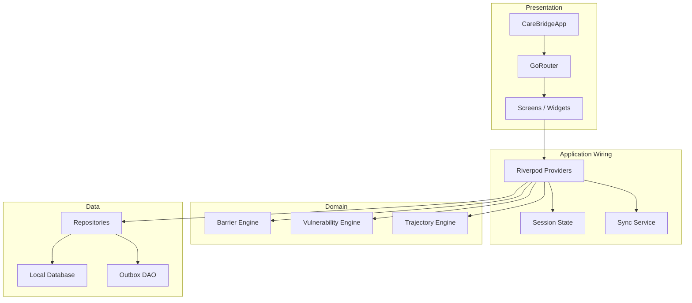
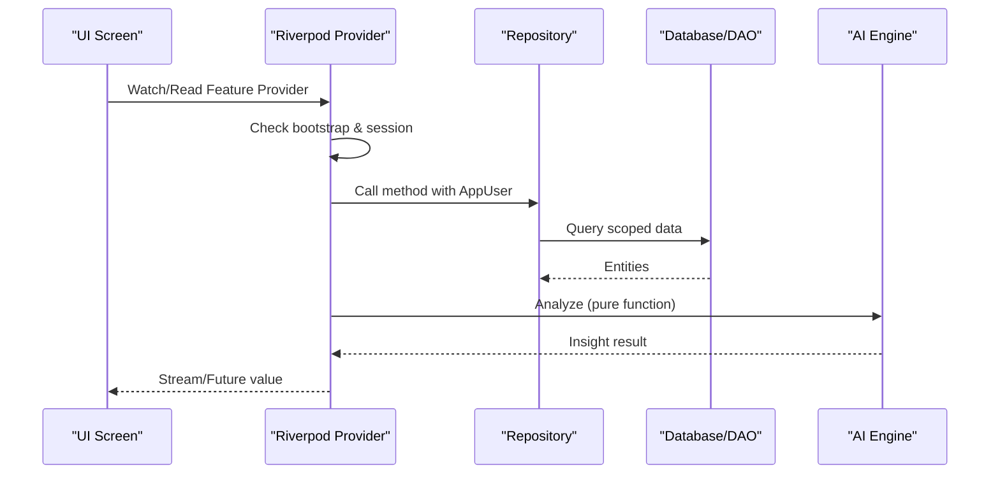
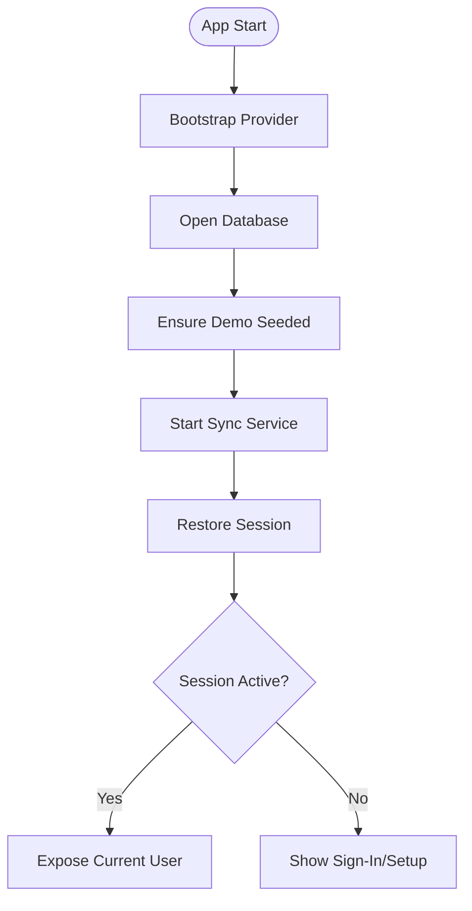
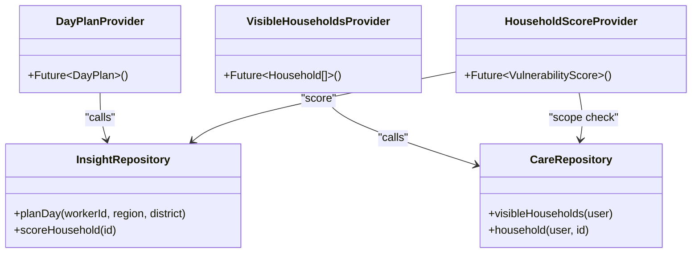
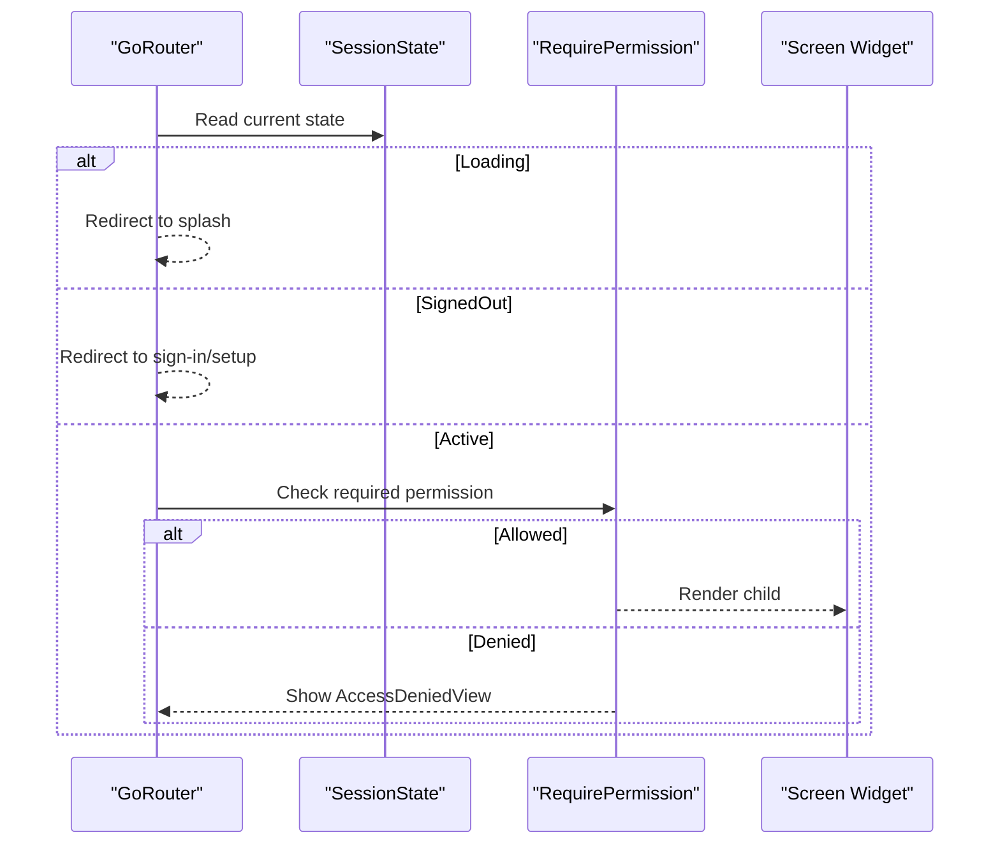
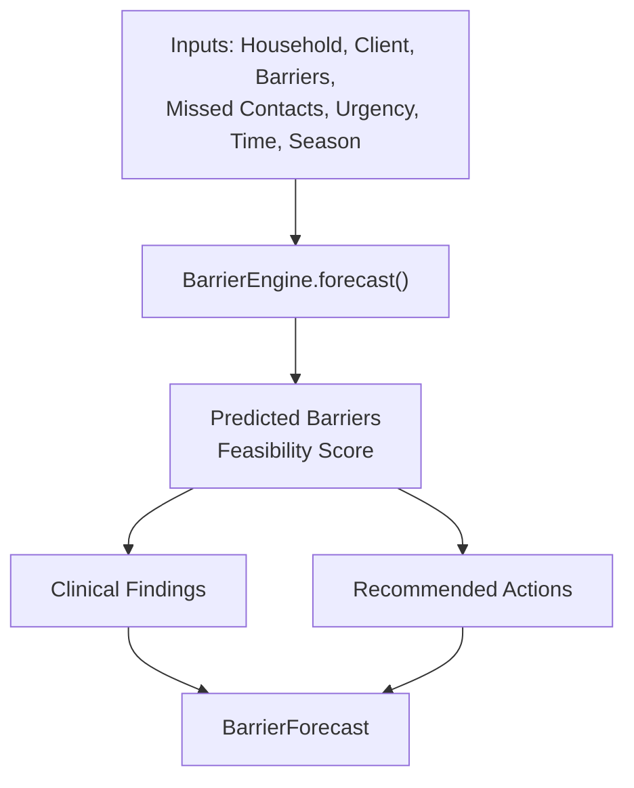
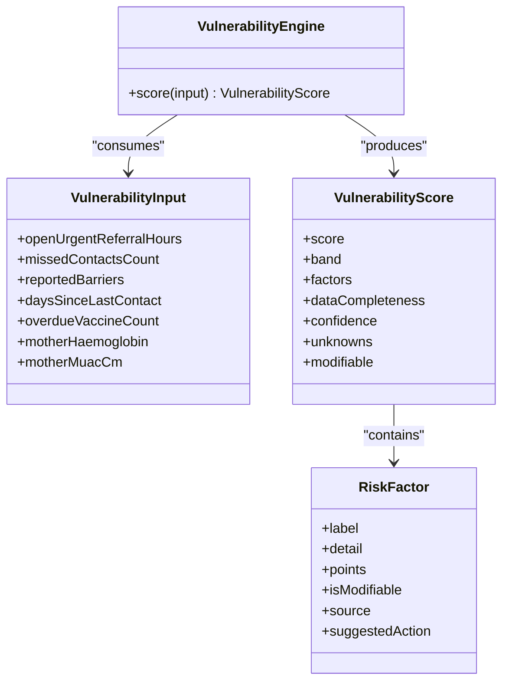
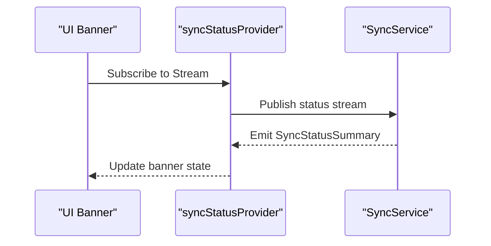
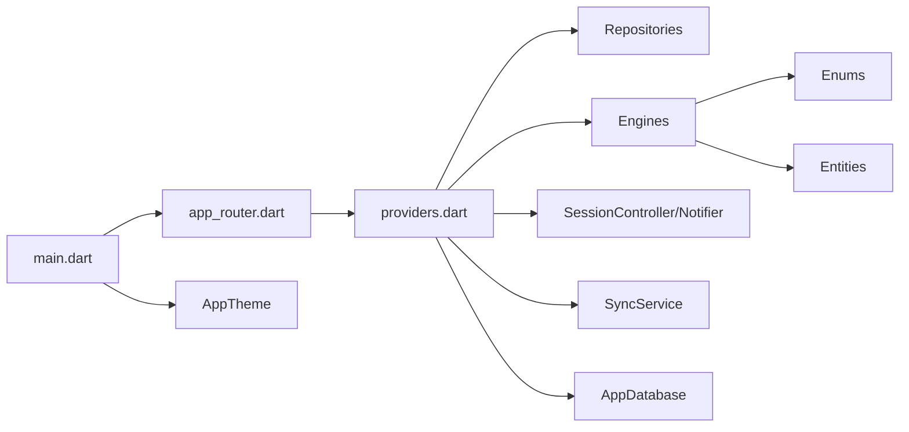

# Component Interaction Patterns

<cite>
**Referenced Files in This Document**
- [main.dart](file://lib/main.dart)
- [providers.dart](file://lib/app/providers.dart)
- [app_router.dart](file://lib/core/router/app_router.dart)
- [barrier_engine.dart](file://lib/domain/engines/barrier_engine.dart)
- [vulnerability_engine.dart](file://lib/domain/engines/vulnerability_engine.dart)
</cite>

## Table of Contents
1. [Introduction](#introduction)
2. [Project Structure](#project-structure)
3. [Core Components](#core-components)
4. [Architecture Overview](#architecture-overview)
5. [Detailed Component Analysis](#detailed-component-analysis)
6. [Dependency Analysis](#dependency-analysis)
7. [Performance Considerations](#performance-considerations)
8. [Troubleshooting Guide](#troubleshooting-guide)
9. [Conclusion](#conclusion)

## Introduction
This document explains how CareBridge AI’s UI components interact with domain engines through repositories, emphasizing separation of concerns between presentation logic and business rules. It details the routing system’s role in navigation and permission enforcement, and shows how AI engines (barrier prediction, vulnerability scoring) integrate via well-defined interfaces. The guide also covers event-driven communication patterns, dependency injection using Riverpod, service coordination, and cross-cutting concerns such as logging, error propagation, and performance monitoring across component boundaries.

## Project Structure
CareBridge AI follows a layered architecture:
- Presentation layer: Flutter widgets and screens that render UI and handle user interactions.
- Application wiring: Riverpod providers that wire dependencies, enforce permissions, and expose data streams to the UI.
- Domain layer: Pure business logic and AI engines (e.g., barrier prediction, vulnerability scoring).
- Data layer: Repositories and DAOs for persistence and synchronization.

The application entry point initializes the dependency container, configures routing, and applies theming. Providers centralize dependency resolution and orchestrate bootstrapping, session management, and feature-specific data loading.

**Diagram sources**
- [main.dart:16-34](file://lib/main.dart#L16-L34)
- [providers.dart:38-64](file://lib/app/providers.dart#L38-L64)
- [app_router.dart:63-159](file://lib/core/router/app_router.dart#L63-L159)

**Section sources**
- [main.dart:16-34](file://lib/main.dart#L16-L34)
- [providers.dart:1-339](file://lib/app/providers.dart#L1-L339)
- [app_router.dart:1-221](file://lib/core/router/app_router.dart#L1-L221)

## Core Components
- Dependency Injection and Bootstrapping: A single provider file wires database initialization, demo seeding, sync service lifecycle, and exposes repositories and features to the UI.
- Session Management: Centralized session state drives authentication flow, restoration, and current user context used by all providers.
- Routing and Permission Enforcement: GoRouter-based routing enforces coarse role separation and fine-grained capability checks at route boundaries.
- AI Engines: Barrier prediction and vulnerability scoring are implemented as pure domain logic exposed via static APIs consumed by providers.

Key responsibilities:
- Providers encapsulate permission checks and repository calls; screens never touch DAOs directly.
- Engines compute insights without side effects, making them testable and reusable.
- Routing ensures users cannot access unauthorized screens while still deferring final authorization to repositories.

**Section sources**
- [providers.dart:38-64](file://lib/app/providers.dart#L38-L64)
- [providers.dart:68-122](file://lib/app/providers.dart#L68-L122)
- [app_router.dart:63-159](file://lib/core/router/app_router.dart#L63-L159)
- [barrier_engine.dart:110-396](file://lib/domain/engines/barrier_engine.dart#L110-L396)
- [vulnerability_engine.dart:83-110](file://lib/domain/engines/vulnerability_engine.dart#L83-L110)

## Architecture Overview
The system separates presentation from business logic through clear boundaries:
- UI components subscribe to Riverpod providers for data and actions.
- Providers enforce permissions and call repositories.
- Repositories coordinate DAOs and sync services, returning domain entities.
- Domain engines provide deterministic analysis over inputs.

**Diagram sources**
- [providers.dart:145-156](file://lib/app/providers.dart#L145-L156)
- [providers.dart:194-202](file://lib/app/providers.dart#L194-L202)
- [barrier_engine.dart:110-396](file://lib/domain/engines/barrier_engine.dart#L110-L396)
- [vulnerability_engine.dart:83-110](file://lib/domain/engines/vulnerability_engine.dart#L83-L110)

## Detailed Component Analysis

### Dependency Injection and Session Flow
Riverpod is used to manage lifecycles and inject dependencies. The bootstrap provider opens the database, seeds demo data idempotently, and starts the sync service. Session state transitions drive UI routing and availability of current user context.

**Diagram sources**
- [providers.dart:38-42](file://lib/app/providers.dart#L38-L42)
- [providers.dart:68-122](file://lib/app/providers.dart#L68-L122)

**Section sources**
- [providers.dart:38-42](file://lib/app/providers.dart#L38-L42)
- [providers.dart:68-122](file://lib/app/providers.dart#L68-L122)

### Repository-Guarded Feature Providers
Feature providers perform permission checks before invoking repositories. This pattern ensures that UI code remains free of RBAC logic and that all data access goes through a controlled boundary.

**Diagram sources**
- [providers.dart:145-156](file://lib/app/providers.dart#L145-L156)
- [providers.dart:160-165](file://lib/app/providers.dart#L160-L165)
- [providers.dart:194-202](file://lib/app/providers.dart#L194-L202)

**Section sources**
- [providers.dart:145-156](file://lib/app/providers.dart#L145-L156)
- [providers.dart:160-165](file://lib/app/providers.dart#L160-L165)
- [providers.dart:194-202](file://lib/app/providers.dart#L194-L202)

### Routing and Permission Enforcement
Routing enforces coarse role separation and uses a capability wrapper to gate screen access. Redirect logic keeps visible screens consistent with session state.

**Diagram sources**
- [app_router.dart:63-159](file://lib/core/router/app_router.dart#L63-L159)
- [app_router.dart:167-196](file://lib/core/router/app_router.dart#L167-L196)

**Section sources**
- [app_router.dart:63-159](file://lib/core/router/app_router.dart#L63-L159)
- [app_router.dart:167-196](file://lib/core/router/app_router.dart#L167-L196)

### Barrier Prediction Engine Integration
The barrier engine predicts likely barriers to care completion and aggregates patterns across households. Providers consume this engine to enrich insights and surface actionable recommendations.

**Diagram sources**
- [barrier_engine.dart:110-396](file://lib/domain/engines/barrier_engine.dart#L110-L396)

**Section sources**
- [barrier_engine.dart:110-396](file://lib/domain/engines/barrier_engine.dart#L110-L396)

### Vulnerability Scoring Engine Integration
Vulnerability scoring computes a risk band and score based on multiple factors, including modifiable drivers and data completeness. Providers use this to rank households and prioritize visits.

**Diagram sources**
- [vulnerability_engine.dart:83-110](file://lib/domain/engines/vulnerability_engine.dart#L83-L110)

**Section sources**
- [vulnerability_engine.dart:83-110](file://lib/domain/engines/vulnerability_engine.dart#L83-L110)

### Event-Driven Communication and Service Coordination
- Status Streams: Sync status is exposed as a stream provider so UI can reactively update banners or indicators.
- Session Events: Session state changes trigger router refresh and UI rebuilds.
- Provider Families: Parameterized providers enable per-entity data fetching with automatic caching and invalidation.

**Diagram sources**
- [providers.dart:52-64](file://lib/app/providers.dart#L52-L64)

**Section sources**
- [providers.dart:52-64](file://lib/app/providers.dart#L52-L64)

## Dependency Analysis
The following diagram maps key dependencies among core files and components:

**Diagram sources**
- [main.dart:16-34](file://lib/main.dart#L16-L34)
- [app_router.dart:63-159](file://lib/core/router/app_router.dart#L63-L159)
- [providers.dart:1-339](file://lib/app/providers.dart#L1-L339)
- [barrier_engine.dart:1-534](file://lib/domain/engines/barrier_engine.dart#L1-L534)
- [vulnerability_engine.dart:83-110](file://lib/domain/engines/vulnerability_engine.dart#L83-L110)

**Section sources**
- [main.dart:16-34](file://lib/main.dart#L16-L34)
- [app_router.dart:63-159](file://lib/core/router/app_router.dart#L63-L159)
- [providers.dart:1-339](file://lib/app/providers.dart#L1-L339)

## Performance Considerations
- Lazy Initialization: Bootstrap provider ensures heavy operations (database open, seeding, sync start) occur once and are awaited before dependent providers resolve.
- Caching and Reuse: Riverpod caches FutureProvider results and reuses Notifier instances to avoid redundant work.
- Stream-Based Updates: Sync status and session changes propagate efficiently via streams and listeners.
- Scoped Queries: Repositories scope queries by user and household to minimize data transfer and processing.

[No sources needed since this section provides general guidance]

## Troubleshooting Guide
Common issues and resolutions:
- Unauthorized Access: If a screen is inaccessible, verify both route-level RequirePermission and repository-level permission checks. Ensure the current user has the required capability.
- Missing Data: When providers return empty lists, confirm bootstrap has completed and the user context is available. Check repository scoping rules.
- Stale UI State: Ensure providers are subscribed correctly and that streams are not prematurely disposed. Verify that session changes trigger router refresh.
- Sync Failures: Monitor sync status stream for errors and implement retry logic where appropriate.

**Section sources**
- [app_router.dart:167-196](file://lib/core/router/app_router.dart#L167-L196)
- [providers.dart:52-64](file://lib/app/providers.dart#L52-L64)

## Conclusion
CareBridge AI achieves clear separation of concerns by delegating business logic to domain engines and enforcing permissions through repositories and routing. Riverpod provides robust dependency injection and reactive state management, enabling scalable and maintainable interactions between UI and backend services. The barrier prediction and vulnerability scoring engines integrate seamlessly via well-defined interfaces, supporting actionable insights for frontline health workers.

[No sources needed since this section summarizes without analyzing specific files]