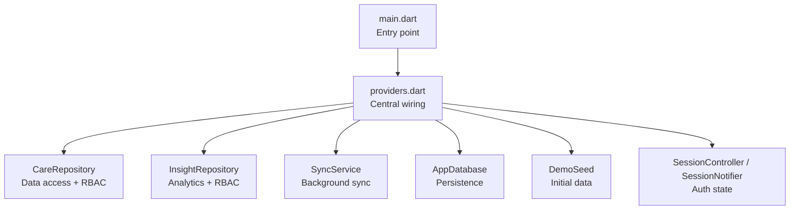
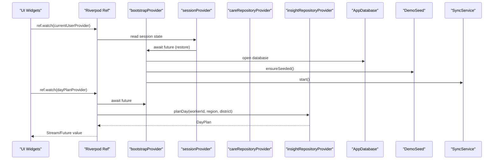
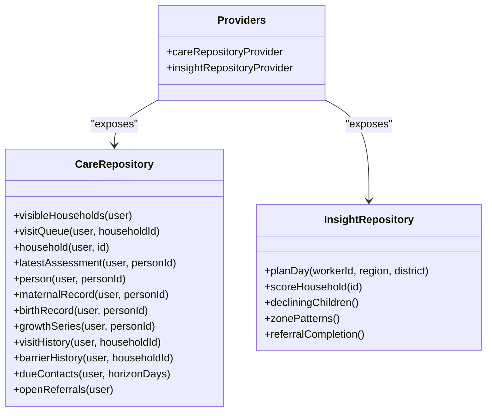
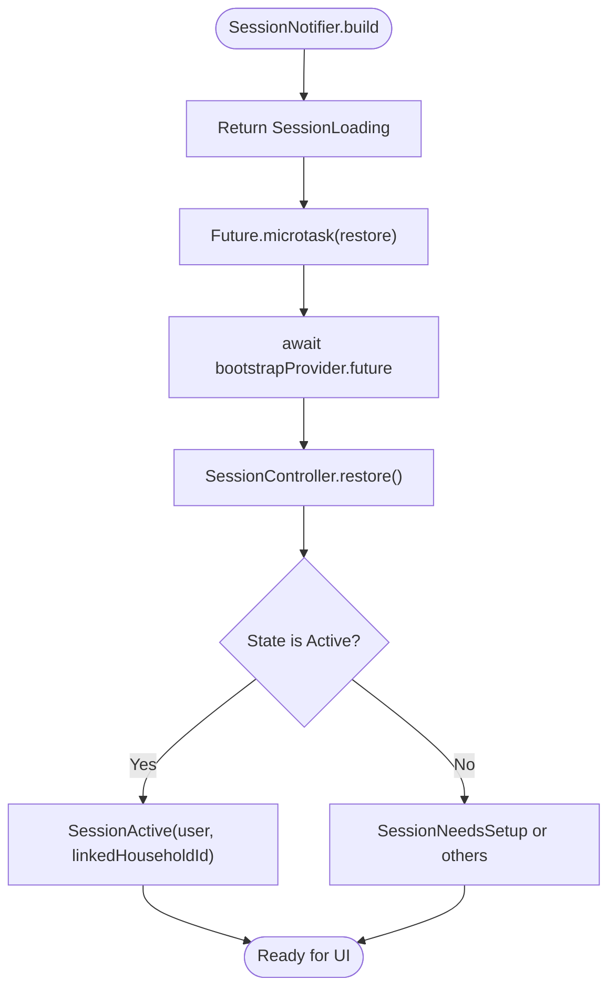
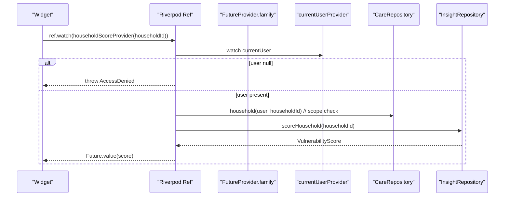
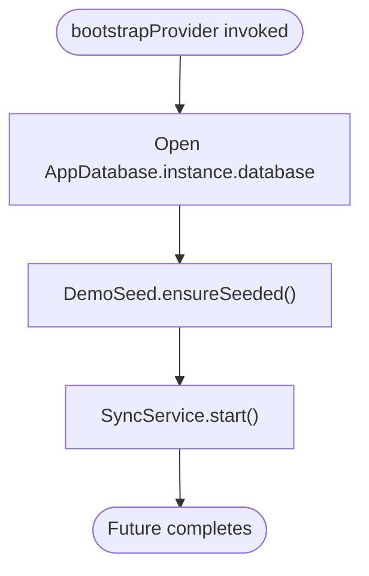
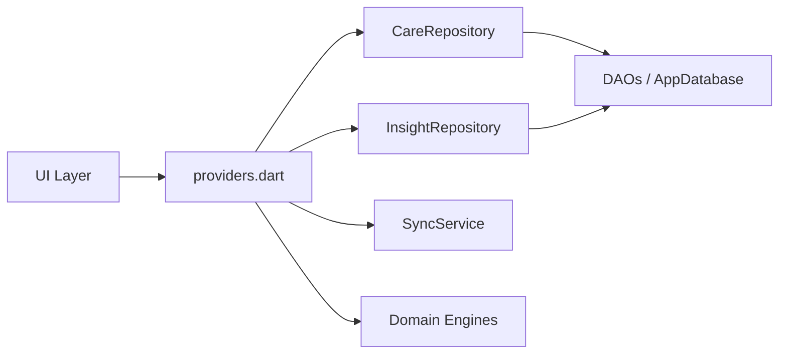

# Dependency Injection Patterns

<cite>
**Referenced Files in This Document**
- [main.dart](file://lib/main.dart)
- [providers.dart](file://lib/app/providers.dart)
- [care_repository.dart](file://lib/data/repositories/care_repository.dart)
- [insight_repository.dart](file://lib/data/repositories/insight_repository.dart)
</cite>

## Table of Contents
1. [Introduction](#introduction)
2. [Project Structure](#project-structure)
3. [Core Components](#core-components)
4. [Architecture Overview](#architecture-overview)
5. [Detailed Component Analysis](#detailed-component-analysis)
6. [Dependency Analysis](#dependency-analysis)
7. [Performance Considerations](#performance-considerations)
8. [Troubleshooting Guide](#troubleshooting-guide)
9. [Conclusion](#conclusion)

## Introduction
This document explains how CareBridge AI uses Riverpod for dependency injection and application wiring. The central file providers.dart defines the entire provider graph, ensuring that UI components never access data access objects directly. Repositories abstract storage and enforce permission checks using the current AppUser context. The bootstrapProvider initializes the database, seeds demo data, and starts the sync service so all other providers can rely on a consistent environment.

## Project Structure
At runtime, main.dart creates a ProviderScope and renders the app shell. All dependencies are wired in providers.dart and consumed by widgets through Riverpod’s reactive APIs. The repository layer sits between UI and persistence, enforcing role-based access control (RBAC) and encapsulating DAO usage.

**Diagram sources**
- [main.dart:16-18](file://lib/main.dart#L16-L18)
- [providers.dart:38-42](file://lib/app/providers.dart#L38-L42)
- [providers.dart:46-56](file://lib/app/providers.dart#L46-L56)
- [providers.dart:68-75](file://lib/app/providers.dart#L68-L75)

**Section sources**
- [main.dart:16-18](file://lib/main.dart#L16-L18)
- [providers.dart:1-30](file://lib/app/providers.dart#L1-L30)

## Core Components
- bootstrapProvider: Initializes the database, ensures demo seeding, and starts the sync service. It is awaited by session restoration and feature providers to guarantee readiness.
- Repository providers: careRepositoryProvider and insightRepositoryProvider expose singletons used across the app. They encapsulate DAO calls and enforce permissions via AppUser.
- Sync service: syncServiceProvider manages lifecycle and exposes status streams; syncStatusProvider publishes current sync summary.
- Session management: sessionControllerProvider and sessionProvider manage authentication state with NotifierProvider. currentUserProvider and linkedHouseholdProvider derive scoped identity from session.
- Feature providers: FutureProvider and FutureProvider.family instances perform async reads with explicit permission checks before accessing repositories.

**Section sources**
- [providers.dart:38-42](file://lib/app/providers.dart#L38-L42)
- [providers.dart:46-56](file://lib/app/providers.dart#L46-L56)
- [providers.dart:60-64](file://lib/app/providers.dart#L60-L64)
- [providers.dart:68-75](file://lib/app/providers.dart#L68-L75)
- [providers.dart:125-135](file://lib/app/providers.dart#L125-L135)
- [providers.dart:145-156](file://lib/app/providers.dart#L145-L156)

## Architecture Overview
Riverpod provides a centralized dependency graph. UI layers depend only on providers; repositories hide DAOs and enforce RBAC. Bootstrap ensures infrastructure is ready before any business logic runs.

**Diagram sources**
- [providers.dart:38-42](file://lib/app/providers.dart#L38-L42)
- [providers.dart:73-92](file://lib/app/providers.dart#L73-L92)
- [providers.dart:145-156](file://lib/app/providers.dart#L145-L156)

## Detailed Component Analysis

### Central Wiring: providers.dart
- Single-file design keeps the dependency graph visible and auditable.
- Enforces architectural boundaries: no widget imports DAOs; screens consume repositories instead.
- Permission checks occur early in feature providers using AppUser context.

Key responsibilities:
- Bootstrapping: database initialization, demo seeding, sync startup.
- Repository exposure: singleton providers for CareRepository and InsightRepository.
- Session state: NotifierProvider-driven auth flow with restoration.
- Feature queries: FutureProvider and family variants parameterized by IDs.

**Section sources**
- [providers.dart:1-13](file://lib/app/providers.dart#L1-L13)
- [providers.dart:38-42](file://lib/app/providers.dart#L38-L42)
- [providers.dart:46-56](file://lib/app/providers.dart#L46-L56)
- [providers.dart:68-75](file://lib/app/providers.dart#L68-L75)

### Repository Interfaces and Implementations
Repositories abstract data access and enforce RBAC. They accept the acting AppUser and validate permissions before invoking DAOs.

- CareRepository: household visibility, visit queues, person records, assessments, growth series, barriers, contacts, referrals.
- InsightRepository: day planning, vulnerability scoring, declining children analysis, zone barrier patterns, referral completion metrics.

**Diagram sources**
- [providers.dart:46-50](file://lib/app/providers.dart#L46-L50)
- [care_repository.dart:1-200](file://lib/data/repositories/care_repository.dart#L1-L200)
- [insight_repository.dart:1-200](file://lib/data/repositories/insight_repository.dart#L1-L200)

**Section sources**
- [providers.dart:46-50](file://lib/app/providers.dart#L46-L50)
- [care_repository.dart:1-200](file://lib/data/repositories/care_repository.dart#L1-L200)
- [insight_repository.dart:1-200](file://lib/data/repositories/insight_repository.dart#L1-L200)

### Session Management with NotifierProvider
The session state machine drives navigation and availability of user-scoped data. Restoration waits for bootstrap to complete, ensuring the database and sync are ready.

**Diagram sources**
- [providers.dart:73-92](file://lib/app/providers.dart#L73-L92)
- [providers.dart:38-42](file://lib/app/providers.dart#L38-L42)

**Section sources**
- [providers.dart:73-92](file://lib/app/providers.dart#L73-L92)

### Async Reads with FutureProvider and Family
Feature providers encapsulate permission checks and repository calls. Family providers enable parameterized queries keyed by identifiers such as householdId or personId.

Examples:
- dayPlanProvider: requires planVisitRoute permission.
- visibleHouseholdsProvider: returns households based on user role.
- householdMembersProvider: visit queue per household.
- householdScoreProvider: enforces scope via CareRepository.household before computing score.
- trajectoryProvider: composes growth series with TrajectoryEngine.

**Diagram sources**
- [providers.dart:194-202](file://lib/app/providers.dart#L194-L202)
- [providers.dart:145-156](file://lib/app/providers.dart#L145-L156)
- [providers.dart:160-165](file://lib/app/providers.dart#L160-L165)
- [providers.dart:169-176](file://lib/app/providers.dart#L169-L176)
- [providers.dart:256-260](file://lib/app/providers.dart#L256-L260)

**Section sources**
- [providers.dart:145-156](file://lib/app/providers.dart#L145-L156)
- [providers.dart:160-165](file://lib/app/providers.dart#L160-L165)
- [providers.dart:169-176](file://lib/app/providers.dart#L169-L176)
- [providers.dart:194-202](file://lib/app/providers.dart#L194-L202)
- [providers.dart:256-260](file://lib/app/providers.dart#L256-L260)

### Bootstrap Lifecycle
bootstrapProvider coordinates three critical steps:
- Open AppDatabase instance.
- Ensure demo seed exists without overwriting real data.
- Start SyncService and publish its status stream.

**Diagram sources**
- [providers.dart:38-42](file://lib/app/providers.dart#L38-L42)

**Section sources**
- [providers.dart:38-42](file://lib/app/providers.dart#L38-L42)

## Dependency Analysis
The provider graph enforces clear boundaries:
- UI depends only on providers.
- Repositories depend on DAOs and entities.
- Engines operate on domain models without direct storage access.
- SyncService is independent but initialized during bootstrap.

**Diagram sources**
- [providers.dart:1-30](file://lib/app/providers.dart#L1-L30)
- [providers.dart:46-56](file://lib/app/providers.dart#L46-L56)

**Section sources**
- [providers.dart:1-30](file://lib/app/providers.dart#L1-L30)
- [providers.dart:46-56](file://lib/app/providers.dart#L46-L56)

## Performance Considerations
- Use FutureProvider.family for parameterized queries to avoid redundant computations and leverage caching semantics.
- Compose providers to reuse results (e.g., trajectoryProvider reuses growthSeriesProvider).
- Defer heavy work behind bootstrapProvider to prevent blocking initial UI rendering.
- Prefer ref.read for one-time reads inside providers to avoid unnecessary rebuilds.

[No sources needed since this section provides general guidance]

## Troubleshooting Guide
Common issues and resolutions:
- AccessDenied exceptions: Occur when currentUser is null or lacks required permissions. Ensure bootstrapProvider has completed and the session is active.
- Empty lists where data is expected: Verify the user’s role and scope; some providers return empty arrays for unauthorized users rather than errors.
- Stale or missing data: Confirm that bootstrapProvider is awaited before reading dependent providers. Check sync status via syncStatusProvider.

**Section sources**
- [providers.dart:145-156](file://lib/app/providers.dart#L145-L156)
- [providers.dart:160-165](file://lib/app/providers.dart#L160-L165)
- [providers.dart:194-202](file://lib/app/providers.dart#L194-L202)

## Conclusion
CareBridge AI’s dependency injection strategy centers on a single providers.dart file that wires repositories, services, and session state. Repositories enforce RBAC and shield UI from DAOs. Riverpod’s FutureProvider and NotifierProvider deliver robust async and state management patterns. The bootstrapProvider guarantees a consistent environment, enabling reliable feature providers and clean architectural boundaries.