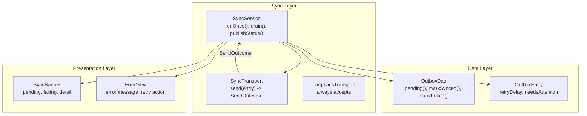
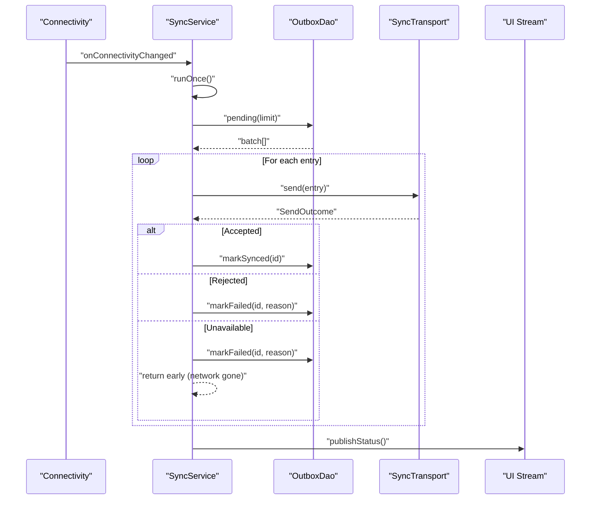
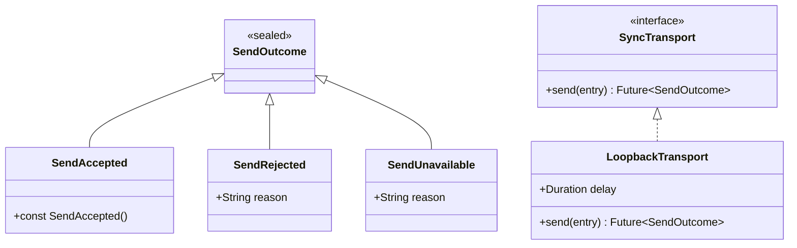
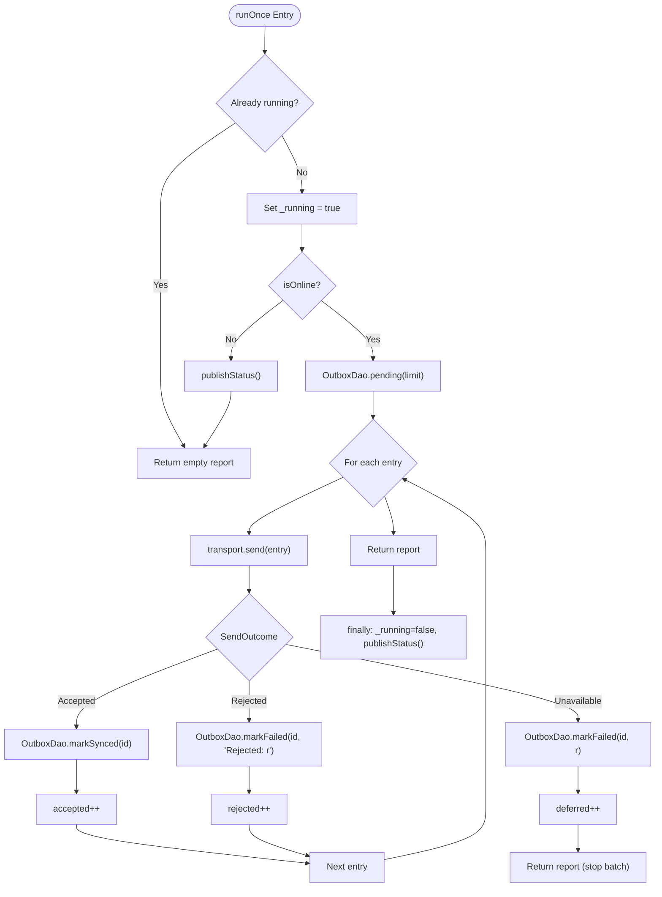
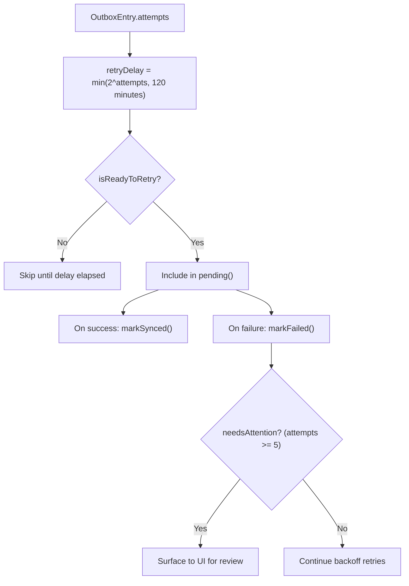
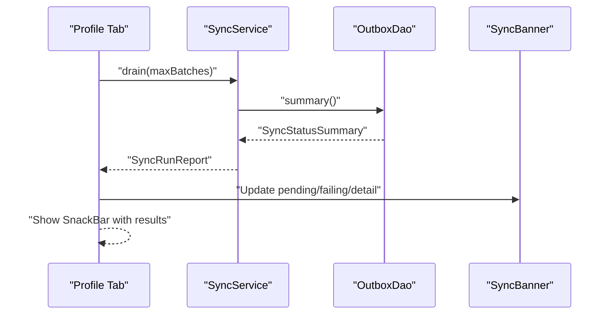
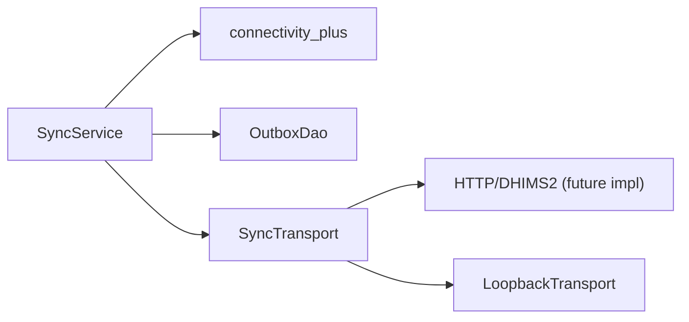

# Error Handling Strategies

<cite>
**Referenced Files in This Document**
- [sync_service.dart](file://lib/data/sync/sync_service.dart)
- [outbox_dao.dart](file://lib/data/local/outbox_dao.dart)
- [ui.dart](file://lib/presentation/shared/ui.dart)
- [profile_tab.dart](file://lib/presentation/fhw/profile_tab.dart)
</cite>

## Table of Contents
1. Introduction
2. Project Structure
3. Core Components
4. Architecture Overview
5. Detailed Component Analysis
6. Dependency Analysis
7. Performance Considerations
8. Troubleshooting Guide
9. Conclusion

## Introduction
This document explains the error handling strategies in CareBridge AI’s event-driven communication system, focusing on how SyncService processes failures and propagates them to the UI. It covers:
- How SendAccepted, SendRejected, and SendUnavailable represent different failure modes
- Retry mechanisms with exponential backoff and capped delays
- User-facing messaging via a non-blocking sync banner and error views
- Batch operation partial failures and data consistency guarantees
- Logging and debugging approaches for sync issues
- Graceful degradation when connectivity is lost

The design ensures that offline-first operations are resilient, prioritized, and transparent to users without blocking clinical workflows.

## Project Structure
At the core of error handling are three layers:
- Data layer: Outbox DAO manages queued records, retry state, and persistence
- Sync service: Orchestrates sending, handles outcomes, and publishes status
- Presentation layer: Displays user-friendly messages and actions

**Diagram sources**
- [sync_service.dart:96-257](file://lib/data/sync/sync_service.dart#L96-L257)
- [outbox_dao.dart:49-95](file://lib/data/local/outbox_dao.dart#L49-L95)
- [outbox_dao.dart:160-276](file://lib/data/local/outbox_dao.dart#L160-L276)
- [ui.dart:356-415](file://lib/presentation/shared/ui.dart#L356-L415)
- [ui.dart:677-692](file://lib/presentation/shared/ui.dart#L677-L692)

**Section sources**
- [sync_service.dart:1-257](file://lib/data/sync/sync_service.dart#L1-L257)
- [outbox_dao.dart:1-277](file://lib/data/local/outbox_dao.dart#L1-L277)
- [ui.dart:356-415](file://lib/presentation/shared/ui.dart#L356-L415)
- [ui.dart:677-692](file://lib/presentation/shared/ui.dart#L677-L692)

## Core Components
- SendOutcome sealed hierarchy:
  - SendAccepted: success path; record marked synced
  - SendRejected: server rejection; stop retrying and surface to human
  - SendUnavailable: network failure; defer retry with backoff
- SyncTransport interface: abstraction over network transport (HTTP/DHIMS2), with LoopbackTransport for testing
- SyncService: orchestrates batched sends, re-entrancy guard, connectivity checks, and status publishing
- OutboxDao: persists outbox entries, tracks attempts, last errors, and computes retry readiness
- UI components: SyncBanner for non-blocking status, ErrorView for actionable errors

Key responsibilities:
- Separate transient vs permanent failures
- Maintain small batches for resilience
- Prioritize critical items
- Provide clear, reassuring messaging

**Section sources**
- [sync_service.dart:33-58](file://lib/data/sync/sync_service.dart#L33-L58)
- [sync_service.dart:96-150](file://lib/data/sync/sync_service.dart#L96-L150)
- [outbox_dao.dart:49-95](file://lib/data/local/outbox_dao.dart#L49-L95)
- [outbox_dao.dart:160-218](file://lib/data/local/outbox_dao.dart#L160-L218)
- [ui.dart:356-415](file://lib/presentation/shared/ui.dart#L356-L415)
- [ui.dart:677-692](file://lib/presentation/shared/ui.dart#L677-L692)

## Architecture Overview
The sync pipeline is event-driven and opportunistic:
- Connectivity changes trigger immediate sync attempts
- Periodic timer runs background sync
- Each batch is processed independently with per-record outcomes
- Status is published to UI via a broadcast stream

**Diagram sources**
- [sync_service.dart:122-150](file://lib/data/sync/sync_service.dart#L122-L150)
- [sync_service.dart:156-217](file://lib/data/sync/sync_service.dart#L156-L217)
- [outbox_dao.dart:187-218](file://lib/data/local/outbox_dao.dart#L187-L218)

**Section sources**
- [sync_service.dart:122-217](file://lib/data/sync/sync_service.dart#L122-L217)
- [outbox_dao.dart:187-218](file://lib/data/local/outbox_dao.dart#L187-L218)

## Detailed Component Analysis

### SendOutcome and Transport Abstraction
- SendOutcome models all possible send results explicitly
- SyncTransport defines a single method to decouple from implementation details
- LoopbackTransport demonstrates acceptance behavior for tests and demos

**Diagram sources**
- [sync_service.dart:33-58](file://lib/data/sync/sync_service.dart#L33-L58)
- [sync_service.dart:63-73](file://lib/data/sync/sync_service.dart#L63-L73)

**Section sources**
- [sync_service.dart:33-73](file://lib/data/sync/sync_service.dart#L33-L73)

### SyncService Failure Handling Flow
- runOnce guards against concurrent execution
- Checks online state before attempting sends
- Processes batch with per-entry outcome handling
- On SendUnavailable, stops current batch to avoid wasted attempts
- Publishes status after completion or early exit

**Diagram sources**
- [sync_service.dart:156-217](file://lib/data/sync/sync_service.dart#L156-L217)

**Section sources**
- [sync_service.dart:156-217](file://lib/data/sync/sync_service.dart#L156-L217)

### Outbox DAO Retry Logic and Persistence
- Exponential backoff with cap prevents battery drain and long waits
- needsAttention threshold surfaces persistent failures to humans
- isReadyToRetry enforces minimum intervals between attempts
- markSynced clears last_error and sets synced_at atomically
- markFailed increments attempts and stores last_error timestamp

**Diagram sources**
- [outbox_dao.dart:82-95](file://lib/data/local/outbox_dao.dart#L82-L95)
- [outbox_dao.dart:211-218](file://lib/data/local/outbox_dao.dart#L211-L218)

**Section sources**
- [outbox_dao.dart:82-95](file://lib/data/local/outbox_dao.dart#L82-L95)
- [outbox_dao.dart:211-218](file://lib/data/local/outbox_dao.dart#L211-L218)

### UI Error Propagation and Messaging
- SyncBanner shows non-blocking status with reassurance
- ErrorView presents actionable errors with retry option
- Profile tab triggers manual drain and shows feedback snackbar

**Diagram sources**
- [profile_tab.dart:41-57](file://lib/presentation/fhw/profile_tab.dart#L41-L57)
- [ui.dart:356-415](file://lib/presentation/shared/ui.dart#L356-L415)
- [ui.dart:677-692](file://lib/presentation/shared/ui.dart#L677-L692)

**Section sources**
- [profile_tab.dart:41-57](file://lib/presentation/fhw/profile_tab.dart#L41-L57)
- [ui.dart:356-415](file://lib/presentation/shared/ui.dart#L356-L415)
- [ui.dart:677-692](file://lib/presentation/shared/ui.dart#L677-L692)

### Conceptual Overview
- Error boundaries: Use ErrorView for failed async reads; wrap critical sections with try/catch and present user-friendly messages
- Logging strategy: Log SendOutcome reasons and timestamps at key points (send calls, markFailed, publishStatus)
- Graceful degradation: When offline, continue local operations; show SyncBanner; resume sync on connectivity return
- Partial failures: Small batches ensure partial progress; per-record marking maintains consistency

[No sources needed since this section provides general guidance]

## Dependency Analysis
SyncService depends on:
- Connectivity API for online checks and change events
- OutboxDao for queue management and persistence
- SyncTransport for network operations (swappable)

**Diagram sources**
- [sync_service.dart:26-30](file://lib/data/sync/sync_service.dart#L26-L30)
- [sync_service.dart:56-58](file://lib/data/sync/sync_service.dart#L56-L58)

**Section sources**
- [sync_service.dart:26-30](file://lib/data/sync/sync_service.dart#L26-L30)
- [sync_service.dart:56-58](file://lib/data/sync/sync_service.dart#L56-L58)

## Performance Considerations
- Small batch size (default 25) minimizes rollback impact and maximizes progress under intermittent connectivity
- Exponential backoff with 120-minute cap prevents excessive retries
- Re-entrancy guard avoids duplicate sends and double-counting
- Priority ordering ensures critical items (referrals) are sent first
- Broadcast status updates minimize UI overhead

[No sources needed since this section provides general guidance]

## Troubleshooting Guide
Common issues and resolutions:
- Network unavailable: Check connectivity; SyncService will retry automatically
- Server rejections: Inspect lastError in OutboxEntry; fix payload or permissions; use retry mechanism
- Stuck entries: Use stuck() to list failing entries; resetAttempts to force retry after resolution
- UI not updating: Ensure publishStatus() is called after sync runs; verify StreamController is active

Debugging steps:
- Log SendOutcome reasons and timestamps
- Monitor SyncRunReport metrics (attempted, accepted, rejected, deferred)
- Check OutboxDao.summary() for pending/failing counts
- Use profile tab drain to manually trigger sync and observe results

**Section sources**
- [sync_service.dart:250-257](file://lib/data/sync/sync_service.dart#L250-L257)
- [outbox_dao.dart:240-261](file://lib/data/local/outbox_dao.dart#L240-L261)
- [profile_tab.dart:41-57](file://lib/presentation/fhw/profile_tab.dart#L41-L57)

## Conclusion
CareBridge AI’s sync system implements robust error handling through explicit outcome types, resilient retry logic, and user-friendly messaging. The architecture ensures data consistency even during partial failures and maintains operational continuity when connectivity is lost. By following the patterns outlined here, developers can implement reliable sync behaviors that prioritize critical data while providing clear feedback to users.

[No sources needed since this section summarizes without analyzing specific files]