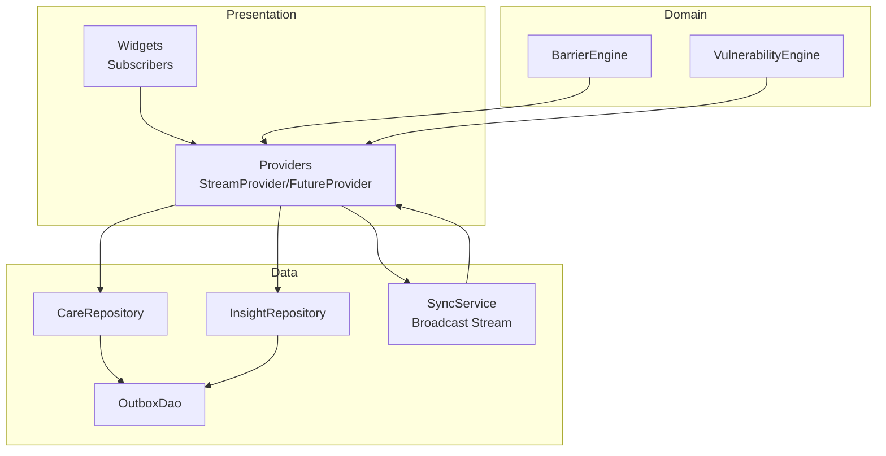
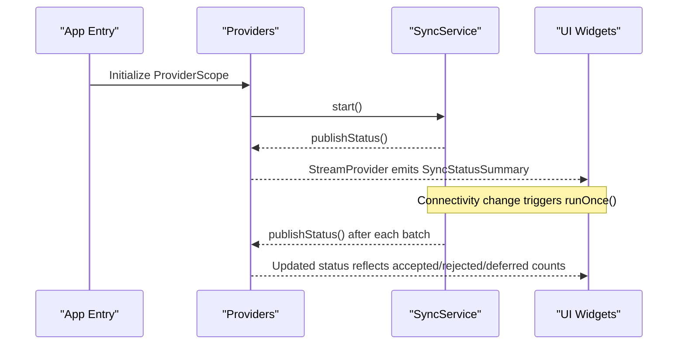
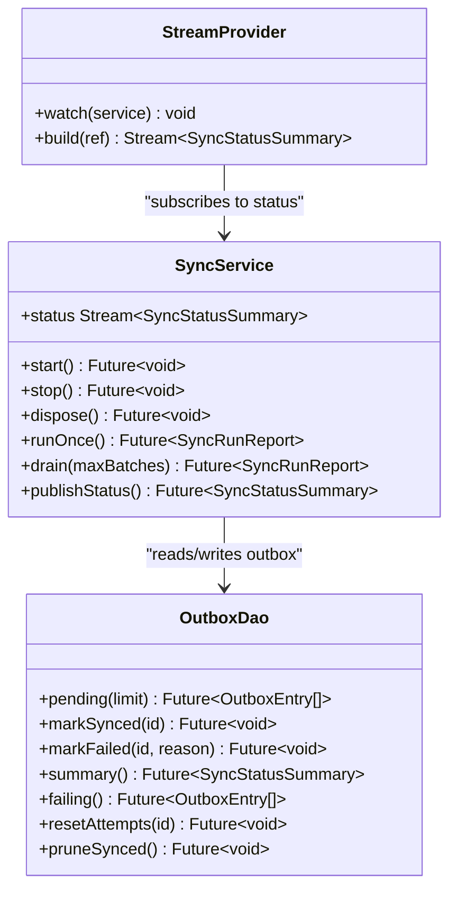
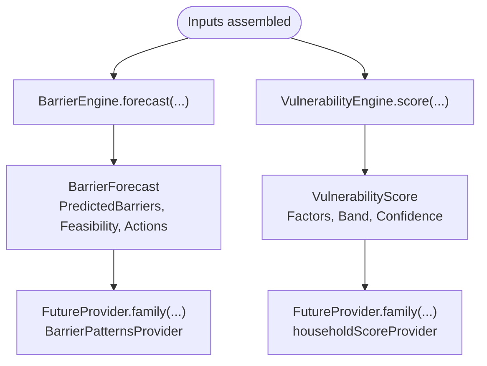
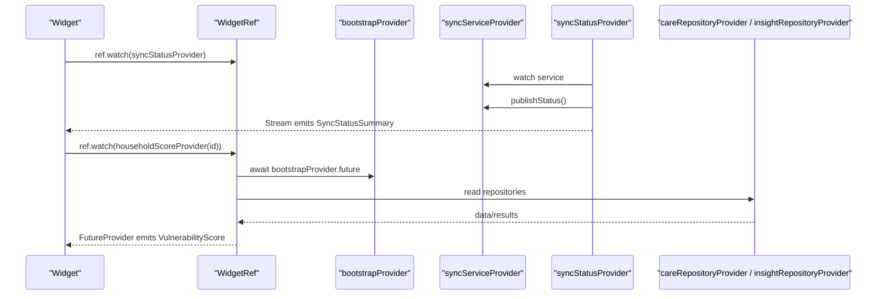
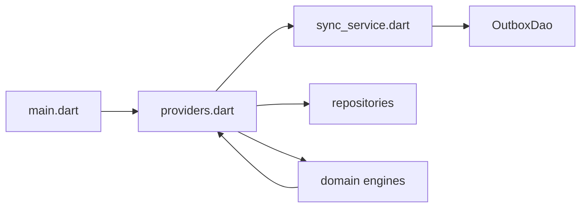

# Event-Driven Communication

<cite>
**Referenced Files in This Document**
- [main.dart](file://lib/main.dart)
- [providers.dart](file://lib/app/providers.dart)
- [sync_service.dart](file://lib/data/sync/sync_service.dart)
- [barrier_engine.dart](file://lib/domain/engines/barrier_engine.dart)
- [vulnerability_engine.dart](file://lib/domain/engines/vulnerability_engine.dart)
</cite>

## Table of Contents
1. Introduction
2. Project Structure
3. Core Components
4. Architecture Overview
5. Detailed Component Analysis
6. Dependency Analysis
7. Performance Considerations
8. Troubleshooting Guide
9. Conclusion

## Introduction
This document explains the event-driven communication patterns in CareBridge AI, focusing on how background sync status is published and consumed by the UI through reactive streams. It details the flow from domain engines (barrier prediction and vulnerability scoring) to presentation-layer providers, and how Riverpod’s reactive streams propagate state changes, errors, and loading states. It also covers custom events, stream transformations, subscription strategies, performance considerations for high-frequency updates, and memory management for long-lived subscriptions.

## Project Structure
CareBridge AI organizes its code into clear layers:
- Presentation layer uses Riverpod providers to expose data and state as reactive streams or futures.
- Domain layer contains pure computation engines that transform inputs into insights.
- Data layer includes repositories and DAOs, plus a background SyncService that publishes status updates via a broadcast stream.
- The application entry point initializes the provider scope and bootstraps services.

**Diagram sources**
- [providers.dart](file://lib/app/providers.dart)
- [sync_service.dart](file://lib/data/sync/sync_service.dart)
- [barrier_engine.dart](file://lib/domain/engines/barrier_engine.dart)
- [vulnerability_engine.dart](file://lib/domain/engines/vulnerability_engine.dart)

**Section sources**
- [main.dart](file://lib/main.dart)
- [providers.dart](file://lib/app/providers.dart)

## Core Components
- SyncService: Orchestrates opportunistic background sync, exposes a broadcast stream of status summaries, and emits lifecycle events when connectivity changes or batches complete.
- Providers: Expose reactive views over repositories and services; notably a StreamProvider for sync status that subscribes to SyncService and seeds initial values.
- Domain Engines: BarrierEngine and VulnerabilityEngine compute insights deterministically from inputs; results are surfaced via FutureProvider-based providers.

Key responsibilities:
- SyncService manages timers, connectivity monitoring, batched sending, and status publication.
- Providers wire services and repositories, handle permission checks, and convert async work into reactive streams/futures.
- Engines encapsulate business logic and produce structured outputs used by the UI.

**Section sources**
- [sync_service.dart](file://lib/data/sync/sync_service.dart)
- [providers.dart](file://lib/app/providers.dart)

## Architecture Overview
The event-driven architecture centers on a broadcast stream from SyncService that keeps the UI synchronized with background sync operations. Providers subscribe to this stream and push updates downstream to widgets. Domain engines feed insight providers that compute scores and predictions based on repository data.

**Diagram sources**
- [providers.dart](file://lib/app/providers.dart)
- [sync_service.dart](file://lib/data/sync/sync_service.dart)

## Detailed Component Analysis

### SyncService and StreamProvider Integration
- SyncService exposes a broadcast stream of SyncStatusSummary. It starts periodic timers and listens to connectivity changes to trigger sync runs.
- A StreamProvider watches the service and returns its status stream, seeding an initial value by calling publishStatus during provider build.
- Widgets subscribe to the StreamProvider to receive real-time updates without polling.

**Diagram sources**
- [sync_service.dart](file://lib/data/sync/sync_service.dart)
- [providers.dart](file://lib/app/providers.dart)

**Section sources**
- [sync_service.dart](file://lib/data/sync/sync_service.dart)
- [providers.dart](file://lib/app/providers.dart)

### Domain Engines: Barrier Prediction and Vulnerability Scoring
- BarrierEngine forecasts likely barriers to completing referrals and aggregates barrier patterns across households. It produces structured findings and recommended actions.
- VulnerabilityEngine computes a household risk score with modifiable/non-modifiable factors, confidence levels, and prioritization helpers.

These engines are invoked by providers that assemble inputs from repositories and return computed results as FutureProvider streams.

**Diagram sources**
- [barrier_engine.dart](file://lib/domain/engines/barrier_engine.dart)
- [vulnerability_engine.dart](file://lib/domain/engines/vulnerability_engine.dart)
- [providers.dart](file://lib/app/providers.dart)

**Section sources**
- [barrier_engine.dart](file://lib/domain/engines/barrier_engine.dart)
- [vulnerability_engine.dart](file://lib/domain/engines/vulnerability_engine.dart)
- [providers.dart](file://lib/app/providers.dart)

### Reactive State Propagation Through Riverpod
- BootstrapProvider ensures database initialization, demo seeding, and starting SyncService before other providers depend on them.
- Session-related providers manage authentication state and user context, gating access to feature providers.
- Feature providers (e.g., householdScoreProvider, barrierPatternsProvider) perform permission checks and call repositories to fetch or compute data.
- StreamProvider for sync status bridges SyncService’s broadcast stream to the UI.

**Diagram sources**
- [providers.dart](file://lib/app/providers.dart)
- [sync_service.dart](file://lib/data/sync/sync_service.dart)

**Section sources**
- [providers.dart](file://lib/app/providers.dart)

## Dependency Analysis
- Providers centralize wiring and dependency resolution, ensuring no widget directly accesses DAOs and enforcing RBAC at repository boundaries.
- SyncService depends on connectivity monitoring and OutboxDao for pending items and summaries.
- Domain engines are pure functions that do not depend on I/O; they are called within providers that supply inputs.

**Diagram sources**
- [main.dart](file://lib/main.dart)
- [providers.dart](file://lib/app/providers.dart)
- [sync_service.dart](file://lib/data/sync/sync_service.dart)

**Section sources**
- [providers.dart](file://lib/app/providers.dart)
- [sync_service.dart](file://lib/data/sync/sync_service.dart)

## Performance Considerations
- High-frequency updates: Use broadcast streams judiciously; debounce or throttle where necessary to avoid excessive rebuilds. For example, consider batching status emissions if multiple rapid changes occur.
- Long-lived subscriptions: Ensure proper disposal. SyncService disposes timers and connectivity subscriptions; StreamProvider automatically unsubscribes when the widget tree is disposed.
- Memory management: Avoid holding large datasets in providers; prefer streaming summaries and computed views. Use family providers to scope computations per entity ID.
- Re-entrancy guards: SyncService prevents concurrent runs to avoid double-sending and inconsistent counters.
- Lazy initialization: BootstrapProvider defers heavy setup until needed, reducing startup time.

[No sources needed since this section provides general guidance]

## Troubleshooting Guide
- Connectivity issues: SyncService checks connectivity before attempting sends; offline states are reflected in status summaries. Verify connectivity listener behavior and ensure start() is called during bootstrap.
- Stuck records: Use the stuck() method to retrieve failing entries and retry via retry(outboxId). Monitor rejected vs deferred outcomes to distinguish server rejections from network failures.
- Status not updating: Confirm that publishStatus() is called after each runOnce() and that the StreamProvider is subscribed. Check that the broadcast controller is not closed prematurely.
- Permission errors: Feature providers enforce role-based access; ensure currentUserProvider resolves correctly and permissions are granted before invoking repositories.

**Section sources**
- [sync_service.dart](file://lib/data/sync/sync_service.dart)
- [providers.dart](file://lib/app/providers.dart)

## Conclusion
CareBridge AI leverages Riverpod’s reactive streams to synchronize the UI with background sync operations and domain computations. SyncService publishes status updates through a broadcast stream, which StreamProvider consumes to keep banners and indicators current. Domain engines provide deterministic insights that are exposed via FutureProvider-based providers, enabling clean separation of concerns. Proper subscription management, re-entrancy guards, and lazy initialization ensure robustness and performance in field conditions.