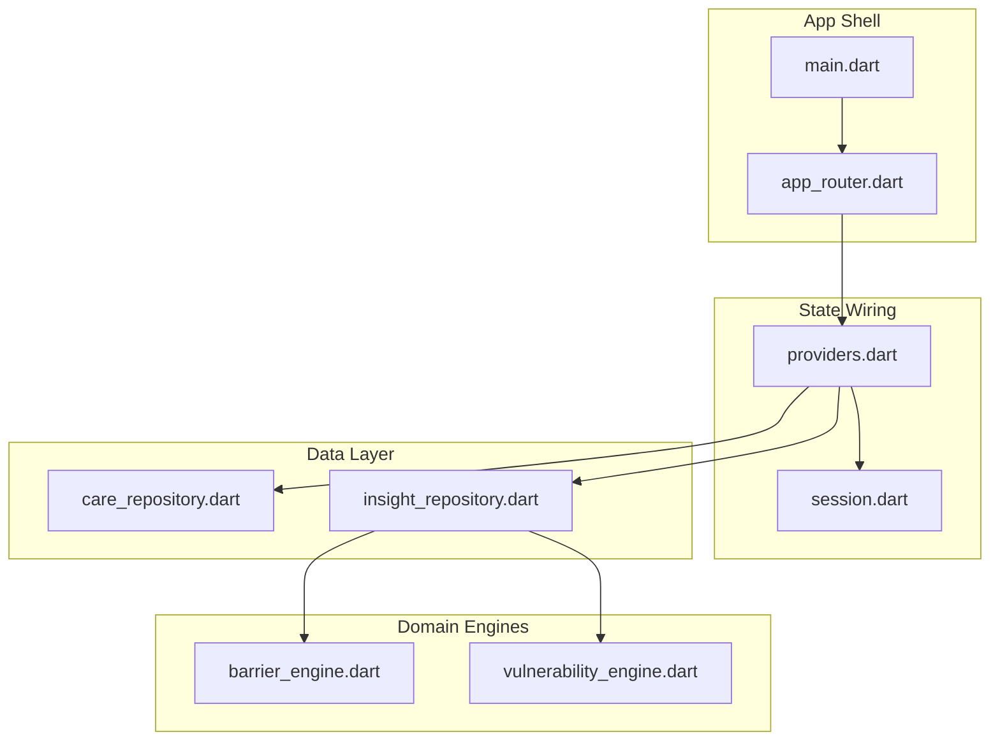
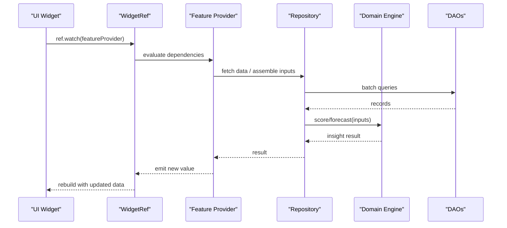
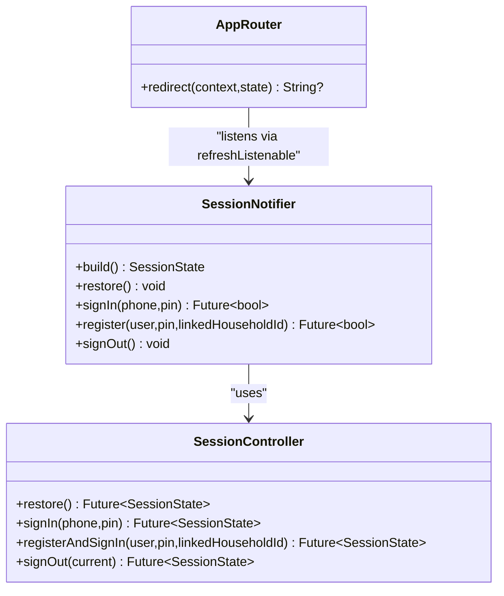
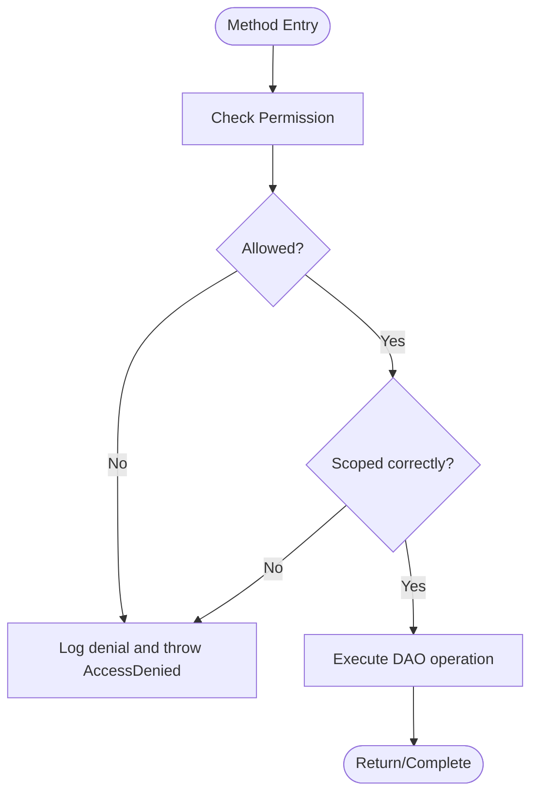
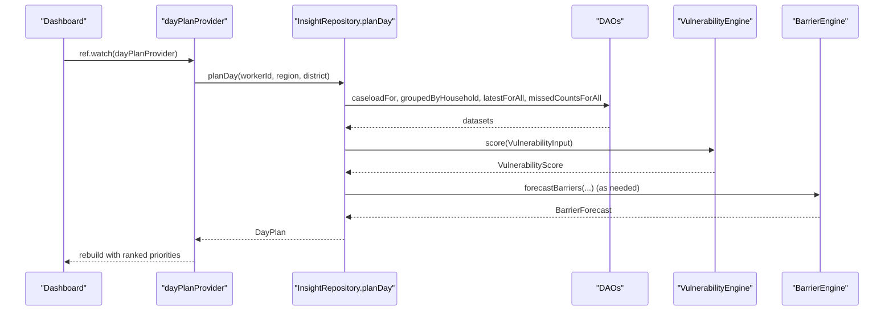
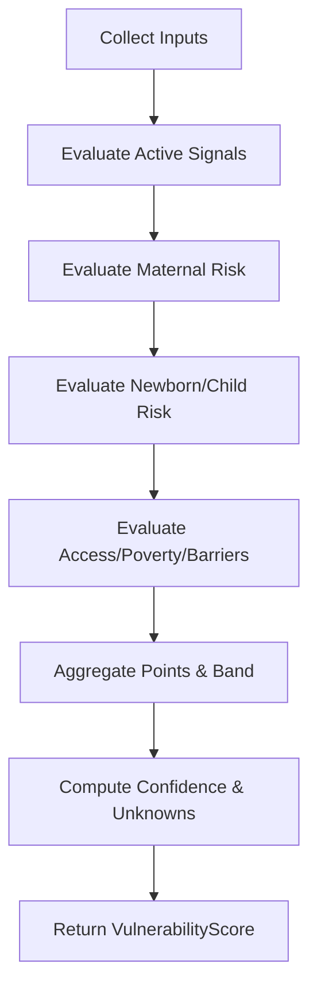
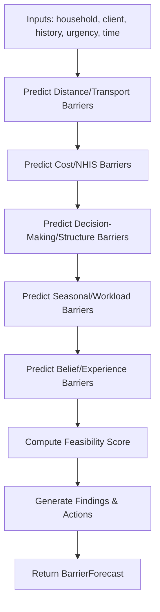
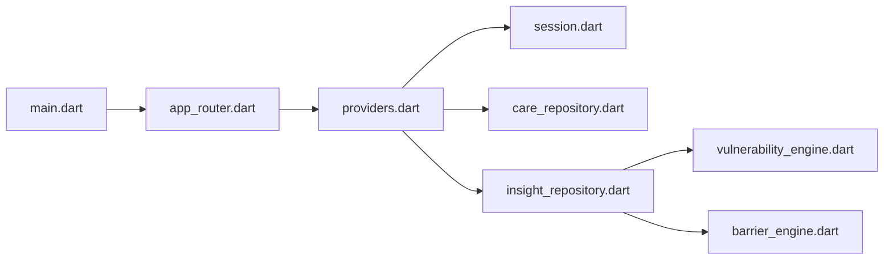

# State Propagation Mechanisms

<cite>
**Referenced Files in This Document**
- [main.dart](file://lib/main.dart)
- [providers.dart](file://lib/app/providers.dart)
- [app_router.dart](file://lib/core/router/app_router.dart)
- [session.dart](file://lib/core/auth/session.dart)
- [care_repository.dart](file://lib/data/repositories/care_repository.dart)
- [insight_repository.dart](file://lib/data/repositories/insight_repository.dart)
- [barrier_engine.dart](file://lib/domain/engines/barrier_engine.dart)
- [vulnerability_engine.dart](file://lib/domain/engines/vulnerability_engine.dart)
</cite>

## Table of Contents
1. [Introduction](#introduction)
2. [Project Structure](#project-structure)
3. [Core Components](#core-components)
4. [Architecture Overview](#architecture-overview)
5. [Detailed Component Analysis](#detailed-component-analysis)
6. [Dependency Analysis](#dependency-analysis)
7. [Performance Considerations](#performance-considerations)
8. [Troubleshooting Guide](#troubleshooting-guide)
9. [Conclusion](#conclusion)

## Introduction
This document explains how CareBridge AI propagates state across its event-driven architecture using Riverpod’s reactive providers. It traces the flow from domain engines (barrier prediction, vulnerability scoring) through repositories to presentation-layer components, and shows how state changes trigger UI rebuilds. It also covers selective listening for performance, composing providers for complex dependencies, transforming state pipelines, and debugging techniques for synchronization issues.

## Project Structure
At a high level:
- The app entry point initializes a Riverpod ProviderScope and wires the router.
- A single wiring file defines all providers, including session, sync status, and feature reads.
- Repositories encapsulate data access with role-based permissions and orchestrate calls to DAOs.
- Domain engines are pure functions that compute insights from assembled inputs.
- Presentation layers consume providers via ref.watch/ref.read to reactively rebuild only what is needed.

**Diagram sources**
- [main.dart:16-18](file://lib/main.dart#L16-L18)
- [app_router.dart:50-70](file://lib/core/router/app_router.dart#L50-L70)
- [providers.dart:38-42](file://lib/app/providers.dart#L38-L42)
- [session.dart:71-112](file://lib/core/auth/session.dart#L71-L112)
- [care_repository.dart:55-110](file://lib/data/repositories/care_repository.dart#L55-L110)
- [insight_repository.dart:120-168](file://lib/data/repositories/insight_repository.dart#L120-L168)
- [barrier_engine.dart:110-140](file://lib/domain/engines/barrier_engine.dart#L110-L140)
- [vulnerability_engine.dart:196-225](file://lib/domain/engines/vulnerability_engine.dart#L196-L225)

**Section sources**
- [main.dart:16-18](file://lib/main.dart#L16-L18)
- [providers.dart:1-13](file://lib/app/providers.dart#L1-L13)

## Core Components
- ProviderScope bootstraps reactive state at app start.
- Session state is managed by a NotifierProvider; derived providers expose current user and scoped identifiers.
- Feature providers (FutureProvider/FutureProvider.family) read from repositories, enforce permissions, and return immutable results.
- Sync status streams drive offline indicators.
- Repositories centralize permission checks and batched data assembly.
- Domain engines transform inputs into actionable insights.

Key provider categories:
- Bootstrapping: database open, seed, sync service start.
- Session: controller, notifier, current user, linked household.
- Feature reads: day plan, households, scores, assessments, growth series, trajectory, visit history, barriers, contacts, referrals, patterns, completion stats.

**Section sources**
- [providers.dart:38-42](file://lib/app/providers.dart#L38-L42)
- [providers.dart:68-128](file://lib/app/providers.dart#L68-L128)
- [providers.dart:145-156](file://lib/app/providers.dart#L145-L156)
- [providers.dart:194-202](file://lib/app/providers.dart#L194-L202)
- [providers.dart:256-260](file://lib/app/providers.dart#L256-L260)

## Architecture Overview
Riverpod drives reactivity:
- Widgets watch providers; when underlying state or async result changes, only those widgets rebuild.
- NotifierProvider updates propagate to all watchers automatically.
- FutureProvider families cache per-parameter results and invalidate on dependency changes.
- StreamProvider exposes ongoing events (e.g., sync status).

**Diagram sources**
- [providers.dart:145-156](file://lib/app/providers.dart#L145-L156)
- [providers.dart:194-202](file://lib/app/providers.dart#L194-L202)
- [providers.dart:256-260](file://lib/app/providers.dart#L256-L260)
- [insight_repository.dart:120-168](file://lib/data/repositories/insight_repository.dart#L120-L168)
- [vulnerability_engine.dart:196-225](file://lib/domain/engines/vulnerability_engine.dart#L196-L225)
- [barrier_engine.dart:110-140](file://lib/domain/engines/barrier_engine.dart#L110-L140)

## Detailed Component Analysis

### Session State and Routing Reactivity
- SessionNotifier starts in a loading state and asynchronously restores the session.
- Derived providers expose currentUser and linkedHouseholdId based on session state.
- Router listens to session changes to redirect appropriately.

**Diagram sources**
- [providers.dart:73-122](file://lib/app/providers.dart#L73-L122)
- [session.dart:71-112](file://lib/core/auth/session.dart#L71-L112)
- [app_router.dart:50-70](file://lib/core/router/app_router.dart#L50-L70)

**Section sources**
- [providers.dart:73-122](file://lib/app/providers.dart#L73-L122)
- [session.dart:71-112](file://lib/core/auth/session.dart#L71-L112)
- [app_router.dart:50-70](file://lib/core/router/app_router.dart#L50-L70)

### Repository Permission Gatekeeping
- CareRepository enforces permissions before any read/write, logging denials and throwing explicit exceptions.
- Scope checks ensure caregivers can only access their linked household.
- Methods group related operations (e.g., saveAssessment with referral and follow-ups) to maintain consistency.

**Diagram sources**
- [care_repository.dart:62-110](file://lib/data/repositories/care_repository.dart#L62-L110)
- [care_repository.dart:350-391](file://lib/data/repositories/care_repository.dart#L350-L391)

**Section sources**
- [care_repository.dart:55-110](file://lib/data/repositories/care_repository.dart#L55-L110)
- [care_repository.dart:350-391](file://lib/data/repositories/care_repository.dart#L350-L391)

### Insight Repository: Data Assembly and Engine Orchestration
- Batched reads minimize SQLite round trips.
- Assembles inputs for VulnerabilityEngine and BarrierEngine.
- Produces DayPlan and HouseholdPriority structures used by dashboards.

**Diagram sources**
- [providers.dart:145-156](file://lib/app/providers.dart#L145-L156)
- [insight_repository.dart:120-168](file://lib/data/repositories/insight_repository.dart#L120-L168)
- [vulnerability_engine.dart:196-225](file://lib/domain/engines/vulnerability_engine.dart#L196-L225)
- [barrier_engine.dart:110-140](file://lib/domain/engines/barrier_engine.dart#L110-L140)

**Section sources**
- [insight_repository.dart:120-168](file://lib/data/repositories/insight_repository.dart#L120-L168)
- [insight_repository.dart:274-331](file://lib/data/repositories/insight_repository.dart#L274-L331)

### Vulnerability Scoring Pipeline
- Inputs include maternal record, birth records, growth measurements, household attributes, referrals, barriers, missed contacts, and seasonality.
- Scores aggregate risk factors, compute band, confidence, and unknowns.
- Prioritization orders households by score and data completeness.

**Diagram sources**
- [vulnerability_engine.dart:196-225](file://lib/domain/engines/vulnerability_engine.dart#L196-L225)
- [vulnerability_engine.dart:226-377](file://lib/domain/engines/vulnerability_engine.dart#L226-L377)
- [vulnerability_engine.dart:467-526](file://lib/domain/engines/vulnerability_engine.dart#L467-L526)
- [vulnerability_engine.dart:611-748](file://lib/domain/engines/vulnerability_engine.dart#L611-L748)
- [vulnerability_engine.dart:750-779](file://lib/domain/engines/vulnerability_engine.dart#L750-L779)

**Section sources**
- [vulnerability_engine.dart:196-225](file://lib/domain/engines/vulnerability_engine.dart#L196-L225)
- [vulnerability_engine.dart:750-779](file://lib/domain/engines/vulnerability_engine.dart#L750-L779)

### Barrier Prediction Pipeline
- Predicts likely barriers using previously reported barriers, distance, NHIS status, decision-making context, seasonality, urgency, and night-time conditions.
- Computes feasibility of referral completion and suggests preemptive actions.
- Aggregates zone-wide barrier patterns for systemic escalation.

**Diagram sources**
- [barrier_engine.dart:110-140](file://lib/domain/engines/barrier_engine.dart#L110-L140)
- [barrier_engine.dart:162-311](file://lib/domain/engines/barrier_engine.dart#L162-L311)
- [barrier_engine.dart:336-396](file://lib/domain/engines/barrier_engine.dart#L336-L396)
- [barrier_engine.dart:416-456](file://lib/domain/engines/barrier_engine.dart#L416-L456)

**Section sources**
- [barrier_engine.dart:110-140](file://lib/domain/engines/barrier_engine.dart#L110-L140)
- [barrier_engine.dart:336-396](file://lib/domain/engines/barrier_engine.dart#L336-L396)

### Provider Composition and Selective Listening
- Use ref.watch for reactive dependencies; use ref.read for one-off reads inside providers or handlers.
- Family providers parameterize by ID to scope data per entity.
- Compose providers to derive higher-level state (e.g., currentUser from sessionProvider).

Examples:
- Deriving currentUser from session state.
- Parameterized family providers for household members and scores.
- Composing trajectory analysis from growth series.

**Section sources**
- [providers.dart:125-128](file://lib/app/providers.dart#L125-L128)
- [providers.dart:169-176](file://lib/app/providers.dart#L169-L176)
- [providers.dart:194-202](file://lib/app/providers.dart#L194-L202)
- [providers.dart:256-260](file://lib/app/providers.dart#L256-L260)

## Dependency Analysis
The following diagram maps core dependencies between providers, repositories, and engines.

**Diagram sources**
- [main.dart:16-18](file://lib/main.dart#L16-L18)
- [app_router.dart:50-70](file://lib/core/router/app_router.dart#L50-L70)
- [providers.dart:38-42](file://lib/app/providers.dart#L38-L42)
- [care_repository.dart:55-110](file://lib/data/repositories/care_repository.dart#L55-L110)
- [insight_repository.dart:120-168](file://lib/data/repositories/insight_repository.dart#L120-L168)
- [vulnerability_engine.dart:196-225](file://lib/domain/engines/vulnerability_engine.dart#L196-L225)
- [barrier_engine.dart:110-140](file://lib/domain/engines/barrier_engine.dart#L110-L140)

**Section sources**
- [providers.dart:1-13](file://lib/app/providers.dart#L1-L13)
- [insight_repository.dart:120-168](file://lib/data/repositories/insight_repository.dart#L120-L168)

## Performance Considerations
- Prefer ref.read for non-reactive reads within providers or handlers to avoid unnecessary subscriptions.
- Use FutureProvider.family to cache results per parameter (e.g., householdId, personId).
- Batch data reads in repositories to reduce SQLite round trips and CPU overhead.
- Keep providers small and focused; compose them to avoid large monolithic computations.
- Avoid watching heavy providers deep in widget trees unless necessary; lift watches closer to where data is used.

[No sources needed since this section provides general guidance]

## Troubleshooting Guide
Common issues and remedies:
- Stale UI after data changes: Ensure the correct provider is watched and that state mutations update the notifier or complete futures.
- Permission errors: Verify that the acting user has required permissions and that repository methods are invoked with the correct user context.
- Slow screens: Check for excessive ref.watch usage; replace with ref.read where appropriate and confirm batching in repositories.
- Inconsistent scores: Confirm that input assembly in repositories matches engine expectations and that parameters (e.g., month) are deterministic in tests.

Debugging techniques:
- Use print statements around provider builds to trace evaluation order.
- Inspect session state transitions to verify restoration and sign-in flows.
- Validate repository batch queries and engine inputs for correctness.

**Section sources**
- [providers.dart:73-122](file://lib/app/providers.dart#L73-L122)
- [care_repository.dart:62-110](file://lib/data/repositories/care_repository.dart#L62-L110)
- [insight_repository.dart:120-168](file://lib/data/repositories/insight_repository.dart#L120-L168)

## Conclusion
CareBridge AI leverages Riverpod’s reactive providers to create a clean separation between state, data access, and computation. Repositories enforce permissions and assemble inputs efficiently, while domain engines produce transparent, auditable insights. By composing providers judiciously and using selective listening, the app achieves responsive UIs even under complex state dependencies. The documented patterns provide a robust foundation for scaling features and maintaining performance in field conditions.

[No sources needed since this section summarizes without analyzing specific files]