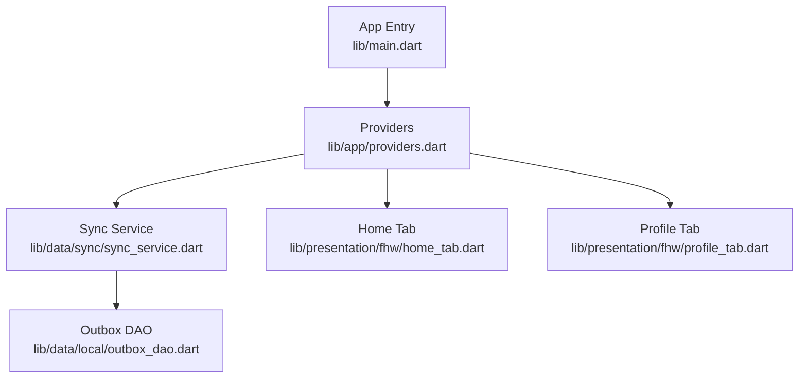
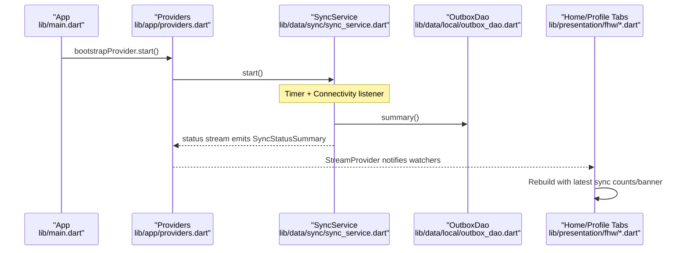
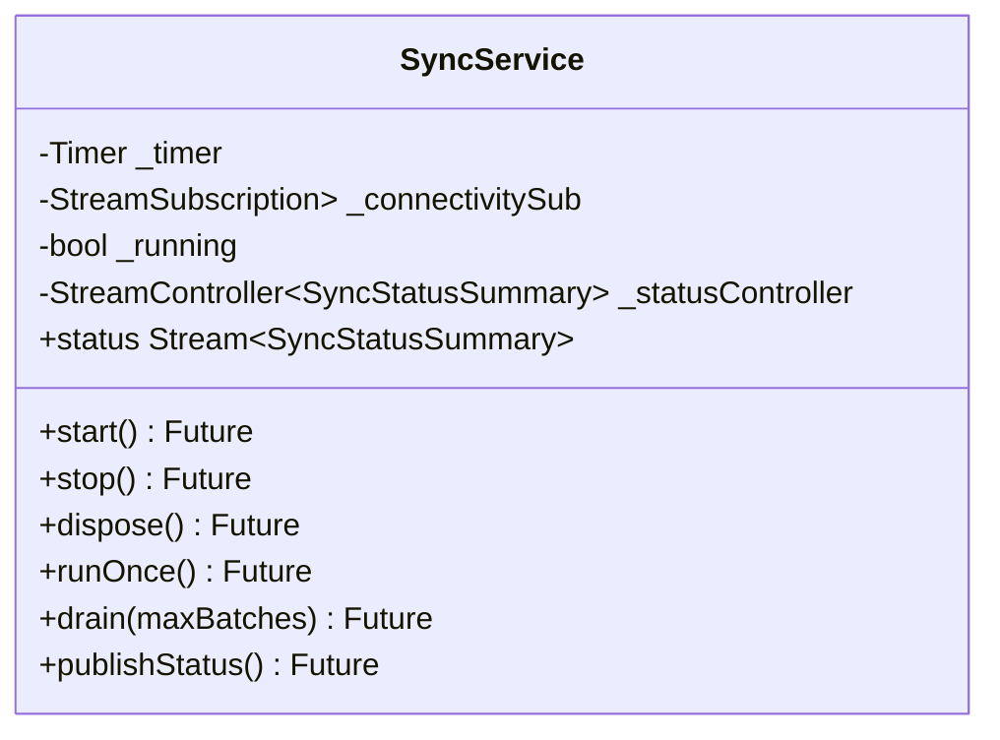
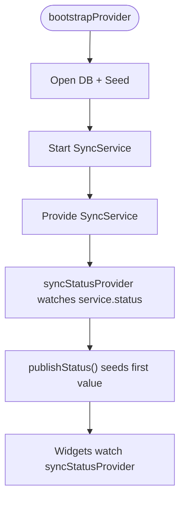
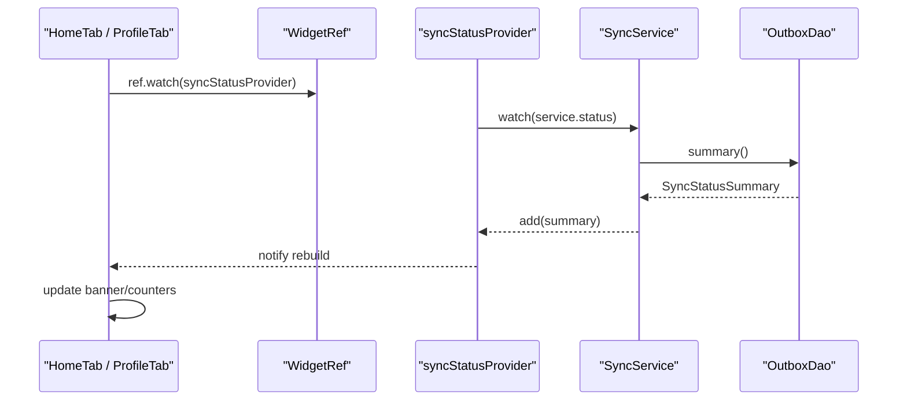
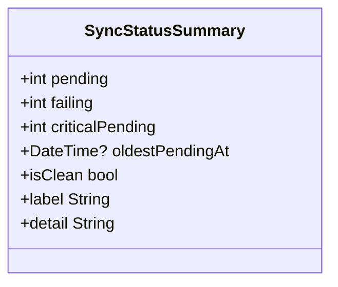
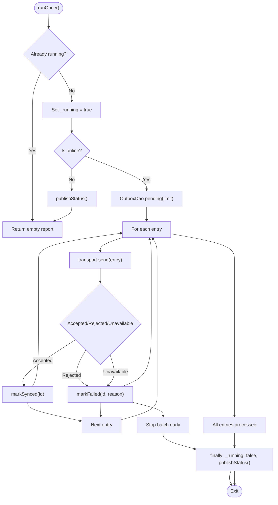
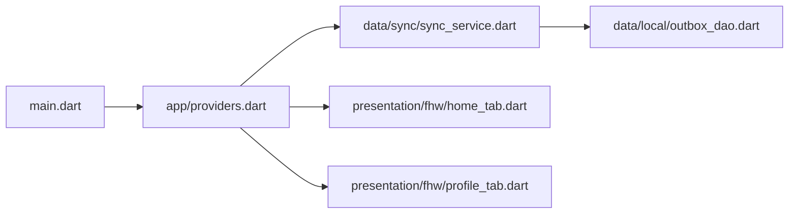

# Stream Provider Patterns

<cite>
**Referenced Files in This Document**
- [main.dart](file://lib/main.dart)
- [providers.dart](file://lib/app/providers.dart)
- [sync_service.dart](file://lib/data/sync/sync_service.dart)
- [outbox_dao.dart](file://lib/data/local/outbox_dao.dart)
- [home_tab.dart](file://lib/presentation/fhw/home_tab.dart)
- [profile_tab.dart](file://lib/presentation/fhw/profile_tab.dart)
</cite>

## Table of Contents
1. Introduction
2. Project Structure
3. Core Components
4. Architecture Overview
5. Detailed Component Analysis
6. Dependency Analysis
7. Performance Considerations
8. Troubleshooting Guide
9. Conclusion

## Introduction
This document explains the StreamProvider patterns used in CareBridge AI to broadcast background sync status updates and drive reactive UI changes. The SyncService uses a broadcast StreamController to emit SyncStatusSummary events, which are exposed through a StreamProvider so that widgets can subscribe reactively using ConsumerWidget or Consumer. When connectivity changes or periodic sync runs complete, the UI updates automatically without manual polling.

## Project Structure
CareBridge AI organizes state and side effects with Riverpod providers:
- Application wiring and providers live under lib/app/providers.dart.
- Background sync logic lives under lib/data/sync/sync_service.dart.
- Outbox persistence and summary queries live under lib/data/local/outbox_dao.dart.
- Presentation screens consume providers via ConsumerWidget/Consumer.

**Diagram sources**
- [main.dart:16-18](file://lib/main.dart#L16-L18)
- [providers.dart:38-42](file://lib/app/providers.dart#L38-L42)
- [sync_service.dart:96-114](file://lib/data/sync/sync_service.dart#L96-L114)
- [outbox_dao.dart:220-238](file://lib/data/local/outbox_dao.dart#L220-L238)
- [home_tab.dart:31-38](file://lib/presentation/fhw/home_tab.dart#L31-L38)
- [profile_tab.dart:118-123](file://lib/presentation/fhw/profile_tab.dart#L118-L123)

**Section sources**
- [main.dart:16-18](file://lib/main.dart#L16-L18)
- [providers.dart:38-42](file://lib/app/providers.dart#L38-L42)

## Core Components
- SyncService: Orchestrates background sync, exposes a broadcast stream for status, and publishes summaries after each run.
- StreamProvider (syncStatusProvider): Wraps SyncService.status into a Riverpod StreamProvider, seeding initial values and keeping subscribers updated.
- OutboxDao.summary(): Computes pending, failing, criticalPending, and oldestPendingAt for display.
- UI Consumers: Home tab and Profile tab read syncStatusProvider to render banners and counts reactively.

Key responsibilities:
- Broadcast pattern: SyncService maintains a broadcast StreamController and pushes new SyncStatusSummary instances whenever sync progress occurs.
- Reactive consumption: Providers expose streams; widgets use ref.watch(syncStatusProvider) to rebuild when values change.
- Lifecycle management: bootstrapProvider starts the service; provider disposal closes the controller.

**Section sources**
- [sync_service.dart:96-114](file://lib/data/sync/sync_service.dart#L96-L114)
- [providers.dart:52-64](file://lib/app/providers.dart#L52-L64)
- [outbox_dao.dart:220-238](file://lib/data/local/outbox_dao.dart#L220-L238)
- [home_tab.dart:31-38](file://lib/presentation/fhw/home_tab.dart#L31-L38)
- [profile_tab.dart:118-123](file://lib/presentation/fhw/profile_tab.dart#L118-L123)

## Architecture Overview
The sync status flow connects background operations to the UI through Riverpod streams.

**Diagram sources**
- [main.dart:16-18](file://lib/main.dart#L16-L18)
- [providers.dart:38-42](file://lib/app/providers.dart#L38-L42)
- [sync_service.dart:122-133](file://lib/data/sync/sync_service.dart#L122-L133)
- [sync_service.dart:244-248](file://lib/data/sync/sync_service.dart#L244-L248)
- [outbox_dao.dart:220-238](file://lib/data/local/outbox_dao.dart#L220-L238)
- [home_tab.dart:31-38](file://lib/presentation/fhw/home_tab.dart#L31-L38)
- [profile_tab.dart:118-123](file://lib/presentation/fhw/profile_tab.dart#L118-L123)

## Detailed Component Analysis

### SyncService: Broadcast Stream Controller and Status Publishing
- Maintains a broadcast StreamController<SyncStatusSummary>.
- Exposes a Stream<SyncStatusSummary> getter for consumers.
- publishStatus() computes current summary and adds it to the stream if not closed.
- start() sets up periodic timer and connectivity listener; stop() and dispose() clean up resources and close the controller.

**Diagram sources**
- [sync_service.dart:96-114](file://lib/data/sync/sync_service.dart#L96-L114)
- [sync_service.dart:122-145](file://lib/data/sync/sync_service.dart#L122-L145)
- [sync_service.dart:156-217](file://lib/data/sync/sync_service.dart#L156-L217)
- [sync_service.dart:223-248](file://lib/data/sync/sync_service.dart#L223-L248)

**Section sources**
- [sync_service.dart:96-114](file://lib/data/sync/sync_service.dart#L96-L114)
- [sync_service.dart:122-145](file://lib/data/sync/sync_service.dart#L122-L145)
- [sync_service.dart:156-217](file://lib/data/sync/sync_service.dart#L156-L217)
- [sync_service.dart:223-248](file://lib/data/sync/sync_service.dart#L223-L248)

### StreamProvider Wiring: Exposing Sync Status Reactively
- bootstrapProvider ensures database is ready and calls syncServiceProvider.start().
- syncServiceProvider creates SyncService and registers onDispose to call service.dispose().
- syncStatusProvider watches the service and returns its status stream; it also triggers an initial publish to seed the banner.

**Diagram sources**
- [providers.dart:38-42](file://lib/app/providers.dart#L38-L42)
- [providers.dart:52-64](file://lib/app/providers.dart#L52-L64)

**Section sources**
- [providers.dart:38-42](file://lib/app/providers.dart#L38-L42)
- [providers.dart:52-64](file://lib/app/providers.dart#L52-L64)

### UI Consumption: ConsumerWidget and Consumer Usage
- Home tab reads currentUserProvider, visibleHouseholdsProvider, dayPlanProvider, openReferralsProvider, and syncStatusProvider to build the dashboard and offline queue tile.
- Profile tab reads currentUserProvider and syncStatusProvider to show account info and sync status.

**Diagram sources**
- [home_tab.dart:31-38](file://lib/presentation/fhw/home_tab.dart#L31-L38)
- [profile_tab.dart:118-123](file://lib/presentation/fhw/profile_tab.dart#L118-L123)
- [providers.dart:60-64](file://lib/app/providers.dart#L60-L64)
- [sync_service.dart:244-248](file://lib/data/sync/sync_service.dart#L244-L248)
- [outbox_dao.dart:220-238](file://lib/data/local/outbox_dao.dart#L220-L238)

**Section sources**
- [home_tab.dart:31-38](file://lib/presentation/fhw/home_tab.dart#L31-L38)
- [profile_tab.dart:118-123](file://lib/presentation/fhw/profile_tab.dart#L118-L123)

### Data Model: SyncStatusSummary
- Contains pending, failing, criticalPending, and oldestPendingAt.
- Provides label and detail strings for user-facing messages.
- Used by both the sync banner and offline queue tiles.

**Diagram sources**
- [outbox_dao.dart:119-158](file://lib/data/local/outbox_dao.dart#L119-L158)

**Section sources**
- [outbox_dao.dart:119-158](file://lib/data/local/outbox_dao.dart#L119-L158)

### Background Sync Flow and Error Handling
- runOnce() enforces re-entrancy guard, checks connectivity, fetches a batch from OutboxDao.pending, sends via transport, and marks outcomes as accepted/rejected/unavailable.
- On completion or failure, finally block resets running flag and publishes status.
- drain() loops runOnce() until no progress or max batches reached, then prunes synced entries.

**Diagram sources**
- [sync_service.dart:156-217](file://lib/data/sync/sync_service.dart#L156-L217)
- [sync_service.dart:223-242](file://lib/data/sync/sync_service.dart#L223-L242)
- [outbox_dao.dart:187-199](file://lib/data/local/outbox_dao.dart#L187-L199)

**Section sources**
- [sync_service.dart:156-217](file://lib/data/sync/sync_service.dart#L156-L217)
- [sync_service.dart:223-242](file://lib/data/sync/sync_service.dart#L223-L242)
- [outbox_dao.dart:187-199](file://lib/data/local/outbox_dao.dart#L187-L199)

## Dependency Analysis
- Bootstrap depends on providers to initialize DB, seed data, and start sync.
- SyncService depends on OutboxDao for persistence and connectivity_plus for network events.
- UI components depend on providers for reactive data access.

**Diagram sources**
- [main.dart:16-18](file://lib/main.dart#L16-L18)
- [providers.dart:38-42](file://lib/app/providers.dart#L38-L42)
- [sync_service.dart:96-114](file://lib/data/sync/sync_service.dart#L96-L114)
- [outbox_dao.dart:220-238](file://lib/data/local/outbox_dao.dart#L220-L238)
- [home_tab.dart:31-38](file://lib/presentation/fhw/home_tab.dart#L31-L38)
- [profile_tab.dart:118-123](file://lib/presentation/fhw/profile_tab.dart#L118-L123)

**Section sources**
- [providers.dart:38-42](file://lib/app/providers.dart#L38-L42)
- [sync_service.dart:96-114](file://lib/data/sync/sync_service.dart#L96-L114)
- [outbox_dao.dart:220-238](file://lib/data/local/outbox_dao.dart#L220-L238)

## Performance Considerations
- High-frequency updates:
  - Use broadcast streams sparingly; ensure publishStatus() is called only when necessary (e.g., after batch completion or connectivity change).
  - Debounce or throttle UI rebuilds if multiple rapid emissions occur; consider transforming the stream in providers to merge or sample values.
- Memory management:
  - Ensure SyncService.stop() cancels timers and connectivity subscriptions; dispose() must close the StreamController to avoid leaks.
  - Provider-level onDispose should call service.dispose() to guarantee cleanup when the provider scope ends.
- Batch sizing:
  - Keep batchSize small to reduce memory pressure and improve resilience during intermittent connectivity.
- Stream transformations:
  - Apply map/where/filter in providers to derive derived states (e.g., filter out stale summaries or combine with connectivity state).
  - Use distinct() to avoid redundant rebuilds when identical summaries are emitted.

[No sources needed since this section provides general guidance]

## Troubleshooting Guide
Common issues and remedies:
- No UI updates:
  - Verify syncStatusProvider is watched in the widget tree and that publishStatus() is called after sync runs.
  - Confirm the StreamController is not closed prematurely.
- Stuck records:
  - Use stuck() to list failing entries; retry via retry(outboxId) to reset attempts and trigger another run.
- Excessive rebuilds:
  - Add distinct() or debounce in providers to prevent unnecessary rebuilds.
- Resource leaks:
  - Ensure stop() and dispose() are invoked; check that subscriptions are canceled and controllers closed.

**Section sources**
- [sync_service.dart:244-248](file://lib/data/sync/sync_service.dart#L244-L248)
- [sync_service.dart:250-257](file://lib/data/sync/sync_service.dart#L250-L257)
- [providers.dart:52-56](file://lib/app/providers.dart#L52-L56)

## Conclusion
CareBridge AI’s StreamProvider pattern centers on SyncService broadcasting SyncStatusSummary through a broadcast StreamController, wrapped by a StreamProvider for reactive consumption. Widgets subscribe via ConsumerWidget/Consumer and update automatically as connectivity changes or sync completes. Proper lifecycle management, careful batching, and optional stream transformations ensure performance and reliability in field conditions.

[No sources needed since this section summarizes without analyzing specific files]