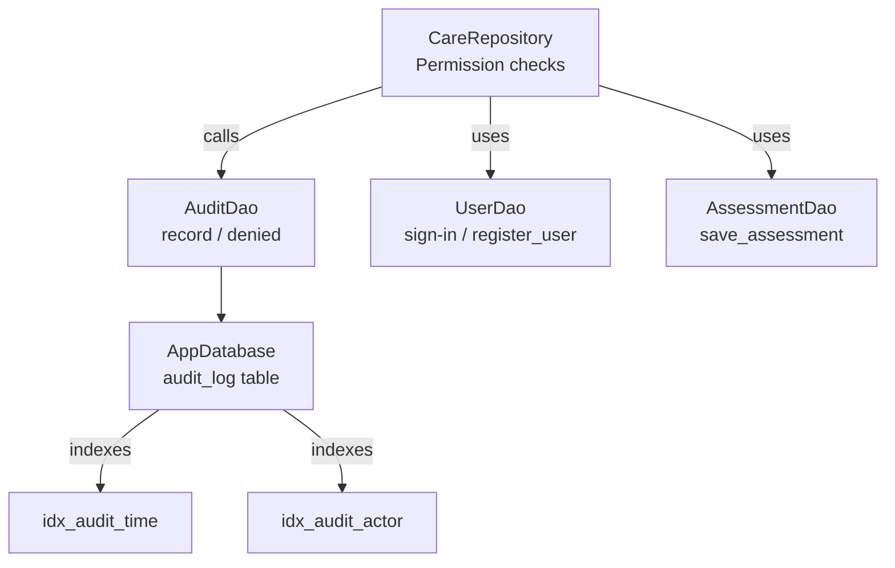
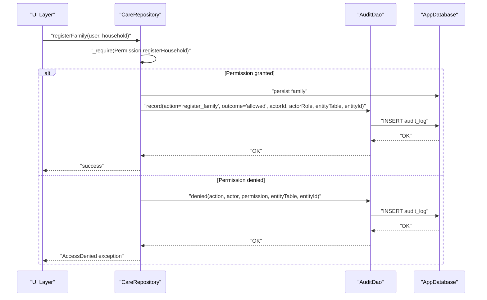
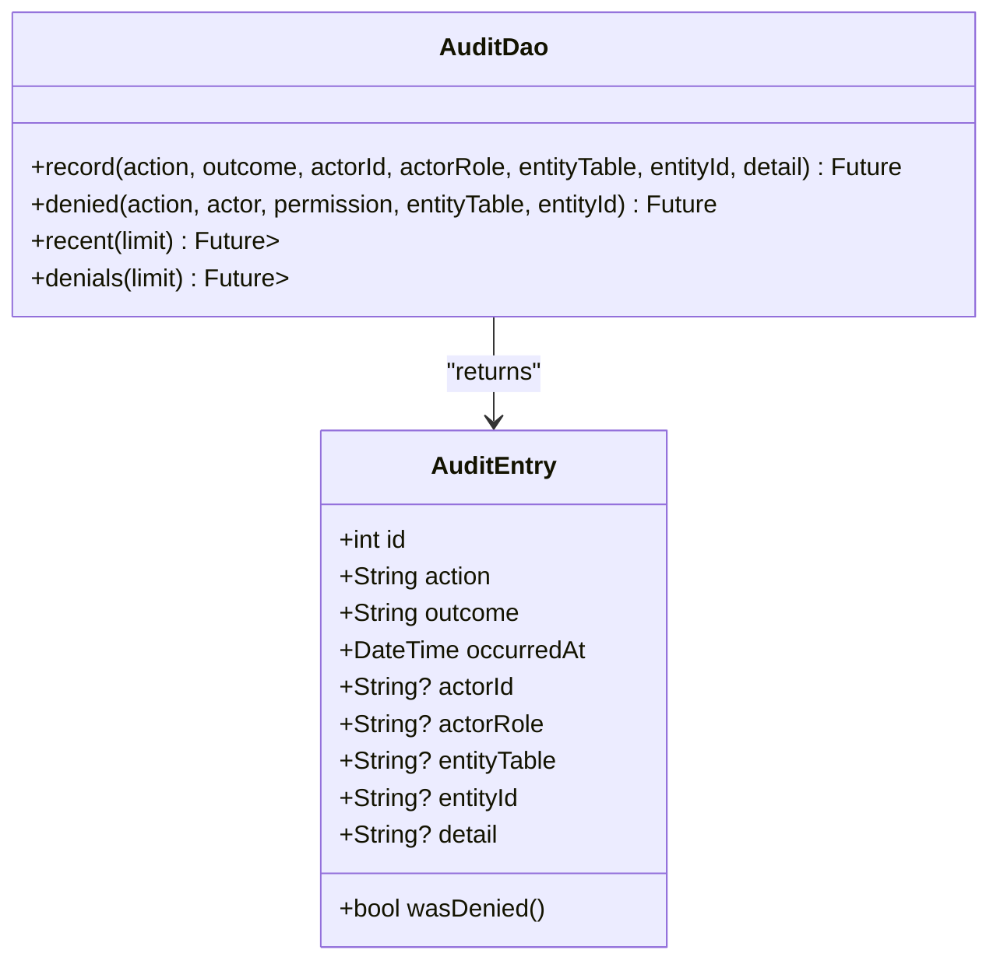
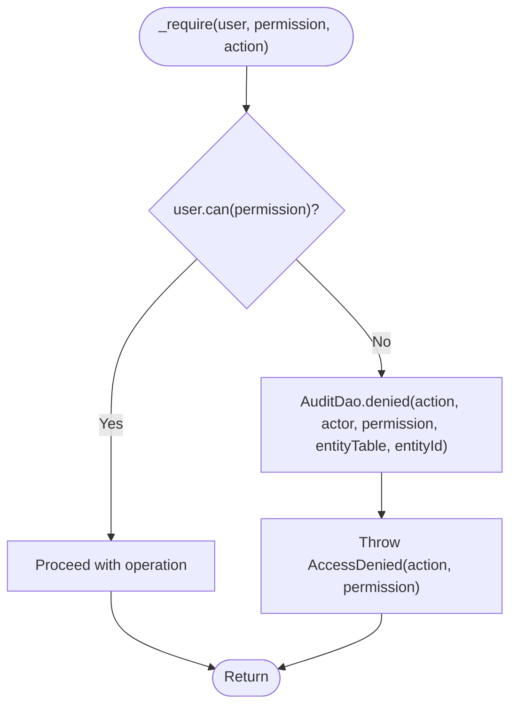
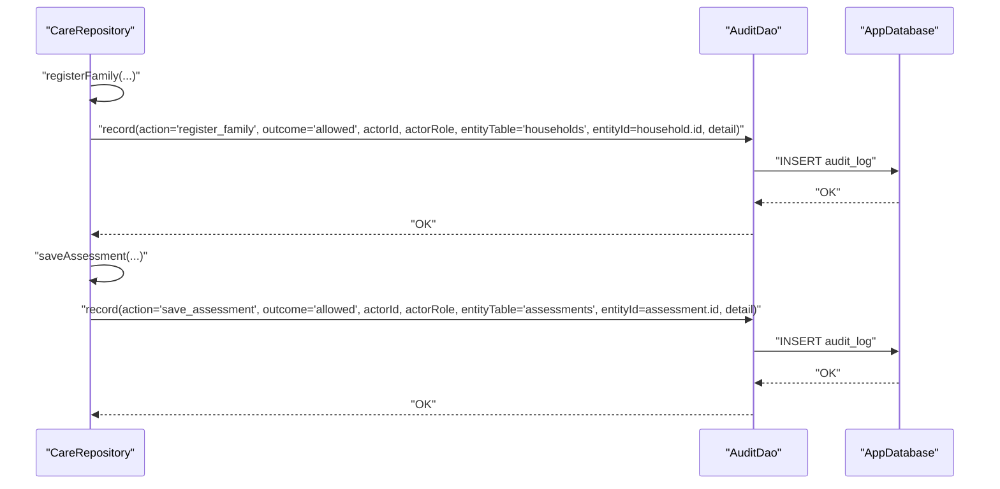
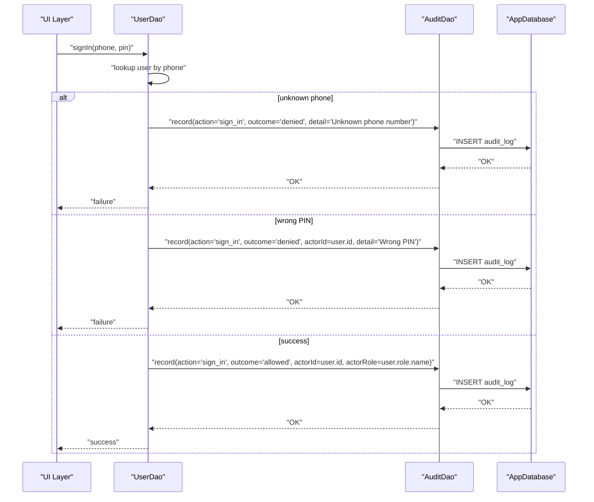
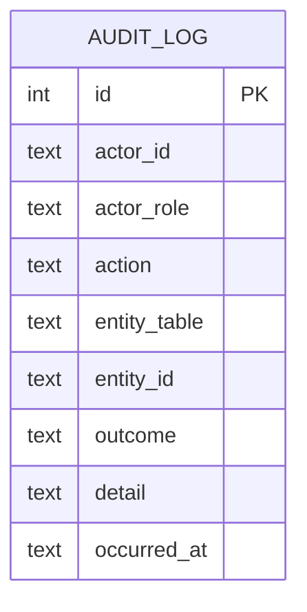
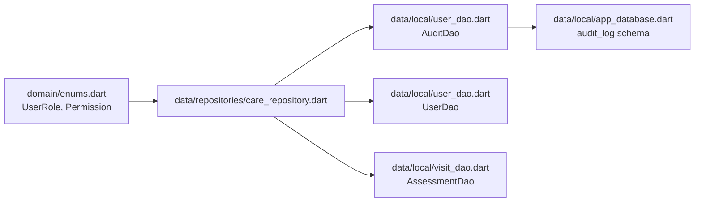

# Audit Logging Integration

<cite>
**Referenced Files in This Document**
- [user_dao.dart](file://lib/data/local/user_dao.dart)
- [care_repository.dart](file://lib/data/repositories/care_repository.dart)
- [app_database.dart](file://lib/data/local/app_database.dart)
- [enums.dart](file://lib/domain/enums.dart)
- [visit_dao.dart](file://lib/data/local/visit_dao.dart)
</cite>

## Table of Contents
1. [Introduction](#introduction)
2. [Project Structure](#project-structure)
3. [Core Components](#core-components)
4. [Architecture Overview](#architecture-overview)
5. [Detailed Component Analysis](#detailed-component-analysis)
6. [Dependency Analysis](#dependency-analysis)
7. [Performance Considerations](#performance-considerations)
8. [Troubleshooting Guide](#troubleshooting-guide)
9. [Conclusion](#conclusion)
10. [Appendices](#appendices)

## Introduction
This document explains how audit logging is integrated into repository operations to create an immutable trail of access attempts and successful actions for health data protection compliance. Every permission check failure is automatically logged through a dedicated DAO, while successful operations such as family registration and assessment saving are recorded with actor information, timestamps, and outcome details. The design ensures that audit logging never blocks critical clinical operations and supports accountability in clinical decision-making and regulatory compliance.

## Project Structure
Audit logging spans three layers:
- Repository layer enforces permissions and triggers audit events on both denials and successes.
- Data Access Object (DAO) layer persists audit entries into the local database without throwing exceptions.
- Database schema defines the audit table and indexes optimized for time-based and actor-based queries.

**Diagram sources**
- [care_repository.dart:63-110](file://lib/data/repositories/care_repository.dart#L63-L110)
- [user_dao.dart:382-456](file://lib/data/local/user_dao.dart#L382-L456)
- [app_database.dart:539-555](file://lib/data/local/app_database.dart#L539-L555)
- [visit_dao.dart:271-390](file://lib/data/local/visit_dao.dart#L271-L390)

**Section sources**
- [care_repository.dart:1-605](file://lib/data/repositories/care_repository.dart#L1-L605)
- [user_dao.dart:1-457](file://lib/data/local/user_dao.dart#L1-L457)
- [app_database.dart:175-192](file://lib/data/local/app_database.dart#L175-L192)
- [app_database.dart:539-555](file://lib/data/local/app_database.dart#L539-L555)

## Core Components
- AuditEntry: Represents a single audit record with fields for actor identification, action, outcome, timestamp, entity context, and optional detail.
- AuditDao: Provides non-throwing persistence for audit records, including a convenience method for permission denials and query helpers for recent logs and denials.
- CareRepository: Centralizes permission enforcement; every unauthorized attempt calls the denial path which logs before throwing an exception.
- AppDatabase: Defines the audit_log table schema and performance-critical indexes.

Key responsibilities:
- Immutable, append-only audit trail for all sensitive operations.
- Non-blocking writes so clinical operations remain resilient even if logging fails.
- Consistent actor context and entity scoping across all audit entries.

**Section sources**
- [user_dao.dart:342-456](file://lib/data/local/user_dao.dart#L342-L456)
- [care_repository.dart:55-110](file://lib/data/repositories/care_repository.dart#L55-L110)
- [app_database.dart:539-555](file://lib/data/local/app_database.dart#L539-L555)

## Architecture Overview
The audit architecture integrates at the repository boundary to ensure consistent enforcement and logging. Permission checks funnel through centralized guards that either allow the operation or log a denial and raise an exception. Successful operations explicitly record allowed outcomes with rich context.

**Diagram sources**
- [care_repository.dart:148-174](file://lib/data/repositories/care_repository.dart#L148-L174)
- [user_dao.dart:382-433](file://lib/data/local/user_dao.dart#L382-L433)
- [app_database.dart:539-555](file://lib/data/local/app_database.dart#L539-L555)

## Detailed Component Analysis

### Audit Entry Model and DAO
- AuditEntry models the immutable audit record with actorId, actorRole, entityTable, entityId, action, outcome, occurredAt, and optional detail.
- AuditDao.record performs a try/catch insert to guarantee non-throwing behavior.
- AuditDao.denied is a convenience wrapper that sets outcome to 'denied' and populates actor and entity context.
- Query helpers provide efficient retrieval of recent logs and filtered denials.

**Diagram sources**
- [user_dao.dart:342-456](file://lib/data/local/user_dao.dart#L342-L456)

**Section sources**
- [user_dao.dart:342-456](file://lib/data/local/user_dao.dart#L342-L456)

### Permission Denial Flow
Every repository method that accesses sensitive data passes through centralized guards. If a user lacks the required permission, the flow logs a denial and throws a typed exception.

**Diagram sources**
- [care_repository.dart:63-79](file://lib/data/repositories/care_repository.dart#L63-L79)
- [user_dao.dart:417-433](file://lib/data/local/user_dao.dart#L417-L433)

**Section sources**
- [care_repository.dart:63-110](file://lib/data/repositories/care_repository.dart#L63-L110)

### Successful Operations: Family Registration and Assessment Saving
Successful operations explicitly record allowed outcomes with actor identity, role, entity context, and descriptive detail.

- register_family: Records who registered a family, the household involved, and what was created.
- save_assessment: Records who saved an assessment, the client type, classification, triage level, and related entities.

**Diagram sources**
- [care_repository.dart:148-174](file://lib/data/repositories/care_repository.dart#L148-L174)
- [care_repository.dart:350-391](file://lib/data/repositories/care_repository.dart#L350-L391)
- [user_dao.dart:389-413](file://lib/data/local/user_dao.dart#L389-L413)

**Section sources**
- [care_repository.dart:148-174](file://lib/data/repositories/care_repository.dart#L148-L174)
- [care_repository.dart:350-391](file://lib/data/repositories/care_repository.dart#L350-L391)

### Authentication and Security Events
Sign-in attempts and account creation also produce audit entries:
- sign_in: Logs denied attempts (unknown phone, wrong PIN) and allowed sign-ins with actor context.
- register_user: Records account creation with role and entity context.

**Diagram sources**
- [user_dao.dart:169-216](file://lib/data/local/user_dao.dart#L169-L216)
- [user_dao.dart:389-413](file://lib/data/local/user_dao.dart#L389-L413)

**Section sources**
- [user_dao.dart:169-216](file://lib/data/local/user_dao.dart#L169-L216)

### Database Schema and Indexes
The audit_log table captures all necessary fields for compliance and reporting, with indexes optimizing common queries:
- Time-based ordering for recent activity.
- Actor-scoped queries for per-user audit trails.

**Diagram sources**
- [app_database.dart:539-555](file://lib/data/local/app_database.dart#L539-L555)

**Section sources**
- [app_database.dart:539-555](file://lib/data/local/app_database.dart#L539-L555)

## Dependency Analysis
Audit logging depends on:
- Permissions and roles defined in enums to gate operations.
- Repository methods to enforce permissions and trigger audit events.
- DAOs to persist audit entries without blocking core flows.
- Database schema to store and index audit records efficiently.

**Diagram sources**
- [enums.dart:29-66](file://lib/domain/enums.dart#L29-L66)
- [care_repository.dart:1-605](file://lib/data/repositories/care_repository.dart#L1-L605)
- [user_dao.dart:382-456](file://lib/data/local/user_dao.dart#L382-L456)
- [app_database.dart:539-555](file://lib/data/local/app_database.dart#L539-L555)
- [visit_dao.dart:271-390](file://lib/data/local/visit_dao.dart#L271-L390)

**Section sources**
- [enums.dart:29-66](file://lib/domain/enums.dart#L29-L66)
- [care_repository.dart:1-605](file://lib/data/repositories/care_repository.dart#L1-L605)
- [user_dao.dart:382-456](file://lib/data/local/user_dao.dart#L382-L456)
- [app_database.dart:539-555](file://lib/data/local/app_database.dart#L539-L555)
- [visit_dao.dart:271-390](file://lib/data/local/visit_dao.dart#L271-L390)

## Performance Considerations
- Non-throwing audit writes: AuditDao.record wraps inserts in try/catch to ensure audit failures do not impact clinical operations.
- Indexed queries: Occurred_at and actor_id indexes support fast retrieval for recent logs and per-user trails.
- Minimal payload: Detail is optional and concise, reducing write overhead.
- Batch-friendly: Audit entries are simple inserts suitable for background sync patterns if needed.

[No sources needed since this section provides general guidance]

## Troubleshooting Guide
Common issues and resolutions:
- Missing audit entries: Verify that AuditDao.record is called from repository methods and that the database is accessible.
- Incorrect actor context: Ensure actorId and actorRole are passed consistently from the current user context.
- Denied logs not appearing: Confirm that _require and _requireHouseholdScope are invoked before any data access.
- Slow queries: Use provided indexes via AuditDao.recent and AuditDao.denials; avoid unindexed scans.

**Section sources**
- [user_dao.dart:382-456](file://lib/data/local/user_dao.dart#L382-L456)
- [care_repository.dart:63-110](file://lib/data/repositories/care_repository.dart#L63-L110)

## Conclusion
The audit logging integration provides a robust, non-blocking, and compliant trail of access attempts and successful operations. By centralizing permission checks and enforcing consistent audit entry structures, the system ensures accountability in clinical workflows and supports regulatory requirements. The design balances security and performance, enabling reliable reporting and auditing without compromising critical care delivery.

[No sources needed since this section summarizes without analyzing specific files]

## Appendices

### Audit Trail Fields Reference
- actorId: Unique identifier of the user performing the action.
- actorRole: Role name associated with the actor.
- entityTable: Logical table or resource being accessed.
- entityId: Identifier of the specific entity affected.
- action: Human-readable description of the operation.
- outcome: 'allowed' or 'denied'.
- occurredAt: ISO 8601 timestamp of the event.
- detail: Optional contextual information.

**Section sources**
- [user_dao.dart:342-380](file://lib/data/local/user_dao.dart#L342-L380)
- [app_database.dart:539-555](file://lib/data/local/app_database.dart#L539-L555)