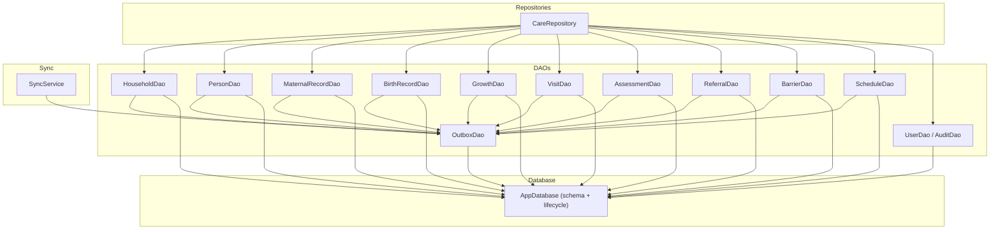
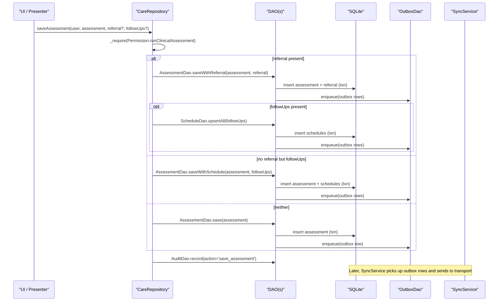
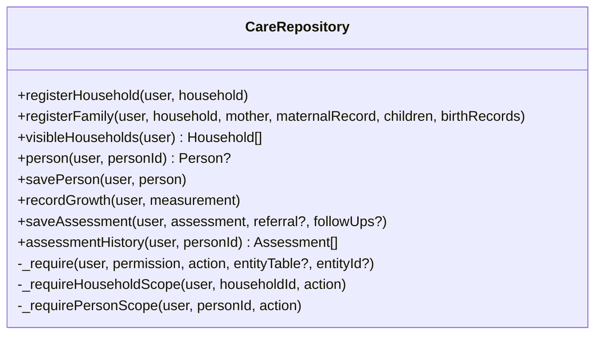
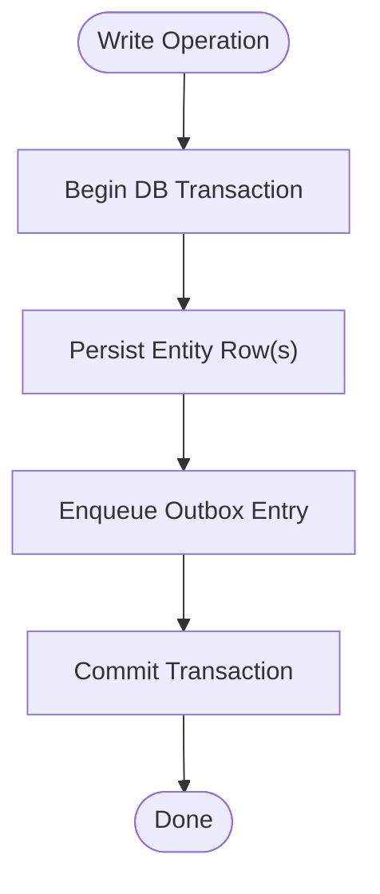
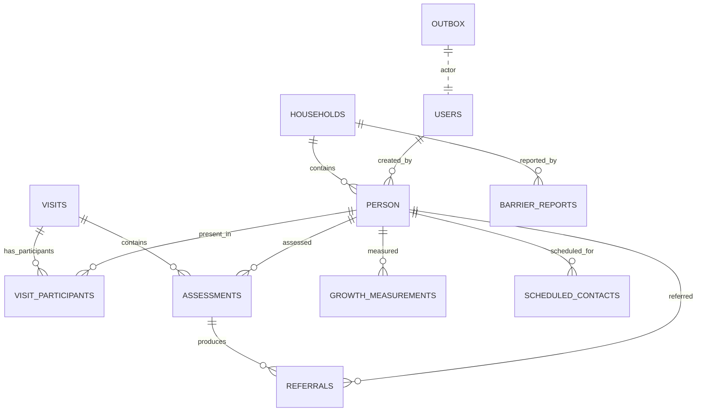
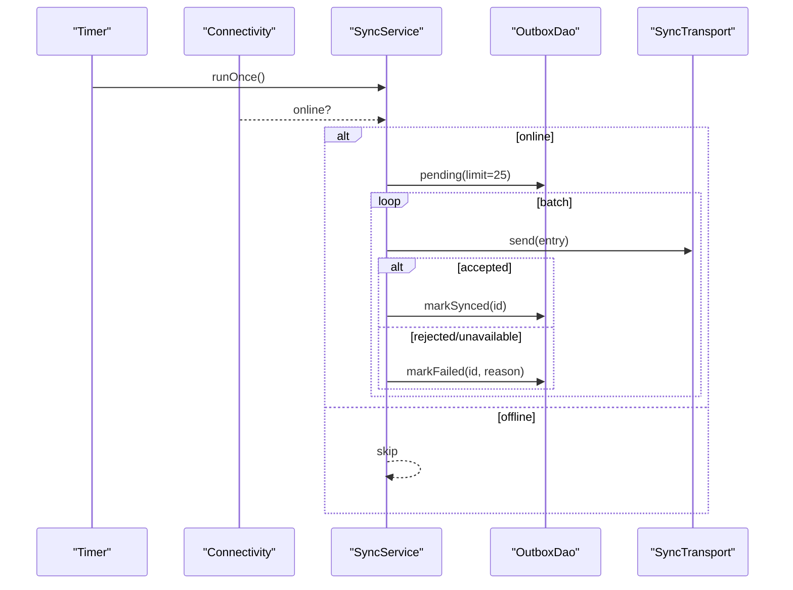
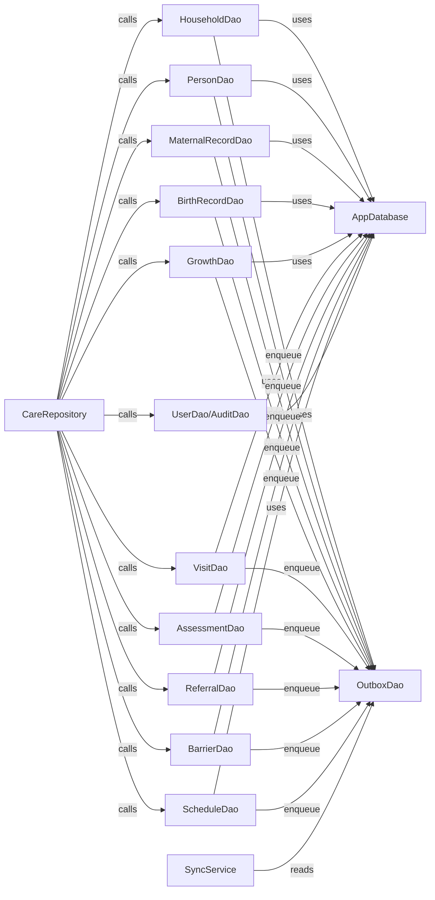

# Data Abstraction Layer

<cite>
**Referenced Files in This Document**
- [care_repository.dart](file://lib/data/repositories/care_repository.dart)
- [household_dao.dart](file://lib/data/local/household_dao.dart)
- [user_dao.dart](file://lib/data/local/user_dao.dart)
- [visit_dao.dart](file://lib/data/local/visit_dao.dart)
- [app_database.dart](file://lib/data/local/app_database.dart)
- [outbox_dao.dart](file://lib/data/local/outbox_dao.dart)
- [sync_service.dart](file://lib/data/sync/sync_service.dart)
</cite>

## Table of Contents
1. Introduction
2. Project Structure
3. Core Components
4. Architecture Overview
5. Detailed Component Analysis
6. Dependency Analysis
7. Performance Considerations
8. Troubleshooting Guide
9. Conclusion

## Introduction
This document explains the data abstraction layer built around repositories and DAOs. CareRepository exposes a clean, permission-gated interface over complex SQLite operations, separating read paths (e.g., visibleHouseholds, person, assessmentHistory) from write paths (e.g., savePerson, recordGrowth, saveAssessment). It orchestrates multiple DAO calls for atomic multi-entity operations such as registerFamily, ensuring consistency across related records. The design also embeds hooks for future synchronization via an outbox queue and a background sync service, enabling offline-first behavior with eventual consistency.

## Project Structure
The data layer is organized into:
- Repositories: business-facing APIs that enforce permissions and orchestrate DAO calls
- DAOs: thin data access objects encapsulating SQLite queries and transactions
- Database: schema definition and database lifecycle management
- Sync: outbox persistence and background synchronization

**Diagram sources**
- [care_repository.dart](file://lib/data/repositories/care_repository.dart)
- [household_dao.dart](file://lib/data/local/household_dao.dart)
- [user_dao.dart](file://lib/data/local/user_dao.dart)
- [visit_dao.dart](file://lib/data/local/visit_dao.dart)
- [app_database.dart](file://lib/data/local/app_database.dart)
- [outbox_dao.dart](file://lib/data/local/outbox_dao.dart)
- [sync_service.dart](file://lib/data/sync/sync_service.dart)

**Section sources**
- [care_repository.dart](file://lib/data/repositories/care_repository.dart)
- [household_dao.dart](file://lib/data/local/household_dao.dart)
- [user_dao.dart](file://lib/data/local/user_dao.dart)
- [visit_dao.dart](file://lib/data/local/visit_dao.dart)
- [app_database.dart](file://lib/data/local/app_database.dart)
- [outbox_dao.dart](file://lib/data/local/outbox_dao.dart)
- [sync_service.dart](file://lib/data/sync/sync_service.dart)

## Core Components
- CareRepository: Central entry point enforcing role-based access control and scoping rules; orchestrates DAO calls for both reads and writes; logs denials and successful actions to audit trail.
- DAOs: Each DAO encapsulates SQLite operations for a bounded domain (households, persons, maternal/birth records, growth, visits, assessments, referrals, barriers, schedules). Writes enqueue outbox entries within the same transaction as the data change.
- AppDatabase: Defines tables, indexes, and lifecycle (open, upgrade, clear). Enables foreign keys and provides in-memory mode for tests.
- OutboxDao: Implements priority-based out-of-order sync queue with retry/backoff semantics and failure surfacing.
- SyncService: Background orchestrator that polls connectivity, batches outbox items by priority, and marks them synced or failed.

Key responsibilities:
- Read operations: visibleHouseholds, person, assessmentHistory, growthSeries, visitHistory, etc.
- Write operations: savePerson, recordGrowth, saveAssessment, issueReferral, scheduleContacts, etc.
- Atomic multi-entity operations: registerFamily (mother, children, birth records), startVisit (visit + participants), saveAssessment with referral/schedule.

**Section sources**
- [care_repository.dart](file://lib/data/repositories/care_repository.dart)
- [household_dao.dart](file://lib/data/local/household_dao.dart)
- [user_dao.dart](file://lib/data/local/user_dao.dart)
- [visit_dao.dart](file://lib/data/local/visit_dao.dart)
- [app_database.dart](file://lib/data/local/app_database.dart)
- [outbox_dao.dart](file://lib/data/local/outbox_dao.dart)
- [sync_service.dart](file://lib/data/sync/sync_service.dart)

## Architecture Overview
The repository pattern isolates UI and business logic from SQLite details while centralizing permission checks and scoping. DAOs provide focused data access. The outbox ensures every local write has a corresponding intent to sync, guaranteeing offline-first durability. SyncService runs opportunistically on connectivity changes and periodic timers.

**Diagram sources**
- [care_repository.dart](file://lib/data/repositories/care_repository.dart)
- [visit_dao.dart](file://lib/data/local/visit_dao.dart)
- [outbox_dao.dart](file://lib/data/local/outbox_dao.dart)
- [sync_service.dart](file://lib/data/sync/sync_service.dart)

## Detailed Component Analysis

### CareRepository: Permission-Gated Orchestration
- Enforces role-based permissions via _require and scoped checks (_requireHouseholdScope, _requirePersonScope).
- Separates read vs write methods clearly; each method delegates to appropriate DAOs after authorization.
- Audits allowed/denied actions consistently.

Examples:
- Read: visibleHouseholds chooses between zone-wide query or caregiver-scoped lookup based on user role.
- Write: savePerson, recordGrowth, saveAssessment gate on specific permissions before delegating to DAOs.
- Atomic multi-entity: registerFamily performs mother, children, and birth records in one DAO transaction and enqueues outbox entries.

**Diagram sources**
- [care_repository.dart](file://lib/data/repositories/care_repository.dart)

**Section sources**
- [care_repository.dart](file://lib/data/repositories/care_repository.dart)

### DAOs: Focused Data Access and Transactional Outbox Enqueue
- HouseholdDao: CRUD and search for households; caseloadFor tailored to worker scope; family code resolution.
- PersonDao: upsert, registerFamily (atomic multi-entity), clientsForVisit (ordered queue), childrenOf, deactivate (soft delete).
- MaternalRecordDao/BirthRecordDao: per-person records with clinical priority enqueue.
- GrowthDao: append-only measurements; series and latest helpers; risk list computation.
- VisitDao: start/complete visits; roll call; open/resumable visits; absentees and days-since-last-visit analytics.
- AssessmentDao: save/saveWithReferral/saveWithSchedule; override recording; overrides listing; daily counts.
- ReferralDao: upsert, byCode, open/open lists, updateStatus, completion stats.
- BarrierDao: save, history, zone-wide patterns, mark resolved.
- ScheduleDao: upsert/upsertAll, due/overdue queries, mark done.
- UserDao/AuditDao: secure PIN handling, sign-in flow, linked household binding, audit logging.
- OutboxDao: enqueue/pending/markSynced/markFailed/prune; priority ordering and backoff.

**Diagram sources**
- [household_dao.dart](file://lib/data/local/household_dao.dart)
- [user_dao.dart](file://lib/data/local/user_dao.dart)
- [visit_dao.dart](file://lib/data/local/visit_dao.dart)
- [outbox_dao.dart](file://lib/data/local/outbox_dao.dart)

**Section sources**
- [household_dao.dart](file://lib/data/local/household_dao.dart)
- [user_dao.dart](file://lib/data/local/user_dao.dart)
- [visit_dao.dart](file://lib/data/local/visit_dao.dart)
- [outbox_dao.dart](file://lib/data/local/outbox_dao.dart)

### AppDatabase: Schema and Lifecycle
- Defines all tables and indexes explicitly; enables foreign keys.
- Provides open/close, in-memory mode for tests, and clear-all for demo resets.
- Upgrade hook ready for migrations.

**Diagram sources**
- [app_database.dart](file://lib/data/local/app_database.dart)

**Section sources**
- [app_database.dart](file://lib/data/local/app_database.dart)

### Sync Service: Opportunistic Background Sync
- Starts periodic timer and listens to connectivity changes.
- Batches pending outbox entries by priority; marks success/failure; exposes status stream.
- Supports manual drain and retry flows.

**Diagram sources**
- [sync_service.dart](file://lib/data/sync/sync_service.dart)
- [outbox_dao.dart](file://lib/data/local/outbox_dao.dart)

**Section sources**
- [sync_service.dart](file://lib/data/sync/sync_service.dart)
- [outbox_dao.dart](file://lib/data/local/outbox_dao.dart)

## Dependency Analysis
- CareRepository depends on multiple DAOs for domain-specific operations and on AuditDao for governance.
- All DAOs depend on AppDatabase for SQLite access and OutboxDao for sync intent.
- SyncService depends on OutboxDao and a pluggable SyncTransport.

**Diagram sources**
- [care_repository.dart](file://lib/data/repositories/care_repository.dart)
- [household_dao.dart](file://lib/data/local/household_dao.dart)
- [user_dao.dart](file://lib/data/local/user_dao.dart)
- [visit_dao.dart](file://lib/data/local/visit_dao.dart)
- [app_database.dart](file://lib/data/local/app_database.dart)
- [outbox_dao.dart](file://lib/data/local/outbox_dao.dart)
- [sync_service.dart](file://lib/data/sync/sync_service.dart)

**Section sources**
- [care_repository.dart](file://lib/data/repositories/care_repository.dart)
- [household_dao.dart](file://lib/data/local/household_dao.dart)
- [user_dao.dart](file://lib/data/local/user_dao.dart)
- [visit_dao.dart](file://lib/data/local/visit_dao.dart)
- [app_database.dart](file://lib/data/local/app_database.dart)
- [outbox_dao.dart](file://lib/data/local/outbox_dao.dart)
- [sync_service.dart](file://lib/data/sync/sync_service.dart)

## Performance Considerations
- Query optimization strategies:
  - Role-aware queries: visibleHouseholds uses different SQL paths for zone workers vs caregivers to avoid accidental over-fetching.
  - Indexed lookups: users.phone, households.community, persons.household_id, growthMeasurements(person_id, taken_at), referrals(reference_code), assessments(person_id, performed_at), scheduled_contacts(due_date), barrier_reports(recorded_at).
  - Batched operations: registerFamily, startVisit, saveWithReferral, saveWithSchedule, upsertAll reduce round trips and ensure atomicity.
  - Efficient aggregations: latestForAll uses correlated subqueries to get most recent measurements without N+1 queries.
- Consistency guarantees:
  - Every write enqueues an outbox entry in the same transaction, preventing orphaned records.
  - Soft deletes (deactivate) preserve historical integrity.
  - Append-only clinical histories (growth, assessments) maintain auditable trajectories.
- Sync performance:
  - Priority ordering ensures urgent referrals leave first.
  - Small batches minimize rollback cost on partial failures.
  - Exponential backoff prevents battery drain and server overload.

[No sources needed since this section provides general guidance]

## Troubleshooting Guide
- Permission denials:
  - AccessDenied exceptions are thrown when roles lack required permissions; denials are logged via AuditDao.denied.
- Sync issues:
  - Use SyncService.stuck to inspect failing outbox entries; use retry to reset attempts and re-run.
  - Check SyncStatusSummary for pending and critical counts; oldestPendingAt indicates staleness.
- Database state:
  - AppDatabase.clearAll can reset demo data while preserving schema.
  - In-memory mode supports isolated testing.

**Section sources**
- [user_dao.dart](file://lib/data/local/user_dao.dart)
- [sync_service.dart](file://lib/data/sync/sync_service.dart)
- [outbox_dao.dart](file://lib/data/local/outbox_dao.dart)
- [app_database.dart](file://lib/data/local/app_database.dart)

## Conclusion
The repository-DAO architecture cleanly separates concerns: CareRepository enforces security and orchestrates workflows; DAOs encapsulate SQLite operations and ensure transactional consistency; the outbox and SyncService provide robust offline-first synchronization. This design scales to future sync requirements by swapping transports and adding new DAOs behind repository interfaces without impacting higher layers.

[No sources needed since this section summarizes without analyzing specific files]