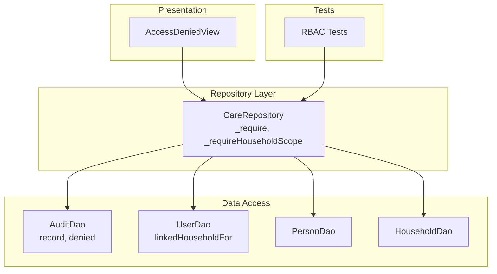
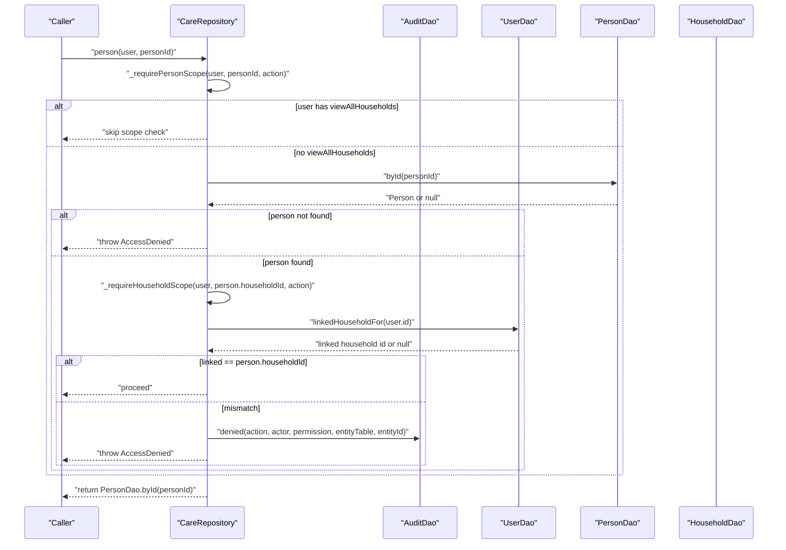
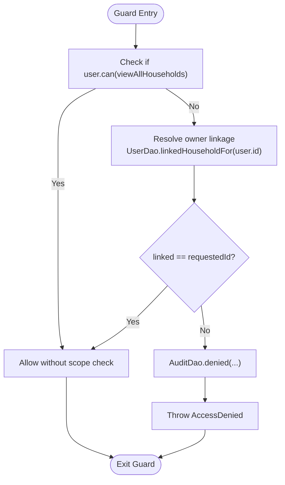
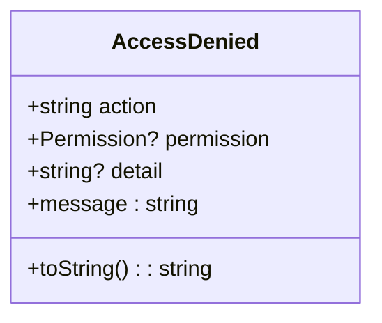
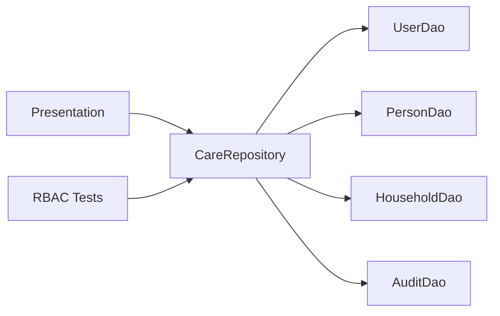

# Permission Enforcement Patterns

<cite>
**Referenced Files in This Document**
- [care_repository.dart](file://lib/data/repositories/care_repository.dart)
- [user_dao.dart](file://lib/data/local/user_dao.dart)
- [ui.dart](file://lib/presentation/shared/ui.dart)
- [rbac_test.dart](file://test/rbac_test.dart)
</cite>

## Table of Contents
1. [Introduction](#introduction)
2. [Project Structure](#project-structure)
3. [Core Components](#core-components)
4. [Architecture Overview](#architecture-overview)
5. [Detailed Component Analysis](#detailed-component-analysis)
6. [Dependency Analysis](#dependency-analysis)
7. [Performance Considerations](#performance-considerations)
8. [Troubleshooting Guide](#troubleshooting-guide)
9. [Conclusion](#conclusion)

## Introduction
This document explains how CareBridge AI enforces permissions at the repository layer to protect health data. It focuses on the _require and _requireHouseholdScope methods, the AccessDenied exception pattern, and the distinction between role-based and scope-based permissions. It also covers audit logging for denied attempts and provides examples showing how caregivers are scoped to their own household while frontline health workers (FHWs) have zone-wide access.

## Project Structure
Permission enforcement is implemented primarily in the repository layer, with supporting components in the local DAO layer and presentation utilities. The key files involved are:
- Repository: care_repository.dart defines the access-controlled gateway and permission guards.
- Audit DAO: user_dao.dart implements audit logging and denial queries.
- UI: ui.dart renders a user-friendly message when access is denied.
- Tests: rbac_test.dart pins exact permissions per role to prevent accidental privilege creep.



**Diagram sources**
- [care_repository.dart:55-126](file://lib/data/repositories/care_repository.dart#L55-L126)
- [user_dao.dart:382-456](file://lib/data/local/user_dao.dart#L382-L456)
- [ui.dart:658-664](file://lib/presentation/shared/ui.dart#L658-L664)
- [rbac_test.dart:20-81](file://test/rbac_test.dart#L20-L81)

**Section sources**
- [care_repository.dart:1-61](file://lib/data/repositories/care_repository.dart#L1-L61)
- [user_dao.dart:345-456](file://lib/data/local/user_dao.dart#L345-L456)
- [ui.dart:658-664](file://lib/presentation/shared/ui.dart#L658-L664)
- [rbac_test.dart:1-91](file://test/rbac_test.dart#L1-L91)

## Core Components
- CareRepository: Centralizes all data operations and enforces permissions before any DAO call.
- AccessDenied: An exception that must be handled explicitly, preventing accidental ignoring of permission failures.
- AuditDao: Records allowed and denied actions; never throws so it cannot break care delivery.
- Role and Permission model: Permissions define capabilities; roles determine which permissions a user holds.

Key responsibilities:
- _require: Enforces role-based permissions for specific actions.
- _requireHouseholdScope: Enforces scope-based permissions for household-level resources.
- _requirePersonScope: Resolves person ownership via household and applies scope checks.

**Section sources**
- [care_repository.dart:35-53](file://lib/data/repositories/care_repository.dart#L35-L53)
- [care_repository.dart:62-126](file://lib/data/repositories/care_repository.dart#L62-L126)
- [user_dao.dart:382-456](file://lib/data/local/user_dao.dart#L382-L456)

## Architecture Overview
The repository acts as the single boundary where permissions are enforced. Every method takes the acting AppUser and validates permissions before delegating to DAOs. Scope checks ensure caregivers can only access their linked household, while FHWs bypass per-household restrictions due to viewAllHouseholds.



**Diagram sources**
- [care_repository.dart:115-126](file://lib/data/repositories/care_repository.dart#L115-L126)
- [care_repository.dart:86-110](file://lib/data/repositories/care_repository.dart#L86-L110)
- [user_dao.dart:382-456](file://lib/data/local/user_dao.dart#L382-L456)

## Detailed Component Analysis

### Permission Guards: _require and _requireHouseholdScope
- _require: Validates that the user holds a specific Permission for an action. On failure, logs a denial and throws AccessDenied.
- _requireHouseholdScope: Allows FHWs (with viewAllHouseholds) to pass through; otherwise verifies the user’s linked household matches the requested householdId. On failure, logs a denial and throws AccessDenied with a caregiver-specific detail.
- _requirePersonScope: For person-level reads, resolves the person’s household and delegates to _requireHouseholdScope.



**Diagram sources**
- [care_repository.dart:86-110](file://lib/data/repositories/care_repository.dart#L86-L110)
- [care_repository.dart:115-126](file://lib/data/repositories/care_repository.dart#L115-L126)
- [user_dao.dart:382-456](file://lib/data/local/user_dao.dart#L382-L456)

**Section sources**
- [care_repository.dart:62-126](file://lib/data/repositories/care_repository.dart#L62-L126)

### AccessDenied Exception Pattern
- Purpose: Forces callers to handle permission failures explicitly; cannot be ignored by returning null or empty results.
- Behavior: Includes a human-readable message suitable for users and optional detail for context.
- Usage: Thrown from guards and other validation points when a user lacks required permissions or scope.



**Diagram sources**
- [care_repository.dart:35-53](file://lib/data/repositories/care_repository.dart#L35-L53)

**Section sources**
- [care_repository.dart:35-53](file://lib/data/repositories/care_repository.dart#L35-L53)

### Role-Based vs Scope-Based Permissions
- Role-based permissions:
  - registerHousehold: Required to create households and edit persons.
  - runClinicalAssessment: Required to start/complete visits and save assessments.
  - recordClinicalVitals: Required to record measurements and clinical details.
  - overrideAiRecommendation: Only FHWs can overrule AI recommendations.
  - viewAllHouseholds: Grants zone-wide visibility and search capabilities.
- Scope-based permissions:
  - Household-level: Enforced via _requireHouseholdScope; caregivers limited to their linked household.
  - Person-level: Enforced via _requirePersonScope; ensures person belongs to authorized household.

Examples:
- Caregivers: Can only see and act on their linked household; attempting to open another household triggers a denial and audit log entry.
- FHWs: Have viewAllHouseholds and thus bypass per-household checks; they can operate across their zone.

**Section sources**
- [care_repository.dart:132-174](file://lib/data/repositories/care_repository.dart#L132-L174)
- [care_repository.dart:181-207](file://lib/data/repositories/care_repository.dart#L181-L207)
- [care_repository.dart:213-240](file://lib/data/repositories/care_repository.dart#L213-L240)
- [care_repository.dart:246-302](file://lib/data/repositories/care_repository.dart#L246-L302)
- [care_repository.dart:308-338](file://lib/data/repositories/care_repository.dart#L308-L338)
- [care_repository.dart:350-441](file://lib/data/repositories/care_repository.dart#L350-L441)
- [care_repository.dart:447-515](file://lib/data/repositories/care_repository.dart#L447-L515)
- [care_repository.dart:527-563](file://lib/data/repositories/care_repository.dart#L527-L563)
- [rbac_test.dart:20-81](file://test/rbac_test.dart#L20-L81)

### Audit Logging of Denied Attempts
- AuditDao.record: Inserts an audit entry; never throws to avoid blocking care delivery.
- AuditDao.denied: Convenience for common denied entries; captures actor, role, action, entity, and reason.
- Denials can be queried via AuditDao.denials for accountability and compliance reporting.

```mermaid
sequenceDiagram
participant Repo as "CareRepository"
participant Audit as "AuditDao"
participant DB as "Database"
Repo->>Audit : "denied(action, actor, permission, entityTable, entityId)"
Audit->>DB : "insert auditLog row"
DB-->>Audit : "success or error"
Note over Audit,DB : "Errors swallowed; audit loss does not block care"
Audit-->>Repo : "return"
```

**Diagram sources**
- [user_dao.dart:382-456](file://lib/data/local/user_dao.dart#L382-L456)

**Section sources**
- [user_dao.dart:382-456](file://lib/data/local/user_dao.dart#L382-L456)

### Presentation Handling of AccessDenied
- AccessDeniedView: Displays a user-friendly message explaining why an action was refused, avoiding technical jargon.
- UI behavior: Ensures users receive clear feedback rather than silent failures.

**Section sources**
- [ui.dart:658-664](file://lib/presentation/shared/ui.dart#L658-L664)

## Dependency Analysis
- CareRepository depends on:
  - UserDao for linking users to households.
  - PersonDao for resolving person ownership.
  - HouseholdDao for caseload and search.
  - AuditDao for recording denials and allowed actions.
- Presentation layers depend on AccessDenied exceptions and render AccessDeniedView for user feedback.
- Tests pin role-permission mappings to prevent accidental privilege escalation.



**Diagram sources**
- [care_repository.dart:28-33](file://lib/data/repositories/care_repository.dart#L28-L33)
- [user_dao.dart:382-456](file://lib/data/local/user_dao.dart#L382-L456)
- [rbac_test.dart:20-81](file://test/rbac_test.dart#L20-L81)

**Section sources**
- [care_repository.dart:28-33](file://lib/data/repositories/care_repository.dart#L28-L33)
- [user_dao.dart:382-456](file://lib/data/local/user_dao.dart#L382-L456)
- [rbac_test.dart:20-81](file://test/rbac_test.dart#L20-L81)

## Performance Considerations
- Early exits: Guards short-circuit when viewAllHouseholds is present, minimizing unnecessary lookups.
- Scoped queries: Different queries for caregivers vs FHWs reduce data exposure and improve efficiency.
- Non-blocking audit: Audit writes are isolated and do not impact critical paths like saving assessments.

[No sources needed since this section provides general guidance]

## Troubleshooting Guide
Common issues and resolutions:
- AccessDenied thrown unexpectedly:
  - Verify the user’s role and permissions.
  - Ensure the requested resource belongs to the user’s linked household for caregivers.
- Missing audit entries:
  - AuditDao.record swallows errors; investigate database connectivity if auditing is incomplete.
- UI shows AccessDeniedView:
  - Confirm that the caller handles AccessDenied and surfaces a friendly message.

**Section sources**
- [care_repository.dart:35-53](file://lib/data/repositories/care_repository.dart#L35-L53)
- [user_dao.dart:382-456](file://lib/data/local/user_dao.dart#L382-L456)
- [ui.dart:658-664](file://lib/presentation/shared/ui.dart#L658-L664)

## Conclusion
CareBridge AI enforces permissions at the repository boundary using explicit guards and exceptions, ensuring that hidden buttons are not the sole form of access control. Role-based permissions define what actions are allowed, while scope-based permissions enforce data boundaries for household and person-level resources. Audit logging captures denied attempts, maintaining accountability for health data protection. This design prevents accidental privilege escalation and ensures robust, auditable access control.