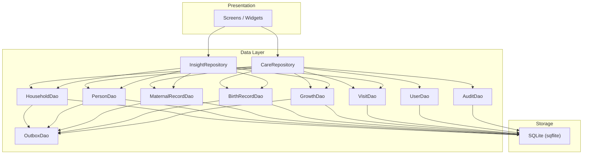
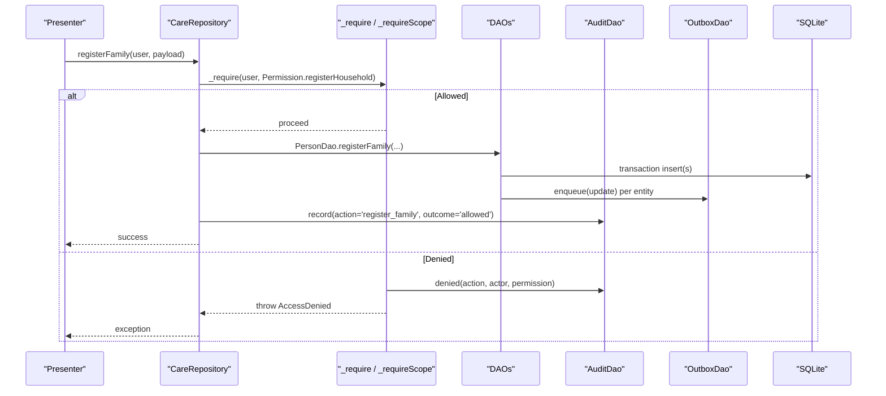
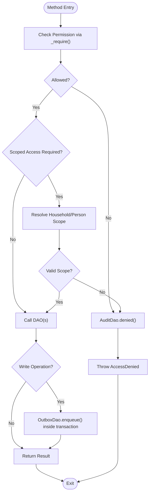
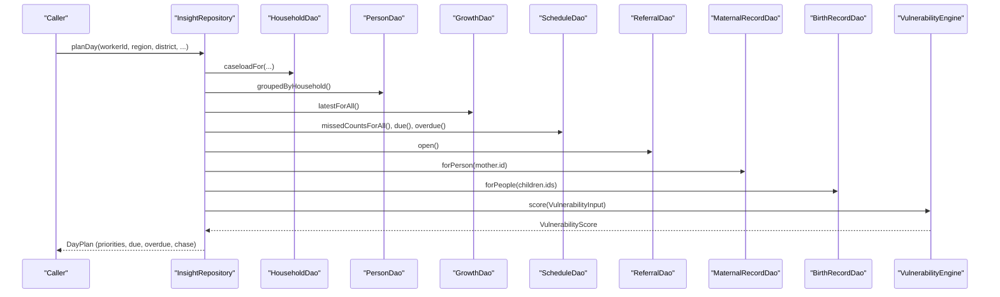
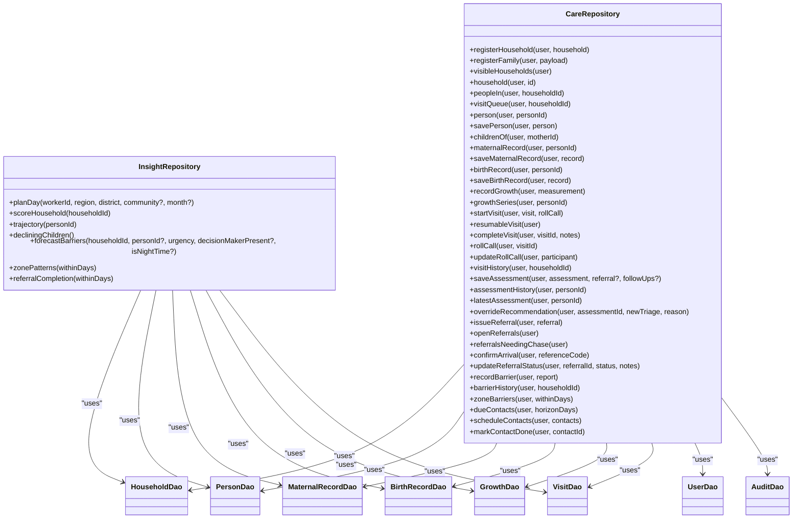

# Repository Abstraction Patterns

<cite>
**Referenced Files in This Document**
- [care_repository.dart](file://lib/data/repositories/care_repository.dart)
- [insight_repository.dart](file://lib/data/repositories/insight_repository.dart)
- [household_dao.dart](file://lib/data/local/household_dao.dart)
- [user_dao.dart](file://lib/data/local/user_dao.dart)
- [visit_dao.dart](file://lib/data/local/visit_dao.dart)
- [pubspec.yaml](file://pubspec.yaml)
</cite>

## Table of Contents
1. Introduction
2. Project Structure
3. Core Components
4. Architecture Overview
5. Detailed Component Analysis
6. Dependency Analysis
7. Performance Considerations
8. Troubleshooting Guide
9. Conclusion

## Introduction
This document explains the repository abstraction patterns used in CareBridge AI to provide clean, secure interfaces between the presentation layer and data access. It focuses on how CareRepository and InsightRepository enforce permissions and business rules, separate read operations from write operations, abstract SQLite complexity, and prepare for future synchronization. The documentation also covers error handling, validation, caching strategies, query optimization, and consistency across data sources.

## Project Structure
CareBridge AI follows a layered architecture:
- Presentation layer calls repositories for all data needs.
- Repositories enforce permissions, orchestrate domain logic, and delegate to DAOs for local SQLite operations.
- DAOs encapsulate SQL queries and transactions, enqueueing sync operations via an outbox for future remote synchronization.

**Diagram sources**
- [care_repository.dart](file://lib/data/repositories/care_repository.dart)
- [insight_repository.dart](file://lib/data/repositories/insight_repository.dart)
- [household_dao.dart](file://lib/data/local/household_dao.dart)
- [user_dao.dart](file://lib/data/local/user_dao.dart)
- [visit_dao.dart](file://lib/data/local/visit_dao.dart)

**Section sources**
- [pubspec.yaml](file://pubspec.yaml)

## Core Components
- CareRepository: Central access-controlled gateway for all records. Every method takes the acting user as the first argument and enforces permissions before any DAO call. It also enforces household/person scoping for caregivers and logs denials.
- InsightRepository: Aggregates data from multiple DAOs to compute vulnerability scores, growth trajectories, barrier forecasts, and daily plans. It batches reads to minimize round trips and performs ranking in memory.

Key responsibilities:
- Permission enforcement at the repository boundary.
- Business rule enforcement (e.g., caregiver scope, clinical-only writes).
- Transactional writes with outbox enqueueing for future sync.
- Batched reads and in-memory scoring for performance.

**Section sources**
- [care_repository.dart](file://lib/data/repositories/care_repository.dart)
- [insight_repository.dart](file://lib/data/repositories/insight_repository.dart)

## Architecture Overview
The repository pattern isolates the presentation layer from database details while centralizing security and business rules. Read paths are optimized for low-end devices by batching queries and computing rankings locally. Write paths ensure atomicity and auditability, and enqueue sync tasks through an outbox.

**Diagram sources**
- [care_repository.dart](file://lib/data/repositories/care_repository.dart)
- [household_dao.dart](file://lib/data/local/household_dao.dart)
- [user_dao.dart](file://lib/data/local/user_dao.dart)

## Detailed Component Analysis

### CareRepository
Responsibilities:
- Enforce role-based permissions using a centralized guard that throws a distinct exception on denial and logs it.
- Enforce household/person scoping for caregivers so they can only access their linked household or person’s household.
- Provide clear separation between reads and writes:
  - Reads: visibleHouseholds, household, peopleIn, visitQueue, person, childrenOf, maternalRecord, birthRecord, growthSeries, visitHistory, assessmentHistory, latestAssessment, openReferrals, referralsNeedingChase, confirmArrival, updateReferralStatus, barrierHistory, zoneBarriers, dueContacts.
  - Writes: registerHousehold, registerFamily, savePerson, saveMaternalRecord, saveBirthRecord, recordGrowth, startVisit, completeVisit, rollCall, updateRollCall, saveAssessment, overrideRecommendation, issueReferral, recordBarrier, scheduleContacts, markContactDone.
- Ensure critical multi-step writes are atomic (e.g., family registration, assessment with referral/schedule).
- Validate inputs where necessary (e.g., minimum reason length for overriding recommendations).

Error handling:
- Throws AccessDenied for permission failures; callers must handle exceptions rather than ignore them.
- Denials are recorded via AuditDao.denied with actor, permission, and entity context.

Caching and consistency:
- No explicit in-memory cache; relies on SQLite and batched DAO queries.
- Writes enqueue sync operations via OutboxDao within transactions, ensuring every persisted change has a corresponding intent to sync.

Performance characteristics:
- Scoping checks avoid broad scans by leveraging UserDao.linkedHouseholdFor and PersonDao lookups.
- Writes use transactions to guarantee atomicity and reduce round trips.

Example method signatures (described):
- registerHousehold(AppUser, Household)
- registerFamily(AppUser, {Household, Person?, MaternalRecord?, List<Person>, Map<String, BirthRecord>})
- visibleHouseholds(AppUser) -> List<Household>
- household(AppUser, String id) -> Household?
- peopleIn(AppUser, String householdId) -> List<Person>
- visitQueue(AppUser, String householdId) -> List<Person>
- person(AppUser, String personId) -> Person?
- savePerson(AppUser, Person)
- childrenOf(AppUser, String motherId) -> List<Person>
- maternalRecord(AppUser, String personId) -> MaternalRecord?
- saveMaternalRecord(AppUser, MaternalRecord)
- birthRecord(AppUser, String personId) -> BirthRecord?
- saveBirthRecord(AppUser, BirthRecord)
- recordGrowth(AppUser, GrowthMeasurement)
- growthSeries(AppUser, String personId) -> List<GrowthMeasurement>
- startVisit(AppUser, Visit, List<VisitParticipant>)
- resumableVisit(AppUser) -> Visit?
- completeVisit(AppUser, String visitId, {String? notes})
- rollCall(AppUser, String visitId) -> List<VisitParticipant>
- updateRollCall(AppUser, VisitParticipant)
- visitHistory(AppUser, String householdId) -> List<Visit>
- saveAssessment(AppUser, Assessment, {Referral?, List<ScheduledContact>})
- assessmentHistory(AppUser, String personId) -> List<Assessment>
- latestAssessment(AppUser, String personId) -> Assessment?
- overrideRecommendation(AppUser, {String assessmentId, TriageLevel newTriage, String reason})
- issueReferral(AppUser, Referral)
- openReferrals(AppUser) -> List<Referral>
- referralsNeedingChase(AppUser) -> List<Referral>
- confirmArrival(AppUser, String referenceCode) -> Referral?
- updateReferralStatus(AppUser, {String referralId, ReferralStatus status, String? outcomeNotes})
- recordBarrier(AppUser, BarrierReport)
- barrierHistory(AppUser, String householdId) -> List<CareBarrier>
- zoneBarriers(AppUser, {int withinDays}) -> List<BarrierReport>
- dueContacts(AppUser, {int horizonDays}) -> List<ScheduledContact>
- scheduleContacts(AppUser, List<ScheduledContact>)
- markContactDone(AppUser, String contactId)

**Diagram sources**
- [care_repository.dart](file://lib/data/repositories/care_repository.dart)
- [user_dao.dart](file://lib/data/local/user_dao.dart)

**Section sources**
- [care_repository.dart](file://lib/data/repositories/care_repository.dart)

### InsightRepository
Responsibilities:
- Assemble inputs for pure AI engines from heterogeneous local data.
- Compute day plans and vulnerability scores using batched reads and in-memory ranking.
- Provide trajectory analysis for child growth and barrier forecasting.

Key methods (described):
- planDay({workerId, region, district, community?, month?}) -> DayPlan
- scoreHousehold(householdId) -> VulnerabilityScore
- trajectory(personId) -> TrajectoryResult
- decliningChildren() -> List<(Person, TrajectoryResult)>
- forecastBarriers({householdId, personId?, urgency, decisionMakerPresent?, isNightTime?}) -> BarrierForecast
- zonePatterns({withinDays}) -> List<BarrierPattern>
- referralCompletion({withinDays}) -> (issued, arrived, rate)

Performance strategy:
- Batched reads: caseload, grouped persons, latest growth, missed counts, open referrals, due/overdue contacts.
- In-memory ranking and tie-breaking based on data completeness.
- Avoid per-household round trips by grouping results and precomputing maps.

Consistency:
- Uses the same input assembly for both list ranking and detail scoring to ensure consistent numbers across views.

**Diagram sources**
- [insight_repository.dart](file://lib/data/repositories/insight_repository.dart)
- [household_dao.dart](file://lib/data/local/household_dao.dart)

**Section sources**
- [insight_repository.dart](file://lib/data/repositories/insight_repository.dart)

### DAOs and Local Data Access
- HouseholdDao: CRUD and search for households; caseload queries tailored to worker roles and communities.
- PersonDao: Family registration in one transaction; client ordering for visits; grouping by household; deactivation without deletion.
- MaternalRecordDao/BirthRecordDao: Upserts and targeted queries; bulk retrieval for multiple persons.
- GrowthDao: Append-only measurements; series and latest queries; risk filtering; latest-for-all correlated subquery for performance.
- VisitDao: Visit lifecycle and participant management.
- UserDao: Secure PIN hashing and verification; sign-in flow; linking caregivers to households; audit logging.
- AuditDao: Non-blocking audit recording; convenience for denials; recent/denials queries.

Sync preparation:
- All writes enqueue OutboxDao entries within transactions, ensuring every persisted change has a corresponding sync intent.

**Section sources**
- [household_dao.dart](file://lib/data/local/household_dao.dart)
- [user_dao.dart](file://lib/data/local/user_dao.dart)
- [visit_dao.dart](file://lib/data/local/visit_dao.dart)

## Dependency Analysis
Repositories depend on DAOs for data operations and on AuditDao for governance. InsightRepository additionally depends on AI engines for scoring and forecasting. DAOs depend on SQLite via sqflite and on OutboxDao for sync queuing.

**Diagram sources**
- [care_repository.dart](file://lib/data/repositories/care_repository.dart)
- [insight_repository.dart](file://lib/data/repositories/insight_repository.dart)
- [household_dao.dart](file://lib/data/local/household_dao.dart)
- [user_dao.dart](file://lib/data/local/user_dao.dart)
- [visit_dao.dart](file://lib/data/local/visit_dao.dart)

**Section sources**
- [care_repository.dart](file://lib/data/repositories/care_repository.dart)
- [insight_repository.dart](file://lib/data/repositories/insight_repository.dart)
- [household_dao.dart](file://lib/data/local/household_dao.dart)
- [user_dao.dart](file://lib/data/local/user_dao.dart)
- [visit_dao.dart](file://lib/data/local/visit_dao.dart)

## Performance Considerations
- Batched reads: InsightRepository aggregates data via single queries (e.g., groupedByHousehold, latestForAll, missedCountsForAll) to avoid N+1 round trips.
- In-memory ranking: Sorting and tie-breaking occur in Dart after loading minimal datasets, reducing database load.
- Correlated subqueries: GrowthDao.latestForAll uses a correlated subquery to fetch latest measurements efficiently.
- Transactional writes: DAOs wrap writes in transactions to ensure atomicity and enqueue sync operations consistently.
- Query shaping: DAOs tailor queries to actual usage patterns (e.g., visit queue ordering computed in Dart due to derived fields).

[No sources needed since this section provides general guidance]

## Troubleshooting Guide
Common issues and resolutions:
- AccessDenied exceptions: Occur when a user lacks required permissions or is scoped incorrectly. Inspect the action and permission logged by AuditDao.denied.
- Wrong PIN or unknown phone: SignIn returns specific failure reasons; verify account existence and PIN setup.
- Missing data for scoring: Ensure related records exist (e.g., maternal/birth records, growth series) before calling insight methods.
- Sync anomalies: Check OutboxDao entries if expected changes do not appear remotely; ensure transactions completed successfully.

Operational tips:
- Use AuditDao.recent and AuditDao.denials to investigate access control events.
- For visit-related issues, validate roll call updates and visit lifecycle transitions.
- For growth trajectory anomalies, verify append-only behavior and series ordering.

**Section sources**
- [user_dao.dart](file://lib/data/local/user_dao.dart)
- [care_repository.dart](file://lib/data/repositories/care_repository.dart)

## Conclusion
CareRepository and InsightRepository implement robust repository abstractions that enforce permissions, encapsulate business rules, and optimize data access for offline-first scenarios. They separate reads and writes clearly, leverage batched queries and in-memory processing for performance, and prepare for future synchronization through transactional outbox enqueueing. This design ensures consistent error handling, data validation, and maintainability across the application.

[No sources needed since this section summarizes without analyzing specific files]