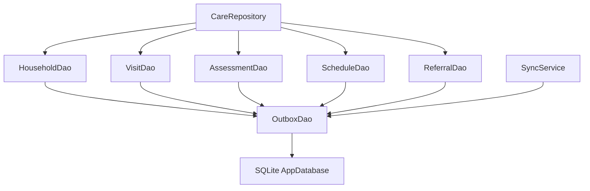
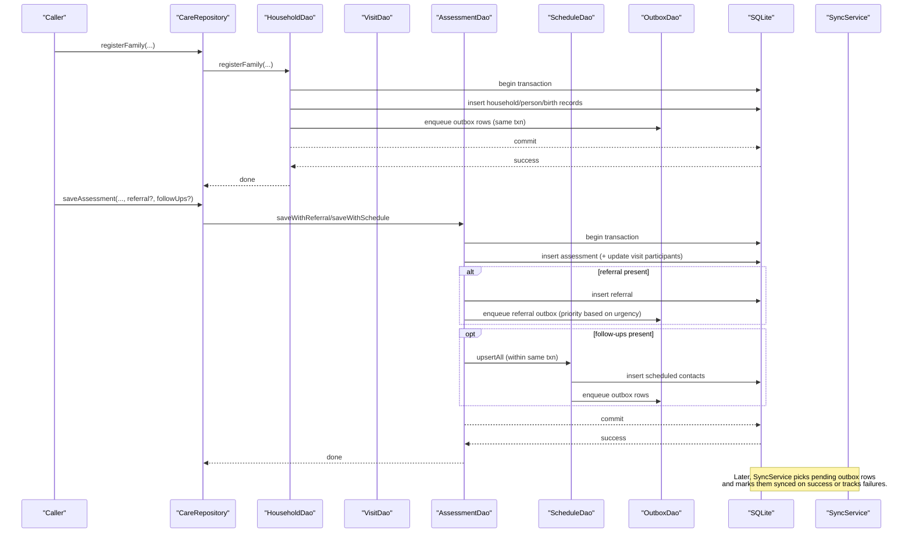
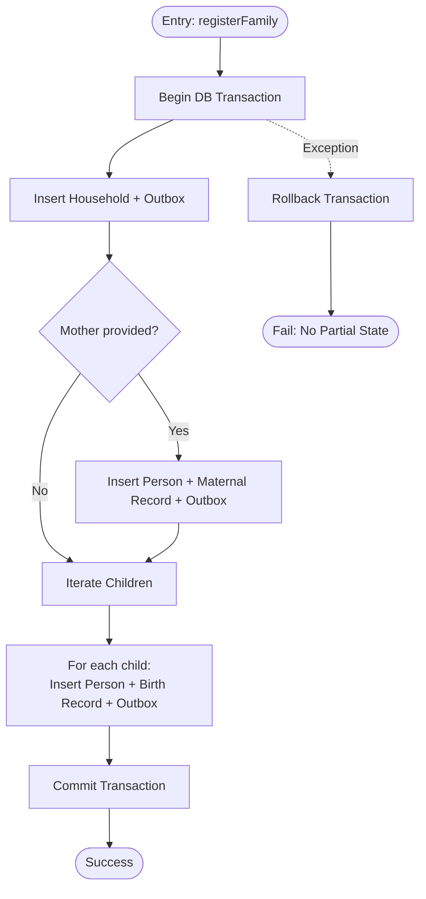
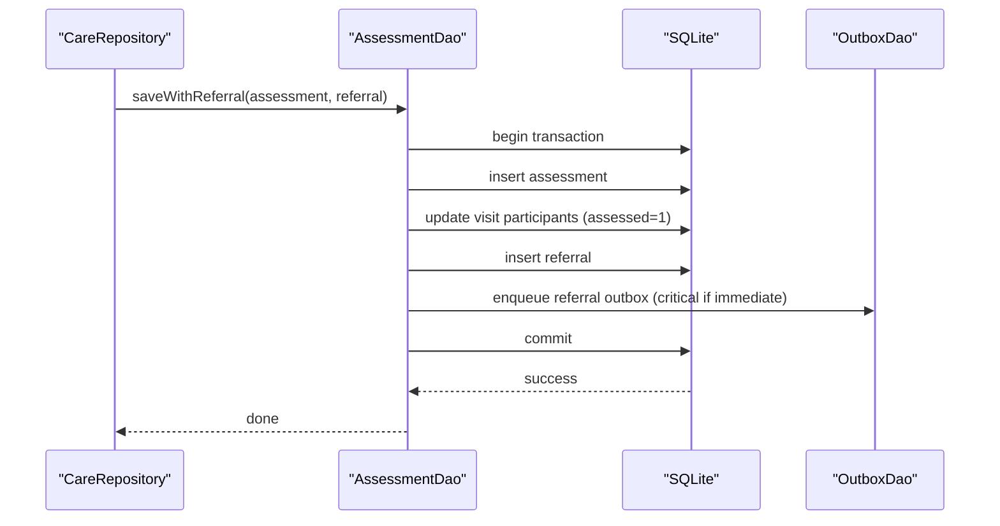
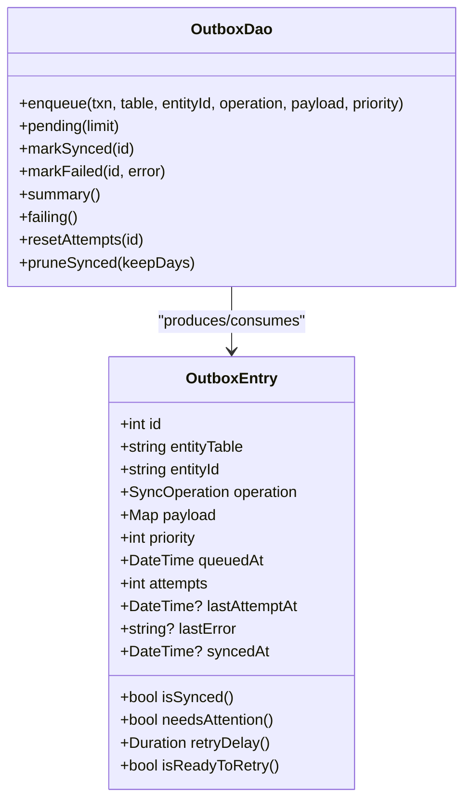
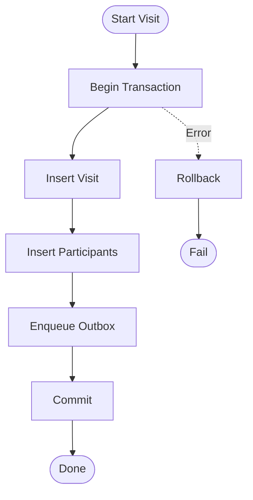
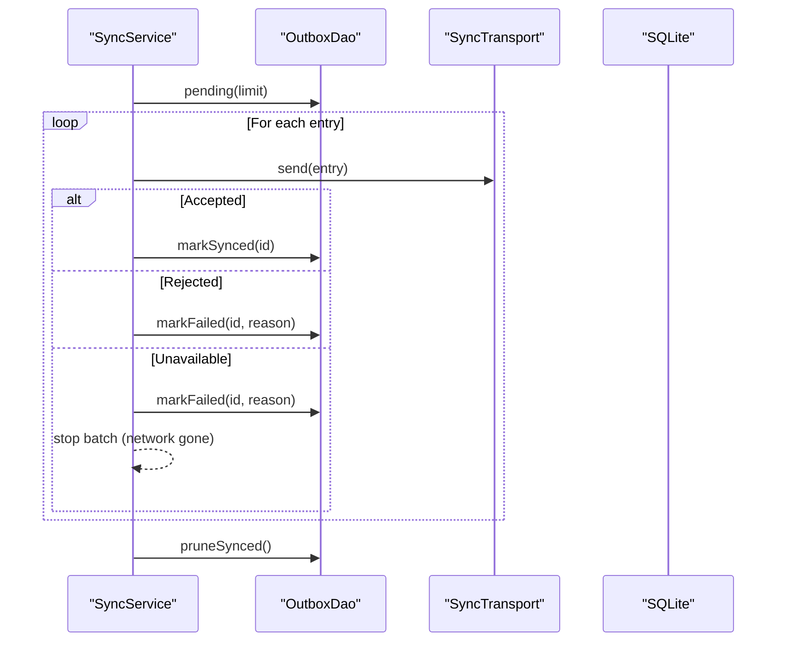
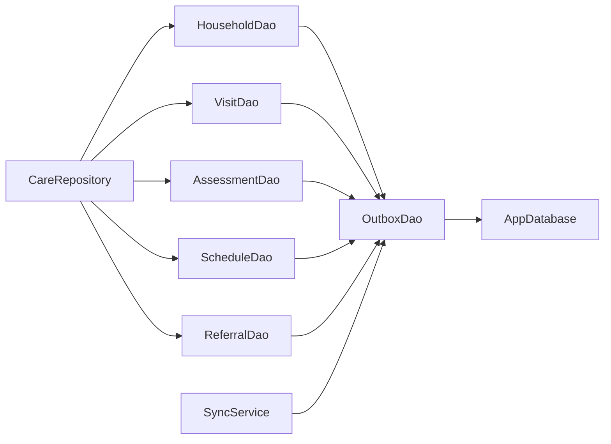

# Transaction Management

<cite>
**Referenced Files in This Document**
- [app_database.dart](file://lib/data/local/app_database.dart)
- [household_dao.dart](file://lib/data/local/household_dao.dart)
- [outbox_dao.dart](file://lib/data/local/outbox_dao.dart)
- [visit_dao.dart](file://lib/data/local/visit_dao.dart)
- [care_repository.dart](file://lib/data/repositories/care_repository.dart)
- [sync_service.dart](file://lib/data/sync/sync_service.dart)
</cite>

## Table of Contents
1. [Introduction](#introduction)
2. [Project Structure](#project-structure)
3. [Core Components](#core-components)
4. [Architecture Overview](#architecture-overview)
5. [Detailed Component Analysis](#detailed-component-analysis)
6. [Dependency Analysis](#dependency-analysis)
7. [Performance Considerations](#performance-considerations)
8. [Troubleshooting Guide](#troubleshooting-guide)
9. [Conclusion](#conclusion)

## Introduction
This document explains how CareBridge AI’s repository and DAO layers ensure data integrity through database transactions, especially in offline-first environments with intermittent connectivity. It focuses on:
- Atomicity for critical operations like family registration to prevent partial records (e.g., a twin birth half-saved).
- Coordinated multi-table writes for assessments, referrals, and follow-up contacts as single transactions.
- How DAOs use SQLite transactions and coordinate with the outbox to guarantee that every persisted record has a corresponding sync intent within the same transaction.
- Error handling and rollback strategies when operations fail mid-way.
- Offline-first guarantees where local persistence is immediate and reliable, while synchronization happens opportunistically.

## Project Structure
The transactional logic spans several files:
- Database schema and configuration live in the app database file.
- DAOs encapsulate per-entity write paths and enforce atomicity by wrapping writes in transactions and enqueuing outbox entries.
- The repository coordinates cross-cutting concerns (permissions, auditing) and orchestrates multi-step operations across DAOs.
- Sync service consumes the outbox to send changes to a server when connectivity is available.

**Diagram sources**
- [care_repository.dart](file://lib/data/repositories/care_repository.dart)
- [household_dao.dart](file://lib/data/local/household_dao.dart)
- [visit_dao.dart](file://lib/data/local/visit_dao.dart)
- [outbox_dao.dart](file://lib/data/local/outbox_dao.dart)
- [sync_service.dart](file://lib/data/sync/sync_service.dart)

**Section sources**
- [app_database.dart](file://lib/data/local/app_database.dart)
- [household_dao.dart](file://lib/data/local/household_dao.dart)
- [outbox_dao.dart](file://lib/data/local/outbox_dao.dart)
- [visit_dao.dart](file://lib/data/local/visit_dao.dart)
- [care_repository.dart](file://lib/data/repositories/care_repository.dart)
- [sync_service.dart](file://lib/data/sync/sync_service.dart)

## Core Components
- AppDatabase: Initializes SQLite, enables foreign keys, defines schema, and exposes transactional access.
- DAOs: Encapsulate entity-specific writes; each write is wrapped in a transaction and enqueues an outbox entry atomically.
- OutboxDao: Manages the sync outbox table, including priority ordering, failure tracking, and retry/backoff.
- CareRepository: Enforces permissions and audits actions; orchestrates multi-step operations across DAOs.
- SyncService: Opportunistically sends outbox items to a transport (stubbed for now), marking success or failure.

Key transactional principles:
- Every write to a business table is paired with an outbox enqueue inside the same transaction.
- If any step fails, the entire transaction rolls back, preventing partial state.
- Sync occurs later, independently, without blocking UI or risking inconsistent local state.

**Section sources**
- [app_database.dart](file://lib/data/local/app_database.dart)
- [household_dao.dart](file://lib/data/local/household_dao.dart)
- [outbox_dao.dart](file://lib/data/local/outbox_dao.dart)
- [care_repository.dart](file://lib/data/repositories/care_repository.dart)
- [sync_service.dart](file://lib/data/sync/sync_service.dart)

## Architecture Overview
The system ensures atomicity at the database layer and consistency across tables via coordinated transactions. The outbox decouples persistence from synchronization, enabling robust offline-first behavior.

**Diagram sources**
- [care_repository.dart](file://lib/data/repositories/care_repository.dart)
- [household_dao.dart](file://lib/data/local/household_dao.dart)
- [visit_dao.dart](file://lib/data/local/visit_dao.dart)
- [outbox_dao.dart](file://lib/data/local/outbox_dao.dart)
- [sync_service.dart](file://lib/data/sync/sync_service.dart)

## Detailed Component Analysis

### Family Registration Atomicity (registerFamily)
- Purpose: Ensure that registering a mother and one or more newborns (including twins) is atomic. Prevents scenarios where the mother is saved but the second twin is lost due to device failure mid-write.
- Implementation:
  - Single SQLite transaction wraps inserts for household, persons, maternal records, and birth records.
  - Each insert is paired with an outbox enqueue in the same transaction.
  - If any operation fails, the transaction rolls back, leaving no partial state.
- Outcome:
  - All-or-nothing persistence for the entire family unit.
  - Immediate local durability; sync intent guaranteed alongside data.

**Diagram sources**
- [household_dao.dart](file://lib/data/local/household_dao.dart)
- [outbox_dao.dart](file://lib/data/local/outbox_dao.dart)

**Section sources**
- [household_dao.dart](file://lib/data/local/household_dao.dart)

### Assessment Coordination (saveAssessment)
- Purpose: Persist assessment, optional referral, and optional follow-up contacts as a single transaction to avoid orphaned decisions (e.g., urgent triage without referral).
- Implementation:
  - Repository checks permissions and delegates to AssessmentDao methods:
    - saveWithReferral: persists assessment and referral together, enqueues both outbox entries with appropriate priorities.
    - saveWithSchedule: persists assessment and scheduled contacts together.
    - save: persists assessment alone.
  - Visit participants are updated to mark assessed status within the same transaction.
- Outcome:
  - Consistent clinical decision records: assessment, referral, and follow-ups are always coherently stored.
  - Prioritized sync for urgent referrals.

**Diagram sources**
- [care_repository.dart](file://lib/data/repositories/care_repository.dart)
- [visit_dao.dart](file://lib/data/local/visit_dao.dart)
- [outbox_dao.dart](file://lib/data/local/outbox_dao.dart)

**Section sources**
- [care_repository.dart](file://lib/data/repositories/care_repository.dart)
- [visit_dao.dart](file://lib/data/local/visit_dao.dart)

### Outbox Integration and Priority Ordering
- Purpose: Guarantee that every persisted record has a corresponding sync intent written atomically with it.
- Implementation:
  - OutboxDao.enqueue is called within the same transaction as the business write.
  - Priority levels determine order: critical > clinical > routine > background.
  - Failure tracking includes attempts, last attempt time, and last error; exponential backoff is computed client-side.
- Outcome:
  - Robust offline-first: data persists immediately; sync happens opportunistically.
  - Urgent items leave first when connectivity appears.

**Diagram sources**
- [outbox_dao.dart](file://lib/data/local/outbox_dao.dart)

**Section sources**
- [outbox_dao.dart](file://lib/data/local/outbox_dao.dart)

### Visit Lifecycle Transactions
- Purpose: Ensure visit start, roll call, completion, and related updates are atomic.
- Implementation:
  - VisitDao.start inserts visit and participants within a single transaction and enqueues outbox.
  - VisitDao.complete updates visit fields and enqueues outbox atomically.
- Outcome:
  - Consistent encounter state even under interruptions.

**Diagram sources**
- [visit_dao.dart](file://lib/data/local/visit_dao.dart)
- [outbox_dao.dart](file://lib/data/local/outbox_dao.dart)

**Section sources**
- [visit_dao.dart](file://lib/data/local/visit_dao.dart)

### Offline-First Synchronization
- Purpose: Provide eventual consistency without blocking user workflows.
- Implementation:
  - SyncService listens for connectivity changes and runs periodically.
  - Fetches pending outbox rows ordered by priority and age.
  - Sends via SyncTransport; marks synced on success, tracks failures with backoff.
  - Prunes old synced rows to manage storage.
- Outcome:
  - Data remains safe locally regardless of network conditions.
  - Urgent items prioritized during brief connectivity windows.

**Diagram sources**
- [sync_service.dart](file://lib/data/sync/sync_service.dart)
- [outbox_dao.dart](file://lib/data/local/outbox_dao.dart)

**Section sources**
- [sync_service.dart](file://lib/data/sync/sync_service.dart)
- [outbox_dao.dart](file://lib/data/local/outbox_dao.dart)

## Dependency Analysis
- CareRepository depends on DAOs for all data operations and enforces permissions and audit logging.
- DAOs depend on AppDatabase for SQLite access and OutboxDao for sync intents.
- SyncService depends on OutboxDao for pending items and a pluggable SyncTransport for sending.
- AppDatabase centralizes schema and transactional capabilities.

**Diagram sources**
- [care_repository.dart](file://lib/data/repositories/care_repository.dart)
- [household_dao.dart](file://lib/data/local/household_dao.dart)
- [visit_dao.dart](file://lib/data/local/visit_dao.dart)
- [outbox_dao.dart](file://lib/data/local/outbox_dao.dart)
- [sync_service.dart](file://lib/data/sync/sync_service.dart)

**Section sources**
- [care_repository.dart](file://lib/data/repositories/care_repository.dart)
- [household_dao.dart](file://lib/data/local/household_dao.dart)
- [visit_dao.dart](file://lib/data/local/visit_dao.dart)
- [outbox_dao.dart](file://lib/data/local/outbox_dao.dart)
- [sync_service.dart](file://lib/data/sync/sync_service.dart)

## Performance Considerations
- Batch sizes: SyncService uses small batches (default 25) to maximize progress during short connectivity windows.
- Priority ordering: Critical items (immediate referrals, urgent assessments) are sent before routine registrations.
- Append-only design: Growth measurements and clinical history are append-only to preserve series integrity and support trajectory analysis.
- Indexed queries: DAOs leverage indexes for common queries (e.g., visits by household, assessments by person) to reduce load on low-end devices.

[No sources needed since this section provides general guidance]

## Troubleshooting Guide
Common issues and strategies:
- Partial writes prevented: Any exception within a transaction causes a rollback, ensuring no half-recorded families or assessments.
- Stuck outbox entries: Entries with repeated failures are surfaced via OutboxDao.failing; users can reset attempts and retry.
- Connectivity drops: SyncService stops the current batch when unavailable to avoid inflating attempt counters; resumes when connectivity returns.
- Audit trail: Access denials and clinical overrides are logged for accountability and model improvement.

**Section sources**
- [outbox_dao.dart](file://lib/data/local/outbox_dao.dart)
- [sync_service.dart](file://lib/data/sync/sync_service.dart)
- [visit_dao.dart](file://lib/data/local/visit_dao.dart)

## Conclusion
CareBridge AI’s transaction management ensures data integrity through:
- Atomic multi-table writes in DAOs using SQLite transactions.
- Guaranteed pairing of business records with outbox entries within the same transaction.
- Prioritized, opportunistic synchronization that respects connectivity constraints.
- Clear error handling and rollback semantics that prevent partial state.
This approach makes the app resilient in offline-first settings while maintaining clinical accuracy and operational reliability.