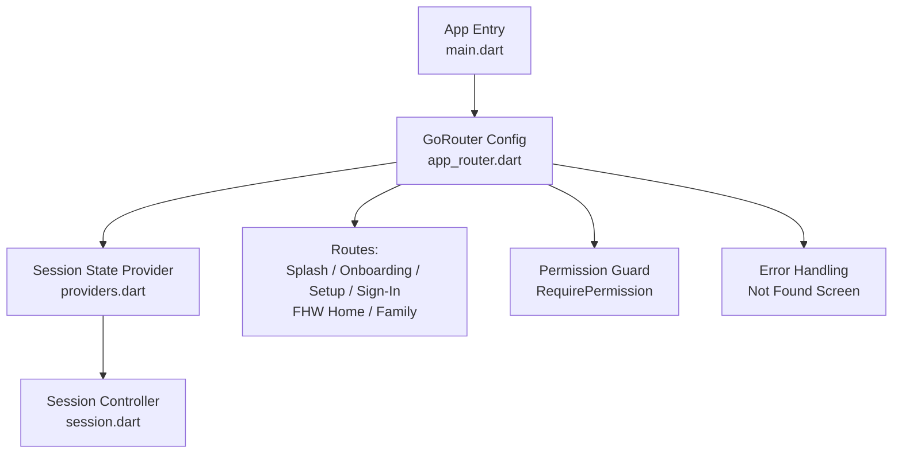
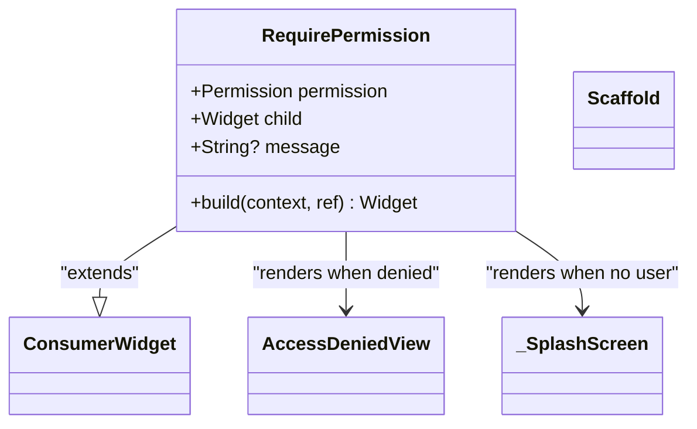
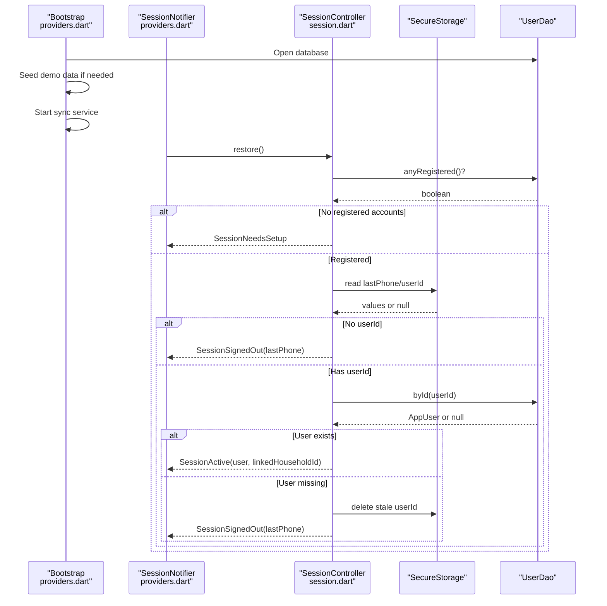
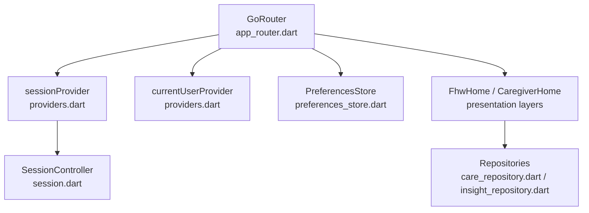

# Routing & Navigation Patterns

<cite>
**Referenced Files in This Document**
- [main.dart](file://lib/main.dart)
- [app_router.dart](file://lib/core/router/app_router.dart)
- [session.dart](file://lib/core/auth/session.dart)
- [providers.dart](file://lib/app/providers.dart)
</cite>

## Table of Contents
1. [Introduction](#introduction)
2. [Project Structure](#project-structure)
3. [Core Components](#core-components)
4. [Architecture Overview](#architecture-overview)
5. [Detailed Component Analysis](#detailed-component-analysis)
6. [Dependency Analysis](#dependency-analysis)
7. [Performance Considerations](#performance-considerations)
8. [Troubleshooting Guide](#troubleshooting-guide)
9. [Conclusion](#conclusion)

## Introduction
This document explains the routing and navigation patterns in CareBridge AI, focusing on how GoRouter implements role-aware navigation with permission guards, session-based routing logic for CHO (caregiver) versus caregiver interfaces, deep linking support, route guards, and integration with the permission system. It also covers programmatic navigation, route parameters handling, coordination with session management, navigation state persistence, and how routes handle different user roles and permissions.

## Project Structure
The routing setup is centered around a small set of files:
- Application entry point wires up the app shell and provides the router configuration.
- Router configuration defines routes, redirects based on session state, and wraps protected screens with permission checks.
- Session management encapsulates authentication states and persistence, driving routing decisions.
- Providers orchest bootstrap, session state, and current user exposure to the UI.



**Diagram sources**
- [main.dart:16-34](file://lib/main.dart#L16-L34)
- [app_router.dart:63-159](file://lib/core/router/app_router.dart#L63-L159)
- [providers.dart:68-128](file://lib/app/providers.dart#L68-L128)
- [session.dart:28-67](file://lib/core/auth/session.dart#L28-L67)

**Section sources**
- [main.dart:16-34](file://lib/main.dart#L16-L34)
- [app_router.dart:34-48](file://lib/core/router/app_router.dart#L34-L48)
- [providers.dart:68-128](file://lib/app/providers.dart#L68-L128)
- [session.dart:28-67](file://lib/core/auth/session.dart#L28-L67)

## Core Components
- GoRouter configuration:
  - Defines route constants and a helper to compute home routes by role.
  - Implements a redirect function that enforces session-based and role-based access.
  - Wraps protected screens with RequirePermission for fine-grained capability checks.
  - Provides error handling for unknown routes.
- Session management:
  - Models session states (loading, needs setup, signed out, active).
  - Persists user identity securely and manages lockout behavior.
  - Exposes helpers to determine role and linked household scope.
- Providers:
  - Bootstrap database and sync services.
  - Manage session state via a notifier and expose current user and linked household.

Key responsibilities:
- Role-aware navigation: Redirects users to their appropriate home screen based on role.
- Permission guards: Enforce capability requirements at the screen level using RequirePermission.
- Deep linking: GoRouter’s built-in location matching supports deep links; the redirect ensures only authorized locations are reachable.
- Programmatic navigation: context.go() used within splash logic and error handlers.
- Route parameters: Not currently used in defined routes; can be added via GoRoute path params.

**Section sources**
- [app_router.dart:34-48](file://lib/core/router/app_router.dart#L34-L48)
- [app_router.dart:63-159](file://lib/core/router/app_router.dart#L63-L159)
- [app_router.dart:167-196](file://lib/core/router/app_router.dart#L167-L196)
- [session.dart:28-67](file://lib/core/auth/session.dart#L28-L67)
- [providers.dart:68-128](file://lib/app/providers.dart#L68-L128)

## Architecture Overview
The routing architecture integrates GoRouter with Riverpod providers to make navigation reactive to session changes. The redirect function centralizes authorization logic, while RequirePermission adds per-screen capability enforcement.

```mermaid
sequenceDiagram
participant App as "CareBridgeApp<br/>main.dart"
participant Router as "GoRouter<br/>app_router.dart"
participant Session as "SessionNotifier<br/>providers.dart"
participant Controller as "SessionController<br/>session.dart"
participant Pref as "PreferencesStore"
App->>Router : Initialize with routerConfig
Router->>Session : Watch sessionProvider
Session->>Controller : restore()
Controller-->>Session : SessionState (Loading/NeedsSetup/SignedOut/Active)
Router->>Router : redirect(context, state)
alt SessionLoading
Router-->>Router : Stay on Splash or redirect to Splash
else SessionNeedsSetup
Router-->>Router : Redirect to Setup if not already there
else SessionSignedOut
Router-->>Router : Allow Onboarding/SignIn/Setup; otherwise redirect to SignIn
else SessionActive(user)
Router-->>Router : Redirect pre-auth screens to role home
Router-->>Router : Enforce role boundaries (/fhw vs /family)
end
Router-->>App : Render matched route or error screen
```

**Diagram sources**
- [main.dart:20-34](file://lib/main.dart#L20-L34)
- [app_router.dart:63-159](file://lib/core/router/app_router.dart#L63-L159)
- [providers.dart:73-122](file://lib/app/providers.dart#L73-L122)
- [session.dart:97-112](file://lib/core/auth/session.dart#L97-L112)

## Detailed Component Analysis

### GoRouter Configuration and Redirect Logic
- Routes:
  - Splash, Onboarding, Setup, SignIn, FHW Home, Family.
  - homeFor(role) computes the default landing page based on role.
- Redirect:
  - SessionLoading: Hold on Splash until session resolves.
  - SessionNeedsSetup: Ensure Setup is visible.
  - SessionSignedOut: Allow Onboarding once; then SignIn; Setup always reachable.
  - SessionActive: Redirect pre-auth screens to role home; enforce coarse role separation between FHW and Family routes.
- Error handling:
  - Unknown routes show a “Not found” screen with an action to navigate back to SignIn or role home.

```mermaid
flowchart TD
Start(["Redirect Called"]) --> ReadSession["Read sessionProvider"]
ReadSession --> SwitchState{"Session State?"}
SwitchState --> |Loading| CheckLocation["Is here == Splash?"]
CheckLocation --> |Yes| AllowSplash["Allow Splash"]
CheckLocation --> |No| ForceSplash["Redirect to Splash"]
SwitchState --> |NeedsSetup| CheckSetup["Is here == Setup?"]
CheckSetup --> |Yes| AllowSetup["Allow Setup"]
CheckSetup --> |No| ForceSetup["Redirect to Setup"]
SwitchState --> |SignedOut| AuthCheck["Is here Onboarding/SignIn/Setup?"]
AuthCheck --> |Yes| AllowAuth["Allow Onboarding/SignIn/Setup"]
AuthCheck --> |No| ForceSignIn["Redirect to SignIn"]
SwitchState --> |Active(user)| PreAuthCheck["Is here Splash/SignIn/Setup?"]
PreAuthCheck --> |Yes| ToHome["Redirect to homeFor(user.role)"]
PreAuthCheck --> |No| RoleBoundary{"Path starts with /fhw or /family?"}
RoleBoundary --> |/fhw and not FHW| ToHome
RoleBoundary --> |/family and not Caregiver| ToHome
RoleBoundary --> |Allowed| NoRedirect["No redirect"]
NoRedirect --> End(["Exit"])
AllowSplash --> End
ForceSplash --> End
AllowSetup --> End
ForceSetup --> End
AllowAuth --> End
ForceSignIn --> End
ToHome --> End
```

**Diagram sources**
- [app_router.dart:63-159](file://lib/core/router/app_router.dart#L63-L159)

**Section sources**
- [app_router.dart:34-48](file://lib/core/router/app_router.dart#L34-L48)
- [app_router.dart:63-159](file://lib/core/router/app_router.dart#L63-L159)

### RequirePermission Guard
- Purpose: Enforce capability-based access at the screen level rather than role-based checks.
- Behavior:
  - If no user is present, render Splash.
  - If user has required permission, render child widget.
  - Otherwise, render AccessDenied view with a message and back action to role home.



**Diagram sources**
- [app_router.dart:167-196](file://lib/core/router/app_router.dart#L167-L196)

**Section sources**
- [app_router.dart:167-196](file://lib/core/router/app_router.dart#L167-L196)

### Session Management and Routing Coordination
- States:
  - SessionLoading: Database opening; keep Splash.
  - SessionNeedsSetup: First-run setup flow.
  - SessionSignedOut: Last phone number persisted; sign-in flow.
  - SessionActive: User object with role and optional linkedHouseholdId for caregivers.
- Persistence:
  - Secure storage for user id and last phone number.
  - Lockout after multiple failed attempts (in-memory).
- Integration:
  - SessionNotifier exposes sessionProvider and currentUserProvider.
  - Router listens to session changes via refreshListenable and re-evaluates redirect.



**Diagram sources**
- [providers.dart:38-42](file://lib/app/providers.dart#L38-L42)
- [providers.dart:73-122](file://lib/app/providers.dart#L73-L122)
- [session.dart:97-112](file://lib/core/auth/session.dart#L97-L112)
- [session.dart:221-243](file://lib/core/auth/session.dart#L221-L243)

**Section sources**
- [providers.dart:68-128](file://lib/app/providers.dart#L68-L128)
- [session.dart:28-67](file://lib/core/auth/session.dart#L28-L67)
- [session.dart:97-112](file://lib/core/auth/session.dart#L97-L112)

### Deep Linking Support
- GoRouter handles deep links through location strings.
- The redirect function ensures that deep links resolve to authorized screens based on session and role.
- Example behaviors:
  - Direct link to /fhw for a caregiver results in redirect to family home.
  - Direct link to /family for an FHW results in redirect to fhw home.
  - Pre-auth links (onboarding/sign-in/setup) are allowed under specific conditions.

[No sources needed since this section summarizes behavior derived from existing redirect logic]

### Programmatic Navigation and Route Parameters
- Programmatic navigation:
  - context.go() used in splash logic to navigate to setup, onboarding, or sign-in depending on session state.
  - Error handler navigates back to sign-in or role home based on current user.
- Route parameters:
  - Current routes do not use path parameters; adding them would follow GoRouter conventions (e.g., path: '/household/:id').
  - When adding parameters, ensure permission checks validate access to the parameterized resource.

**Section sources**
- [app_router.dart:218-243](file://lib/core/router/app_router.dart#L218-L243)
- [app_router.dart:141-158](file://lib/core/router/app_router.dart#L141-L158)

### Navigation State Persistence
- Splash holds until session leaves Loading, preventing flashes of sign-in for returning users.
- PreferencesStore.hasSeenOnboarding() determines whether to show onboarding or sign-in on first launch.
- Secure storage persists user id and last phone number across restarts; lockout state is in-memory only.

**Section sources**
- [app_router.dart:218-243](file://lib/core/router/app_router.dart#L218-L243)
- [session.dart:97-112](file://lib/core/auth/session.dart#L97-L112)
- [session.dart:221-243](file://lib/core/auth/session.dart#L221-L243)

## Dependency Analysis
The routing layer depends on session state and permission checks. Providers coordinate bootstrap, session, and current user exposure.



**Diagram sources**
- [app_router.dart:63-159](file://lib/core/router/app_router.dart#L63-L159)
- [providers.dart:68-128](file://lib/app/providers.dart#L68-L128)
- [session.dart:28-67](file://lib/core/auth/session.dart#L28-L67)

**Section sources**
- [app_router.dart:63-159](file://lib/core/router/app_router.dart#L63-L159)
- [providers.dart:68-128](file://lib/app/providers.dart#L68-L128)
- [session.dart:28-67](file://lib/core/auth/session.dart#L28-L67)

## Performance Considerations
- Minimize rebuilds: Use refreshListenable to trigger router updates only when session changes.
- Avoid heavy work in redirect: Keep redirect logic lightweight; defer expensive operations to providers.
- Splash holding: Prevent unnecessary UI transitions by waiting for session to settle before navigating.
- Permission checks: Prefer capability-based checks close to the screen to avoid broad role checks everywhere.

[No sources needed since this section provides general guidance]

## Troubleshooting Guide
Common issues and resolutions:
- Unexpected redirects:
  - Verify session state and role; ensure redirect logic matches expected behavior.
  - Check that pre-auth screens are allowed under correct conditions.
- Unauthorized access errors:
  - Confirm RequirePermission usage and correct permission values.
  - Validate user.can(permission) logic and role assignments.
- Deep link failures:
  - Ensure deep link paths match defined routes.
  - Confirm redirect allows intended paths for current session state.
- Navigation loops:
  - Review splash logic and redirect conditions to prevent infinite redirection.
  - Ensure session loading state is handled correctly.

**Section sources**
- [app_router.dart:63-159](file://lib/core/router/app_router.dart#L63-L159)
- [app_router.dart:167-196](file://lib/core/router/app_router.dart#L167-L196)
- [app_router.dart:218-243](file://lib/core/router/app_router.dart#L218-L243)

## Conclusion
CareBridge AI’s routing and navigation system leverages GoRouter and Riverpod to deliver role-aware, permission-guarded navigation. Session-based redirects ensure users see the correct interface for their role, while RequirePermission enforces capability-based access at the screen level. Deep linking is supported through GoRouter’s location matching, and programmatic navigation integrates seamlessly with session state. The design balances security, usability, and performance, providing a robust foundation for future enhancements.