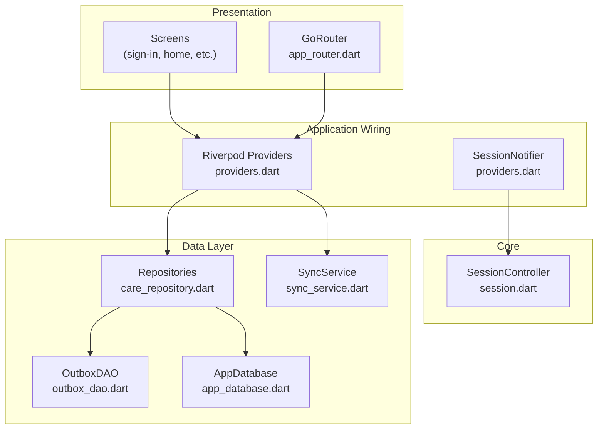
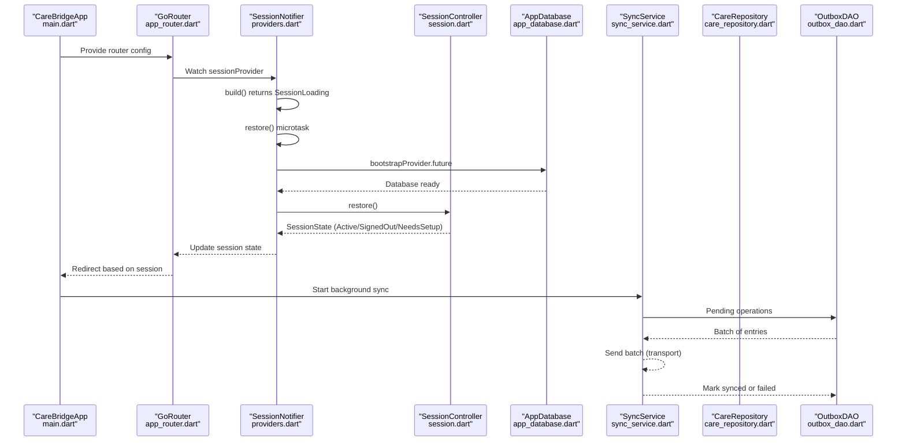
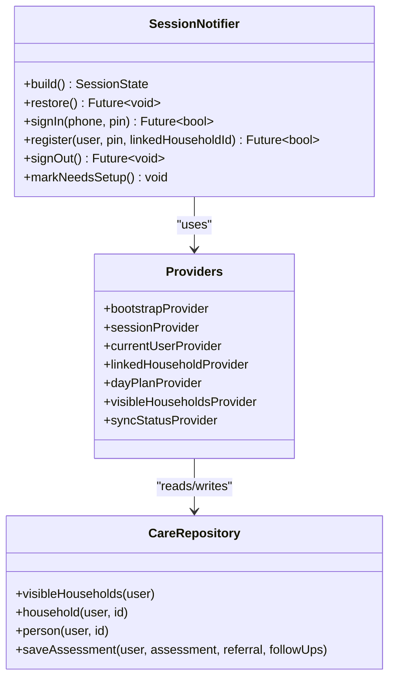
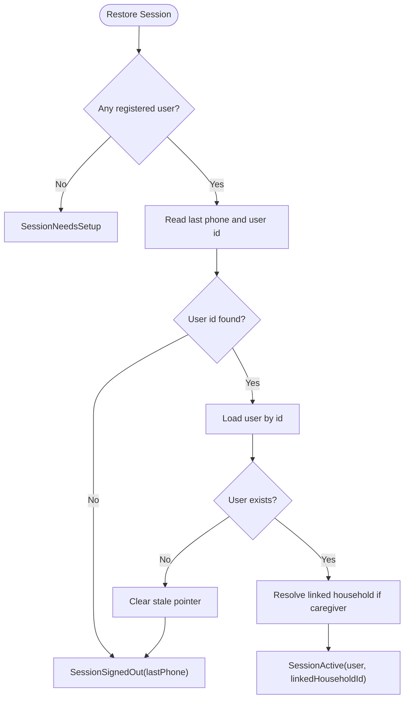
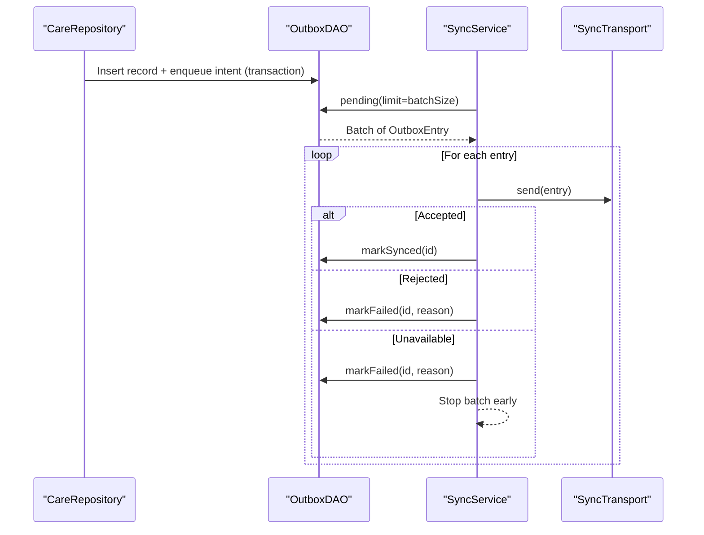
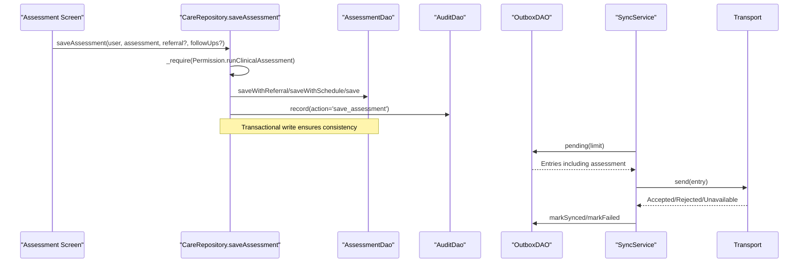
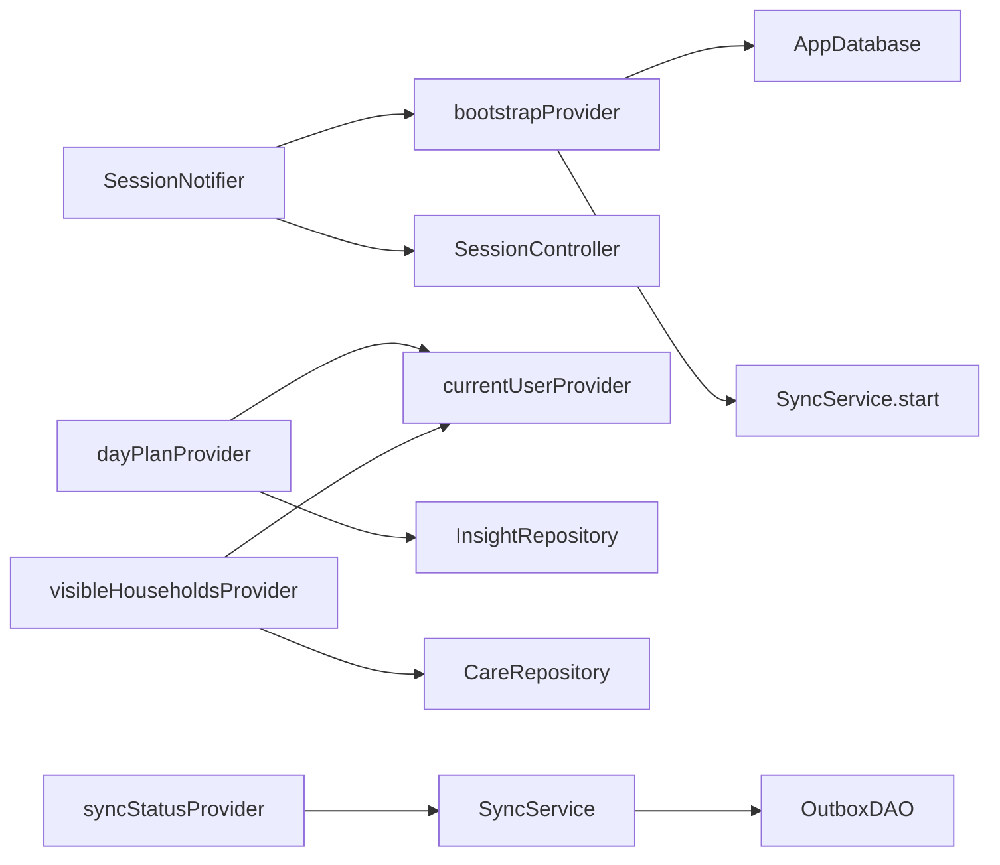

# Data Flow & State Management

<cite>
**Referenced Files in This Document**
- [main.dart](file://lib/main.dart)
- [app_router.dart](file://lib/core/router/app_router.dart)
- [session.dart](file://lib/core/auth/session.dart)
- [providers.dart](file://lib/app/providers.dart)
- [care_repository.dart](file://lib/data/repositories/care_repository.dart)
- [sync_service.dart](file://lib/data/sync/sync_service.dart)
- [outbox_dao.dart](file://lib/data/local/outbox_dao.dart)
- [app_database.dart](file://lib/data/local/app_database.dart)
</cite>

## Table of Contents
1. Introduction
2. Project Structure
3. Core Components
4. Architecture Overview
5. Detailed Component Analysis
6. Dependency Analysis
7. Performance Considerations
8. Troubleshooting Guide
9. Conclusion

## Introduction
This document explains CareBridge AI’s data flow and state management architecture with a focus on:
- The Provider pattern using Riverpod to propagate state from repositories to UI components
- Session management including authentication, permission checks, and role-based access control
- Offline-first synchronization strategy covering local storage updates, background sync, and conflict handling
- End-to-end data flow examples from user input through validation, business logic, and persistence
- Error handling patterns and state restoration mechanisms

## Project Structure
CareBridge AI is organized into clear layers:
- Presentation (UI screens and routing)
- Application wiring (Riverpod providers)
- Domain (engines and entities)
- Data (repositories, DAOs, sync service)
- Core (auth session, router, theme)

**Diagram sources**
- [app_router.dart:34-70](file://lib/core/router/app_router.dart#L34-L70)
- [providers.dart:38-64](file://lib/app/providers.dart#L38-L64)
- [session.dart:69-112](file://lib/core/auth/session.dart#L69-L112)
- [care_repository.dart:55-110](file://lib/data/repositories/care_repository.dart#L55-L110)
- [sync_service.dart:96-133](file://lib/data/sync/sync_service.dart#L96-L133)
- [outbox_dao.dart:1-33](file://lib/data/local/outbox_dao.dart#L1-L33)
- [app_database.dart:99-134](file://lib/data/local/app_database.dart#L99-L134)

**Section sources**
- [main.dart:16-34](file://lib/main.dart#L16-L34)
- [app_router.dart:34-70](file://lib/core/router/app_router.dart#L34-L70)
- [providers.dart:38-64](file://lib/app/providers.dart#L38-L64)

## Core Components
Key building blocks that drive data flow and state:
- Bootstrap provider initializes the database, seeds demo data, and starts sync
- Session management via NotifierProvider for auth state and routing decisions
- Repository layer enforcing RBAC and encapsulating DAO access
- Sync service orchestrating offline-first background synchronization
- Outbox DAO ensuring atomic writes and reliable retry semantics

**Section sources**
- [providers.dart:38-64](file://lib/app/providers.dart#L38-L64)
- [providers.dart:67-122](file://lib/app/providers.dart#L67-L122)
- [care_repository.dart:55-110](file://lib/data/repositories/care_repository.dart#L55-L110)
- [sync_service.dart:96-133](file://lib/data/sync/sync_service.dart#L96-L133)
- [outbox_dao.dart:1-33](file://lib/data/local/outbox_dao.dart#L1-L33)

## Architecture Overview
The app uses Riverpod to centralize state and dependency injection. The bootstrap provider ensures the database and sync are ready before any feature reads. Session state drives routing and permissions. Repositories enforce role-based access and coordinate with DAOs. The sync service runs opportunistically in the background.

**Diagram sources**
- [main.dart:16-34](file://lib/main.dart#L16-L34)
- [app_router.dart:50-70](file://lib/core/router/app_router.dart#L50-L70)
- [providers.dart:38-64](file://lib/app/providers.dart#L38-L64)
- [providers.dart:77-92](file://lib/app/providers.dart#L77-L92)
- [session.dart:96-112](file://lib/core/auth/session.dart#L96-L112)
- [sync_service.dart:122-133](file://lib/data/sync/sync_service.dart#L122-L133)
- [outbox_dao.dart:1-33](file://lib/data/local/outbox_dao.dart#L1-L33)

## Detailed Component Analysis

### Riverpod Provider Pattern and State Flow
- Bootstrap provider opens the database, seeds demo data, and starts sync
- SessionNotifier manages session lifecycle and exposes methods for sign-in, registration, and sign-out
- Feature providers (e.g., dayPlanProvider, visibleHouseholdsProvider) depend on currentUserProvider and repositories
- StreamProvider for syncStatus keeps UI informed about connectivity and sync progress

**Diagram sources**
- [providers.dart:38-64](file://lib/app/providers.dart#L38-L64)
- [providers.dart:77-122](file://lib/app/providers.dart#L77-L122)
- [care_repository.dart:132-174](file://lib/data/repositories/care_repository.dart#L132-L174)

**Section sources**
- [providers.dart:38-64](file://lib/app/providers.dart#L38-L64)
- [providers.dart:77-122](file://lib/app/providers.dart#L77-L122)
- [providers.dart:145-156](file://lib/app/providers.dart#L145-L156)
- [providers.dart:160-165](file://lib/app/providers.dart#L160-L165)

### Session Management and Role-Based Access Control
- SessionController restores session from secure storage and decides initial screen
- Session states include loading, needs setup, signed out, and active
- Permission checks enforced at repository boundaries; violations throw AccessDenied and are audited
- Scoped access for caregivers ensures they can only view their linked household

**Diagram sources**
- [session.dart:96-112](file://lib/core/auth/session.dart#L96-L112)
- [session.dart:114-140](file://lib/core/auth/session.dart#L114-L140)
- [session.dart:193-206](file://lib/core/auth/session.dart#L193-L206)

**Section sources**
- [session.dart:28-67](file://lib/core/auth/session.dart#L28-L67)
- [session.dart:69-112](file://lib/core/auth/session.dart#L69-L112)
- [care_repository.dart:62-110](file://lib/data/repositories/care_repository.dart#L62-L110)

### Offline-First Data Synchronization Strategy
- Outbox DAO ensures atomic writes of records and sync intents
- SyncService runs periodically and on connectivity changes
- Batches are sent with priority ordering; failures are surfaced and retried
- Transport abstraction allows swapping implementations without changing app logic

**Diagram sources**
- [outbox_dao.dart:1-33](file://lib/data/local/outbox_dao.dart#L1-L33)
- [sync_service.dart:156-217](file://lib/data/sync/sync_service.dart#L156-L217)
- [sync_service.dart:223-242](file://lib/data/sync/sync_service.dart#L223-L242)

**Section sources**
- [outbox_dao.dart:1-33](file://lib/data/local/outbox_dao.dart#L1-L33)
- [sync_service.dart:96-133](file://lib/data/sync/sync_service.dart#L96-L133)
- [sync_service.dart:156-217](file://lib/data/sync/sync_service.dart#L156-L217)

### Example Data Flow: Saving an Assessment
End-to-end flow from UI input to persistence and sync:
1. UI collects assessment data and calls repository method
2. Repository enforces permissions and persists assessment with optional referral and follow-ups
3. Audit log records the action
4. Sync service picks up pending outbox entries and sends them when online

**Diagram sources**
- [care_repository.dart:350-391](file://lib/data/repositories/care_repository.dart#L350-L391)
- [sync_service.dart:156-217](file://lib/data/sync/sync_service.dart#L156-L217)
- [outbox_dao.dart:1-33](file://lib/data/local/outbox_dao.dart#L1-L33)

**Section sources**
- [care_repository.dart:350-391](file://lib/data/repositories/care_repository.dart#L350-L391)
- [sync_service.dart:156-217](file://lib/data/sync/sync_service.dart#L156-L217)

## Dependency Analysis
Providers orchestrate dependencies across layers:
- Bootstrap depends on database and sync service
- Session notifier depends on session controller and bootstrap
- Feature providers depend on current user and repositories
- Repositories depend on DAOs and audit logging
- Sync service depends on outbox DAO and transport abstraction

**Diagram sources**
- [providers.dart:38-64](file://lib/app/providers.dart#L38-L64)
- [providers.dart:77-122](file://lib/app/providers.dart#L77-L122)
- [providers.dart:145-156](file://lib/app/providers.dart#L145-L156)
- [providers.dart:160-165](file://lib/app/providers.dart#L160-L165)
- [sync_service.dart:96-133](file://lib/data/sync/sync_service.dart#L96-L133)

**Section sources**
- [providers.dart:38-64](file://lib/app/providers.dart#L38-L64)
- [providers.dart:77-122](file://lib/app/providers.dart#L77-L122)
- [sync_service.dart:96-133](file://lib/data/sync/sync_service.dart#L96-L133)

## Performance Considerations
- Lazy initialization: bootstrap provider ensures resources are ready before use
- Stream-based status updates avoid polling overhead
- Small batch sizes improve reliability on unstable networks
- Priority ordering ensures critical items sync first
- Re-entrancy guards prevent duplicate sync attempts

[No sources needed since this section provides general guidance]

## Troubleshooting Guide
Common issues and resolutions:
- Session restoration fails due to secure storage errors: degrade gracefully to not remembered
- Sync stuck rows: use sync.stuck() to surface failures and retry via retry(outboxId)
- Permission denied exceptions: check user roles and ensure proper scoping for caregivers
- Database upgrade issues: review schema creation and migration logic

**Section sources**
- [session.dart:220-244](file://lib/core/auth/session.dart#L220-L244)
- [sync_service.dart:250-257](file://lib/data/sync/sync_service.dart#L250-L257)
- [care_repository.dart:35-53](file://lib/data/repositories/care_repository.dart#L35-L53)
- [app_database.dart:163-172](file://lib/data/local/app_database.dart#L163-L172)

## Conclusion
CareBridge AI implements a robust data flow and state management architecture using Riverpod providers, session-driven routing, and offline-first synchronization. The repository layer enforces role-based access control while maintaining clean separation between UI and data layers. The sync service ensures reliable background synchronization with priority handling and failure surfacing. This design supports field deployment scenarios with limited connectivity while maintaining data integrity and security.

[No sources needed since this section summarizes without analyzing specific files]