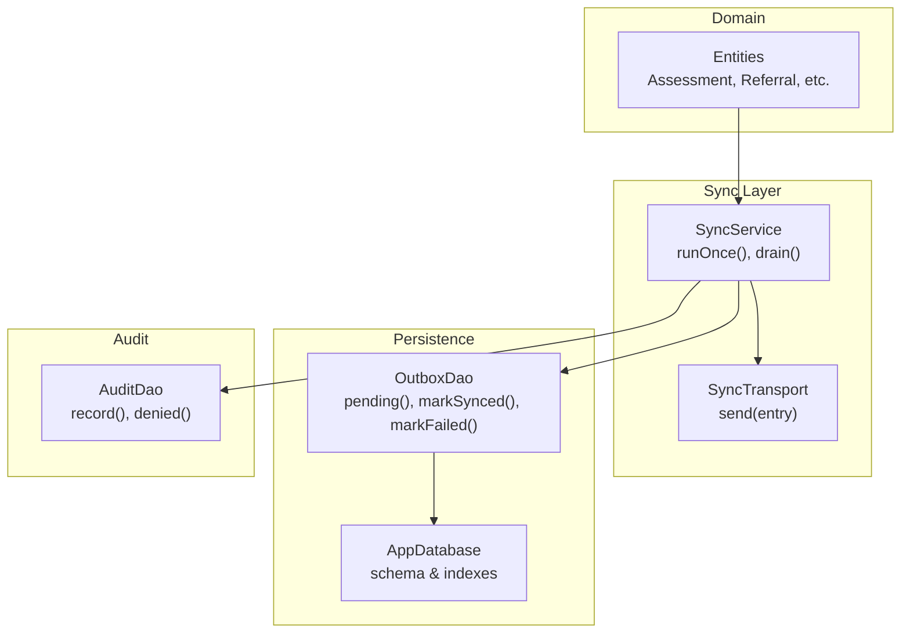
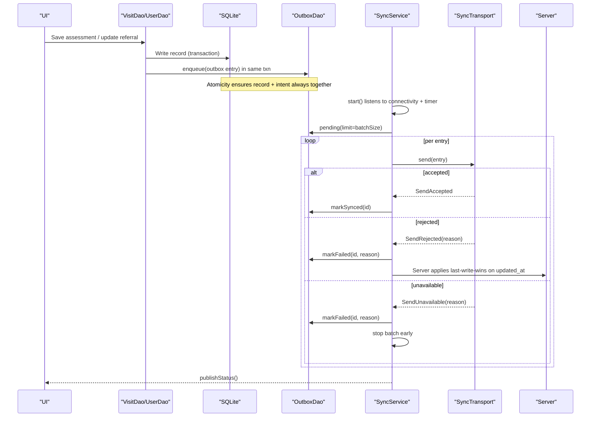
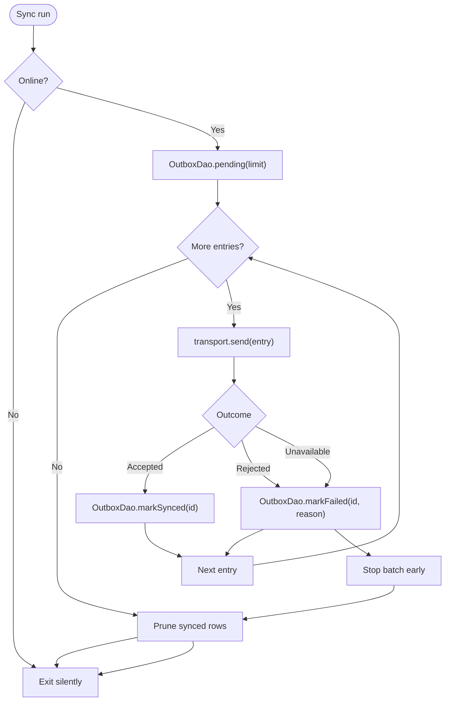
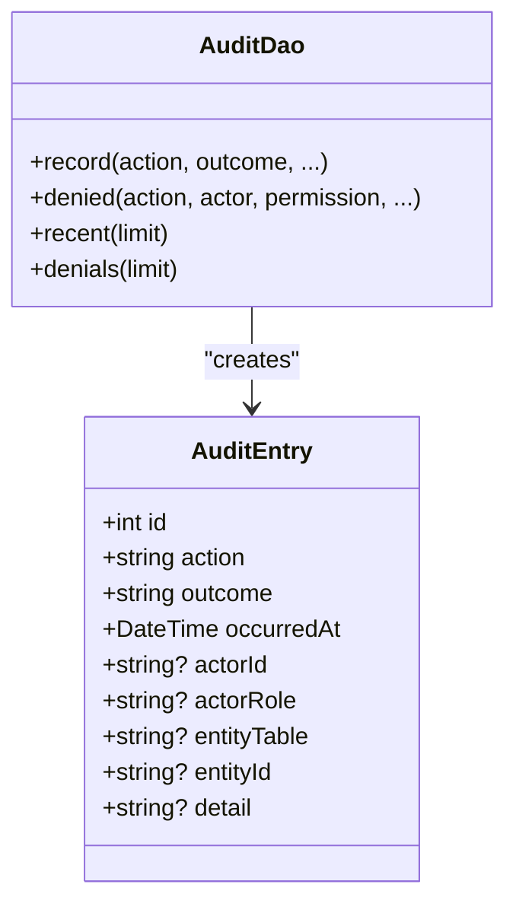
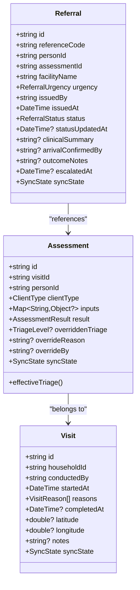
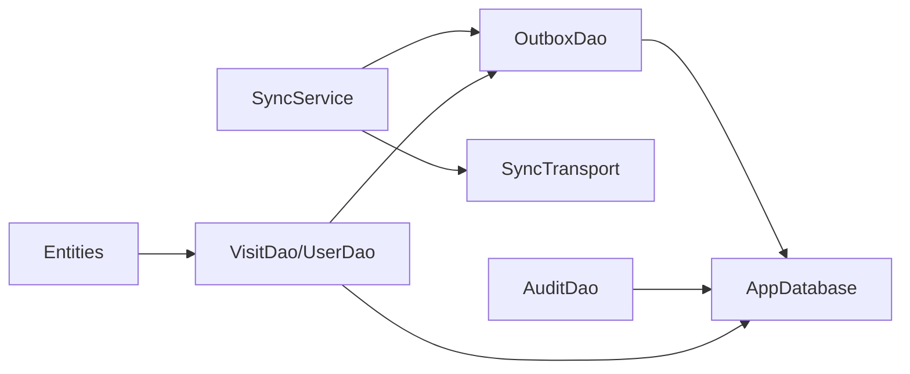

# Conflict Resolution Strategy

<cite>
**Referenced Files in This Document**
- [sync_service.dart](file://lib/data/sync/sync_service.dart)
- [outbox_dao.dart](file://lib/data/local/outbox_dao.dart)
- [app_database.dart](file://lib/data/local/app_database.dart)
- [user_dao.dart](file://lib/data/local/user_dao.dart)
- [visit_dao.dart](file://lib/data/local/visit_dao.dart)
- [visit.dart](file://lib/domain/entities/visit.dart)
</cite>

## Table of Contents
1. [Introduction](#introduction)
2. [Project Structure](#project-structure)
3. [Core Components](#core-components)
4. [Architecture Overview](#architecture-overview)
5. [Detailed Component Analysis](#detailed-component-analysis)
6. [Dependency Analysis](#dependency-analysis)
7. [Performance Considerations](#performance-considerations)
8. [Troubleshooting Guide](#troubleshooting-guide)
9. [Conclusion](#conclusion)

## Introduction
This document explains the conflict resolution strategy for CareBridge AI’s data synchronization. It covers how conflicts are detected between local and remote versions, priority rules that determine which version wins, merge strategies for complex structures, audit trails for decisions, and user controls to review or override automated resolutions. Practical scenarios such as concurrent edits, deleted records, and schema changes are addressed, along with performance considerations for large datasets.

## Project Structure
The conflict resolution strategy is implemented across a small set of focused components:
- Sync orchestration and transport abstraction
- Outbox persistence for reliable delivery and retry
- Database schema and indexes supporting prioritization and auditing
- Audit logging for governance and traceability
- Domain entities carrying sync state and override metadata

**Diagram sources**
- [sync_service.dart:96-258](file://lib/data/sync/sync_service.dart#L96-L258)
- [outbox_dao.dart:160-277](file://lib/data/local/outbox_dao.dart#L160-L277)
- [app_database.dart:511-556](file://lib/data/local/app_database.dart#L511-L556)
- [user_dao.dart:382-457](file://lib/data/local/user_dao.dart#L382-L457)
- [visit.dart:308-411](file://lib/domain/entities/visit.dart#L308-L411)

**Section sources**
- [sync_service.dart:1-258](file://lib/data/sync/sync_service.dart#L1-L258)
- [outbox_dao.dart:1-277](file://lib/data/local/outbox_dao.dart#L1-L277)
- [app_database.dart:1-556](file://lib/data/local/app_database.dart#L1-L556)
- [user_dao.dart:1-457](file://lib/data/local/user_dao.dart#L1-L457)
- [visit.dart:1-690](file://lib/domain/entities/visit.dart#L1-L690)

## Core Components
- SyncService orchestrates background sync runs opportunistically (on connectivity changes and periodic timers), batches outbox entries by priority, and updates status streams.
- OutboxDao persists change intents atomically with their source records, orders them by priority and queue time, tracks attempts and errors, and exposes failing items for human review.
- AppDatabase defines the schema and indexes that enable efficient pending queries and support audit logging.
- AuditDao records permission denials and clinical overrides locally without blocking care delivery.
- Domain entities carry sync state and override fields to preserve decision history and effective outcomes.

Key responsibilities:
- Detecting conflicts via server responses and last-write-wins semantics
- Prioritizing critical operations over routine ones
- Persisting failures and enabling retries
- Auditing all significant actions and outcomes

**Section sources**
- [sync_service.dart:96-258](file://lib/data/sync/sync_service.dart#L96-L258)
- [outbox_dao.dart:34-115](file://lib/data/local/outbox_dao.dart#L34-L115)
- [app_database.dart:511-556](file://lib/data/local/app_database.dart#L511-L556)
- [user_dao.dart:382-457](file://lib/data/local/user_dao.dart#L382-L457)
- [visit.dart:308-411](file://lib/domain/entities/visit.dart#L308-L411)

## Architecture Overview
The system uses an offline-first design where SQLite is the source of truth. Changes are written locally and immediately, and a corresponding outbox entry is queued in the same transaction. The sync layer sends these entries when connectivity is available, using a pluggable transport. Conflicts are resolved on the server using last-write-wins based on updated_at; the app surfaces failures and defers to server authority while preserving an audit trail.

**Diagram sources**
- [sync_service.dart:122-217](file://lib/data/sync/sync_service.dart#L122-L217)
- [outbox_dao.dart:160-218](file://lib/data/local/outbox_dao.dart#L160-L218)
- [visit_dao.dart:425-465](file://lib/data/local/visit_dao.dart#L425-L465)
- [user_dao.dart:125-167](file://lib/data/local/user_dao.dart#L125-L167)

**Section sources**
- [sync_service.dart:1-258](file://lib/data/sync/sync_service.dart#L1-L258)
- [outbox_dao.dart:1-277](file://lib/data/local/outbox_dao.dart#L1-L277)
- [app_database.dart:1-556](file://lib/data/local/app_database.dart#L1-L556)

## Detailed Component Analysis

### Conflict Detection and Resolution Rules
- Conflict detection occurs at the transport boundary:
  - Accepted: no conflict; mark synced.
  - Rejected: indicates a conflict or policy violation; the server enforces last-write-wins on updated_at.
  - Unavailable: transient network failure; defer and retry later.
- Priority rules:
  - Critical (e.g., urgent referrals) are sent before routine registrations.
  - Ordering within the same priority is oldest-first by queued_at.
- Merge strategy:
  - For most entities, the server applies last-write-wins using timestamps.
  - Complex structures (JSON payloads) are transmitted as-is; conflicts are not merged client-side.
- Override handling:
  - Clinical overrides are persisted alongside original engine outputs, ensuring auditable history and effective triage selection.

**Diagram sources**
- [sync_service.dart:156-217](file://lib/data/sync/sync_service.dart#L156-L217)
- [outbox_dao.dart:183-218](file://lib/data/local/outbox_dao.dart#L183-L218)

**Section sources**
- [sync_service.dart:156-217](file://lib/data/sync/sync_service.dart#L156-L217)
- [outbox_dao.dart:183-218](file://lib/data/local/outbox_dao.dart#L183-L218)
- [visit.dart:308-411](file://lib/domain/entities/visit.dart#L308-L411)

### Audit Trail and User Review
- Every significant action (sign-in, registration, permission denial, clinical override) is recorded in the audit log table.
- Audit writes are non-blocking; they cannot prevent care delivery if they fail.
- Users can review failed outbox entries and retry after resolving issues.
- Clinical overrides are stored with actor, reason, and timestamp, enabling post-hoc review and model improvement.

**Diagram sources**
- [user_dao.dart:345-457](file://lib/data/local/user_dao.dart#L345-L457)

**Section sources**
- [user_dao.dart:382-457](file://lib/data/local/user_dao.dart#L382-L457)
- [visit_dao.dart:425-465](file://lib/data/local/visit_dao.dart#L425-L465)

### Data Models and Sync State
- Entities include a sync_state field indicating local sync status.
- Assessments store both raw inputs and computed results, plus optional override fields.
- Referrals track status transitions and escalation timing.

**Diagram sources**
- [visit.dart:308-411](file://lib/domain/entities/visit.dart#L308-L411)
- [visit.dart:418-545](file://lib/domain/entities/visit.dart#L418-L545)

**Section sources**
- [visit.dart:308-411](file://lib/domain/entities/visit.dart#L308-L411)
- [visit.dart:418-545](file://lib/domain/entities/visit.dart#L418-L545)

## Dependency Analysis
- SyncService depends on OutboxDao for pending entries and status updates, and on SyncTransport for sending.
- OutboxDao depends on AppDatabase for SQL execution and schema.
- AuditDao depends on AppDatabase for writing audit events.
- Domain entities are used by DAOs to construct payloads and persist state.

**Diagram sources**
- [sync_service.dart:96-258](file://lib/data/sync/sync_service.dart#L96-L258)
- [outbox_dao.dart:160-277](file://lib/data/local/outbox_dao.dart#L160-L277)
- [app_database.dart:175-192](file://lib/data/local/app_database.dart#L175-L192)
- [user_dao.dart:125-167](file://lib/data/local/user_dao.dart#L125-L167)
- [visit_dao.dart:425-465](file://lib/data/local/visit_dao.dart#L425-L465)

**Section sources**
- [sync_service.dart:96-258](file://lib/data/sync/sync_service.dart#L96-L258)
- [outbox_dao.dart:160-277](file://lib/data/local/outbox_dao.dart#L160-L277)
- [app_database.dart:175-192](file://lib/data/local/app_database.dart#L175-L192)

## Performance Considerations
- Batching: SyncService processes small batches (default 25) to maximize success under intermittent connectivity.
- Indexing: Outbox queries use indexes on synced_at, priority, and queued_at to efficiently fetch pending entries.
- Backoff: OutboxEntry implements capped exponential backoff to avoid battery drain and excessive retries.
- Pruning: Synced entries older than a retention window are pruned to keep storage bounded.
- Non-blocking audit: Audit writes are wrapped to never block core operations.

Recommendations:
- Keep batch size tuned to typical connectivity windows.
- Monitor failing counts and oldest pending age to detect bottlenecks.
- Ensure server endpoints honor updated_at semantics consistently to minimize rework.

**Section sources**
- [sync_service.dart:223-242](file://lib/data/sync/sync_service.dart#L223-L242)
- [outbox_dao.dart:183-199](file://lib/data/local/outbox_dao.dart#L183-L199)
- [outbox_dao.dart:82-95](file://lib/data/local/outbox_dao.dart#L82-L95)
- [outbox_dao.dart:265-275](file://lib/data/local/outbox_dao.dart#L265-L275)
- [user_dao.dart:382-413](file://lib/data/local/user_dao.dart#L382-L413)

## Troubleshooting Guide
Common scenarios and resolutions:
- Concurrent edits:
  - Symptom: Rejected outcome from server.
  - Resolution: Server applies last-write-wins on updated_at; the app marks the entry failed and surfaces it. Users can review the latest error and retry after reconciling changes.
- Deleted records:
  - Symptom: Delete operation rejected due to missing remote record.
  - Resolution: Treat as a conflict; ensure local deletion intent is consistent with server state. Retry after confirming server state or adjusting payload.
- Schema changes:
  - Symptom: Payload rejected due to unknown fields or missing required fields.
  - Resolution: Update local payload mapping to match server schema; validate before enqueueing.
- Network instability:
  - Symptom: Unavailable outcomes and deferred retries.
  - Resolution: Wait for connectivity; the service stops the batch early to avoid burning attempt counters. Use manual “drain” when connection improves.
- Stuck entries:
  - Symptom: Entries with attempts >= 5 and no synced_at.
  - Resolution: Inspect last_error, fix underlying issue, then reset attempts and retry.

User controls:
- View failing entries via OutboxDao.failing().
- Reset attempts and retry specific entries through SyncService.retry().
- Review audit logs for access denials and clinical overrides.

**Section sources**
- [sync_service.dart:183-217](file://lib/data/sync/sync_service.dart#L183-L217)
- [outbox_dao.dart:240-261](file://lib/data/local/outbox_dao.dart#L240-L261)
- [user_dao.dart:435-457](file://lib/data/local/user_dao.dart#L435-L457)

## Conclusion
CareBridge AI’s conflict resolution strategy centers on robust offline-first persistence, prioritized batching, and clear server-side last-write-wins semantics. Failures are surfaced rather than hidden, with comprehensive audit trails and user-driven retry mechanisms. This approach balances reliability in low-connectivity environments with accountability and transparency for clinical decisions.