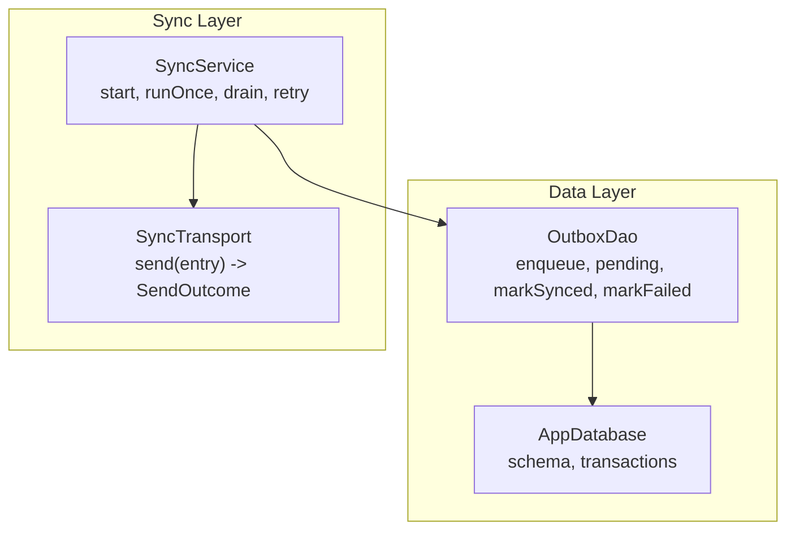
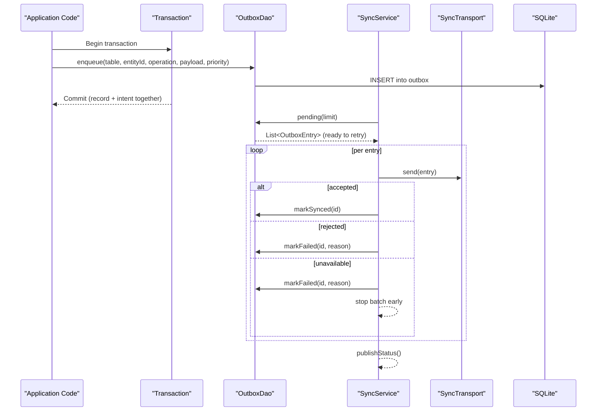
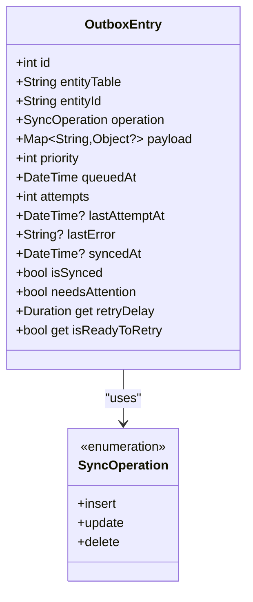
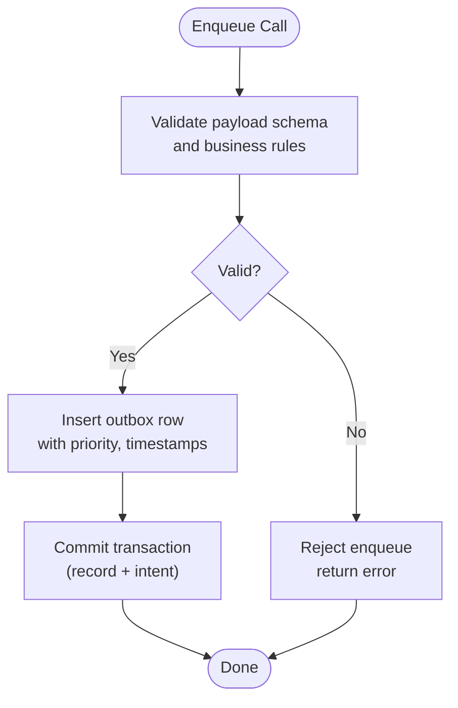
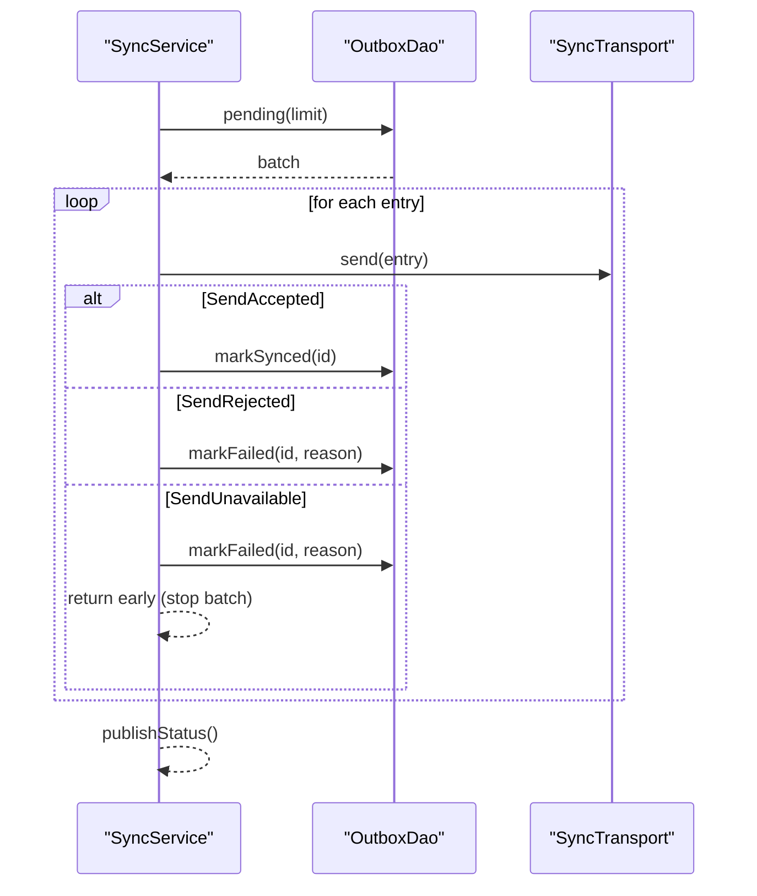
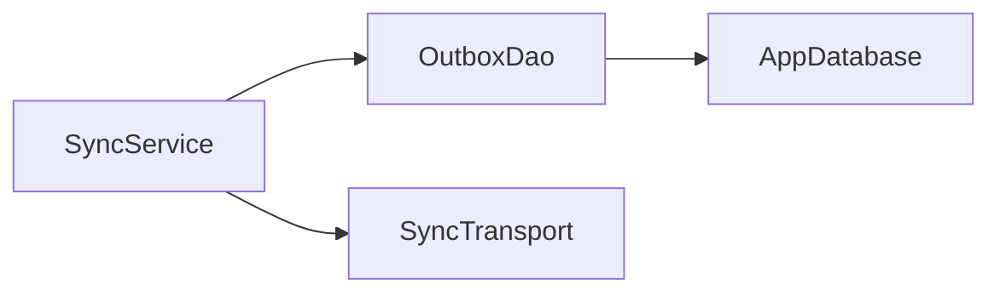

# Data Validation and Retry Mechanisms

<cite>
**Referenced Files in This Document**
- [sync_service.dart](file://lib/data/sync/sync_service.dart)
- [outbox_dao.dart](file://lib/data/local/outbox_dao.dart)
- [app_database.dart](file://lib/data/local/app_database.dart)
- [vulnerability_engine.dart](file://lib/domain/engines/vulnerability_engine.dart)
</cite>

## Table of Contents
1. [Introduction](#introduction)
2. [Project Structure](#project-structure)
3. [Core Components](#core-components)
4. [Architecture Overview](#architecture-overview)
5. [Detailed Component Analysis](#detailed-component-analysis)
6. [Dependency Analysis](#dependency-analysis)
7. [Performance Considerations](#performance-considerations)
8. [Troubleshooting Guide](#troubleshooting-guide)
9. [Conclusion](#conclusion)

## Introduction
This document explains how CareBridge AI validates data before synchronization and how it retries failed sync operations. It covers schema-level validation, business rule validation, and data integrity checks that protect the outbox queue and ensure reliable delivery. It also documents retry logic with exponential backoff, failure thresholds, partial failure handling, consistency guarantees during retries, and user-facing error messaging. Examples include custom validation rules and configuration options for retry behavior.

## Project Structure
The synchronization system is implemented primarily in two layers:
- Data layer: Outbox DAO manages queued records, persistence, and retry state.
- Sync service: Orchestrates opportunistic sync runs, connectivity awareness, batching, and reporting.

**Diagram sources**
- [sync_service.dart:96-257](file://lib/data/sync/sync_service.dart#L96-L257)
- [outbox_dao.dart:160-276](file://lib/data/local/outbox_dao.dart#L160-L276)
- [app_database.dart:138-181](file://lib/data/local/app_database.dart#L138-L181)

**Section sources**
- [sync_service.dart:1-258](file://lib/data/sync/sync_service.dart#L1-L258)
- [outbox_dao.dart:1-277](file://lib/data/local/outbox_dao.dart#L1-L277)
- [app_database.dart:138-181](file://lib/data/local/app_database.dart#L138-L181)

## Core Components
- OutboxEntry: Represents a queued change with payload, priority, attempt counts, timestamps, and last error. Provides readiness-to-retry and retry delay calculations.
- OutboxDao: Persists and queries outbox entries, enqueues changes within transactions, marks success/failure, summarizes status, and prunes synced rows.
- SyncService: Drives periodic and connectivity-triggered sync runs, batches entries, applies transport outcomes, updates persistence, and exposes status and manual controls.
- SyncTransport: Abstraction for network or local transport; currently backed by LoopbackTransport for demonstration/testing.

Key responsibilities:
- Validation at enqueue time (schema and business rules).
- Integrity checks when loading pending entries (retry readiness).
- Robust retry with exponential backoff and failure thresholds.
- Partial batch progress and consistent state transitions.

**Section sources**
- [outbox_dao.dart:49-115](file://lib/data/local/outbox_dao.dart#L49-L115)
- [outbox_dao.dart:160-276](file://lib/data/local/outbox_dao.dart#L160-L276)
- [sync_service.dart:96-257](file://lib/data/sync/sync_service.dart#L96-L257)

## Architecture Overview
The sync pipeline ensures that every record write is paired with an outbox entry in a single transaction. The sync service periodically or opportunistically pulls small batches, sends them via a transport, and updates persistence based on outcomes. Failures are tracked with attempts and last error, enabling exponential backoff and human intervention when needed.

**Diagram sources**
- [sync_service.dart:156-217](file://lib/data/sync/sync_service.dart#L156-L217)
- [outbox_dao.dart:164-181](file://lib/data/local/outbox_dao.dart#L164-L181)
- [outbox_dao.dart:201-218](file://lib/data/local/outbox_dao.dart#L201-L218)

## Detailed Component Analysis

### Outbox Entry and Retry Logic
OutboxEntry encapsulates all fields required for durable, prioritized, and retriable sync. It computes:
- Whether an entry needs attention after repeated failures.
- Exponential backoff delay capped to avoid excessive waits.
- Readiness to retry based on last attempt timestamp and computed delay.

**Diagram sources**
- [outbox_dao.dart:49-115](file://lib/data/local/outbox_dao.dart#L49-L115)

**Section sources**
- [outbox_dao.dart:49-115](file://lib/data/local/outbox_dao.dart#L49-L115)

### Outbox DAO: Persistence, Validation, and Integrity
Responsibilities:
- Enqueue: Inserts an outbox row inside the same transaction as the business record write. Ensures atomicity.
- Pending: Retrieves unsynced entries ordered by priority then age, filtering only those ready to retry.
- Marking outcomes: Updates attempts, timestamps, errors, and success markers atomically.
- Summary and failing lists: Aggregates counts and surfaces items needing human review.
- Pruning: Removes old synced rows to manage storage.

Validation and integrity checks:
- Schema validation: Payload is stored as JSON; structure is validated at application boundaries before enqueue.
- Business rule validation: Priority selection and operation type are enforced at call sites; defaults are safe.
- Data integrity: Transactional enqueue prevents orphaned intents; retry readiness prevents premature reattempts.

**Diagram sources**
- [outbox_dao.dart:164-181](file://lib/data/local/outbox_dao.dart#L164-L181)

**Section sources**
- [outbox_dao.dart:160-276](file://lib/data/local/outbox_dao.dart#L160-L276)

### Sync Service: Orchestration, Batching, and Reporting
Responsibilities:
- Opportunistic scheduling: Timer-driven and connectivity-triggered runs.
- Re-entrancy guard: Prevents concurrent runs from double-sending.
- Batch processing: Fetches a limited number of entries, sends via transport, and updates persistence per outcome.
- Status publishing: Emits summaries for UI banners and dashboards.
- Manual controls: Drain and retry specific stuck entries.

Retry and failure handling:
- Accepted: Marks synced and clears last error.
- Rejected: Marks failed with reason; no further automatic retries until reset.
- Unavailable: Marks failed and stops the batch early to avoid burning attempts while offline.

**Diagram sources**
- [sync_service.dart:156-217](file://lib/data/sync/sync_service.dart#L156-L217)
- [outbox_dao.dart:201-218](file://lib/data/local/outbox_dao.dart#L201-L218)

**Section sources**
- [sync_service.dart:96-257](file://lib/data/sync/sync_service.dart#L96-L257)

### Transport Abstraction and Circuit Breaker Pattern
The SyncTransport interface decouples sync orchestration from implementation details. A LoopbackTransport demonstrates acceptance without a backend. For production, implement HTTP or DHIMS2 transport.

Circuit breaker pattern:
- When SendUnavailable is returned, the service stops the current batch immediately, preventing further attempts until connectivity returns. This acts as a circuit breaker against transient network issues.

Configuration options:
- interval: Periodic sync cadence.
- batchSize: Number of entries per batch.
- transport: Pluggable transport implementation.

**Section sources**
- [sync_service.dart:54-73](file://lib/data/sync/sync_service.dart#L54-L73)
- [sync_service.dart:96-133](file://lib/data/sync/sync_service.dart#L96-L133)

### Business Rule Validation Example: Vulnerability Engine
While not part of the sync pipeline directly, the vulnerability engine demonstrates domain-level validation and scoring rules. It evaluates inputs, flags unknowns, caps scores, and produces actionable factors. This illustrates how business rules can be applied before persisting or syncing clinical decisions.

Key aspects:
- Inputs are nullable to reflect field sparsity.
- Scoring aggregates risk factors and computes confidence.
- Modifiable factors provide CHO actions.

**Section sources**
- [vulnerability_engine.dart:146-194](file://lib/domain/engines/vulnerability_engine.dart#L146-L194)
- [vulnerability_engine.dart:196-229](file://lib/domain/engines/vulnerability_engine.dart#L196-L229)

## Dependency Analysis
The sync system has clear separation between orchestration (SyncService), persistence (OutboxDao), and transport (SyncTransport). Dependencies are one-directional:
- SyncService depends on OutboxDao and SyncTransport.
- OutboxDao depends on AppDatabase for SQLite access.
- No circular dependencies observed.

**Diagram sources**
- [sync_service.dart:96-257](file://lib/data/sync/sync_service.dart#L96-L257)
- [outbox_dao.dart:160-276](file://lib/data/local/outbox_dao.dart#L160-L276)
- [app_database.dart:138-181](file://lib/data/local/app_database.dart#L138-L181)

**Section sources**
- [sync_service.dart:96-257](file://lib/data/sync/sync_service.dart#L96-L257)
- [outbox_dao.dart:160-276](file://lib/data/local/outbox_dao.dart#L160-L276)
- [app_database.dart:138-181](file://lib/data/local/app_database.dart#L138-L181)

## Performance Considerations
- Small batches: Limits memory usage and reduces rollback impact on short connectivity windows.
- Priority ordering: Critical items leave first, improving clinical responsiveness.
- Exponential backoff: Reduces battery drain and server load under poor connectivity.
- Pruning synced rows: Keeps storage bounded over time.

[No sources needed since this section provides general guidance]

## Troubleshooting Guide
Common issues and resolutions:
- Stuck entries: Use the failing list to identify entries with repeated failures. Reset attempts after fixing underlying issues, then trigger a sync run.
- Network unavailability: The service stops the batch early; wait for connectivity and retry automatically.
- Rejected payloads: Inspect last_error messages; validate schema and business rules before re-enqueueing.
- Partial sync failures: Each entry is committed individually; accepted entries remain synced while others continue retrying.

User-facing messages:
- SyncStatusSummary.label and detail provide reassuring, contextual messages about pending and failing items.

**Section sources**
- [outbox_dao.dart:117-158](file://lib/data/local/outbox_dao.dart#L117-L158)
- [sync_service.dart:244-257](file://lib/data/sync/sync_service.dart#L244-L257)

## Conclusion
CareBridge AI’s synchronization system combines robust data validation, resilient retry mechanisms, and clear user feedback to ensure reliable offline-first operation. Schema and business rule validation at enqueue time, combined with integrity checks during retrieval, protect data quality. Exponential backoff, failure thresholds, and circuit-breaking behavior handle transient network conditions gracefully. The design supports customization through pluggable transports and configurable parameters, enabling adaptation to diverse deployment environments.