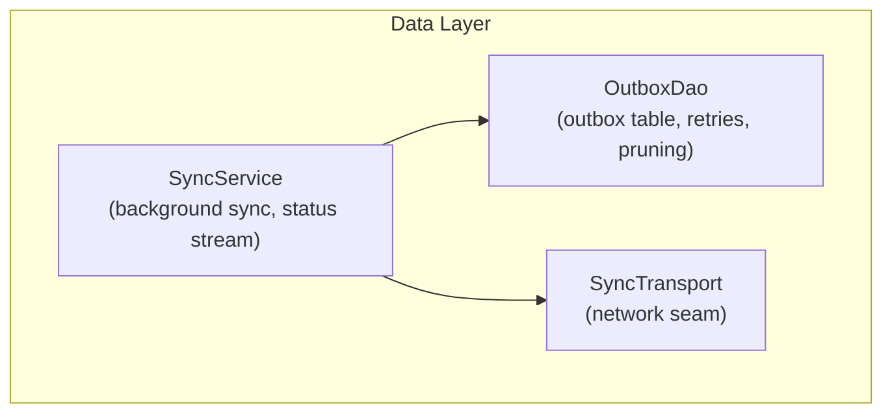
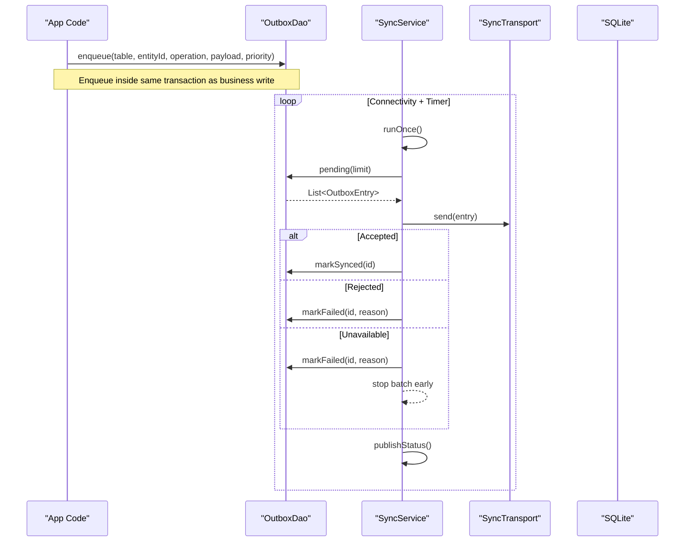
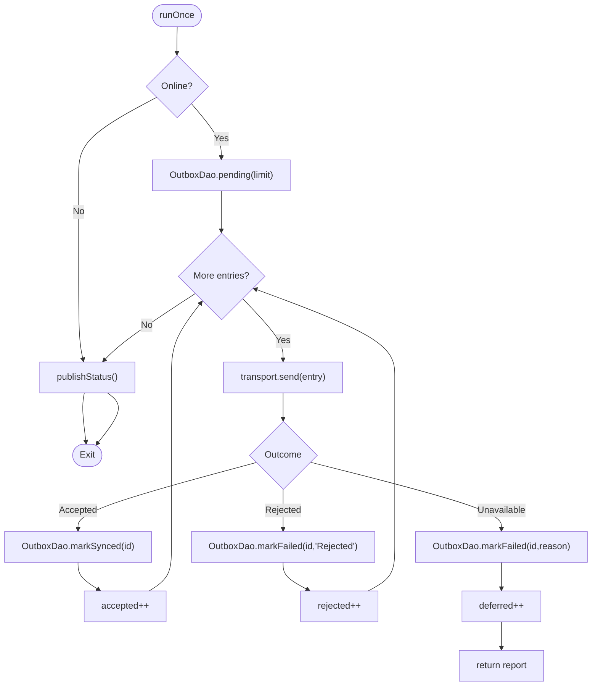
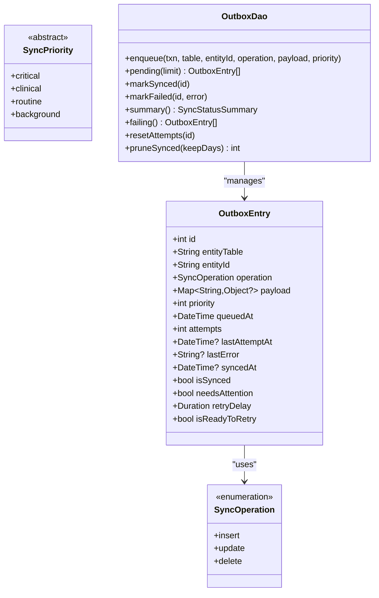
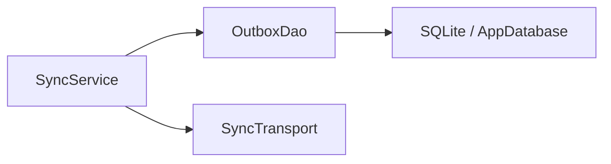

# Offline-First Data Synchronization

<cite>
**Referenced Files in This Document**
- [sync_service.dart](file://lib/data/sync/sync_service.dart)
- [outbox_dao.dart](file://lib/data/local/outbox_dao.dart)
</cite>

## Table of Contents
1. [Introduction](#introduction)
2. [Project Structure](#project-structure)
3. [Core Components](#core-components)
4. [Architecture Overview](#architecture-overview)
5. [Detailed Component Analysis](#detailed-component-analysis)
6. [Dependency Analysis](#dependency-analysis)
7. [Performance Considerations](#performance-considerations)
8. [Troubleshooting Guide](#troubleshooting-guide)
9. [Conclusion](#conclusion)

## Introduction
This document explains CareBridge AI’s offline-first data synchronization strategy with a focus on the SyncService implementation, the outbox pattern for eventual consistency, and how the application maintains data consistency across local and remote systems. It covers background sync processes, conflict resolution approaches, retry mechanisms, error recovery, and UI responsiveness to connectivity changes. It also includes guidance for performance optimization when handling large datasets or limited connectivity.

## Project Structure
The synchronization logic is implemented within the data layer:
- lib/data/sync/sync_service.dart: Background sync orchestration, transport abstraction, status broadcasting, and retry controls.
- lib/data/local/outbox_dao.dart: Outbox persistence, priority-based ordering, retry/backoff, and status aggregation.

**Diagram sources**
- [sync_service.dart:96-257](file://lib/data/sync/sync_service.dart#L96-L257)
- [outbox_dao.dart:160-276](file://lib/data/local/outbox_dao.dart#L160-L276)

**Section sources**
- [sync_service.dart:1-258](file://lib/data/sync/sync_service.dart#L1-L258)
- [outbox_dao.dart:1-277](file://lib/data/local/outbox_dao.dart#L1-L277)

## Core Components
- SyncService: Drives opportunistic background sync on connectivity events and periodic timers. It batches outbox entries, sends them via a pluggable transport, updates outbox state based on outcomes, and publishes a status summary stream for UI consumption.
- OutboxDao: Implements the outbox pattern by persisting change intents alongside business records in a single transaction. It provides priority-based retrieval, exponential backoff, failure surfacing, and cleanup of synced entries.
- SyncTransport: An abstract interface for network operations. The bundled LoopbackTransport simulates success for demonstration and testing; production can swap in HTTP/DHIMS2 implementations without changing SyncService.

Key behaviors:
- Opportunistic sync: runs immediately when connectivity returns and periodically.
- Small batches: limits per-run work to avoid long transactions and maximize partial progress.
- Priority ordering: critical items (e.g., referrals) are sent before routine registrations.
- Robust retries: exponential backoff with caps; failures are surfaced after repeated attempts.
- Eventual consistency: local writes are guaranteed; sync happens later when possible.

**Section sources**
- [sync_service.dart:96-257](file://lib/data/sync/sync_service.dart#L96-L257)
- [outbox_dao.dart:32-115](file://lib/data/local/outbox_dao.dart#L32-L115)
- [outbox_dao.dart:160-276](file://lib/data/local/outbox_dao.dart#L160-L276)

## Architecture Overview
The system uses an outbox-driven, event-sourced approach to ensure that every local write has a corresponding intent to synchronize. SyncService orchestrates sending these intents through a transport abstraction, while OutboxDao persists and manages lifecycle states.

**Diagram sources**
- [sync_service.dart:122-217](file://lib/data/sync/sync_service.dart#L122-L217)
- [outbox_dao.dart:164-199](file://lib/data/local/outbox_dao.dart#L164-L199)

## Detailed Component Analysis

### SyncService
Responsibilities:
- Start/stop background sync with periodic timer and connectivity listener.
- Execute one batch of outbox entries with re-entrancy guard.
- Classify outcomes into accepted, rejected, or unavailable and update outbox accordingly.
- Provide drain mode for manual “send now” behavior with bounded batches.
- Publish status summaries to a broadcast stream for UI monitoring.
- Expose helpers to inspect stuck entries and retry specific rows.

Important design points:
- Non-blocking: no UI waits for sync; it is always opportunistic.
- Batch size tuned for low-bandwidth environments.
- Early exit on transient network loss to avoid wasted attempts.
- Status stream enables reactive UI updates.

**Diagram sources**
- [sync_service.dart:156-217](file://lib/data/sync/sync_service.dart#L156-L217)

**Section sources**
- [sync_service.dart:96-257](file://lib/data/sync/sync_service.dart#L96-L257)

### OutboxDao and Outbox Pattern
Responsibilities:
- Persist change intents atomically with business data using a shared transaction.
- Order by priority then queue time to ensure urgent items leave first.
- Track attempts, last attempt time, and last error for each entry.
- Compute retry delays using capped exponential backoff.
- Provide queries for pending, failing, and summary metrics.
- Prune successfully synced entries older than a retention window.

Data model highlights:
- OutboxEntry fields include entity metadata, operation type, payload, priority, timestamps, and retry state.
- SyncOperation enumerates insert/update/delete semantics.
- SyncPriority defines levels from critical to background.

**Diagram sources**
- [outbox_dao.dart:32-115](file://lib/data/local/outbox_dao.dart#L32-L115)
- [outbox_dao.dart:160-276](file://lib/data/local/outbox_dao.dart#L160-L276)

**Section sources**
- [outbox_dao.dart:1-277](file://lib/data/local/outbox_dao.dart#L1-L277)

### Transport Abstraction and Conflict Resolution
- SyncTransport defines a single method to send an OutboxEntry and return a SendOutcome.
- LoopbackTransport accepts all entries with a small delay for demo/testing.
- Production transports should implement HTTP or DHIMS2 calls and map server responses to SendAccepted, SendRejected, or SendUnavailable.

Conflict resolution strategy:
- Coarse-grained: server applies last-write-wins using updated_at.
- No client-side merge conflicts; if a row fails repeatedly, it is surfaced for human review rather than automated merging.

**Section sources**
- [sync_service.dart:56-73](file://lib/data/sync/sync_service.dart#L56-L73)
- [outbox_dao.dart:29-32](file://lib/data/local/outbox_dao.dart#L29-L32)

### StreamProvider and UI Responsiveness
- SyncService exposes a broadcast stream of SyncStatusSummary.
- UI can subscribe to this stream to update banners, badges, or notifications reflecting pending/failing counts and oldest pending age.
- Connectivity changes trigger immediate sync attempts; periodic timers provide fallback cadence.

UI response patterns:
- Show “All records synced” when pending equals zero.
- Highlight urgent items when criticalPending > 0.
- Display reassurance text about local safety and automatic upload when network returns.

**Section sources**
- [sync_service.dart:111-133](file://lib/data/sync/sync_service.dart#L111-L133)
- [outbox_dao.dart:119-158](file://lib/data/local/outbox_dao.dart#L119-L158)

### Data Validation, Retry Mechanisms, and Error Recovery
- Validation: payloads are persisted as JSON; schema validation occurs at the transport boundary. Errors returned by the server are captured as last_error.
- Retry: exponential backoff with min/max bounds ensures battery-friendly retries even under prolonged outages.
- Failure surfacing: entries with attempts >= 5 are considered needing attention and are queryable via failing().
- Recovery: resetAttempts clears counters and errors; retry triggers another runOnce pass.

**Section sources**
- [outbox_dao.dart:82-95](file://lib/data/local/outbox_dao.dart#L82-L95)
- [outbox_dao.dart:240-261](file://lib/data/local/outbox_dao.dart#L240-L261)
- [sync_service.dart:253-256](file://lib/data/sync/sync_service.dart#L253-L256)

### Local Database Updates Triggering Sync Operations
- When a business record is created/updated/deleted, enqueue is called within the same database transaction to guarantee atomicity between the record and its sync intent.
- On next connectivity or timer tick, SyncService picks up pending entries and attempts delivery.

Example flow:
- Save assessment -> enqueue(insert/update) -> commit transaction -> background sync picks up entry -> transport.send -> markSynced on success.

**Section sources**
- [outbox_dao.dart:164-181](file://lib/data/local/outbox_dao.dart#L164-L181)
- [sync_service.dart:183-206](file://lib/data/sync/sync_service.dart#L183-L206)

### Remote Conflicts Resolution Examples
- If server rejects due to business rules, outcome maps to SendRejected; OutboxDao marks failed with reason. UI surfaces for CHO review.
- If server is temporarily unavailable, outcome maps to SendUnavailable; SyncService stops current batch to avoid wasted attempts and retries later.
- Last-write-wins policy means client does not perform merges; stale data is overwritten by latest server timestamp.

**Section sources**
- [sync_service.dart:187-206](file://lib/data/sync/sync_service.dart#L187-L206)
- [outbox_dao.dart:29-32](file://lib/data/local/outbox_dao.dart#L29-L32)

## Dependency Analysis
SyncService depends on OutboxDao for persistence and on SyncTransport for networking. OutboxDao depends on SQLite via sqflite and the app database singleton.

**Diagram sources**
- [sync_service.dart:96-114](file://lib/data/sync/sync_service.dart#L96-L114)
- [outbox_dao.dart:25-27](file://lib/data/local/outbox_dao.dart#L25-L27)

**Section sources**
- [sync_service.dart:96-114](file://lib/data/sync/sync_service.dart#L96-L114)
- [outbox_dao.dart:25-27](file://lib/data/local/outbox_dao.dart#L25-L27)

## Performance Considerations
- Batch sizing: keep batches small (default 25) to maximize partial success under intermittent connectivity.
- Priority ordering: critical items are prioritized to reduce risk during short connectivity windows.
- Backoff capping: retry delays are clamped to prevent excessive retries and battery drain.
- Pruning: prune synced entries older than a retention period to manage storage growth.
- Early termination: stop processing a batch when network becomes unavailable to avoid unnecessary attempts.
- Streaming status: broadcast minimal summary objects to avoid heavy UI recomputation.

[No sources needed since this section provides general guidance]

## Troubleshooting Guide
Common issues and resolutions:
- Stuck entries: use failing() to list entries with attempts >= 5 and last_error details. After fixing the underlying issue, call resetAttempts and retry.
- Network flaps: SyncService will pause mid-batch on SendUnavailable; reconnect triggers another runOnce automatically.
- Repeated rejections: inspect last_error messages; adjust payloads or server configuration as needed.
- Storage growth: ensure pruneSynced runs periodically to remove old synced entries.

Operational tips:
- Use drain(maxBatches) to force multiple passes when connectivity briefly improves.
- Monitor SyncStatusSummary label and detail strings to reassure users and guide actions.

**Section sources**
- [outbox_dao.dart:240-261](file://lib/data/local/outbox_dao.dart#L240-L261)
- [sync_service.dart:223-242](file://lib/data/sync/sync_service.dart#L223-L242)

## Conclusion
CareBridge AI’s offline-first synchronization relies on a robust outbox pattern and a resilient SyncService that opportunistically pushes changes when connectivity allows. By combining priority-based ordering, small batches, capped exponential backoff, and clear status streaming, the system ensures data safety, timely delivery of urgent records, and a smooth user experience even under challenging network conditions. Transports can be swapped seamlessly, and conflict resolution remains simple and predictable with last-write-wins semantics.