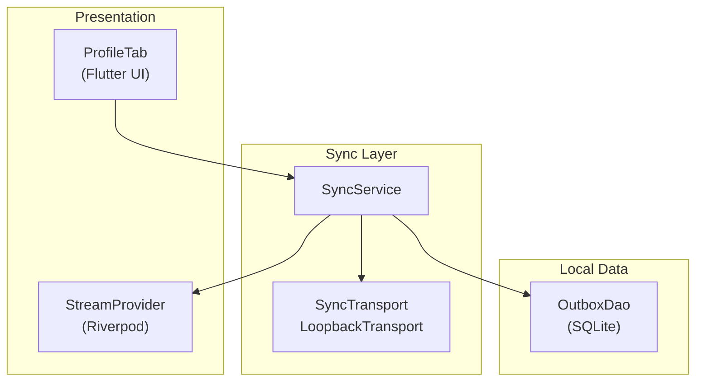
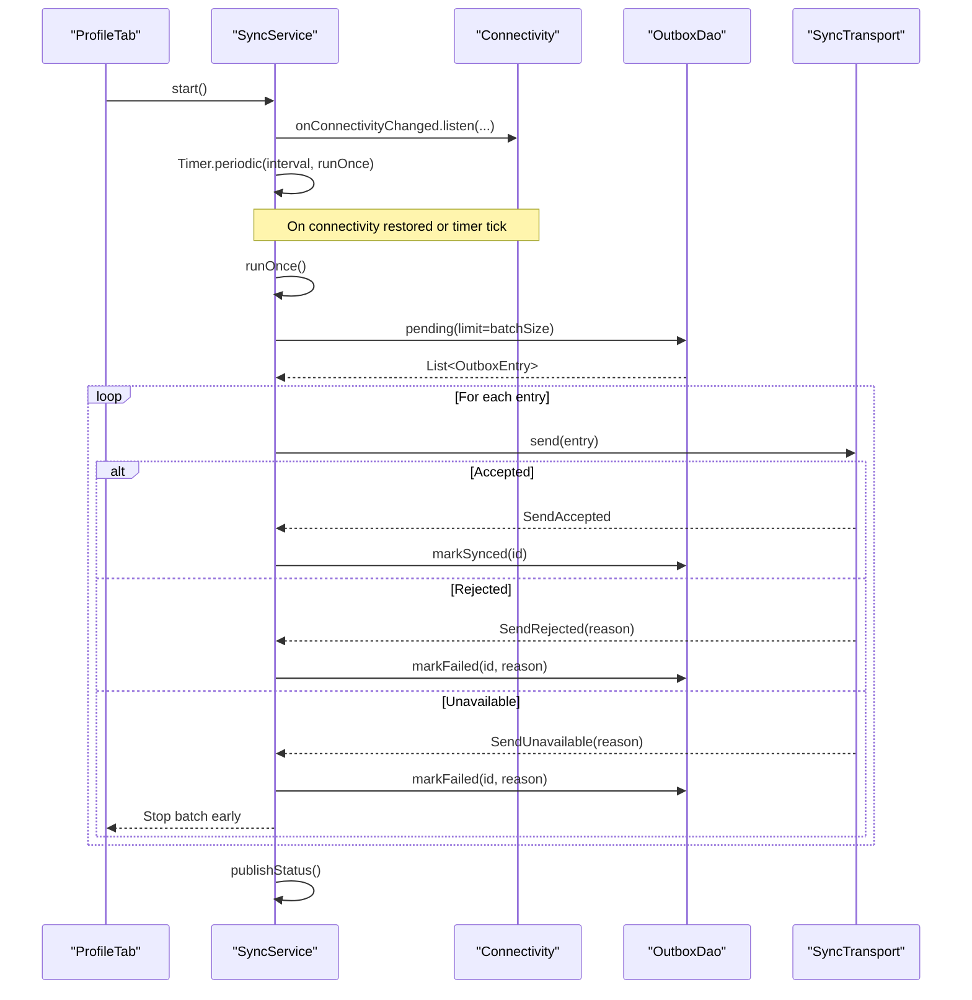
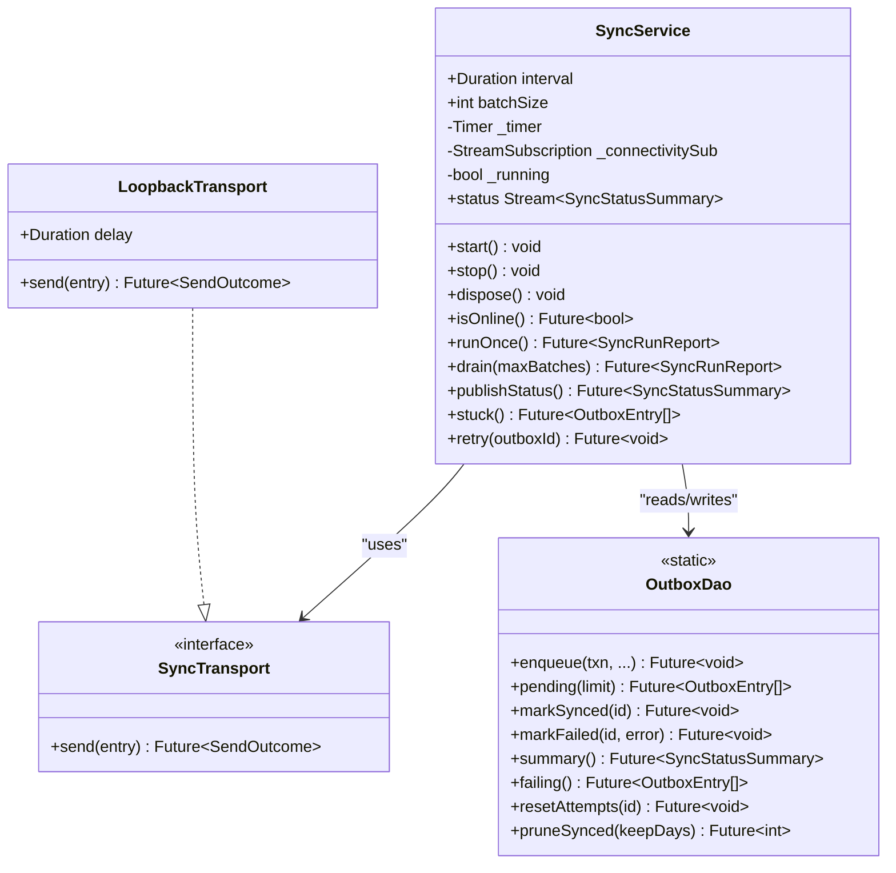
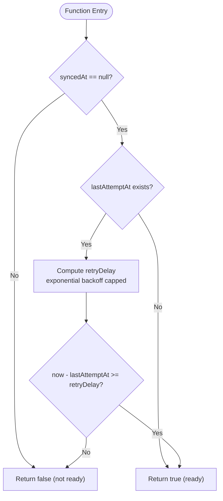
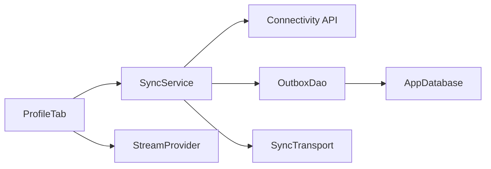

# Sync Service Implementation

<cite>
**Referenced Files in This Document**
- [sync_service.dart](file://lib/data/sync/sync_service.dart)
- [outbox_dao.dart](file://lib/data/local/outbox_dao.dart)
- [profile_tab.dart](file://lib/presentation/fhw/profile_tab.dart)
- [providers.dart](file://lib/app/providers.dart)
</cite>

## Table of Contents
1. [Introduction](#introduction)
2. [Project Structure](#project-structure)
3. [Core Components](#core-components)
4. [Architecture Overview](#architecture-overview)
5. [Detailed Component Analysis](#detailed-component-analysis)
6. [Dependency Analysis](#dependency-analysis)
7. [Performance Considerations](#performance-considerations)
8. [Troubleshooting Guide](#troubleshooting-guide)
9. [Conclusion](#conclusion)
10. [Appendices](#appendices)

## Introduction
This document explains the SyncService implementation that powers background synchronization in CareBridge AI. It covers how the service manages sync queues, reacts to connectivity changes, coordinates with the local SQLite outbox, and implements an outbox pattern for offline-first operations. It also documents lifecycle management, error handling strategies, retry mechanisms, and provides practical examples for triggering sync operations and monitoring status through StreamProvider.

## Project Structure
The sync subsystem spans three primary areas:
- Sync orchestration and transport abstraction (background scheduling, batching, retries)
- Local persistence layer for outbox entries (SQLite DAO)
- Presentation integration (UI triggers and status streaming)

**Diagram sources**
- [sync_service.dart:96-257](file://lib/data/sync/sync_service.dart#L96-L257)
- [outbox_dao.dart:160-276](file://lib/data/local/outbox_dao.dart#L160-L276)
- [profile_tab.dart:19-57](file://lib/presentation/fhw/profile_tab.dart#L19-L57)
- [providers.dart:1-200](file://lib/app/providers.dart#L1-L200)

**Section sources**
- [sync_service.dart:1-257](file://lib/data/sync/sync_service.dart#L1-L257)
- [outbox_dao.dart:1-276](file://lib/data/local/outbox_dao.dart#L1-L276)
- [profile_tab.dart:1-448](file://lib/presentation/fhw/profile_tab.dart#L1-L448)
- [providers.dart:1-200](file://lib/app/providers.dart#L1-L200)

## Core Components
- SyncService: Orchestrates periodic and opportunistic sync runs, monitors connectivity, batches outbox entries, and publishes status updates.
- SyncTransport: Abstraction for sending outbox entries; includes a LoopbackTransport for testing without a backend.
- OutboxDao: SQLite-backed data access object implementing the outbox pattern with priority ordering, exponential backoff, and pruning.
- SyncStatusSummary: Lightweight summary used by the UI to display pending, failing, and critical counts.

Key responsibilities:
- Background scheduling via Timer.periodic and Connectivity stream
- Batching and prioritized processing of outbox entries
- Robust error classification and retry/backoff
- Status broadcasting to UI via StreamController

**Section sources**
- [sync_service.dart:96-257](file://lib/data/sync/sync_service.dart#L96-L257)
- [outbox_dao.dart:49-158](file://lib/data/local/outbox_dao.dart#L49-L158)

## Architecture Overview
The system follows an outbox pattern: writes are persisted locally first, then asynchronously synchronized when connectivity allows. SyncService is the coordinator, OutboxDao persists and retrieves queued operations, and SyncTransport abstracts network calls.

**Diagram sources**
- [sync_service.dart:122-217](file://lib/data/sync/sync_service.dart#L122-L217)
- [outbox_dao.dart:187-218](file://lib/data/local/outbox_dao.dart#L187-L218)

## Detailed Component Analysis

### SyncService
Responsibilities:
- Start/stop lifecycle: initializes periodic timer and connectivity listener; exposes dispose to release resources.
- Opportunistic sync: triggers immediately when connectivity becomes available; otherwise relies on interval-based polling.
- Batch processing: fetches up to batchSize entries ordered by priority and age; processes them one-by-one.
- Error handling: classifies outcomes into accepted, rejected, or unavailable; marks rows accordingly; stops batch on unavailability to avoid wasted attempts.
- Reporting: publishes SyncStatusSummary to a broadcast stream for UI consumption.
- Manual controls: drain() repeatedly runs until no progress or maxBatches reached; retry(outboxId) resets attempts and re-triggers a run.

Key methods:
- start(): sets up timer and connectivity subscription; publishes initial status.
- stop()/dispose(): cancels subscriptions and closes the status controller.
- isOnline(): checks current connectivity state.
- runOnce(): guarded against re-entrancy; orchestrates one batch.
- drain(maxBatches): loops runOnce() to exhaust queue safely.
- publishStatus(): aggregates summary from OutboxDao and broadcasts it.
- stuck(): returns entries needing human attention.
- retry(outboxId): resets attempt counters and schedules another run.

**Diagram sources**
- [sync_service.dart:96-257](file://lib/data/sync/sync_service.dart#L96-L257)
- [outbox_dao.dart:160-276](file://lib/data/local/outbox_dao.dart#L160-L276)

**Section sources**
- [sync_service.dart:96-257](file://lib/data/sync/sync_service.dart#L96-L257)

### OutboxDao and Outbox Pattern
Responsibilities:
- Enqueue operations atomically with business data writes using a shared transaction.
- Prioritize urgent operations over routine ones; order by priority then enqueue time.
- Track attempts, last attempt time, last error, and synced timestamp.
- Implement exponential backoff capped to prevent battery drain and excessive waits.
- Provide queries for pending, failing, and summary statistics; prune successfully synced rows after retention period.

Key behaviors:
- enqueue(): inserts an outbox row within the same transaction as the business write.
- pending(limit): returns unsent rows ready to retry based on backoff rules.
- markSynced()/markFailed(): update timestamps and error fields; increment attempts on failure.
- summary(): aggregates counts for pending, failing, and critical items; oldest pending timestamp.
- failing(): lists rows requiring human intervention (attempts >= 5 and not synced).
- resetAttempts(): clears attempts and last error to allow retry.
- pruneSynced(): deletes old synced rows to manage storage.

**Diagram sources**
- [outbox_dao.dart:90-95](file://lib/data/local/outbox_dao.dart#L90-L95)

**Section sources**
- [outbox_dao.dart:49-158](file://lib/data/local/outbox_dao.dart#L49-L158)
- [outbox_dao.dart:160-276](file://lib/data/local/outbox_dao.dart#L160-L276)

### Transport Abstraction and LoopbackTransport
- SyncTransport defines a single method send(entry) returning a SendOutcome.
- LoopbackTransport simulates network behavior with a configurable delay and always accepts, enabling end-to-end testing without a server.

Use cases:
- Unit tests can assert acceptance and marking logic.
- Integration tests can swap in HTTP/DHIMS2 implementations seamlessly.

**Section sources**
- [sync_service.dart:54-73](file://lib/data/sync/sync_service.dart#L54-L73)

### UI Integration and StreamProvider
- ProfileTab demonstrates manual trigger via “Send everything now” which calls SyncService.drain().
- Status is observed through a Riverpod provider (syncStatusProvider) backed by SyncService.status stream.
- Stuck entries are loaded and displayed with per-entry retry actions.

Programmatic usage patterns:
- Trigger immediate sync: call SyncService.drain() from UI or service layer.
- Monitor status: watch syncStatusProvider to react to changes in pending/critical/failing counts.
- Retry specific entry: call SyncService.retry(outboxId) to reset attempts and schedule a run.

**Section sources**
- [profile_tab.dart:36-57](file://lib/presentation/fhw/profile_tab.dart#L36-L57)
- [profile_tab.dart:118-279](file://lib/presentation/fhw/profile_tab.dart#L118-L279)
- [providers.dart:1-200](file://lib/app/providers.dart#L1-L200)

## Dependency Analysis
- SyncService depends on:
  - Connectivity API for online checks and change events
  - OutboxDao for all database operations
  - SyncTransport for sending entries
- OutboxDao depends on:
  - AppDatabase instance for SQLite access
  - Tables.outbox schema for persistence
- UI depends on:
  - SyncService via providers (syncServiceProvider, syncStatusProvider)
  - OutboxEntry model for displaying stuck items

Potential coupling points:
- Connectivity integration is centralized in SyncService; easy to mock for tests.
- Transport abstraction isolates network code; swapping implementations does not affect core logic.
- Database interactions are encapsulated in OutboxDao; schema changes are localized.

**Diagram sources**
- [sync_service.dart:122-150](file://lib/data/sync/sync_service.dart#L122-L150)
- [outbox_dao.dart:187-218](file://lib/data/local/outbox_dao.dart#L187-L218)
- [profile_tab.dart:36-57](file://lib/presentation/fhw/profile_tab.dart#L36-L57)

**Section sources**
- [sync_service.dart:122-150](file://lib/data/sync/sync_service.dart#L122-L150)
- [outbox_dao.dart:187-218](file://lib/data/local/outbox_dao.dart#L187-L218)
- [profile_tab.dart:36-57](file://lib/presentation/fhw/profile_tab.dart#L36-L57)

## Performance Considerations
- Small batches: default batchSize=25 ensures quick wins even on brief connectivity windows.
- Priority ordering: critical items leave before routine ones, improving clinical urgency handling.
- Exponential backoff: prevents battery drain and reduces server load during prolonged outages.
- Pruning: removes old synced rows to keep storage lean on shared devices.
- Re-entrancy guard: avoids double-processing when timer and connectivity events overlap.

[No sources needed since this section provides general guidance]

## Troubleshooting Guide
Common issues and resolutions:
- No progress on sync:
  - Verify connectivity via isOnline() and ensure connectivity listener is active.
  - Check OutboxDao.pending() for entries ready to retry; inspect retryDelay and lastAttemptAt.
- Entries marked as failed:
  - Use OutboxDao.failing() to list stuck entries; review lastError messages.
  - Call SyncService.retry(outboxId) to reset attempts and re-run.
- UI shows stale status:
  - Ensure StreamProvider is subscribed to syncStatusProvider and SyncService.status is not closed.
  - Confirm publishStatus() is called after runOnce() completes.

Operational tips:
- Use drain(maxBatches) to force-sync when a brief connection window appears.
- Monitor SyncStatusSummary.criticalPending to prioritize urgent referrals.
- Keep an eye on SyncStatusSummary.failing to identify items needing human intervention.

**Section sources**
- [sync_service.dart:147-217](file://lib/data/sync/sync_service.dart#L147-L217)
- [outbox_dao.dart:240-261](file://lib/data/local/outbox_dao.dart#L240-L261)
- [profile_tab.dart:36-57](file://lib/presentation/fhw/profile_tab.dart#L36-L57)

## Conclusion
SyncService implements a robust, offline-first synchronization strategy tailored for field conditions. By combining opportunistic triggers, small prioritized batches, and resilient retry/backoff, it ensures data safety and timely delivery of critical records. The transport abstraction enables seamless integration with future backends, while StreamProvider-driven status updates keep users informed and in control.

[No sources needed since this section summarizes without analyzing specific files]

## Appendices

### How to Trigger Sync Operations Programmatically
- Immediate full sync: call SyncService.drain(maxBatches) from your UI or service layer.
- Single retry: call SyncService.retry(outboxId) to reset attempts and schedule a run.
- Periodic background sync: ensure SyncService.start() is called at app startup to enable timer and connectivity listener.

**Section sources**
- [sync_service.dart:223-242](file://lib/data/sync/sync_service.dart#L223-L242)
- [sync_service.dart:253-256](file://lib/data/sync/sync_service.dart#L253-L256)
- [sync_service.dart:122-133](file://lib/data/sync/sync_service.dart#L122-L133)

### Monitoring Sync Status Through StreamProvider
- Subscribe to syncStatusProvider to receive SyncStatusSummary updates.
- React to changes in pending, criticalPending, and failing counts to update UI banners and notifications.
- Use SyncService.status stream directly if not using Riverpod.

**Section sources**
- [profile_tab.dart:118-279](file://lib/presentation/fhw/profile_tab.dart#L118-L279)
- [sync_service.dart:111-114](file://lib/data/sync/sync_service.dart#L111-L114)