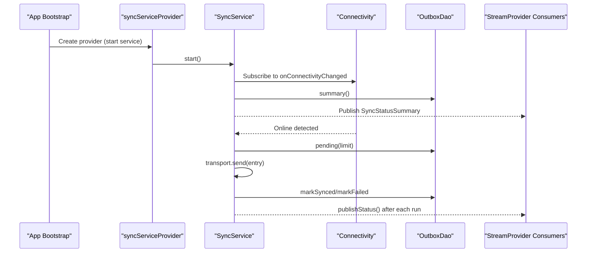
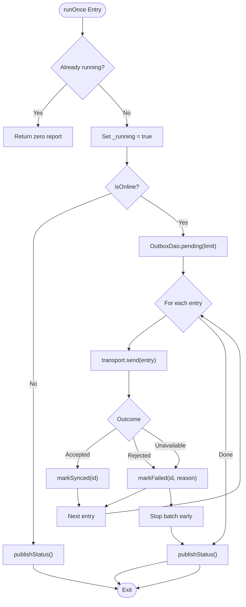
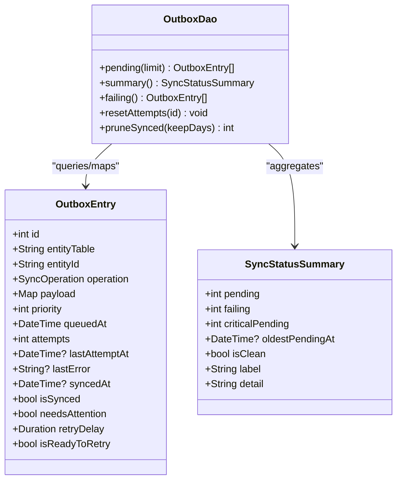
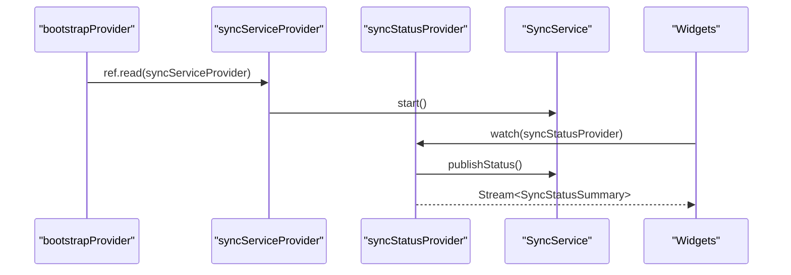
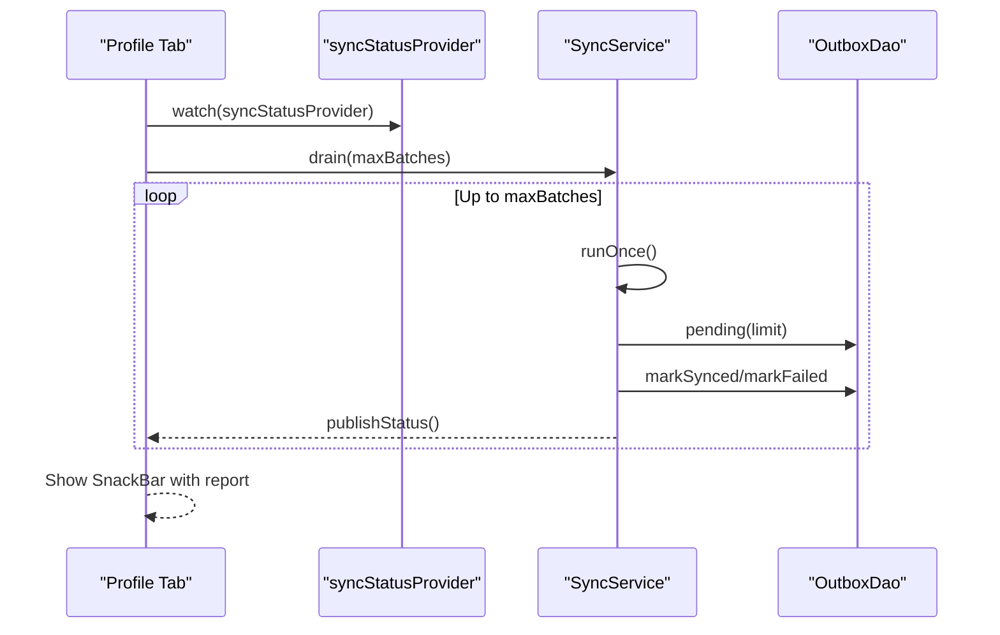
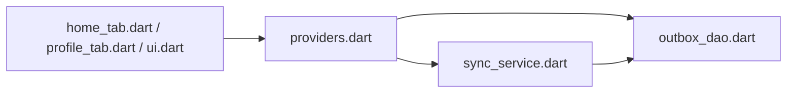

# Sync Status Monitoring

<cite>
**Referenced Files in This Document**
- [main.dart](file://lib/main.dart)
- [providers.dart](file://lib/app/providers.dart)
- [sync_service.dart](file://lib/data/sync/sync_service.dart)
- [outbox_dao.dart](file://lib/data/local/outbox_dao.dart)
- [home_tab.dart](file://lib/presentation/fhw/home_tab.dart)
- [profile_tab.dart](file://lib/presentation/fhw/profile_tab.dart)
- [ui.dart](file://lib/presentation/shared/ui.dart)
</cite>

## Table of Contents
1. Introduction
2. Project Structure
3. Core Components
4. Architecture Overview
5. Detailed Component Analysis
6. Dependency Analysis
7. Performance Considerations
8. Troubleshooting Guide
9. Conclusion

## Introduction
This document explains the sync status monitoring system in CareBridge AI, focusing on how real-time sync state is exposed to the UI via StreamProvider and how users see connection state, progress indicators, and error notifications. It also clarifies how connectivity changes are handled, what manual controls exist, and how to subscribe to sync streams and build custom widgets.

## Project Structure
The sync status pipeline spans three layers:
- Data layer: Outbox DAO provides counts and summaries for pending and failing items.
- Service layer: SyncService orchestrates background sync, listens to connectivity, and broadcasts status updates.
- Presentation layer: Riverpod providers expose a stream of sync summaries; UI components render banners and actions.

```mermaid
graph TB
subgraph "Presentation"
Home["Home Tab"]
Profile["Profile Tab"]
Banner["SyncBanner Widget"]
end
subgraph "Providers"
Providers["Riverpod Providers<br/>syncServiceProvider, syncStatusProvider"]
end
subgraph "Data"
SyncSvc["SyncService"]
OutboxDAO["OutboxDao"]
end
Home --> Providers
Profile --> Providers
Banner --> Providers
Providers --> SyncSvc
SyncSvc --> OutboxDAO
```

**Diagram sources**
- [providers.dart:52-64](file://lib/app/providers.dart#L52-L64)
- [sync_service.dart:96-145](file://lib/data/sync/sync_service.dart#L96-L145)
- [outbox_dao.dart:117-158](file://lib/data/local/outbox_dao.dart#L117-L158)
- [home_tab.dart:38](file://lib/presentation/fhw/home_tab.dart#L38)
- [profile_tab.dart:122](file://lib/presentation/fhw/profile_tab.dart#L122)
- [ui.dart:352-370](file://lib/presentation/shared/ui.dart#L352-L370)

**Section sources**
- [main.dart:16-18](file://lib/main.dart#L16-L18)
- [providers.dart:38-42](file://lib/app/providers.dart#L38-L42)

## Core Components
- SyncService: Manages periodic and connectivity-driven sync runs, re-entrancy protection, batch processing, and broadcasting of SyncStatusSummary via a broadcast stream.
- OutboxDao: Provides pending batches, failure handling, retry/backoff logic, and summary aggregation used by the banner.
- Riverpod Providers: Expose SyncService and a StreamProvider that emits SyncStatusSummary to the UI.
- UI Widgets: SyncBanner displays pending/failing counts with reassuring text; screens trigger manual “send now” operations.

Key responsibilities:
- Real-time status: publishStatus() aggregates current outbox state and pushes to the stream.
- Connectivity-driven sync: start() subscribes to connectivity changes and triggers runOnce() when online.
- Manual control: drain() allows immediate batching until no progress or limit reached.

**Section sources**
- [sync_service.dart:96-145](file://lib/data/sync/sync_service.dart#L96-L145)
- [sync_service.dart:152-217](file://lib/data/sync/sync_service.dart#L152-L217)
- [sync_service.dart:219-248](file://lib/data/sync/sync_service.dart#L219-L248)
- [outbox_dao.dart:117-158](file://lib/data/local/outbox_dao.dart#L117-L158)
- [outbox_dao.dart:183-238](file://lib/data/local/outbox_dao.dart#L183-L238)
- [providers.dart:52-64](file://lib/app/providers.dart#L52-L64)

## Architecture Overview
The sync status flow connects data, service, and UI through Riverpod streams.



**Diagram sources**
- [providers.dart:38-42](file://lib/app/providers.dart#L38-L42)
- [providers.dart:52-64](file://lib/app/providers.dart#L52-L64)
- [sync_service.dart:122-133](file://lib/data/sync/sync_service.dart#L122-L133)
- [sync_service.dart:152-217](file://lib/data/sync/sync_service.dart#L152-L217)
- [sync_service.dart:244-248](file://lib/data/sync/sync_service.dart#L244-L248)
- [outbox_dao.dart:183-238](file://lib/data/local/outbox_dao.dart#L183-L238)

## Detailed Component Analysis

### SyncService
Responsibilities:
- Start/stop timers and connectivity subscriptions.
- Run one batch safely (re-entrancy guard).
- Batch loop with priority ordering and backoff-aware filtering.
- Broadcast updated SyncStatusSummary after every change.

Key behaviors:
- Opportunistic sync: periodic timer plus immediate trigger on connectivity gain.
- Re-entrancy guard prevents double-sends when both timer and connectivity fire together.
- Manual drain loops multiple batches until no progress or maxBatches reached.



**Diagram sources**
- [sync_service.dart:152-217](file://lib/data/sync/sync_service.dart#L152-L217)
- [sync_service.dart:244-248](file://lib/data/sync/sync_service.dart#L244-L248)

**Section sources**
- [sync_service.dart:96-145](file://lib/data/sync/sync_service.dart#L96-L145)
- [sync_service.dart:152-217](file://lib/data/sync/sync_service.dart#L152-L217)
- [sync_service.dart:219-248](file://lib/data/sync/sync_service.dart#L219-L248)

### OutboxDao and SyncStatusSummary
Responsibilities:
- Provide pending entries ordered by priority and age.
- Track attempts, last errors, and synced timestamps.
- Compute summary counts for UI banner.

Important fields:
- pending: total unsynced rows.
- failing: rows with attempts >= 5 and not synced.
- criticalPending: urgent items still pending.
- oldestPendingAt: age indicator for reassurance messaging.



**Diagram sources**
- [outbox_dao.dart:49-115](file://lib/data/local/outbox_dao.dart#L49-L115)
- [outbox_dao.dart:117-158](file://lib/data/local/outbox_dao.dart#L117-L158)
- [outbox_dao.dart:183-238](file://lib/data/local/outbox_dao.dart#L183-L238)

**Section sources**
- [outbox_dao.dart:117-158](file://lib/data/local/outbox_dao.dart#L117-L158)
- [outbox_dao.dart:183-238](file://lib/data/local/outbox_dao.dart#L183-L238)

### Riverpod Providers and Stream Exposure
Responsibilities:
- Provide SyncService instance and lifecycle disposal.
- Expose a StreamProvider that returns SyncService.status and seeds initial value via publishStatus().

How it works:
- bootstrapProvider ensures database and seed are ready, then starts SyncService.
- syncServiceProvider creates and disposes SyncService.
- syncStatusProvider watches the service and returns its status stream; first call triggers publishStatus() so UI renders immediately.



**Diagram sources**
- [providers.dart:38-42](file://lib/app/providers.dart#L38-L42)
- [providers.dart:52-64](file://lib/app/providers.dart#L52-L64)

**Section sources**
- [providers.dart:38-42](file://lib/app/providers.dart#L38-L42)
- [providers.dart:52-64](file://lib/app/providers.dart#L52-L64)

### UI Integration and Manual Controls
- Home and Profile tabs consume syncStatusProvider to display status.
- Profile tab includes a manual “send now” action that calls drain() and shows a SnackBar summarizing results.
- SyncBanner widget renders pending/failing counts with reassuring messages.

Manual control flow:
- User taps “Send now”.
- Screen calls drain(), which loops runOnce() up to maxBatches.
- After completion, screen shows feedback and refreshes stuck list if needed.



**Diagram sources**
- [profile_tab.dart:41-57](file://lib/presentation/fhw/profile_tab.dart#L41-L57)
- [sync_service.dart:219-248](file://lib/data/sync/sync_service.dart#L219-L248)
- [outbox_dao.dart:183-238](file://lib/data/local/outbox_dao.dart#L183-L238)

**Section sources**
- [profile_tab.dart:41-57](file://lib/presentation/fhw/profile_tab.dart#L41-L57)
- [ui.dart:352-370](file://lib/presentation/shared/ui.dart#L352-L370)

## Dependency Analysis
High-level dependencies:
- Providers depend on SyncService and OutboxDao.
- SyncService depends on OutboxDao and connectivity.
- UI depends on providers and uses SyncBanner for visual feedback.



**Diagram sources**
- [providers.dart:52-64](file://lib/app/providers.dart#L52-L64)
- [sync_service.dart:96-145](file://lib/data/sync/sync_service.dart#L96-L145)
- [outbox_dao.dart:117-158](file://lib/data/local/outbox_dao.dart#L117-L158)
- [home_tab.dart:38](file://lib/presentation/fhw/home_tab.dart#L38)
- [profile_tab.dart:122](file://lib/presentation/fhw/profile_tab.dart#L122)
- [ui.dart:352-370](file://lib/presentation/shared/ui.dart#L352-L370)

**Section sources**
- [providers.dart:52-64](file://lib/app/providers.dart#L52-L64)
- [sync_service.dart:96-145](file://lib/data/sync/sync_service.dart#L96-L145)
- [outbox_dao.dart:117-158](file://lib/data/local/outbox_dao.dart#L117-L158)

## Performance Considerations
- Small batches: default batchSize reduces risk of large rollbacks during brief connectivity windows.
- Priority ordering: critical items leave the device before routine work.
- Backoff: exponential retry delay prevents battery drain and server overload.
- Re-entrancy guard: avoids duplicate sends when timer and connectivity events overlap.
- Pruning: synced rows older than keepDays are removed to manage storage.

[No sources needed since this section provides general guidance]

## Troubleshooting Guide
Common issues and responses:
- No connectivity: runOnce() exits early; publishStatus() reflects offline state; banner reassures users that data is saved locally.
- Network drops mid-batch: SendUnavailable stops the batch early to avoid inflating attempt counters; deferred count increases.
- Repeated failures: entries with attempts >= 5 surface as failing; UI can offer retry via resetAttempts followed by runOnce().
- Manual send: use drain() to force immediate batches; inspect returned report for accepted/rejected/deferred counts.

Operational tips:
- Use the “send now” button to feel control during brief connectivity windows.
- Monitor failing entries and resolve underlying errors before retrying.
- Ensure bootstrapProvider completes before relying on sync status to avoid blank initial states.

**Section sources**
- [sync_service.dart:152-217](file://lib/data/sync/sync_service.dart#L152-L217)
- [sync_service.dart:219-248](file://lib/data/sync/sync_service.dart#L219-L248)
- [outbox_dao.dart:183-238](file://lib/data/local/outbox_dao.dart#L183-L238)
- [profile_tab.dart:41-57](file://lib/presentation/fhw/profile_tab.dart#L41-L57)

## Conclusion
CareBridge AI’s sync status monitoring leverages a robust service-layer design and Riverpod streams to deliver real-time, user-friendly sync feedback. The system prioritizes critical data, handles connectivity fluctuations gracefully, and offers manual controls for user confidence. By subscribing to syncStatusProvider and using SyncBanner, developers can implement consistent, reassuring sync status visuals across the app.

[No sources needed since this section summarizes without analyzing specific files]