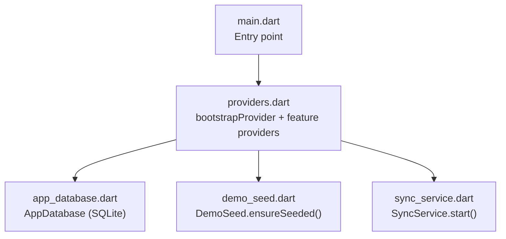
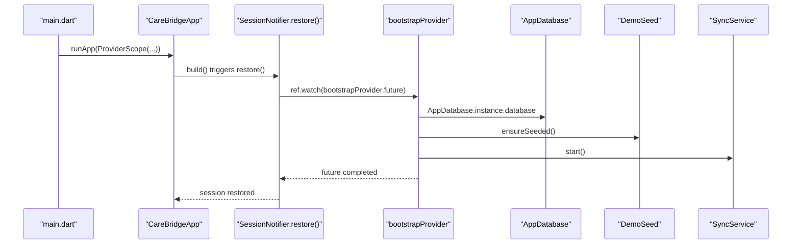
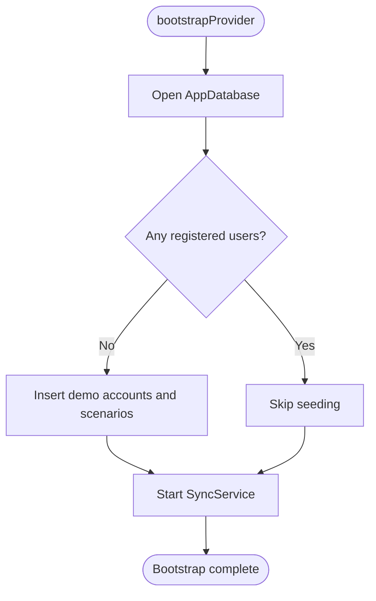
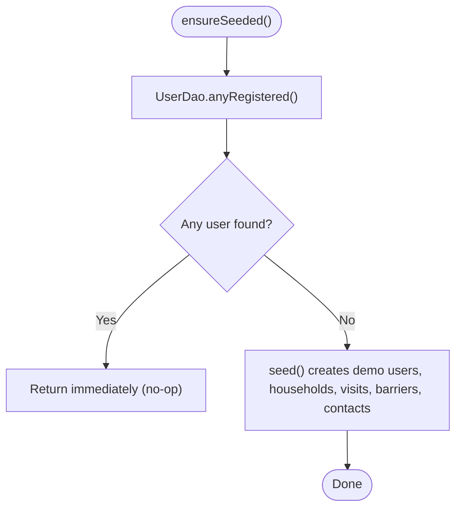
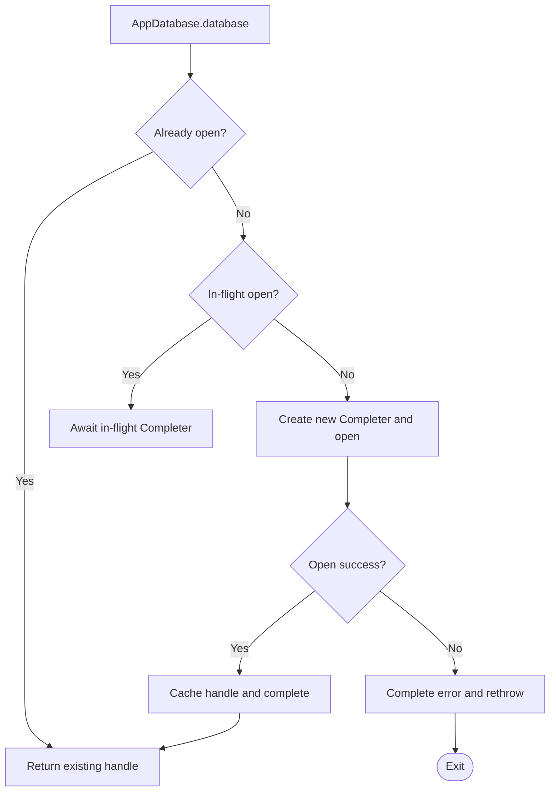
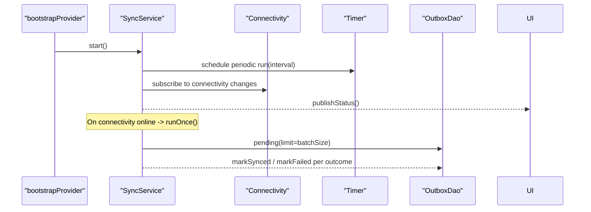
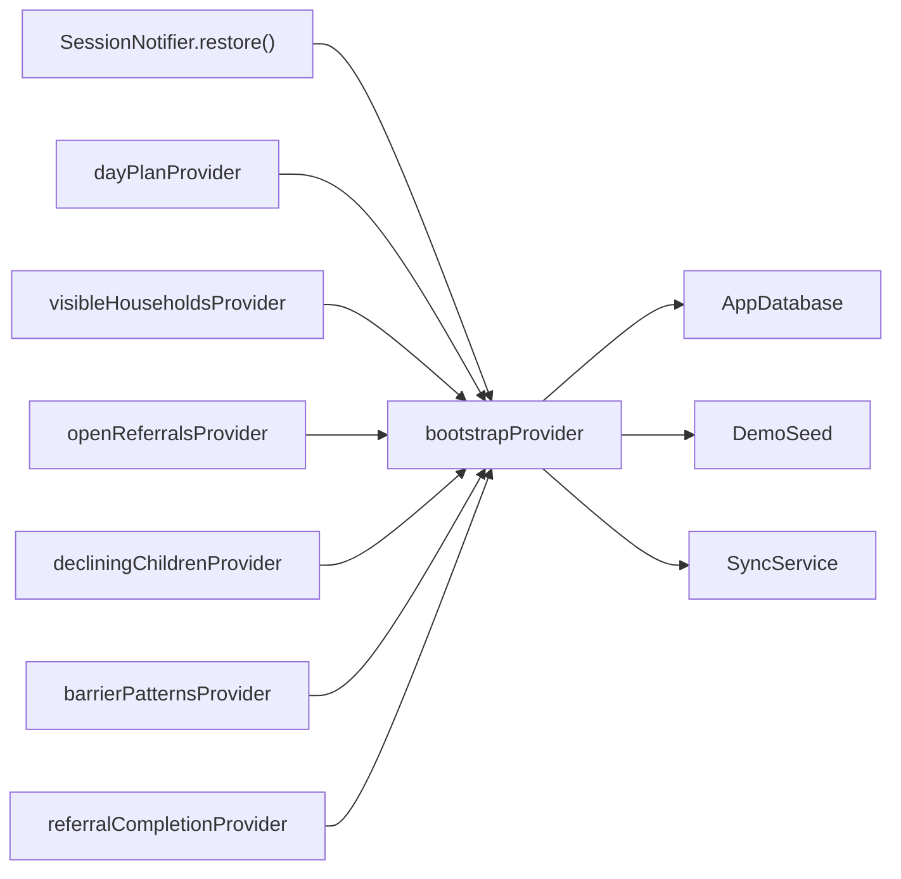

# Bootstrap Provider & Application Initialization

<cite>
**Referenced Files in This Document**
- [main.dart](file://lib/main.dart)
- [providers.dart](file://lib/app/providers.dart)
- [app_database.dart](file://lib/data/local/app_database.dart)
- [demo_seed.dart](file://lib/data/local/demo_seed.dart)
- [sync_service.dart](file://lib/data/sync/sync_service.dart)
</cite>

## Table of Contents
1. Introduction
2. Project Structure
3. Core Components
4. Architecture Overview
5. Detailed Component Analysis
6. Dependency Analysis
7. Performance Considerations
8. Troubleshooting Guide
9. Conclusion

## Introduction
This document explains how CareBridge AI initializes at startup using a bootstrap provider pattern built on Riverpod. It covers:
- How the bootstrapProvider orchestrates database initialization, demo data seeding, and sync service startup
- The idempotent seeding mechanism that prevents demo data from mixing with real field data
- The dependency injection pattern ensuring correct initialization order
- Examples of other providers depending on bootstrapProvider.future to run after initialization completes
- Error handling during bootstrap and recovery strategies

## Project Structure
At app start, Flutter runs main.dart which wraps the application in a Riverpod ProviderScope and renders the root widget. The bootstrap logic is centralized in lib/app/providers.dart, while persistence and sync are implemented under lib/data/local and lib/data/sync respectively.



**Diagram sources**
- [main.dart:16-18](file://lib/main.dart#L16-L18)
- [providers.dart:38-42](file://lib/app/providers.dart#L38-L42)
- [app_database.dart:67-88](file://lib/data/local/app_database.dart#L67-L88)
- [demo_seed.dart:60-66](file://lib/data/local/demo_seed.dart#L60-L66)
- [sync_service.dart:122-133](file://lib/data/sync/sync_service.dart#L122-L133)

**Section sources**
- [main.dart:16-18](file://lib/main.dart#L16-L18)
- [providers.dart:1-13](file://lib/app/providers.dart#L1-L13)

## Core Components
- bootstrapProvider: A FutureProvider that ensures the database is open, seeds demo data if needed, and starts the sync service. All other features wait on this future.
- AppDatabase: Singleton SQLite wrapper that opens the database once, guards against concurrent open calls, and manages schema creation/upgrade.
- DemoSeed: Idempotent seed that checks for existing accounts before inserting any demo records.
- SyncService: Background sync manager that listens for connectivity changes and periodically processes outbox items.

Key responsibilities:
- Database readiness: AppDatabase.instance.database guarantees a single open handle and safe concurrency.
- Seeding safety: DemoSeed.ensureSeeded() only seeds when no user exists, protecting real data.
- Sync lifecycle: SyncService.start() sets up timers and connectivity listeners; it is started exactly once by bootstrapProvider.

**Section sources**
- [providers.dart:38-42](file://lib/app/providers.dart#L38-L42)
- [app_database.dart:43-88](file://lib/data/local/app_database.dart#L43-L88)
- [demo_seed.dart:60-66](file://lib/data/local/demo_seed.dart#L60-L66)
- [sync_service.dart:96-133](file://lib/data/sync/sync_service.dart#L96-L133)

## Architecture Overview
The bootstrap flow establishes a strict initialization order through Riverpod’s dependency graph. Feature providers explicitly await bootstrapProvider.future before performing I/O or computations that depend on a ready database and sync pipeline.



**Diagram sources**
- [main.dart:16-18](file://lib/main.dart#L16-L18)
- [providers.dart:89-92](file://lib/app/providers.dart#L89-L92)
- [providers.dart:38-42](file://lib/app/providers.dart#L38-L42)
- [app_database.dart:67-88](file://lib/data/local/app_database.dart#L67-L88)
- [demo_seed.dart:60-66](file://lib/data/local/demo_seed.dart#L60-L66)
- [sync_service.dart:122-133](file://lib/data/sync/sync_service.dart#L122-L133)

## Detailed Component Analysis

### bootstrapProvider orchestration
- Ensures database readiness via AppDatabase.instance.database
- Runs idempotent seeding via DemoSeed.ensureSeeded()
- Starts background sync via SyncService.start()
- Exposes a single future that all downstream providers can await



**Diagram sources**
- [providers.dart:38-42](file://lib/app/providers.dart#L38-L42)
- [demo_seed.dart:60-66](file://lib/data/local/demo_seed.dart#L60-L66)
- [sync_service.dart:122-133](file://lib/data/sync/sync_service.dart#L122-L133)

**Section sources**
- [providers.dart:38-42](file://lib/app/providers.dart#L38-L42)

### Idempotent seeding mechanism
- DemoSeed.ensureSeeded() checks UserDao.anyRegistered() before seeding
- If any account exists, seeding is skipped entirely, preserving real field data
- Fixed demo account credentials allow repeatable demos without overwriting real data



**Diagram sources**
- [demo_seed.dart:60-66](file://lib/data/local/demo_seed.dart#L60-L66)

**Section sources**
- [demo_seed.dart:60-66](file://lib/data/local/demo_seed.dart#L60-L66)

### Dependency injection and initialization order
- bootstrapProvider is a FutureProvider<void> that encapsulates all startup tasks
- Other providers watch bootstrapProvider.future to guarantee dependencies are ready
- Example usages:
  - Session restoration waits on bootstrapProvider.future before restoring session state
  - dayPlanProvider, visibleHouseholdsProvider, openReferralsProvider, decliningChildrenProvider, barrierPatternsProvider, referralCompletionProvider all await bootstrapProvider.future

```mermaid
classDiagram
class Providers {
+FutureProvider~void~ bootstrapProvider
+Provider~SyncService~ syncServiceProvider
+FutureProvider~DayPlan~ dayPlanProvider
+FutureProvider~List~ visibleHouseholdsProvider
+FutureProvider~List~ openReferralsProvider
+FutureProvider~List~ decliningChildrenProvider
+FutureProvider~List~ barrierPatternsProvider
+FutureProvider~({int,int,double})~ referralCompletionProvider
}
class SessionNotifier {
+restore() Future~void~
}
Providers <.. SessionNotifier : "awaits bootstrapProvider.future"
Providers <.. DayPlanProvider : "awaits bootstrapProvider.future"
Providers <.. VisibleHouseholdsProvider : "awaits bootstrapProvider.future"
```

**Diagram sources**
- [providers.dart:38-42](file://lib/app/providers.dart#L38-L42)
- [providers.dart:89-92](file://lib/app/providers.dart#L89-L92)
- [providers.dart:145-156](file://lib/app/providers.dart#L145-L156)
- [providers.dart:160-165](file://lib/app/providers.dart#L160-L165)
- [providers.dart:300-305](file://lib/app/providers.dart#L300-L305)
- [providers.dart:310-320](file://lib/app/providers.dart#L310-L320)
- [providers.dart:323-332](file://lib/app/providers.dart#L323-L332)
- [providers.dart:334-338](file://lib/app/providers.dart#L334-L338)

**Section sources**
- [providers.dart:89-92](file://lib/app/providers.dart#L89-L92)
- [providers.dart:145-156](file://lib/app/providers.dart#L145-L156)
- [providers.dart:160-165](file://lib/app/providers.dart#L160-L165)
- [providers.dart:300-305](file://lib/app/providers.dart#L300-L305)
- [providers.dart:310-320](file://lib/app/providers.dart#L310-L320)
- [providers.dart:323-332](file://lib/app/providers.dart#L323-L332)
- [providers.dart:334-338](file://lib/app/providers.dart#L334-L338)

### Database initialization details
- AppDatabase.instance.database returns an already-open handle or opens one safely
- Uses a Completer to prevent concurrent openDatabase calls that could crash on Android
- Enables foreign keys and applies schema creation/upgrade hooks
- Provides clearAll() for resetting demo data without reinstalling



**Diagram sources**
- [app_database.dart:67-88](file://lib/data/local/app_database.dart#L67-L88)

**Section sources**
- [app_database.dart:67-88](file://lib/data/local/app_database.dart#L67-L88)

### Sync service startup and lifecycle
- SyncService.start() registers periodic timer and connectivity listener
- Immediately publishes status so UI reflects current state
- runOnce() is re-entrancy guarded to avoid double-processing
- drain() allows manual “send now” behavior with batch limits and pruning



**Diagram sources**
- [sync_service.dart:122-133](file://lib/data/sync/sync_service.dart#L122-L133)
- [sync_service.dart:156-217](file://lib/data/sync/sync_service.dart#L156-L217)
- [sync_service.dart:223-242](file://lib/data/sync/sync_service.dart#L223-L242)

**Section sources**
- [sync_service.dart:122-133](file://lib/data/sync/sync_service.dart#L122-L133)
- [sync_service.dart:156-217](file://lib/data/sync/sync_service.dart#L156-L217)
- [sync_service.dart:223-242](file://lib/data/sync/sync_service.dart#L223-L242)

## Dependency Analysis
The bootstrapProvider sits at the root of the dependency graph. All feature reads and session restoration depend on its completion. This centralizes startup sequencing and avoids race conditions between database readiness, seeding, and sync.



**Diagram sources**
- [providers.dart:38-42](file://lib/app/providers.dart#L38-L42)
- [providers.dart:89-92](file://lib/app/providers.dart#L89-L92)
- [providers.dart:145-156](file://lib/app/providers.dart#L145-L156)
- [providers.dart:160-165](file://lib/app/providers.dart#L160-L165)
- [providers.dart:300-305](file://lib/app/providers.dart#L300-L305)
- [providers.dart:310-320](file://lib/app/providers.dart#L310-L320)
- [providers.dart:323-332](file://lib/app/providers.dart#L323-L332)
- [providers.dart:334-338](file://lib/app/providers.dart#L334-L338)

**Section sources**
- [providers.dart:38-42](file://lib/app/providers.dart#L38-L42)
- [providers.dart:89-92](file://lib/app/providers.dart#L89-L92)
- [providers.dart:145-156](file://lib/app/providers.dart#L145-L156)
- [providers.dart:160-165](file://lib/app/providers.dart#L160-L165)
- [providers.dart:300-305](file://lib/app/providers.dart#L300-L305)
- [providers.dart:310-320](file://lib/app/providers.dart#L310-L320)
- [providers.dart:323-332](file://lib/app/providers.dart#L323-L332)
- [providers.dart:334-338](file://lib/app/providers.dart#L334-L338)

## Performance Considerations
- Single database open: AppDatabase uses a Completer to avoid multiple openDatabase calls, preventing crashes and redundant work.
- Lazy initialization: bootstrapProvider is evaluated only when first awaited, keeping startup fast.
- Idempotent seeding: DemoSeed skips work when users exist, avoiding unnecessary writes.
- Non-blocking sync: SyncService never blocks UI; it runs on a timer and connectivity events.
- Batched sync: Small batches reduce failure impact and improve progress visibility.

[No sources needed since this section provides general guidance]

## Troubleshooting Guide
Common issues and recovery strategies:
- Database open failures: AppDatabase.database catches errors and rethrows them; ensure platform-specific FFI initialization is performed on desktop/tests.
- Concurrent open attempts: Handled by Completer; verify no code path bypasses AppDatabase.instance.database.
- Seeding conflicts: If demo data appears alongside real data, confirm DemoSeed.ensureSeeded() is called and that UserDao.anyRegistered() correctly detects existing accounts.
- Sync not running: Verify SyncService.start() was invoked by bootstrapProvider and that connectivity listener is active; check runOnce() guard and isOnline checks.
- Stuck outbox entries: Use SyncService.stuck() to list failing rows and retry individual entries via SyncService.retry(id).

**Section sources**
- [app_database.dart:67-88](file://lib/data/local/app_database.dart#L67-L88)
- [demo_seed.dart:60-66](file://lib/data/local/demo_seed.dart#L60-L66)
- [sync_service.dart:156-217](file://lib/data/sync/sync_service.dart#L156-L217)
- [sync_service.dart:250-257](file://lib/data/sync/sync_service.dart#L250-L257)

## Conclusion
CareBridge AI’s bootstrapProvider centralizes and sequences critical startup tasks: opening the database, idempotently seeding demo data, and starting background sync. By exposing a single future, it enforces a clean dependency graph where all feature providers wait for a fully initialized environment. This design ensures robustness in low-connectivity settings, protects real field data from accidental overwrites, and provides clear extension points for future services.

[No sources needed since this section summarizes without analyzing specific files]