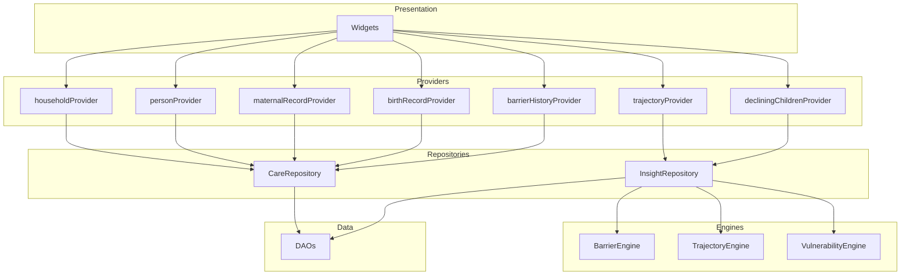
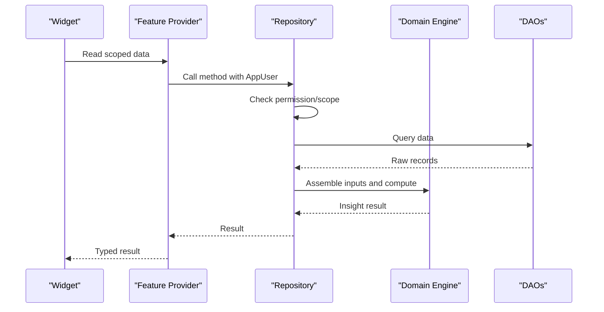
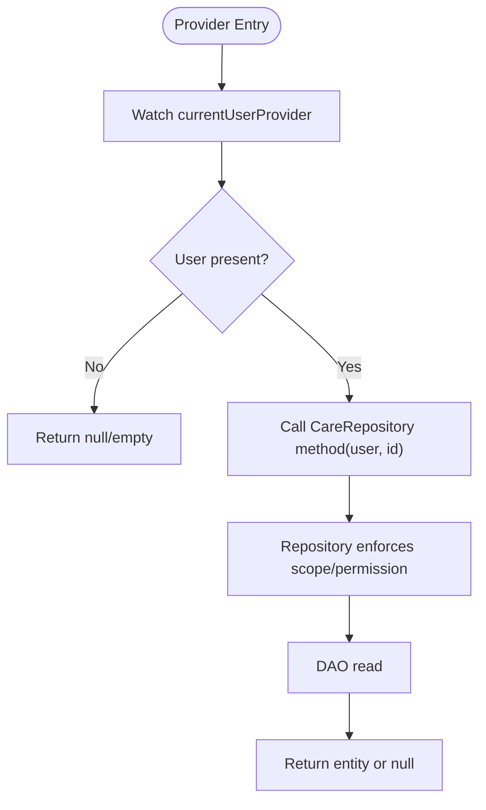
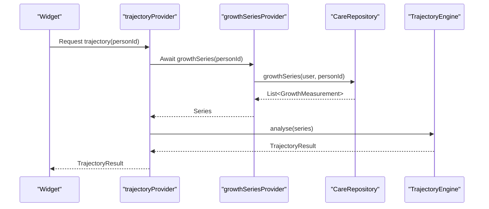
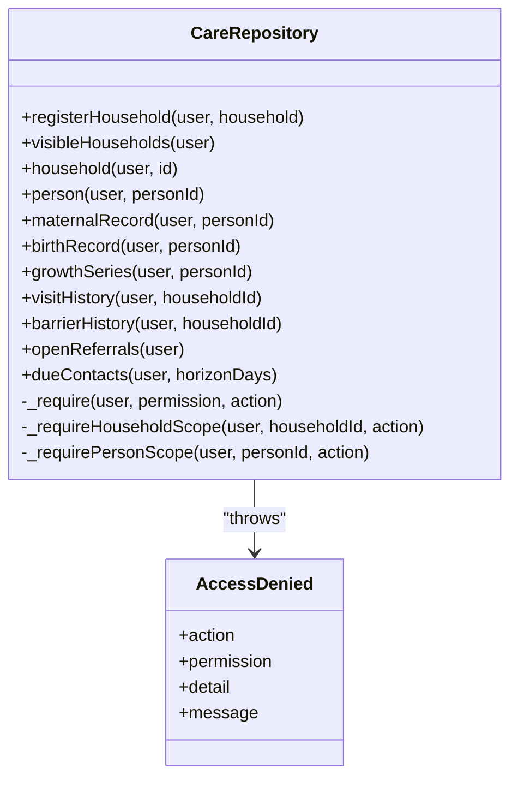
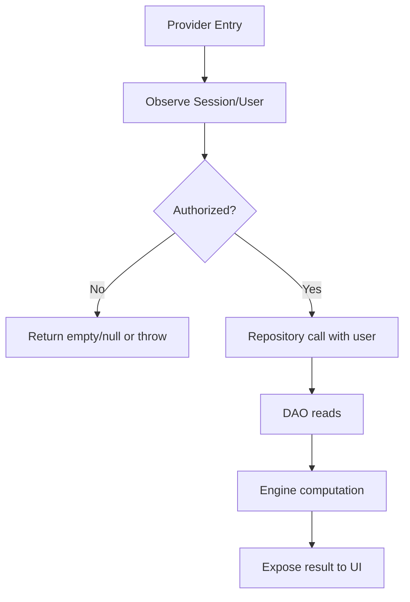
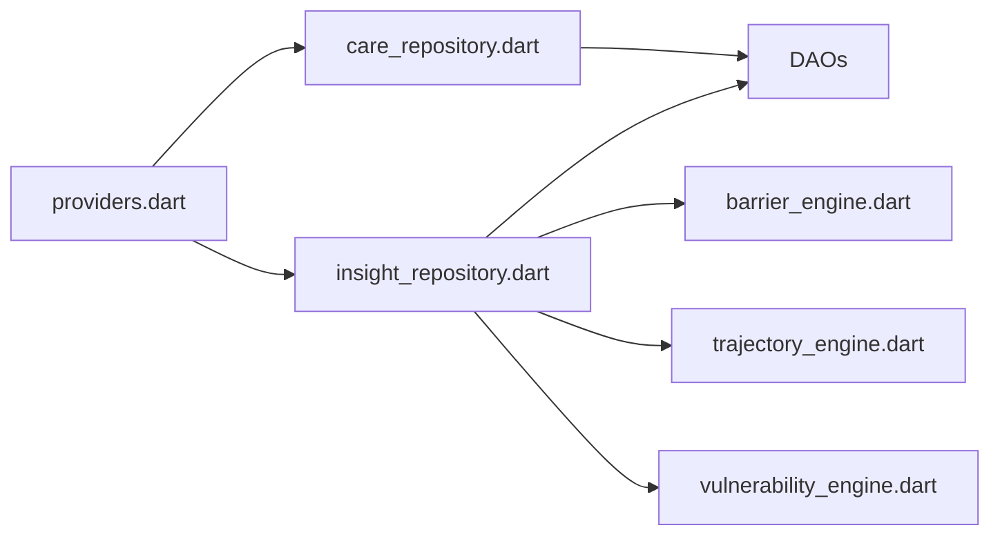

# Feature-Specific Providers & Domain Logic

<cite>
**Referenced Files in This Document**
- [providers.dart](file://lib/app/providers.dart)
- [care_repository.dart](file://lib/data/repositories/care_repository.dart)
- [insight_repository.dart](file://lib/data/repositories/insight_repository.dart)
- [barrier_engine.dart](file://lib/domain/engines/barrier_engine.dart)
- [trajectory_engine.dart](file://lib/domain/engines/trajectory_engine.dart)
- [vulnerability_engine.dart](file://lib/domain/engines/vulnerability_engine.dart)
- [core.dart](file://lib/domain/entities/core.dart)
- [visit.dart](file://lib/domain/entities/visit.dart)
- [enums.dart](file://lib/domain/enums.dart)
- [main.dart](file://lib/main.dart)
</cite>

## Table of Contents
1. [Introduction](#introduction)
2. [Project Structure](#project-structure)
3. [Core Components](#core-components)
4. [Architecture Overview](#architecture-overview)
5. [Detailed Component Analysis](#detailed-component-analysis)
6. [Dependency Analysis](#dependency-analysis)
7. [Performance Considerations](#performance-considerations)
8. [Troubleshooting Guide](#troubleshooting-guide)
9. [Conclusion](#conclusion)

## Introduction
This document explains the feature-specific providers that encapsulate domain logic and business rules, focusing on:
- Family providers: householdProvider, personProvider, maternalRecordProvider, birthRecordProvider for scoped data access
- Analysis providers: trajectoryProvider, barrierHistoryProvider, decliningChildrenProvider integrating domain engines with UI state
- Permission enforcement patterns ensuring users only access data within their authorized scope
- Composition patterns where providers combine multiple data sources and apply business logic before exposing results to the presentation layer

The app uses Riverpod for state management and a layered architecture: providers orchestrate reads through repositories, which enforce role-based access control (RBAC) and delegate to DAOs. Domain engines implement clinical and operational analytics.

## Project Structure
At a high level:
- Presentation layer consumes providers
- Providers coordinate repositories and engines
- Repositories enforce permissions and call DAOs
- Engines compute insights from assembled inputs

**Diagram sources**
- [providers.dart](file://lib/app/providers.dart)
- [care_repository.dart](file://lib/data/repositories/care_repository.dart)
- [insight_repository.dart](file://lib/data/repositories/insight_repository.dart)
- [barrier_engine.dart](file://lib/domain/engines/barrier_engine.dart)
- [trajectory_engine.dart](file://lib/domain/engines/trajectory_engine.dart)
- [vulnerability_engine.dart](file://lib/domain/engines/vulnerability_engine.dart)

**Section sources**
- [main.dart](file://lib/main.dart)
- [providers.dart](file://lib/app/providers.dart)

## Core Components
- CareRepository: Centralized access control gateway enforcing permissions and scoping per user role (FHW vs caregiver). Throws AccessDenied when unauthorized.
- InsightRepository: Assembles inputs from DAOs and calls domain engines to produce insights like day plans, vulnerability scores, trajectories, barrier forecasts, and zone patterns.
- Domain Engines: Pure functions over structured inputs:
  - BarrierEngine: Predicts barriers to care and aggregates zone-wide patterns
  - TrajectoryEngine: Analyzes growth trends and projects risk thresholds
  - VulnerabilityEngine: Scores households based on composite inputs

These components are wired together by providers that also enforce RBAC at the provider boundary.

**Section sources**
- [care_repository.dart](file://lib/data/repositories/care_repository.dart)
- [insight_repository.dart](file://lib/data/repositories/insight_repository.dart)
- [barrier_engine.dart](file://lib/domain/engines/barrier_engine.dart)
- [trajectory_engine.dart](file://lib/domain/engines/trajectory_engine.dart)
- [vulnerability_engine.dart](file://lib/domain/engines/vulnerability_engine.dart)

## Architecture Overview
The providers act as the single source of truth for feature data. They:
- Watch current session/user context
- Enforce permissions via repository methods
- Compose multiple data sources
- Apply domain engine logic
- Expose typed results to widgets

**Diagram sources**
- [providers.dart](file://lib/app/providers.dart)
- [care_repository.dart](file://lib/data/repositories/care_repository.dart)
- [insight_repository.dart](file://lib/data/repositories/insight_repository.dart)

## Detailed Component Analysis

### Family Providers: Scoped Data Access
Family providers expose household and person-level data with strict scoping:
- householdProvider(id): Returns a Household if the user is authorized; otherwise null or denial
- personProvider(personId): Returns a Person after verifying ownership or FHW scope
- maternalRecordProvider(personId): Returns MaternalRecord for a mother
- birthRecordProvider(personId): Returns BirthRecord for a newborn

Each provider watches currentUserProvider and delegates to CareRepository methods that enforce scope checks.

**Diagram sources**
- [providers.dart](file://lib/app/providers.dart)
- [care_repository.dart](file://lib/data/repositories/care_repository.dart)

**Section sources**
- [providers.dart](file://lib/app/providers.dart)
- [care_repository.dart](file://lib/data/repositories/care_repository.dart)
- [core.dart](file://lib/domain/entities/core.dart)

### Analysis Providers: Integrating Engines with UI State
Analysis providers compose data and domain logic:
- trajectoryProvider(personId): Fetches growth series and runs TrajectoryEngine.analyse
- barrierHistoryProvider(householdId): Retrieves historical barriers for a household
- decliningChildrenProvider(): Aggregates children whose MUAC is falling across the zone

These providers ensure RBAC and use InsightRepository or CareRepository to assemble inputs and run engines.

**Diagram sources**
- [providers.dart](file://lib/app/providers.dart)
- [trajectory_engine.dart](file://lib/domain/engines/trajectory_engine.dart)

**Section sources**
- [providers.dart](file://lib/app/providers.dart)
- [insight_repository.dart](file://lib/data/repositories/insight_repository.dart)
- [trajectory_engine.dart](file://lib/domain/engines/trajectory_engine.dart)

### Permission Enforcement Patterns
Permission enforcement is centralized in CareRepository:
- _require(user, permission, action): Checks user.can(permission), audits denials, throws AccessDenied
- _requireHouseholdScope(user, householdId, action): Ensures caregivers can only access their linked household
- _requirePersonScope(user, personId, action): Resolves person’s household and applies household scope

Providers rely on these guards implicitly by calling repository methods. Some providers explicitly check permissions (e.g., dayPlanProvider, decliningChildrenProvider).

**Diagram sources**
- [care_repository.dart](file://lib/data/repositories/care_repository.dart)

**Section sources**
- [care_repository.dart](file://lib/data/repositories/care_repository.dart)
- [providers.dart](file://lib/app/providers.dart)

### Composition Examples: Multiple Data Sources and Business Logic
- householdScoreProvider(id): First calls CareRepository.household(user, id) to enforce scope, then InsightRepository.scoreHousehold(id) to compute vulnerability score
- decliningChildrenProvider(): Requires viewCommunityInsights permission, then InsightRepository.decliningChildren() to aggregate deteriorating MUAC trajectories
- barrierHistoryProvider(householdId): Uses CareRepository.barrierHistory(user, householdId) to return reported barriers for a compound

These examples show how providers combine authorization, data retrieval, and analysis into a single reactive stream/future.

**Section sources**
- [providers.dart](file://lib/app/providers.dart)
- [insight_repository.dart](file://lib/data/repositories/insight_repository.dart)
- [care_repository.dart](file://lib/data/repositories/care_repository.dart)

### Conceptual Overview
Conceptually, feature providers follow a consistent pattern:
- Observe current user/session
- Validate permissions and scope
- Retrieve raw data via repositories
- Apply domain engines for analysis
- Expose typed results to UI

[No sources needed since this diagram shows conceptual workflow, not actual code structure]

## Dependency Analysis
Providers depend on repositories and engines; repositories depend on DAOs and engines. The dependency graph ensures separation of concerns and clear boundaries for testing and maintenance.

**Diagram sources**
- [providers.dart](file://lib/app/providers.dart)
- [care_repository.dart](file://lib/data/repositories/care_repository.dart)
- [insight_repository.dart](file://lib/data/repositories/insight_repository.dart)
- [barrier_engine.dart](file://lib/domain/engines/barrier_engine.dart)
- [trajectory_engine.dart](file://lib/domain/engines/trajectory_engine.dart)
- [vulnerability_engine.dart](file://lib/domain/engines/vulnerability_engine.dart)

**Section sources**
- [providers.dart](file://lib/app/providers.dart)
- [care_repository.dart](file://lib/data/repositories/care_repository.dart)
- [insight_repository.dart](file://lib/data/repositories/insight_repository.dart)

## Performance Considerations
- Batched reads: InsightRepository.planDay performs five batched queries for an entire zone, avoiding per-household round trips
- In-memory ranking: Scoring and sorting happen in Dart over loaded data to keep UI responsive
- Lazy initialization: Bootstrap provider seeds database and sync service once; providers await bootstrap before accessing data
- Minimal re-computation: Providers cache results via Riverpod; dependent widgets rebuild efficiently

[No sources needed since this section provides general guidance]

## Troubleshooting Guide
Common issues and resolutions:
- AccessDenied exceptions: Occur when a user lacks required permissions or attempts to access another family’s data. Check user.role and linkedHouseholdId bindings
- Empty results: Ensure bootstrapProvider has completed and user is signed in; verify repository methods are called with correct IDs
- Stale insights: Re-trigger providers by changing dependencies (e.g., switching users or refreshing data)

**Section sources**
- [care_repository.dart](file://lib/data/repositories/care_repository.dart)
- [providers.dart](file://lib/app/providers.dart)

## Conclusion
Feature-specific providers in this application provide a robust, permission-enforced interface between UI and domain logic. By centralizing access control in repositories and delegating analysis to pure domain engines, the system ensures security, testability, and performance. Providers compose multiple data sources and business rules to deliver actionable insights to frontline health workers while maintaining strict data privacy and role-based access.