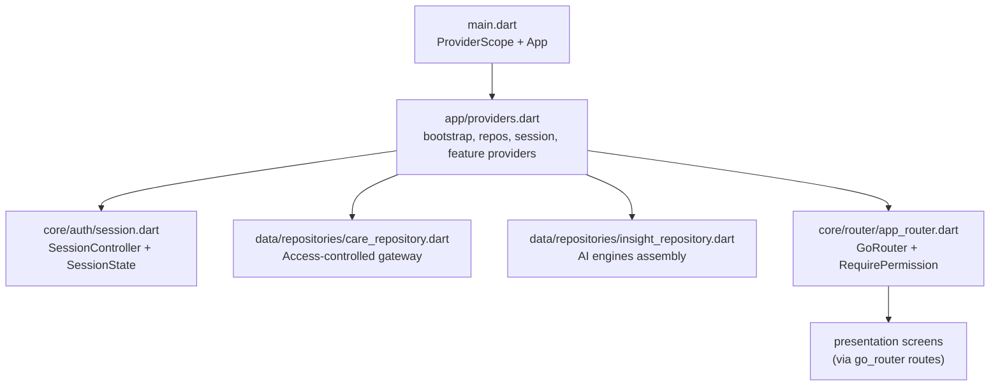
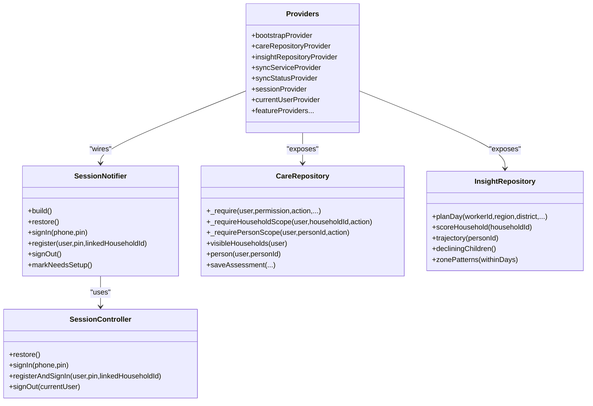
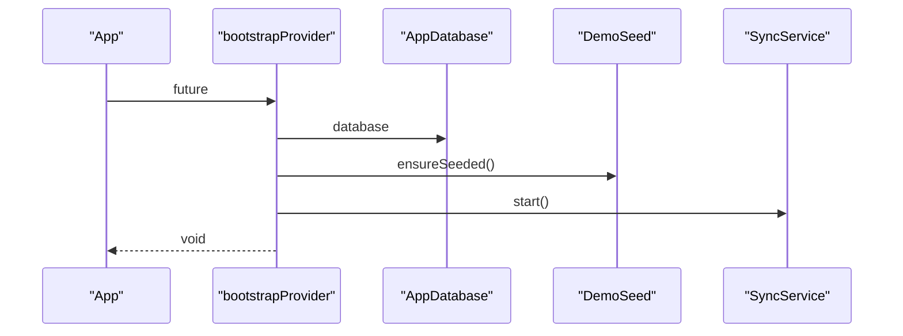
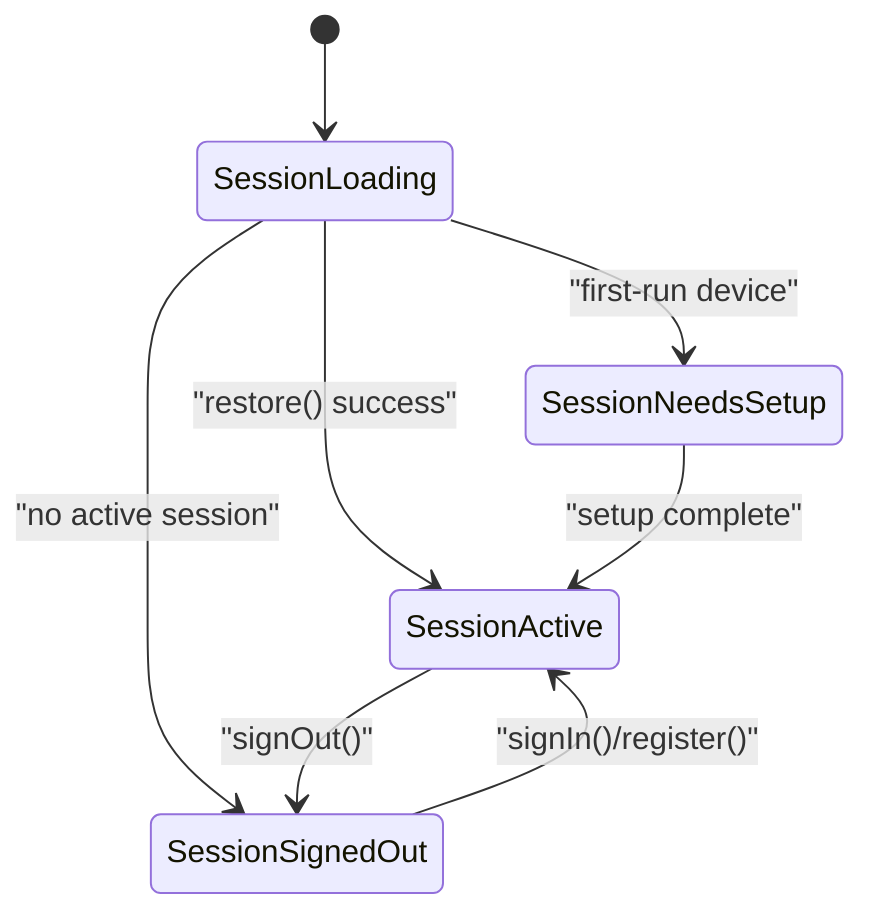
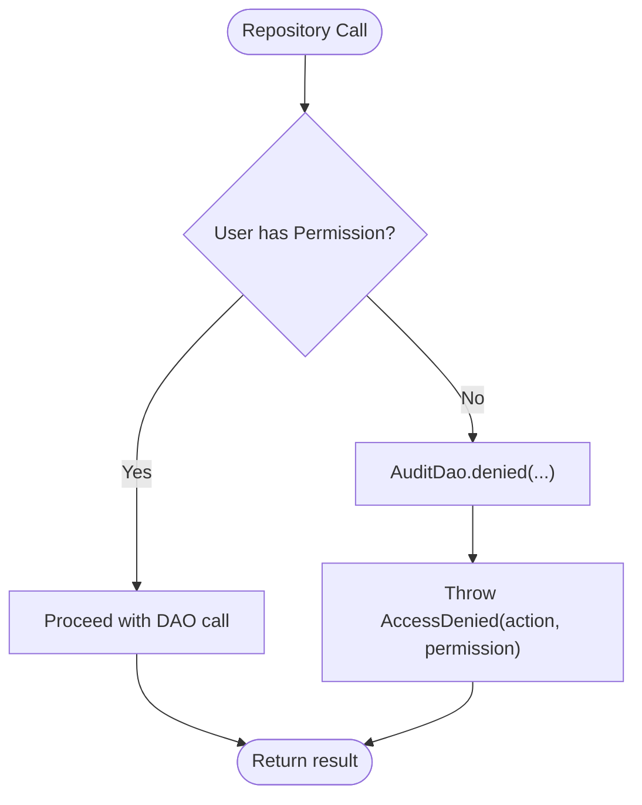
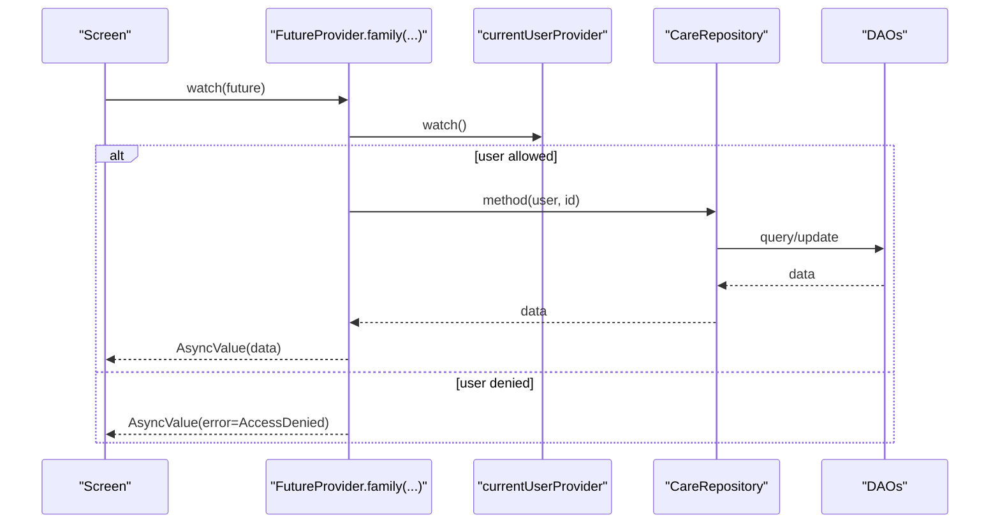
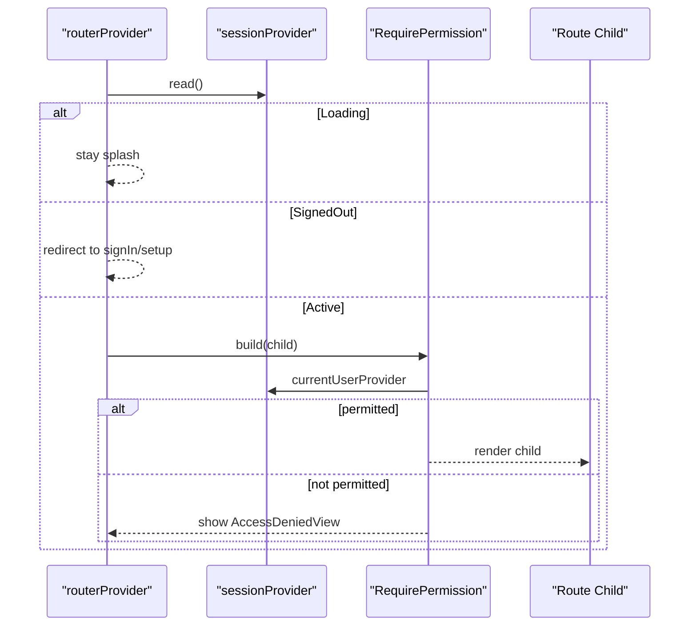
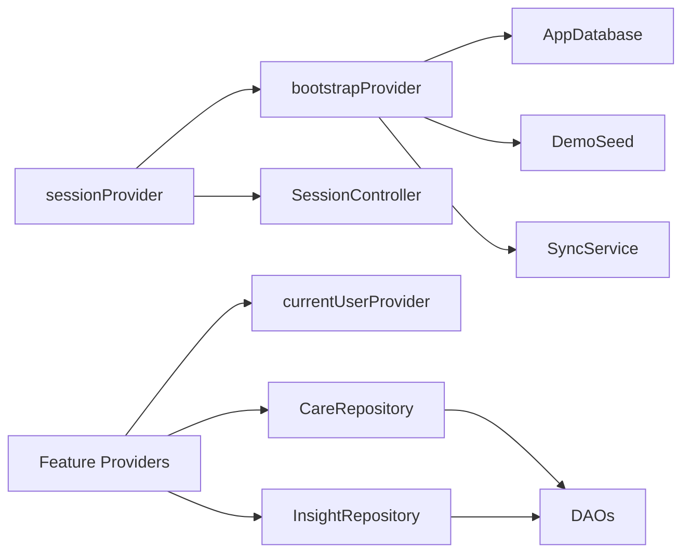

# Provider Architecture & State Management

<cite>
**Referenced Files in This Document**
- [main.dart](file://lib/main.dart)
- [providers.dart](file://lib/app/providers.dart)
- [session.dart](file://lib/core/auth/session.dart)
- [app_router.dart](file://lib/core/router/app_router.dart)
- [care_repository.dart](file://lib/data/repositories/care_repository.dart)
- [insight_repository.dart](file://lib/data/repositories/insight_repository.dart)
- [enums.dart](file://lib/domain/enums.dart)
- [rbac_test.dart](file://test/rbac_test.dart)
</cite>

## Table of Contents
1. [Introduction](#introduction)
2. [Project Structure](#project-structure)
3. [Core Components](#core-components)
4. [Architecture Overview](#architecture-overview)
5. [Detailed Component Analysis](#detailed-component-analysis)
6. [Dependency Analysis](#dependency-analysis)
7. [Performance Considerations](#performance-considerations)
8. [Troubleshooting Guide](#troubleshooting-guide)
9. [Conclusion](#conclusion)
10. [Appendices](#appendices)

## Introduction
This document explains CareBridge AI’s provider architecture and state management built with Riverpod. It focuses on the centralized providers file, the Notifier pattern for mutable session state, FutureProvider patterns for async data loading, and how permission checks and role-based access control are enforced through repositories and routing. It also covers lifecycle management, error handling, and testing strategies.

## Project Structure
CareBridge AI uses a single, centralized providers file to keep dependency tracking visible and maintainable. The app entry point initializes a ProviderScope and wires the router, while all other services (database, seeding, sync) are lazily loaded by providers.

**Diagram sources**
- [main.dart:16-34](file://lib/main.dart#L16-L34)
- [providers.dart:38-64](file://lib/app/providers.dart#L38-L64)
- [session.dart:71-112](file://lib/core/auth/session.dart#L71-L112)
- [care_repository.dart:55-110](file://lib/data/repositories/care_repository.dart#L55-L110)
- [insight_repository.dart:120-168](file://lib/data/repositories/insight_repository.dart#L120-L168)
- [app_router.dart:63-159](file://lib/core/router/app_router.dart#L63-L159)

**Section sources**
- [main.dart:16-34](file://lib/main.dart#L16-L34)
- [providers.dart:1-13](file://lib/app/providers.dart#L1-L13)

## Core Components
- Bootstrap and infrastructure providers: database initialization, demo seeding, and sync service startup.
- Repository providers: CareRepository and InsightRepository exposed as singletons via Riverpod.
- Session providers: SessionController and SessionNotifier (NotifierProvider) managing authentication state.
- Feature read providers: FutureProvider and FutureProvider.family for scoped data retrieval with permission checks.
- Routing integration: GoRouter wired via a provider and guarded by capability checks.

Key responsibilities:
- bootstrapProvider ensures DB is open, seeds demo data idempotently, and starts sync.
- careRepositoryProvider and insightRepositoryProvider centralize business logic and data access.
- sessionProvider exposes SessionState; SessionNotifier handles restore, sign-in, register, sign-out.
- currentUserProvider and linkedHouseholdProvider derive current user and scope from session.
- Feature providers enforce permissions before calling repositories and return typed data or errors.

**Section sources**
- [providers.dart:38-64](file://lib/app/providers.dart#L38-L64)
- [providers.dart:68-135](file://lib/app/providers.dart#L68-L135)
- [providers.dart:145-339](file://lib/app/providers.dart#L145-L339)
- [session.dart:71-112](file://lib/core/auth/session.dart#L71-L112)
- [care_repository.dart:55-110](file://lib/data/repositories/care_repository.dart#L55-L110)
- [insight_repository.dart:120-168](file://lib/data/repositories/insight_repository.dart#L120-L168)

## Architecture Overview
The application follows a layered approach:
- Presentation layer consumes providers via ConsumerWidget/ConsumerStatefulWidget.
- State layer uses Riverpod NotifierProvider for mutable state and FutureProvider for async reads.
- Domain layer contains pure engines and entities.
- Data layer provides DAOs and repositories that enforce permissions and audit denials.

**Diagram sources**
- [providers.dart:68-135](file://lib/app/providers.dart#L68-L135)
- [session.dart:71-112](file://lib/core/auth/session.dart#L71-L112)
- [care_repository.dart:55-110](file://lib/data/repositories/care_repository.dart#L55-L110)
- [insight_repository.dart:120-168](file://lib/data/repositories/insight_repository.dart#L120-L168)

## Detailed Component Analysis

### Bootstrap and Infrastructure
- bootstrapProvider opens the database, seeds demo data idempotently, and starts the sync service.
- syncServiceProvider manages lifecycle and exposes status stream via syncStatusProvider.

**Diagram sources**
- [providers.dart:38-42](file://lib/app/providers.dart#L38-L42)
- [providers.dart:52-56](file://lib/app/providers.dart#L52-L56)

**Section sources**
- [providers.dart:38-64](file://lib/app/providers.dart#L38-L64)

### Session State Management (Notifier Pattern)
- sessionProvider is a NotifierProvider<SessionNotifier, SessionState>.
- SessionNotifier initializes to SessionLoading, then restores persisted session asynchronously.
- Actions include signIn, register, signOut, and markNeedsSetup.

**Diagram sources**
- [providers.dart:73-122](file://lib/app/providers.dart#L73-L122)
- [session.dart:29-67](file://lib/core/auth/session.dart#L29-L67)

**Section sources**
- [providers.dart:68-135](file://lib/app/providers.dart#L68-L135)
- [session.dart:71-112](file://lib/core/auth/session.dart#L71-L112)

### Permission Checks and Role-Based Access Control
- CareRepository enforces permissions via _require and scope guards (_requireHouseholdScope, _requirePersonScope).
- Denials are audited and throw AccessDenied exceptions.
- Router-level RequirePermission wraps screens with capability checks.

**Diagram sources**
- [care_repository.dart:62-79](file://lib/data/repositories/care_repository.dart#L62-L79)
- [care_repository.dart:86-110](file://lib/data/repositories/care_repository.dart#L86-L110)
- [app_router.dart:167-196](file://lib/core/router/app_router.dart#L167-L196)

**Section sources**
- [care_repository.dart:55-110](file://lib/data/repositories/care_repository.dart#L55-L110)
- [app_router.dart:167-196](file://lib/core/router/app_router.dart#L167-L196)
- [enums.dart:29-66](file://lib/domain/enums.dart#L29-L66)

### Feature Providers and Data Scoping
- Feature providers use FutureProvider and FutureProvider.family to load data scoped by user and entity IDs.
- Examples: dayPlanProvider, visibleHouseholdsProvider, householdMembersProvider, personProvider, growthSeriesProvider, trajectoryProvider, visitHistoryProvider, barrierHistoryProvider, householdContactsProvider, openReferralsProvider, decliningChildrenProvider, barrierPatternsProvider, referralCompletionProvider.
- Many providers check currentUserProvider and require specific permissions before calling repositories.

**Diagram sources**
- [providers.dart:145-339](file://lib/app/providers.dart#L145-L339)
- [care_repository.dart:181-230](file://lib/data/repositories/care_repository.dart#L181-L230)

**Section sources**
- [providers.dart:145-339](file://lib/app/providers.dart#L145-L339)

### Routing and Session-Driven Redirects
- routerProvider creates GoRouter with refreshListenable tied to session changes.
- Redirect logic keeps UI consistent with session states and enforces coarse role separation.
- RequirePermission wraps route children with capability checks.

**Diagram sources**
- [app_router.dart:63-159](file://lib/core/router/app_router.dart#L63-L159)
- [app_router.dart:167-196](file://lib/core/router/app_router.dart#L167-L196)

**Section sources**
- [app_router.dart:63-159](file://lib/core/router/app_router.dart#L63-L159)

## Dependency Analysis
Riverpod wiring is centralized in providers.dart, making it easy to trace dependencies:
- bootstrapProvider depends on AppDatabase, DemoSeed, SyncService.
- sessionProvider depends on SessionController and bootstrapProvider.
- Feature providers depend on currentUserProvider and repository providers.
- Repositories depend on DAOs and domain enums.

**Diagram sources**
- [providers.dart:38-64](file://lib/app/providers.dart#L38-L64)
- [providers.dart:68-135](file://lib/app/providers.dart#L68-L135)
- [providers.dart:145-339](file://lib/app/providers.dart#L145-L339)

**Section sources**
- [providers.dart:38-64](file://lib/app/providers.dart#L38-L64)
- [providers.dart:68-135](file://lib/app/providers.dart#L68-L135)
- [providers.dart:145-339](file://lib/app/providers.dart#L145-L339)

## Performance Considerations
- Batched reads in InsightRepository reduce SQLite round trips for zone-wide scoring.
- FutureProvider.family caches results per parameter, avoiding redundant queries.
- StreamProvider for sync status avoids polling and updates UI efficiently.
- Database opening is guarded to prevent concurrent openDatabase calls.

[No sources needed since this section provides general guidance]

## Troubleshooting Guide
Common issues and patterns:
- AccessDenied exceptions indicate unauthorized actions; inspect the action and permission fields.
- Session restoration failures degrade gracefully; secure storage errors are ignored to avoid crashes.
- Router redirects rely on session state; ensure bootstrapProvider completes before reading preferences.

**Section sources**
- [care_repository.dart:35-53](file://lib/data/repositories/care_repository.dart#L35-L53)
- [session.dart:220-244](file://lib/core/auth/session.dart#L220-L244)
- [app_router.dart:218-243](file://lib/core/router/app_router.dart#L218-L243)

## Conclusion
CareBridge AI’s provider architecture leverages Riverpod’s NotifierProvider and FutureProvider patterns to manage session state and async data loading in a centralized, testable, and permission-enforced manner. Repositories encapsulate RBAC and auditing, while routing adds an additional capability gate. This design ensures clarity, safety, and performance in resource-constrained environments.

[No sources needed since this section summarizes without analyzing specific files]

## Appendices

### Testing Strategies for Providers and RBAC
- Use flutter_riverpod testing utilities to override providers and simulate session states.
- Pin RBAC behavior in tests to ensure caregivers cannot gain clinical write access inadvertently.
- Validate that feature providers throw AccessDenied when permissions are missing.

**Section sources**
- [rbac_test.dart:1-91](file://test/rbac_test.dart#L1-L91)