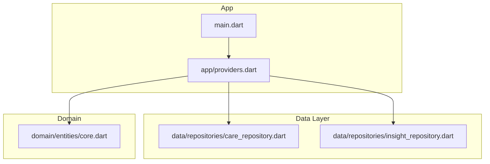
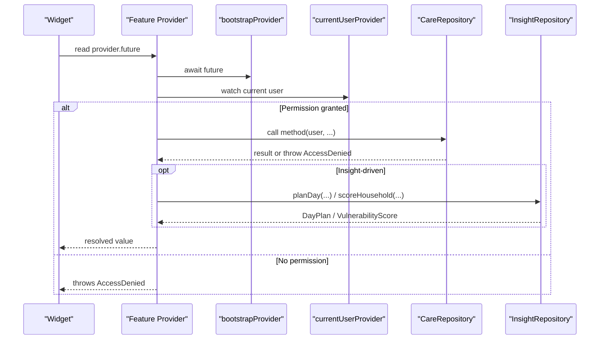
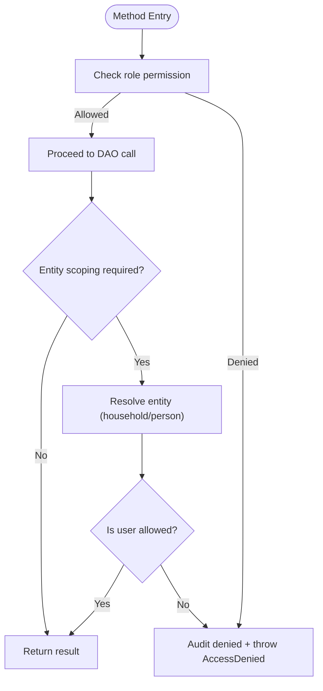
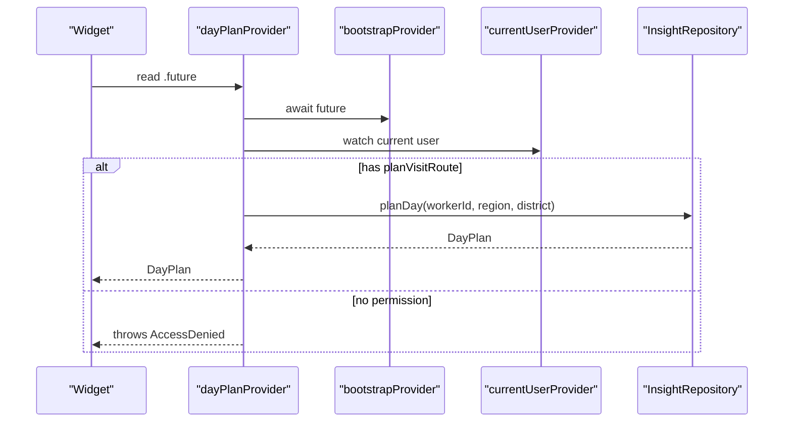
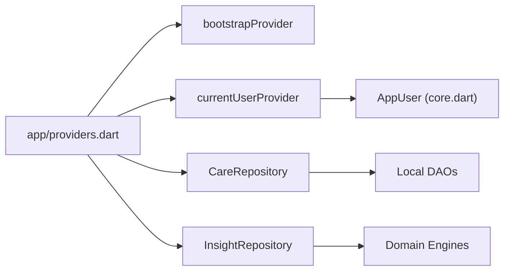

# Repository Providers & Data Access Layer

<cite>
**Referenced Files in This Document**
- [providers.dart](file://lib/app/providers.dart)
- [care_repository.dart](file://lib/data/repositories/care_repository.dart)
- [insight_repository.dart](file://lib/data/repositories/insight_repository.dart)
- [core.dart](file://lib/domain/entities/core.dart)
- [main.dart](file://lib/main.dart)
</cite>

## Table of Contents
1. [Introduction](#introduction)
2. [Project Structure](#project-structure)
3. [Core Components](#core-components)
4. [Architecture Overview](#architecture-overview)
5. [Detailed Component Analysis](#detailed-component-analysis)
6. [Dependency Analysis](#dependency-analysis)
7. [Performance Considerations](#performance-considerations)
8. [Troubleshooting Guide](#troubleshooting-guide)
9. [Conclusion](#conclusion)

## Introduction
This document explains the repository providers and data access layer in CareBridge AI, focusing on how careRepositoryProvider and insightRepositoryProvider deliver scoped, permission-aware access to data. It covers FutureProvider patterns for asynchronous loading, error handling via explicit denials, and caching strategies through Riverpod’s provider lifecycle. It also details how repositories enforce role-based access control (RBAC) and data scoping, with concrete examples from dayPlanProvider, visibleHouseholdsProvider, and householdMembersProvider.

## Project Structure
At a high level:
- The app entry initializes the Riverpod scope and routes.
- A single providers file wires up bootstrapping, session state, and feature-specific providers.
- Repositories encapsulate all data operations behind an RBAC boundary.
- Insight repository orchestrates domain engines over local DAOs to compute scores and plans.



**Diagram sources**
- [main.dart:16-18](file://lib/main.dart#L16-L18)
- [providers.dart:38-42](file://lib/app/providers.dart#L38-L42)
- [providers.dart:46-50](file://lib/app/providers.dart#L46-L50)
- [care_repository.dart:1-26](file://lib/data/repositories/care_repository.dart#L1-L26)
- [insight_repository.dart:1-14](file://lib/data/repositories/insight_repository.dart#L1-L14)
- [core.dart:1-20](file://lib/domain/entities/core.dart#L1-L20)

**Section sources**
- [main.dart:16-18](file://lib/main.dart#L16-L18)
- [providers.dart:38-42](file://lib/app/providers.dart#L38-L42)

## Core Components
- careRepositoryProvider: Exposes a singleton CareRepository used by feature providers to perform permission-checked reads/writes against local DAOs.
- insightRepositoryProvider: Exposes a singleton InsightRepository that assembles inputs from DAOs and runs domain engines (vulnerability, trajectory, barrier forecasting).
- Session and current user providers: Provide the acting AppUser to every provider so permissions can be enforced consistently.

Key responsibilities:
- CareRepository enforces RBAC and per-household/person scoping before any DAO call.
- InsightRepository focuses on performance-critical batched reads and in-memory scoring/ranking.
- Feature providers orchestrate bootstrapping, permission checks, and repository calls, returning FutureProvider values consumed by UI.

**Section sources**
- [providers.dart:46-50](file://lib/app/providers.dart#L46-L50)
- [care_repository.dart:55-110](file://lib/data/repositories/care_repository.dart#L55-L110)
- [insight_repository.dart:120-168](file://lib/data/repositories/insight_repository.dart#L120-L168)
- [providers.dart:125-128](file://lib/app/providers.dart#L125-L128)

## Architecture Overview
The data access architecture separates concerns across three layers:
- Presentation consumes providers (FutureProvider, StreamProvider, NotifierProvider).
- Providers coordinate bootstrapping, session context, and repository calls.
- Repositories enforce RBAC and scoping, delegating to DAOs and domain engines.



**Diagram sources**
- [providers.dart:145-156](file://lib/app/providers.dart#L145-L156)
- [providers.dart:160-165](file://lib/app/providers.dart#L160-L165)
- [care_repository.dart:63-79](file://lib/data/repositories/care_repository.dart#L63-L79)
- [insight_repository.dart:129-168](file://lib/data/repositories/insight_repository.dart#L129-L168)

## Detailed Component Analysis

### CareRepository: RBAC and Scoping
- Centralizes all data operations behind a strict permission gate.
- Enforces two dimensions:
  - Role-based permissions (e.g., viewAllHouseholds, runClinicalAssessment).
  - Entity scoping (household-level and person-level).
- Throws AccessDenied on violations and records denials via audit DAOs.

Key patterns:
- _require(permission, action): Gate writes and sensitive reads; logs denial and throws.
- _requireHouseholdScope(user, householdId, action): Ensures caregivers only access their linked household.
- _requirePersonScope(user, personId, action): Resolves person’s household and delegates to household scope check.

Examples of enforcement:
- visibleHouseholds(user): Branches query based on role; caregivers get only their linked household.
- visitQueue(user, householdId): Requires household scope before returning ordered client list.
- latestAssessment(user, personId): Requires person scope before reading assessment history.



**Diagram sources**
- [care_repository.dart:63-79](file://lib/data/repositories/care_repository.dart#L63-L79)
- [care_repository.dart:86-110](file://lib/data/repositories/care_repository.dart#L86-L110)
- [care_repository.dart:115-126](file://lib/data/repositories/care_repository.dart#L115-L126)

**Section sources**
- [care_repository.dart:55-126](file://lib/data/repositories/care_repository.dart#L55-L126)
- [care_repository.dart:181-193](file://lib/data/repositories/care_repository.dart#L181-L193)
- [care_repository.dart:222-225](file://lib/data/repositories/care_repository.dart#L222-L225)
- [care_repository.dart:401-404](file://lib/data/repositories/care_repository.dart#L401-L404)

### InsightRepository: Batched Reads and Engine Orchestration
- Builds DayPlan and vulnerability scores using batched DAO queries and in-memory processing.
- Minimizes SQLite round trips by grouping reads (households, people, growth, referrals, schedules).
- Delegates pure scoring logic to domain engines (VulnerabilityEngine, TrajectoryEngine, BarrierEngine).

Highlights:
- planDay(workerId, region, district, ...): Batches five core reads, computes per-household scores, sorts by risk and data completeness.
- scoreHousehold(householdId): Reuses same input assembly as planDay to ensure consistency between ranking and detail views.
- decliningChildren(): Analyzes growth trajectories to identify deteriorating children, ordered by urgency.

```mermaid
classDiagram
class InsightRepository {
+planDay(workerId, region, district, community, month) DayPlan
+scoreHousehold(householdId) VulnerabilityScore
+trajectory(personId) TrajectoryResult
+decliningChildren() List<(Person, TrajectoryResult)>
+forecastBarriers(...) BarrierForecast
+zonePatterns(withinDays) List<BarrierPattern>
+referralCompletion(withinDays) ({issued,arrived,rate})
}
class HouseholdPriority {
+Household household
+VulnerabilityScore score
+Person[] members
+Person? mother
+int? daysSinceLastVisit
+Referral? openReferral
+ScheduledContact? nextContactDue
+band VulnerabilityBand
+reason String
+childCount int
}
class DayPlan {
+HouseholdPriority[] priorities
+ScheduledContact[] dueContacts
+ScheduledContact[] overdueContacts
+Referral[] chaseReferrals
+DateTime generatedAt
+critical HouseholdPriority[]
+high HouseholdPriority[]
+isEmpty bool
+headline String
}
InsightRepository --> HouseholdPriority : "creates"
InsightRepository --> DayPlan : "returns"
```

**Diagram sources**
- [insight_repository.dart:120-168](file://lib/data/repositories/insight_repository.dart#L120-L168)
- [insight_repository.dart:274-331](file://lib/data/repositories/insight_repository.dart#L274-L331)
- [insight_repository.dart:337-365](file://lib/data/repositories/insight_repository.dart#L337-L365)
- [insight_repository.dart:30-63](file://lib/data/repositories/insight_repository.dart#L30-L63)
- [insight_repository.dart:67-118](file://lib/data/repositories/insight_repository.dart#L67-L118)

**Section sources**
- [insight_repository.dart:129-168](file://lib/data/repositories/insight_repository.dart#L129-L168)
- [insight_repository.dart:274-331](file://lib/data/repositories/insight_repository.dart#L274-L331)
- [insight_repository.dart:337-365](file://lib/data/repositories/insight_repository.dart#L337-L365)

### Providers: FutureProvider Patterns, Caching, and Error Handling
- bootstrapProvider: Initializes database, seeds demo data, starts sync service; other providers wait on its future.
- careRepositoryProvider and insightRepositoryProvider: Singleton providers for repositories.
- currentUserProvider: Derives the signed-in user from session state.
- Feature providers use FutureProvider.family for parameterized reads and standard FutureProvider for global reads.

Common patterns:
- Await bootstrapProvider.future to ensure DB and sync are ready.
- Watch currentUserProvider to obtain the acting user.
- Call repository methods with the user to enforce RBAC/scoping.
- Throw AccessDenied when permissions are missing; consumers handle errors accordingly.
- Rely on Riverpod’s caching: providers cache results until dependencies change, avoiding redundant work.

Examples:
- dayPlanProvider: Checks planVisitRoute permission, then calls InsightRepository.planDay.
- visibleHouseholdsProvider: Returns households visible to the current user via CareRepository.visibleHouseholds.
- householdMembersProvider: Returns visit queue for a household after verifying user context.



**Diagram sources**
- [providers.dart:145-156](file://lib/app/providers.dart#L145-L156)
- [providers.dart:38-42](file://lib/app/providers.dart#L38-L42)
- [providers.dart:125-128](file://lib/app/providers.dart#L125-L128)
- [insight_repository.dart:129-168](file://lib/data/repositories/insight_repository.dart#L129-L168)

**Section sources**
- [providers.dart:38-42](file://lib/app/providers.dart#L38-L42)
- [providers.dart:46-50](file://lib/app/providers.dart#L46-L50)
- [providers.dart:125-128](file://lib/app/providers.dart#L125-L128)
- [providers.dart:145-156](file://lib/app/providers.dart#L145-L156)
- [providers.dart:160-165](file://lib/app/providers.dart#L160-L165)
- [providers.dart:169-176](file://lib/app/providers.dart#L169-L176)

### Feature-Specific Providers: Examples and Patterns
- dayPlanProvider: Computes a ranked day plan for the worker’s zone, gated by planVisitRoute.
- visibleHouseholdsProvider: Returns households the user may see, leveraging role-specific queries in CareRepository.
- householdMembersProvider: Returns visit queue for a specific household, enforcing household scope via repository.
- householdScoreProvider: Ensures permission via CareRepository.household before computing vulnerability score.
- latestAssessmentProvider: Fetches last assessment for a person with person-scoped checks.

These providers demonstrate:
- Dependency on bootstrapProvider to ensure readiness.
- Use of currentUserProvider to derive permissions.
- Direct delegation to repositories for data access and scoping.
- Consistent error handling via AccessDenied exceptions.

**Section sources**
- [providers.dart:145-156](file://lib/app/providers.dart#L145-L156)
- [providers.dart:160-165](file://lib/app/providers.dart#L160-L165)
- [providers.dart:169-176](file://lib/app/providers.dart#L169-L176)
- [providers.dart:194-202](file://lib/app/providers.dart#L194-L202)
- [providers.dart:207-212](file://lib/app/providers.dart#L207-L212)

## Dependency Analysis
Providers depend on:
- bootstrapProvider for initialization.
- currentUserProvider for session context.
- careRepositoryProvider and insightRepositoryProvider for data access.
- Domain entities (AppUser) for permission checks.

Repositories depend on:
- Local DAOs for persistence.
- Domain engines for scoring and analysis.



**Diagram sources**
- [providers.dart:38-42](file://lib/app/providers.dart#L38-L42)
- [providers.dart:125-128](file://lib/app/providers.dart#L125-L128)
- [providers.dart:46-50](file://lib/app/providers.dart#L46-L50)
- [core.dart:1-20](file://lib/domain/entities/core.dart#L1-L20)

**Section sources**
- [providers.dart:38-42](file://lib/app/providers.dart#L38-L42)
- [providers.dart:46-50](file://lib/app/providers.dart#L46-L50)
- [providers.dart:125-128](file://lib/app/providers.dart#L125-L128)

## Performance Considerations
- Batched reads: InsightRepository batches multiple DAO queries to minimize SQLite round trips, crucial for low-end devices.
- In-memory scoring: Ranking and analysis occur in Dart over loaded data, reducing latency during scrolling and interactions.
- Provider caching: Riverpod caches provider results until dependencies change, preventing repeated computations.
- Early returns: Providers return empty collections when users are not authenticated, avoiding unnecessary work.

[No sources needed since this section provides general guidance]

## Troubleshooting Guide
Common issues and resolutions:
- AccessDenied thrown by providers: Indicates missing permissions or scoping violations. Verify user role and entity linkage.
- Empty lists returned: May indicate no linked household for caregivers or insufficient permissions. Confirm session state and user context.
- Stale data: Ensure bootstrapProvider has completed and providers are re-evaluated when dependencies change.
- Sync status: Use syncStatusProvider to monitor offline/online states and adjust UI accordingly.

**Section sources**
- [care_repository.dart:63-79](file://lib/data/repositories/care_repository.dart#L63-L79)
- [providers.dart:145-156](file://lib/app/providers.dart#L145-L156)
- [providers.dart:60-64](file://lib/app/providers.dart#L60-L64)

## Conclusion
The repository providers in CareBridge AI establish a robust, permission-aware data access layer. CareRepository enforces RBAC and scoping at the data boundary, while InsightRepository optimizes performance through batched reads and in-memory scoring. Providers leverage FutureProvider patterns for async loading, consistent error handling, and efficient caching. This architecture ensures security, reliability, and responsiveness in resource-constrained environments.

[No sources needed since this section summarizes without analyzing specific files]