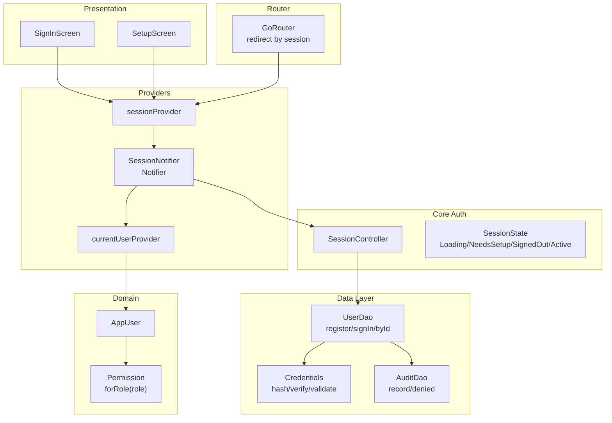
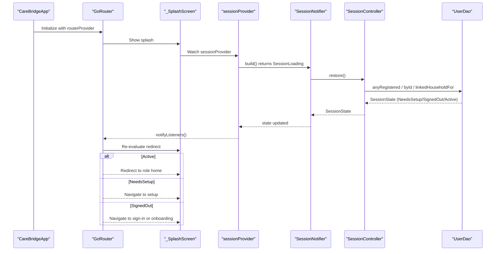
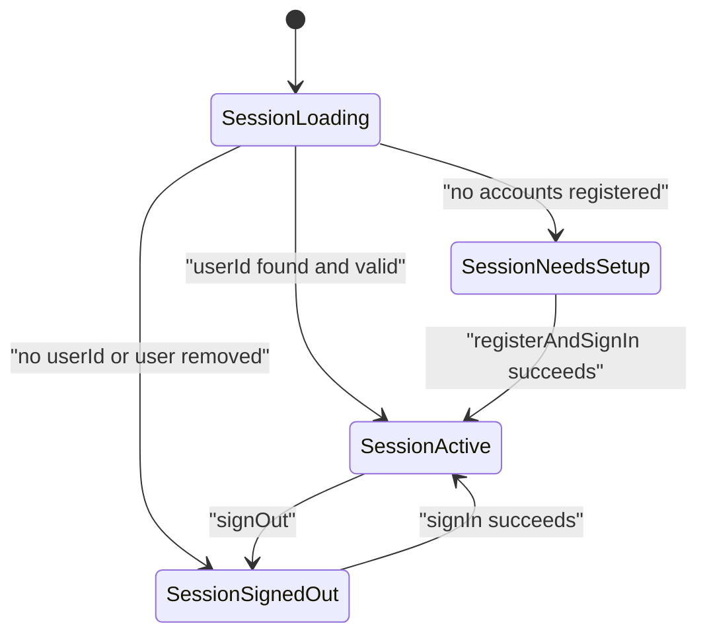
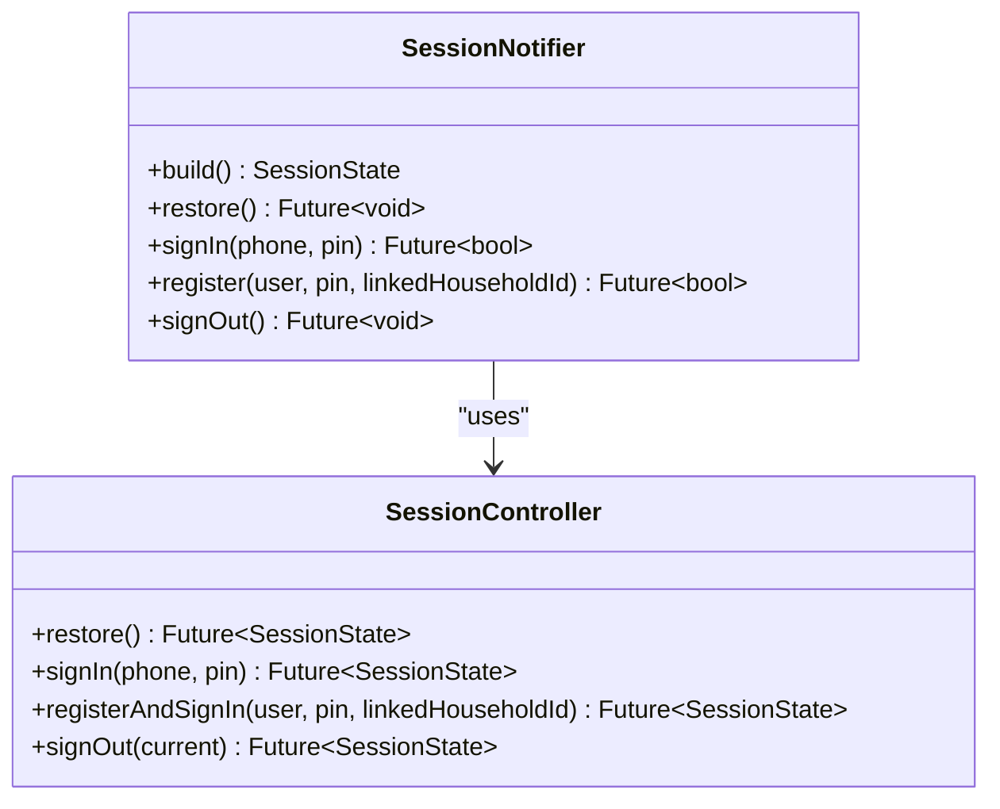
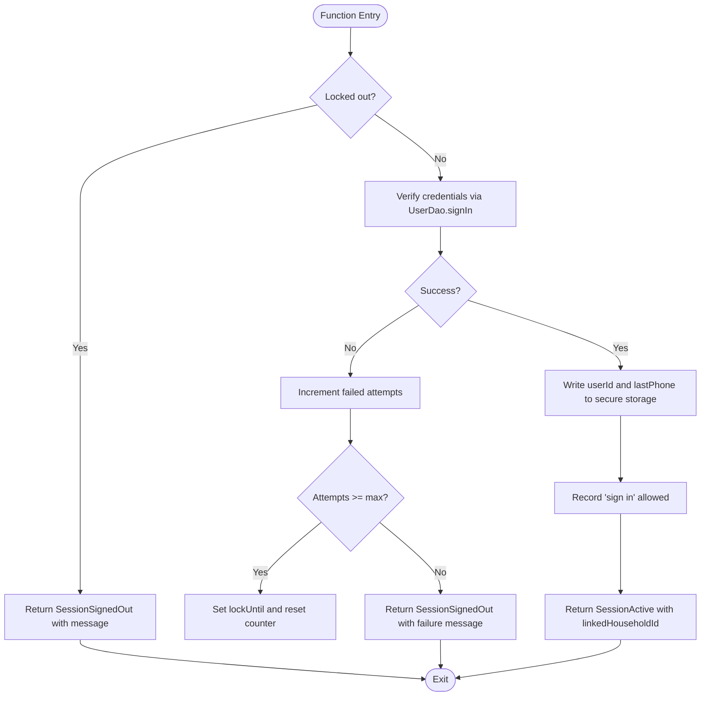
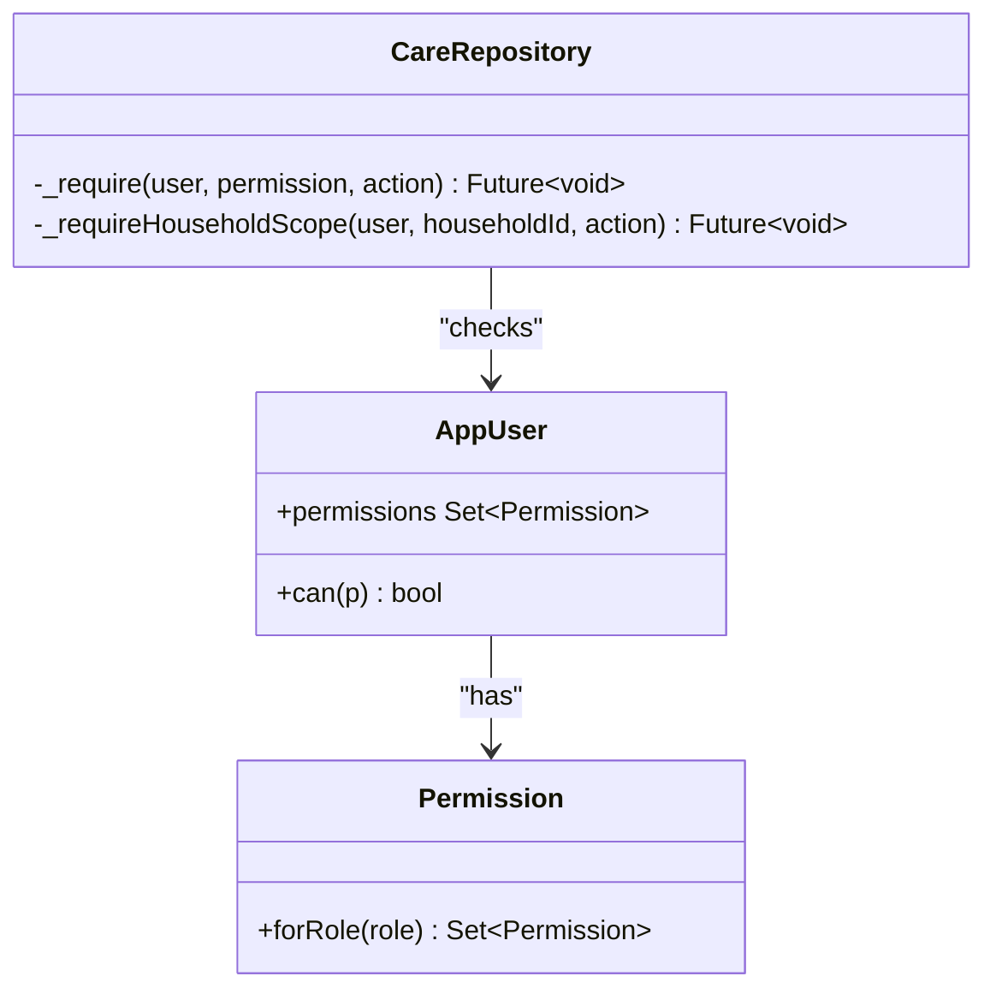
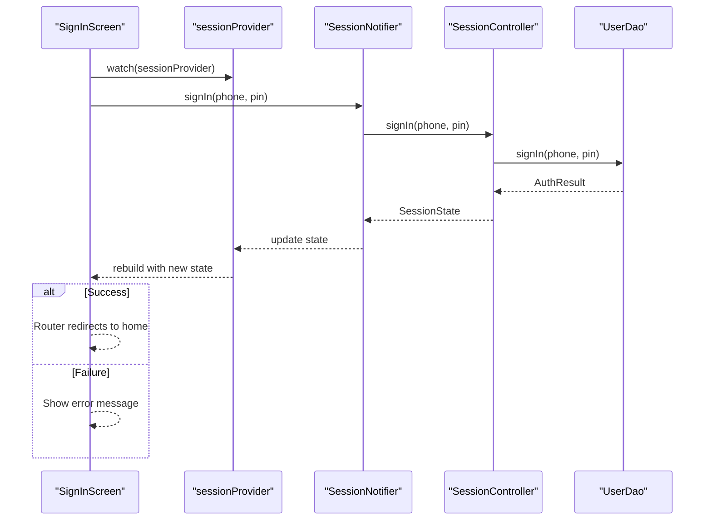
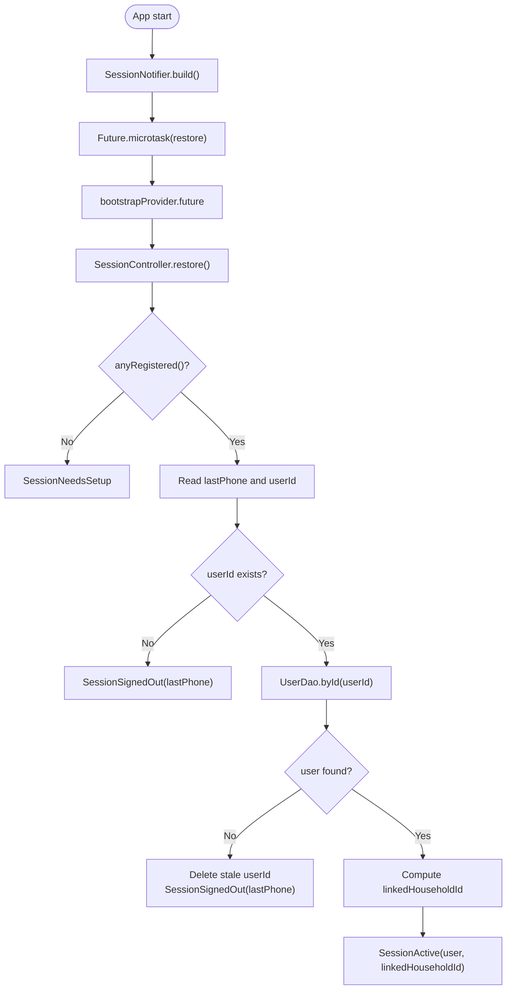
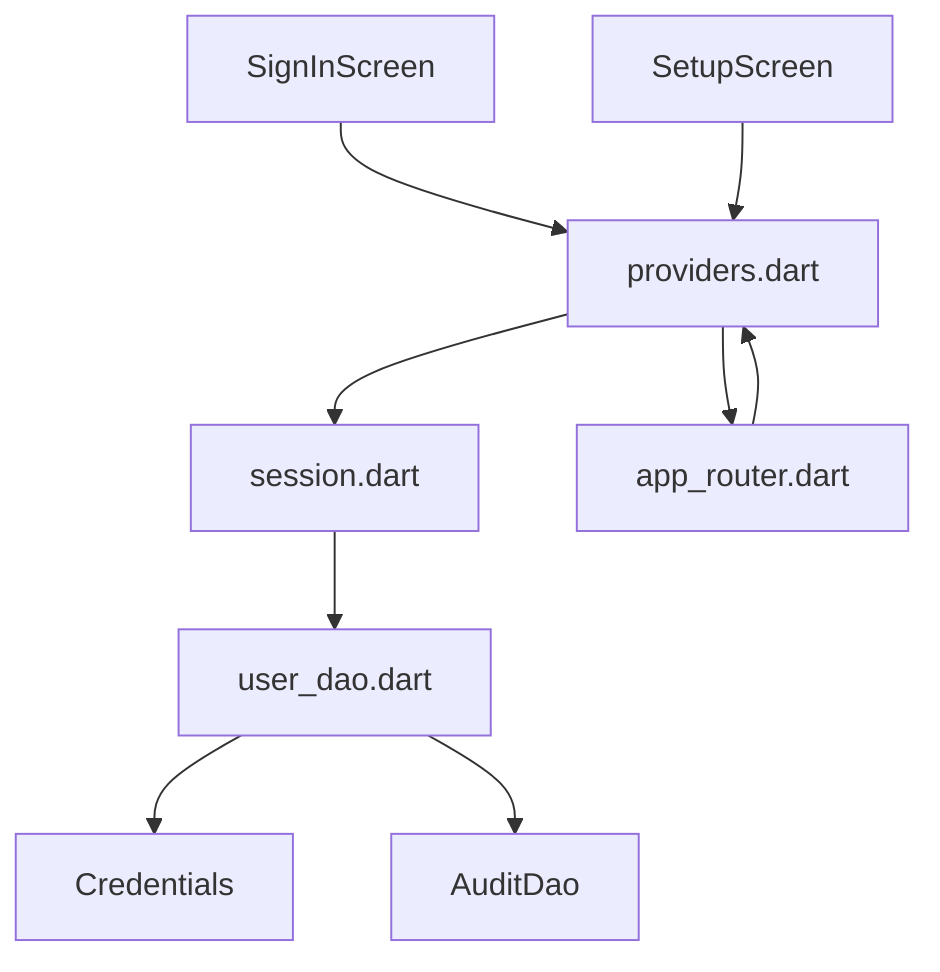

# Session Management & Authentication State

<cite>
**Referenced Files in This Document**
- [main.dart](file://lib/main.dart)
- [providers.dart](file://lib/app/providers.dart)
- [session.dart](file://lib/core/auth/session.dart)
- [app_router.dart](file://lib/core/router/app_router.dart)
- [user_dao.dart](file://lib/data/local/user_dao.dart)
- [care_repository.dart](file://lib/data/repositories/care_repository.dart)
- [core.dart](file://lib/domain/entities/core.dart)
- [enums.dart](file://lib/domain/enums.dart)
- [sign_in_screen.dart](file://lib/presentation/auth/sign_in_screen.dart)
- [setup_screen.dart](file://lib/presentation/auth/setup_screen.dart)
</cite>

## Table of Contents
1. [Introduction](#introduction)
2. [Project Structure](#project-structure)
3. [Core Components](#core-components)
4. [Architecture Overview](#architecture-overview)
5. [Detailed Component Analysis](#detailed-component-analysis)
6. [Dependency Analysis](#dependency-analysis)
7. [Performance Considerations](#performance-considerations)
8. [Troubleshooting Guide](#troubleshooting-guide)
9. [Conclusion](#conclusion)

## Introduction
This document explains how session management and authentication state are implemented using Riverpod’s Notifier pattern. It covers the SessionNotifier lifecycle (restore, signIn, register, signOut), the SessionState sealed hierarchy and transitions, role-based access control integration with session state, and how screens consume session state. It also addresses persistence across app restarts and security considerations for PIN-based authentication.

## Project Structure
The session system spans several layers:
- Presentation: screens that read session state and trigger actions.
- Providers: Riverpod wiring that exposes the session state and controller.
- Core auth: SessionState types and SessionController responsible for persistence and flow.
- Data layer: DAOs for user storage, credential hashing, and audit logging.
- Domain: User model and permissions.
- Router: Redirects based on session state and permission checks.

**Diagram sources**
- [providers.dart:67-122](file://lib/app/providers.dart#L67-L122)
- [session.dart:28-68](file://lib/core/auth/session.dart#L28-L68)
- [user_dao.dart:117-200](file://lib/data/local/user_dao.dart#L117-L200)
- [core.dart:1-48](file://lib/domain/entities/core.dart#L1-L48)
- [enums.dart:10-66](file://lib/domain/enums.dart#L10-L66)
- [app_router.dart:50-70](file://lib/core/router/app_router.dart#L50-L70)

**Section sources**
- [main.dart:16-34](file://lib/main.dart#L16-L34)
- [providers.dart:67-122](file://lib/app/providers.dart#L67-L122)
- [session.dart:28-68](file://lib/core/auth/session.dart#L28-L68)
- [app_router.dart:50-70](file://lib/core/router/app_router.dart#L50-L70)

## Core Components
- SessionState: Sealed hierarchy representing loading, setup, signed-out, and active sessions. Active carries the current AppUser and optional household scope for caregivers.
- SessionNotifier: Riverpod Notifier exposing restore, signIn, register, and signOut; starts in Loading while restoration runs asynchronously.
- SessionController: Orchestrates persistence via secure storage, DAO calls, lockout logic, and audit logging.
- currentUserProvider: Derived provider returning the current AppUser when active.
- Permission model: Role-based permissions determine what a user can do; enforced at repository and router levels.

Key responsibilities:
- SessionNotifier bridges UI to SessionController and updates global session state.
- SessionController manages restore/sign-in/register/sign-out flows, secure storage, and lockout counters.
- UserDao handles user registration, sign-in verification, and lookup.
- Credentials provides PBKDF2-style hashing and validation for PINs.
- AuditDao records allowed/denied actions for accountability.

**Section sources**
- [session.dart:28-68](file://lib/core/auth/session.dart#L28-L68)
- [providers.dart:77-122](file://lib/app/providers.dart#L77-L122)
- [session.dart:69-245](file://lib/core/auth/session.dart#L69-L245)
- [user_dao.dart:117-200](file://lib/data/local/user_dao.dart#L117-L200)
- [core.dart:1-48](file://lib/domain/entities/core.dart#L1-L48)
- [enums.dart:10-66](file://lib/domain/enums.dart#L10-L66)

## Architecture Overview
The app bootstraps providers, then uses a router that reacts to session changes. The splash screen waits until session leaves Loading before routing to setup, sign-in, or home based on state.

**Diagram sources**
- [app_router.dart:176-257](file://lib/core/router/app_router.dart#L176-L257)
- [providers.dart:77-92](file://lib/app/providers.dart#L77-L92)
- [session.dart:97-112](file://lib/core/auth/session.dart#L97-L112)

**Section sources**
- [main.dart:16-34](file://lib/main.dart#L16-L34)
- [app_router.dart:176-257](file://lib/core/router/app_router.dart#L176-L257)
- [providers.dart:77-92](file://lib/app/providers.dart#L77-L92)

## Detailed Component Analysis

### SessionState and Transitions
- SessionLoading: Initial state while restoring from secure storage and database.
- SessionNeedsSetup: First-run device without any registered account.
- SessionSignedOut: No active session; may include last phone and message.
- SessionActive: Valid session with AppUser and optional linkedHouseholdId for caregivers.

Transitions:
- App start: SessionLoading -> (restore) -> SessionNeedsSetup | SessionSignedOut | SessionActive
- Sign-in success: SessionSignedOut -> SessionActive
- Register + sign-in: SessionNeedsSetup -> SessionActive
- Sign-out: SessionActive -> SessionSignedOut

**Diagram sources**
- [session.dart:28-68](file://lib/core/auth/session.dart#L28-L68)
- [providers.dart:77-122](file://lib/app/providers.dart#L77-L122)
- [session.dart:97-206](file://lib/core/auth/session.dart#L97-L206)

**Section sources**
- [session.dart:28-68](file://lib/core/auth/session.dart#L28-L68)
- [providers.dart:77-122](file://lib/app/providers.dart#L77-L122)

### SessionNotifier Implementation
- build(): Starts restoration asynchronously and returns SessionLoading immediately.
- restore(): Waits for bootstrap, then delegates to SessionController.restore().
- signIn(phone, pin): Delegates to SessionController.signIn(), returns boolean indicating success.
- register(user, pin, linkedHouseholdId): Delegates to SessionController.registerAndSignIn().
- signOut(): Persists audit, clears secure storage, resets lockout, returns SessionSignedOut.

**Diagram sources**
- [providers.dart:77-122](file://lib/app/providers.dart#L77-L122)
- [session.dart:69-245](file://lib/core/auth/session.dart#L69-L245)

**Section sources**
- [providers.dart:77-122](file://lib/app/providers.dart#L77-L122)
- [session.dart:69-245](file://lib/core/auth/session.dart#L69-L245)

### SessionController Operations
- restore(): Determines initial screen by checking registrations, reading last phone and userId, resolving user, and computing linked household for caregivers.
- signIn(): Enforces lockout, verifies credentials, updates secure storage, audits, and sets active session with linked household.
- registerAndSignIn(): Creates user with hashed PIN, persists identifiers, audits, and sets active session.
- signOut(): Audits if user present, clears userId, resets lockout, returns signed-out state with last phone.

**Diagram sources**
- [session.dart:114-162](file://lib/core/auth/session.dart#L114-L162)
- [user_dao.dart:169-216](file://lib/data/local/user_dao.dart#L169-L216)

**Section sources**
- [session.dart:97-206](file://lib/core/auth/session.dart#L97-L206)
- [user_dao.dart:169-216](file://lib/data/local/user_dao.dart#L169-L216)

### Role-Based Access Control Integration
- AppUser.permissions derived from UserRole via Permission.forRole.
- SessionActive exposes convenience flags isFhw/isCaregiver and can(permission).
- Repositories enforce permissions via _require and _requireHouseholdScope, auditing denials and throwing AccessDenied.
- Router guards pages with permission checks and shows AccessDenied view when insufficient.

**Diagram sources**
- [core.dart:1-48](file://lib/domain/entities/core.dart#L1-L48)
- [enums.dart:10-66](file://lib/domain/enums.dart#L10-L66)
- [care_repository.dart:59-102](file://lib/data/repositories/care_repository.dart#L59-L102)

**Section sources**
- [core.dart:1-48](file://lib/domain/entities/core.dart#L1-L48)
- [enums.dart:10-66](file://lib/domain/enums.dart#L10-L66)
- [care_repository.dart:59-102](file://lib/data/repositories/care_repository.dart#L59-L102)

### Screens Consuming Session State
- SignInScreen watches sessionProvider, pre-fills last phone, validates inputs, calls notifier.signIn, and displays messages from SessionSignedOut.
- SetupScreen guides first-run registration and triggers registerAndSignIn.
- Router redirects based on session state and permissions.

**Diagram sources**
- [sign_in_screen.dart:43-74](file://lib/presentation/auth/sign_in_screen.dart#L43-L74)
- [providers.dart:94-97](file://lib/app/providers.dart#L94-L97)
- [session.dart:114-162](file://lib/core/auth/session.dart#L114-L162)

**Section sources**
- [sign_in_screen.dart:43-74](file://lib/presentation/auth/sign_in_screen.dart#L43-L74)
- [setup_screen.dart:29-74](file://lib/presentation/auth/setup_screen.dart#L29-L74)
- [app_router.dart:176-257](file://lib/core/router/app_router.dart#L176-L257)

### Session Persistence and Restoration
- Secure storage keys: user id and last phone.
- Restore reads these keys, resolves user, and computes linked household for caregivers.
- On failures (secure storage unavailable), operations degrade gracefully to non-persistent behavior.

**Diagram sources**
- [providers.dart:77-92](file://lib/app/providers.dart#L77-L92)
- [session.dart:97-112](file://lib/core/auth/session.dart#L97-L112)

**Section sources**
- [session.dart:97-112](file://lib/core/auth/session.dart#L97-L112)
- [session.dart:221-243](file://lib/core/auth/session.dart#L221-L243)

### Security Considerations for PIN-Based Authentication
- PINs are never stored; only salt and hash are persisted.
- Hashing uses PBKDF2-style iteration to resist offline attacks.
- Validation rejects weak PINs (repeated digits, sequences).
- Constant-time comparison avoids timing leaks.
- Lockout is per-device and in-memory to prevent idle guessing.
- Audit logs record all sign-ins and permission denials.

**Section sources**
- [user_dao.dart:44-93](file://lib/data/local/user_dao.dart#L44-L93)
- [user_dao.dart:169-216](file://lib/data/local/user_dao.dart#L169-L216)
- [session.dart:78-94](file://lib/core/auth/session.dart#L78-L94)

## Dependency Analysis
The session subsystem has clear boundaries:
- Presentations depend on providers.
- Providers depend on core auth and domain models.
- Core auth depends on data layer DAOs.
- Router depends on providers for redirection.

**Diagram sources**
- [providers.dart:67-122](file://lib/app/providers.dart#L67-L122)
- [session.dart:69-245](file://lib/core/auth/session.dart#L69-L245)
- [user_dao.dart:117-200](file://lib/data/local/user_dao.dart#L117-L200)
- [app_router.dart:50-70](file://lib/core/router/app_router.dart#L50-L70)

**Section sources**
- [providers.dart:67-122](file://lib/app/providers.dart#L67-L122)
- [session.dart:69-245](file://lib/core/auth/session.dart#L69-L245)
- [user_dao.dart:117-200](file://lib/data/local/user_dao.dart#L117-L200)
- [app_router.dart:50-70](file://lib/core/router/app_router.dart#L50-L70)

## Performance Considerations
- SessionNotifier defers heavy work to microtasks and future providers to avoid blocking UI.
- Secure storage operations are wrapped with try/catch to prevent crashes on unreliable environments.
- Repository-level permission checks minimize redundant queries by scoping early.
- Audit logging is best-effort to avoid impacting critical paths.

[No sources needed since this section provides general guidance]

## Troubleshooting Guide
Common issues and resolutions:
- Stuck on splash: Ensure bootstrapProvider completes and sessionProvider updates; check secure storage availability.
- Sign-in fails repeatedly: Review lockout counters and messages from SessionSignedOut; verify credentials and DAO results.
- Permission denied: Confirm user role and permissions; check repository guards and audit logs for denials.
- Registration not remembered: Validate secure storage writes and restore logic; ensure no exceptions during write/delete.

**Section sources**
- [app_router.dart:176-257](file://lib/core/router/app_router.dart#L176-L257)
- [session.dart:114-162](file://lib/core/auth/session.dart#L114-L162)
- [care_repository.dart:59-102](file://lib/data/repositories/care_repository.dart#L59-L102)
- [user_dao.dart:388-456](file://lib/data/local/user_dao.dart#L388-L456)

## Conclusion
The session management system leverages Riverpod’s Notifier pattern to provide a robust, testable, and secure authentication flow. SessionState encapsulates all possible states, while SessionNotifier and SessionController coordinate persistence, restoration, and user interactions. Role-based permissions are enforced consistently across repositories and routers, ensuring data protection in shared-device environments. PIN-based security balances usability and safety through hashing, validation, and lockout mechanisms.

[No sources needed since this section summarizes without analyzing specific files]