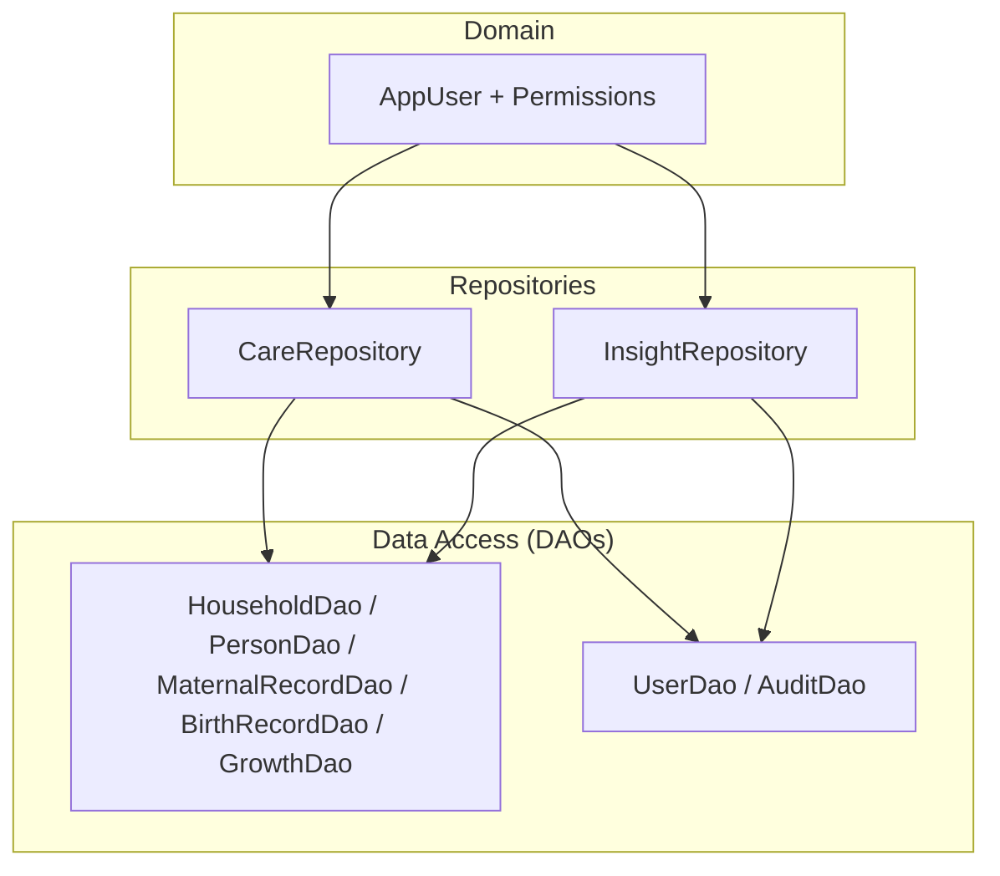
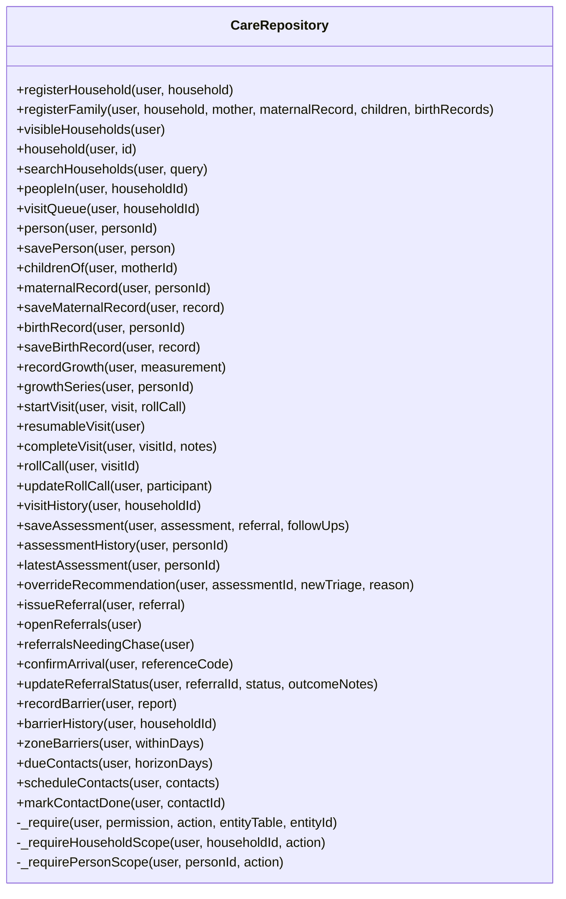
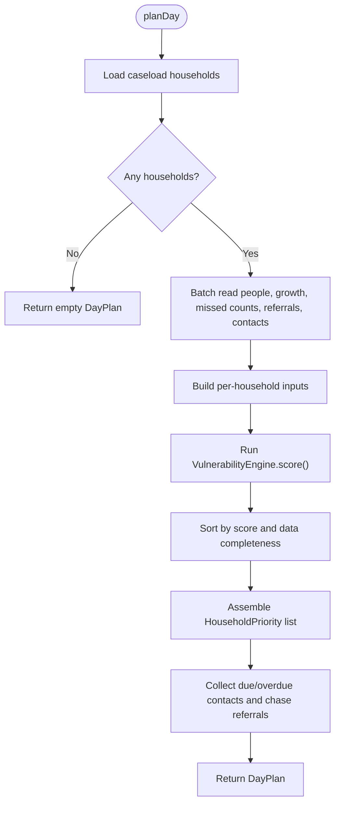
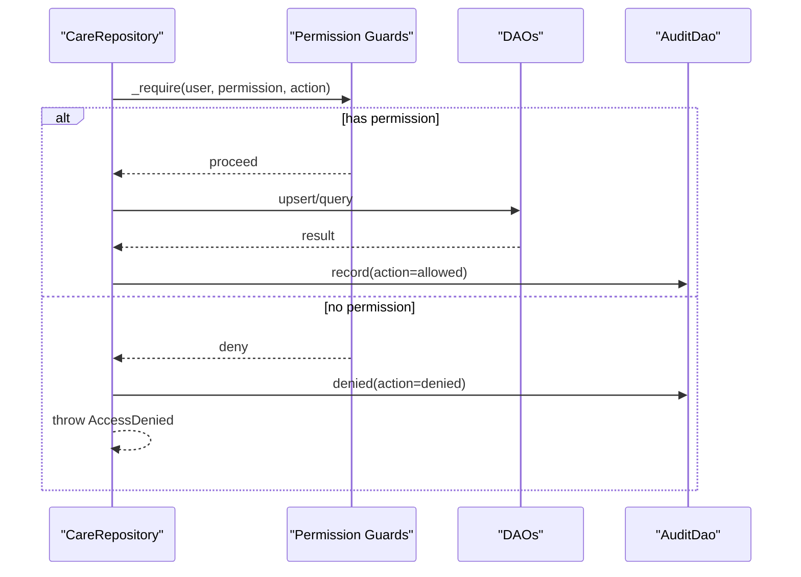
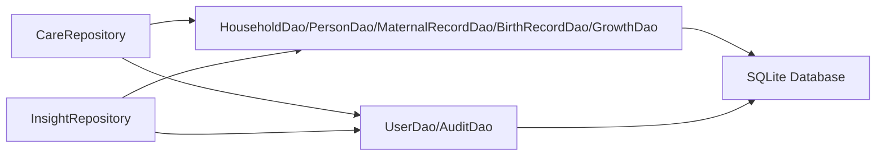

# Repository Pattern Implementation

<cite>
**Referenced Files in This Document**
- [care_repository.dart](file://lib/data/repositories/care_repository.dart)
- [insight_repository.dart](file://lib/data/repositories/insight_repository.dart)
- [household_dao.dart](file://lib/data/local/household_dao.dart)
- [user_dao.dart](file://lib/data/local/user_dao.dart)
- [core.dart](file://lib/domain/entities/core.dart)
- [rbac_test.dart](file://test/rbac_test.dart)
</cite>

## Table of Contents
1. [Introduction](#introduction)
2. [Project Structure](#project-structure)
3. [Core Components](#core-components)
4. [Architecture Overview](#architecture-overview)
5. [Detailed Component Analysis](#detailed-component-analysis)
6. [Dependency Analysis](#dependency-analysis)
7. [Performance Considerations](#performance-considerations)
8. [Troubleshooting Guide](#troubleshooting-guide)
9. [Conclusion](#conclusion)
10. [Appendices](#appendices)

## Introduction
This document explains CareBridge AI’s repository pattern implementation, focusing on how CareRepository and InsightRepository abstract data access while enforcing role-based permissions and scope constraints. It details repository methods for household management, patient records, assessments, referrals, and insights generation. It also covers CRUD operations, validation, business rules, DAO integration, permission checks before data access, consistency across roles and scopes, and testing strategies with mocking patterns.

## Project Structure
The repository layer sits between the presentation/domain layers and the local data access objects (DAOs). Repositories enforce permissions and scoping; DAOs perform database operations and enqueue sync tasks. The domain layer provides entities and enums used by both repositories and DAOs.

**Diagram sources**
- [care_repository.dart:55-127](file://lib/data/repositories/care_repository.dart#L55-L127)
- [insight_repository.dart:120-168](file://lib/data/repositories/insight_repository.dart#L120-L168)
- [household_dao.dart:22-162](file://lib/data/local/household_dao.dart#L22-L162)
- [user_dao.dart:117-167](file://lib/data/local/user_dao.dart#L117-L167)
- [core.dart:6-40](file://lib/domain/entities/core.dart#L6-L40)

**Section sources**
- [care_repository.dart:1-26](file://lib/data/repositories/care_repository.dart#L1-L26)
- [insight_repository.dart:1-14](file://lib/data/repositories/insight_repository.dart#L1-L14)
- [household_dao.dart:1-21](file://lib/data/local/household_dao.dart#L1-L21)
- [user_dao.dart:1-26](file://lib/data/local/user_dao.dart#L1-L26)
- [core.dart:1-40](file://lib/domain/entities/core.dart#L1-L40)

## Core Components
- CareRepository: Centralized gateway to all record operations. Every method requires an acting AppUser and enforces Permission checks via internal guards. It also enforces caregiver scoping to a single linked household and logs denials.
- InsightRepository: Aggregates data from multiple DAOs to compute vulnerability scores, day plans, growth trajectories, barrier forecasts, and referral completion metrics. It orchestrates batched reads and in-memory ranking to ensure performance on low-end devices.

Key responsibilities:
- Role-based access control (RBAC) enforcement at the repository boundary
- Scope enforcement for caregivers vs. frontline health workers (FHW)
- Transactional writes through DAOs with outbox queuing
- Business rule validation (e.g., minimum reason length for overrides)
- Auditing of allowed/denied actions

**Section sources**
- [care_repository.dart:55-127](file://lib/data/repositories/care_repository.dart#L55-L127)
- [insight_repository.dart:120-168](file://lib/data/repositories/insight_repository.dart#L120-L168)

## Architecture Overview
The architecture separates concerns clearly:
- Presentation calls repositories with the current AppUser
- Repositories validate permissions and scope, then delegate to DAOs
- DAOs execute SQL transactions and enqueue sync tasks
- Domain entities and enums define data models and permissions

```mermaid
sequenceDiagram
participant UI as "UI Layer"
participant Repo as "CareRepository"
participant Guard as "_require/_requireHouseholdScope"
participant DAO as "HouseholdDao/UserDao/AuditDao"
UI->>Repo : registerFamily(user, household, mother, children, birthRecords)
Repo->>Guard : _require(user, Permission.registerHousehold)
alt permitted
Guard-->>Repo : allow
Repo->>DAO : PersonDao.registerFamily(...)
DAO-->>Repo : success
Repo->>DAO : AuditDao.record(...)
Repo-->>UI : completed
else denied
Guard-->>Repo : deny
Repo->>DAO : AuditDao.denied(...)
Repo-->>UI : throw AccessDenied
end
```

**Diagram sources**
- [care_repository.dart:148-174](file://lib/data/repositories/care_repository.dart#L148-L174)
- [care_repository.dart:63-79](file://lib/data/repositories/care_repository.dart#L63-L79)
- [household_dao.dart:191-281](file://lib/data/local/household_dao.dart#L191-L281)
- [user_dao.dart:382-433](file://lib/data/local/user_dao.dart#L382-L433)

## Detailed Component Analysis

### CareRepository: RBAC and Scoping
- Permission gates:
  - Household registration and family registration require registerHousehold
  - Clinical measurements require recordClinicalVitals
  - Assessments require runClinicalAssessment; issuing referrals requires issueReferral; confirming arrivals requires confirmReferralArrival; overriding recommendations requires overrideAiRecommendation
- Scope enforcement:
  - Caregivers can only access their linked household; FHWs have zone-wide access
  - Person-level reads resolve person.householdId and enforce household scope
- Validation and business rules:
  - Override recommendation requires a minimum-length clinical reason
  - Denials are audited and surfaced via AccessDenied exception
- CRUD operations:
  - Upserts for households, persons, maternal/birth records, growth measurements
  - Batched or atomic writes where needed (e.g., registerFamily)
- Integration with DAOs:
  - HouseholdDao, PersonDao, MaternalRecordDao, BirthRecordDao, GrowthDao, VisitDao, ReferralDao, ScheduleDao, BarrierDao
  - AuditDao for logging allowed/denied actions

**Diagram sources**
- [care_repository.dart:55-604](file://lib/data/repositories/care_repository.dart#L55-L604)

**Section sources**
- [care_repository.dart:55-127](file://lib/data/repositories/care_repository.dart#L55-L127)
- [care_repository.dart:132-207](file://lib/data/repositories/care_repository.dart#L132-L207)
- [care_repository.dart:213-240](file://lib/data/repositories/care_repository.dart#L213-L240)
- [care_repository.dart:246-302](file://lib/data/repositories/care_repository.dart#L246-L302)
- [care_repository.dart:308-338](file://lib/data/repositories/care_repository.dart#L308-L338)
- [care_repository.dart:350-441](file://lib/data/repositories/care_repository.dart#L350-L441)
- [care_repository.dart:447-515](file://lib/data/repositories/care_repository.dart#L447-L515)
- [care_repository.dart:527-563](file://lib/data/repositories/care_repository.dart#L527-L563)
- [care_repository.dart:569-603](file://lib/data/repositories/care_repository.dart#L569-L603)

### InsightRepository: Data Orchestration and Scoring
- Day plan generation:
  - Batched reads for households, people, growth, missed counts, open referrals, due/overdue contacts
  - In-memory scoring using VulnerabilityEngine and sorting by score and data completeness
- Household scoring:
  - Computes VulnerabilityScore per household with consistent inputs as the day plan
- Growth trajectory:
  - Analyzes series via TrajectoryEngine to detect deteriorating trends
- Barrier forecasting:
  - Predicts barriers to care using BarrierEngine with contextual inputs
- Zone patterns and referral completion:
  - Aggregates barrier reports and referral stats to produce actionable insights

**Diagram sources**
- [insight_repository.dart:129-268](file://lib/data/repositories/insight_repository.dart#L129-L268)

**Section sources**
- [insight_repository.dart:120-168](file://lib/data/repositories/insight_repository.dart#L120-L168)
- [insight_repository.dart:274-331](file://lib/data/repositories/insight_repository.dart#L274-L331)
- [insight_repository.dart:337-365](file://lib/data/repositories/insight_repository.dart#L337-L365)
- [insight_repository.dart:372-416](file://lib/data/repositories/insight_repository.dart#L372-L416)
- [insight_repository.dart:420-426](file://lib/data/repositories/insight_repository.dart#L420-L426)

### DAO Integration and Permission Checks
- Permission checks occur before any DAO call via _require and scoped checks via _requireHouseholdScope/_requirePersonScope
- DAOs encapsulate SQL operations and enqueue sync tasks ensuring offline-first consistency
- AuditDao records allowed/denied actions, including denials for unauthorized access

**Diagram sources**
- [care_repository.dart:63-79](file://lib/data/repositories/care_repository.dart#L63-L79)
- [user_dao.dart:382-433](file://lib/data/local/user_dao.dart#L382-L433)

**Section sources**
- [household_dao.dart:22-41](file://lib/data/local/household_dao.dart#L22-L41)
- [household_dao.dart:191-281](file://lib/data/local/household_dao.dart#L191-L281)
- [user_dao.dart:117-167](file://lib/data/local/user_dao.dart#L117-L167)
- [user_dao.dart:382-433](file://lib/data/local/user_dao.dart#L382-L433)

### Data Consistency Across Roles and Scopes
- Caregiver scope is enforced by linking each account to exactly one household at registration; all person-level reads resolve and verify household ownership
- FHWs operate at zone level without per-household restrictions
- All denials are recorded to provide an audit trail for compliance and debugging

**Section sources**
- [user_dao.dart:240-252](file://lib/data/local/user_dao.dart#L240-L252)
- [care_repository.dart:86-110](file://lib/data/repositories/care_repository.dart#L86-L110)
- [care_repository.dart:115-126](file://lib/data/repositories/care_repository.dart#L115-L126)

### Testing Strategies and Mocking Patterns
- RBAC tests assert exact permission sets for caregiver and FHW roles, ensuring no accidental escalation
- Unit tests should:
  - Mock DAOs to isolate repository logic
  - Verify that permission checks throw AccessDenied when appropriate
  - Validate that scoped queries return only allowed data for caregivers
  - Confirm audit entries are recorded for allowed/denied actions
- Example test coverage includes:
  - Caregiver forbidden permissions
  - FHW required permissions
  - Role routing properties

**Section sources**
- [rbac_test.dart:1-90](file://test/rbac_test.dart#L1-L90)

## Dependency Analysis
Repositories depend on DAOs for persistence and on domain entities/enums for modeling and permissions. DAOs depend on the database abstraction and enqueue sync tasks.

**Diagram sources**
- [care_repository.dart:28-33](file://lib/data/repositories/care_repository.dart#L28-L33)
- [insight_repository.dart:18-25](file://lib/data/repositories/insight_repository.dart#L18-L25)
- [household_dao.dart:14-20](file://lib/data/local/household_dao.dart#L14-L20)
- [user_dao.dart:28-38](file://lib/data/local/user_dao.dart#L28-L38)

**Section sources**
- [care_repository.dart:28-33](file://lib/data/repositories/care_repository.dart#L28-L33)
- [insight_repository.dart:18-25](file://lib/data/repositories/insight_repository.dart#L18-L25)

## Performance Considerations
- InsightRepository batches reads to minimize SQLite round trips, crucial for low-end devices
- Sorting and ranking occur in memory after loading necessary datasets
- Growth latestForAll uses correlated subqueries to avoid N+1 queries
- Outbox enqueue ensures reliable sync without blocking user interactions

[No sources needed since this section provides general guidance]

## Troubleshooting Guide
- AccessDenied exceptions indicate missing permissions or scope violations; check the actor’s role and linked household
- Audit log denials help identify unauthorized attempts; review recent denials for patterns
- For failed sign-ins, verify PIN hashing and salt storage; ensure constant-time comparison is used
- For inconsistent day plans, ensure batched reads and in-memory scoring are executed consistently

**Section sources**
- [user_dao.dart:382-433](file://lib/data/local/user_dao.dart#L382-L433)
- [user_dao.dart:169-216](file://lib/data/local/user_dao.dart#L169-L216)

## Conclusion
CareRepository and InsightRepository implement a robust repository pattern that centralizes RBAC enforcement, scope constraints, and business rules while delegating persistence to DAOs. This design ensures secure, consistent, and performant data access across roles and scenarios, with comprehensive auditing and clear separation of concerns.

[No sources needed since this section summarizes without analyzing specific files]

## Appendices
- Permission labels and role mappings are defined in domain enums and referenced in presentation code
- Entities such as AppUser provide permission sets derived from roles

**Section sources**
- [core.dart:6-40](file://lib/domain/entities/core.dart#L6-L40)