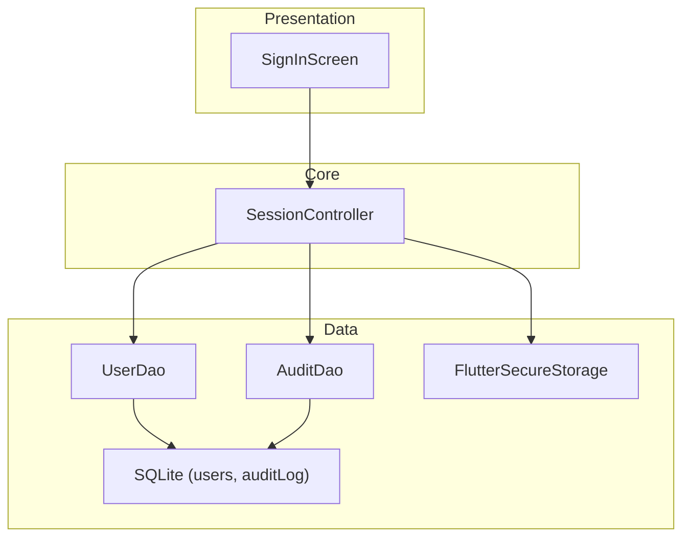
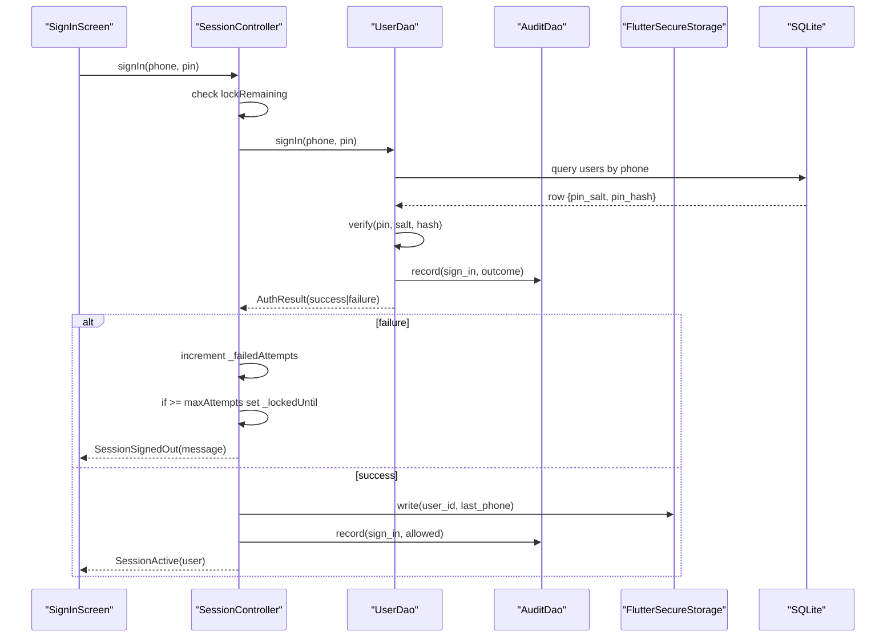
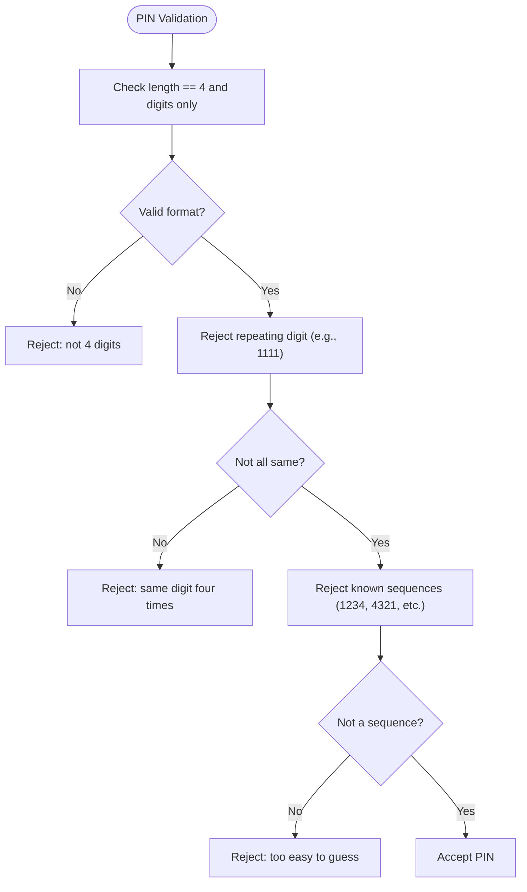
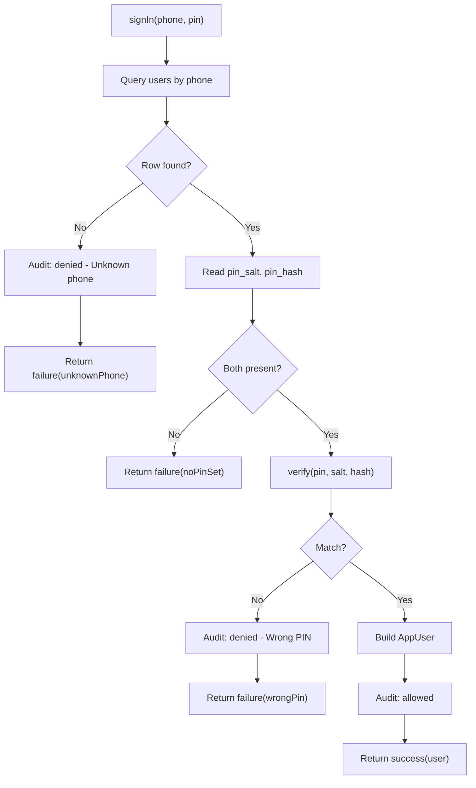
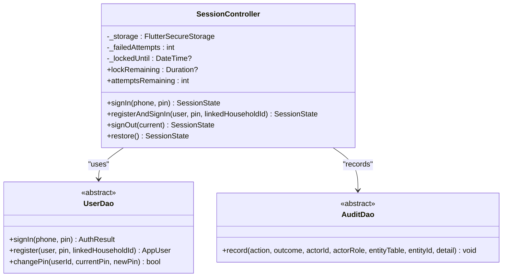
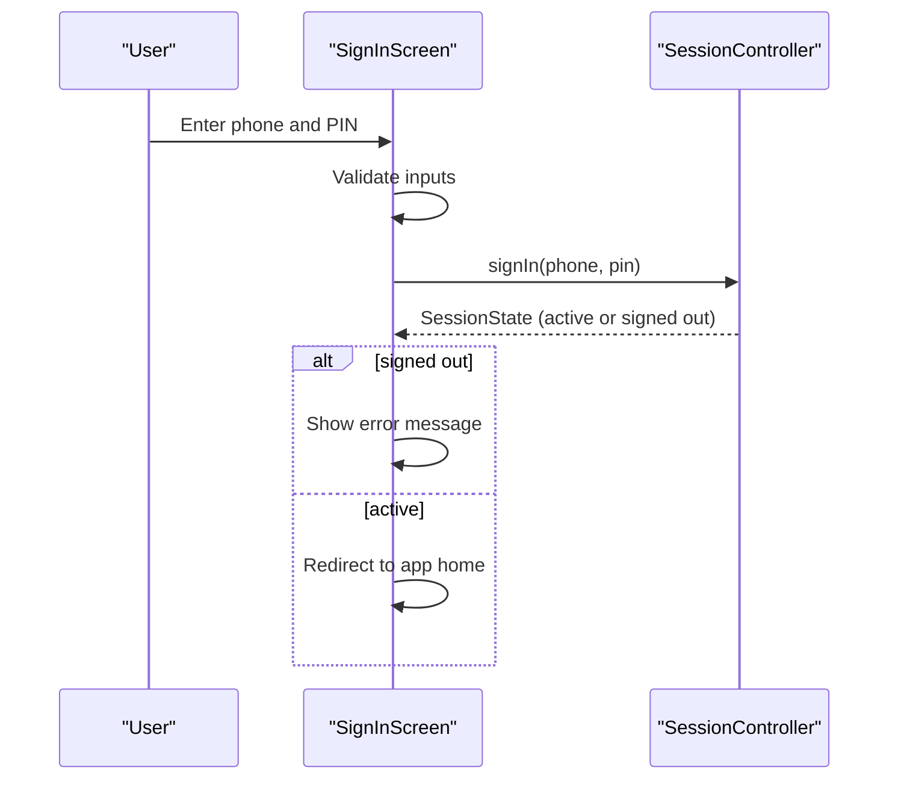
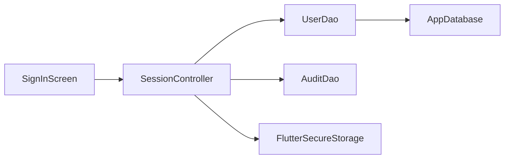

# Authentication Flow & PIN Security

<cite>
**Referenced Files in This Document**
- [session.dart](file://lib/core/auth/session.dart)
- [user_dao.dart](file://lib/data/local/user_dao.dart)
- [sign_in_screen.dart](file://lib/presentation/auth/sign_in_screen.dart)
- [core.dart](file://lib/domain/entities/core.dart)
- [enums.dart](file://lib/domain/enums.dart)
- [app_database.dart](file://lib/data/local/app_database.dart)
</cite>

## Table of Contents
1. [Introduction](#introduction)
2. [Project Structure](#project-structure)
3. [Core Components](#core-components)
4. [Architecture Overview](#architecture-overview)
5. [Detailed Component Analysis](#detailed-component-analysis)
6. [Dependency Analysis](#dependency-analysis)
7. [Performance Considerations](#performance-considerations)
8. [Troubleshooting Guide](#troubleshooting-guide)
9. [Conclusion](#conclusion)

## Introduction
This document explains CareBridge AI’s PIN-based authentication and security model. It covers how PINs are hashed and never stored in plaintext, how failed attempts are tracked and enforced with a lockout policy, the end-to-end sign-in workflow from phone validation to session creation, and how audit logs record every sign-in attempt. It also describes secure storage usage for session persistence and the threat model that informs these choices.

## Project Structure
The authentication flow spans three layers:
- Presentation layer: the sign-in screen collects phone and PIN input and triggers authentication.
- Core session layer: enforces lockout, persists session state securely, and records audit events.
- Data layer: stores user credentials as salted hashes, validates PINs, and writes audit entries.

**Diagram sources**
- [sign_in_screen.dart:1-120](file://lib/presentation/auth/sign_in_screen.dart#L1-L120)
- [session.dart:71-162](file://lib/core/auth/session.dart#L71-L162)
- [user_dao.dart:169-216](file://lib/data/local/user_dao.dart#L169-L216)
- [app_database.dart:540-555](file://lib/data/local/app_database.dart#L540-L555)

**Section sources**
- [sign_in_screen.dart:1-120](file://lib/presentation/auth/sign_in_screen.dart#L1-L120)
- [session.dart:1-120](file://lib/core/auth/session.dart#L1-L120)
- [user_dao.dart:1-120](file://lib/data/local/user_dao.dart#L1-L120)
- [app_database.dart:540-555](file://lib/data/local/app_database.dart#L540-L555)

## Core Components
- Credentials: Implements PIN hashing and verification using iterated HMAC-SHA256 with per-user salt and constant-time comparison.
- UserDao: Persists users with pin_salt and pin_hash; provides signIn and changePin operations; records audit entries for sign-in outcomes.
- SessionController: Orchestrates sign-in, enforces in-memory lockout after repeated failures, persists signed-in user id and last phone via secure storage, and records audit events.
- SignInScreen: Validates phone length and PIN length, uses a custom keypad, calls SessionController.signIn, and displays error messages or redirects on success.
- AppUser and UserRole/Permission: Define the authenticated user and role-based permissions used throughout the app.

Key behaviors:
- PINs are never stored in plaintext; only pin_salt and pin_hash are persisted.
- Lockout is per-device and in-memory: 5 failed attempts trigger a 30-second keypad lock.
- Audit logging captures allowed/denied sign-in attempts and other sensitive actions.

**Section sources**
- [user_dao.dart:44-93](file://lib/data/local/user_dao.dart#L44-L93)
- [user_dao.dart:169-216](file://lib/data/local/user_dao.dart#L169-L216)
- [session.dart:71-162](file://lib/core/auth/session.dart#L71-L162)
- [sign_in_screen.dart:43-74](file://lib/presentation/auth/sign_in_screen.dart#L43-L74)
- [core.dart:1-83](file://lib/domain/entities/core.dart#L1-L83)
- [enums.dart:10-66](file://lib/domain/enums.dart#L10-L66)

## Architecture Overview
The authentication architecture separates UI concerns, session management, and data access. The session controller coordinates validation, lockout, secure storage, and auditing, while the DAO handles credential storage and verification.

**Diagram sources**
- [sign_in_screen.dart:43-74](file://lib/presentation/auth/sign_in_screen.dart#L43-L74)
- [session.dart:114-162](file://lib/core/auth/session.dart#L114-L162)
- [user_dao.dart:169-216](file://lib/data/local/user_dao.dart#L169-L216)
- [app_database.dart:540-555](file://lib/data/local/app_database.dart#L540-L555)

## Detailed Component Analysis

### PIN Hashing and Verification (Credentials)
- hashPin: Iterated HMAC-SHA256 over the PIN with a per-user salt; returns a base64-encoded string.
- verify: Computes the hash and performs constant-time comparison to avoid timing side channels.
- validatePin: Enforces 4-digit numeric PIN and rejects weak patterns at registration time.

**Diagram sources**
- [user_dao.dart:78-93](file://lib/data/local/user_dao.dart#L78-L93)

**Section sources**
- [user_dao.dart:44-93](file://lib/data/local/user_dao.dart#L44-L93)

### Sign-In Workflow (UserDao.signIn)
- Looks up user by trimmed phone number.
- If no account found, records an audit denial and returns unknown phone failure.
- If pin_salt or pin_hash missing, returns no-pin-set failure.
- Verifies PIN against stored hash using constant-time compare.
- On wrong PIN, records audit denial and returns wrong-PIN failure.
- On success, constructs AppUser, records audit allowed, and returns success.

**Diagram sources**
- [user_dao.dart:169-216](file://lib/data/local/user_dao.dart#L169-L216)

**Section sources**
- [user_dao.dart:169-216](file://lib/data/local/user_dao.dart#L169-L216)

### Session Management and Lockout (SessionController)
- restore: Determines initial state (needs setup, signed out, or active) using secure storage and database.
- signIn:
  - Checks lockRemaining; if locked, returns signed-out with message indicating seconds remaining.
  - Calls UserDao.signIn; on failure increments _failedAttempts and locks out after reaching maxAttempts (5), setting _lockedUntil to now + 30 seconds.
  - On success, clears attempts and lock, writes user id and last phone to secure storage, records audit allowed, and returns active session.
- registerAndSignIn: Creates user with PIN, persists session, and records audit.
- signOut: Clears secure storage, resets lock state, and records audit if current user exists.

**Diagram sources**
- [session.dart:71-162](file://lib/core/auth/session.dart#L71-L162)
- [user_dao.dart:169-216](file://lib/data/local/user_dao.dart#L169-L216)

**Section sources**
- [session.dart:71-162](file://lib/core/auth/session.dart#L71-L162)
- [session.dart:169-206](file://lib/core/auth/session.dart#L169-L206)

### Presentation Layer (SignInScreen)
- Validates phone length (>= 9) and PIN length (== 4).
- Uses a custom keypad to collect PIN without system keyboard overhead.
- Calls SessionController.signIn and updates UI with errors or proceeds on success.
- Prefills last phone when available from session state.

**Diagram sources**
- [sign_in_screen.dart:43-74](file://lib/presentation/auth/sign_in_screen.dart#L43-L74)
- [session.dart:114-162](file://lib/core/auth/session.dart#L114-L162)

**Section sources**
- [sign_in_screen.dart:43-74](file://lib/presentation/auth/sign_in_screen.dart#L43-L74)

### Secure Storage and Persistence
- SessionController uses FlutterSecureStorage to persist user id and last phone across app restarts.
- Reads/writes are wrapped in try/catch to degrade gracefully if secure storage is unavailable.
- Pin salts and hashes are stored in SQLite via UserDao; PINs themselves never leave Credentials.hashPin.

**Section sources**
- [session.dart:217-244](file://lib/core/auth/session.dart#L217-L244)
- [user_dao.dart:125-167](file://lib/data/local/user_dao.dart#L125-L167)

### Audit Logging
- Every sign-in attempt (allowed or denied) is recorded via AuditDao.record.
- Registration and sign-out are also audited.
- Audit table schema includes actor identifiers, action, outcome, timestamps, and optional details.

**Section sources**
- [user_dao.dart:169-216](file://lib/data/local/user_dao.dart#L169-L216)
- [session.dart:154-162](file://lib/core/auth/session.dart#L154-L162)
- [app_database.dart:540-555](file://lib/data/local/app_database.dart#L540-L555)

## Dependency Analysis
- SignInScreen depends on SessionController for authentication logic.
- SessionController depends on UserDao for credential verification and AuditDao for logging.
- UserDao depends on SQLite for persistent storage and OutboxDao for sync payloads (excluding PIN hashes).
- SessionController depends on FlutterSecureStorage for secure session persistence.

**Diagram sources**
- [sign_in_screen.dart:1-120](file://lib/presentation/auth/sign_in_screen.dart#L1-L120)
- [session.dart:71-162](file://lib/core/auth/session.dart#L71-L162)
- [user_dao.dart:169-216](file://lib/data/local/user_dao.dart#L169-L216)
- [app_database.dart:540-555](file://lib/data/local/app_database.dart#L540-L555)

**Section sources**
- [sign_in_screen.dart:1-120](file://lib/presentation/auth/sign_in_screen.dart#L1-L120)
- [session.dart:71-162](file://lib/core/auth/session.dart#L71-L162)
- [user_dao.dart:169-216](file://lib/data/local/user_dao.dart#L169-L216)
- [app_database.dart:540-555](file://lib/data/local/app_database.dart#L540-L555)

## Performance Considerations
- PIN hashing uses 20,000 iterations of HMAC-SHA256, balancing security with acceptable latency on low-end Android devices.
- Constant-time comparison avoids timing leaks during verification.
- In-memory lockout counters avoid unnecessary disk writes and keep lockout transient per device.
- Secure storage reads/writes are wrapped to prevent crashes on unsupported environments.

[No sources needed since this section provides general guidance]

## Troubleshooting Guide
Common issues and resolutions:
- Unknown phone number: Ensure the phone number matches a registered account. Audit log will show denied due to unknown phone.
- Wrong PIN: Verify the entered PIN; audit log will record denied with detail “Wrong PIN”.
- No PIN set: Account exists but lacks pin_salt/pin_hash; set a PIN via registration or change-pin flow.
- Locked out: After 5 failed attempts, wait 30 seconds before retrying; lockout is in-memory and resets on app restart.
- Secure storage unavailable: Session will not be remembered across restarts; sign-in still works normally.

**Section sources**
- [user_dao.dart:169-216](file://lib/data/local/user_dao.dart#L169-L216)
- [session.dart:114-162](file://lib/core/auth/session.dart#L114-L162)
- [app_database.dart:540-555](file://lib/data/local/app_database.dart#L540-L555)

## Conclusion
CareBridge AI’s authentication system prioritizes security and usability in shared-device environments. PINs are hashed with strong stretching and verified safely, lockouts deter idle guessing, and comprehensive audit logging ensures accountability. Secure storage enables seamless re-entry without exposing secrets. This design balances robust protection with practical constraints of low-end devices and field use.

[No sources needed since this section summarizes without analyzing specific files]