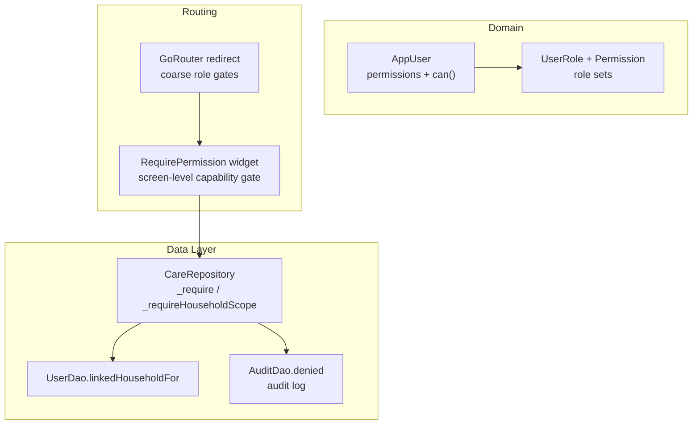
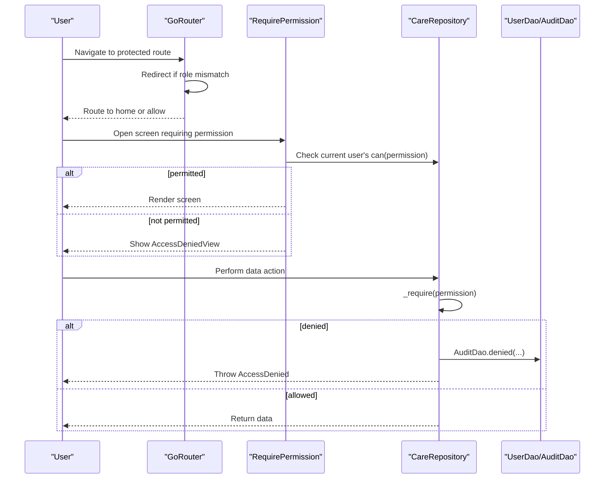
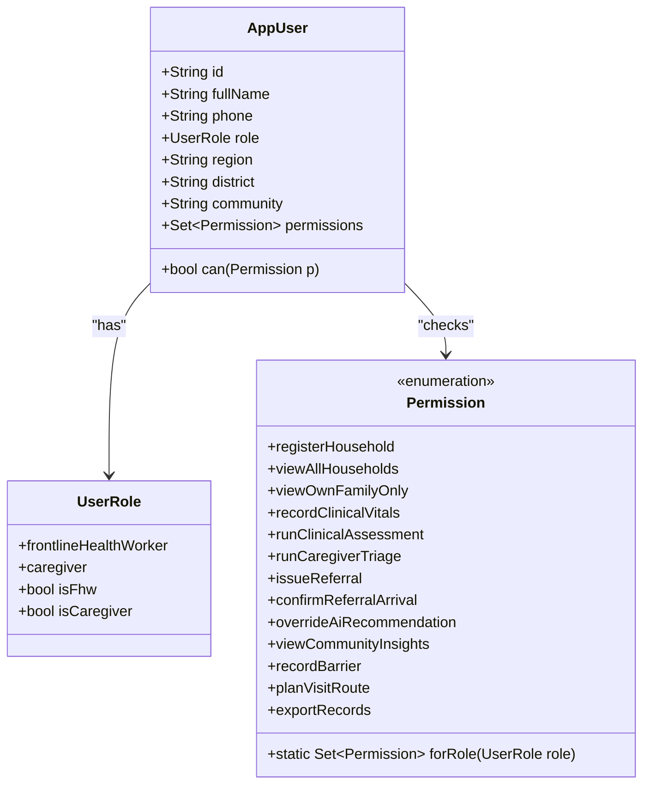
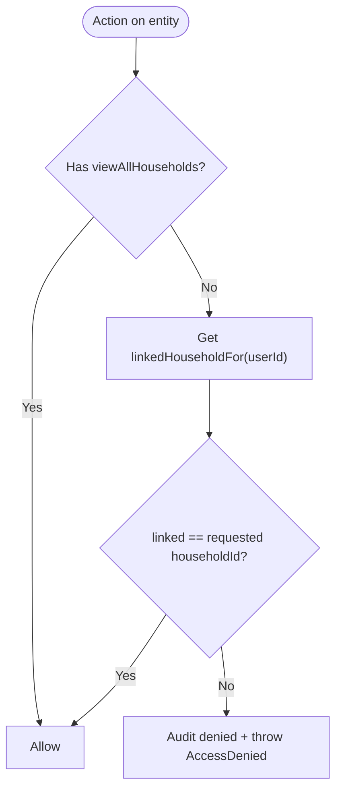
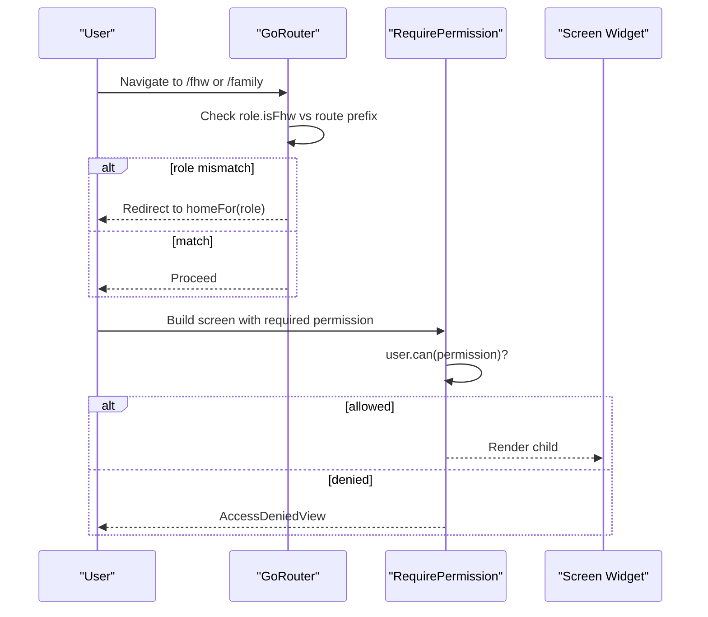
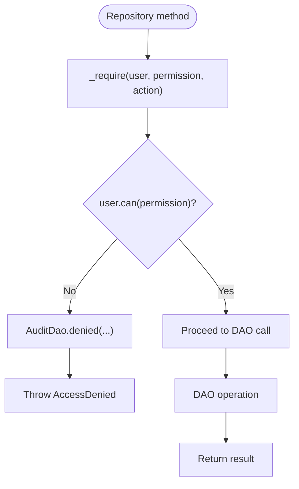
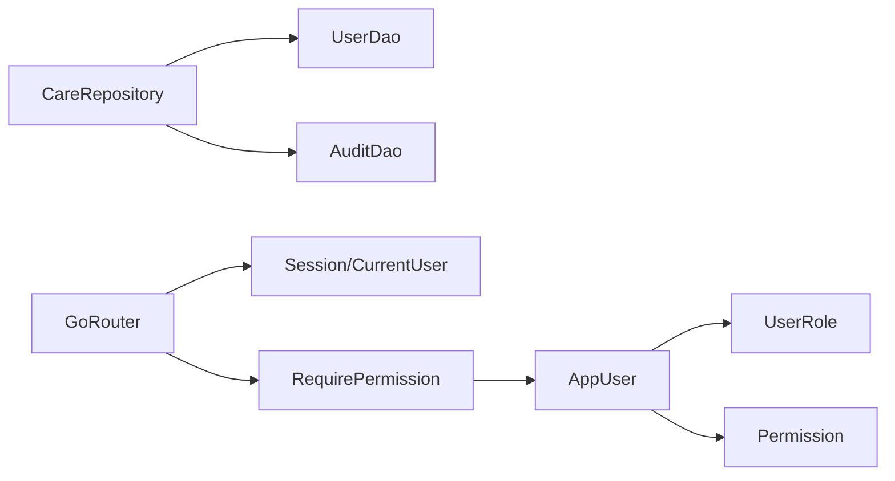

# Role-Based Access Control (RBAC)

<cite>
**Referenced Files in This Document**
- [core.dart](file://lib/domain/entities/core.dart)
- [enums.dart](file://lib/domain/enums.dart)
- [care_repository.dart](file://lib/data/repositories/care_repository.dart)
- [user_dao.dart](file://lib/data/local/user_dao.dart)
- [app_database.dart](file://lib/data/local/app_database.dart)
- [app_router.dart](file://lib/core/router/app_router.dart)
- [ui.dart](file://lib/presentation/shared/ui.dart)
- [rbac_test.dart](file://test/rbac_test.dart)
</cite>

## Table of Contents
1. [Introduction](#introduction)
2. [Project Structure](#project-structure)
3. [Core Components](#core-components)
4. [Architecture Overview](#architecture-overview)
5. [Detailed Component Analysis](#detailed-component-analysis)
6. [Dependency Analysis](#dependency-analysis)
7. [Performance Considerations](#performance-considerations)
8. [Troubleshooting Guide](#troubleshooting-guide)
9. [Conclusion](#conclusion)

## Introduction
This document explains CareBridge AI’s role-based access control (RBAC). It focuses on the AppUser model and its role properties, the permission system via the can() method, and how two primary roles are enforced:
- Frontline Health Worker (FHW): full clinical scope across a CHPS zone.
- Caregiver: household-scoped access to their own family only.

It also documents how linkedHouseholdId scopes caregiver data access, ensuring privacy boundaries, and how permissions are enforced at route guards, repository-level data access controls, and UI element visibility. Examples include role-specific features, permission checks in business logic, and mechanisms that prevent unauthorized cross-user data access.

## Project Structure
The RBAC implementation spans domain models, enums for roles and permissions, repository-level enforcement, local storage DAOs, routing guards, and shared UI components. The entry point wires up the router which enforces coarse role separation; fine-grained enforcement occurs in the repository layer.

**Diagram sources**
- [core.dart:39-40](file://lib/domain/entities/core.dart#L39-L40)
- [enums.dart:10-24](file://lib/domain/enums.dart#L10-L24)
- [enums.dart:29-66](file://lib/domain/enums.dart#L29-L66)
- [app_router.dart:63-114](file://lib/core/router/app_router.dart#L63-L114)
- [app_router.dart:167-180](file://lib/core/router/app_router.dart#L167-L180)
- [care_repository.dart:55-110](file://lib/data/repositories/care_repository.dart#L55-L110)
- [user_dao.dart:242-252](file://lib/data/local/user_dao.dart#L242-L252)
- [user_dao.dart:417-433](file://lib/data/local/user_dao.dart#L417-L433)

**Section sources**
- [main.dart:16-34](file://lib/main.dart#L16-L34)
- [app_router.dart:63-114](file://lib/core/router/app_router.dart#L63-L114)
- [care_repository.dart:1-26](file://lib/data/repositories/care_repository.dart#L1-L26)

## Core Components
- AppUser: carries role and exposes permissions set and can(permission) check.
- UserRole: defines isFhw and isCaregiver booleans for coarse routing and feature gating.
- Permission: enumerates capabilities; each role maps to a fixed set of permissions.
- CareRepository: centralizes all data operations and enforces permissions and household scoping.
- UserDao: stores user records and the linkedHouseholdId binding used to scope caregivers.
- AuditDao: records denials and allowed actions for auditability.
- Router and RequirePermission: enforce coarse role separation and screen-level capability checks.

Key behaviors:
- AppUser.permissions returns the role’s permission set; AppUser.can(p) checks membership.
- CareRepository._require validates a permission before any write or sensitive read.
- CareRepository._requireHouseholdScope ensures caregivers can only access their linked household.
- Router redirects users based on role; RequirePermission wraps screens by capability.

**Section sources**
- [core.dart:6-40](file://lib/domain/entities/core.dart#L6-L40)
- [enums.dart:10-24](file://lib/domain/enums.dart#L10-L24)
- [enums.dart:29-66](file://lib/domain/enums.dart#L29-L66)
- [care_repository.dart:55-110](file://lib/data/repositories/care_repository.dart#L55-L110)
- [user_dao.dart:242-252](file://lib/data/local/user_dao.dart#L242-L252)
- [app_router.dart:63-114](file://lib/core/router/app_router.dart#L63-L114)
- [app_router.dart:167-180](file://lib/core/router/app_router.dart#L167-L180)

## Architecture Overview
RBAC is enforced at three layers:
1. Routing: coarse separation by role prevents caregivers from entering FHW routes and vice versa.
2. UI: RequirePermission hides or blocks screens based on capability.
3. Repository: final boundary enforcing permissions and household scoping; denies and audits unauthorized attempts.

**Diagram sources**
- [app_router.dart:63-114](file://lib/core/router/app_router.dart#L63-L114)
- [app_router.dart:167-180](file://lib/core/router/app_router.dart#L167-L180)
- [care_repository.dart:63-110](file://lib/data/repositories/care_repository.dart#L63-L110)
- [user_dao.dart:417-433](file://lib/data/local/user_dao.dart#L417-L433)

## Detailed Component Analysis

### AppUser Model and Permission Checking
- AppUser holds role and provides:
  - permissions: derived from Permission.forRole(role).
  - can(p): true if p is in permissions.
- This makes UI and business logic ask “can I do X?” rather than “what role am I?”, enabling future roles without widespread changes.

**Diagram sources**
- [core.dart:6-40](file://lib/domain/entities/core.dart#L6-L40)
- [enums.dart:10-24](file://lib/domain/enums.dart#L10-L24)
- [enums.dart:29-66](file://lib/domain/enums.dart#L29-L66)

**Section sources**
- [core.dart:39-40](file://lib/domain/entities/core.dart#L39-L40)
- [enums.dart:29-66](file://lib/domain/enums.dart#L29-L66)

### Roles and Permission Sets
- UserRole.frontlineHealthWorker (isFhw=true) receives the full clinical set.
- UserRole.caregiver (isCaregiver=true) receives a limited set focused on family triage and barrier reporting.
- Permission.forRole(role) returns the exact set per role. Tests assert these sets precisely.

Examples of role-specific capabilities:
- FHW: register households, view all households, record clinical vitals, run assessments, issue referrals, confirm arrivals, override AI recommendations, view community insights, plan visit routes, export records.
- Caregiver: view own family only, run caregiver triage, report barriers.

**Section sources**
- [enums.dart:10-24](file://lib/domain/enums.dart#L10-L24)
- [enums.dart:44-66](file://lib/domain/enums.dart#L44-L66)
- [rbac_test.dart:21-53](file://test/rbac_test.dart#L21-L53)
- [rbac_test.dart:55-81](file://test/rbac_test.dart#L55-L81)

### Household Scoping with linkedHouseholdId
- Caregiver accounts are bound to exactly one household via linked_household_id.
- CareRepository._requireHouseholdScope enforces this:
  - If user has viewAllHouseholds (FHW), pass through.
  - Otherwise, fetch linkedHouseholdFor(userId) and compare to requested householdId.
  - On mismatch, audit denial and throw AccessDenied.
- Person-level reads use _requirePersonScope to resolve person.householdId and then apply household scoping.

**Diagram sources**
- [care_repository.dart:86-110](file://lib/data/repositories/care_repository.dart#L86-L110)
- [user_dao.dart:242-252](file://lib/data/local/user_dao.dart#L242-L252)

**Section sources**
- [care_repository.dart:86-110](file://lib/data/repositories/care_repository.dart#L86-L110)
- [user_dao.dart:242-252](file://lib/data/local/user_dao.dart#L242-L252)

### Route Guards and Screen-Level Capability Checks
- GoRouter redirect enforces coarse role separation:
  - Caregivers cannot navigate under FHW routes and vice versa.
- RequirePermission wraps screens to enforce capability:
  - If current user lacks the required Permission, show AccessDeniedView.
- Home routing uses Routes.homeFor(role) to direct users to appropriate dashboards.

**Diagram sources**
- [app_router.dart:63-114](file://lib/core/router/app_router.dart#L63-L114)
- [app_router.dart:167-180](file://lib/core/router/app_router.dart#L167-L180)

**Section sources**
- [app_router.dart:63-114](file://lib/core/router/app_router.dart#L63-L114)
- [app_router.dart:167-180](file://lib/core/router/app_router.dart#L167-L180)

### Data Access Controls and Business Logic Enforcement
- Every repository method takes AppUser as first argument and calls _require(permission, action, ...).
- Sensitive operations:
  - registerHousehold requires registerHousehold.
  - visibleHouseholds returns zone-wide list for FHW; single linked household for caregivers.
  - household(id) enforces household scoping.
- Auditing:
  - Denied attempts are logged via AuditDao.denied with actor, role, table, entity, and reason.
  - Allowed sensitive actions may be recorded too (e.g., register_family).

**Diagram sources**
- [care_repository.dart:63-79](file://lib/data/repositories/care_repository.dart#L63-L79)
- [user_dao.dart:417-433](file://lib/data/local/user_dao.dart#L417-L433)

**Section sources**
- [care_repository.dart:132-198](file://lib/data/repositories/care_repository.dart#L132-L198)
- [user_dao.dart:417-433](file://lib/data/local/user_dao.dart#L417-L433)

### UI Element Visibility and Permission Labels
- RequirePermission renders AccessDeniedView when a user lacks capability.
- Permission labels are centralized for consistent messaging across UI.
- Example usage:
  - FHW profile tab shows capability labels mapped to Permission values.
  - Caregiver home displays role-appropriate guidance and limitations.

**Section sources**
- [ui.dart:658-673](file://lib/presentation/shared/ui.dart#L658-L673)
- [app_router.dart:167-180](file://lib/core/router/app_router.dart#L167-L180)
- [presentation/fhw/profile_tab.dart:433-447](file://lib/presentation/fhw/profile_tab.dart#L433-L447)

### Preventing Unauthorized Cross-User Data Access
- Household scoping ensures caregivers cannot open another family’s records even if they know IDs.
- Person-level scoping resolves household ownership before granting access.
- All denials are auditable, providing evidence of attempted breaches.

**Section sources**
- [care_repository.dart:115-126](file://lib/data/repositories/care_repository.dart#L115-L126)
- [care_repository.dart:86-110](file://lib/data/repositories/care_repository.dart#L86-L110)
- [user_dao.dart:417-433](file://lib/data/local/user_dao.dart#L417-L433)

## Dependency Analysis
RBAC components interact as follows:
- AppUser depends on UserRole and Permission to compute permissions.
- CareRepository depends on UserDao for linkedHouseholdId and on AuditDao for logging.
- Router depends on session state and role flags to enforce coarse separation.
- UI components depend on Permission and current user to render or hide features.

**Diagram sources**
- [core.dart:39-40](file://lib/domain/entities/core.dart#L39-L40)
- [enums.dart:29-66](file://lib/domain/enums.dart#L29-L66)
- [care_repository.dart:55-110](file://lib/data/repositories/care_repository.dart#L55-L110)
- [user_dao.dart:242-252](file://lib/data/local/user_dao.dart#L242-L252)
- [app_router.dart:63-114](file://lib/core/router/app_router.dart#L63-L114)
- [app_router.dart:167-180](file://lib/core/router/app_router.dart#L167-L180)

**Section sources**
- [core.dart:39-40](file://lib/domain/entities/core.dart#L39-L40)
- [enums.dart:29-66](file://lib/domain/enums.dart#L29-L66)
- [care_repository.dart:55-110](file://lib/data/repositories/care_repository.dart#L55-L110)
- [user_dao.dart:242-252](file://lib/data/local/user_dao.dart#L242-L252)
- [app_router.dart:63-114](file://lib/core/router/app_router.dart#L63-L114)
- [app_router.dart:167-180](file://lib/core/router/app_router.dart#L167-L180)

## Performance Considerations
- Permission checks are O(1) set lookups using Permission.forRole(role) and Set.contains.
- Household scoping adds one database lookup per scoped request (linkedHouseholdFor); acceptable given offline-first design.
- Audit writes are best-effort and non-blocking to avoid impacting care delivery.

[No sources needed since this section provides general guidance]

## Troubleshooting Guide
Common issues and resolutions:
- AccessDenied thrown during repository calls:
  - Verify the user’s role and whether the required Permission is granted.
  - For caregivers, ensure the requested household matches linkedHouseholdId.
- Unexpected empty lists for caregivers:
  - Confirm linkedHouseholdId is set; visibleHouseholds returns only the linked household when no viewAllHouseholds.
- Audit logs show denials:
  - Review AuditDao.denied entries to identify missing permissions or incorrect scoping.

**Section sources**
- [care_repository.dart:63-79](file://lib/data/repositories/care_repository.dart#L63-L79)
- [care_repository.dart:86-110](file://lib/data/repositories/care_repository.dart#L86-L110)
- [user_dao.dart:417-433](file://lib/data/local/user_dao.dart#L417-L433)
- [app_database.dart:539-555](file://lib/data/local/app_database.dart#L539-L555)

## Conclusion
CareBridge AI’s RBAC combines role-based capability sets with strict household scoping to protect sensitive health data. AppUser.permissions and can() provide a clean API for permission checks. Coarse role separation at the router and screen-level RequirePermission complement repository-level enforcement, ensuring both usability and security. Auditing captures denials and critical actions, supporting accountability and troubleshooting.

[No sources needed since this section summarizes without analyzing specific files]