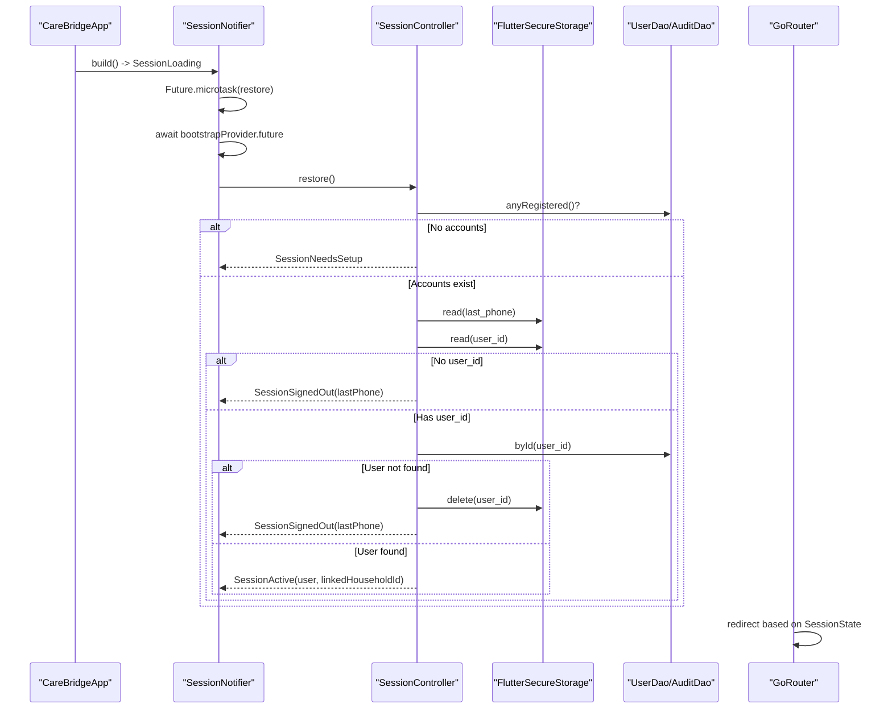
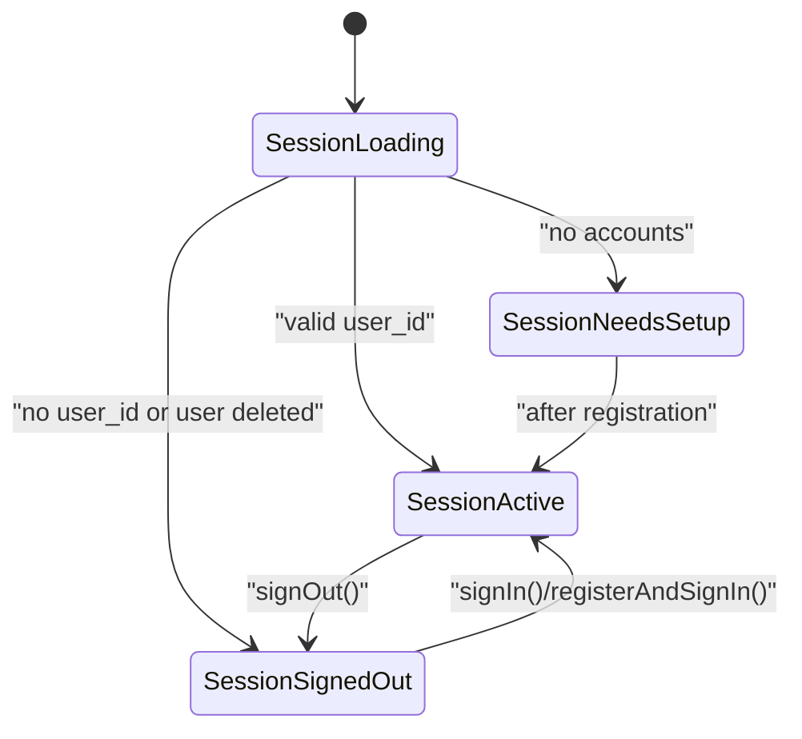
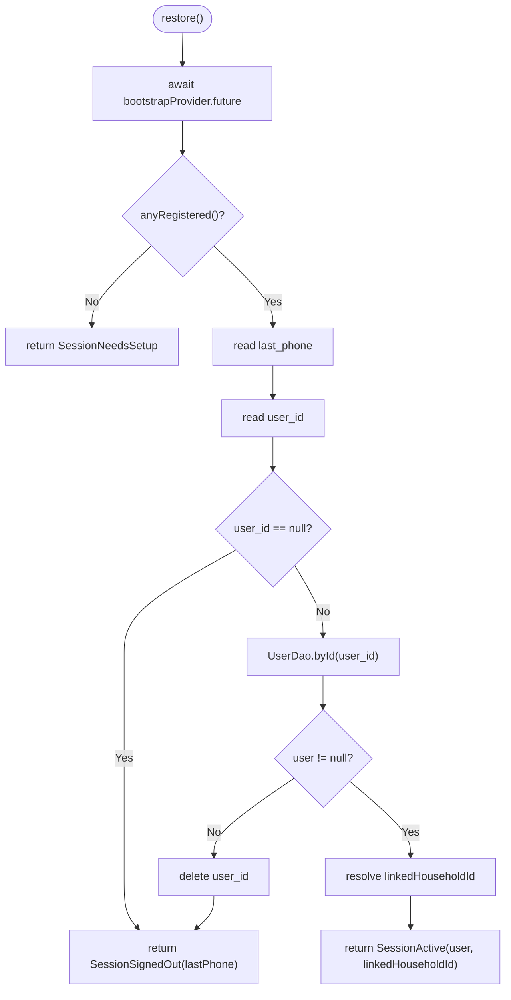
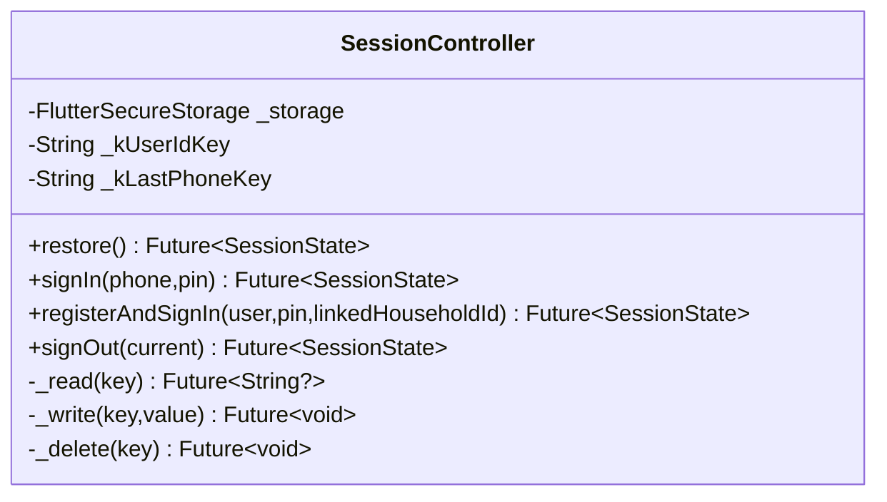
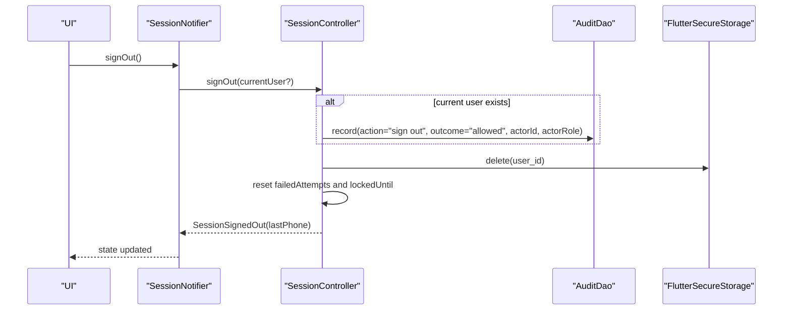
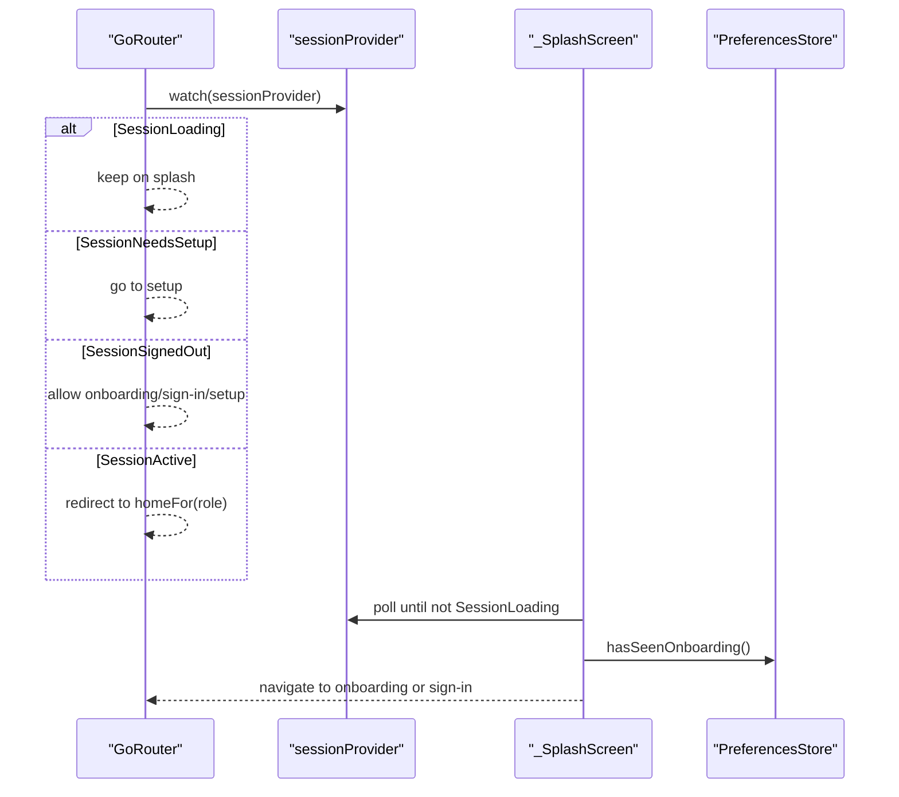
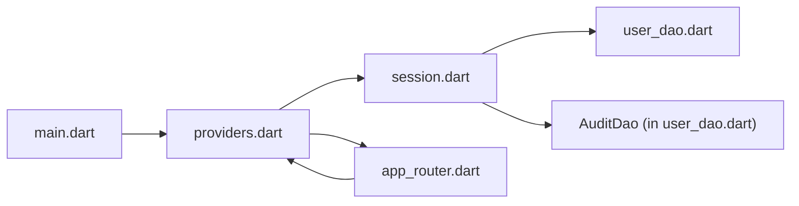

# Session Lifecycle Management

<cite>
**Referenced Files in This Document**
- [session.dart](file://lib/core/auth/session.dart)
- [providers.dart](file://lib/app/providers.dart)
- [app_router.dart](file://lib/core/router/app_router.dart)
- [user_dao.dart](file://lib/data/local/user_dao.dart)
- [main.dart](file://lib/main.dart)
</cite>

## Table of Contents
1. [Introduction](#introduction)
2. [Project Structure](#project-structure)
3. [Core Components](#core-components)
4. [Architecture Overview](#architecture-overview)
5. [Detailed Component Analysis](#detailed-component-analysis)
6. [Dependency Analysis](#dependency-analysis)
7. [Performance Considerations](#performance-considerations)
8. [Troubleshooting Guide](#troubleshooting-guide)
9. [Conclusion](#conclusion)

## Introduction
This document explains how CareBridge AI manages the user session across app lifecycles. It covers:
- The SessionState enum states and their transitions
- App startup via restore() to determine the initial state
- Persistence of user_id and last_phone using FlutterSecureStorage
- Sign-out process including cleanup, audit logging, and state reset
- Integration with the app shell and routing system to control screen access based on authentication state

The design ensures a smooth first launch experience, resilient recovery after crashes, and secure sign-out for shared devices.

## Project Structure
Session management spans three layers:
- Core auth logic and state model (sealed class hierarchy and controller)
- Application wiring and notifier that exposes session state to the UI
- Router that enforces navigation rules based on current session

```mermaid
graph TB
subgraph "App Entry"
Main["main.dart"]
end
subgraph "Providers"
Providers["providers.dart<br/>SessionNotifier + providers"]
end
subgraph "Auth Core"
Session["session.dart<br/>SessionState + SessionController"]
end
subgraph "Routing"
Router["app_router.dart<br/>GoRouter redirect + splash"]
end
subgraph "Data"
UserDao["user_dao.dart<br/>UserDao + AuditDao"]
end
Main --> Providers
Providers --> Session
Providers --> Router
Session --> UserDao
Router --> Providers
```

**Diagram sources**
- [main.dart:16-34](file://lib/main.dart#L16-L34)
- [providers.dart:68-122](file://lib/app/providers.dart#L68-L122)
- [session.dart:28-112](file://lib/core/auth/session.dart#L28-L112)
- [app_router.dart:63-114](file://lib/core/router/app_router.dart#L63-L114)
- [user_dao.dart:286-292](file://lib/data/local/user_dao.dart#L286-L292)

**Section sources**
- [main.dart:16-34](file://lib/main.dart#L16-L34)
- [providers.dart:68-122](file://lib/app/providers.dart#L68-L122)
- [session.dart:28-112](file://lib/core/auth/session.dart#L28-L112)
- [app_router.dart:63-114](file://lib/core/router/app_router.dart#L63-L114)
- [user_dao.dart:286-292](file://lib/data/local/user_dao.dart#L286-L292)

## Core Components
- SessionState sealed hierarchy defines four mutually exclusive states:
  - SessionLoading: early boot while restoring from storage
  - SessionNeedsSetup: first-run setup when no accounts exist
  - SessionSignedOut: signed out or never signed in; carries lastPhone and optional message
  - SessionActive: authenticated session with user and optional linkedHouseholdId
- SessionController encapsulates persistence and lifecycle operations:
  - restore(): determines initial state at startup
  - signIn(): authenticates, persists user_id and last_phone, audits, returns active session
  - registerAndSignIn(): creates account and signs in in one step
  - signOut(): clears persisted user_id, resets lockout, audits, returns signed-out state
- SessionNotifier bridges Riverpod and SessionController, exposing sessionProvider and currentUserProvider
- Router uses sessionProvider to enforce redirects and protect routes by role/permission

**Section sources**
- [session.dart:28-67](file://lib/core/auth/session.dart#L28-L67)
- [session.dart:71-112](file://lib/core/auth/session.dart#L71-L112)
- [providers.dart:73-122](file://lib/app/providers.dart#L73-L122)
- [app_router.dart:63-114](file://lib/core/router/app_router.dart#L63-L114)

## Architecture Overview
The session lifecycle is driven by a provider-notifier pattern:
- On app start, SessionNotifier.build returns SessionLoading and schedules restore()
- restore() waits for bootstrap (database open, seed, sync), then calls SessionController.restore()
- SessionController.restore() checks if any accounts exist, reads last_phone and user_id from secure storage, resolves user, and returns the appropriate state
- Router listens to sessionProvider changes and redirects accordingly
- Screens read currentUserProvider to gate behavior based on authentication



**Diagram sources**
- [providers.dart:77-92](file://lib/app/providers.dart#L77-L92)
- [session.dart:97-112](file://lib/core/auth/session.dart#L97-L112)
- [user_dao.dart:286-292](file://lib/data/local/user_dao.dart#L286-L292)
- [app_router.dart:70-114](file://lib/core/router/app_router.dart#L70-L114)

## Detailed Component Analysis

### SessionState Enum States and Transitions
States and typical transitions:
- SessionLoading -> SessionNeedsSetup: no accounts registered
- SessionLoading -> SessionSignedOut: no user_id in secure storage or user deleted
- SessionLoading -> SessionActive: valid user_id resolves to existing user
- SessionActive -> SessionSignedOut: explicit signOut()
- SessionSignedOut -> SessionActive: successful signIn() or registerAndSignIn()
- SessionNeedsSetup -> SessionActive: after registration flow completes



**Diagram sources**
- [session.dart:28-67](file://lib/core/auth/session.dart#L28-L67)
- [session.dart:97-112](file://lib/core/auth/session.dart#L97-L112)
- [session.dart:114-162](file://lib/core/auth/session.dart#L114-L162)
- [session.dart:169-191](file://lib/core/auth/session.dart#L169-L191)
- [session.dart:193-206](file://lib/core/auth/session.dart#L193-L206)

**Section sources**
- [session.dart:28-67](file://lib/core/auth/session.dart#L28-L67)
- [session.dart:97-112](file://lib/core/auth/session.dart#L97-L112)
- [session.dart:114-162](file://lib/core/auth/session.dart#L114-L162)
- [session.dart:169-191](file://lib/core/auth/session.dart#L169-L191)
- [session.dart:193-206](file://lib/core/auth/session.dart#L193-L206)

### restore() Method: App Startup and Initial State
- Waits for bootstrap to complete (database open, demo seed, sync service start)
- Checks if any accounts exist; if none, returns SessionNeedsSetup
- Reads last_phone and user_id from secure storage
- If user_id missing, returns SessionSignedOut with last_phone prefill
- If user_id present but user not found, deletes stale user_id and returns SessionSignedOut
- If user exists, resolves linkedHouseholdId for caregivers and returns SessionActive



**Diagram sources**
- [providers.dart:89-92](file://lib/app/providers.dart#L89-L92)
- [session.dart:97-112](file://lib/core/auth/session.dart#L97-L112)
- [user_dao.dart:286-292](file://lib/data/local/user_dao.dart#L286-L292)

**Section sources**
- [providers.dart:89-92](file://lib/app/providers.dart#L89-L92)
- [session.dart:97-112](file://lib/core/auth/session.dart#L97-L112)
- [user_dao.dart:286-292](file://lib/data/local/user_dao.dart#L286-L292)

### Session Persistence with FlutterSecureStorage
Keys used:
- carebridge.session.user_id: stores the signed-in user id
- carebridge.session.last_phone: stores the last phone number for quick re-entry

Behavior:
- On successful sign-in or registration, both keys are written
- On sign-out, user_id is deleted; last_phone remains to prefill sign-in
- All storage operations are wrapped in try/catch to degrade gracefully when secure storage is unavailable



**Diagram sources**
- [session.dart:71-112](file://lib/core/auth/session.dart#L71-L112)
- [session.dart:114-162](file://lib/core/auth/session.dart#L114-L162)
- [session.dart:169-191](file://lib/core/auth/session.dart#L169-L191)
- [session.dart:193-206](file://lib/core/auth/session.dart#L193-L206)
- [session.dart:221-243](file://lib/core/auth/session.dart#L221-L243)

**Section sources**
- [session.dart:71-112](file://lib/core/auth/session.dart#L71-L112)
- [session.dart:221-243](file://lib/core/auth/session.dart#L221-L243)

### Sign-Out Process: Cleanup, Audit Logging, and State Reset
- Audits the sign-out event with actor details if a current user exists
- Deletes user_id from secure storage
- Resets failed attempts counter and lock timer
- Returns SessionSignedOut with last_phone preserved for convenience



**Diagram sources**
- [providers.dart:112-117](file://lib/app/providers.dart#L112-L117)
- [session.dart:193-206](file://lib/core/auth/session.dart#L193-L206)

**Section sources**
- [providers.dart:112-117](file://lib/app/providers.dart#L112-L117)
- [session.dart:193-206](file://lib/core/auth/session.dart#L193-L206)

### Routing Integration and Screen Access Control
- GoRouter listens to sessionProvider changes via a refresh listener
- Redirect logic:
  - SessionLoading: hold on splash until resolved
  - SessionNeedsSetup: navigate to setup
  - SessionSignedOut: allow onboarding and sign-in; otherwise redirect to sign-in
  - SessionActive: bounce off pre-auth screens; enforce role-based separation between FHW and caregiver homes
- RequirePermission wraps route content to check permissions per screen
- Splash screen waits for session to leave Loading before deciding next route based on preferences



**Diagram sources**
- [app_router.dart:63-114](file://lib/core/router/app_router.dart#L63-L114)
- [app_router.dart:167-196](file://lib/core/router/app_router.dart#L167-196)
- [app_router.dart:198-243](file://lib/core/router/app_router.dart#L198-L243)

**Section sources**
- [app_router.dart:63-114](file://lib/core/router/app_router.dart#L63-L114)
- [app_router.dart:167-196](file://lib/core/router/app_router.dart#L167-196)
- [app_router.dart:198-243](file://lib/core/router/app_router.dart#L198-L243)

## Dependency Analysis
Key dependencies:
- SessionNotifier depends on SessionController and bootstrapProvider
- SessionController depends on FlutterSecureStorage, UserDao, and AuditDao
- Router depends on sessionProvider and PreferencesStore
- main.dart wires up ProviderScope and routerProvider



**Diagram sources**
- [main.dart:16-34](file://lib/main.dart#L16-L34)
- [providers.dart:68-122](file://lib/app/providers.dart#L68-L122)
- [session.dart:71-112](file://lib/core/auth/session.dart#L71-L112)
- [app_router.dart:63-114](file://lib/core/router/app_router.dart#L63-L114)
- [user_dao.dart:382-413](file://lib/data/local/user_dao.dart#L382-L413)

**Section sources**
- [main.dart:16-34](file://lib/main.dart#L16-L34)
- [providers.dart:68-122](file://lib/app/providers.dart#L68-L122)
- [session.dart:71-112](file://lib/core/auth/session.dart#L71-L112)
- [app_router.dart:63-114](file://lib/core/router/app_router.dart#L63-L114)
- [user_dao.dart:382-413](file://lib/data/local/user_dao.dart#L382-L413)

## Performance Considerations
- Secure storage operations are wrapped in try/catch to avoid blocking or crashing on environments where it is unavailable
- restore() defers heavy work until bootstrap completes, preventing race conditions
- Lockout state is in-memory only, avoiding extra I/O and ensuring quick unlock after timeout
- Router redirect uses a single ChangeNotifier to minimize rebuilds

[No sources needed since this section provides general guidance]

## Troubleshooting Guide
Common issues and resolutions:
- App stuck on splash: ensure bootstrapProvider completes and sessionProvider leaves SessionLoading
- Unexpected sign-in screen after restart: verify user_id presence in secure storage; if missing, restore() will return SessionSignedOut
- Account removed externally: restore() detects missing user, deletes stale user_id, and returns SessionSignedOut
- Sign-out not clearing session: confirm user_id deletion and lockout reset in signOut(); verify audit log entry recorded

**Section sources**
- [session.dart:97-112](file://lib/core/auth/session.dart#L97-L112)
- [session.dart:193-206](file://lib/core/auth/session.dart#L193-L206)
- [providers.dart:89-92](file://lib/app/providers.dart#L89-L92)

## Conclusion
CareBridge AI’s session lifecycle is designed for resilience and usability:
- Clear state model with explicit transitions
- Robust restore() that handles edge cases like missing users or broken secure storage
- Secure persistence of minimal identifiers to streamline re-entry
- Explicit sign-out with audit logging and clean state reset
- Router-driven navigation that keeps UI consistent with authentication state

This approach balances security, performance, and field usability on constrained devices.