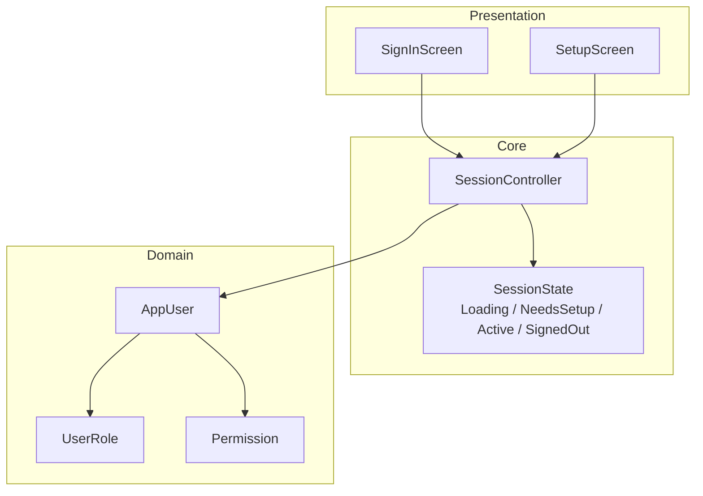
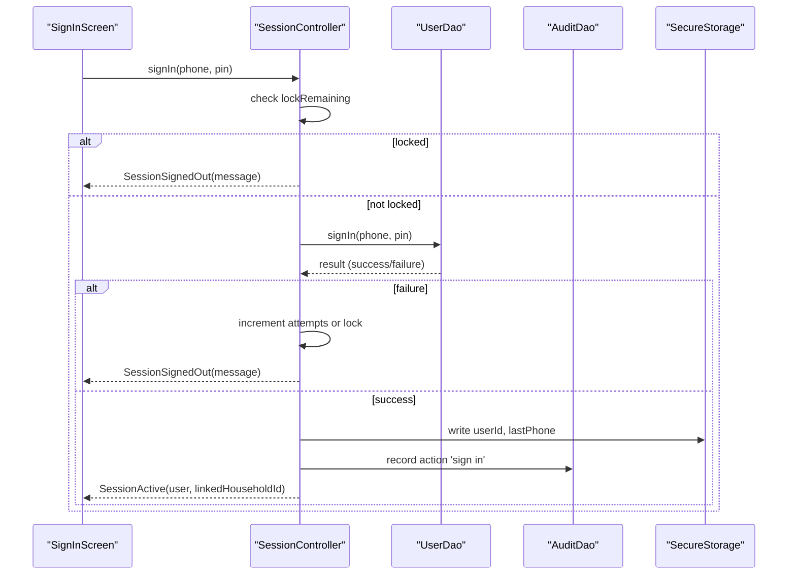
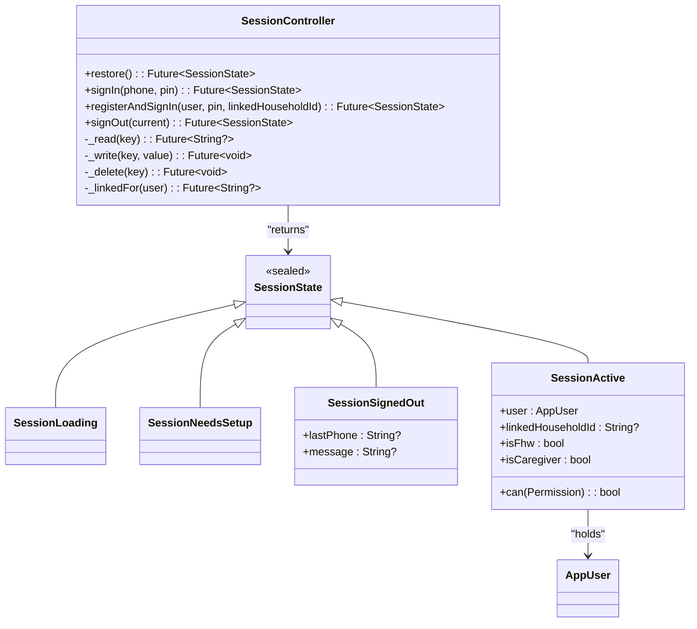
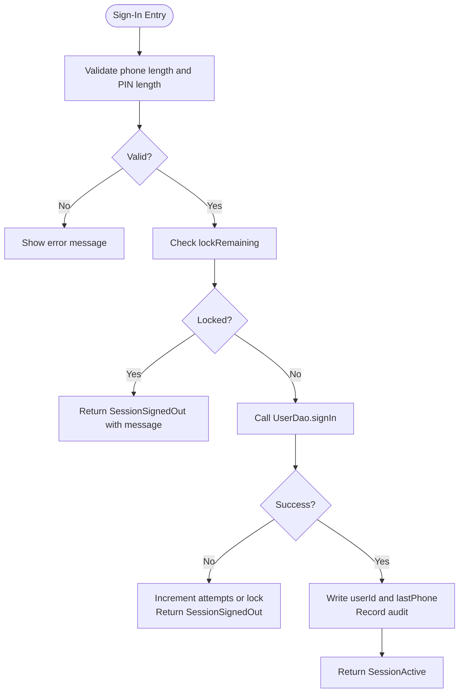
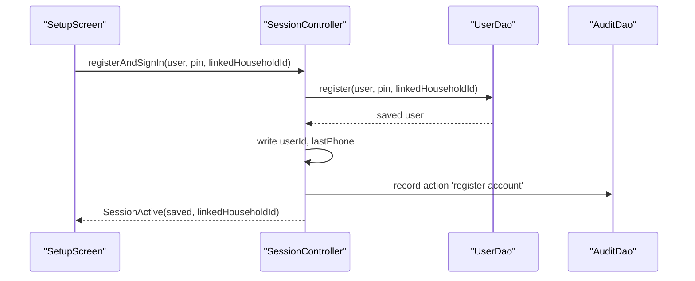
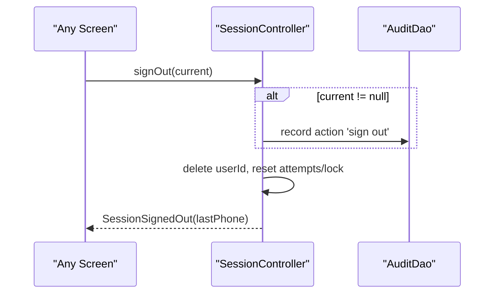
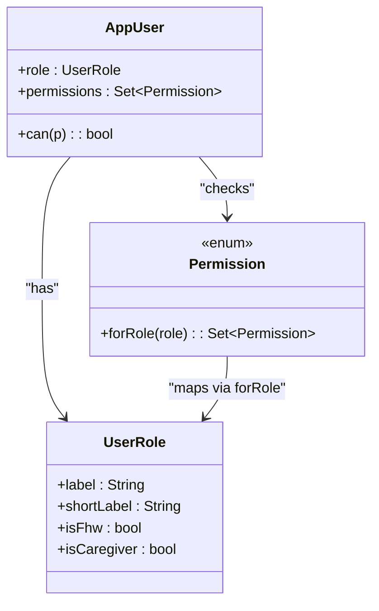
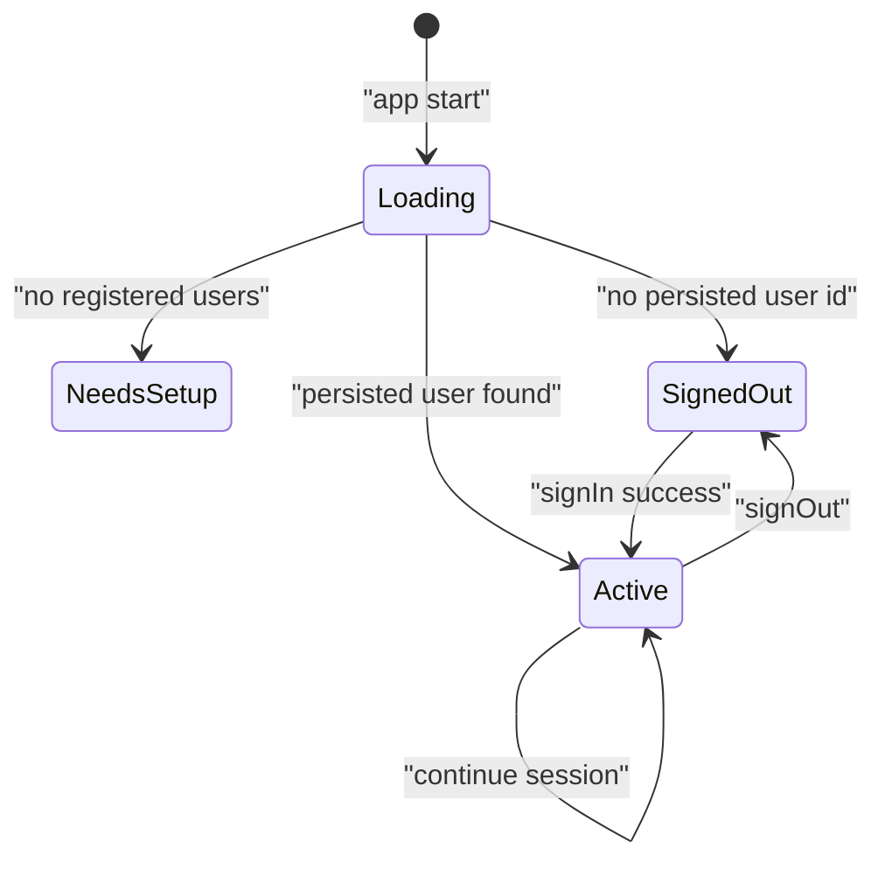
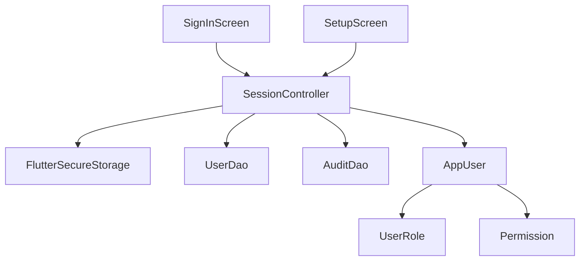

# Session Management & Authentication Flow

<cite>
**Referenced Files in This Document**
- [session.dart](file://lib/core/auth/session.dart)
- [core.dart](file://lib/domain/entities/core.dart)
- [enums.dart](file://lib/domain/enums.dart)
- [sign_in_screen.dart](file://lib/presentation/auth/sign_in_screen.dart)
- [setup_screen.dart](file://lib/presentation/auth/setup_screen.dart)
- [rbac_test.dart](file://test/rbac_test.dart)
</cite>

## Table of Contents
1. [Introduction](#introduction)
2. [Project Structure](#project-structure)
3. [Core Components](#core-components)
4. [Architecture Overview](#architecture-overview)
5. [Detailed Component Analysis](#detailed-component-analysis)
6. [Dependency Analysis](#dependency-analysis)
7. [Performance Considerations](#performance-considerations)
8. [Troubleshooting Guide](#troubleshooting-guide)
9. [Conclusion](#conclusion)

## Introduction
This document explains CareBridge AI’s session management and authentication flow with a focus on the PIN-based sign-in system, session lifecycle, role-based access control (RBAC), and how sessions integrate with routing guards and data access permissions. It covers the SessionController implementation, SessionState transitions, and security considerations for shared handsets in low-resource environments.

## Project Structure
The session and authentication logic is implemented in the core layer and presented through dedicated screens:
- Core session controller and state types live under lib/core/auth.
- Domain entities and enums define roles, permissions, and user context.
- Presentation screens implement PIN entry, registration, and setup flows.
- Tests validate RBAC boundaries and role routing.

**Diagram sources**
- [session.dart:28-67](file://lib/core/auth/session.dart#L28-L67)
- [core.dart:6-40](file://lib/domain/entities/core.dart#L6-L40)
- [enums.dart:10-66](file://lib/domain/enums.dart#L10-L66)
- [sign_in_screen.dart:23-74](file://lib/presentation/auth/sign_in_screen.dart#L23-L74)
- [setup_screen.dart:31-51](file://lib/presentation/auth/setup_screen.dart#L31-L51)

**Section sources**
- [session.dart:1-245](file://lib/core/auth/session.dart#L1-L245)
- [core.dart:1-97](file://lib/domain/entities/core.dart#L1-L97)
- [enums.dart:1-66](file://lib/domain/enums.dart#L1-L66)
- [sign_in_screen.dart:1-206](file://lib/presentation/auth/sign_in_screen.dart#L1-L206)
- [setup_screen.dart:1-143](file://lib/presentation/auth/setup_screen.dart#L1-L143)

## Core Components
- SessionController orchestrates restore, sign-in, registration, and sign-out. It persists only identifiers and last phone number; PINs never leave secure storage.
- SessionState models app shell states: loading, needs setup, active, signed out.
- AppUser encapsulates identity and role-scoped permissions via Permission.forRole.
- UserRole and Permission define RBAC capabilities and role checks.

Key responsibilities:
- Restore previous session safely without exposing PINs.
- Enforce per-device lockout after repeated failures.
- Record audit events for sign-in, registration, and sign-out.
- Resolve caregiver household scoping at sign-in time.

**Section sources**
- [session.dart:71-245](file://lib/core/auth/session.dart#L71-L245)
- [core.dart:6-40](file://lib/domain/entities/core.dart#L6-L40)
- [enums.dart:10-66](file://lib/domain/enums.dart#L10-L66)

## Architecture Overview
The authentication flow integrates UI, session controller, and domain models to ensure secure, resilient operation on shared devices.

**Diagram sources**
- [session.dart:114-162](file://lib/core/auth/session.dart#L114-L162)
- [sign_in_screen.dart:43-74](file://lib/presentation/auth/sign_in_screen.dart#L43-L74)

## Detailed Component Analysis

### SessionController and SessionState
- SessionState variants:
  - SessionLoading: reading secure storage; no sign-in form shown.
  - SessionNeedsSetup: first-run device setup.
  - SessionSignedOut: requires sign-in; may prefill last phone and show message.
  - SessionActive: authenticated user with optional linkedHouseholdId for caregivers.
- SessionController methods:
  - restore(): determines initial state by checking registrations and persisted user id.
  - signIn(): validates lockout, authenticates via UserDao, persists identifiers, records audit, returns active session.
  - registerAndSignIn(): creates account and signs in immediately; persists identifiers and records audit.
  - signOut(): clears persisted identifiers, resets lockout counters, returns signed-out state.
  - _linkedFor(): resolves caregiver household scope once at sign-in.

**Diagram sources**
- [session.dart:28-67](file://lib/core/auth/session.dart#L28-L67)
- [session.dart:71-245](file://lib/core/auth/session.dart#L71-L245)
- [core.dart:6-40](file://lib/domain/entities/core.dart#L6-L40)

**Section sources**
- [session.dart:28-67](file://lib/core/auth/session.dart#L28-L67)
- [session.dart:71-245](file://lib/core/auth/session.dart#L71-L245)

### PIN-Based Authentication Flow
- Input validation occurs in the sign-in screen before calling the session controller.
- The controller enforces per-device lockout after repeated failures and returns informative messages.
- On success, identifiers are stored securely and an audit event is recorded.

**Diagram sources**
- [sign_in_screen.dart:43-74](file://lib/presentation/auth/sign_in_screen.dart#L43-L74)
- [session.dart:114-162](file://lib/core/auth/session.dart#L114-L162)

**Section sources**
- [sign_in_screen.dart:43-74](file://lib/presentation/auth/sign_in_screen.dart#L43-L74)
- [session.dart:114-162](file://lib/core/auth/session.dart#L114-L162)

### Registration and Setup Flow
- First-run detection leads to SessionNeedsSetup.
- SetupScreen supports two distinct registration paths:
  - Frontline Health Worker: collects region/district/community, CHPS zone, facility, staff ID, and PIN.
  - Caregiver: binds account to a household via family code lookup and sets PIN.
- Upon successful registration, the controller persists identifiers and records audit, returning SessionActive.

**Diagram sources**
- [setup_screen.dart:358-405](file://lib/presentation/auth/setup_screen.dart#L358-L405)
- [session.dart:169-191](file://lib/core/auth/session.dart#L169-L191)

**Section sources**
- [setup_screen.dart:31-143](file://lib/presentation/auth/setup_screen.dart#L31-L143)
- [setup_screen.dart:358-405](file://lib/presentation/auth/setup_screen.dart#L358-L405)
- [session.dart:169-191](file://lib/core/auth/session.dart#L169-L191)

### Sign-Out Flow
- Explicit sign-out clears persisted identifiers and resets lockout counters.
- An audit event is recorded if a current user exists.
- Returns SessionSignedOut with last phone prefill for convenience.

**Diagram sources**
- [session.dart:193-206](file://lib/core/auth/session.dart#L193-L206)

**Section sources**
- [session.dart:193-206](file://lib/core/auth/session.dart#L193-L206)

### Role-Based Access Control (RBAC)
- Roles:
  - UserRole.frontlineHealthWorker: full clinical scope.
  - UserRole.caregiver: limited to family-scoped triage and barrier recording.
- Permissions:
  - Permission enum defines capabilities like viewOwnFamilyOnly, runClinicalAssessment, issueReferral, etc.
  - Permission.forRole maps roles to permission sets.
- AppUser.permissions derives from role; can(permission) checks membership.
- Tests assert exact permission sets and role routing behavior.

**Diagram sources**
- [enums.dart:10-66](file://lib/domain/enums.dart#L10-L66)
- [core.dart:6-40](file://lib/domain/entities/core.dart#L6-L40)
- [rbac_test.dart:20-91](file://test/rbac_test.dart#L20-L91)

**Section sources**
- [enums.dart:10-66](file://lib/domain/enums.dart#L10-L66)
- [core.dart:6-40](file://lib/domain/entities/core.dart#L6-L40)
- [rbac_test.dart:20-91](file://test/rbac_test.dart#L20-L91)

### Session Lifecycle and State Transitions
- Initialization:
  - restore() returns SessionLoading while reading secure storage; actual state determined by DAO checks and persisted user id.
- First-run:
  - If no registered users exist, return SessionNeedsSetup.
- Sign-in:
  - Successful authentication transitions to SessionActive with user and scoped household id (caregivers).
  - Failures return SessionSignedOut with messages and potential lockout.
- Sign-out:
  - Clears persistence and returns SessionSignedOut.

**Diagram sources**
- [session.dart:97-112](file://lib/core/auth/session.dart#L97-L112)
- [session.dart:114-162](file://lib/core/auth/session.dart#L114-L162)
- [session.dart:193-206](file://lib/core/auth/session.dart#L193-L206)

**Section sources**
- [session.dart:97-112](file://lib/core/auth/session.dart#L97-L112)
- [session.dart:114-162](file://lib/core/auth/session.dart#L114-L162)
- [session.dart:193-206](file://lib/core/auth/session.dart#L193-L206)

### Integration with Routing Guards and Data Access
- Routing decisions should be driven by SessionState:
  - SessionLoading: show splash; do not render auth forms.
  - SessionNeedsSetup: route to setup flow.
  - SessionSignedOut: route to sign-in; prefill last phone when available.
  - SessionActive: allow access to protected routes based on user permissions.
- Data access permissions:
  - Use AppUser.can(permission) to gate features and API calls.
  - For caregivers, use linkedHouseholdId to scope queries to their family.
  - For frontline health workers, use broader scopes defined by role permissions.

[No sources needed since this section provides general guidance]

## Dependency Analysis
SessionController depends on secure storage, DAOs for user operations, and audit logging. Presentation layers depend on the session provider to react to state changes.

**Diagram sources**
- [session.dart:71-245](file://lib/core/auth/session.dart#L71-L245)
- [core.dart:6-40](file://lib/domain/entities/core.dart#L6-L40)
- [enums.dart:10-66](file://lib/domain/enums.dart#L10-L66)
- [sign_in_screen.dart:23-74](file://lib/presentation/auth/sign_in_screen.dart#L23-L74)
- [setup_screen.dart:31-51](file://lib/presentation/auth/setup_screen.dart#L31-L51)

**Section sources**
- [session.dart:71-245](file://lib/core/auth/session.dart#L71-L245)
- [core.dart:6-40](file://lib/domain/entities/core.dart#L6-L40)
- [enums.dart:10-66](file://lib/domain/enums.dart#L10-L66)
- [sign_in_screen.dart:23-74](file://lib/presentation/auth/sign_in_screen.dart#L23-L74)
- [setup_screen.dart:31-51](file://lib/presentation/auth/setup_screen.dart#L31-L51)

## Performance Considerations
- Secure storage access is wrapped with try/catch to avoid crashes on platforms where it is unavailable or misconfigured.
- Lockout state is in-memory only; avoids persistent overhead and aligns with threat model.
- Household scoping for caregivers is resolved once at sign-in to minimize repeated queries.
- Minimal UI reflows during sign-in by validating locally and deferring heavy work to the controller.

[No sources needed since this section provides general guidance]

## Troubleshooting Guide
Common issues and resolutions:
- Persistent storage errors:
  - Secure storage read/write/delete are guarded; failures degrade gracefully to “not remembered”.
- Lockout messages:
  - After max failed attempts, keypad locks for a fixed duration; wait until lock expires.
- Missing last phone prefill:
  - Ensure last phone was written during sign-in or registration; otherwise, clear or corrupted storage may prevent prefill.
- Audit logs missing:
  - Verify audit recording calls are executed on sign-in, registration, and sign-out paths.

**Section sources**
- [session.dart:221-243](file://lib/core/auth/session.dart#L221-L243)
- [session.dart:114-162](file://lib/core/auth/session.dart#L114-L162)
- [session.dart:169-191](file://lib/core/auth/session.dart#L169-L191)
- [session.dart:193-206](file://lib/core/auth/session.dart#L193-L206)

## Conclusion
CareBridge AI’s session management emphasizes security and usability on shared, low-resource devices. The PIN-based authentication, explicit sign-out, and per-device lockout protect against idle guessing while maintaining smooth workflows. RBAC ensures strict capability boundaries between frontline health workers and caregivers, with household scoping enforced at sign-in. Integrating session state into routing and data access guarantees consistent, secure behavior across the application.