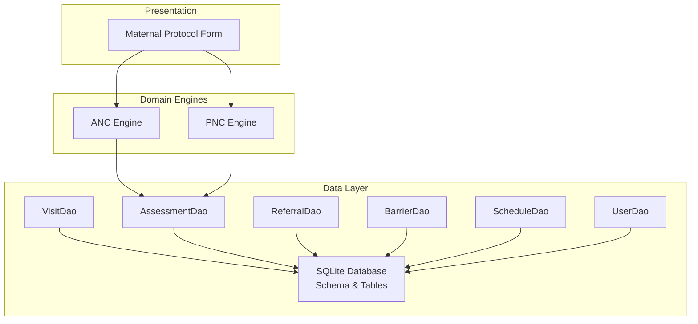
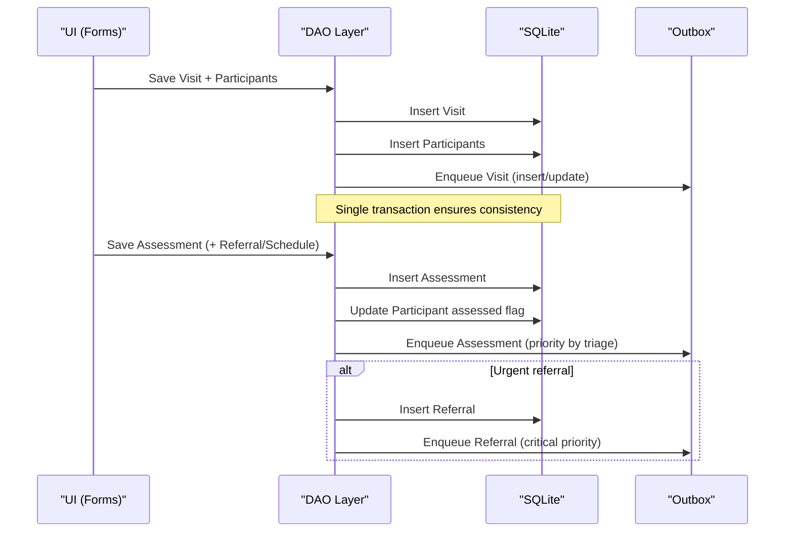
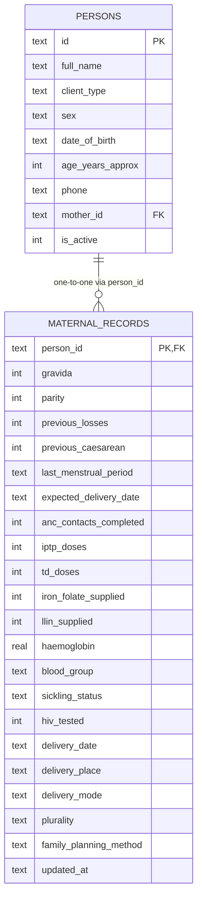
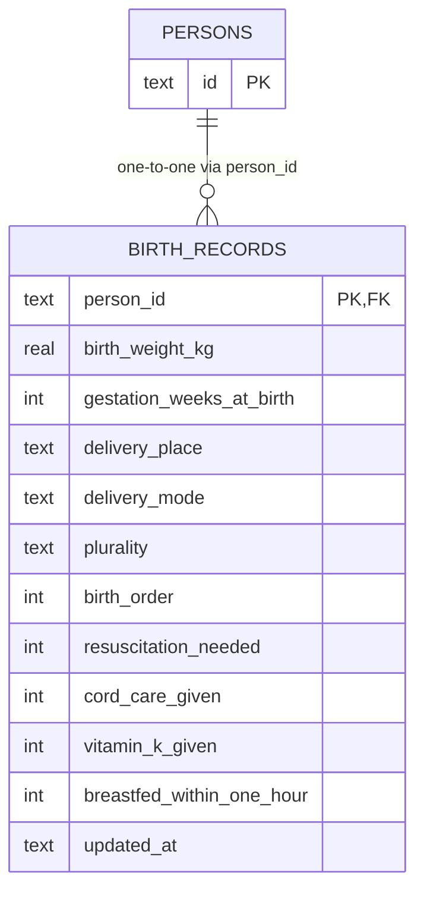
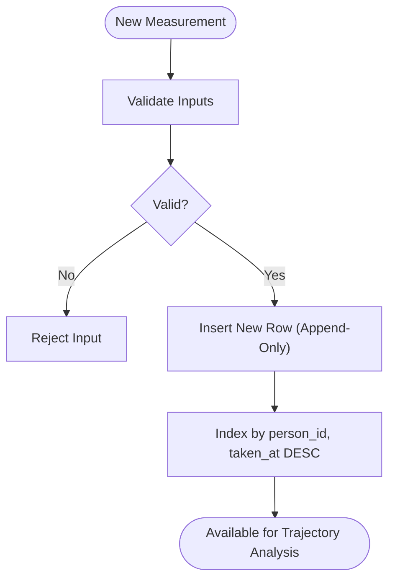
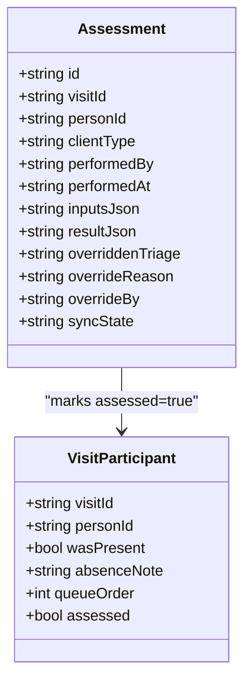
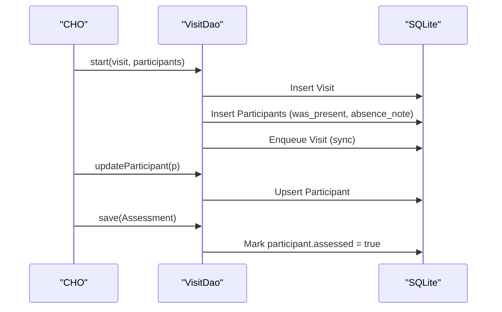
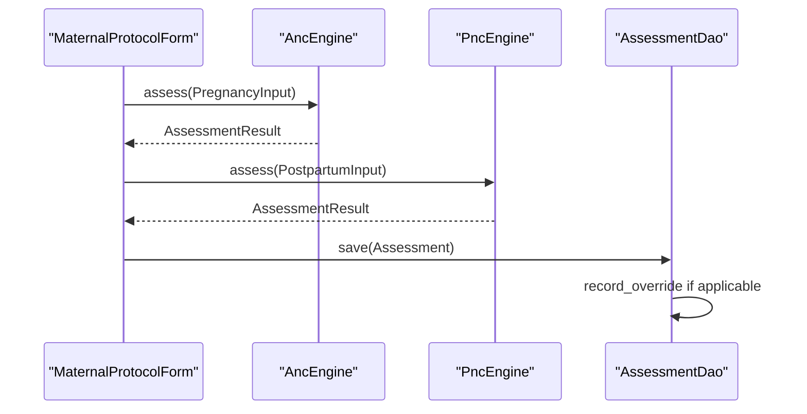
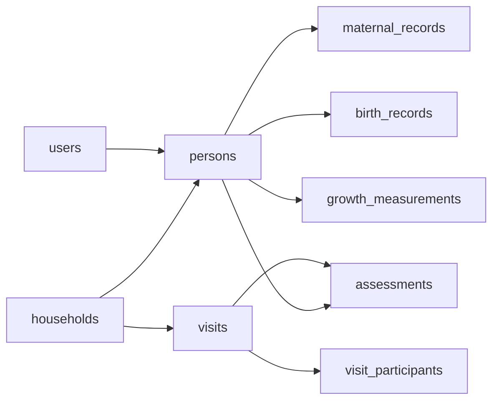

# Clinical Data Models

<cite>
**Referenced Files in This Document**
- [app_database.dart](file://lib/data/local/app_database.dart)
- [visit_dao.dart](file://lib/data/local/visit_dao.dart)
- [user_dao.dart](file://lib/data/local/user_dao.dart)
- [maternal_form.dart](file://lib/presentation/assessment/maternal_form.dart)
- [anc_engine.dart](file://lib/domain/engines/anc_engine.dart)
- [pnc_engine.dart](file://lib/domain/engines/pnc_engine.dart)
</cite>

## Table of Contents
1. [Introduction](#introduction)
2. [Project Structure](#project-structure)
3. [Core Components](#core-components)
4. [Architecture Overview](#architecture-overview)
5. [Detailed Component Analysis](#detailed-component-analysis)
6. [Dependency Analysis](#dependency-analysis)
7. [Performance Considerations](#performance-considerations)
8. [Troubleshooting Guide](#troubleshooting-guide)
9. [Conclusion](#conclusion)

## Introduction
This document explains CareBridge AI’s clinical data models and the design principles that ensure reliable, auditable, and analysis-ready maternal and child health records. It focuses on:
- Maternal records mirroring Ghana’s Maternal Health Record Book for seamless transcription
- Birth records optimized to drive young-infant risk modeling with critical fields such as birth weight and asphyxia indicators
- Growth measurements designed as an append-only series to preserve complete clinical history for trajectory analysis
- Assessments storing both raw inputs and computed results to enable model re-evaluation and back-testing
- Visit participants tracking who was present during encounters even when assessments were skipped
- Foreign key constraints, soft delete patterns, and integrity measures that protect sensitive clinical data

## Project Structure
The clinical data layer is implemented as a local SQLite database with hand-written schema and DAOs. The schema defines core tables for users, households, persons, maternal/birth records, growth measurements, visits, visit participants, assessments, referrals, barrier reports, scheduled contacts, sync outbox, and audit log. DAOs encapsulate all persistence operations, including atomic transactions and sync enqueuing.

**Diagram sources**
- [app_database.dart:168-173](file://lib/data/local/app_database.dart#L168-L173)
- [visit_dao.dart:84-135](file://lib/data/local/visit_dao.dart#L84-L135)
- [visit_dao.dart:271-365](file://lib/data/local/visit_dao.dart#L271-L365)
- [user_dao.dart:117-167](file://lib/data/local/user_dao.dart#L117-L167)
- [anc_engine.dart:158-196](file://lib/domain/engines/anc_engine.dart#L158-L196)
- [pnc_engine.dart:164-206](file://lib/domain/engines/pnc_engine.dart#L164-L206)
- [maternal_form.dart:37-67](file://lib/presentation/assessment/maternal_form.dart#L37-L67)

**Section sources**
- [app_database.dart:168-173](file://lib/data/local/app_database.dart#L168-L173)
- [visit_dao.dart:1-20](file://lib/data/local/visit_dao.dart#L1-L20)

## Core Components
- Maternal Records: One row per woman, aligned with Ghana’s Maternal Health Record Book fields to minimize translation overhead for community health workers. Includes obstetric history, ANC/PNC indicators, lab values, and delivery details.
- Birth Records: Fixed at birth; includes birth weight, gestational age, resuscitation needs, vitamin K, breastfeeding initiation, and other factors that drive young-infant risk modeling.
- Growth Measurements: Append-only series capturing MUAC, weight, height, and oedema status over time to support trajectory analysis without altering historical readings.
- Visits and Visit Participants: A visit is a container for multiple clients; participants record presence and whether assessment occurred, enabling defaulter detection and accurate coverage metrics.
- Assessments: Store raw inputs and computed results, plus clinician overrides, to allow re-running models and auditing decisions.
- Referrals, Barrier Reports, Scheduled Contacts, Sync Outbox, Audit Log: Support last-mile care continuity, pattern detection, follow-up automation, offline-first sync, and compliance auditing.

**Section sources**
- [app_database.dart:286-312](file://lib/data/local/app_database.dart#L286-L312)
- [app_database.dart:319-335](file://lib/data/local/app_database.dart#L319-L335)
- [app_database.dart:342-356](file://lib/data/local/app_database.dart#L342-L356)
- [app_database.dart:362-377](file://lib/data/local/app_database.dart#L362-L377)
- [app_database.dart:385-397](file://lib/data/local/app_database.dart#L385-L397)
- [app_database.dart:404-427](file://lib/data/local/app_database.dart#L404-L427)

## Architecture Overview
The system follows an offline-first architecture where SQLite is the source of truth. All writes commit locally and immediately, with a corresponding outbox entry queued in the same transaction. Sync occurs asynchronously. Foreign keys are enforced to maintain referential integrity across entities.

**Diagram sources**
- [visit_dao.dart:104-135](file://lib/data/local/visit_dao.dart#L104-L135)
- [visit_dao.dart:271-365](file://lib/data/local/visit_dao.dart#L271-L365)
- [app_database.dart:90-103](file://lib/data/local/app_database.dart#L90-L103)

## Detailed Component Analysis

### Maternal Records
- Purpose: Mirror Ghana’s Maternal Health Record Book fields to streamline transcription and reduce cognitive load for CHOs.
- Key fields: Gravida, parity, previous losses, previous caesarean, LMP, EDD, ANC contacts completed, IPTT doses, TD doses, iron/folate supplied, LLIN supplied, hemoglobin, blood group, sickling status, HIV tested, delivery date/place/mode, plurality, family planning method.
- Integrity: Primary key tied to person_id with cascade delete; updated_at tracks changes.

**Diagram sources**
- [app_database.dart:256-281](file://lib/data/local/app_database.dart#L256-L281)
- [app_database.dart:286-312](file://lib/data/local/app_database.dart#L286-L312)

**Section sources**
- [app_database.dart:286-312](file://lib/data/local/app_database.dart#L286-L312)

### Birth Records
- Purpose: Capture fixed-at-birth facts that drive young-infant risk modeling for the first 59 days.
- Critical fields: Birth weight (kg), gestation weeks at birth, delivery place/mode, plurality, birth order, resuscitation needed, cord care given, vitamin K given, breastfed within one hour.
- Integrity: Primary key tied to person_id with cascade delete; updated_at maintained.

**Diagram sources**
- [app_database.dart:319-335](file://lib/data/local/app_database.dart#L319-L335)

**Section sources**
- [app_database.dart:319-335](file://lib/data/local/app_database.dart#L319-L335)

### Growth Measurements (Append-Only Design)
- Principle: Append-only to preserve complete clinical history for trajectory analysis. Mis-measurements are added as new rows rather than overwritten.
- Fields: Person link, timestamp, MUAC, weight, height, bilateral oedema indicator, recorded_by.
- Indexing: Optimized queries by person and descending date for trend analysis.

**Diagram sources**
- [app_database.dart:342-356](file://lib/data/local/app_database.dart#L342-L356)

**Section sources**
- [app_database.dart:342-356](file://lib/data/local/app_database.dart#L342-L356)

### Assessments (Raw Inputs + Computed Results)
- Purpose: Persist both raw inputs and computed results to enable model re-evaluation and back-testing.
- Fields: Visit/person linkage, performed_by/at, inputs_json, result_json, overridden_triage, override_reason/by, sync_state.
- Overrides: Clinician overrides are recorded with reason and actor, creating honest training signals for model improvement.

**Diagram sources**
- [app_database.dart:404-427](file://lib/data/local/app_database.dart#L404-L427)
- [visit_dao.dart:337-365](file://lib/data/local/visit_dao.dart#L337-L365)

**Section sources**
- [app_database.dart:404-427](file://lib/data/local/app_database.dart#L404-L427)
- [visit_dao.dart:337-365](file://lib/data/local/visit_dao.dart#L337-L365)

### Visit Participants System
- Purpose: Track who was present during encounters regardless of whether assessments were completed. Absence notes capture reasons like “twin not brought,” which is a strong signal for proactive follow-up.
- Fields: visit_id, person_id, was_present, absence_note, queue_order, assessed.
- Queries: Recent absentees and days since last visit feed vulnerability scoring and defaulter lists.

**Diagram sources**
- [visit_dao.dart:104-135](file://lib/data/local/visit_dao.dart#L104-L135)
- [visit_dao.dart:217-235](file://lib/data/local/visit_dao.dart#L217-L235)
- [visit_dao.dart:337-365](file://lib/data/local/visit_dao.dart#L337-L365)

**Section sources**
- [app_database.dart:385-397](file://lib/data/local/app_database.dart#L385-L397)
- [visit_dao.dart:217-235](file://lib/data/local/visit_dao.dart#L217-L235)

### Maternal Protocol Form and Engines
- Maternal form collects inputs used by ANC and PNC engines to compute findings, actions, danger signs, missing measurements, and triage levels.
- Engines implement protocol-driven logic for obstetric emergencies, postpartum hemorrhage, and other high-risk conditions.

**Diagram sources**
- [maternal_form.dart:37-67](file://lib/presentation/assessment/maternal_form.dart#L37-L67)
- [anc_engine.dart:158-196](file://lib/domain/engines/anc_engine.dart#L158-L196)
- [pnc_engine.dart:164-206](file://lib/domain/engines/pnc_engine.dart#L164-L206)
- [visit_dao.dart:418-460](file://lib/data/local/visit_dao.dart#L418-L460)

**Section sources**
- [maternal_form.dart:37-67](file://lib/presentation/assessment/maternal_form.dart#L37-L67)
- [anc_engine.dart:158-196](file://lib/domain/engines/anc_engine.dart#L158-L196)
- [pnc_engine.dart:164-206](file://lib/domain/engines/pnc_engine.dart#L164-L206)

## Dependency Analysis
- Referential Integrity: Foreign keys enforce relationships between persons, maternal/birth records, visits, participants, and assessments. Cascade deletes keep orphaned data from skewing analytics.
- Soft Deletes: Persons include an active flag to support soft deletion while preserving history.
- Sync Consistency: Outbox entries are enqueued in the same transaction as the primary write, ensuring no record exists without its sync intent.

**Diagram sources**
- [app_database.dart:200-221](file://lib/data/local/app_database.dart#L200-L221)
- [app_database.dart:227-250](file://lib/data/local/app_database.dart#L227-L250)
- [app_database.dart:256-281](file://lib/data/local/app_database.dart#L256-L281)
- [app_database.dart:286-312](file://lib/data/local/app_database.dart#L286-L312)
- [app_database.dart:319-335](file://lib/data/local/app_database.dart#L319-L335)
- [app_database.dart:342-356](file://lib/data/local/app_database.dart#L342-L356)
- [app_database.dart:362-377](file://lib/data/local/app_database.dart#L362-L377)
- [app_database.dart:385-397](file://lib/data/local/app_database.dart#L385-L397)
- [app_database.dart:404-427](file://lib/data/local/app_database.dart#L404-L427)

**Section sources**
- [app_database.dart:90-103](file://lib/data/local/app_database.dart#L90-L103)
- [app_database.dart:256-281](file://lib/data/local/app_database.dart#L256-L281)
- [app_database.dart:362-377](file://lib/data/local/app_database.dart#L362-L377)

## Performance Considerations
- Indexing Strategy:
  - Growth measurements indexed by person_id and taken_at DESC for efficient trajectory queries.
  - Assessments indexed by person and visit for rapid retrieval.
  - Referrals and barriers indexed for urgent queries and pattern detection.
- Transactional Writes: All critical writes occur in single transactions to avoid partial states and ensure immediate availability offline.
- Query Optimization: Composite indexes support common workflows like “Plan My Day” and recent absentee lists.

[No sources needed since this section provides general guidance]

## Troubleshooting Guide
- Missing or Inconsistent Data:
  - Verify foreign key enforcement is enabled; orphaned children can skew counts if disabled.
  - Check soft delete flags on persons to ensure active filtering in queries.
- Sync Issues:
  - Inspect outbox pending items and last_error fields to diagnose failed transmissions.
  - Ensure urgent referrals have critical priority to expedite sync.
- Audit and Compliance:
  - Review audit log for permission denials and clinical overrides to understand access patterns and decision changes.

**Section sources**
- [app_database.dart:90-103](file://lib/data/local/app_database.dart#L90-L103)
- [app_database.dart:515-533](file://lib/data/local/app_database.dart#L515-L533)
- [user_dao.dart:382-413](file://lib/data/local/user_dao.dart#L382-L413)

## Conclusion
CareBridge AI’s clinical data models prioritize data integrity, clinical utility, and analytical readiness. The append-only growth measurements preserve complete histories for trajectory analysis; maternal and birth records align with national formats and risk modeling needs; assessments store both inputs and outputs to support re-evaluation; and visit participants ensure visibility into encounter completeness. Strong foreign key constraints, soft delete patterns, and robust audit logging safeguard sensitive health data while enabling actionable insights.