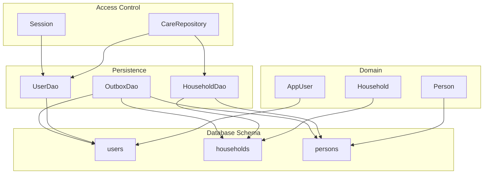
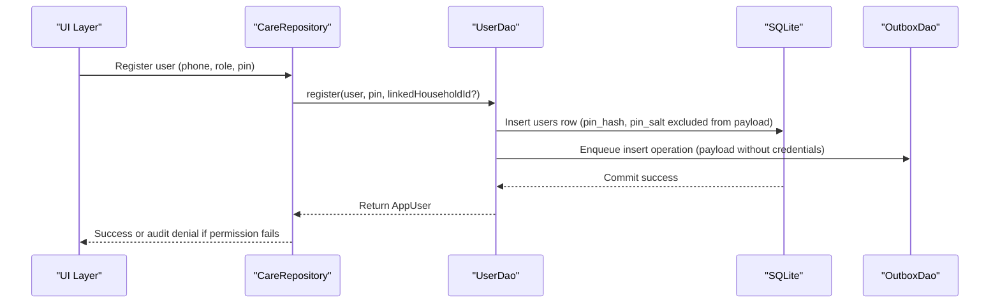
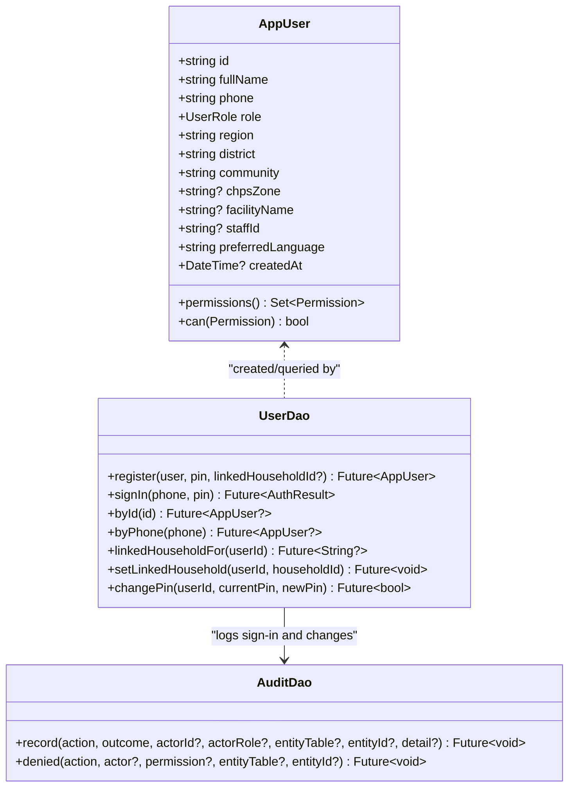
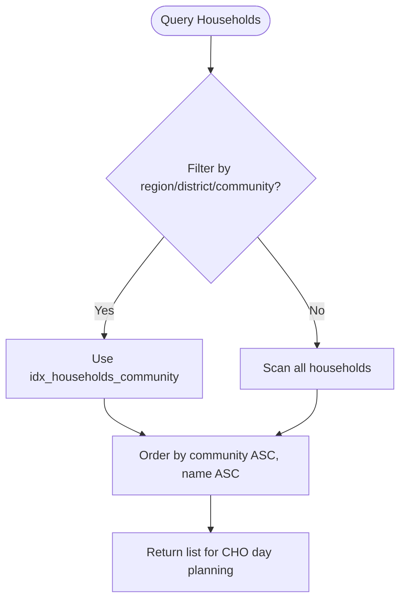
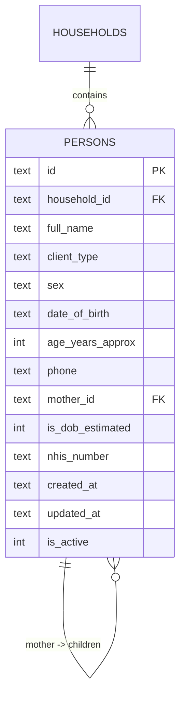
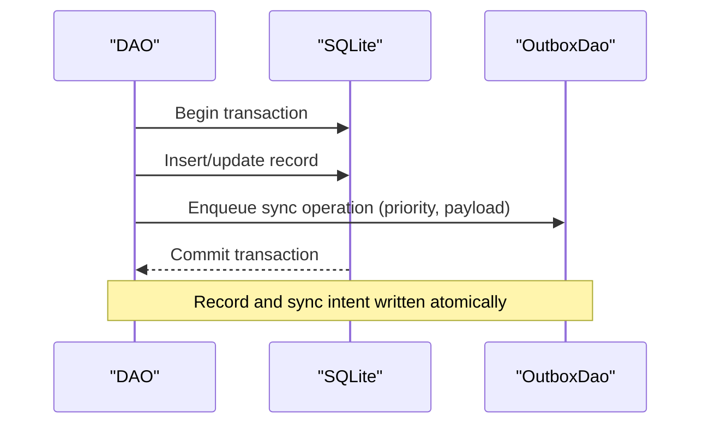
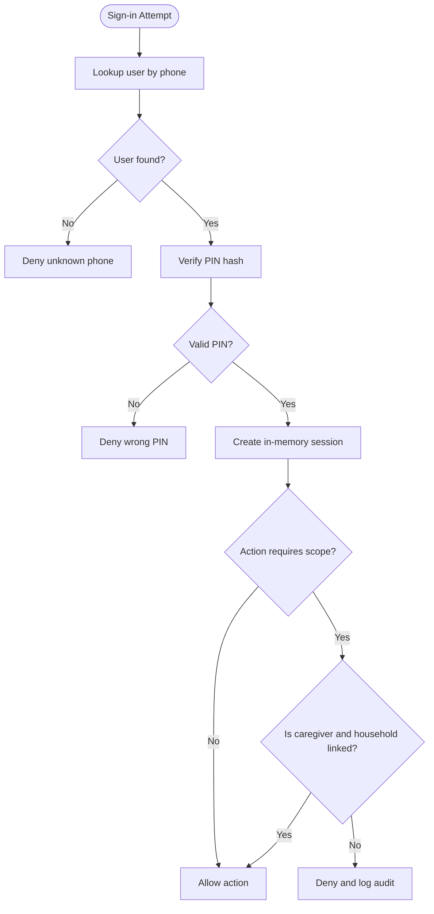
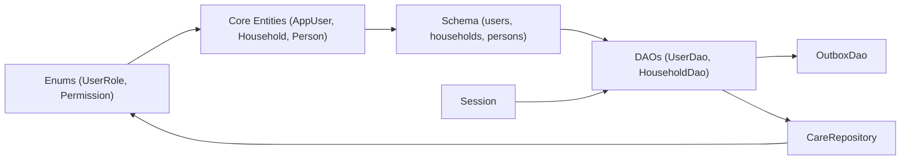

# Core Entities

<cite>
**Referenced Files in This Document**
- [core.dart](file://lib/domain/entities/core.dart)
- [enums.dart](file://lib/domain/enums.dart)
- [app_database.dart](file://lib/data/local/app_database.dart)
- [user_dao.dart](file://lib/data/local/user_dao.dart)
- [household_dao.dart](file://lib/data/local/household_dao.dart)
- [outbox_dao.dart](file://lib/data/local/outbox_dao.dart)
- [care_repository.dart](file://lib/data/repositories/care_repository.dart)
- [session.dart](file://lib/core/auth/session.dart)
</cite>

## Table of Contents
1. [Introduction](#introduction)
2. [Project Structure](#project-structure)
3. [Core Components](#core-components)
4. [Architecture Overview](#architecture-overview)
5. [Detailed Component Analysis](#detailed-component-analysis)
6. [Dependency Analysis](#dependency-analysis)
7. [Performance Considerations](#performance-considerations)
8. [Troubleshooting Guide](#troubleshooting-guide)
9. [Conclusion](#conclusion)

## Introduction
This document provides a comprehensive data model for CareBridge AI’s core entities: users, households, and persons. It explains how the user entity supports role-based access control (CHO vs caregiver), authentication with PIN hashing, and device sharing scenarios. The household entity is documented as the primary unit of care delivery with geographic hierarchy and location tracking. The persons table consolidates women, newborns, and under-fives into a single flat structure to simplify CHO workflows. The document also covers foreign key relationships, indexing strategies optimized for mobile performance, offline-first architecture support, common queries, and data validation rules.

## Project Structure
The data model spans domain entities, database schema definitions, DAOs for persistence, and repositories enforcing access control. Key files include:
- Domain entities define the shape of data and derived properties.
- Database schema defines tables, constraints, and indexes.
- DAOs implement CRUD operations and sync outbox integration.
- Repositories enforce permissions and scope scoping.
- Session management handles shared-device sign-in flows.

**Diagram sources**
- [core.dart:1-100](file://lib/domain/entities/core.dart#L1-L100)
- [app_database.dart:194-281](file://lib/data/local/app_database.dart#L194-L281)
- [user_dao.dart:117-167](file://lib/data/local/user_dao.dart#L117-L167)
- [household_dao.dart:1-77](file://lib/data/local/household_dao.dart#L1-L77)
- [outbox_dao.dart:1-33](file://lib/data/local/outbox_dao.dart#L1-L33)
- [care_repository.dart:1-102](file://lib/data/repositories/care_repository.dart#L1-L102)
- [session.dart:1-32](file://lib/core/auth/session.dart#L1-L32)

**Section sources**
- [core.dart:1-205](file://lib/domain/entities/core.dart#L1-L205)
- [app_database.dart:194-281](file://lib/data/local/app_database.dart#L194-L281)
- [user_dao.dart:1-167](file://lib/data/local/user_dao.dart#L1-L167)
- [household_dao.dart:1-77](file://lib/data/local/household_dao.dart#L1-L77)
- [outbox_dao.dart:1-33](file://lib/data/local/outbox_dao.dart#L1-L33)
- [care_repository.dart:1-102](file://lib/data/repositories/care_repository.dart#L1-L102)
- [session.dart:1-32](file://lib/core/auth/session.dart#L1-L32)

## Core Components
- AppUser: Represents a CareBridge user with role-based permissions, geographic context, and language preferences. Supports multiple accounts on one device.
- Household: Represents a compound/family unit with geographic hierarchy (region, district, community), location tracking, and metadata used for visit planning.
- Person: Flat table representing women, newborns, and under-fives within a household, enabling simplified roll-call workflows and age-driven client type resolution.

Key design principles:
- Offline-first: SQLite is the source of truth; writes commit locally immediately and enqueue sync intent in the same transaction.
- Role-based access control: Permissions are enforced at the repository layer; caregivers are scoped to a linked household.
- Mobile performance: Indexes tailored to CHO queries and zone-level filtering.

**Section sources**
- [core.dart:1-205](file://lib/domain/entities/core.dart#L1-L205)
- [app_database.dart:194-281](file://lib/data/local/app_database.dart#L194-L281)
- [care_repository.dart:1-102](file://lib/data/repositories/care_repository.dart#L1-L102)

## Architecture Overview
The data model integrates domain entities with a hand-written SQLite schema and DAOs that ensure offline-first guarantees through an outbox mechanism. Access control is centralized via a repository that enforces permissions and scopes.

**Diagram sources**
- [user_dao.dart:125-167](file://lib/data/local/user_dao.dart#L125-L167)
- [app_database.dart:194-221](file://lib/data/local/app_database.dart#L194-L221)
- [outbox_dao.dart:1-33](file://lib/data/local/outbox_dao.dart#L1-L33)
- [care_repository.dart:1-102](file://lib/data/repositories/care_repository.dart#L1-L102)

## Detailed Component Analysis

### Users Entity and Authentication
- Fields: id, full_name, phone (unique per device), role (frontlineHealthWorker or caregiver), region, district, community, chps_zone (FHW only), facility_name, staff_id, preferred_language, created_at, pin_hash, pin_salt, linked_household_id (for caregiver scoping).
- Authentication: 4-digit PIN with per-user salt and PBKDF2-style stretching using HMAC-SHA256 iterations. Weak PINs are rejected during registration. Sign-in verifies hash and logs outcomes.
- Device sharing: Multiple accounts coexist on one Android phone; session remembers signed-in user ID but not the PIN itself. Lock-out is per-device and in-memory.
- Permissions: Derived from role; FHW has broad clinical scope; caregiver is limited to viewOwnFamilyOnly and triage actions.

**Diagram sources**
- [core.dart:1-97](file://lib/domain/entities/core.dart#L1-L97)
- [user_dao.dart:117-167](file://lib/data/local/user_dao.dart#L117-L167)
- [user_dao.dart:382-457](file://lib/data/local/user_dao.dart#L382-L457)

**Section sources**
- [core.dart:1-97](file://lib/domain/entities/core.dart#L1-L97)
- [user_dao.dart:1-167](file://lib/data/local/user_dao.dart#L1-L167)
- [user_dao.dart:382-457](file://lib/data/local/user_dao.dart#L382-L457)
- [session.dart:1-32](file://lib/core/auth/session.dart#L1-L32)

### Households Entity and Geographic Hierarchy
- Fields: id, name, region, district, community, created_by, head_name, contact_phone, latitude, longitude, family_size, has_valid_nhis, walking_minutes_to_facility, landmark, created_at, updated_at.
- Purpose: Primary unit of care delivery; captures geographic hierarchy and practical wayfinding details critical in low-resource settings.
- Indexing: Composite index on (region, district, community) optimizes zone/community queries; index on created_by supports worker-scoped lists.

**Diagram sources**
- [app_database.dart:227-249](file://lib/data/local/app_database.dart#L227-L249)
- [household_dao.dart:54-73](file://lib/data/local/household_dao.dart#L54-L73)

**Section sources**
- [core.dart:99-222](file://lib/domain/entities/core.dart#L99-L222)
- [app_database.dart:227-249](file://lib/data/local/app_database.dart#L227-L249)
- [household_dao.dart:54-73](file://lib/data/local/household_dao.dart#L54-L73)

### Persons Entity and Flat Design
- Fields: id, household_id (FK to households), full_name, client_type, sex, date_of_birth, age_years_approx, phone, mother_id (FK to persons), is_dob_estimated, nhis_number, created_at, updated_at, is_active.
- Design rationale: One flat table for women, newborns, and under-fives simplifies roll-call and multi-client visits. Effective client type is derived from age to follow protocol boundaries automatically.
- Relationships: Foreign keys enforce referential integrity; cascade deletes maintain consistency. Mother-child links enable maternal history retrieval for child assessments.
- Indexing: Composite index on (household_id, is_active) optimizes active-person queries per household; index on mother_id accelerates retrieving children for a mother; index on (client_type, is_active) supports type-filtered lists.

**Diagram sources**
- [app_database.dart:256-281](file://lib/data/local/app_database.dart#L256-L281)
- [core.dart:224-378](file://lib/domain/entities/core.dart#L224-L378)

**Section sources**
- [core.dart:224-378](file://lib/domain/entities/core.dart#L224-L378)
- [app_database.dart:256-281](file://lib/data/local/app_database.dart#L256-L281)
- [household_dao.dart:283-396](file://lib/data/local/household_dao.dart#L283-L396)

### Offline-First Architecture and Sync Outbox
- Principle: Every write commits locally and enqueues a sync operation in the same transaction. Records cannot exist without their sync intent, ensuring consistency even if the device crashes mid-write.
- Priority ordering: Urgent referrals are prioritized over routine registrations when connectivity is available briefly.
- Failure handling: Repeated failures are surfaced to humans rather than silently retried indefinitely.

**Diagram sources**
- [app_database.dart:1-22](file://lib/data/local/app_database.dart#L1-L22)
- [outbox_dao.dart:1-33](file://lib/data/local/outbox_dao.dart#L1-L33)
- [household_dao.dart:23-41](file://lib/data/local/household_dao.dart#L23-L41)

**Section sources**
- [app_database.dart:1-22](file://lib/data/local/app_database.dart#L1-L22)
- [outbox_dao.dart:1-33](file://lib/data/local/outbox_dao.dart#L1-L33)
- [household_dao.dart:23-41](file://lib/data/local/household_dao.dart#L23-L41)

### Role-Based Access Control and Device Sharing Scenarios
- Roles: Frontline Health Worker (FHW) and Caregiver. Permissions are capability-based and mapped per role.
- Device sharing: Multiple accounts on one device; session remembers user ID but not PIN; explicit sign-out required to switch roles.
- Scoping: Caregivers are bound to a linked household at registration; attempts to access other households result in denials logged in the audit trail.

**Diagram sources**
- [user_dao.dart:169-216](file://lib/data/local/user_dao.dart#L169-L216)
- [care_repository.dart:55-102](file://lib/data/repositories/care_repository.dart#L55-L102)
- [session.dart:1-32](file://lib/core/auth/session.dart#L1-L32)

**Section sources**
- [enums.dart:1-66](file://lib/domain/enums.dart#L1-L66)
- [user_dao.dart:169-216](file://lib/data/local/user_dao.dart#L169-L216)
- [care_repository.dart:55-102](file://lib/data/repositories/care_repository.dart#L55-L102)
- [session.dart:1-32](file://lib/core/auth/session.dart#L1-L32)

## Dependency Analysis
- Users depend on enums for UserRole and Permission mapping.
- Households and Persons depend on app_database schema for constraints and indexes.
- DAOs depend on AppDatabase instance and OutboxDao for sync.
- CareRepository depends on UserDao and HouseholdDao for access control enforcement.
- Session depends on secure storage and UserDao for persistent sign-in state.

**Diagram sources**
- [enums.dart:1-66](file://lib/domain/enums.dart#L1-L66)
- [core.dart:1-205](file://lib/domain/entities/core.dart#L1-L205)
- [app_database.dart:194-281](file://lib/data/local/app_database.dart#L194-L281)
- [user_dao.dart:117-167](file://lib/data/local/user_dao.dart#L117-L167)
- [household_dao.dart:1-77](file://lib/data/local/household_dao.dart#L1-L77)
- [outbox_dao.dart:1-33](file://lib/data/local/outbox_dao.dart#L1-L33)
- [care_repository.dart:1-102](file://lib/data/repositories/care_repository.dart#L1-L102)
- [session.dart:1-32](file://lib/core/auth/session.dart#L1-L32)

**Section sources**
- [enums.dart:1-66](file://lib/domain/enums.dart#L1-L66)
- [core.dart:1-205](file://lib/domain/entities/core.dart#L1-L205)
- [app_database.dart:194-281](file://lib/data/local/app_database.dart#L194-L281)
- [user_dao.dart:117-167](file://lib/data/local/user_dao.dart#L117-L167)
- [household_dao.dart:1-77](file://lib/data/local/household_dao.dart#L1-L77)
- [outbox_dao.dart:1-33](file://lib/data/local/outbox_dao.dart#L1-L33)
- [care_repository.dart:1-102](file://lib/data/repositories/care_repository.dart#L1-L102)
- [session.dart:1-32](file://lib/core/auth/session.dart#L1-L32)

## Performance Considerations
- Indexing strategy:
  - users: Unique index on phone for fast login lookups.
  - households: Composite index on (region, district, community) for zone/community queries; index on created_by for worker-scoped lists.
  - persons: Composite index on (household_id, is_active) for active-person queries; index on mother_id for maternal-child retrieval; index on (client_type, is_active) for type-filtered lists.
  - growth_measurements: Index on (person_id, taken_at DESC) for trajectory analysis.
  - assessments: Index on (person_id, performed_at DESC) and (visit_id) for efficient history retrieval.
  - referrals: Unique index on reference_code; index on (status, issued_at DESC) and (person_id, issued_at DESC) for status tracking and person history.
  - barrier_reports: Index on (household_id, recorded_at DESC) and (recorded_at DESC) for pattern detection.
  - scheduled_contacts: Index on (completed_at, due_date) and (person_id, due_date) for “Plan My Day” queries.
  - outbox: Index on (synced_at, priority, queued_at) for priority-based sync; index on (entity_table, entity_id) for deduplication.
  - audit_log: Index on (occurred_at DESC) and (actor_id, occurred_at DESC) for recent activity and actor-specific logs.
- Offline-first transactions: Atomic writes ensure no orphaned records; sync intent is always present.
- Mobile optimization: Queries shaped around CHO workflows minimize screen taps and network calls; batch reads where possible.

[No sources needed since this section provides general guidance]

## Troubleshooting Guide
- Authentication failures:
  - Unknown phone number: Ensure the account exists on the device and the phone number matches exactly.
  - Wrong PIN: Verify the PIN and check for weak PIN rejection during registration.
  - No PIN set: Register a PIN before signing in.
  - Locked out: Wait for the in-memory lock-out period to expire.
- Permission denials:
  - Caregiver accessing non-linked household: Ensure the caregiver account is linked to the correct household at registration.
  - FHW missing permissions: Verify role assignment and permission mapping.
- Sync issues:
  - Pending outbox items: Check connectivity and retry logic; inspect last_error for failed rows.
  - Conflicts: Server and device changes require manual review; use conflict resolution tools.

**Section sources**
- [user_dao.dart:169-216](file://lib/data/local/user_dao.dart#L169-L216)
- [user_dao.dart:294-326](file://lib/data/local/user_dao.dart#L294-L326)
- [care_repository.dart:55-102](file://lib/data/repositories/care_repository.dart#L55-L102)
- [outbox_dao.dart:1-33](file://lib/data/local/outbox_dao.dart#L1-L33)

## Conclusion
CareBridge AI’s core data model centers on three entities—users, households, and persons—designed for offline-first operation, role-based access control, and mobile performance. The flat persons table simplifies CHO workflows by consolidating diverse client types, while geographic hierarchy and location tracking in households support effective visit planning. Robust indexing and atomic transactions ensure reliability and speed in low-connectivity environments. Authentication with PIN hashing and device sharing considerations protect sensitive health data while maintaining usability for shared devices.

[No sources needed since this section summarizes without analyzing specific files]