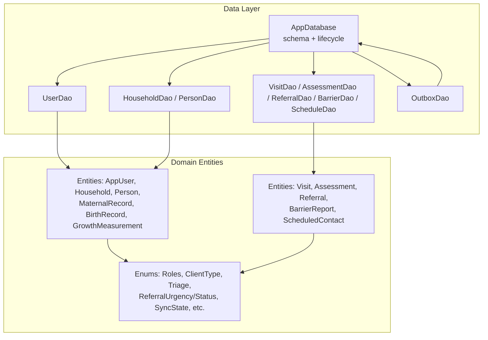
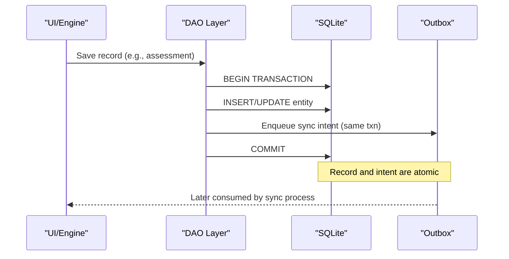
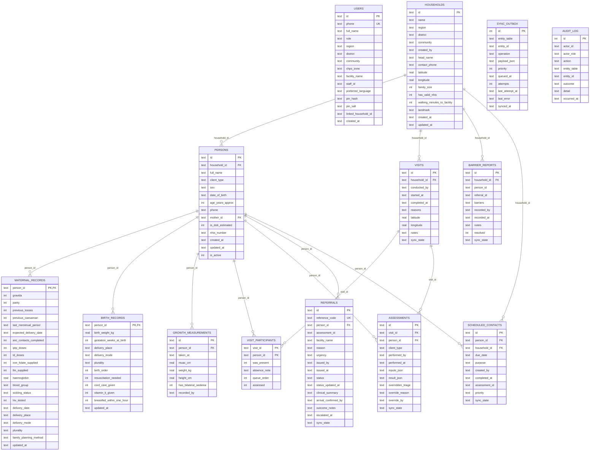

# Database Schema Design

<cite>
**Referenced Files in This Document**
- [app_database.dart](file://lib/data/local/app_database.dart)
- [user_dao.dart](file://lib/data/local/user_dao.dart)
- [household_dao.dart](file://lib/data/local/household_dao.dart)
- [visit_dao.dart](file://lib/data/local/visit_dao.dart)
- [outbox_dao.dart](file://lib/data/local/outbox_dao.dart)
- [core.dart](file://lib/domain/entities/core.dart)
- [visit.dart](file://lib/domain/entities/visit.dart)
- [enums.dart](file://lib/domain/enums.dart)
</cite>

## Table of Contents
1. [Introduction](#introduction)
2. [Project Structure](#project-structure)
3. [Core Components](#core-components)
4. [Architecture Overview](#architecture-overview)
5. [Detailed Component Analysis](#detailed-component-analysis)
6. [Dependency Analysis](#dependency-analysis)
7. [Performance Considerations](#performance-considerations)
8. [Troubleshooting Guide](#troubleshooting-guide)
9. [Conclusion](#conclusion)
10. [Appendices](#appendices)

## Introduction
This document provides comprehensive data model documentation for CareBridge AI’s SQLite database schema. It covers the 14 interconnected tables: users, households, persons, maternal_records, birth_records, growth_measurements, visits, visit_participants, assessments, referrals, barrier_reports, scheduled_contacts, sync_outbox, and audit_log. The design emphasizes offline-first operations on resource-constrained devices, append-only clinical history, soft deletes, and robust synchronization via an outbox pattern.

## Project Structure
The schema is defined as hand-written SQL within a single module, with DAOs encapsulating all persistence logic and entities mapping to/from maps for serialization. The database lifecycle (open, create, upgrade, close) is centralized, and foreign keys are enforced at the database level.

**Diagram sources**
- [app_database.dart:168-173](file://lib/data/local/app_database.dart#L168-L173)
- [user_dao.dart:117-167](file://lib/data/local/user_dao.dart#L117-L167)
- [household_dao.dart:22-41](file://lib/data/local/household_dao.dart#L22-L41)
- [visit_dao.dart:84-135](file://lib/data/local/visit_dao.dart#L84-L135)
- [outbox_dao.dart:160-181](file://lib/data/local/outbox_dao.dart#L160-L181)
- [core.dart:53-81](file://lib/domain/entities/core.dart#L53-L81)
- [visit.dart:353-390](file://lib/domain/entities/visit.dart#L353-L390)
- [enums.dart:351-363](file://lib/domain/enums.dart#L351-L363)

**Section sources**
- [app_database.dart:1-173](file://lib/data/local/app_database.dart#L1-L173)
- [user_dao.dart:1-167](file://lib/data/local/user_dao.dart#L1-L167)
- [household_dao.dart:1-41](file://lib/data/local/household_dao.dart#L1-L41)
- [visit_dao.dart:1-135](file://lib/data/local/visit_dao.dart#L1-L135)
- [outbox_dao.dart:1-181](file://lib/data/local/outbox_dao.dart#L1-L181)
- [core.dart:1-81](file://lib/domain/entities/core.dart#L1-L81)
- [visit.dart:1-90](file://lib/domain/entities/visit.dart#L1-L90)
- [enums.dart:1-66](file://lib/domain/enums.dart#L1-L66)

## Core Components
- AppDatabase centralizes schema creation, versioning, and configuration (foreign keys enabled). All 14 tables are created from a single schema list.
- DAOs implement CRUD and domain-specific queries, always enqueueing sync intents in the same transaction as the data write.
- Entities define typed models with map converters for persistence and enums standardize values across layers.

Key responsibilities:
- AppDatabase: open/close, in-memory test DB, clearAll, _createAll, _upgrade.
- UserDao: user registration/sign-in, PIN hashing, audit logging.
- HouseholdDao/PersonDao: household and person upserts, family registration, soft delete via is_active.
- VisitDao/AssessmentDao/ReferralDao/BarrierDao/ScheduleDao: encounter management, assessments with overrides, referral lifecycle, barriers, scheduling.
- OutboxDao: priority-based sync queue, retry/backoff, pruning.

**Section sources**
- [app_database.dart:37-173](file://lib/data/local/app_database.dart#L37-L173)
- [user_dao.dart:117-167](file://lib/data/local/user_dao.dart#L117-L167)
- [household_dao.dart:22-41](file://lib/data/local/household_dao.dart#L22-L41)
- [visit_dao.dart:84-135](file://lib/data/local/visit_dao.dart#L84-L135)
- [outbox_dao.dart:160-181](file://lib/data/local/outbox_dao.dart#L160-L181)

## Architecture Overview
The system follows an offline-first architecture:
- Writes commit locally first and atomically enqueue a sync intent.
- Sync engine consumes outbox entries by priority and queued time.
- Foreign key constraints enforce referential integrity; soft deletes preserve history.

**Diagram sources**
- [visit_dao.dart:284-308](file://lib/data/local/visit_dao.dart#L284-L308)
- [outbox_dao.dart:160-181](file://lib/data/local/outbox_dao.dart#L160-L181)
- [app_database.dart:90-103](file://lib/data/local/app_database.dart#L90-L103)

## Detailed Component Analysis

### Users
- Primary key: id (TEXT)
- Unique index: phone
- Soft delete: not used here; instead, per-user PIN stored securely
- Audit: sign-in attempts logged

Indexes:
- idx_users_phone(phone)

Common queries:
- Find user by phone or id
- List accounts by role
- Change PIN safely

Security notes:
- PIN hashed with salted PBKDF2-like stretching
- Constant-time comparison
- Weak PINs rejected

**Section sources**
- [app_database.dart:200-221](file://lib/data/local/app_database.dart#L200-L221)
- [user_dao.dart:117-167](file://lib/data/local/user_dao.dart#L117-L167)
- [user_dao.dart:169-216](file://lib/data/local/user_dao.dart#L169-L216)
- [user_dao.dart:294-326](file://lib/data/local/user_dao.dart#L294-L326)

### Households
- Primary key: id (TEXT)
- Indexes: community, created_by
- Soft delete: not used; active filtering via related tables

Indexes:
- idx_households_community(region, district, community)
- idx_households_created_by(created_by)

Common queries:
- List households by zone/community
- Caseload for worker
- Search by name/head/landmark

**Section sources**
- [app_database.dart:227-249](file://lib/data/local/app_database.dart#L227-L249)
- [household_dao.dart:22-41](file://lib/data/local/household_dao.dart#L22-L41)
- [household_dao.dart:54-103](file://lib/data/local/household_dao.dart#L54-L103)
- [household_dao.dart:131-143](file://lib/data/local/household_dao.dart#L131-L143)

### Persons
- Primary key: id (TEXT)
- Foreign keys: household_id -> households(id) CASCADE; mother_id -> persons(id) SET NULL
- Soft delete: is_active flag
- Indexes optimized for roll call and lookups

Indexes:
- idx_persons_household(household_id, is_active)
- idx_persons_mother(mother_id)
- idx_persons_type(client_type, is_active)

Common queries:
- Clients for visit ordered by protocol priority
- Children of a mother
- Search by name/NHIS

Soft delete pattern:
- deactivate sets is_active=0 and enqueues update

**Section sources**
- [app_database.dart:256-280](file://lib/data/local/app_database.dart#L256-L280)
- [household_dao.dart:164-183](file://lib/data/local/household_dao.dart#L164-L183)
- [household_dao.dart:314-336](file://lib/data/local/household_dao.dart#L314-L336)
- [household_dao.dart:378-395](file://lib/data/local/household_dao.dart#L378-L395)

### Maternal Records
- Primary key: person_id (FK to persons.id CASCADE)
- Append/update semantics: one row per woman; updated_at tracks changes

Foreign key:
- person_id -> persons(id) ON DELETE CASCADE

Common queries:
- For person
- Pregnant women
- Postpartum window (within 42 days)

**Section sources**
- [app_database.dart:286-312](file://lib/data/local/app_database.dart#L286-L312)
- [household_dao.dart:415-476](file://lib/data/local/household_dao.dart#L415-L476)

### Birth Records
- Primary key: person_id (FK to persons.id CASCADE)
- Fixed at birth; updated_at present

Foreign key:
- person_id -> persons(id) ON DELETE CASCADE

Common queries:
- For person
- Batch for multiple people

**Section sources**
- [app_database.dart:319-335](file://lib/data/local/app_database.dart#L319-L335)
- [household_dao.dart:478-528](file://lib/data/local/household_dao.dart#L478-L528)

### Growth Measurements
- Primary key: id (TEXT)
- Append-only design: new rows for each measurement
- Index optimized for series retrieval

Index:
- idx_growth_person_date(person_id, taken_at DESC)

Common queries:
- Series oldest-first
- Latest per person
- Latest for all (single query)
- Nutritional risk screening

**Section sources**
- [app_database.dart:342-355](file://lib/data/local/app_database.dart#L342-L355)
- [household_dao.dart:530-614](file://lib/data/local/household_dao.dart#L530-L614)

### Visits
- Primary key: id (TEXT)
- FK: household_id -> households(id) CASCADE
- Indexes for household timeline and worker schedule

Indexes:
- idx_visits_household(household_id, started_at DESC)
- idx_visits_worker_date(conducted_by, started_at DESC)

Common queries:
- Open visit resumption
- Completed on day
- Participants roll call

**Section sources**
- [app_database.dart:362-377](file://lib/data/local/app_database.dart#L362-L377)
- [visit_dao.dart:84-135](file://lib/data/local/visit_dao.dart#L84-L135)
- [visit_dao.dart:151-161](file://lib/data/local/visit_dao.dart#L151-L161)

### Visit Participants
- Composite primary key: (visit_id, person_id)
- FKs: visit_id -> visits(id) CASCADE; person_id -> persons(id) CASCADE

Common queries:
- Participants by visit
- Recent absentees

**Section sources**
- [app_database.dart:385-397](file://lib/data/local/app_database.dart#L385-L397)
- [visit_dao.dart:217-256](file://lib/data/local/visit_dao.dart#L217-L256)

### Assessments
- Primary key: id (TEXT)
- FKs: visit_id -> visits(id) CASCADE; person_id -> persons(id) CASCADE
- JSON columns store inputs and result
- Overrides tracked for audit and model improvement

Indexes:
- idx_assessments_person(person_id, performed_at DESC)
- idx_assessments_visit(visit_id)
- idx_assessments_overrides(overridden_triage)

Common queries:
- By id/person/visit
- Latest per person
- Overrides list

Override flow:
- Update overridden fields and enqueue sync

**Section sources**
- [app_database.dart:404-426](file://lib/data/local/app_database.dart#L404-L426)
- [visit_dao.dart:271-365](file://lib/data/local/visit_dao.dart#L271-L365)
- [visit_dao.dart:418-460](file://lib/data/local/visit_dao.dart#L418-L460)

### Referrals
- Primary key: id (TEXT)
- Unique index: reference_code
- Status-driven lifecycle with escalation support

Indexes:
- idx_referrals_code(reference_code)
- idx_referrals_status(status, issued_at DESC)
- idx_referrals_person(person_id, issued_at DESC)

Common queries:
- Open referrals
- For person
- Needs escalation (urgent, unconfirmed after 48h)
- Completion stats

**Section sources**
- [app_database.dart:433-457](file://lib/data/local/app_database.dart#L433-L457)
- [visit_dao.dart:488-639](file://lib/data/local/visit_dao.dart#L488-L639)

### Barrier Reports
- Primary key: id (TEXT)
- FK: household_id -> households(id) CASCADE
- Time-indexed for pattern detection

Indexes:
- idx_barriers_household(household_id, recorded_at DESC)
- idx_barriers_date(recorded_at DESC)

Common queries:
- For household
- Within days for zone-wide analysis
- History of distinct barriers

**Section sources**
- [app_database.dart:464-482](file://lib/data/local/app_database.dart#L464-L482)
- [visit_dao.dart:641-716](file://lib/data/local/visit_dao.dart#L641-L716)

### Scheduled Contacts
- Primary key: id (TEXT)
- FKs: person_id -> persons(id) CASCADE; household_id -> households(id) CASCADE
- Due-date indexing supports “Plan My Day”

Indexes:
- idx_contacts_due(completed_at, due_date)
- idx_contacts_person(person_id, due_date)

Common queries:
- Due within horizon
- Overdue
- For person

**Section sources**
- [app_database.dart:488-506](file://lib/data/local/app_database.dart#L488-L506)
- [visit_dao.dart:718-800](file://lib/data/local/visit_dao.dart#L718-L800)

### Sync Outbox
- Autoincrement integer primary key
- Priority ordering ensures urgent items leave first
- Retry/backoff and failure visibility

Indexes:
- idx_outbox_pending(synced_at, priority, queued_at)
- idx_outbox_entity(entity_table, entity_id)

Common operations:
- Enqueue in same transaction as data
- Fetch pending batch
- Mark synced/failed
- Prune old synced entries

**Section sources**
- [app_database.dart:515-533](file://lib/data/local/app_database.dart#L515-L533)
- [outbox_dao.dart:160-181](file://lib/data/local/outbox_dao.dart#L160-L181)
- [outbox_dao.dart:187-199](file://lib/data/local/outbox_dao.dart#L187-L199)
- [outbox_dao.dart:220-238](file://lib/data/local/outbox_dao.dart#L220-L238)
- [outbox_dao.dart:265-275](file://lib/data/local/outbox_dao.dart#L265-L275)

### Audit Log
- Autoincrement integer primary key
- Time and actor indexes for efficient querying

Indexes:
- idx_audit_time(occurred_at DESC)
- idx_audit_actor(actor_id, occurred_at DESC)

Common operations:
- Record action/outcome
- Query recent/denials

**Section sources**
- [app_database.dart:540-555](file://lib/data/local/app_database.dart#L540-L555)
- [user_dao.dart:382-456](file://lib/data/local/user_dao.dart#L382-L456)

## Dependency Analysis
Entity relationships and constraints:

**Diagram sources**
- [app_database.dart:194-555](file://lib/data/local/app_database.dart#L194-L555)

**Section sources**
- [app_database.dart:194-555](file://lib/data/local/app_database.dart#L194-L555)

## Performance Considerations
- Foreign keys enabled globally to prevent orphaned records.
- Indexes tailored for frequent queries:
  - Zone lists, worker caseloads, visit timelines, person series, assessments by person/visit, referrals by status/time, barriers by date, scheduled contacts by due date.
- Append-only growth measurements avoid expensive updates and preserve clinical history.
- Soft deletes via is_active reduce join complexity while preserving history.
- Outbox prioritization ensures critical items transmit first under limited connectivity.
- Bulk operations and correlated subqueries minimize round trips on low-end devices.

[No sources needed since this section provides general guidance]

## Troubleshooting Guide
- Sync failures:
  - Use outbox failing() to surface stuck entries with last_error.
  - Reset attempts for manual retry after resolving issues.
  - Prune synced entries older than keepDays to manage storage.
- Audit review:
  - Query recent denials to identify permission or access issues.
- Data integrity:
  - Ensure foreign_keys pragma remains ON during app startup.
  - Validate that every write enqueues a corresponding outbox entry in the same transaction.

**Section sources**
- [outbox_dao.dart:241-275](file://lib/data/local/outbox_dao.dart#L241-L275)
- [user_dao.dart:435-456](file://lib/data/local/user_dao.dart#L435-L456)
- [app_database.dart:95-99](file://lib/data/local/app_database.dart#L95-L99)

## Conclusion
The CareBridge AI schema is designed for resilience and performance in offline, low-connectivity environments. It combines strict referential integrity, append-only clinical histories, soft deletes, and a priority-driven outbox to ensure data safety and timely synchronization. The indexing strategy and query patterns reflect field workflows, optimizing for speed and clarity on resource-constrained devices.

[No sources needed since this section summarizes without analyzing specific files]

## Appendices

### Common Queries and Patterns
- Get latest growth measurement per child:
  - Use series(person_id) ordered by taken_at ASC for charts; latest(person_id) for current status.
- Identify nutritional risk:
  - atNutritionalRisk filters latest measurements by oedema or MUAC thresholds.
- Plan daily tasks:
  - due(horizonDays) returns overdue and upcoming contacts sorted by due_date.
- Track referral outcomes:
  - completionStats computes issued vs arrived counts over a window.

**Section sources**
- [household_dao.dart:556-614](file://lib/data/local/household_dao.dart#L556-L614)
- [visit_dao.dart:762-786](file://lib/data/local/visit_dao.dart#L762-L786)
- [visit_dao.dart:618-639](file://lib/data/local/visit_dao.dart#L618-L639)

### Migration Strategy
- Version bump triggers _upgrade; add case statements for incremental migrations.
- Never edit earlier cases; append new migration steps.
- Clear demo data uses clearAll to reset rows while preserving schema.

**Section sources**
- [app_database.dart:37-39](file://lib/data/local/app_database.dart#L37-L39)
- [app_database.dart:163-166](file://lib/data/local/app_database.dart#L163-L166)
- [app_database.dart:138-161](file://lib/data/local/app_database.dart#L138-L161)