# Operational Tables

<cite>
**Referenced Files in This Document**
- [app_database.dart](file://lib/data/local/app_database.dart)
- [visit_dao.dart](file://lib/data/local/visit_dao.dart)
- [outbox_dao.dart](file://lib/data/local/outbox_dao.dart)
- [sync_service.dart](file://lib/data/sync/sync_service.dart)
- [barrier_engine.dart](file://lib/domain/engines/barrier_engine.dart)
</cite>

## Table of Contents
1. Introduction
2. Project Structure
3. Core Components
4. Architecture Overview
5. Detailed Component Analysis
6. Dependency Analysis
7. Performance Considerations
8. Troubleshooting Guide
9. Conclusion

## Introduction
This document explains CareBridge AI’s operational tables and how they enable offline-first, reliable field operations for community health workflows. It focuses on:
- Visits: multi-client encounters with geographic tracking and completion status
- Referrals: QR code integration, status tracking, and escalation mechanisms
- Barrier reports: capturing why care was not delivered and enabling zone-wide pattern detection
- Scheduled contacts: engine-generated follow-ups to ensure nothing depends on memory
- Sync outbox: guaranteeing offline-first by writing sync intents in the same transaction as data changes
- Audit log: security compliance and permission enforcement

The design ensures that every write is durable locally and immediately synchronized when connectivity allows, with priority handling for urgent clinical events.

## Project Structure
The operational tables are defined in a single SQLite schema file and accessed through DAOs (data access objects). The sync pipeline uses an outbox table and a background service to push changes to the server.

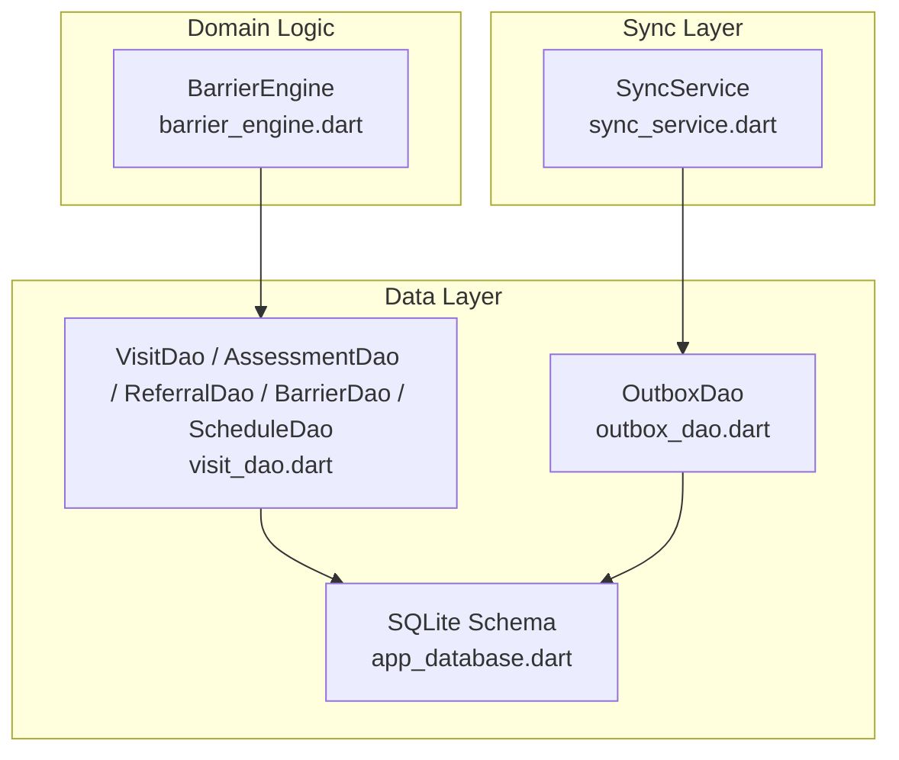

**Diagram sources**
- [app_database.dart:168-556](file://lib/data/local/app_database.dart#L168-L556)
- [visit_dao.dart:84-847](file://lib/data/local/visit_dao.dart#L84-L847)
- [outbox_dao.dart:160-277](file://lib/data/local/outbox_dao.dart#L160-L277)
- [sync_service.dart:156-257](file://lib/data/sync/sync_service.dart#L156-L257)
- [barrier_engine.dart:110-534](file://lib/domain/engines/barrier_engine.dart#L110-L534)

**Section sources**
- [app_database.dart:168-556](file://lib/data/local/app_database.dart#L168-L556)

## Core Components
- Visits and participants: one encounter can include multiple clients; presence and assessment state are tracked separately
- Assessments: raw inputs and results stored together; clinician overrides recorded for audit and model improvement
- Referrals: issued alongside assessments; status lifecycle and escalation queries support last-mile closure
- Barrier reports: reasons for non-delivery captured per household/person/referral; aggregated for zone patterns
- Scheduled contacts: generated by engines to drive follow-up; due/overdue queries power daily planning
- Sync outbox: atomic enqueue with writes; priority-based ordering; retry/backoff; failure surfacing
- Audit log: records permission checks and critical actions for compliance

**Section sources**
- [app_database.dart:362-556](file://lib/data/local/app_database.dart#L362-L556)
- [visit_dao.dart:84-847](file://lib/data/local/visit_dao.dart#L84-L847)
- [outbox_dao.dart:160-277](file://lib/data/local/outbox_dao.dart#L160-L277)

## Architecture Overview
The system enforces offline-first guarantees by committing both the business record and its sync intent within a single database transaction. A background sync process picks up pending items by priority and time, sends them, and updates their status atomically.

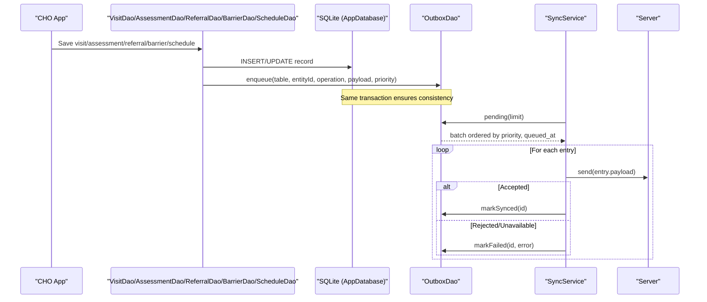

**Diagram sources**
- [visit_dao.dart:84-135](file://lib/data/local/visit_dao.dart#L84-L135)
- [visit_dao.dart:271-335](file://lib/data/local/visit_dao.dart#L271-L335)
- [visit_dao.dart:488-608](file://lib/data/local/visit_dao.dart#L488-L608)
- [visit_dao.dart:641-716](file://lib/data/local/visit_dao.dart#L641-L716)
- [visit_dao.dart:718-817](file://lib/data/local/visit_dao.dart#L718-L817)
- [outbox_dao.dart:160-218](file://lib/data/local/outbox_dao.dart#L160-L218)
- [sync_service.dart:156-242](file://lib/data/sync/sync_service.dart#L156-L242)

## Detailed Component Analysis

### Visits and Participants
- Purpose: Capture a single encounter across multiple clients with location and completion metadata
- Key fields: id, household_id, conducted_by, started_at, completed_at, reasons, latitude, longitude, notes, sync_state
- Participants: who was present, absence notes, queue order, assessed flag
- Operations: start with participants, complete with optional notes, query recent absentees, days since last visit

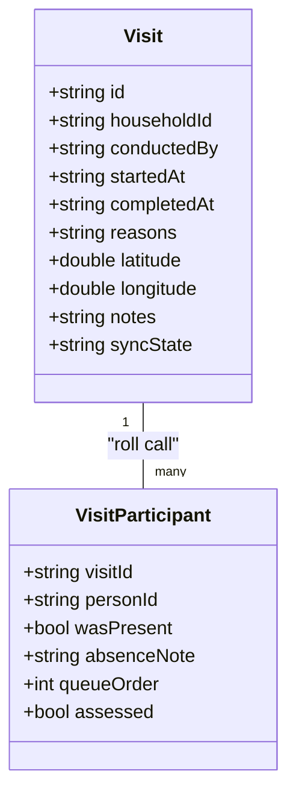

**Diagram sources**
- [app_database.dart:362-397](file://lib/data/local/app_database.dart#L362-L397)
- [visit_dao.dart:29-82](file://lib/data/local/visit_dao.dart#L29-L82)

Operational highlights:
- Start a visit and roll call atomically; enqueue insert with participants payload
- Complete a visit and enqueue update with timestamp and notes
- Query open visits per worker, completed counts per day, and recent absentees

**Section sources**
- [app_database.dart:362-397](file://lib/data/local/app_database.dart#L362-L397)
- [visit_dao.dart:84-135](file://lib/data/local/visit_dao.dart#L84-L135)
- [visit_dao.dart:191-215](file://lib/data/local/visit_dao.dart#L191-L215)
- [visit_dao.dart:237-268](file://lib/data/local/visit_dao.dart#L237-L268)

### Assessments and Overrides
- Purpose: Store raw inputs and computed results; allow clinician overrides with full audit trail
- Key fields: id, visit_id, person_id, client_type, performed_by, performed_at, inputs_json, result_json, overridden_triage, override_reason, override_by, sync_state
- Operations: save alone or with referral/schedule; record overrides; count today; list overrides

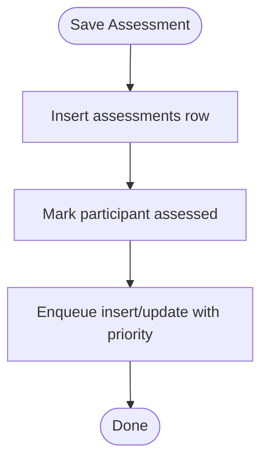

**Diagram sources**
- [visit_dao.dart:337-365](file://lib/data/local/visit_dao.dart#L337-L365)

Operational highlights:
- saveWithReferral commits assessment and referral in one transaction; urgent referrals get critical priority
- saveWithSchedule persists assessment and generated scheduled contacts atomically
- recordOverride updates triage and logs an audit event

**Section sources**
- [visit_dao.dart:271-335](file://lib/data/local/visit_dao.dart#L271-L335)
- [visit_dao.dart:418-460](file://lib/data/local/visit_dao.dart#L418-L460)

### Referrals
- Purpose: Track last-mile delivery from issuance to arrival/treatment; enable escalation
- Key fields: id, reference_code (unique), person_id, assessment_id, facility_name, reason, urgency, issued_by, issued_at, status, status_updated_at, clinical_summary, arrival_confirmed_by, outcome_notes, escalated_at, sync_state
- Operations: upsert, lookup by id/code, open list, for-person list, needingEscalation, updateStatus, markEscalated, completionStats

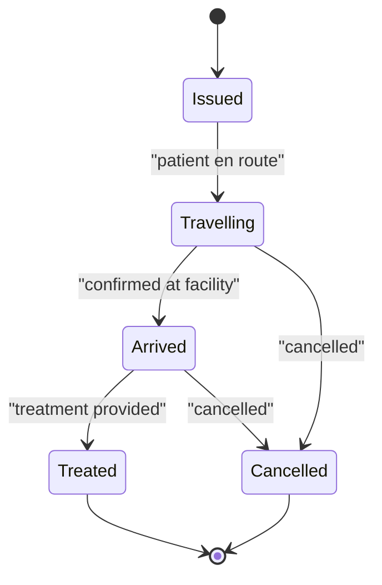

**Diagram sources**
- [app_database.dart:434-458](file://lib/data/local/app_database.dart#L434-L458)

Operational highlights:
- byCode supports case-insensitive lookup for paper slips or phone calls
- needingEscalation surfaces urgent referrals without confirmed arrival after threshold
- completionStats measures issued vs arrived/treated over a window

**Section sources**
- [visit_dao.dart:488-608](file://lib/data/local/visit_dao.dart#L488-L608)
- [visit_dao.dart:617-638](file://lib/data/local/visit_dao.dart#L617-L638)

### Barrier Reports
- Purpose: Capture why care was not delivered; aggregate into zone-wide patterns
- Key fields: id, household_id, person_id, referral_id, barriers (encoded), recorded_by, recorded_at, notes, resolved, sync_state
- Operations: save, forHousehold, withinDays, historyFor, markResolved

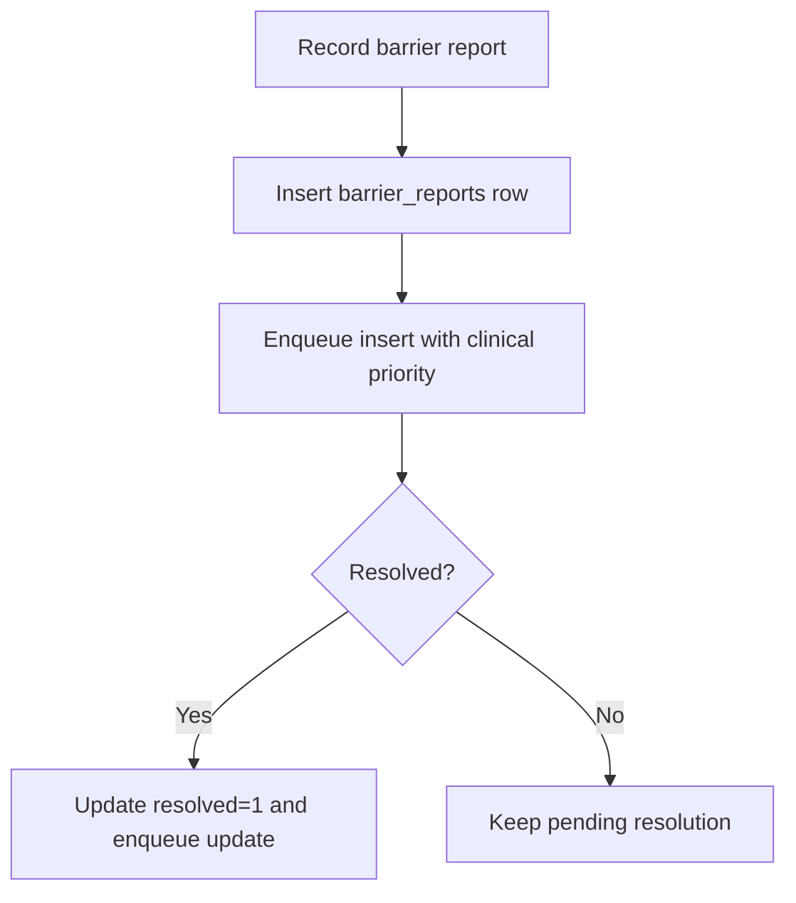

**Diagram sources**
- [visit_dao.dart:641-716](file://lib/data/local/visit_dao.dart#L641-L716)

Operational highlights:
- withinDays supports zone-wide analysis
- historyFor feeds the barrier engine with distinct past barriers per household

**Section sources**
- [app_database.dart:464-483](file://lib/data/local/app_database.dart#L464-L483)
- [visit_dao.dart:641-716](file://lib/data/local/visit_dao.dart#L641-L716)

### Scheduled Contacts
- Purpose: Engine-generated follow-ups so scheduling never depends on memory
- Key fields: id, person_id, household_id, due_date, purpose, created_by, completed_at, assessment_id, priority, sync_state
- Operations: upsert/upsertAll, due(horizonDays), overdue, forPerson, markDone, missedCountFor, missedCountsForAll

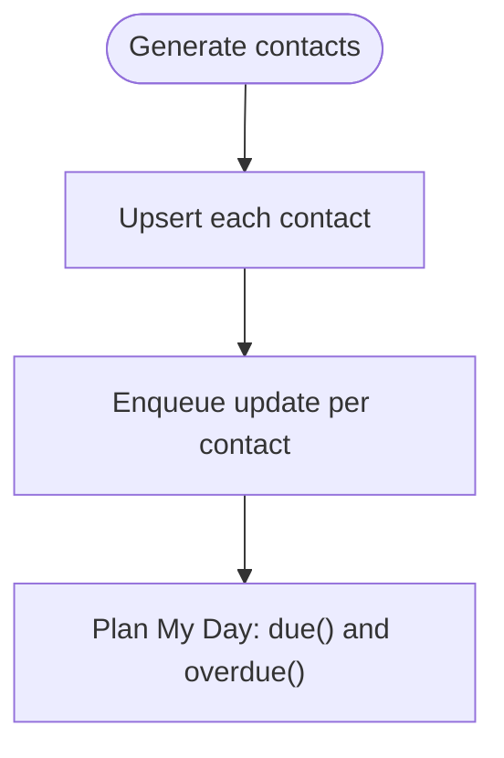

**Diagram sources**
- [visit_dao.dart:718-817](file://lib/data/local/visit_dao.dart#L718-L817)

Operational highlights:
- due(horizonDays) returns all not-yet-completed items due before horizon
- missedCountsForAll powers dashboard rankings efficiently

**Section sources**
- [app_database.dart:488-507](file://lib/data/local/app_database.dart#L488-L507)
- [visit_dao.dart:718-847](file://lib/data/local/visit_dao.dart#L718-L847)

### Sync Outbox
- Purpose: Guarantee offline-first by pairing every change with a sync intent in the same transaction
- Key fields: id (auto), entity_table, entity_id, operation, payload_json, priority, queued_at, attempts, last_attempt_at, last_error, synced_at
- Operations: enqueue, pending(limit), markSynced, markFailed, summary, failing, resetAttempts, pruneSynced

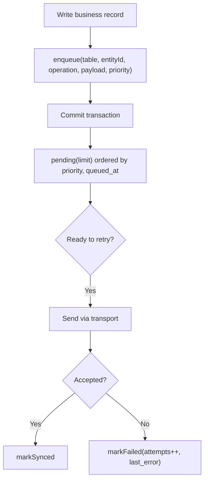

**Diagram sources**
- [outbox_dao.dart:160-218](file://lib/data/local/outbox_dao.dart#L160-L218)
- [sync_service.dart:156-242](file://lib/data/sync/sync_service.dart#L156-L242)

Operational highlights:
- Priority levels: critical (urgent referrals/assessments), clinical, routine, background
- Exponential backoff capped to avoid battery drain
- Summary exposes pending, failing, criticalPending, oldestPendingAt

**Section sources**
- [app_database.dart:515-534](file://lib/data/local/app_database.dart#L515-L534)
- [outbox_dao.dart:160-277](file://lib/data/local/outbox_dao.dart#L160-L277)

### Audit Log
- Purpose: Security compliance and permission enforcement; records critical actions and outcomes
- Key fields: id (auto), actor_id, actor_role, action, entity_table, entity_id, outcome, detail, occurred_at
- Usage: logged when assessments are overridden and other sensitive operations

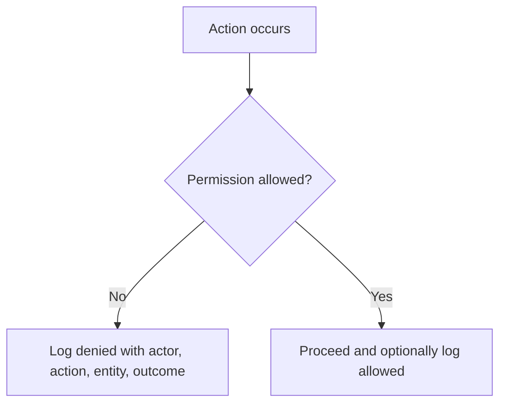

**Diagram sources**
- [app_database.dart:540-556](file://lib/data/local/app_database.dart#L540-L556)
- [visit_dao.dart:450-460](file://lib/data/local/visit_dao.dart#L450-L460)

**Section sources**
- [app_database.dart:540-556](file://lib/data/local/app_database.dart#L540-L556)

### Barrier Engine Integration
- Predicts likely barriers before a referral fails and aggregates zone-wide patterns
- Uses previously reported barriers, missed contacts, seasonality, distance, NHIS status, decision-maker presence, and more
- Outputs predicted barriers with likelihood, basis, and preemptive actions; computes feasibility score

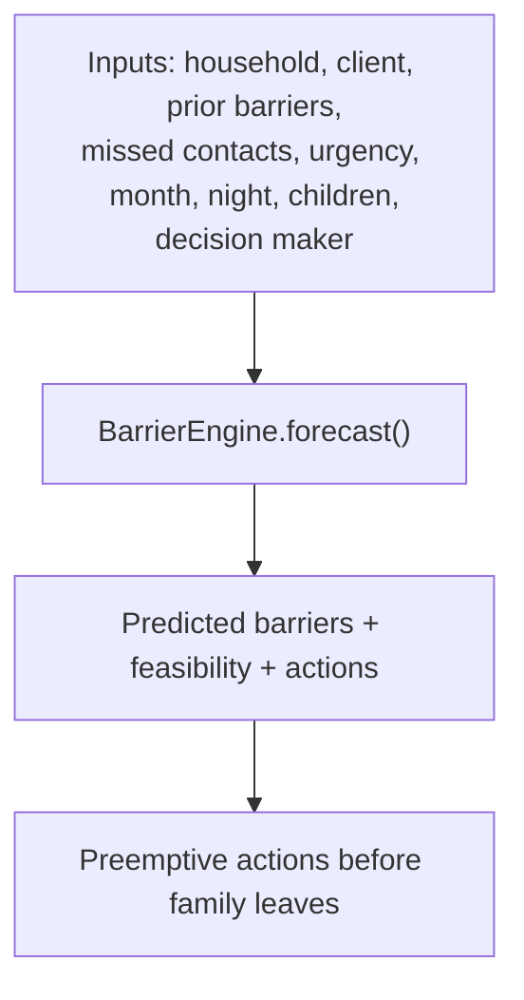

**Diagram sources**
- [barrier_engine.dart:110-396](file://lib/domain/engines/barrier_engine.dart#L110-L396)

**Section sources**
- [barrier_engine.dart:110-534](file://lib/domain/engines/barrier_engine.dart#L110-L534)

## Dependency Analysis
- DAOs depend on AppDatabase for schema and indices
- All DAOs enqueue to OutboxDao within the same transaction as data writes
- SyncService consumes OutboxDao.pending and updates statuses based on transport outcomes
- BarrierEngine reads historical barrier reports and interacts with DAOs indirectly via repositories

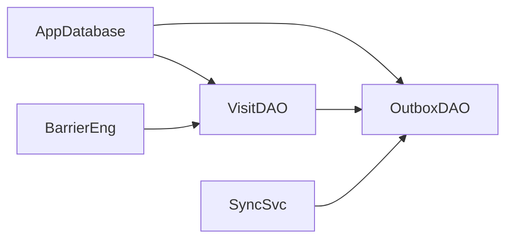

**Diagram sources**
- [app_database.dart:168-556](file://lib/data/local/app_database.dart#L168-L556)
- [visit_dao.dart:84-847](file://lib/data/local/visit_dao.dart#L84-L847)
- [outbox_dao.dart:160-277](file://lib/data/local/outbox_dao.dart#L160-L277)
- [sync_service.dart:156-257](file://lib/data/sync/sync_service.dart#L156-L257)
- [barrier_engine.dart:110-534](file://lib/domain/engines/barrier_engine.dart#L110-L534)

**Section sources**
- [app_database.dart:168-556](file://lib/data/local/app_database.dart#L168-L556)

## Performance Considerations
- Indices used effectively:
  - households: region/district/community, created_by
  - persons: household+is_active, mother_id, client_type+is_active
  - growth_measurements: person_id+taken_at DESC
  - visits: household_id+started_at DESC, conducted_by+started_at DESC
  - assessments: person_id+performed_at DESC, visit_id, overridden_triage
  - referrals: unique reference_code, status+issued_at DESC, person_id+issued_at DESC
  - barrier_reports: household_id+recorded_at DESC, recorded_at DESC
  - scheduled_contacts: completed_at+due_date, person_id+due_date
  - sync_outbox: synced_at+priority+queued_at, entity_table+entity_id
  - audit_log: occurred_at DESC, actor_id+occurred_at DESC
- Batch sizes:
  - Outbox pending limited to small batches to maximize committed successes during short connectivity windows
- Transaction boundaries:
  - All writes and enqueue calls occur in a single transaction to prevent orphaned records or intents
- Backoff strategy:
  - Exponential backoff capped to avoid excessive retries and battery drain

[No sources needed since this section provides general guidance]

## Troubleshooting Guide
- Stuck sync entries:
  - Use OutboxDao.failing() to surface rows with attempts >= 5 and last_error
  - Reset attempts with OutboxDao.resetAttempts(id) after resolving underlying issues
- Missing records:
  - Verify that enqueue was called inside the same transaction as the write
  - Check OutboxDao.summary() for pending counts and oldest pending timestamp
- Urgent referrals not arriving:
  - Use ReferralDao.needingEscalation() to identify urgent cases without confirmed arrival
  - Confirm sync priority was set to critical for immediate referrals
- Overdue tasks:
  - Use ScheduleDao.overdue() and ScheduleDao.due(horizonDays) to plan daily routes
- Permission denials:
  - Review audit_log entries for denied actions and actors

**Section sources**
- [outbox_dao.dart:220-277](file://lib/data/local/outbox_dao.dart#L220-L277)
- [sync_service.dart:156-257](file://lib/data/sync/sync_service.dart#L156-L257)
- [visit_dao.dart:562-608](file://lib/data/local/visit_dao.dart#L562-L608)
- [visit_dao.dart:776-817](file://lib/data/local/visit_dao.dart#L776-L817)
- [app_database.dart:540-556](file://lib/data/local/app_database.dart#L540-L556)

## Conclusion
CareBridge AI’s operational tables and sync architecture provide robust, offline-first support for community health workflows. Visits capture multi-client encounters with geolocation and completion states. Referrals track last-mile delivery with clear status transitions and escalation paths. Barrier reports transform individual non-attendance into actionable zone-level insights. Scheduled contacts ensure follow-ups are systematic and engine-driven. The sync outbox guarantees durability and prioritization, while the audit log enforces compliance. Together, these components form a resilient foundation for delivering equitable maternal and child health services in low-connectivity environments.