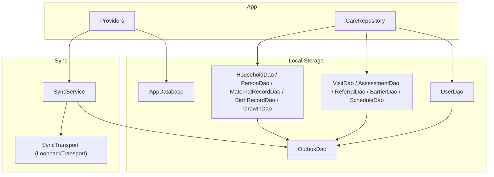
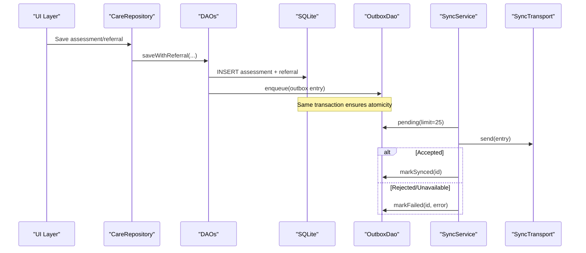
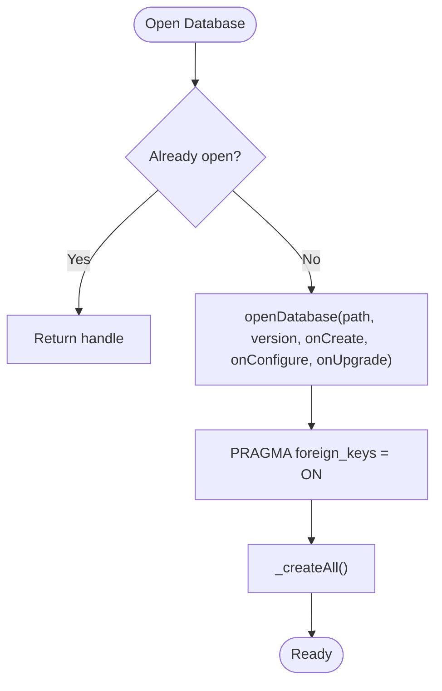
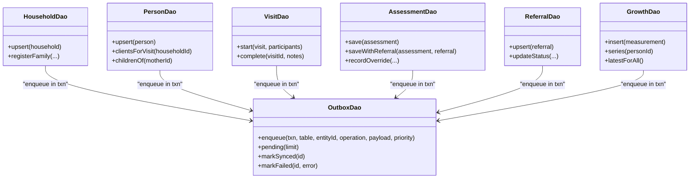
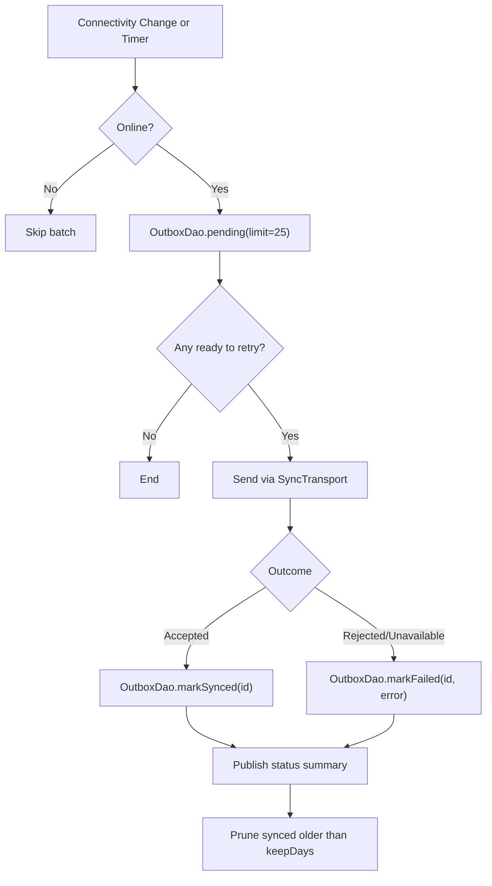
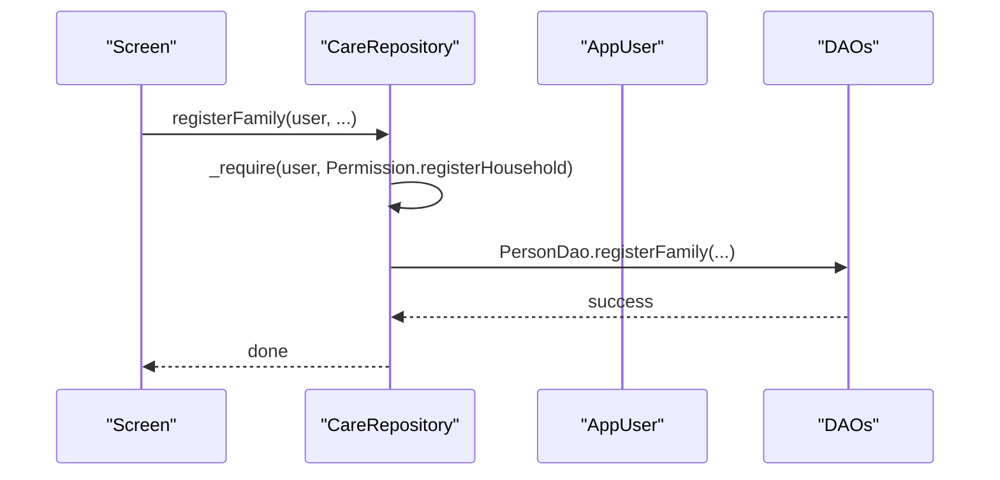
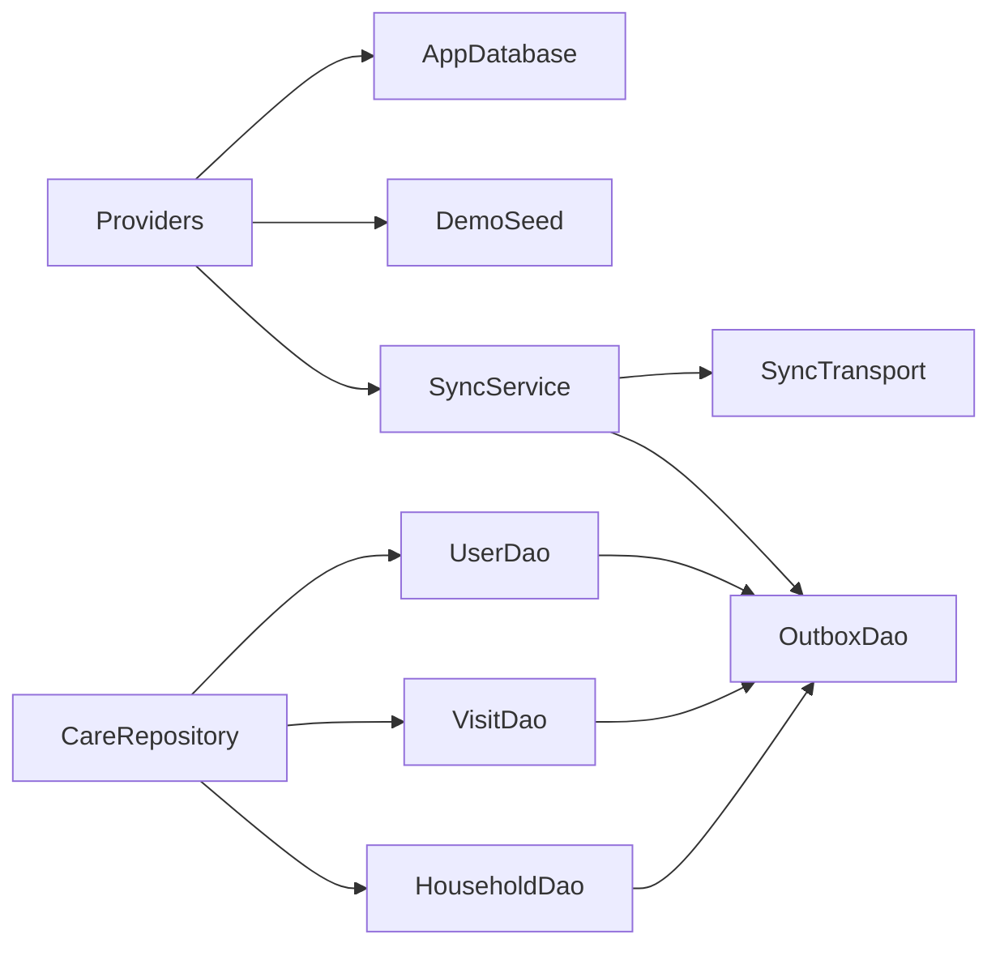

# Offline Data Operations

<cite>
**Referenced Files in This Document**
- [app_database.dart](file://lib/data/local/app_database.dart)
- [outbox_dao.dart](file://lib/data/local/outbox_dao.dart)
- [household_dao.dart](file://lib/data/local/household_dao.dart)
- [visit_dao.dart](file://lib/data/local/visit_dao.dart)
- [user_dao.dart](file://lib/data/local/user_dao.dart)
- [sync_service.dart](file://lib/data/sync/sync_service.dart)
- [care_repository.dart](file://lib/data/repositories/care_repository.dart)
- [providers.dart](file://lib/app/providers.dart)
- [demo_seed.dart](file://lib/data/local/demo_seed.dart)
- [pubspec.yaml](file://pubspec.yaml)
</cite>

## Table of Contents
1. Introduction
2. Project Structure
3. Core Components
4. Architecture Overview
5. Detailed Component Analysis
6. Dependency Analysis
7. Performance Considerations
8. Troubleshooting Guide
9. Conclusion

## Introduction
This document explains how CareBridge AI implements offline-first data operations on mobile devices. SQLite is the source of truth; all writes commit locally and immediately, and a sync outbox guarantees that every change will be sent when connectivity returns. The DAO layer abstracts raw SQL, repositories enforce role-based access control, and a background sync service batches and prioritizes uploads. Complex queries are optimized for low-end devices, and transactions ensure consistency across related entities.

## Project Structure
The offline-first stack spans local storage, DAOs, repositories, and a sync service:
- AppDatabase manages the SQLite instance, schema, and lifecycle.
- DAOs encapsulate CRUD and complex queries for households, persons, visits, assessments, referrals, barriers, growth measurements, and scheduled contacts.
- OutboxDao records sync intents alongside data changes within the same transaction.
- SyncService orchestrates opportunistic background sync with priority ordering and exponential backoff.
- CareRepository enforces permissions and scopes before touching any DAO.
- Providers wire up the database, demo seeding, and sync service at app startup.

**Diagram sources**
- [providers.dart:32-68](file://lib/app/providers.dart#L32-L68)
- [app_database.dart:43-103](file://lib/data/local/app_database.dart#L43-L103)
- [household_dao.dart:22-41](file://lib/data/local/household_dao.dart#L22-L41)
- [visit_dao.dart:84-135](file://lib/data/local/visit_dao.dart#L84-L135)
- [user_dao.dart:1-27](file://lib/data/local/user_dao.dart#L1-L27)
- [outbox_dao.dart:160-181](file://lib/data/local/outbox_dao.dart#L160-L181)
- [sync_service.dart:96-133](file://lib/data/sync/sync_service.dart#L96-L133)

**Section sources**
- [providers.dart:32-68](file://lib/app/providers.dart#L32-L68)
- [pubspec.yaml:24-36](file://pubspec.yaml#L24-L36)

## Core Components
- AppDatabase: Singleton database manager with guarded opening, foreign key enforcement, schema creation, and upgrade hooks.
- DAOs: Transactional write paths that enqueue outbox entries atomically with data changes.
- OutboxDao: Priority-based queue with retry/backoff and failure visibility.
- SyncService: Opportunistic sync triggered by connectivity changes and periodic timers; small batches, individual commits.
- CareRepository: Centralized permission checks and scoping for caregivers vs. frontline health workers.

Key design principles:
- SQLite is the source of truth; no UI waits for network.
- Every write is paired with an outbox entry in the same transaction.
- Priority-driven sync ensures urgent items leave first.
- Failures are surfaced to humans rather than retried silently.

**Section sources**
- [app_database.dart:1-22](file://lib/data/local/app_database.dart#L1-L22)
- [outbox_dao.dart:1-21](file://lib/data/local/outbox_dao.dart#L1-L21)
- [sync_service.dart:1-24](file://lib/data/sync/sync_service.dart#L1-L24)
- [care_repository.dart:1-26](file://lib/data/repositories/care_repository.dart#L1-L26)

## Architecture Overview
The offline-first flow ensures durability and eventual consistency:
- Writes go through DAOs into SQLite and enqueue an outbox row in one transaction.
- SyncService periodically or opportunistically pulls pending outbox rows, sends them via a transport, and marks them synced on success.
- Failed attempts are tracked with backoff and surfaced for human intervention.

**Diagram sources**
- [visit_dao.dart:271-335](file://lib/data/local/visit_dao.dart#L271-L335)
- [outbox_dao.dart:160-181](file://lib/data/local/outbox_dao.dart#L160-L181)
- [sync_service.dart:152-217](file://lib/data/sync/sync_service.dart#L152-L217)

## Detailed Component Analysis

### Database Layer (AppDatabase)
- Opens a single persistent SQLite file with foreign keys enabled.
- Provides in-memory mode for tests and desktop FFI initialization.
- Creates the full schema and supports future upgrades.
- Offers clearAll for demo resets and safe close semantics.

**Diagram sources**
- [app_database.dart:67-103](file://lib/data/local/app_database.dart#L67-L103)
- [app_database.dart:168-172](file://lib/data/local/app_database.dart#L168-L172)

**Section sources**
- [app_database.dart:43-103](file://lib/data/local/app_database.dart#L43-L103)
- [app_database.dart:116-128](file://lib/data/local/app_database.dart#L116-L128)
- [app_database.dart:138-161](file://lib/data/local/app_database.dart#L138-L161)

### DAO Abstraction and Transactions
- HouseholdDao, PersonDao, MaternalRecordDao, BirthRecordDao, GrowthDao implement upsert/insert with OutboxDao.enqueue inside db.transaction.
- VisitDao.start persists visit and participants together; complete updates timestamps and sync state.
- AssessmentDao.saveWithReferral persists both assessment and referral atomically; also marks participants assessed.
- ReferralDao.updateStatus and BarrierDao.markResolved update states and enqueue outbox entries.
- GrowthDao.insert is append-only to preserve clinical series.

**Diagram sources**
- [household_dao.dart:22-41](file://lib/data/local/household_dao.dart#L22-L41)
- [household_dao.dart:191-281](file://lib/data/local/household_dao.dart#L191-L281)
- [visit_dao.dart:104-135](file://lib/data/local/visit_dao.dart#L104-L135)
- [visit_dao.dart:271-335](file://lib/data/local/visit_dao.dart#L271-L335)
- [visit_dao.dart:488-509](file://lib/data/local/visit_dao.dart#L488-L509)
- [household_dao.dart:530-552](file://lib/data/local/household_dao.dart#L530-L552)
- [outbox_dao.dart:160-181](file://lib/data/local/outbox_dao.dart#L160-L181)

**Section sources**
- [household_dao.dart:22-41](file://lib/data/local/household_dao.dart#L22-L41)
- [household_dao.dart:191-281](file://lib/data/local/household_dao.dart#L191-L281)
- [visit_dao.dart:104-135](file://lib/data/local/visit_dao.dart#L104-L135)
- [visit_dao.dart:271-335](file://lib/data/local/visit_dao.dart#L271-L335)
- [visit_dao.dart:488-509](file://lib/data/local/visit_dao.dart#L488-L509)
- [household_dao.dart:530-552](file://lib/data/local/household_dao.dart#L530-L552)

### Outbox and Sync Service
- OutboxDao maintains a priority queue (critical < clinical < routine < background).
- Entries track attempts, last attempt time, last error, and synced timestamp.
- SyncService listens to connectivity changes and runs periodic passes, sending small batches and marking results.

**Diagram sources**
- [outbox_dao.dart:183-199](file://lib/data/local/outbox_dao.dart#L183-L199)
- [outbox_dao.dart:201-218](file://lib/data/local/outbox_dao.dart#L201-L218)
- [sync_service.dart:122-133](file://lib/data/sync/sync_service.dart#L122-L133)
- [sync_service.dart:152-217](file://lib/data/sync/sync_service.dart#L152-L217)
- [sync_service.dart:223-242](file://lib/data/sync/sync_service.dart#L223-L242)

**Section sources**
- [outbox_dao.dart:34-47](file://lib/data/local/outbox_dao.dart#L34-L47)
- [outbox_dao.dart:117-158](file://lib/data/local/outbox_dao.dart#L117-L158)
- [sync_service.dart:96-133](file://lib/data/sync/sync_service.dart#L96-L133)
- [sync_service.dart:152-217](file://lib/data/sync/sync_service.dart#L152-L217)

### Repository and Access Control
- CareRepository enforces permissions and scoping before any DAO call.
- Caregivers are scoped to their linked household; frontline health workers see zone-wide data.
- Denials are recorded in the audit log and thrown as exceptions to prevent silent bypasses.

**Diagram sources**
- [care_repository.dart:132-174](file://lib/data/repositories/care_repository.dart#L132-L174)
- [care_repository.dart:62-79](file://lib/data/repositories/care_repository.dart#L62-L79)

**Section sources**
- [care_repository.dart:1-26](file://lib/data/repositories/care_repository.dart#L1-L26)
- [care_repository.dart:132-174](file://lib/data/repositories/care_repository.dart#L132-L174)

### Security and Audit
- UserDao stores per-user PIN salt and hash with iterative stretching.
- AuditDao records permission denials and important actions locally.

**Section sources**
- [user_dao.dart:1-27](file://lib/data/local/user_dao.dart#L1-L27)
- [user_dao.dart:40-61](file://lib/data/local/user_dao.dart#L40-L61)

### Demo Seeding
- DemoSeed ensures idempotent seeding of accounts and scenario data for demonstration.

**Section sources**
- [demo_seed.dart:60-66](file://lib/data/local/demo_seed.dart#L60-L66)

## Dependency Analysis
- Providers initialize AppDatabase, DemoSeed, and SyncService once at startup.
- Repos depend on DAOs; DAOs depend on AppDatabase and OutboxDao.
- SyncService depends on OutboxDao and a pluggable SyncTransport.

**Diagram sources**
- [providers.dart:32-68](file://lib/app/providers.dart#L32-L68)
- [care_repository.dart:132-174](file://lib/data/repositories/care_repository.dart#L132-L174)
- [sync_service.dart:96-133](file://lib/data/sync/sync_service.dart#L96-L133)

**Section sources**
- [providers.dart:32-68](file://lib/app/providers.dart#L32-L68)
- [pubspec.yaml:24-36](file://pubspec.yaml#L24-L36)

## Performance Considerations
- Indexing strategy:
  - Household indexes by region/district/community and created_by for fast caseload queries.
  - Persons indexed by household_id, mother_id, and client_type for efficient roll calls and family views.
  - Assessments indexed by person and visit; overrides indexed separately for quick review.
  - Growth measurements indexed by person and date for series and latest lookups.
  - Referrals indexed by status and issued_at; unique index on reference_code.
  - Barriers indexed by household and date; scheduled contacts indexed by due_date and person.
  - Outbox indexed by synced_at, priority, queued_at for priority batching.
- Query patterns:
  - Batch reads where possible (e.g., latest growth for all persons using a correlated subquery).
  - In-memory sorting for derived ordering (e.g., effective client type ranking).
- Memory and battery:
  - Small sync batches (default 25) reduce memory pressure and improve partial progress under intermittent connectivity.
  - Exponential backoff caps retries to avoid battery drain during prolonged outages.
- Concurrency:
  - Guarded database opening prevents concurrent openDatabase crashes on Android.
  - Re-entrancy guard in SyncService avoids double-sending on overlapping triggers.

[No sources needed since this section provides general guidance]

## Troubleshooting Guide
Common issues and resolutions:
- Stuck outbox entries:
  - Use OutboxDao.failing to list entries with attempts >= 5 and last_error messages.
  - Reset attempts via OutboxDao.resetAttempts after addressing the underlying issue.
- Connectivity problems:
  - SyncService.runOnce exits early if offline; check connectivity and retry later.
  - Monitor SyncStatusSummary label and detail for reassurance and oldest pending age.
- Data integrity:
  - Foreign keys enforced via PRAGMA; orphaned children cannot persist if parent deleted.
  - Soft deletes for persons maintain history; use deactivate instead of delete.
- Backup and restore:
  - The database file resides in application documents directory; copy carebridge.db for backup.
  - For testing, use AppDatabase.openInMemory to isolate data.
- Corruption recovery:
  - If the database fails to open, consider restoring from a recent backup and re-seeding only if no user accounts exist.
  - ClearAll can reset demo data without reinstalling the app.

**Section sources**
- [outbox_dao.dart:240-276](file://lib/data/local/outbox_dao.dart#L240-L276)
- [sync_service.dart:147-150](file://lib/data/sync/sync_service.dart#L147-L150)
- [app_database.dart:95-103](file://lib/data/local/app_database.dart#L95-L103)
- [app_database.dart:138-161](file://lib/data/local/app_database.dart#L138-L161)

## Conclusion
CareBridge AI’s offline-first design ensures reliable, immediate local persistence with guaranteed eventual synchronization. DAOs encapsulate SQL and enforce transactional consistency, while the outbox and sync service provide robust, priority-driven delivery. Repositories centralize access control and auditing. With careful indexing, batched operations, and resilient sync behavior, the system performs well on resource-constrained devices and remains usable in low-connectivity environments.