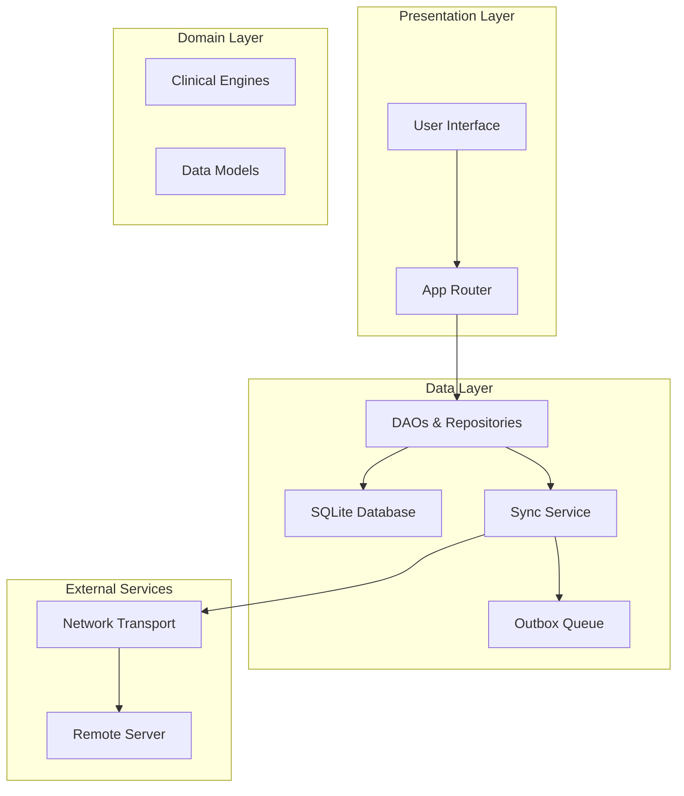
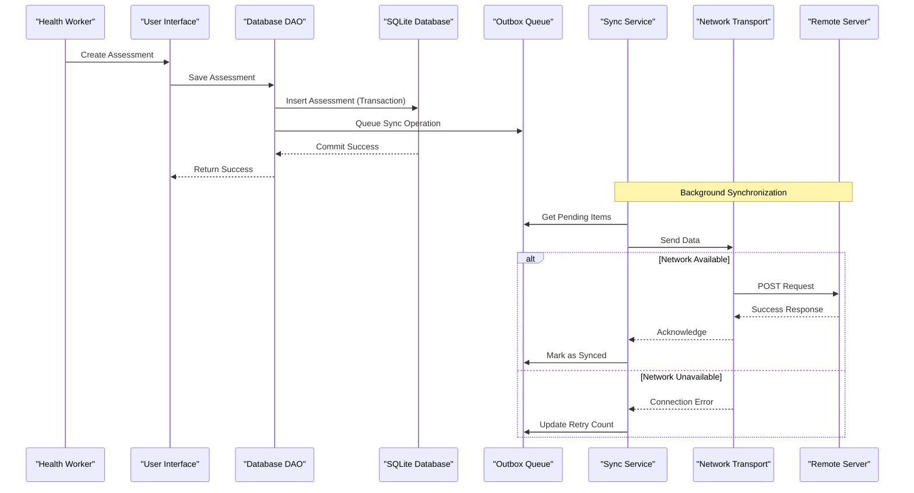
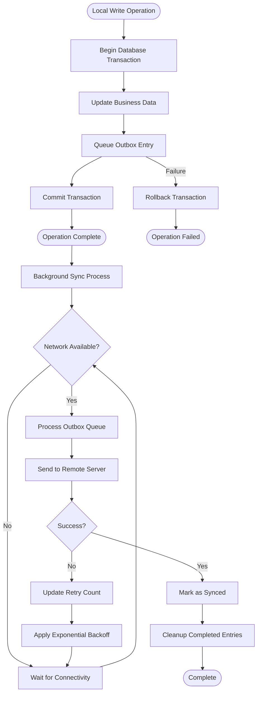
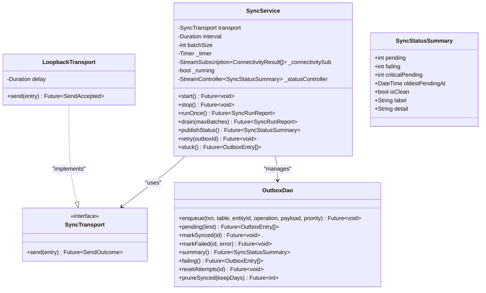
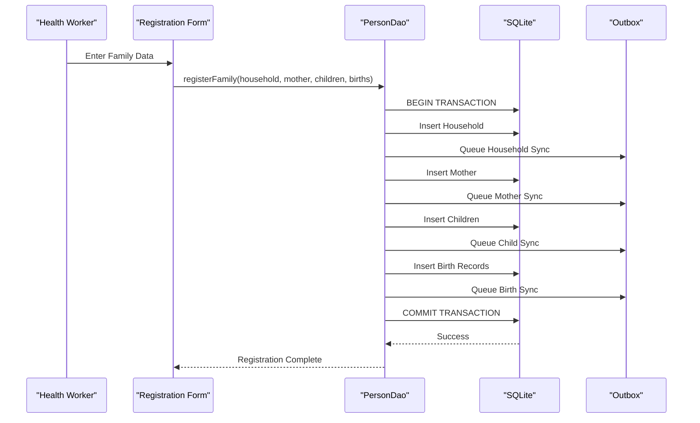
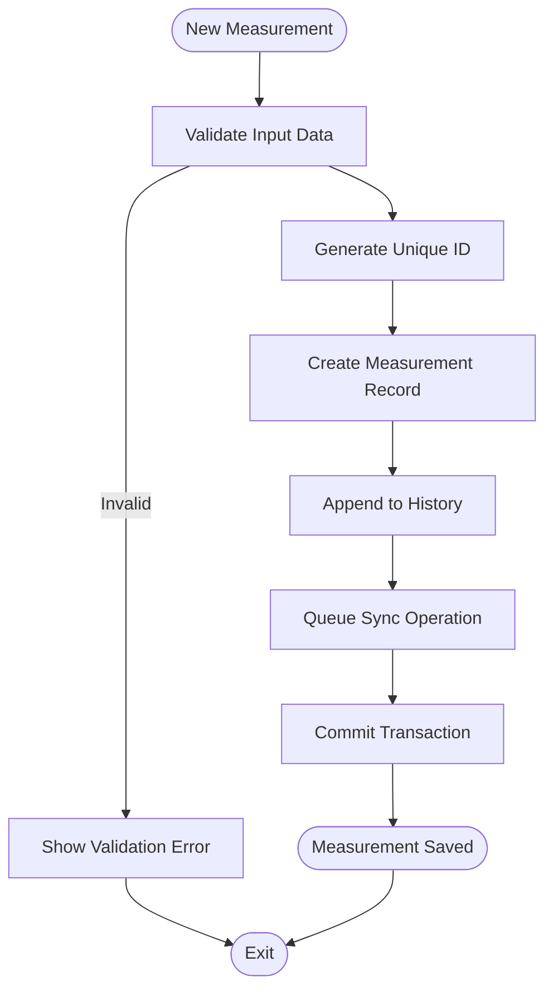
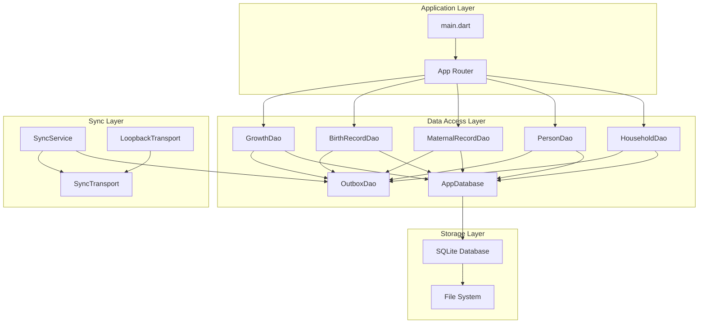

# Offline-First Strategy

<cite>
**Referenced Files in This Document**
- [README.md](file://README.md)
- [pubspec.yaml](file://pubspec.yaml)
- [main.dart](file://lib/main.dart)
- [app_database.dart](file://lib/data/local/app_database.dart)
- [outbox_dao.dart](file://lib/data/local/outbox_dao.dart)
- [sync_service.dart](file://lib/data/sync/sync_service.dart)
- [household_dao.dart](file://lib/data/local/household_dao.dart)
</cite>

## Table of Contents
1. [Introduction](#introduction)
2. [Project Structure](#project-structure)
3. [Core Components](#core-components)
4. [Architecture Overview](#architecture-overview)
5. [Detailed Component Analysis](#detailed-component-analysis)
6. [Dependency Analysis](#dependency-analysis)
7. [Performance Considerations](#performance-considerations)
8. [Troubleshooting Guide](#troubleshooting-guide)
9. [Conclusion](#conclusion)

## Introduction
CareBridge AI is an offline-first Flutter application designed for frontline health workers and caregivers in low-connectivity environments. The system treats SQLite as the source of truth, ensuring that every write succeeds locally before any network attempt. An outbox pattern guarantees reliable synchronization when connectivity becomes available, with priority-based ordering to ensure critical clinical events are sent first. Conflict resolution uses last-write-wins semantics based on timestamps, while append-only histories preserve clinical integrity.

The architecture emphasizes:
- Immediate local persistence with transactional consistency
- Outbox-driven synchronization with exponential backoff
- Priority-based queuing for urgent clinical data
- Soft deletes and append-only patterns for clinical records
- Resource-conscious design for mobile devices with limited storage and battery

## Project Structure
The application follows a layered architecture with clear separation between presentation, domain logic, and data access layers. The core offline-first functionality is implemented in the data layer with supporting components in the core layer.



**Diagram sources**
- [main.dart:1-35](file://lib/main.dart#L1-L35)
- [app_database.dart:1-556](file://lib/data/local/app_database.dart#L1-L556)
- [sync_service.dart:1-258](file://lib/data/sync/sync_service.dart#L1-L258)

**Section sources**
- [README.md:1-18](file://README.md#L1-L18)
- [pubspec.yaml:1-67](file://pubspec.yaml#L1-L67)
- [main.dart:1-35](file://lib/main.dart#L1-L35)

## Core Components
The offline-first architecture centers around three key components: the SQLite database schema, the outbox pattern for synchronization, and the sync service for background processing.

### Database Architecture
The SQLite database implements a comprehensive schema optimized for offline usage with 14 tables covering users, households, persons, clinical records, visits, assessments, referrals, and synchronization metadata.

### Outbox Pattern Implementation
The outbox pattern ensures that every local change is immediately queued for synchronization, guaranteeing data consistency even during network failures. Changes are prioritized based on clinical urgency.

### Sync Service
The sync service provides opportunistic synchronization that runs on connectivity changes and periodic intervals, never blocking user interactions.

**Section sources**
- [app_database.dart:1-556](file://lib/data/local/app_database.dart#L1-L556)
- [outbox_dao.dart:1-277](file://lib/data/local/outbox_dao.dart#L1-L277)
- [sync_service.dart:1-258](file://lib/data/sync/sync_service.dart#L1-L258)

## Architecture Overview
The offline-first architecture follows a clear separation of concerns where local operations are always immediate and synchronous, while network operations are asynchronous and non-blocking.



**Diagram sources**
- [household_dao.dart:23-41](file://lib/data/local/household_dao.dart#L23-L41)
- [outbox_dao.dart:160-181](file://lib/data/local/outbox_dao.dart#L160-L181)
- [sync_service.dart:156-217](file://lib/data/sync/sync_service.dart#L156-L217)

## Detailed Component Analysis

### SQLite Database Schema Design
The database schema is specifically designed for offline-first operation with careful attention to indexing strategies and relationship management.

#### Core Tables and Relationships
The schema includes 14 tables organized into logical groups: identity management (users), family structure (households, persons), clinical records (maternal_records, birth_records, growth_measurements), encounter tracking (visits, visit_participants, assessments), care coordination (referrals, barrier_reports), scheduling (scheduled_contacts), and system infrastructure (outbox, audit_log).

#### Indexing Strategy
Indexes are strategically placed to optimize common query patterns:
- Geographic queries for household discovery
- Time-series queries for clinical measurements
- Relationship lookups for person-family associations
- Performance-critical paths for dashboard and reporting

```mermaid
erDiagram
USERS {
TEXT id PK
TEXT full_name
TEXT phone UK
TEXT role
TEXT region
TEXT district
TEXT community
TEXT chps_zone
TEXT facility_name
TEXT staff_id
TEXT preferred_language
TEXT pin_hash
TEXT pin_salt
TEXT linked_household_id
TEXT created_at
}
HOUSEHOLDS {
TEXT id PK
TEXT name
TEXT region
TEXT district
TEXT community
TEXT created_by
TEXT head_name
TEXT contact_phone
REAL latitude
REAL longitude
INTEGER family_size
INTEGER has_valid_nhis
INTEGER walking_minutes_to_facility
TEXT landmark
TEXT created_at
TEXT updated_at
}
PERSONS {
TEXT id PK
TEXT household_id FK
TEXT full_name
TEXT client_type
TEXT sex
TEXT date_of_birth
INTEGER age_years_approx
TEXT phone
TEXT mother_id FK
INTEGER is_dob_estimated
TEXT nhis_number
TEXT created_at
TEXT updated_at
INTEGER is_active
}
MATERNAL_RECORDS {
TEXT person_id PK FK
INTEGER gravida
INTEGER parity
INTEGER previous_losses
INTEGER previous_caesarean
TEXT last_menstrual_period
TEXT expected_delivery_date
INTEGER anc_contacts_completed
INTEGER iptp_doses
INTEGER td_doses
INTEGER iron_folate_supplied
INTEGER llin_supplied
REAL haemoglobin
TEXT blood_group
TEXT sickling_status
INTEGER hiv_tested
TEXT delivery_date
TEXT delivery_place
TEXT delivery_mode
TEXT plurality
TEXT family_planning_method
TEXT updated_at
}
BIRTH_RECORDS {
TEXT person_id PK FK
REAL birth_weight_kg
INTEGER gestation_weeks_at_birth
TEXT delivery_place
TEXT delivery_mode
TEXT plurality
INTEGER birth_order
INTEGER resuscitation_needed
INTEGER cord_care_given
INTEGER vitamin_k_given
INTEGER breastfed_within_one_hour
TEXT updated_at
}
GROWTH_MEASUREMENTS {
TEXT id PK
TEXT person_id FK
TEXT taken_at
REAL muac_cm
REAL weight_kg
REAL height_cm
INTEGER has_bilateral_oedema
TEXT recorded_by
}
VISITS {
TEXT id PK
TEXT household_id FK
TEXT conducted_by
TEXT started_at
TEXT completed_at
TEXT reasons
REAL latitude
REAL longitude
TEXT notes
TEXT sync_state
}
VISIT_PARTICIPANTS {
TEXT visit_id FK
TEXT person_id FK
INTEGER was_present
TEXT absence_note
INTEGER queue_order
INTEGER assessed
}
ASSESSMENTS {
TEXT id PK
TEXT visit_id FK
TEXT person_id FK
TEXT client_type
TEXT performed_by
TEXT performed_at
TEXT inputs_json
TEXT result_json
TEXT overridden_triage
TEXT override_reason
TEXT override_by
TEXT sync_state
}
REFERRALS {
TEXT id PK
TEXT reference_code UK
TEXT person_id FK
TEXT assessment_id FK
TEXT facility_name
TEXT reason
TEXT urgency
TEXT issued_by
TEXT issued_at
TEXT status
TEXT status_updated_at
TEXT clinical_summary
TEXT arrival_confirmed_by
TEXT outcome_notes
TEXT escalated_at
TEXT sync_state
}
BARRIER_REPORTS {
TEXT id PK
TEXT household_id FK
TEXT person_id
TEXT referral_id
TEXT barriers
TEXT recorded_by
TEXT recorded_at
TEXT notes
INTEGER resolved
TEXT sync_state
}
SCHEDULED_CONTACTS {
TEXT id PK
TEXT person_id FK
TEXT household_id FK
TEXT due_date
TEXT purpose
TEXT created_by
TEXT completed_at
TEXT assessment_id
TEXT priority
TEXT sync_state
}
SYNC_OUTBOX {
INTEGER id PK
TEXT entity_table
TEXT entity_id
TEXT operation
TEXT payload_json
INTEGER priority
TEXT queued_at
INTEGER attempts
TEXT last_attempt_at
TEXT last_error
TEXT synced_at
}
AUDIT_LOG {
INTEGER id PK
TEXT actor_id
TEXT actor_role
TEXT action
TEXT entity_table
TEXT entity_id
TEXT outcome
TEXT detail
TEXT occurred_at
}
HOUSEHOLDS ||--o{ PERSONS : contains
PERSONS ||--o{ PERSONS : mothers_children
PERSONS ||--|| MATERNAL_RECORDS : has_record
PERSONS ||--|| BIRTH_RECORDS : has_record
PERSONS ||--o{ GROWTH_MEASUREMENTS : measured
HOUSEHOLDS ||--o{ VISITS : conducts
VISITS ||--o{ VISIT_PARTICIPANTS : includes
VISITS ||--o{ ASSESSMENTS : generates
PERSONS ||--o{ ASSESSMENTS : receives
PERSONS ||--o{ REFERRALS : referred
HOUSEHOLDS ||--o{ BARRIER_REPORTS : experiences
PERSONS ||--o{ SCHEDULED_CONTACTS : scheduled
```

**Diagram sources**
- [app_database.dart:194-556](file://lib/data/local/app_database.dart#L194-L556)

#### Foreign Key Constraints and Data Integrity
Foreign key constraints are enabled at the database level to maintain referential integrity. Cascade delete policies ensure that when parent records are deleted, dependent child records are automatically cleaned up, preventing orphaned data.

**Section sources**
- [app_database.dart:95-103](file://lib/data/local/app_database.dart#L95-L103)
- [app_database.dart:194-556](file://lib/data/local/app_database.dart#L194-L556)

### Outbox Pattern Implementation
The outbox pattern is implemented through a dedicated synchronization queue that ensures every local change is accompanied by a corresponding sync operation.

#### Transactional Consistency
Every database write operation is wrapped in a transaction that simultaneously updates the business data and queues a corresponding outbox entry. This atomic approach guarantees that either both operations succeed or both fail, maintaining data consistency.

#### Priority-Based Queuing
The outbox implements a priority system where critical clinical data (referrals, urgent assessments) are synchronized before routine data (registrations, schedules). This ensures that life-saving information reaches the server first when connectivity is limited.



**Diagram sources**
- [outbox_dao.dart:160-181](file://lib/data/local/outbox_dao.dart#L160-L181)
- [sync_service.dart:156-217](file://lib/data/sync/sync_service.dart#L156-L217)

#### Exponential Backoff Strategy
The outbox implements exponential backoff with a maximum cap to prevent battery drain during extended network outages. After each failed attempt, the retry delay doubles until reaching a maximum of 120 minutes.

**Section sources**
- [outbox_dao.dart:82-95](file://lib/data/local/outbox_dao.dart#L82-L95)
- [outbox_dao.dart:160-181](file://lib/data/local/outbox_dao.dart#L160-L181)

### Sync Service Architecture
The sync service manages background synchronization with opportunistic behavior that responds to connectivity changes without blocking user interactions.

#### Opportunistic Synchronization
The service monitors network connectivity and triggers synchronization when connectivity becomes available. It also runs on a periodic timer to handle cases where connectivity changes aren't detected.

#### Batch Processing
Synchronization occurs in small batches (default 25 items) to maximize success rates during brief connectivity windows. Each batch is processed independently, allowing partial progress even if the connection drops mid-sync.



**Diagram sources**
- [sync_service.dart:96-258](file://lib/data/sync/sync_service.dart#L96-L258)
- [outbox_dao.dart:160-277](file://lib/data/local/outbox_dao.dart#L160-L277)

#### Reentrancy Protection
The sync service includes reentrancy guards to prevent concurrent sync operations from causing duplicate sends or race conditions when triggered by both connectivity changes and periodic timers.

**Section sources**
- [sync_service.dart:96-258](file://lib/data/sync/sync_service.dart#L96-L258)

### Data Operations and Examples
The DAO layer provides concrete examples of how offline-first principles are applied to real-world healthcare scenarios.

#### Family Registration Workflow
The family registration demonstrates complex multi-table transactions with automatic outbox queuing:



**Diagram sources**
- [household_dao.dart:191-281](file://lib/data/local/household_dao.dart#L191-L281)

#### Growth Measurement Tracking
Growth measurements follow an append-only pattern to preserve clinical history integrity:



**Diagram sources**
- [household_dao.dart:534-552](file://lib/data/local/household_dao.dart#L534-L552)

**Section sources**
- [household_dao.dart:191-281](file://lib/data/local/household_dao.dart#L191-L281)
- [household_dao.dart:534-552](file://lib/data/local/household_dao.dart#L534-L552)

## Dependency Analysis
The offline-first architecture maintains clear dependency boundaries while enabling efficient communication between components.



**Diagram sources**
- [main.dart:1-35](file://lib/main.dart#L1-L35)
- [app_database.dart:43-173](file://lib/data/local/app_database.dart#L43-L173)
- [sync_service.dart:96-106](file://lib/data/sync/sync_service.dart#L96-L106)

### Coupling and Cohesion
The architecture demonstrates high cohesion within components and loose coupling between layers. Each DAO focuses on specific entity types while sharing common infrastructure through the AppDatabase singleton.

### External Dependencies
The system depends on several external libraries for core functionality:
- **sqflite**: SQLite database operations
- **connectivity_plus**: Network connectivity monitoring
- **path_provider**: File system access
- **flutter_secure_storage**: Secure credential storage

**Section sources**
- [pubspec.yaml:12-55](file://pubspec.yaml#L12-L55)

## Performance Considerations
The offline-first architecture is specifically optimized for resource-constrained mobile environments typical of field healthcare settings.

### Database Optimization
- **Index Strategy**: Strategic indexing minimizes query times for common operations like geographic searches and time-series analysis
- **Foreign Keys**: Database-level constraints prevent orphaned records and maintain referential integrity
- **Soft Deletes**: Using flags instead of deletion preserves historical data while keeping active datasets lean

### Memory Management
- **Lazy Loading**: Database connections are opened on-demand and cached
- **Batch Processing**: Large datasets are processed in manageable chunks to prevent memory pressure
- **Connection Pooling**: Single database instance prevents resource exhaustion

### Battery Optimization
- **Opportunistic Sync**: Synchronization only occurs when connectivity is available
- **Exponential Backoff**: Retry delays increase exponentially to minimize power consumption during outages
- **Background Processing**: Sync operations run in background without blocking UI threads

### Storage Efficiency
- **Pruning Strategy**: Successfully synced entries older than 14 days are automatically removed
- **Compact Queries**: Efficient SQL queries minimize data transfer and processing overhead
- **JSON Payloads**: Flexible data structures reduce schema migration complexity

## Troubleshooting Guide
The offline-first architecture includes comprehensive error handling and debugging capabilities to support field deployment scenarios.

### Common Issues and Solutions

#### Network Connectivity Problems
- **Symptom**: Outbox entries accumulate with increasing retry counts
- **Solution**: Check device connectivity settings and network availability
- **Monitoring**: Use `SyncService.stuck()` to identify entries requiring manual intervention

#### Database Corruption
- **Symptom**: Application crashes during database operations
- **Solution**: Use `AppDatabase.clearAll()` to reset demo data while preserving schema
- **Prevention**: Regular backups and version migration testing

#### Sync Failures
- **Symptom**: Critical data not appearing on remote server
- **Solution**: Check `OutboxDao.failing()` for entries with persistent errors
- **Resolution**: Use `SyncService.retry()` after resolving underlying issues

### Debugging Tools
- **Audit Logging**: Comprehensive audit trail tracks all permission denials and clinical overrides
- **Sync Status Monitoring**: Real-time status updates show pending, failing, and critical items
- **Manual Retry**: Built-in retry mechanism allows operators to force synchronization

**Section sources**
- [sync_service.dart:250-257](file://lib/data/sync/sync_service.dart#L250-L257)
- [outbox_dao.dart:240-261](file://lib/data/local/outbox_dao.dart#L240-L261)
- [app_database.dart:136-161](file://lib/data/local/app_database.dart#L136-L161)

## Conclusion
CareBridge AI's offline-first architecture successfully addresses the challenges of healthcare delivery in low-connectivity environments. The combination of SQLite as the source of truth, transactional outbox synchronization, and priority-based queuing ensures that critical clinical data is never lost while providing a seamless user experience regardless of network conditions.

Key strengths of the implementation include:
- **Reliability**: Transactional consistency guarantees data integrity
- **Performance**: Optimized for resource-constrained mobile devices
- **Scalability**: Clean architecture supports future enhancements
- **Maintainability**: Clear separation of concerns and comprehensive documentation

The architecture provides a solid foundation for healthcare applications in challenging environments while maintaining the flexibility to adapt to evolving requirements and technologies.