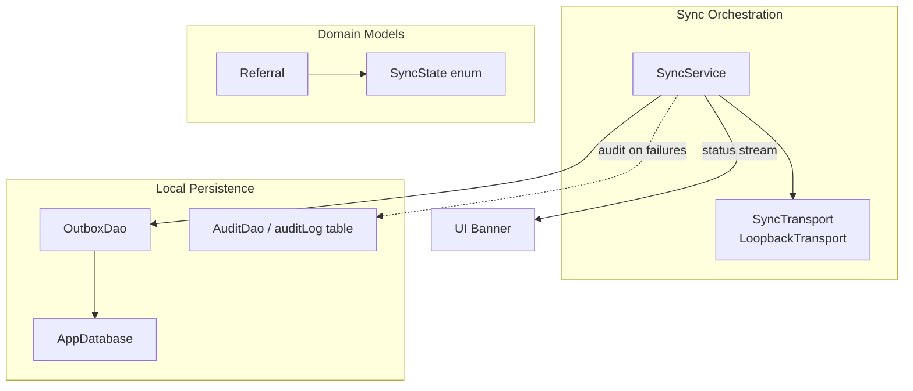
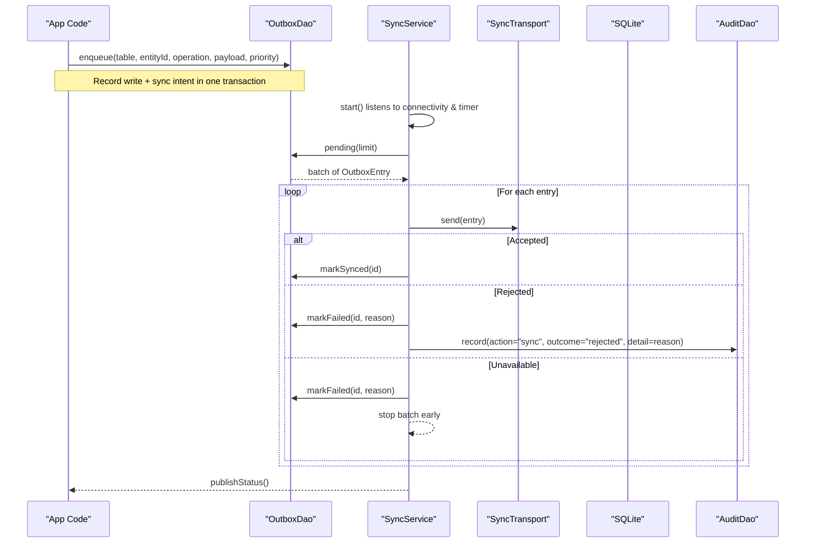
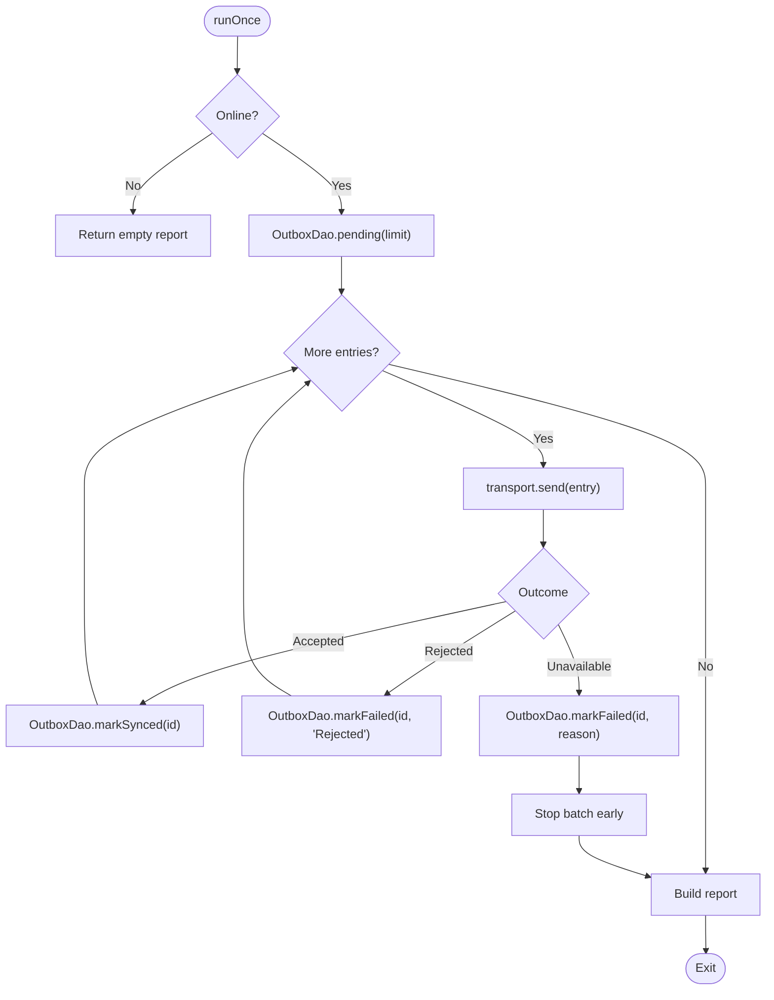
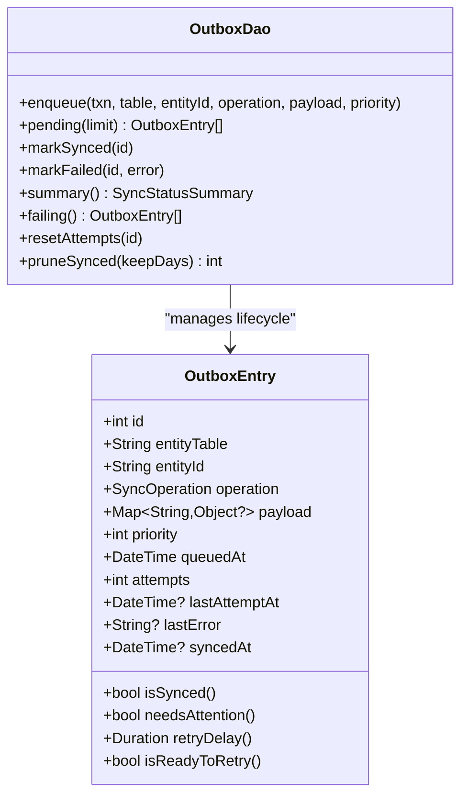
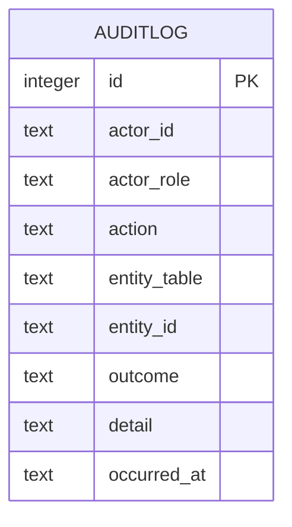
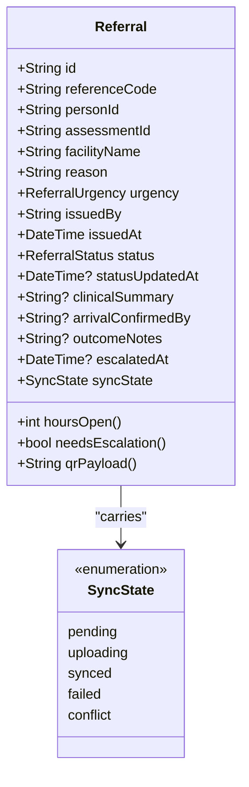
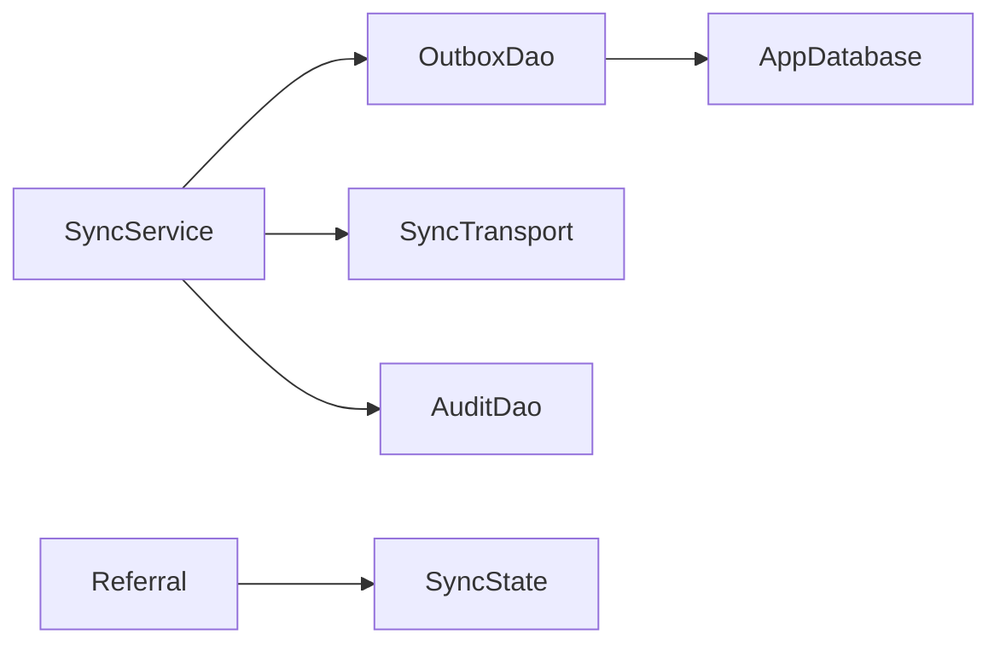

# Conflict Resolution Strategies

<cite>
**Referenced Files in This Document**
- [sync_service.dart](file://lib/data/sync/sync_service.dart)
- [outbox_dao.dart](file://lib/data/local/outbox_dao.dart)
- [app_database.dart](file://lib/data/local/app_database.dart)
- [user_dao.dart](file://lib/data/local/user_dao.dart)
- [visit_dao.dart](file://lib/data/local/visit_dao.dart)
- [visit.dart](file://lib/domain/entities/visit.dart)
- [enums.dart](file://lib/domain/enums.dart)
</cite>

## Table of Contents
1. [Introduction](#introduction)
2. [Project Structure](#project-structure)
3. [Core Components](#core-components)
4. [Architecture Overview](#architecture-overview)
5. [Detailed Component Analysis](#detailed-component-analysis)
6. [Dependency Analysis](#dependency-analysis)
7. [Performance Considerations](#performance-considerations)
8. [Troubleshooting Guide](#troubleshooting-guide)
9. [Conclusion](#conclusion)

## Introduction
This document explains how CareBridge AI’s synchronization system detects and resolves data conflicts between local changes and remote updates. It covers the conflict detection mechanisms, resolution policies (including last-write-wins), merge strategies per entity type, audit trails for accountability, and user notification patterns for manual intervention versus automated workflows. The design emphasizes resilience in low-connectivity environments, prioritizing urgent clinical events while keeping the app fully functional offline.

## Project Structure
The conflict resolution strategy is implemented across the data layer (outbox persistence and sync orchestration), domain entities (which carry sync state), and presentation hooks that surface status to users. Key areas:
- Sync orchestration and transport abstraction
- Outbox queue with priority and retry/backoff
- Audit logging for accountability
- Domain models carrying sync state and timestamps used by server-side merge rules

**Diagram sources**
- [sync_service.dart:96-258](file://lib/data/sync/sync_service.dart#L96-L258)
- [outbox_dao.dart:160-277](file://lib/data/local/outbox_dao.dart#L160-L277)
- [app_database.dart:539-555](file://lib/data/local/app_database.dart#L539-L555)
- [visit.dart:418-523](file://lib/domain/entities/visit.dart#L418-L523)
- [enums.dart:349-363](file://lib/domain/enums.dart#L349-L363)

**Section sources**
- [sync_service.dart:1-258](file://lib/data/sync/sync_service.dart#L1-L258)
- [outbox_dao.dart:1-277](file://lib/data/local/outbox_dao.dart#L1-L277)
- [app_database.dart:539-555](file://lib/data/local/app_database.dart#L539-L555)
- [visit.dart:418-523](file://lib/domain/entities/visit.dart#L418-L523)
- [enums.dart:349-363](file://lib/domain/enums.dart#L349-L363)

## Core Components
- SyncService: Orchestrates opportunistic sync runs triggered by connectivity changes and periodic timers. Batches outbox entries, sends via a pluggable transport, and updates statuses based on outcomes.
- OutboxDao: Persists pending operations with priority ordering, exponential backoff, and failure tracking. Provides summaries and helpers for retrying or pruning synced rows.
- SyncTransport: Abstraction for network calls; currently backed by LoopbackTransport for testing/demo.
- AuditDao and auditLog table: Immutable log of actions and outcomes for accountability, including sync-related events.
- Domain entities (e.g., Referral): Carry fields like syncState and timestamps that inform server-side merge behavior and escalation logic.

Key responsibilities for conflict handling:
- Detect overlapping modifications via operation types and entity identity.
- Apply last-write-wins using server-side updated_at semantics.
- Surface conflicts requiring human review when both sides change.
- Maintain an audit trail for all sync attempts and resolutions.

**Section sources**
- [sync_service.dart:96-258](file://lib/data/sync/sync_service.dart#L96-L258)
- [outbox_dao.dart:31-115](file://lib/data/local/outbox_dao.dart#L31-L115)
- [user_dao.dart:345-391](file://lib/data/local/user_dao.dart#L345-L391)
- [app_database.dart:539-555](file://lib/data/local/app_database.dart#L539-L555)
- [visit.dart:418-523](file://lib/domain/entities/visit.dart#L418-L523)
- [enums.dart:349-363](file://lib/domain/enums.dart#L349-L363)

## Architecture Overview
The sync pipeline is designed to be resilient and non-blocking. Local writes are immediately persisted and enqueued for eventual consistency. When connectivity appears, batches are sent with priority ordering. Server responses determine whether to mark entries as synced, failed, or deferred. Conflicts are surfaced through sync states and audit records.

**Diagram sources**
- [sync_service.dart:116-217](file://lib/data/sync/sync_service.dart#L116-L217)
- [outbox_dao.dart:164-218](file://lib/data/local/outbox_dao.dart#L164-L218)
- [user_dao.dart:382-391](file://lib/data/local/user_dao.dart#L382-L391)

**Section sources**
- [sync_service.dart:116-217](file://lib/data/sync/sync_service.dart#L116-L217)
- [outbox_dao.dart:164-218](file://lib/data/local/outbox_dao.dart#L164-L218)

## Detailed Component Analysis

### SyncService: Conflict Detection and Resolution Orchestration
- Triggers sync opportunistically on connectivity changes and periodically.
- Retrieves pending outbox entries ordered by priority and age.
- Sends entries via SyncTransport and classifies outcomes:
  - Accepted: mark synced and continue.
  - Rejected: mark failed with reason; escalate to human attention after repeated failures.
  - Unavailable: mark failed and pause the batch to avoid burning retries.
- Publishes status summaries to UI and exposes helpers to retry stuck items.

Conflict detection and policy:
- The system assumes server-side last-write-wins based on updated_at timestamps.
- If both device and server modify the same entity, the server applies its own merge rule; the client surfaces a conflict state for visibility and potential review.

**Diagram sources**
- [sync_service.dart:156-217](file://lib/data/sync/sync_service.dart#L156-L217)

**Section sources**
- [sync_service.dart:156-217](file://lib/data/sync/sync_service.dart#L156-L217)

### OutboxDao: Priority Queue, Backoff, and Failure Handling
- Enqueues operations atomically with the data write.
- Orders by priority then queued time to ensure urgent referrals leave first.
- Tracks attempts, last attempt time, and last error for each entry.
- Exponential backoff with capped delay prevents battery drain and long waits.
- Provides summary metrics and failing entries for user review.

Conflict-related behaviors:
- Entries marked as failed persist with errors until resolved or retried.
- After multiple failures, entries require human attention, enabling targeted conflict resolution workflows.

**Diagram sources**
- [outbox_dao.dart:49-115](file://lib/data/local/outbox_dao.dart#L49-L115)
- [outbox_dao.dart:160-277](file://lib/data/local/outbox_dao.dart#L160-L277)

**Section sources**
- [outbox_dao.dart:49-115](file://lib/data/local/outbox_dao.dart#L49-L115)
- [outbox_dao.dart:160-277](file://lib/data/local/outbox_dao.dart#L160-L277)

### Audit Trail: Accountability for Conflicts and Resolutions
- AuditDao records actions, outcomes, actors, and details without blocking care delivery.
- The auditLog table stores immutable records with indexes for efficient querying.
- Sync failures and rejections are logged to support post-hoc analysis and compliance.

**Diagram sources**
- [app_database.dart:539-555](file://lib/data/local/app_database.dart#L539-L555)
- [user_dao.dart:345-391](file://lib/data/local/user_dao.dart#L345-L391)

**Section sources**
- [user_dao.dart:345-391](file://lib/data/local/user_dao.dart#L345-L391)
- [app_database.dart:539-555](file://lib/data/local/app_database.dart#L539-L555)

### Domain Entities and Merge Strategy Signals
- Referral carries syncState and timestamps (issuedAt, statusUpdatedAt) that inform server-side merge decisions and escalation triggers.
- SyncState enum includes a conflict state indicating both sides changed and need review.

Merge strategy highlights:
- Last-write-wins based on server-side updated_at semantics.
- Conflict state surfaces when both device and server modified the same entity.
- Business rules (e.g., urgency) influence prioritization and escalation but not automatic merges.

**Diagram sources**
- [visit.dart:418-523](file://lib/domain/entities/visit.dart#L418-L523)
- [enums.dart:349-363](file://lib/domain/enums.dart#L349-L363)

**Section sources**
- [visit.dart:418-523](file://lib/domain/entities/visit.dart#L418-L523)
- [enums.dart:349-363](file://lib/domain/enums.dart#L349-L363)

### Practical Conflict Scenarios and Resolution Workflows
- Concurrent patient record updates:
  - Both device and server update the same visit or assessment.
  - Server applies last-write-wins using updated_at; client marks syncState as conflict if needed.
  - Audit logs capture rejection or conflict outcomes; UI shows status banner and allows retry.
- Referral status changes:
  - Urgent referrals have higher priority and may trigger escalation if unconfirmed.
  - Conflicts in status transitions are surfaced via syncState and can be reviewed manually.
- Measurement discrepancies:
  - Growth or clinical measurements updated locally and remotely lead to conflict states.
  - Resolution may involve reconciling values and documenting rationale in audit trail.

User notifications:
- Status banner displays counts of pending, failing, and critical items.
- Failing entries are listed with last error messages for targeted resolution.
- Manual retry is available after addressing underlying issues.

Automated workflows:
- Exponential backoff handles transient network issues automatically.
- Pruning removes old synced entries to conserve storage.
- Critical items are prioritized to ensure timely transmission.

**Section sources**
- [sync_service.dart:116-217](file://lib/data/sync/sync_service.dart#L116-L217)
- [outbox_dao.dart:117-158](file://lib/data/local/outbox_dao.dart#L117-L158)
- [visit.dart:418-523](file://lib/domain/entities/visit.dart#L418-L523)
- [enums.dart:349-363](file://lib/domain/enums.dart#L349-L363)

## Dependency Analysis
The sync subsystem depends on local persistence and a transport abstraction. Domain entities provide context for conflict states and timestamps.

**Diagram sources**
- [sync_service.dart:96-258](file://lib/data/sync/sync_service.dart#L96-L258)
- [outbox_dao.dart:160-277](file://lib/data/local/outbox_dao.dart#L160-L277)
- [app_database.dart:539-555](file://lib/data/local/app_database.dart#L539-L555)
- [visit.dart:418-523](file://lib/domain/entities/visit.dart#L418-L523)
- [enums.dart:349-363](file://lib/domain/enums.dart#L349-L363)

**Section sources**
- [sync_service.dart:96-258](file://lib/data/sync/sync_service.dart#L96-L258)
- [outbox_dao.dart:160-277](file://lib/data/local/outbox_dao.dart#L160-L277)

## Performance Considerations
- Small batches reduce rollback risk and improve progress under intermittent connectivity.
- Priority ordering ensures urgent clinical events transmit before routine data.
- Exponential backoff balances reliability with battery conservation.
- Pruning synced entries keeps storage usage manageable over time.
- Non-blocking design avoids impacting care delivery workflows.

[No sources needed since this section provides general guidance]

## Troubleshooting Guide
Common issues and steps:
- Stuck entries:
  - Use SyncService.stuck() to list failing entries with last error messages.
  - Call SyncService.retry(id) to reset attempts and re-run sync.
- Network unavailable:
  - Sync pauses the batch to avoid wasting retries; wait for connectivity and retry automatically.
- Rejected entries:
  - Review last_error and audit logs to understand server-side reasons.
  - Correct data or permissions and retry.
- Storage growth:
  - Ensure pruneSynced runs after successful syncs to remove old entries.

**Section sources**
- [sync_service.dart:244-258](file://lib/data/sync/sync_service.dart#L244-L258)
- [outbox_dao.dart:240-277](file://lib/data/local/outbox_dao.dart#L240-L277)
- [user_dao.dart:382-391](file://lib/data/local/user_dao.dart#L382-L391)

## Conclusion
CareBridge AI’s synchronization system implements robust conflict detection and resolution strategies tailored for low-connectivity environments. By combining priority-based queuing, exponential backoff, last-write-wins merge semantics, and comprehensive audit logging, it ensures reliable data consistency while keeping clinicians focused on care delivery. Conflicts are surfaced clearly for manual intervention when necessary, and predictable scenarios are handled automatically to minimize friction.

[No sources needed since this section summarizes without analyzing specific files]