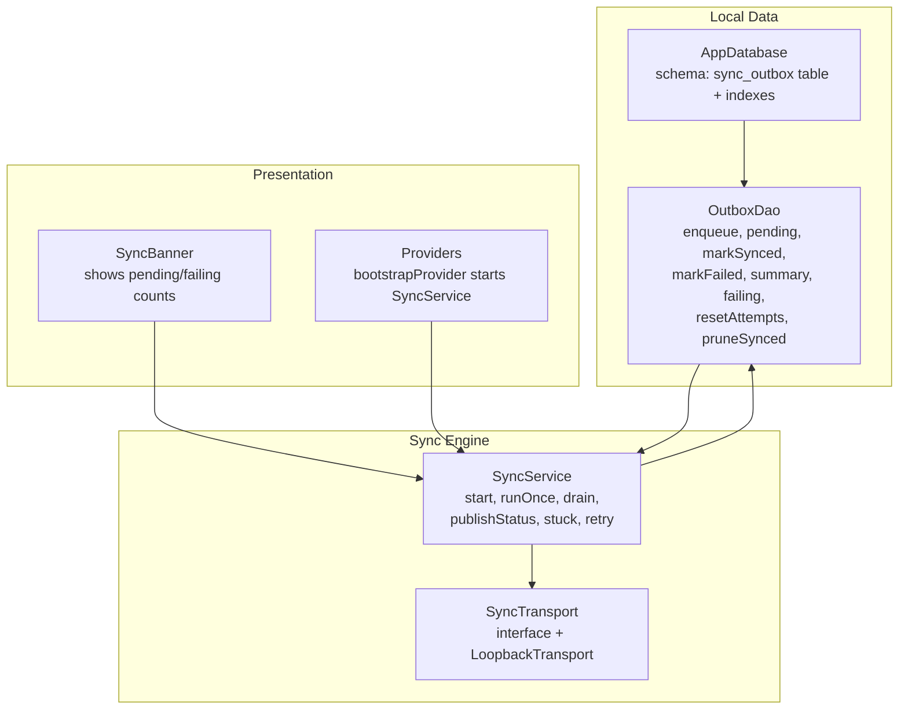
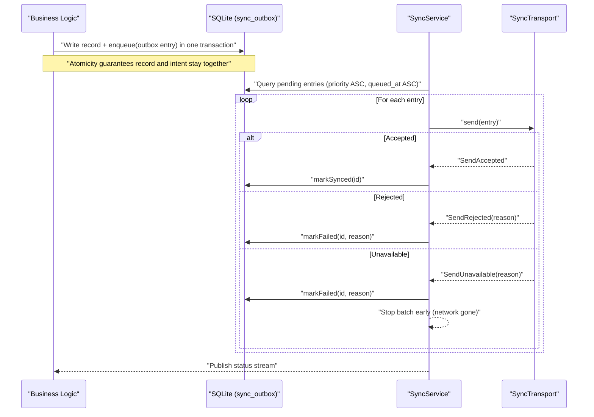
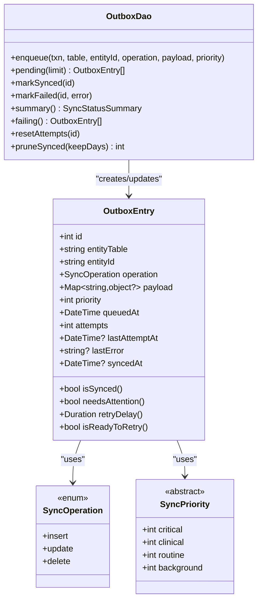
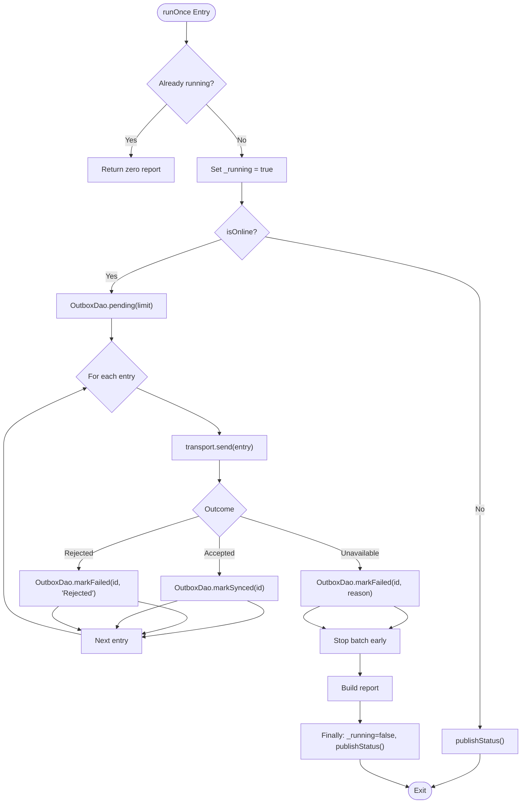
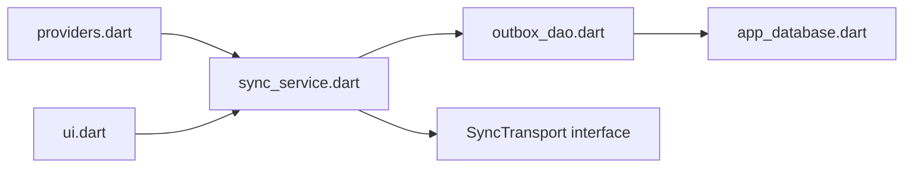

# Outbox Pattern & Synchronization

<cite>
**Referenced Files in This Document**
- [outbox_dao.dart](file://lib/data/local/outbox_dao.dart)
- [sync_service.dart](file://lib/data/sync/sync_service.dart)
- [app_database.dart](file://lib/data/local/app_database.dart)
- [providers.dart](file://lib/app/providers.dart)
- [ui.dart](file://lib/presentation/shared/ui.dart)
</cite>

## Table of Contents
1. [Introduction](#introduction)
2. [Project Structure](#project-structure)
3. [Core Components](#core-components)
4. [Architecture Overview](#architecture-overview)
5. [Detailed Component Analysis](#detailed-component-analysis)
6. [Dependency Analysis](#dependency-analysis)
7. [Performance Considerations](#performance-considerations)
8. [Troubleshooting Guide](#troubleshooting-guide)
9. [Conclusion](#conclusion)

## Introduction
This document explains CareBridge AI’s outbox pattern for reliable data synchronization. It focuses on how local changes are queued in the sync_outbox table within the same transaction as the original write, ensuring consistency even during network failures. It also documents priority-based queuing (urgent referrals before routine registrations), retry mechanisms with attempt tracking and error logging, conflict resolution strategies when syncing back to remote systems, background synchronization processes, network failure handling, monitoring failed attempts, battery optimization techniques, and storage management for large queues in low-resource environments.

## Project Structure
The outbox implementation spans three primary areas:
- Local persistence and DAO layer for the outbox table and operations
- Background synchronization service that orchestrates sending and retries
- Presentation layer components that surface sync status to users

**Diagram sources**
- [outbox_dao.dart:160-276](file://lib/data/local/outbox_dao.dart#L160-L276)
- [app_database.dart:515-533](file://lib/data/local/app_database.dart#L515-L533)
- [sync_service.dart:96-257](file://lib/data/sync/sync_service.dart#L96-L257)
- [ui.dart:352-415](file://lib/presentation/shared/ui.dart#L352-L415)
- [providers.dart:38-42](file://lib/app/providers.dart#L38-L42)

**Section sources**
- [outbox_dao.dart:1-276](file://lib/data/local/outbox_dao.dart#L1-L276)
- [sync_service.dart:1-257](file://lib/data/sync/sync_service.dart#L1-L257)
- [app_database.dart:515-533](file://lib/data/local/app_database.dart#L515-L533)
- [providers.dart:38-42](file://lib/app/providers.dart#L38-L42)
- [ui.dart:352-415](file://lib/presentation/shared/ui.dart#L352-L415)

## Core Components
- OutboxEntry: Represents a single change to be synced, including entity identity, operation type, payload, priority, timestamps, and retry metadata.
- SyncOperation: Coarse-grained operation types (insert, update, delete).
- SyncPriority: Priority levels used to order urgent items first (critical, clinical, routine, background).
- OutboxDao: Database access methods for enqueueing entries, querying pending items, marking success or failure, summarizing status, listing failing entries, resetting attempts, and pruning old synced rows.
- SyncService: Orchestrates background sync, handles connectivity, runs batches, updates statuses, exposes streams for UI, and provides manual “send now” via drain.
- SyncTransport: Abstraction for remote delivery; includes a LoopbackTransport for testing/demo.
- SyncStatusSummary: Aggregated metrics for the banner (pending, failing, criticalPending, oldestPendingAt).
- SyncBanner: UI component that displays sync status and prompts.

Key behaviors:
- Enqueue is designed to be called inside the same database transaction as the business write, guaranteeing atomicity between the record and its sync intent.
- Pending queries return highest-priority, oldest-first entries that are ready to retry based on exponential backoff.
- MarkSynced clears last_error and records synced_at; markFailed increments attempts and stores last_attempt_at and last_error.
- Summary aggregates counts for UI banners and dashboards.
- Failing returns entries needing human attention after repeated failures.
- PruneSynced removes successfully synced rows older than a retention window to manage storage.

**Section sources**
- [outbox_dao.dart:49-158](file://lib/data/local/outbox_dao.dart#L49-L158)
- [outbox_dao.dart:160-276](file://lib/data/local/outbox_dao.dart#L160-L276)
- [sync_service.dart:32-94](file://lib/data/sync/sync_service.dart#L32-L94)
- [sync_service.dart:96-257](file://lib/data/sync/sync_service.dart#L96-L257)
- [ui.dart:352-415](file://lib/presentation/shared/ui.dart#L352-L415)

## Architecture Overview
The outbox pattern ensures offline-first reliability by persisting both the business data and the corresponding sync intent atomically. The background sync engine opportunistically sends small batches over the network, updating the outbox state per item.

**Diagram sources**
- [outbox_dao.dart:160-276](file://lib/data/local/outbox_dao.dart#L160-L276)
- [sync_service.dart:156-217](file://lib/data/sync/sync_service.dart#L156-L217)

## Detailed Component Analysis

### Outbox DAO and Data Model
- enqueue: Inserts an outbox row with entity_table, entity_id, operation, payload_json, priority, queued_at, attempts=0. Must be called within the same transaction as the business write.
- pending: Returns up to batchSize entries where synced_at IS NULL, ordered by priority ASC then queued_at ASC, filtered by isReadyToRetry using exponential backoff.
- markSynced: Sets synced_at and clears last_error.
- markFailed: Increments attempts, sets last_attempt_at and last_error.
- summary: Aggregates pending, failing (attempts >= 5), criticalPending (priority <= critical), and oldestPendingAt.
- failing: Lists entries with synced_at IS NULL AND attempts >= 5, ordered by last_attempt_at DESC.
- resetAttempts: Resets attempts and last_error for manual retry flows.
- pruneSynced: Deletes synced rows older than keepDays to manage storage.

Data model highlights:
- OutboxEntry fields include id, entityTable, entityId, operation, payload, priority, queuedAt, attempts, lastAttemptAt, lastError, syncedAt.
- Exponential backoff uses retryDelay = min(max(2^attempts minutes), 120 minutes).
- needsAttention indicates entries requiring human intervention (attempts >= 5 and not synced).

**Diagram sources**
- [outbox_dao.dart:49-158](file://lib/data/local/outbox_dao.dart#L49-L158)
- [outbox_dao.dart:160-276](file://lib/data/local/outbox_dao.dart#L160-L276)

**Section sources**
- [outbox_dao.dart:160-276](file://lib/data/local/outbox_dao.dart#L160-L276)
- [outbox_dao.dart:49-158](file://lib/data/local/outbox_dao.dart#L49-L158)

### Background Sync Service
- start: Starts periodic timer and listens to connectivity changes to trigger opportunistic sync.
- runOnce: Guards against re-entrancy, checks online status, fetches pending batch, sends each via transport, updates outbox state per outcome, publishes status.
- drain: Loops runOnce up to maxBatches until no progress or limit reached; prunes synced rows afterward.
- publishStatus: Computes summary and broadcasts via StreamController.
- stuck: Returns failing entries for human review.
- retry: Resets attempts for a specific entry and triggers runOnce.

**Diagram sources**
- [sync_service.dart:156-217](file://lib/data/sync/sync_service.dart#L156-L217)

**Section sources**
- [sync_service.dart:96-257](file://lib/data/sync/sync_service.dart#L96-L257)

### Database Schema and Indexing
- sync_outbox table includes id, entity_table, entity_id, operation, payload_json, priority, queued_at, attempts, last_attempt_at, last_error, synced_at.
- Indexes:
  - idx_outbox_pending(synced_at, priority, queued_at): Optimizes pending queries ordering by priority and time.
  - idx_outbox_entity(entity_table, entity_id): Supports entity-specific lookups if needed.

Practical implications:
- Ordering ensures urgent referrals leave before routine registrations.
- Small batch size reduces rollback risk and improves partial progress under intermittent connectivity.

**Section sources**
- [app_database.dart:515-533](file://lib/data/local/app_database.dart#L515-L533)

### User Interface Integration
- SyncBanner shows pending and failing counts with reassuring messaging.
- Providers bootstrap the app, initialize the database, seed demo data, and start SyncService.
- Status stream drives banner content without blocking UI.

**Section sources**
- [ui.dart:352-415](file://lib/presentation/shared/ui.dart#L352-L415)
- [providers.dart:38-42](file://lib/app/providers.dart#L38-L42)

## Dependency Analysis
- SyncService depends on OutboxDao for all outbox operations and on SyncTransport for remote delivery.
- OutboxDao depends on AppDatabase for SQLite access.
- Providers wire SyncService into the app lifecycle and expose status streams to the UI.

**Diagram sources**
- [providers.dart:38-42](file://lib/app/providers.dart#L38-L42)
- [sync_service.dart:96-257](file://lib/data/sync/sync_service.dart#L96-L257)
- [outbox_dao.dart:160-276](file://lib/data/local/outbox_dao.dart#L160-L276)
- [app_database.dart:515-533](file://lib/data/local/app_database.dart#L515-L533)
- [ui.dart:352-415](file://lib/presentation/shared/ui.dart#L352-L415)

**Section sources**
- [providers.dart:38-42](file://lib/app/providers.dart#L38-L42)
- [sync_service.dart:96-257](file://lib/data/sync/sync_service.dart#L96-L257)
- [outbox_dao.dart:160-276](file://lib/data/local/outbox_dao.dart#L160-L276)
- [app_database.dart:515-533](file://lib/data/local/app_database.dart#L515-L533)
- [ui.dart:352-415](file://lib/presentation/shared/ui.dart#L352-L415)

## Performance Considerations
- Batch size: Default 25 balances throughput and resilience under short connectivity windows.
- Exponential backoff: retryDelay clamped between 1 and 120 minutes prevents battery drain while avoiding long waits.
- Index usage: idx_outbox_pending optimizes pending queries; ensure queries remain selective.
- Storage pruning: pruneSynced keeps only recent synced history to conserve space on shared devices.
- Opportunistic sync: Connectivity listener triggers immediate sync attempts, reducing latency when networks appear.

[No sources needed since this section provides general guidance]

## Troubleshooting Guide
Common scenarios and resolutions:
- Network unavailable:
  - Behavior: runOnce detects offline and returns immediately; entries remain pending.
  - Action: Wait for connectivity; the banner will reflect pending count.
- Server rejection:
  - Behavior: SendRejected marks entry as failed with reason; attempts increment.
  - Action: Review last_error; fix data issues; use retry flow to reset attempts.
- Intermittent connectivity:
  - Behavior: SendUnavailable marks failed and stops batch early to avoid burning attempts.
  - Action: Ensure device has stable connection; rely on periodic retries.
- Stuck entries:
  - Behavior: needsAttention flags entries with attempts >= 5 and not synced.
  - Action: Use stuck() to list failing entries; resolve errors; call retry(id) to reset attempts and resync.
- Storage growth:
  - Behavior: Outbox grows over time; pruneSynced removes old synced rows.
  - Action: Run drain periodically to trigger pruning; adjust keepDays if needed.

**Section sources**
- [sync_service.dart:156-217](file://lib/data/sync/sync_service.dart#L156-L217)
- [outbox_dao.dart:240-276](file://lib/data/local/outbox_dao.dart#L240-L276)

## Conclusion
CareBridge AI’s outbox pattern ensures reliable, offline-first synchronization by atomically persisting both business records and their sync intents. Priority-based queuing guarantees urgent referrals are sent first, while exponential backoff and attempt tracking protect device battery and surface persistent failures for human intervention. The background sync service opportunistically leverages connectivity, processes small batches, and maintains clear status feedback through the UI. With robust indexing, storage pruning, and a pluggable transport abstraction, the system scales gracefully across low-resource environments and varying network conditions.