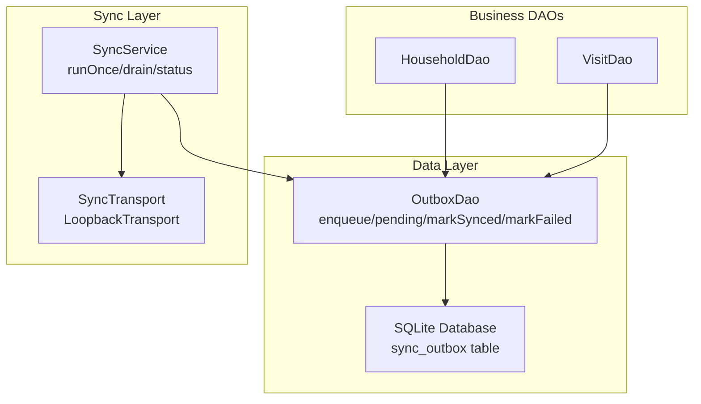
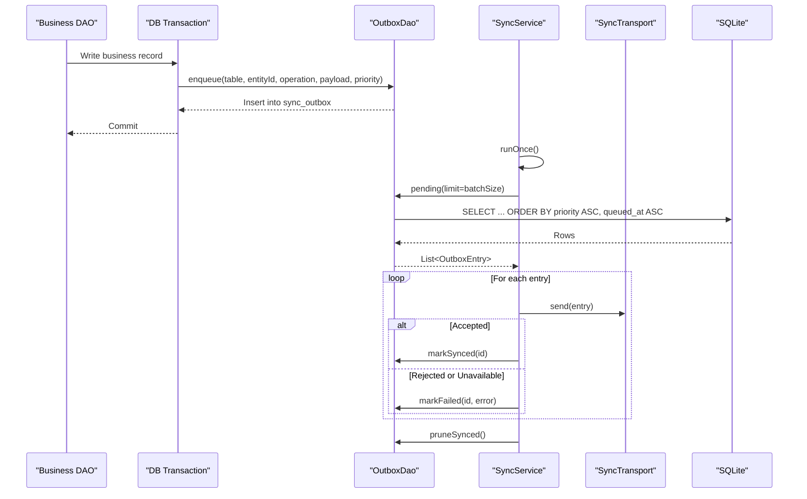
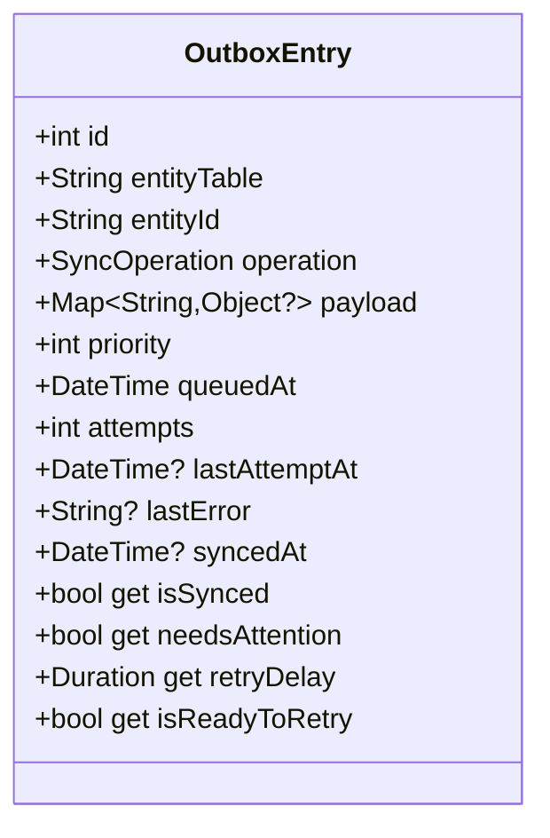
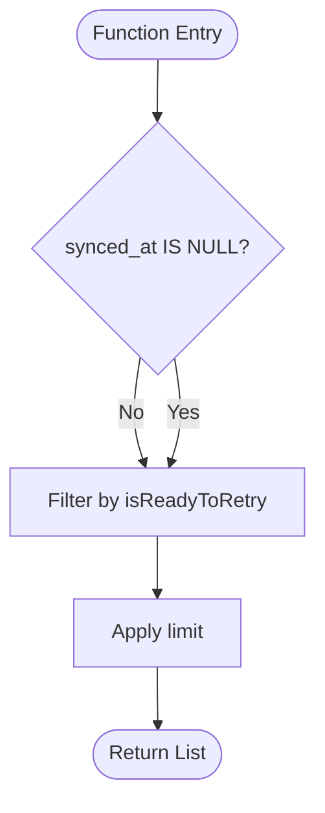
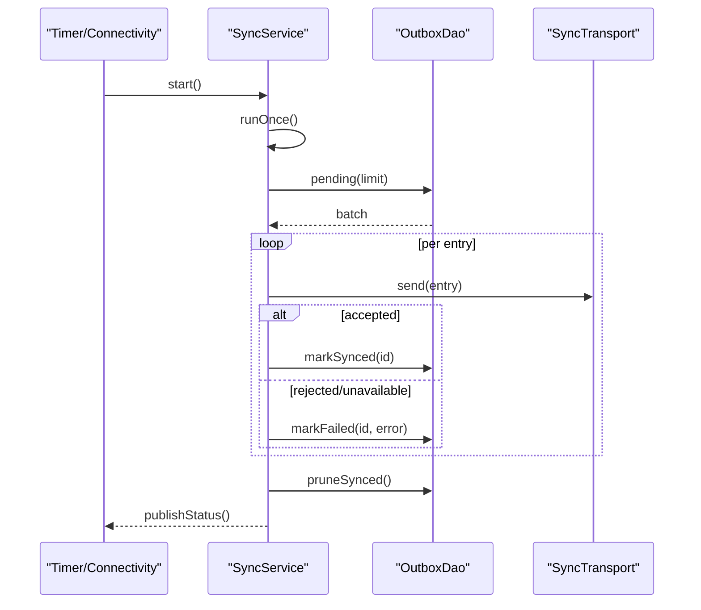
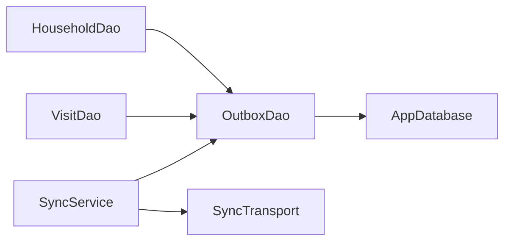

# Outbox Queue Management

<cite>
**Referenced Files in This Document**
- [outbox_dao.dart](file://lib/data/local/outbox_dao.dart)
- [sync_service.dart](file://lib/data/sync/sync_service.dart)
- [app_database.dart](file://lib/data/local/app_database.dart)
- [household_dao.dart](file://lib/data/local/household_dao.dart)
- [visit_dao.dart](file://lib/data/local/visit_dao.dart)
</cite>

## Table of Contents
1. [Introduction](#introduction)
2. [Project Structure](#project-structure)
3. [Core Components](#core-components)
4. [Architecture Overview](#architecture-overview)
5. [Detailed Component Analysis](#detailed-component-analysis)
6. [Dependency Analysis](#dependency-analysis)
7. [Performance Considerations](#performance-considerations)
8. [Troubleshooting Guide](#troubleshooting-guide)
9. [Conclusion](#conclusion)
10. [Appendices](#appendices)

## Introduction
This document explains CareBridge AI’s outbox queue management system that guarantees offline-first data consistency. The sync_outbox table stores pending changes with priority-based ordering so urgent referrals are processed before routine registrations. Entries include type, payload, and robust attempt tracking with error handling. Changes are committed to the outbox within the same transaction as the original write, ensuring a record cannot exist without its sync intent. Practical examples show how to add entries, query pending items, manage priorities, optimize storage for low-resource environments, and monitor queue health metrics.

## Project Structure
The outbox system spans three layers:
- Data persistence and schema: SQLite table definitions and indexes
- DAO layer: enqueue, query, mark success/failure, pruning, and summary
- Sync service: background scheduling, connectivity-aware batching, transport abstraction, and status broadcasting

**Diagram sources**
- [app_database.dart:516-533](file://lib/data/local/app_database.dart#L516-L533)
- [outbox_dao.dart:160-276](file://lib/data/local/outbox_dao.dart#L160-L276)
- [sync_service.dart:96-257](file://lib/data/sync/sync_service.dart#L96-L257)
- [household_dao.dart:23-41](file://lib/data/local/household_dao.dart#L23-L41)
- [visit_dao.dart:284-308](file://lib/data/local/visit_dao.dart#L284-L308)

**Section sources**
- [app_database.dart:516-533](file://lib/data/local/app_database.dart#L516-L533)
- [outbox_dao.dart:160-276](file://lib/data/local/outbox_dao.dart#L160-L276)
- [sync_service.dart:96-257](file://lib/data/sync/sync_service.dart#L96-L257)

## Core Components
- sync_outbox table: Stores entity_table, entity_id, operation (insert/update/delete), payload_json, priority, queued_at, attempts, last_attempt_at, last_error, synced_at. Indexed by (synced_at, priority, queued_at) and by (entity_table, entity_id).
- OutboxEntry model: Encapsulates id, entityTable, entityId, operation, payload, priority, queuedAt, attempts, lastAttemptAt, lastError, syncedAt; exposes isSynced, needsAttention, retryDelay, isReadyToRetry.
- OutboxDao: enqueue within a transaction, pending with priority ordering and backoff filtering, markSynced, markFailed, summary, failing, resetAttempts, pruneSynced.
- SyncService: periodic and connectivity-triggered runs, small batches, per-row commit on success, reentrancy guard, drain utility, stuck list, retry helper.

**Section sources**
- [app_database.dart:516-533](file://lib/data/local/app_database.dart#L516-L533)
- [outbox_dao.dart:49-115](file://lib/data/local/outbox_dao.dart#L49-L115)
- [outbox_dao.dart:160-276](file://lib/data/local/outbox_dao.dart#L160-L276)
- [sync_service.dart:96-257](file://lib/data/sync/sync_service.dart#L96-L257)

## Architecture Overview
Priority-driven outbox ensures critical work leaves first. The sync service opportunistically sends small batches when online, marking each row individually to maximize progress even on fleeting connectivity.

**Diagram sources**
- [sync_service.dart:156-242](file://lib/data/sync/sync_service.dart#L156-L242)
- [outbox_dao.dart:164-199](file://lib/data/local/outbox_dao.dart#L164-L199)
- [app_database.dart:516-533](file://lib/data/local/app_database.dart#L516-L533)

## Detailed Component Analysis

### OutboxEntry Model
- Fields: id, entityTable, entityId, operation, payload, priority, queuedAt, attempts, lastAttemptAt, lastError, syncedAt.
- Behavior:
  - isSynced: true when syncedAt is set.
  - needsAttention: attempts >= 5 and not synced.
  - retryDelay: exponential backoff capped at 120 minutes.
  - isReadyToRetry: not synced and time since lastAttemptAt >= retryDelay.

**Diagram sources**
- [outbox_dao.dart:49-115](file://lib/data/local/outbox_dao.dart#L49-L115)

**Section sources**
- [outbox_dao.dart:49-115](file://lib/data/local/outbox_dao.dart#L49-L115)

### OutboxDao Operations
- enqueue: Inserts an outbox row inside the caller’s transaction using the provided DatabaseExecutor.
- pending: Returns up to limit rows where synced_at IS NULL, ordered by priority ASC then queued_at ASC, filtered by isReadyToRetry.
- markSynced: Sets synced_at and clears last_error.
- markFailed: Increments attempts, sets last_attempt_at and last_error.
- summary: Aggregates pending count, failing count (attempts >= 5), criticalPending (priority <= critical), oldest queued_at.
- failing: Lists unsynced rows with attempts >= 5, ordered by last_attempt_at DESC.
- resetAttempts: Resets attempts and last_error for manual retry flows.
- pruneSynced: Deletes synced rows older than keepDays.

**Diagram sources**
- [outbox_dao.dart:187-199](file://lib/data/local/outbox_dao.dart#L187-L199)

**Section sources**
- [outbox_dao.dart:160-276](file://lib/data/local/outbox_dao.dart#L160-L276)

### SyncService Orchestration
- runOnce: Guards against concurrent runs, checks connectivity, fetches batch via OutboxDao.pending, sends via SyncTransport, marks success/failure per row, returns report, publishes status.
- drain: Loops runOnce up to maxBatches, aggregates totals, prunes synced rows.
- publishStatus: Emits SyncStatusSummary stream.
- stuck: Exposes failing entries for human review.
- retry: Resets attempts for a specific entry and triggers runOnce.

**Diagram sources**
- [sync_service.dart:122-242](file://lib/data/sync/sync_service.dart#L122-L242)
- [outbox_dao.dart:187-199](file://lib/data/local/outbox_dao.dart#L187-L199)

**Section sources**
- [sync_service.dart:96-257](file://lib/data/sync/sync_service.dart#L96-L257)

### Priority Semantics and Examples
- Priorities:
  - critical: 0 — urgent referrals and assessments
  - clinical: 3 — clinical content like assessments, growth, barrier reports
  - routine: 5 — registrations, visits, schedules
  - background: 8 — housekeeping tasks
- Examples from codebase:
  - Urgent referral insert uses critical priority.
  - Clinical records (maternal/birth/growth) use clinical priority.
  - Routine updates (households/persons) use routine priority.

Practical usage patterns:
- Add an entry: Call OutboxDao.enqueue within the same transaction that writes the business record.
- Query pending: Use OutboxDao.pending(limit) to retrieve highest-priority, oldest-first entries ready to retry.
- Manage priorities: Choose SyncPriority values based on urgency; critical ensures early delivery.

**Section sources**
- [outbox_dao.dart:34-47](file://lib/data/local/outbox_dao.dart#L34-L47)
- [visit_dao.dart:284-308](file://lib/data/local/visit_dao.dart#L284-L308)
- [household_dao.dart:23-41](file://lib/data/local/household_dao.dart#L23-L41)

### Storage Schema and Indexing
- Table: sync_outbox with columns id, entity_table, entity_id, operation, payload_json, priority, queued_at, attempts, last_attempt_at, last_error, synced_at.
- Indexes:
  - idx_outbox_pending(synced_at, priority, queued_at) optimizes pending queries with priority ordering.
  - idx_outbox_entity(entity_table, entity_id) supports entity-specific lookups.

**Section sources**
- [app_database.dart:516-533](file://lib/data/local/app_database.dart#L516-L533)

## Dependency Analysis
- Business DAOs depend on OutboxDao to enqueue changes atomically with writes.
- SyncService depends on OutboxDao for queue operations and on SyncTransport for sending.
- OutboxDao depends on AppDatabase for the SQLite handle and Tables constants.

**Diagram sources**
- [household_dao.dart:23-41](file://lib/data/local/household_dao.dart#L23-L41)
- [visit_dao.dart:284-308](file://lib/data/local/visit_dao.dart#L284-L308)
- [sync_service.dart:96-110](file://lib/data/sync/sync_service.dart#L96-L110)
- [outbox_dao.dart:160-181](file://lib/data/local/outbox_dao.dart#L160-L181)
- [app_database.dart:177-192](file://lib/data/local/app_database.dart#L177-L192)

**Section sources**
- [household_dao.dart:23-41](file://lib/data/local/household_dao.dart#L23-L41)
- [visit_dao.dart:284-308](file://lib/data/local/visit_dao.dart#L284-L308)
- [sync_service.dart:96-110](file://lib/data/sync/sync_service.dart#L96-L110)
- [outbox_dao.dart:160-181](file://lib/data/local/outbox_dao.dart#L160-L181)
- [app_database.dart:177-192](file://lib/data/local/app_database.dart#L177-L192)

## Performance Considerations
- Small batches: Default batchSize=25 ensures short signal windows yield multiple committed successes instead of one large rollback.
- Priority ordering: Critical items are sent first, reducing latency for life-critical workflows.
- Backoff: Exponential retry delay capped at 120 minutes prevents battery drain and excessive retries.
- Pruning: pruneSynced removes old synced rows to conserve storage on shared devices.
- Indexing: Pending index accelerates priority-ordered retrieval; entity index supports targeted queries.

[No sources needed since this section provides general guidance]

## Troubleshooting Guide
- Stuck entries: Use SyncService.stuck or OutboxDao.failing to list rows with attempts >= 5 and last_error messages.
- Manual retry: Use SyncService.retry(outboxId) to reset attempts and trigger a send.
- Monitoring: Subscribe to SyncService.status to observe pending, failing, criticalPending counts and oldestPendingAt.
- Common causes: Network unavailability (SendUnavailable), server rejection (SendRejected), or persistent errors captured in last_error.

**Section sources**
- [sync_service.dart:244-257](file://lib/data/sync/sync_service.dart#L244-L257)
- [outbox_dao.dart:220-249](file://lib/data/local/outbox_dao.dart#L220-L249)

## Conclusion
CareBridge AI’s outbox queue ensures reliable, prioritized synchronization of local changes to the server. By committing outbox rows within the same transaction as data writes, it guarantees consistency. Priority-based ordering, small batches, and robust retry/backoff make it resilient in low-connectivity settings. Monitoring and pruning keep the system healthy and storage-efficient.

[No sources needed since this section summarizes without analyzing specific files]

## Appendices

### Practical Examples

- Adding an entry to the queue
  - Pattern: Within a database transaction, after writing the business record, call OutboxDao.enqueue with table, entityId, operation, payload, and appropriate priority.
  - Example references:
    - Household update enqueues routine priority.
    - Assessment saveWithReferral enqueues critical priority for immediate referrals.

- Querying pending items
  - Use OutboxDao.pending(limit) to get the next batch ordered by priority and age, filtered by retry readiness.

- Managing queue priorities
  - Assign SyncPriority.critical for urgent referrals and high-risk assessments.
  - Use SyncPriority.clinical for clinical content.
  - Use SyncPriority.routine for standard registrations and visits.
  - Use SyncPriority.background for non-urgent housekeeping.

- Storage optimization techniques
  - Adjust pruneSynced keepDays to balance retention and storage constraints.
  - Keep batchSize small to reduce memory and network overhead.
  - Ensure indexes remain intact for pending queries.

- Monitoring queue health metrics
  - Observe SyncService.status for pending, failing, criticalPending, and oldestPendingAt.
  - Use SyncService.drain to push all possible work during brief connectivity windows.

**Section sources**
- [household_dao.dart:23-41](file://lib/data/local/household_dao.dart#L23-L41)
- [visit_dao.dart:284-308](file://lib/data/local/visit_dao.dart#L284-L308)
- [outbox_dao.dart:187-199](file://lib/data/local/outbox_dao.dart#L187-L199)
- [sync_service.dart:223-242](file://lib/data/sync/sync_service.dart#L223-L242)
- [app_database.dart:516-533](file://lib/data/local/app_database.dart#L516-L533)