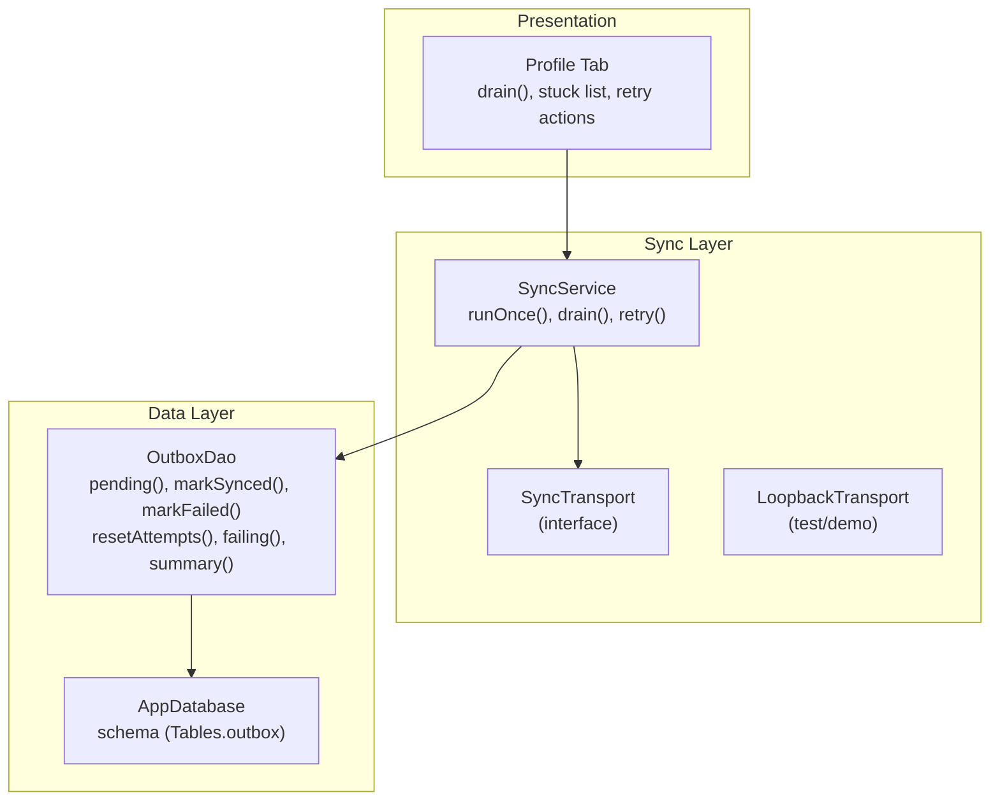
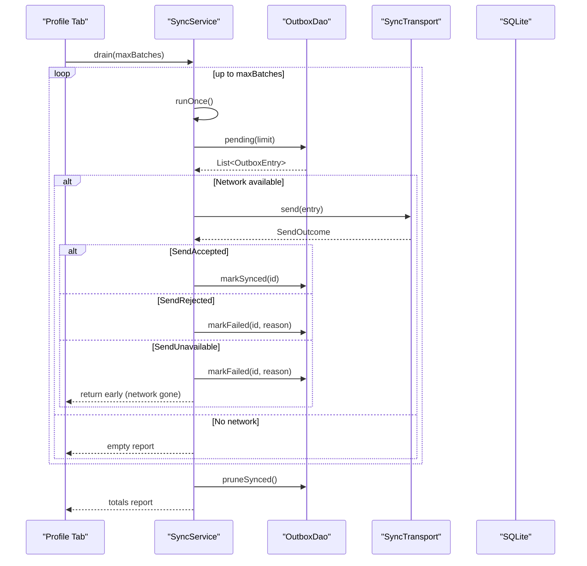
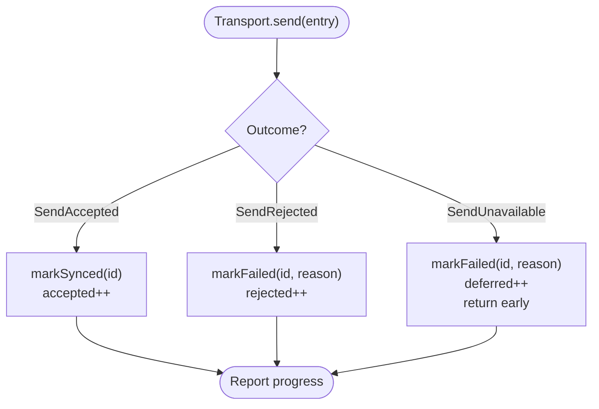
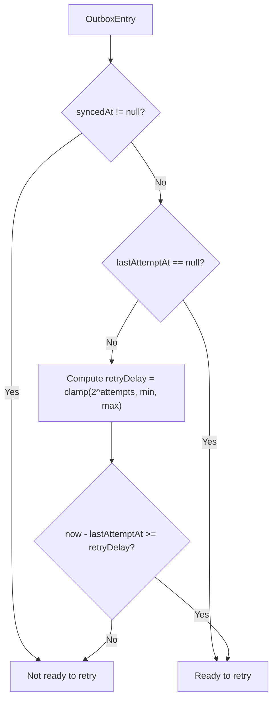
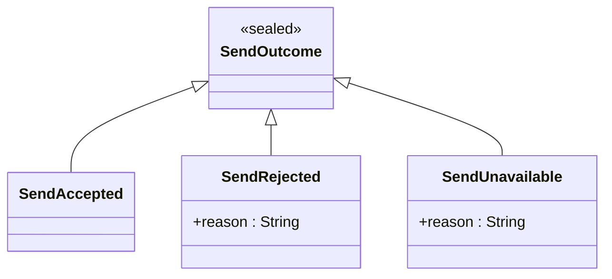
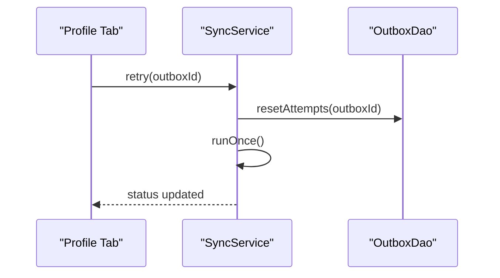
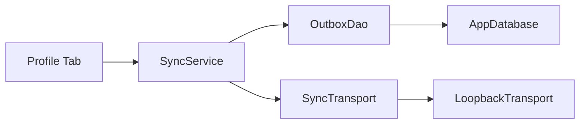

# Sync Retry Mechanisms

<cite>
**Referenced Files in This Document**
- [sync_service.dart](file://lib/data/sync/sync_service.dart)
- [outbox_dao.dart](file://lib/data/local/outbox_dao.dart)
- [app_database.dart](file://lib/data/local/app_database.dart)
- [profile_tab.dart](file://lib/presentation/fhw/profile_tab.dart)
</cite>

## Table of Contents
1. [Introduction](#introduction)
2. [Project Structure](#project-structure)
3. [Core Components](#core-components)
4. [Architecture Overview](#architecture-overview)
5. [Detailed Component Analysis](#detailed-component-analysis)
6. [Dependency Analysis](#dependency-analysis)
7. [Performance Considerations](#performance-considerations)
8. [Troubleshooting Guide](#troubleshooting-guide)
9. [Conclusion](#conclusion)

## Introduction
This document explains CareBridge AI’s retry mechanisms for the synchronization process. It covers the three-tier outcome system, attempt counting and backoff logic, error categorization between transient network failures and permanent server rejections, manual retry operations, and strategies to optimize battery usage during retries. The goal is to make the design clear for both developers and non-technical readers while remaining grounded in the actual codebase.

## Project Structure
The sync subsystem spans a small set of focused files:
- Sync orchestration and transport abstraction live in the sync service layer.
- Outbox persistence and retry state live in the local data access layer.
- Database schema defines the outbox table that stores retry metadata.
- Presentation layer exposes a “Send everything now” button and surfaces stuck items for human review.

**Diagram sources**
- [sync_service.dart:96-257](file://lib/data/sync/sync_service.dart#L96-L257)
- [outbox_dao.dart:160-276](file://lib/data/local/outbox_dao.dart#L160-L276)
- [app_database.dart:515-533](file://lib/data/local/app_database.dart#L515-L533)
- [profile_tab.dart:41-57](file://lib/presentation/fhw/profile_tab.dart#L41-L57)

**Section sources**
- [sync_service.dart:1-258](file://lib/data/sync/sync_service.dart#L1-L258)
- [outbox_dao.dart:1-277](file://lib/data/local/outbox_dao.dart#L1-L277)
- [app_database.dart:515-533](file://lib/data/local/app_database.dart#L515-L533)
- [profile_tab.dart:41-57](file://lib/presentation/fhw/profile_tab.dart#L41-L57)

## Core Components
- Three-tier outcomes:
  - SendAccepted: successful upload; entry marked synced.
  - SendRejected: permanent failure; stop retrying and surface to human.
  - SendUnavailable: temporary network issue; defer retry with backoff.
- Attempt tracking and backoff:
  - Each outbox row tracks attempts, lastAttemptAt, lastError, and syncedAt.
  - Exponential backoff capped to protect battery and avoid excessive waits.
  - Eligibility to retry enforced by isReadyToRetry using backoff delay.
- Manual retry:
  - resetAttempts clears counters and errors; runOnce schedules immediate retry.
- Operational controls:
  - Opportunistic scheduling via periodic timer and connectivity changes.
  - Batch processing with priority ordering to ensure urgent items send first.

**Section sources**
- [sync_service.dart:32-52](file://lib/data/sync/sync_service.dart#L32-L52)
- [sync_service.dart:156-217](file://lib/data/sync/sync_service.dart#L156-L217)
- [outbox_dao.dart:76-95](file://lib/data/local/outbox_dao.dart#L76-L95)
- [outbox_dao.dart:211-218](file://lib/data/local/outbox_dao.dart#L211-L218)
- [outbox_dao.dart:251-261](file://lib/data/local/outbox_dao.dart#L251-L261)

## Architecture Overview
The sync pipeline is designed to be resilient under intermittent connectivity:
- SyncService orchestrates batches from OutboxDao.pending, respecting priority and backoff.
- Transport.send returns one of the three outcomes, which drives database updates.
- Status is published to the UI stream for banner and dashboard updates.
- Manual “send now” triggers drain, which loops runOnce until no progress or max batches reached.

**Diagram sources**
- [sync_service.dart:156-217](file://lib/data/sync/sync_service.dart#L156-L217)
- [sync_service.dart:223-242](file://lib/data/sync/sync_service.dart#L223-L242)
- [outbox_dao.dart:187-199](file://lib/data/local/outbox_dao.dart#L187-L199)
- [outbox_dao.dart:201-218](file://lib/data/local/outbox_dao.dart#L201-L218)

## Detailed Component Analysis

### Three-Tier Outcome System
- SendAccepted:
  - Behavior: Mark entry as synced and increment accepted count.
  - Impact: Entry removed from retry queue on next pending query.
- SendRejected:
  - Behavior: Increment attempts, record last_error, do not mark synced.
  - Impact: After threshold, item becomes “needs attention” and is surfaced to humans.
- SendUnavailable:
  - Behavior: Increment attempts, record last_error, mark as deferred.
  - Impact: Batch stops early to avoid burning attempt counters when network drops mid-run.

**Diagram sources**
- [sync_service.dart:186-206](file://lib/data/sync/sync_service.dart#L186-L206)
- [outbox_dao.dart:201-218](file://lib/data/local/outbox_dao.dart#L201-L218)

**Section sources**
- [sync_service.dart:32-52](file://lib/data/sync/sync_service.dart#L32-L52)
- [sync_service.dart:186-206](file://lib/data/sync/sync_service.dart#L186-L206)

### Attempt Counting and Backoff Strategy
- Fields tracked per entry:
  - attempts: number of failed attempts.
  - lastAttemptAt: timestamp of last attempt.
  - lastError: most recent error message.
  - syncedAt: timestamp when successfully synced.
- Eligibility to retry:
  - isReadyToRetry ensures entries are not already synced and respect exponential backoff.
- Exponential backoff:
  - Delay computed as 2^attempts minutes, clamped to a minimum and maximum to balance responsiveness and battery conservation.
- Attention threshold:
  - needsAttention becomes true after a fixed number of failures without success, signaling human intervention.

**Diagram sources**
- [outbox_dao.dart:76-95](file://lib/data/local/outbox_dao.dart#L76-L95)
- [outbox_dao.dart:82-88](file://lib/data/local/outbox_dao.dart#L82-L88)

**Section sources**
- [outbox_dao.dart:76-95](file://lib/data/local/outbox_dao.dart#L76-L95)
- [outbox_dao.dart:82-88](file://lib/data/local/outbox_dao.dart#L82-L88)

### Error Categorization Logic
- Transient vs permanent:
  - SendUnavailable indicates transient network issues; the system defers and retries later.
  - SendRejected indicates permanent server-side rejection; the system stops automatic retries and escalates to human review.
- Persistence:
  - Both cases update attempts and last_error; only SendAccepted clears last_error and sets syncedAt.
- Visibility:
  - Items with attempts at or above threshold appear in the “stuck” list for supervisor review.

**Diagram sources**
- [sync_service.dart:32-52](file://lib/data/sync/sync_service.dart#L32-L52)

**Section sources**
- [sync_service.dart:32-52](file://lib/data/sync/sync_service.dart#L32-L52)
- [outbox_dao.dart:211-218](file://lib/data/local/outbox_dao.dart#L211-L218)

### Manual Retry Operations
- Resetting attempts:
  - resetAttempts clears attempts and last_error for a specific outbox entry.
- Triggering retry:
  - retry(outboxId) calls resetAttempts then runOnce to schedule an immediate retry pass.
- User interface:
  - Profile tab provides “Send everything now” to trigger drain and shows stuck items for targeted retry.

**Diagram sources**
- [sync_service.dart:253-256](file://lib/data/sync/sync_service.dart#L253-L256)
- [outbox_dao.dart:251-261](file://lib/data/local/outbox_dao.dart#L251-L261)
- [profile_tab.dart:41-57](file://lib/presentation/fhw/profile_tab.dart#L41-L57)

**Section sources**
- [sync_service.dart:253-256](file://lib/data/sync/sync_service.dart#L253-L256)
- [outbox_dao.dart:251-261](file://lib/data/local/outbox_dao.dart#L251-L261)
- [profile_tab.dart:41-57](file://lib/presentation/fhw/profile_tab.dart#L41-L57)

### Practical Retry Scenarios
- Scenario 1: Successful upload
  - Transport returns SendAccepted; entry marked synced; accepted count increments; no further retries needed.
- Scenario 2: Temporary network loss
  - Transport returns SendUnavailable; entry marked failed with reason; deferred count increments; batch stops early to avoid wasting attempts; next connectivity event triggers another runOnce respecting backoff.
- Scenario 3: Permanent server rejection
  - Transport returns SendRejected; entry marked failed with reason; rejected count increments; after threshold, item appears in stuck list for human review; automatic retries stop.
- Scenario 4: Manual retry
  - Supervisor resets attempts for a stuck entry and triggers runOnce; if conditions allow, the entry will be retried according to current backoff rules.

[No sources needed since this section summarizes scenarios based on previously analyzed components]

## Dependency Analysis
- SyncService depends on:
  - Connectivity monitoring to opportunistically start sync runs.
  - OutboxDao for querying pending entries and updating statuses.
  - SyncTransport abstraction for sending entries (currently LoopbackTransport).
- OutboxDao depends on:
  - AppDatabase for SQLite access and schema definitions.
- Presentation depends on:
  - SyncService methods (drain, retry, status) and OutboxDao queries (failing, summary).

**Diagram sources**
- [sync_service.dart:96-150](file://lib/data/sync/sync_service.dart#L96-L150)
- [outbox_dao.dart:160-199](file://lib/data/local/outbox_dao.dart#L160-L199)
- [app_database.dart:515-533](file://lib/data/local/app_database.dart#L515-L533)
- [profile_tab.dart:41-57](file://lib/presentation/fhw/profile_tab.dart#L41-L57)

**Section sources**
- [sync_service.dart:96-150](file://lib/data/sync/sync_service.dart#L96-L150)
- [outbox_dao.dart:160-199](file://lib/data/local/outbox_dao.dart#L160-L199)
- [app_database.dart:515-533](file://lib/data/local/app_database.dart#L515-L533)
- [profile_tab.dart:41-57](file://lib/presentation/fhw/profile_tab.dart#L41-L57)

## Performance Considerations
- Battery optimization:
  - Exponential backoff prevents rapid retries when there is no signal, reducing radio wake-ups and CPU usage.
  - Backoff is capped to avoid excessively long waits that could starve urgent items.
- Throughput and fairness:
  - Small batch sizes ensure partial successes even on short connectivity windows.
  - Priority ordering ensures critical items (e.g., referrals) are sent before routine registrations.
- Early termination:
  - On SendUnavailable, the batch stops immediately to avoid burning attempt counters and unnecessary work.
- Cleanup:
  - Pruning of synced rows older than a retention period keeps storage lean on shared devices.

[No sources needed since this section provides general guidance derived from analyzed components]

## Troubleshooting Guide
- Identifying stuck items:
  - Use the “stuck” list to find entries that have exceeded the attention threshold.
  - Inspect last_error messages to understand why an entry was rejected or became unavailable.
- Resolving transient issues:
  - Ensure network connectivity; once online, automatic retries will resume based on backoff.
  - If necessary, use manual retry to force an immediate attempt after fixing underlying issues.
- Handling permanent rejections:
  - Review server responses and data payloads; correct invalid data or permissions.
  - After correction, reset attempts and trigger a retry.

**Section sources**
- [outbox_dao.dart:241-249](file://lib/data/local/outbox_dao.dart#L241-L249)
- [sync_service.dart:253-256](file://lib/data/sync/sync_service.dart#L253-L256)
- [profile_tab.dart:295-309](file://lib/presentation/fhw/profile_tab.dart#L295-L309)

## Conclusion
CareBridge AI’s sync retry mechanisms combine a robust three-tier outcome model with careful attempt tracking and exponential backoff to ensure reliable delivery under challenging network conditions. The design prioritizes user experience by making sync opportunistic and non-blocking, while surfacing persistent failures for human intervention. Manual retry capabilities empower supervisors to resolve issues quickly, and the architecture remains extensible through the SyncTransport abstraction for future backend integrations.