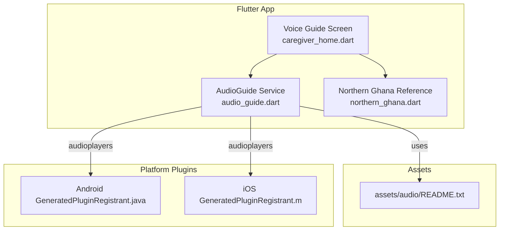
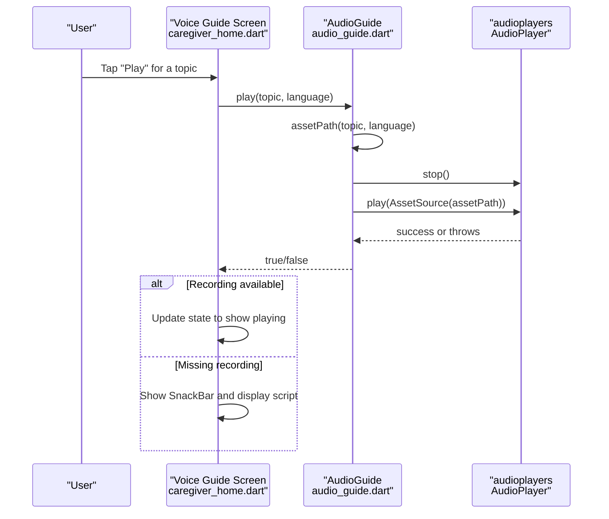
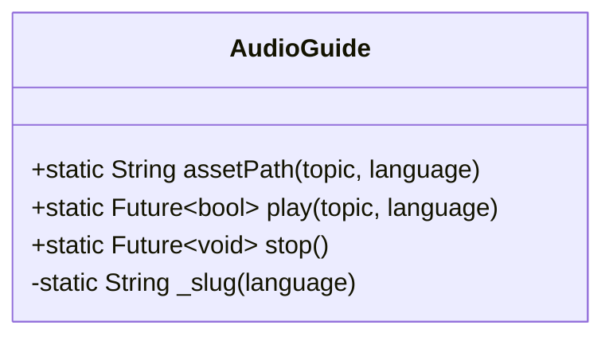
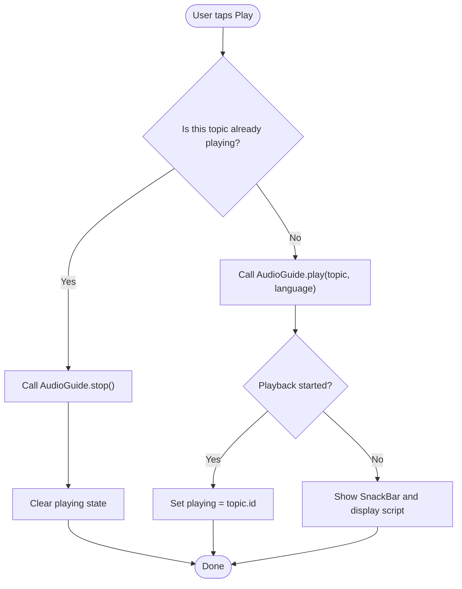
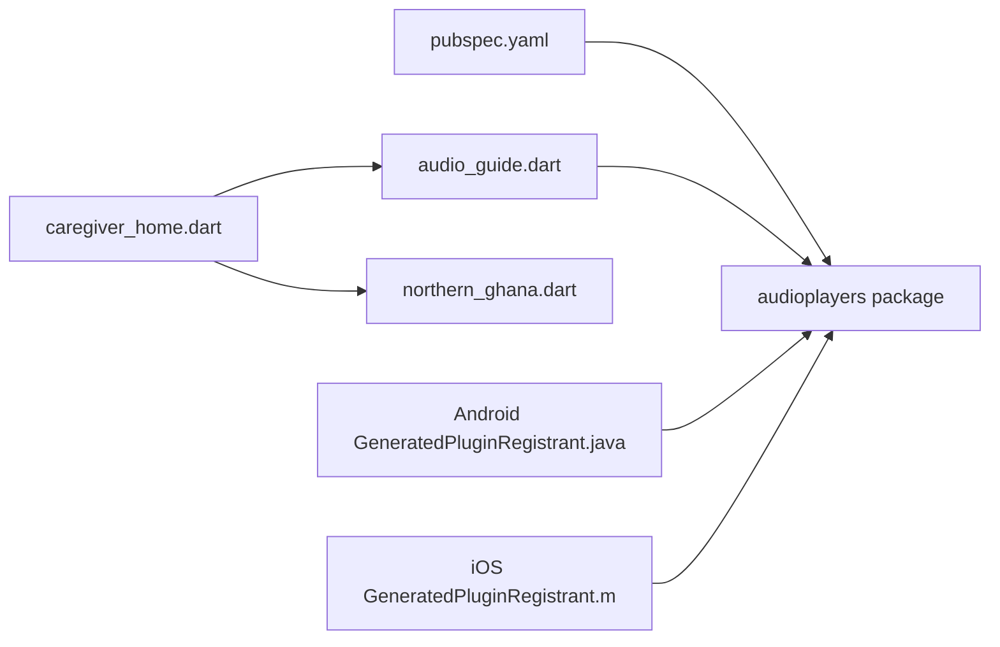

# Audio Guidance System

<cite>
**Referenced Files in This Document**
- [pubspec.yaml](file://pubspec.yaml)
- [audio_guide.dart](file://lib/core/audio/audio_guide.dart)
- [caregiver_home.dart](file://lib/presentation/caregiver/caregiver_home.dart)
- [README.txt](file://assets/audio/README.txt)
- [GeneratedPluginRegistrant.java](file://android/app/src/main/java/io/flutter/plugins/GeneratedPluginRegistrant.java)
- [GeneratedPluginRegistrant.m](file://ios/Runner/GeneratedPluginRegistrant.m)
- [northern_ghana.dart](file://lib/data/reference/northern_ghana.dart)
- [main.dart](file://lib/main.dart)
</cite>

## Table of Contents
1. [Introduction](#introduction)
2. [Project Structure](#project-structure)
3. [Core Components](#core-components)
4. [Architecture Overview](#architecture-overview)
5. [Detailed Component Analysis](#detailed-component-analysis)
6. [Dependency Analysis](#dependency-analysis)
7. [Performance Considerations](#performance-considerations)
8. [Troubleshooting Guide](#troubleshooting-guide)
9. [Conclusion](#conclusion)
10. [Appendices](#appendices)

## Introduction
This document explains CareBridge AI’s audio guidance system that delivers voice instructions in local languages to community health workers and caregivers. The system combines:
- A small, robust service for playing bundled MP3 recordings via Flutter’s audioplayers package
- A clear asset organization convention for local-language files
- A user interface that supports playback controls, language selection, and graceful fallback to plain-language scripts when recordings are missing
- Platform integration on Android and iOS through the audioplayers plugin registration

The design ensures care never waits for an MP3: if a recording is not present, the app shows readable text and invites users to read it aloud.

## Project Structure
The audio guidance feature spans three layers:
- Core service: defines topics, constructs asset paths, and plays/stops audio
- Presentation layer: renders the Voice Guide screen with play/stop controls and language selection
- Assets: documents the naming convention for local-language MP3s
- Platform plugins: register audioplayers on Android and iOS

**Diagram sources**
- [caregiver_home.dart:1565-1684](file://lib/presentation/caregiver/caregiver_home.dart#L1565-L1684)
- [audio_guide.dart:77-116](file://lib/core/audio/audio_guide.dart#L77-L116)
- [README.txt:1-18](file://assets/audio/README.txt#L1-L18)
- [GeneratedPluginRegistrant.java:17-22](file://android/app/src/main/java/io/flutter/plugins/GeneratedPluginRegistrant.java#L17-L22)
- [GeneratedPluginRegistrant.m:53-61](file://ios/Runner/GeneratedPluginRegistrant.m#L53-L61)

**Section sources**
- [pubspec.yaml:44-46](file://pubspec.yaml#L44-L46)
- [audio_guide.dart:1-116](file://lib/core/audio/audio_guide.dart#L1-L116)
- [caregiver_home.dart:1565-1684](file://lib/presentation/caregiver/caregiver_home.dart#L1565-L1684)
- [README.txt:1-18](file://assets/audio/README.txt#L1-L18)
- [GeneratedPluginRegistrant.java:17-22](file://android/app/src/main/java/io/flutter/plugins/GeneratedPluginRegistrant.java#L17-L22)
- [GeneratedPluginRegistrant.m:53-61](file://ios/Runner/GeneratedPluginRegistrant.m#L53-L61)

## Core Components
- AudioTopic enum: enumerates guidance topics with id, title, and script. The id doubles as the asset file prefix.
- AudioGuide service: provides assetPath construction, play, and stop methods using audioplayers’ AudioPlayer. It returns false instead of throwing when a recording is missing.
- Voice Guide screen: lists topics, allows language selection per region, and manages play/stop state. It displays the script and informs users when a recording is unavailable.
- NorthernGhana reference: supplies region-specific language lists (always including English and Hausa).

Key responsibilities:
- Asset path generation from topic and language
- Safe playback with error-free fallback
- UI-driven control and feedback

**Section sources**
- [audio_guide.dart:22-75](file://lib/core/audio/audio_guide.dart#L22-L75)
- [audio_guide.dart:77-116](file://lib/core/audio/audio_guide.dart#L77-L116)
- [caregiver_home.dart:1565-1684](file://lib/presentation/caregiver/caregiver_home.dart#L1565-L1684)
- [northern_ghana.dart:84-90](file://lib/data/reference/northern_ghana.dart#L84-L90)

## Architecture Overview
The audio guidance system follows a simple layered architecture:
- Presentation layer invokes AudioGuide.play or AudioGuide.stop based on user actions
- AudioGuide computes the asset path and delegates to audioplayers
- If the asset exists, playback starts; otherwise, the UI falls back to showing the script

**Diagram sources**
- [caregiver_home.dart:1663-1683](file://lib/presentation/caregiver/caregiver_home.dart#L1663-L1683)
- [audio_guide.dart:82-99](file://lib/core/audio/audio_guide.dart#L82-L99)

## Detailed Component Analysis

### AudioGuide Service
Responsibilities:
- Define asset path format: audio/<topic_id>_<language_slug>.mp3
- Provide safe play and stop operations
- Normalize language names into filename-safe slugs

Behavior highlights:
- play attempts to stop any current playback, then plays the requested asset
- Returns true on successful start, false on failure (e.g., missing asset)
- stop safely ignores errors when nothing is playing

**Diagram sources**
- [audio_guide.dart:77-116](file://lib/core/audio/audio_guide.dart#L77-L116)

**Section sources**
- [audio_guide.dart:77-116](file://lib/core/audio/audio_guide.dart#L77-L116)

### Voice Guide Screen
Responsibilities:
- Render a list of AudioTopic items with titles and scripts
- Provide a language dropdown derived from NorthernGhana.languagesOf(region)
- Manage play/stop state per topic and show user feedback

Playback flow:
- If the same topic is already playing, stop and reset state
- Otherwise call AudioGuide.play and update UI accordingly
- On failure, show a SnackBar explaining the absence of the recording

**Diagram sources**
- [caregiver_home.dart:1663-1683](file://lib/presentation/caregiver/caregiver_home.dart#L1663-L1683)

**Section sources**
- [caregiver_home.dart:1565-1684](file://lib/presentation/caregiver/caregiver_home.dart#L1565-L1684)

### Audio Asset Organization
Guidelines:
- Place MP3 files under assets/audio/
- Use the naming convention: <topic>_<language>.mp3
- Examples include child_danger_signs_dagbani.mp3, newborn_danger_signs_hausa.mp3, mother_danger_signs_gurene.mp3, feeding_dagaare.mp3, referral_english.mp3
- Topics supported by the code include child_danger_signs, newborn_danger_signs, mother_danger_signs, feeding, referral

Until recordings are added, the app will always fall back to displaying and reading the script.

**Section sources**
- [README.txt:1-18](file://assets/audio/README.txt#L1-L18)
- [audio_guide.dart:22-75](file://lib/core/audio/audio_guide.dart#L22-L75)

### Platform Integration (Android and iOS)
The audioplayers plugin is registered automatically by Flutter’s generated registrants:
- Android: xyz.luan.audioplayers.AudioplayersPlugin is added to the FlutterEngine
- iOS: AudioplayersDarwinPlugin is registered with the Flutter registry

These registrations enable the Dart-side AudioPlayer to access native audio capabilities.

**Section sources**
- [GeneratedPluginRegistrant.java:17-22](file://android/app/src/main/java/io/flutter/plugins/GeneratedPluginRegistrant.java#L17-L22)
- [GeneratedPluginRegistrant.m:53-61](file://ios/Runner/GeneratedPluginRegistrant.m#L53-L61)

### Language Selection and Regional Support
- NorthernGhana.languagesOf(region) returns region-specific languages plus English and Hausa
- The Voice Guide screen uses this list to populate the language dropdown
- Default language can be inferred from user preferences or region defaults

**Section sources**
- [northern_ghana.dart:84-90](file://lib/data/reference/northern_ghana.dart#L84-L90)
- [caregiver_home.dart:1579-1601](file://lib/presentation/caregiver/caregiver_home.dart#L1579-L1601)

## Dependency Analysis
High-level dependencies:
- pubspec.yaml declares audioplayers dependency
- audio_guide.dart imports audioplayers and uses AudioPlayer
- caregiver_home.dart depends on AudioGuide and NorthernGhana reference data
- Platform registrants wire audioplayers into the native runtime

**Diagram sources**
- [pubspec.yaml:44-46](file://pubspec.yaml#L44-L46)
- [audio_guide.dart:19-19](file://lib/core/audio/audio_guide.dart#L19-L19)
- [caregiver_home.dart:1565-1684](file://lib/presentation/caregiver/caregiver_home.dart#L1565-L1684)
- [northern_ghana.dart:84-90](file://lib/data/reference/northern_ghana.dart#L84-L90)
- [GeneratedPluginRegistrant.java:17-22](file://android/app/src/main/java/io/flutter/plugins/GeneratedPluginRegistrant.java#L17-L22)
- [GeneratedPluginRegistrant.m:53-61](file://ios/Runner/GeneratedPluginRegistrant.m#L53-L61)

**Section sources**
- [pubspec.yaml:44-46](file://pubspec.yaml#L44-L46)
- [audio_guide.dart:19-19](file://lib/core/audio/audio_guide.dart#L19-L19)
- [caregiver_home.dart:1565-1684](file://lib/presentation/caregiver/caregiver_home.dart#L1565-L1684)
- [northern_ghana.dart:84-90](file://lib/data/reference/northern_ghana.dart#L84-L90)
- [GeneratedPluginRegistrant.java:17-22](file://android/app/src/main/java/io/flutter/plugins/GeneratedPluginRegistrant.java#L17-L22)
- [GeneratedPluginRegistrant.m:53-61](file://ios/Runner/GeneratedPluginRegistrant.m#L53-L61)

## Performance Considerations
- Single shared AudioPlayer instance: reduces overhead and avoids concurrent playback conflicts
- Asset-based playback: avoids network calls and works offline
- Graceful fallback: prevents blocking UI when recordings are missing
- Memory considerations:
  - Keep MP3 files reasonably sized for low-memory devices
  - Avoid loading multiple large assets simultaneously
  - Stop playback promptly when switching topics or navigating away
- Battery optimization:
  - Prefer short, focused recordings
  - Avoid background playback unless explicitly required by UX
  - Ensure stop is called on lifecycle events (e.g., route changes)

[No sources needed since this section provides general guidance]

## Troubleshooting Guide
Common issues and resolutions:
- Playback does not start:
  - Verify the MP3 file exists at assets/audio/<topic>_<language>.mp3
  - Confirm the language slug matches the filename (lowercase, no spaces or brackets)
  - Ensure audioplayers is declared in pubspec.yaml and platform plugins are registered
- Missing recording message:
  - Expected behavior when the asset is absent; guide users to read the script aloud
- No sound output:
  - Check device volume and media channel settings
  - On Android/iOS, ensure the app has permission to play media (usually automatic for audio assets)
- State inconsistencies:
  - Ensure stop is called before starting a new track
  - Reset playing state after navigation or disposal

**Section sources**
- [audio_guide.dart:82-99](file://lib/core/audio/audio_guide.dart#L82-L99)
- [caregiver_home.dart:1663-1683](file://lib/presentation/caregiver/caregiver_home.dart#L1663-L1683)
- [README.txt:1-18](file://assets/audio/README.txt#L1-L18)

## Conclusion
CareBridge AI’s audio guidance system provides reliable, accessible voice instructions for community health workers and caregivers. By combining a minimal core service, clear asset conventions, and a user-friendly interface, it ensures that critical health information is always available—either through recorded audio or readable scripts. Platform integrations via audioplayers enable consistent playback across Android and iOS while maintaining offline-first operation.

[No sources needed since this section summarizes without analyzing specific files]

## Appendices

### Entry Point and App Initialization
The application entry point initializes the provider scope and configures routing and theme. Audio functionality is invoked from screens rather than the entry point.

**Section sources**
- [main.dart:16-34](file://lib/main.dart#L16-L34)