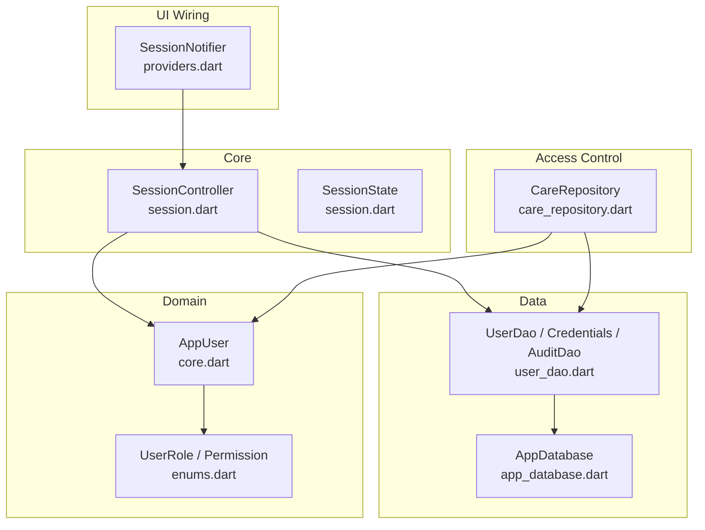
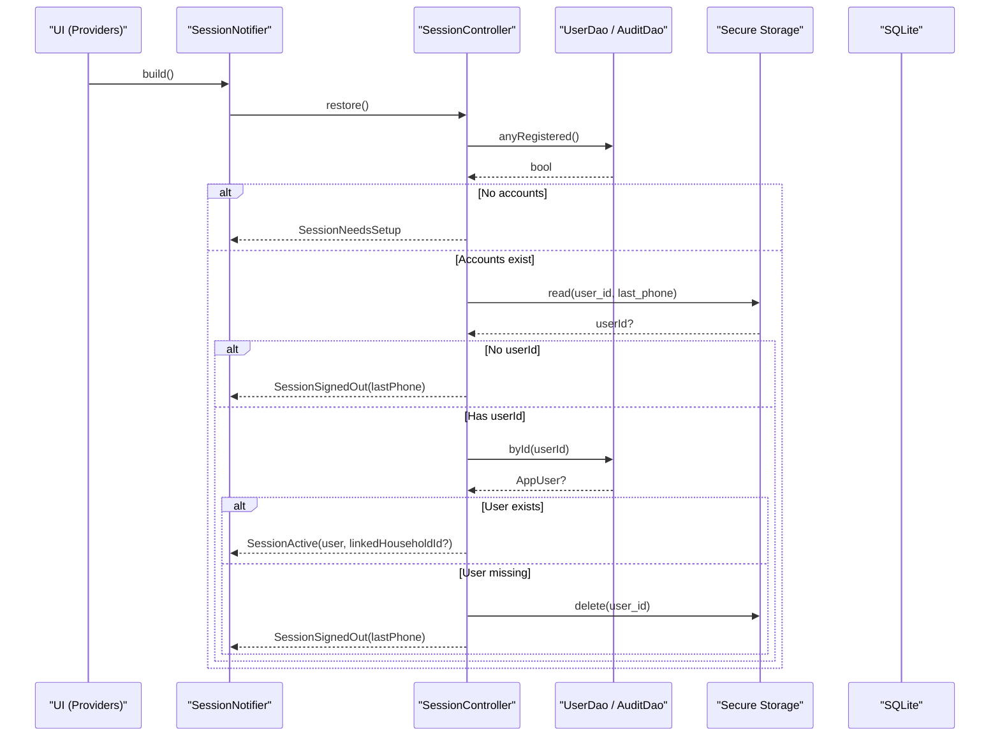
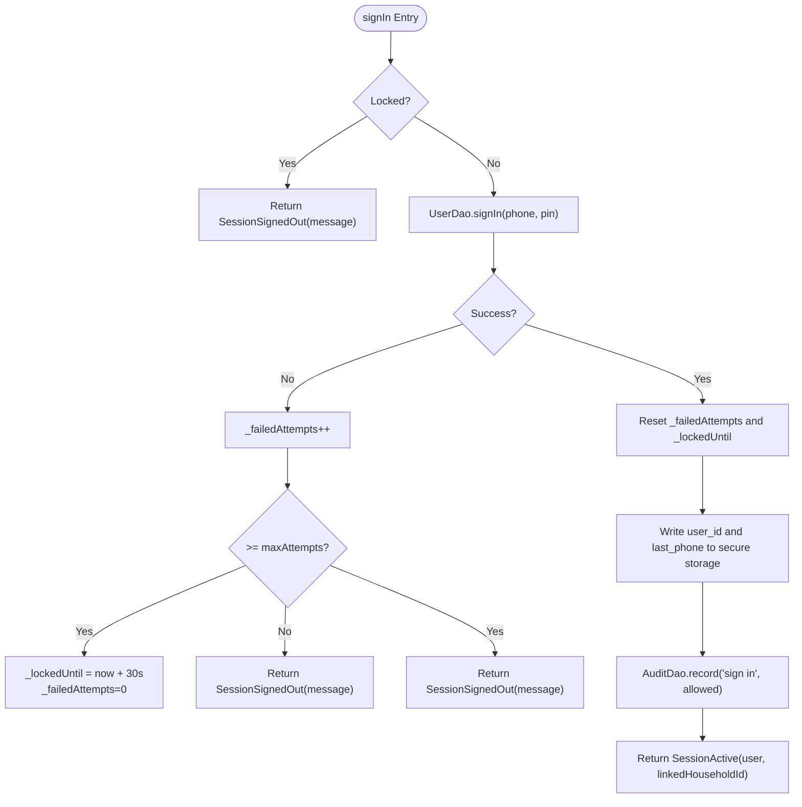
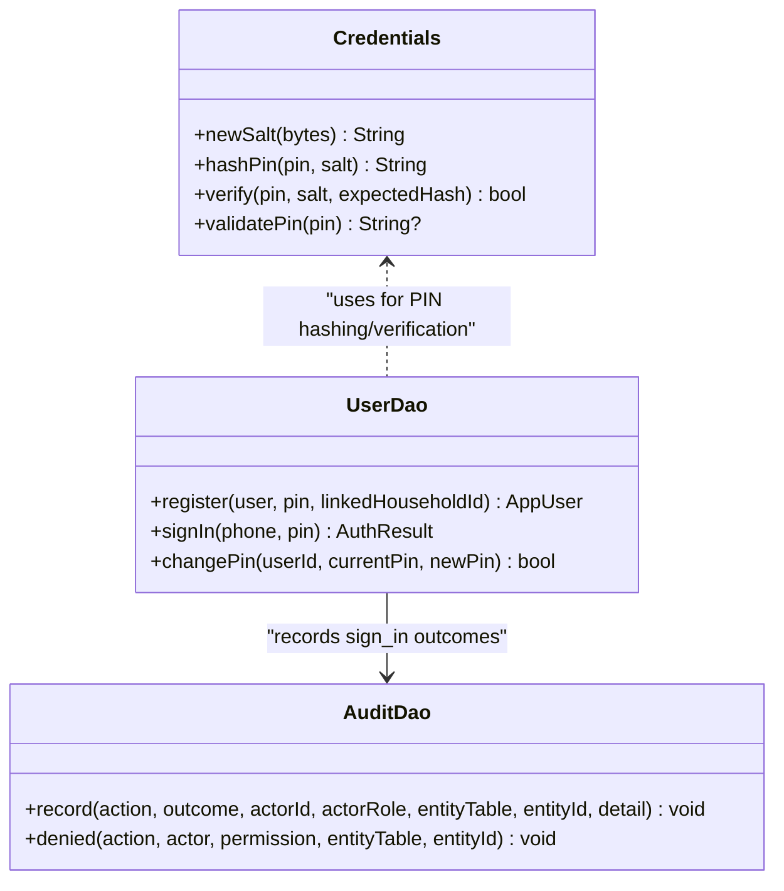
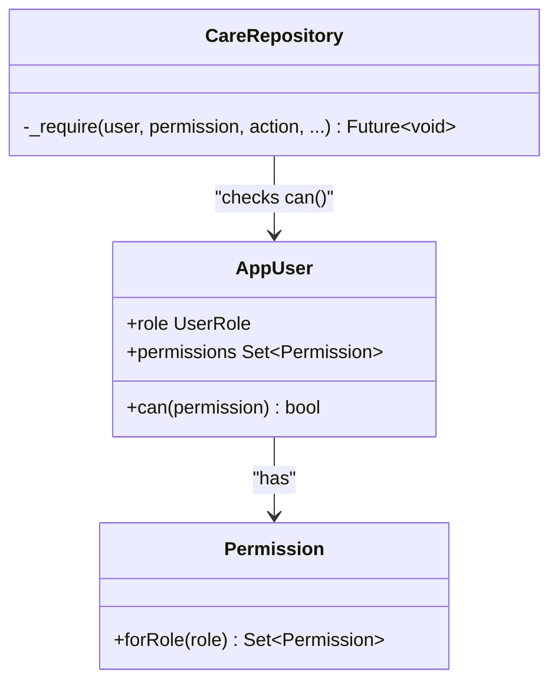
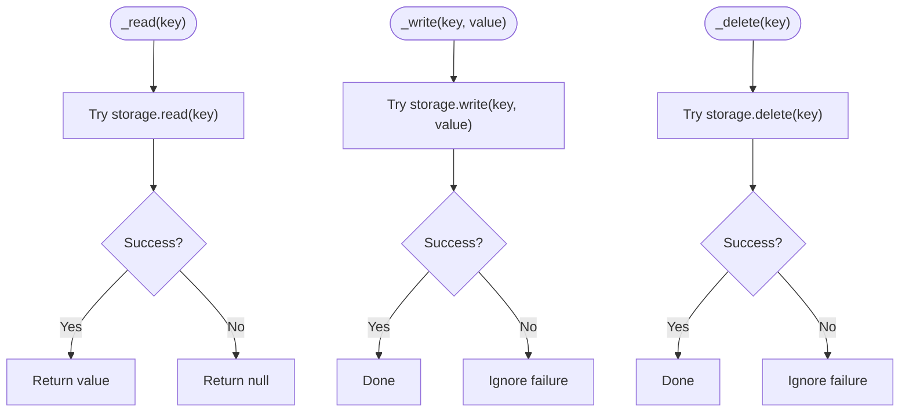
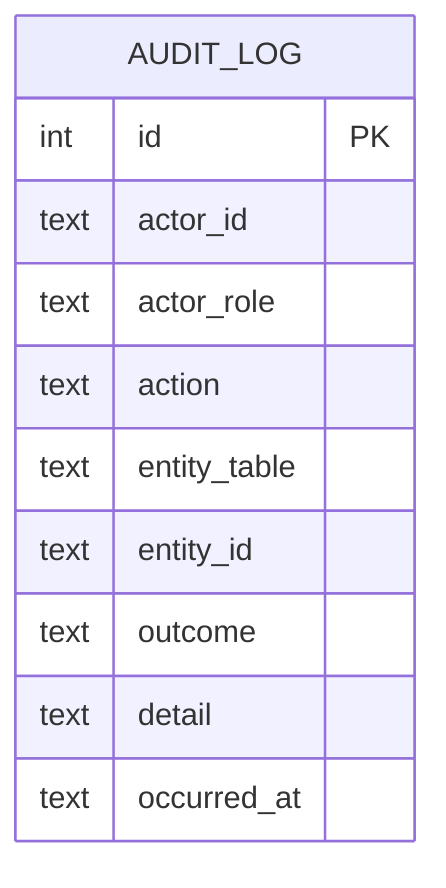
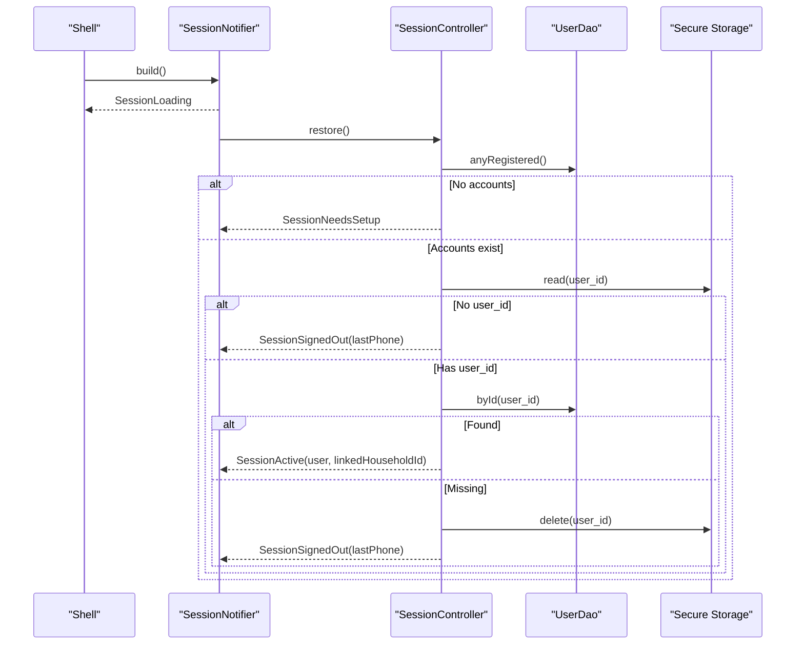
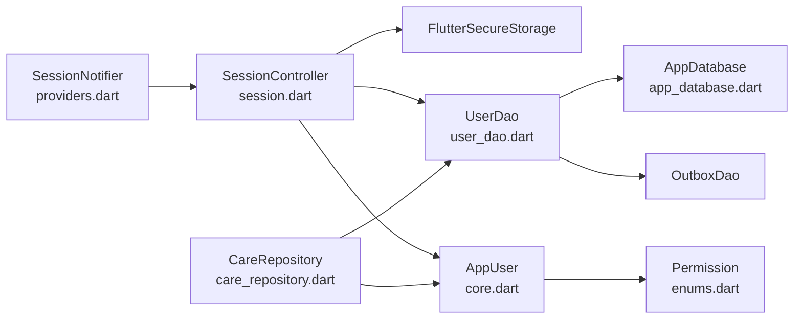

# Authentication & Session Management

<cite>
**Referenced Files in This Document**
- [session.dart](file://lib/core/auth/session.dart)
- [user_dao.dart](file://lib/data/local/user_dao.dart)
- [core.dart](file://lib/domain/entities/core.dart)
- [enums.dart](file://lib/domain/enums.dart)
- [providers.dart](file://lib/app/providers.dart)
- [app_database.dart](file://lib/data/local/app_database.dart)
- [care_repository.dart](file://lib/data/repositories/care_repository.dart)
- [rbac_test.dart](file://test/rbac_test.dart)
</cite>

## Table of Contents
1. [Introduction](#introduction)
2. [Project Structure](#project-structure)
3. [Core Components](#core-components)
4. [Architecture Overview](#architecture-overview)
5. [Detailed Component Analysis](#detailed-component-analysis)
6. [Dependency Analysis](#dependency-analysis)
7. [Performance Considerations](#performance-considerations)
8. [Troubleshooting Guide](#troubleshooting-guide)
9. [Conclusion](#conclusion)
10. [Appendices](#appendices)

## Introduction
This document explains CareBridge AI’s authentication and session management system designed for shared handsets in CHPS compounds. It covers:
- PIN-based authentication with role-based access control (RBAC)
- Session state machine: SessionLoading, SessionNeedsSetup, SessionSignedOut, SessionActive
- Secure storage usage and graceful degradation
- Lock-out after failed attempts and audit logging
- User registration, sign-in, session restoration, and sign-out flows
- SessionController methods, permission checks, and DAO integration
- Security considerations including PIN hashing and secure storage behavior

## Project Structure
The authentication and session subsystem spans core logic, data access, domain models, and UI wiring:
- Core session state and controller: lib/core/auth/session.dart
- Data access and credentials: lib/data/local/user_dao.dart
- Domain entities and enums: lib/domain/entities/core.dart, lib/domain/enums.dart
- UI wiring and providers: lib/app/providers.dart
- Database schema for audit log: lib/data/local/app_database.dart
- RBAC enforcement at the repository boundary: lib/data/repositories/care_repository.dart
- Tests validating permissions: test/rbac_test.dart

**Diagram sources**
- [session.dart:71-244](file://lib/core/auth/session.dart#L71-L244)
- [user_dao.dart:44-93](file://lib/data/local/user_dao.dart#L44-L93)
- [core.dart:6-41](file://lib/domain/entities/core.dart#L6-L41)
- [enums.dart:10-66](file://lib/domain/enums.dart#L10-L66)
- [providers.dart:68-122](file://lib/app/providers.dart#L68-L122)
- [care_repository.dart:55-102](file://lib/data/repositories/care_repository.dart#L55-L102)

**Section sources**
- [session.dart:1-244](file://lib/core/auth/session.dart#L1-L244)
- [user_dao.dart:1-457](file://lib/data/local/user_dao.dart#L1-L457)
- [core.dart:1-97](file://lib/domain/entities/core.dart#L1-L97)
- [enums.dart:1-66](file://lib/domain/enums.dart#L1-L66)
- [providers.dart:68-122](file://lib/app/providers.dart#L68-L122)
- [care_repository.dart:1-102](file://lib/data/repositories/care_repository.dart#L1-L102)

## Core Components
- SessionState sealed hierarchy:
  - SessionLoading: while restoring from secure storage
  - SessionNeedsSetup: first-run setup when no accounts exist on device
  - SessionSignedOut: signed out or locked out; carries lastPhone and message
  - SessionActive: authenticated user with optional linkedHouseholdId for caregivers
- SessionController: orchestrates restore, signIn, registerAndSignIn, signOut, lock-out, and secure storage I/O
- UserDao: registers users, signs in via phone+PIN, manages linked household scope, and persists audit entries
- Credentials: PIN salt generation, PBKDF2-style hashing, constant-time verification, and PIN validation rules
- AppUser and Permission: role-based capability model used by SessionActive.can() and repositories
- Providers: SessionNotifier bridges UI to SessionController and exposes currentUserProvider and linkedHouseholdProvider

Key responsibilities:
- Keep only the user id in secure storage; never store raw PINs
- Enforce lock-out per-device and in-memory
- Record every permission denial and auth event in local audit log
- Gracefully degrade if secure storage is unavailable

**Section sources**
- [session.dart:28-67](file://lib/core/auth/session.dart#L28-L67)
- [session.dart:71-244](file://lib/core/auth/session.dart#L71-L244)
- [user_dao.dart:44-93](file://lib/data/local/user_dao.dart#L44-L93)
- [user_dao.dart:117-216](file://lib/data/local/user_dao.dart#L117-L216)
- [core.dart:6-41](file://lib/domain/entities/core.dart#L6-L41)
- [enums.dart:10-66](file://lib/domain/enums.dart#L10-L66)
- [providers.dart:68-122](file://lib/app/providers.dart#L68-L122)

## Architecture Overview
The system follows a layered approach:
- Presentation layer uses Riverpod providers to observe session state and trigger actions
- Core session controller coordinates secure storage and DAO calls
- DAO layer handles persistence and security primitives
- Repository enforces RBAC before any data access

**Diagram sources**
- [providers.dart:77-92](file://lib/app/providers.dart#L77-L92)
- [session.dart:97-112](file://lib/core/auth/session.dart#L97-L112)
- [user_dao.dart:286-292](file://lib/data/local/user_dao.dart#L286-L292)
- [user_dao.dart:218-227](file://lib/data/local/user_dao.dart#L218-L227)

**Section sources**
- [providers.dart:68-122](file://lib/app/providers.dart#L68-L122)
- [session.dart:97-112](file://lib/core/auth/session.dart#L97-L112)
- [user_dao.dart:286-292](file://lib/data/local/user_dao.dart#L286-L292)

## Detailed Component Analysis

### Session State Machine and Controller
- States:
  - SessionLoading: transient during restore
  - SessionNeedsSetup: first-run path
  - SessionSignedOut: sign-out or lock-out with message and lastPhone
  - SessionActive: authenticated user with optional caregiver scoping
- Controller operations:
  - restore(): decides initial state using UserDao.anyRegistered(), secure storage, and UserDao.byId()
  - signIn(phone, pin): validates lock-out, delegates to UserDao.signIn(), updates secure storage, records audit, returns SessionActive or SessionSignedOut
  - registerAndSignIn(user, pin, linkedHouseholdId?): creates account, writes secure storage, records audit, returns SessionActive
  - signOut(currentUser?): clears secure storage, resets lock counters, records audit, returns SessionSignedOut
  - Lock-out: in-memory counter and timestamp; 5 failures triggers 30-second lock
  - Secure storage: read/write/delete wrapped with try/catch to degrade gracefully

**Diagram sources**
- [session.dart:114-162](file://lib/core/auth/session.dart#L114-L162)
- [user_dao.dart:169-216](file://lib/data/local/user_dao.dart#L169-L216)

**Section sources**
- [session.dart:28-67](file://lib/core/auth/session.dart#L28-L67)
- [session.dart:71-244](file://lib/core/auth/session.dart#L71-L244)

### PIN-Based Authentication and Security
- PIN policy:
  - Exactly 4 digits; rejects repeated digits and common sequences
- Hashing:
  - Per-user salt; PBKDF2-style iterated HMAC-SHA256 with 20,000 iterations
- Verification:
  - Constant-time comparison to avoid timing side channels
- Storage:
  - Only user id stored in secure storage; PIN hash never leaves Credentials.hashPin

**Diagram sources**
- [user_dao.dart:44-93](file://lib/data/local/user_dao.dart#L44-L93)
- [user_dao.dart:117-216](file://lib/data/local/user_dao.dart#L117-L216)
- [user_dao.dart:382-456](file://lib/data/local/user_dao.dart#L382-L456)

**Section sources**
- [user_dao.dart:44-93](file://lib/data/local/user_dao.dart#L44-L93)
- [user_dao.dart:169-216](file://lib/data/local/user_dao.dart#L169-L216)

### Role-Based Access Control (RBAC)
- Roles:
  - Frontline Health Worker (FHW): full clinical scope
  - Caregiver: family-scoped capabilities only
- Permissions:
  - Capability set derived from role; AppUser.can(permission) used throughout
- Enforcement:
  - CareRepository._require throws AccessDenied and logs denials
  - Caregivers scoped to one household; FHW scope is zone-wide

**Diagram sources**
- [core.dart:6-41](file://lib/domain/entities/core.dart#L6-L41)
- [enums.dart:10-66](file://lib/domain/enums.dart#L10-L66)
- [care_repository.dart:55-102](file://lib/data/repositories/care_repository.dart#L55-L102)

**Section sources**
- [core.dart:6-41](file://lib/domain/entities/core.dart#L6-L41)
- [enums.dart:10-66](file://lib/domain/enums.dart#L10-L66)
- [care_repository.dart:55-102](file://lib/data/repositories/care_repository.dart#L55-L102)
- [rbac_test.dart:1-90](file://test/rbac_test.dart#L1-90)

### Secure Storage and Graceful Degradation
- Keys:
  - carebridge.session.user_id
  - carebridge.session.last_phone
- Behavior:
  - Read/write/delete wrapped in try/catch; failures result in “not remembered” fallback
  - On app restart, if secure storage is broken, app behaves as if no session persisted

**Diagram sources**
- [session.dart:221-243](file://lib/core/auth/session.dart#L221-L243)

**Section sources**
- [session.dart:217-244](file://lib/core/auth/session.dart#L217-L244)

### Audit Logging
- Every sign-in attempt (allowed/denied), registration, change PIN, and permission denial is recorded locally
- AuditDao.record is non-blocking and swallows errors to ensure care delivery is not blocked
- Schema includes actor, role, action, outcome, timestamps, and optional entity context

**Diagram sources**
- [app_database.dart:539-555](file://lib/data/local/app_database.dart#L539-L555)

**Section sources**
- [user_dao.dart:382-456](file://lib/data/local/user_dao.dart#L382-L456)
- [app_database.dart:539-555](file://lib/data/local/app_database.dart#L539-L555)

### UI Integration and Session Restoration
- SessionNotifier initializes with SessionLoading and restores asynchronously
- Exposes signIn, register, signOut, and markNeedsSetup
- currentUserProvider and linkedHouseholdProvider derive from session state

**Diagram sources**
- [providers.dart:77-92](file://lib/app/providers.dart#L77-L92)
- [session.dart:97-112](file://lib/core/auth/session.dart#L97-L112)

**Section sources**
- [providers.dart:68-122](file://lib/app/providers.dart#L68-L122)
- [session.dart:97-112](file://lib/core/auth/session.dart#L97-L112)

## Dependency Analysis
- SessionController depends on:
  - FlutterSecureStorage for persistent user id and last phone
  - UserDao for user lookup, registration, and audit recording
  - AppUser and Permission for role-based checks
- UserDao depends on:
  - AppDatabase for SQLite access
  - OutboxDao for sync enqueue (registration payload excludes PIN hashes)
- CareRepository enforces RBAC before DAO access
- Providers wire SessionNotifier to SessionController and expose derived state

**Diagram sources**
- [providers.dart:68-122](file://lib/app/providers.dart#L68-L122)
- [session.dart:71-244](file://lib/core/auth/session.dart#L71-L244)
- [user_dao.dart:117-216](file://lib/data/local/user_dao.dart#L117-L216)
- [care_repository.dart:55-102](file://lib/data/repositories/care_repository.dart#L55-L102)

**Section sources**
- [providers.dart:68-122](file://lib/app/providers.dart#L68-L122)
- [session.dart:71-244](file://lib/core/auth/session.dart#L71-L244)
- [user_dao.dart:117-216](file://lib/data/local/user_dao.dart#L117-L216)
- [care_repository.dart:55-102](file://lib/data/repositories/care_repository.dart#L55-L102)

## Performance Considerations
- PIN hashing uses 20,000 iterations; balances security with acceptable latency on low-end devices
- In-memory lock-out avoids disk I/O and keeps responses fast
- Secure storage operations are wrapped to prevent crashes; failures degrade silently
- Audit logging is fire-and-forget to avoid blocking critical paths

[No sources needed since this section provides general guidance]

## Troubleshooting Guide
Common issues and resolutions:
- Secure storage unavailable:
  - Symptom: App does not remember session across restarts
  - Cause: Broken keystore or unsupported environment
  - Resolution: App continues without remembered session; verify device keystore health
- Locked out after multiple wrong PINs:
  - Symptom: Sign-in shows countdown message
  - Cause: 5 consecutive failures within a session
  - Resolution: Wait for lock duration to expire; no manual reset
- Unknown phone number:
  - Symptom: Sign-in denied with “unknown phone number”
  - Cause: Account not registered on device
  - Resolution: Register the account first
- No PIN set:
  - Symptom: Sign-in denied with “no PIN set”
  - Cause: Account exists but PIN not configured
  - Resolution: Set PIN via registration flow

**Section sources**
- [session.dart:114-162](file://lib/core/auth/session.dart#L114-L162)
- [user_dao.dart:169-216](file://lib/data/local/user_dao.dart#L169-L216)

## Conclusion
CareBridge AI’s authentication and session management is purpose-built for shared handsets in resource-constrained environments. It prioritizes usability, security, and resilience:
- PIN-based authentication with strong hashing and validation
- Clear session states and explicit sign-out
- In-memory lock-out to deter idle guessing
- Robust audit logging for accountability
- Graceful degradation when secure storage fails
- Strict RBAC enforced at the repository boundary

[No sources needed since this section summarizes without analyzing specific files]

## Appendices

### Threat Model Summary
- Shared handset threat: next person to pick up the device
- Session remembered, PIN not stored
- Lock-out per-device and in-memory
- Explicit sign-out for quick role switching

**Section sources**
- [session.dart:1-20](file://lib/core/auth/session.dart#L1-L20)

### Example Flows

#### User Registration and Immediate Sign-In
- Inputs: AppUser, PIN, optional linkedHouseholdId
- Steps:
  - UserDao.register generates salt, hashes PIN, inserts user, enqueues sync payload (excluding PIN)
  - SessionController writes user id and last phone to secure storage
  - AuditDao records registration
  - Returns SessionActive with linkedHouseholdId for caregivers

**Section sources**
- [user_dao.dart:125-167](file://lib/data/local/user_dao.dart#L125-L167)
- [session.dart:169-191](file://lib/core/auth/session.dart#L169-L191)

#### Sign-In Flow
- Inputs: phone, PIN
- Steps:
  - SessionController checks lock-out
  - UserDao.signIn locates user, verifies PIN, records audit
  - On success, SessionController persists user id and last phone, records audit, returns SessionActive
  - On failure, increments attempts and may lock out

**Section sources**
- [session.dart:114-162](file://lib/core/auth/session.dart#L114-L162)
- [user_dao.dart:169-216](file://lib/data/local/user_dao.dart#L169-L216)

#### Session Restoration
- Steps:
  - SessionNotifier starts with SessionLoading
  - SessionController.restore checks anyRegistered, reads secure storage, loads user by id
  - Returns appropriate state: SessionNeedsSetup, SessionSignedOut, or SessionActive

**Section sources**
- [providers.dart:77-92](file://lib/app/providers.dart#L77-L92)
- [session.dart:97-112](file://lib/core/auth/session.dart#L97-L112)

#### Sign-Out Procedure
- Steps:
  - SessionController.signOut records audit (if user present)
  - Deletes user id from secure storage
  - Resets lock counters and returns SessionSignedOut with last phone

**Section sources**
- [session.dart:193-206](file://lib/core/auth/session.dart#L193-L206)

### Permission Checking and DAO Integration
- CareRepository._require enforces permissions and logs denials
- UserDao methods perform database operations and audit logging
- AppUser.can maps roles to permissions

**Section sources**
- [care_repository.dart:55-102](file://lib/data/repositories/care_repository.dart#L55-L102)
- [user_dao.dart:117-216](file://lib/data/local/user_dao.dart#L117-L216)
- [core.dart:6-41](file://lib/domain/entities/core.dart#L6-L41)
- [enums.dart:10-66](file://lib/domain/enums.dart#L10-L66)