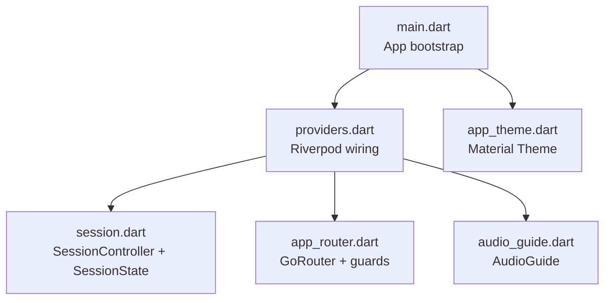
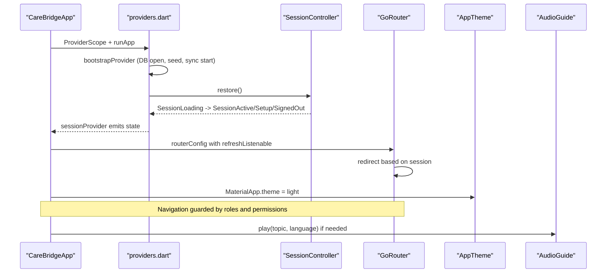
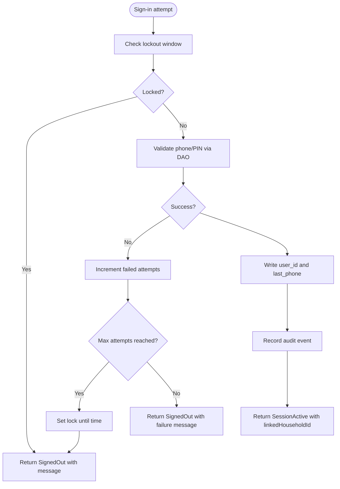
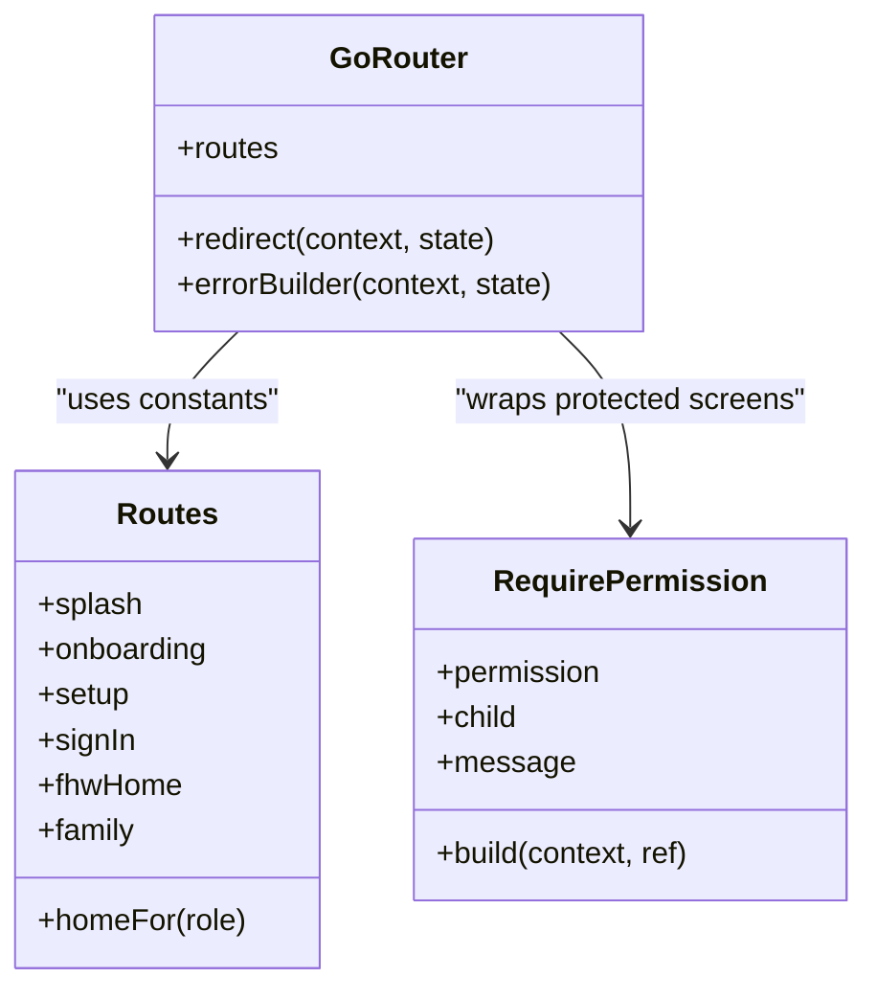
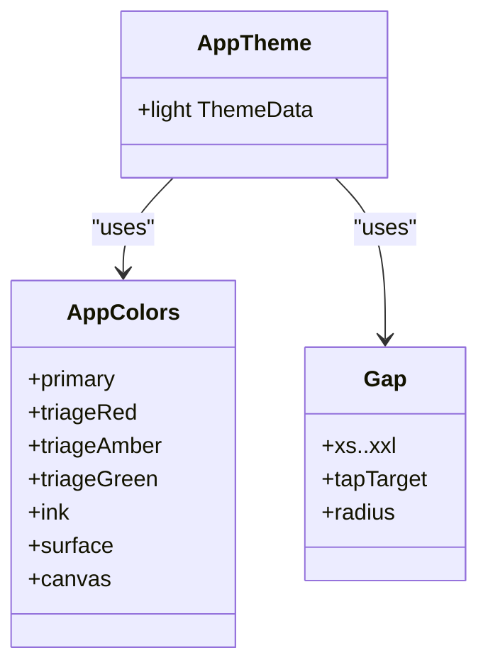
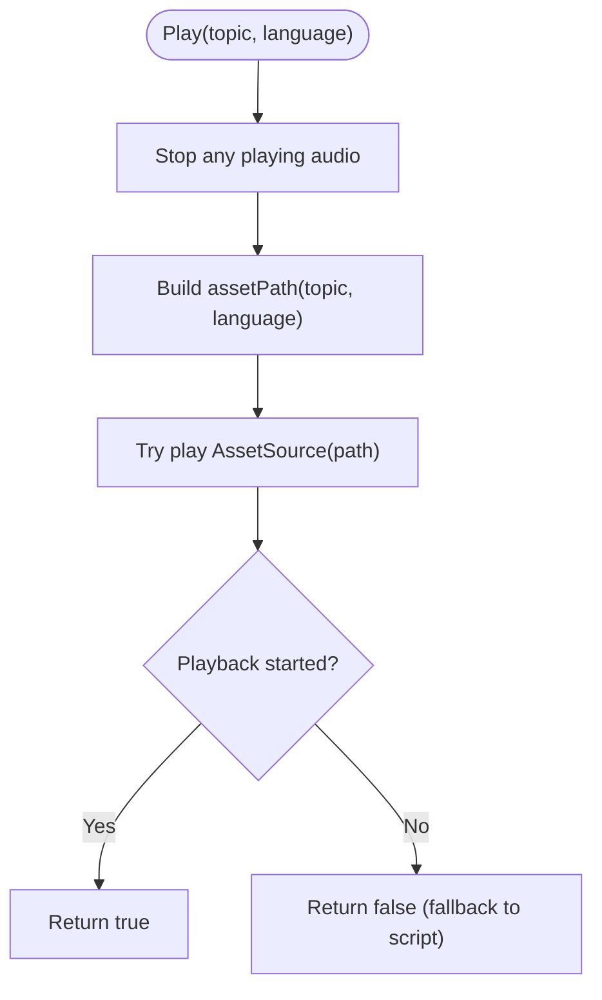
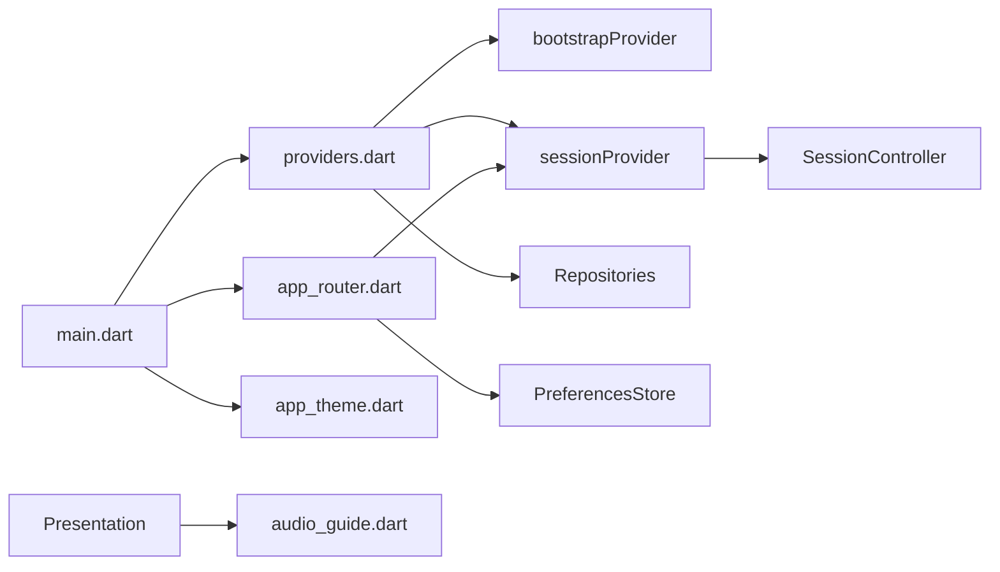

# Core Services

<cite>
**Referenced Files in This Document**
- [main.dart](file://lib/main.dart)
- [providers.dart](file://lib/app/providers.dart)
- [session.dart](file://lib/core/auth/session.dart)
- [app_router.dart](file://lib/core/router/app_router.dart)
- [app_theme.dart](file://lib/core/theme/app_theme.dart)
- [audio_guide.dart](file://lib/core/audio/audio_guide.dart)
</cite>

## Table of Contents
1. [Introduction](#introduction)
2. [Project Structure](#project-structure)
3. [Core Components](#core-components)
4. [Architecture Overview](#architecture-overview)
5. [Detailed Component Analysis](#detailed-component-analysis)
6. [Dependency Analysis](#dependency-analysis)
7. [Performance Considerations](#performance-considerations)
8. [Troubleshooting Guide](#troubleshooting-guide)
9. [Conclusion](#conclusion)
10. [Appendices](#appendices)

## Introduction
This document explains CareBridge AI’s core services layer, focusing on:
- Authentication with PIN-based login and role-aware session management
- Routing with permission guards and role-aware navigation
- Material Design theming tailored for field conditions
- Audio guidance system supporting local languages with graceful fallbacks
It also covers service initialization, dependency injection via Riverpod, inter-service communication, configuration options, security considerations, and integration examples.

## Project Structure
The application entry point wires up the provider scope, router, and theme. The providers file centralizes dependency injection and orchestrates bootstrapping (database open, demo seeding, sync start). Core services live under lib/core: auth, router, theme, and audio.

**Diagram sources**
- [main.dart:16-34](file://lib/main.dart#L16-L34)
- [providers.dart:38-42](file://lib/app/providers.dart#L38-L42)
- [session.dart:71-112](file://lib/core/auth/session.dart#L71-L112)
- [app_router.dart:63-159](file://lib/core/router/app_router.dart#L63-L159)
- [app_theme.dart:56-176](file://lib/core/theme/app_theme.dart#L56-L176)
- [audio_guide.dart:77-116](file://lib/core/audio/audio_guide.dart#L77-L116)

**Section sources**
- [main.dart:16-34](file://lib/main.dart#L16-L34)
- [providers.dart:38-42](file://lib/app/providers.dart#L38-L42)

## Core Components
- Session management: PIN-based sign-in, lockout policy, secure storage of user id and last phone, explicit sign-out, and audit logging.
- Routing: Role-aware redirects, capability-based guards, and error handling that returns users to their home route.
- Theming: Material 3 theme tuned for high contrast, large tap targets, and IMCI triage colors.
- Audio guidance: Localized MP3 playback with script fallback when recordings are missing.

Key responsibilities:
- SessionController: state transitions, persistence, lockout, and audit events.
- SessionNotifier: exposes session state to UI and coordinates bootstrap before restoring.
- Router: enforces coarse role separation and fine-grained permission checks via RequirePermission.
- AppTheme: color palette, spacing scale, and widget themes.
- AudioGuide: asset path generation, playback control, and language slugification.

**Section sources**
- [session.dart:71-245](file://lib/core/auth/session.dart#L71-L245)
- [providers.dart:68-122](file://lib/app/providers.dart#L68-L122)
- [app_router.dart:63-196](file://lib/core/router/app_router.dart#L63-L196)
- [app_theme.dart:11-176](file://lib/core/theme/app_theme.dart#L11-L176)
- [audio_guide.dart:22-116](file://lib/core/audio/audio_guide.dart#L22-L116)

## Architecture Overview
The app initializes a provider scope, then uses a single NotifierProvider for session state. The router listens to session changes and redirects accordingly. Repositories enforce permissions at data access boundaries; routes provide an additional guard layer. Audio is optional and degrades gracefully.

**Diagram sources**
- [main.dart:16-34](file://lib/main.dart#L16-L34)
- [providers.dart:38-42](file://lib/app/providers.dart#L38-L42)
- [providers.dart:73-122](file://lib/app/providers.dart#L73-L122)
- [session.dart:97-162](file://lib/core/auth/session.dart#L97-L162)
- [app_router.dart:63-159](file://lib/core/router/app_router.dart#L63-L159)
- [app_theme.dart:56-75](file://lib/core/theme/app_theme.dart#L56-L75)
- [audio_guide.dart:90-99](file://lib/core/audio/audio_guide.dart#L90-L99)

## Detailed Component Analysis

### Authentication and Session Lifecycle
- States: Loading, NeedsSetup, SignedOut, Active.
- Security:
  - PIN never leaves the hashing boundary; only user id persisted securely.
  - In-memory lockout after repeated failures; not persisted across restarts.
  - Audit trail for sign-in, register, and sign-out actions.
- Flow:
  - On startup, SessionNotifier waits for bootstrap, then calls SessionController.restore().
  - signIn validates attempts, updates secure storage, records audit, and sets linked household for caregivers.
  - signOut clears stored user id and resets lock counters.

**Diagram sources**
- [session.dart:114-162](file://lib/core/auth/session.dart#L114-L162)
- [session.dart:193-206](file://lib/core/auth/session.dart#L193-L206)

**Section sources**
- [session.dart:28-112](file://lib/core/auth/session.dart#L28-L112)
- [session.dart:114-206](file://lib/core/auth/session.dart#L114-L206)
- [providers.dart:73-122](file://lib/app/providers.dart#L73-L122)

### Routing and Permission Guards
- Role-aware redirects:
  - Pre-auth screens: splash, onboarding, setup, sign-in.
  - Post-auth: FHW goes to /fhw, caregiver to /family.
  - Coarse separation prevents cross-role deep links from rendering unauthorized screens.
- Fine-grained guards:
  - RequirePermission wraps screens and checks capabilities against the current user.
  - AccessDenied view guides users back to their home route.
- Error handling:
  - Unknown routes show a friendly “Not found” page with a back-to-start action.

**Diagram sources**
- [app_router.dart:34-48](file://lib/core/router/app_router.dart#L34-L48)
- [app_router.dart:167-196](file://lib/core/router/app_router.dart#L167-L196)
- [app_router.dart:63-159](file://lib/core/router/app_router.dart#L63-L159)

**Section sources**
- [app_router.dart:63-159](file://lib/core/router/app_router.dart#L63-L159)
- [app_router.dart:167-196](file://lib/core/router/app_router.dart#L167-L196)

### Theme System (Material Design)
- Color system optimized for bright sunlight and IMCI triage semantics.
- Spacing scale ensures large tap targets suitable for one-handed use while holding a child.
- Material 3 theme configures text, app bar, cards, buttons, inputs, chips, dividers, lists, and bottom navigation.

**Diagram sources**
- [app_theme.dart:11-54](file://lib/core/theme/app_theme.dart#L11-L54)
- [app_theme.dart:56-176](file://lib/core/theme/app_theme.dart#L56-L176)

**Section sources**
- [app_theme.dart:11-176](file://lib/core/theme/app_theme.dart#L11-L176)

### Audio Guidance System
- Two-layer design:
  - Script always available for reading aloud.
  - Optional bundled MP3 per topic and language.
- Playback strategy:
  - Attempts to stop previous playback, then plays asset if present.
  - Returns false when no recording exists; UI falls back to script.
- Language mapping:
  - Converts display names to filename-safe slugs.

**Diagram sources**
- [audio_guide.dart:77-116](file://lib/core/audio/audio_guide.dart#L77-L116)

**Section sources**
- [audio_guide.dart:22-116](file://lib/core/audio/audio_guide.dart#L22-L116)

## Dependency Analysis
- Bootstrap: Database opens and demo seeds once; sync service starts.
- Session: Depends on secure storage and DAOs; exposed via SessionNotifier.
- Router: Listens to sessionProvider; uses preferences for onboarding flag; applies RequirePermission.
- Theme: Consumed by MaterialApp at app root.
- Audio: Independent utility used by presentation layers.

**Diagram sources**
- [main.dart:16-34](file://lib/main.dart#L16-L34)
- [providers.dart:38-42](file://lib/app/providers.dart#L38-L42)
- [providers.dart:68-122](file://lib/app/providers.dart#L68-L122)
- [app_router.dart:63-159](file://lib/core/router/app_router.dart#L63-L159)
- [audio_guide.dart:77-116](file://lib/core/audio/audio_guide.dart#L77-L116)

**Section sources**
- [providers.dart:38-42](file://lib/app/providers.dart#L38-L42)
- [providers.dart:68-122](file://lib/app/providers.dart#L68-L122)
- [app_router.dart:63-159](file://lib/core/router/app_router.dart#L63-L159)

## Performance Considerations
- Session restoration runs asynchronously; splash holds until non-Loading state to avoid flashing sign-in for already-signed-in users.
- Secure storage operations degrade gracefully on failure; do not block critical flows.
- Router redirect uses a ChangeNotifier to minimize listener overhead across routes.
- Audio playback stops previous media before starting new playback to prevent overlap.
- Repository-level permission checks avoid redundant queries; providers cache results where appropriate.

[No sources needed since this section provides general guidance]

## Troubleshooting Guide
- Sign-in locked out:
  - Symptom: Message indicates keypad unlock timer.
  - Cause: Exceeded max attempts within the lock window.
  - Resolution: Wait for lock duration to expire; ensure correct PIN.
- Missing audio recording:
  - Symptom: play returns false; UI shows script instead.
  - Cause: No MP3 asset for selected language/topic.
  - Resolution: Add correctly named asset files or fall back to script.
- Unauthorized screen access:
  - Symptom: AccessDenied view with back-to-start button.
  - Cause: User lacks required permission for the screen.
  - Resolution: Adjust user role/permissions or navigate to home route.

**Section sources**
- [session.dart:114-162](file://lib/core/auth/session.dart#L114-L162)
- [audio_guide.dart:90-99](file://lib/core/audio/audio_guide.dart#L90-L99)
- [app_router.dart:167-196](file://lib/core/router/app_router.dart#L167-L196)

## Conclusion
CareBridge AI’s core services layer combines a robust PIN-based session model, role- and permission-aware routing, a field-optimized Material theme, and a resilient audio guidance system. Riverpod centralizes dependency injection and lifecycle management, ensuring predictable initialization and clean separation between UI and business logic. Together, these components deliver a secure, accessible, and maintainable foundation for community health workflows.

[No sources needed since this section summarizes without analyzing specific files]

## Appendices

### Configuration Options
- Session lockout:
  - Max attempts: configurable constant.
  - Lock duration: configurable constant.
- Theme customization:
  - Colors, spacing, and widget styles can be adjusted in the theme definition.
- Audio assets:
  - Place MP3 files under assets/audio with naming convention <topic>_<language>.mp3.

**Section sources**
- [session.dart:78-79](file://lib/core/auth/session.dart#L78-L79)
- [app_theme.dart:11-176](file://lib/core/theme/app_theme.dart#L11-L176)
- [audio_guide.dart:82-84](file://lib/core/audio/audio_guide.dart#L82-L84)

### Security Considerations
- PIN hashing boundary: PIN never leaves the hashing function; only user id persists.
- In-memory lockout: Not persisted across restarts to balance usability and security.
- Audit logging: All authentication events recorded for accountability.
- Permission enforcement: Dual-layer approach—repository-level checks plus route guards.

**Section sources**
- [session.dart:1-20](file://lib/core/auth/session.dart#L1-20)
- [session.dart:154-162](file://lib/core/auth/session.dart#L154-L162)
- [app_router.dart:1-16](file://lib/core/router/app_router.dart#L1-L16)

### Integration Examples
- Initialize app with provider scope and router:
  - See app bootstrap and MaterialApp configuration.
- Restore session on startup:
  - SessionNotifier triggers bootstrap and restores state.
- Guard a screen with a permission:
  - Wrap screen with RequirePermission specifying the needed permission.
- Play audio guidance:
  - Call AudioGuide.play with topic and language; handle false return by showing script.

**Section sources**
- [main.dart:16-34](file://lib/main.dart#L16-L34)
- [providers.dart:73-92](file://lib/app/providers.dart#L73-L92)
- [app_router.dart:126-139](file://lib/core/router/app_router.dart#L126-L139)
- [audio_guide.dart:90-99](file://lib/core/audio/audio_guide.dart#L90-L99)