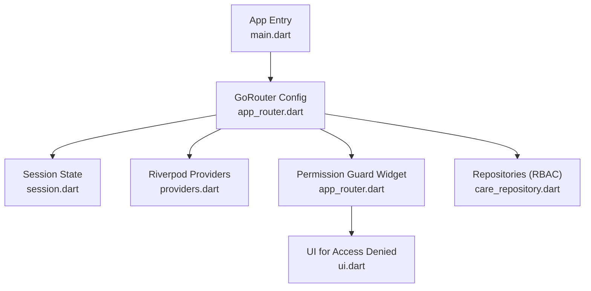
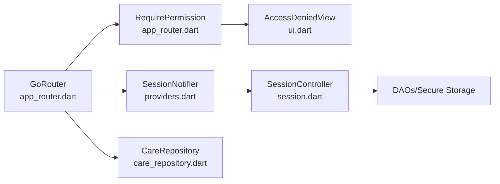

# Routing & Navigation System

<cite>
**Referenced Files in This Document**
- [main.dart](file://lib/main.dart)
- [app_router.dart](file://lib/core/router/app_router.dart)
- [session.dart](file://lib/core/auth/session.dart)
- [providers.dart](file://lib/app/providers.dart)
- [ui.dart](file://lib/presentation/shared/ui.dart)
- [care_repository.dart](file://lib/data/repositories/care_repository.dart)
- [rbac_test.dart](file://test/rbac_test.dart)
</cite>

## Table of Contents
1. [Introduction](#introduction)
2. [Project Structure](#project-structure)
3. [Core Components](#core-components)
4. [Architecture Overview](#architecture-overview)
5. [Detailed Component Analysis](#detailed-component-analysis)
6. [Dependency Analysis](#dependency-analysis)
7. [Performance Considerations](#performance-considerations)
8. [Troubleshooting Guide](#troubleshooting-guide)
9. [Conclusion](#conclusion)
10. [Appendices](#appendices)

## Introduction
This document explains CareBridge AI’s routing and navigation system built with GoRouter. It covers role-aware navigation guards, permission-based route protection, deep link handling, and integration with the session management system to provide distinct flows for CHO (Community Health Officers, modeled as frontline health workers) and caregiver roles. It also documents programmatic navigation patterns, authentication state coupling, protected route behavior, and common scenarios such as role switching, back button handling, and maintaining app state during navigation.

## Project Structure
The routing system is centered around a single router configuration that:
- Declares routes for onboarding, setup, sign-in, and role-specific homes
- Uses a global redirect to enforce session and role boundaries
- Wraps sensitive screens with a capability-based guard widget
- Integrates with Riverpod providers to react to session changes



**Diagram sources**
- [main.dart:16-34](file://lib/main.dart#L16-L34)
- [app_router.dart:63-159](file://lib/core/router/app_router.dart#L63-L159)
- [session.dart:28-67](file://lib/core/auth/session.dart#L28-L67)
- [providers.dart:68-128](file://lib/app/providers.dart#L68-L128)
- [ui.dart:658-664](file://lib/presentation/shared/ui.dart#L658-L664)
- [care_repository.dart:62-102](file://lib/data/repositories/care_repository.dart#L62-L102)

**Section sources**
- [main.dart:16-34](file://lib/main.dart#L16-L34)
- [app_router.dart:63-159](file://lib/core/router/app_router.dart#L63-L159)

## Core Components
- Router configuration and redirects: centralizes initial location, refresh triggers, and role-aware redirection logic.
- Session state machine: models loading, setup, signed-out, and active states; exposes user role and permissions.
- Permission guard widget: enforces capability checks at the screen level using the current user’s permissions.
- Riverpod wiring: provides session state, current user, and linked household scope to the router and UI.

Key responsibilities:
- Redirects ensure users cannot access routes outside their role or without authentication.
- Guards prevent rendering of screens when the current user lacks required permissions.
- Splash and onboarding flow coordinate with bootstrap and preferences to avoid race conditions.

**Section sources**
- [app_router.dart:34-114](file://lib/core/router/app_router.dart#L34-L114)
- [session.dart:28-67](file://lib/core/auth/session.dart#L28-L67)
- [providers.dart:68-128](file://lib/app/providers.dart#L68-L128)

## Architecture Overview
The router integrates with session management via Riverpod. When session state changes, the router rebuilds its redirect logic and navigates accordingly. Role separation is enforced both at the route boundary (coarse) and within repositories (fine-grained).

```mermaid
sequenceDiagram
participant App as "CareBridgeApp"
participant Router as "GoRouter"
participant Refresh as "_SessionRefresh"
participant Session as "SessionNotifier"
participant Controller as "SessionController"
participant DB as "Database/DAOs"
participant Pref as "PreferencesStore"
App->>Router : Initialize with initialLocation "/"
Router->>Refresh : Subscribe to sessionProvider
App->>Session : build() -> restore()
Session->>Controller : restore()
Controller->>DB : Check registered accounts, read secure storage
DB-->>Controller : User ID / registration status
Controller-->>Session : SessionState (Loading/Setup/SignedOut/Active)
Session-->>Refresh : notifyListeners()
Router->>Router : redirect(context, state)
alt SessionLoading
Router-->>Router : Keep splash unless already there
else SessionNeedsSetup
Router-->>Router : Navigate to "/setup"
else SessionSignedOut
Router-->>Router : Allow onboarding/sign-in/setup; otherwise redirect to "/sign-in"
else SessionActive(user)
Router->>Router : Compute homeFor(role)
Router-->>Router : Enforce coarse role boundaries (/fhw vs /family)
end
Note over Router,Session : Deep links are validated by redirect; invalid paths bounce to appropriate entry points
```

**Diagram sources**
- [app_router.dart:63-114](file://lib/core/router/app_router.dart#L63-L114)
- [providers.dart:77-122](file://lib/app/providers.dart#L77-L122)
- [session.dart:97-112](file://lib/core/auth/session.dart#L97-L112)

## Detailed Component Analysis

### GoRouter Configuration and Redirect Logic
- Initial location is set to the splash route.
- A ChangeNotifier listens to sessionProvider to trigger router rebuilds on session changes.
- The redirect function handles:
  - Loading state: hold splash to avoid flashing sign-in for returning users.
  - Setup state: direct to setup if not already there.
  - Signed-out state: allow onboarding once per device; otherwise restrict to sign-in and setup.
  - Active state: compute role-appropriate home and enforce coarse boundaries between FHW and caregiver routes.

Deep link support:
- Any incoming URL is evaluated against the current session and role. If it violates policy, the router redirects to the correct entry point or home.

Error handling:
- A custom errorBuilder shows a friendly “Not found” page and offers a “Back to start” action that navigates based on current user state.

**Section sources**
- [app_router.dart:63-159](file://lib/core/router/app_router.dart#L63-L159)

### RequirePermission Guard Widget
- Wraps any screen requiring a specific permission.
- Reads the current user from currentUserProvider.
- If the user lacks the permission, renders an AccessDeniedView with a message and a back action that returns to the user’s home route.
- If granted, renders the child widget.

This approach keeps route-level security coarse and delegates fine-grained checks to repositories.

**Section sources**
- [app_router.dart:167-196](file://lib/core/router/app_router.dart#L167-L196)
- [ui.dart:658-664](file://lib/presentation/shared/ui.dart#L658-L664)

### Session Management Integration
- SessionNotifier starts in SessionLoading and restores the actual state asynchronously.
- SessionController.restore determines whether to show setup, sign-in, or active session based on secure storage and database state.
- Sign-in and registration update session state and persist identifiers securely.
- Sign-out clears persisted identifiers and resets lockout counters.

Routing reacts to these state transitions through _SessionRefresh and the router’s redirect.

**Section sources**
- [providers.dart:77-122](file://lib/app/providers.dart#L77-L122)
- [session.dart:97-206](file://lib/core/auth/session.dart#L97-L206)

### Role-Based Home and Boundaries
- Routes define separate paths for FHW and caregiver homes.
- homeFor computes the appropriate home based on UserRole.
- Redirect enforces that caregivers cannot navigate under FHW routes and vice versa.

Tests validate role properties and expected routing outcomes.

**Section sources**
- [app_router.dart:34-48](file://lib/core/router/app_router.dart#L34-L48)
- [rbac_test.dart:83-90](file://test/rbac_test.dart#L83-L90)

### Repository-Level RBAC and Scope Enforcement
- Repositories enforce permissions before data access and log denied attempts.
- Household scoping ensures caregivers can only access their linked household; FHWs have zone-wide visibility.
- This fine-grained enforcement complements route-level guards.

**Section sources**
- [care_repository.dart:62-102](file://lib/data/repositories/care_repository.dart#L62-L102)

### Splash and Onboarding Flow
- The splash screen waits for bootstrap to complete and session to leave Loading before deciding next steps.
- It consults PreferencesStore to determine whether to show onboarding or sign-in.
- Once session becomes Active, the router’s redirect takes over to move to the appropriate home.

**Section sources**
- [app_router.dart:198-243](file://lib/core/router/app_router.dart#L198-L243)
- [providers.dart:38-42](file://lib/app/providers.dart#L38-L42)

### Programmatic Navigation Patterns
- Use context.go to navigate to named routes defined in Routes constants.
- For role switching, call session.signOut and then let redirect handle re-routing to sign-in or setup.
- After successful sign-in, the router automatically navigates to the role-appropriate home.

Examples:
- Navigate to sign-in: context.go(Routes.signIn)
- Navigate to home for current role: context.go(Routes.homeFor(user.role))
- Back to start from error page: handled by errorBuilder action

**Section sources**
- [app_router.dart:140-159](file://lib/core/router/app_router.dart#L140-L159)
- [providers.dart:112-117](file://lib/app/providers.dart#L112-L117)

### Handling Protected Routes and Authentication States
- Unauthenticated access to protected routes results in redirect to sign-in or setup depending on session state.
- Authenticated but unauthorized access shows AccessDeniedView with guidance to return to home.
- Repository-level checks throw AccessDenied exceptions logged via audit DAOs.

**Section sources**
- [app_router.dart:63-114](file://lib/core/router/app_router.dart#L63-L114)
- [care_repository.dart:62-102](file://lib/data/repositories/care_repository.dart#L62-L102)

### Common Scenarios
- Role switching: sign out explicitly; router redirects to sign-in; upon new sign-in, navigate to the correct home.
- Back button handling: default Flutter back behavior applies; custom back actions in guards navigate to role-appropriate home.
- Maintaining app state: Riverpod providers maintain state across navigations; screens should rely on providers rather than local state for shared data.

**Section sources**
- [providers.dart:68-128](file://lib/app/providers.dart#L68-L128)
- [app_router.dart:167-196](file://lib/core/router/app_router.dart#L167-L196)

## Dependency Analysis
The routing layer depends on session state and Riverpod providers to drive navigation decisions. Permission checks occur both at the UI layer (RequirePermission) and at the data layer (repositories).



**Diagram sources**
- [app_router.dart:63-196](file://lib/core/router/app_router.dart#L63-L196)
- [providers.dart:68-128](file://lib/app/providers.dart#L68-L128)
- [session.dart:97-206](file://lib/core/auth/session.dart#L97-L206)
- [care_repository.dart:62-102](file://lib/data/repositories/care_repository.dart#L62-L102)
- [ui.dart:658-664](file://lib/presentation/shared/ui.dart#L658-L664)

**Section sources**
- [app_router.dart:63-196](file://lib/core/router/app_router.dart#L63-L196)
- [providers.dart:68-128](file://lib/app/providers.dart#L68-L128)

## Performance Considerations
- Single refreshListenable (_SessionRefresh) minimizes rebuilds compared to per-route listeners.
- Splash holds until bootstrap completes to avoid redundant navigation and UI flicker.
- Permission checks are lightweight (user.can) and centralized; repository checks are necessary but scoped to data operations.
- Avoid heavy computations in redirect; keep redirect logic focused on session and role evaluation.

[No sources needed since this section provides general guidance]

## Troubleshooting Guide
Common issues and resolutions:
- Flashing sign-in screen for returning users: ensure redirect respects SessionLoading and stays on splash until session resolves.
- Unauthorized access loops: verify RequirePermission wraps all sensitive screens and that redirect enforces coarse role boundaries.
- Deep links landing on wrong screens: confirm redirect evaluates matchedLocation against allowed paths for current session and role.
- Back button confusion: implement explicit back actions in guards to navigate to role-appropriate home.

**Section sources**
- [app_router.dart:63-114](file://lib/core/router/app_router.dart#L63-L114)
- [app_router.dart:167-196](file://lib/core/router/app_router.dart#L167-L196)

## Conclusion
CareBridge AI’s routing system combines GoRouter’s declarative configuration with Riverpod-driven session state to deliver robust, role-aware navigation. Coarse route-level guards protect entire sections, while fine-grained repository checks enforce permissions at the data boundary. The design supports deep links, graceful error handling, and clear navigation flows for both CHO and caregiver roles, ensuring a consistent and secure user experience.

[No sources needed since this section summarizes without analyzing specific files]

## Appendices

### Route Definitions Summary
- Splash: initial entry point
- Onboarding: first-run experience
- Setup: device registration and account creation
- Sign-in: authentication
- FHW Home: frontline health worker dashboard
- Family Home: caregiver dashboard

Navigation rules:
- Unauthenticated users are redirected to onboarding or sign-in depending on device state.
- Authenticated users are directed to their role-appropriate home.
- Cross-role access is blocked at the route level.

**Section sources**
- [app_router.dart:34-48](file://lib/core/router/app_router.dart#L34-L48)
- [app_router.dart:115-140](file://lib/core/router/app_router.dart#L115-L140)