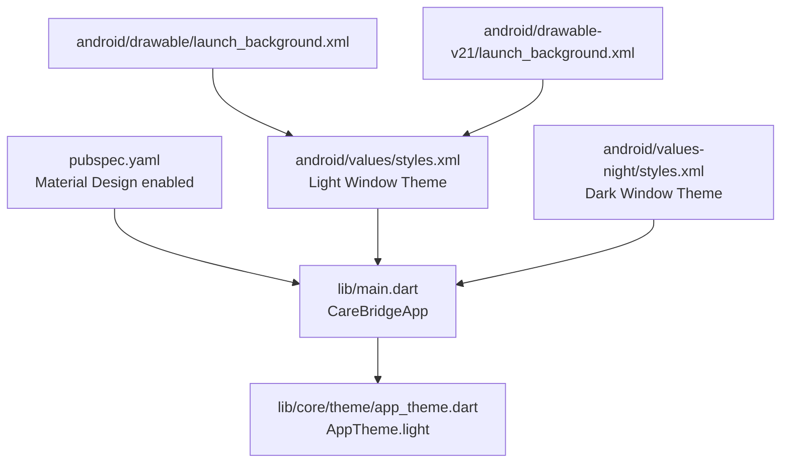
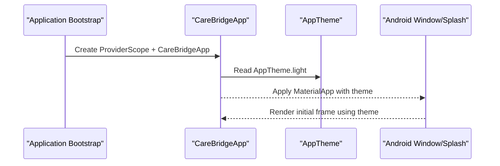
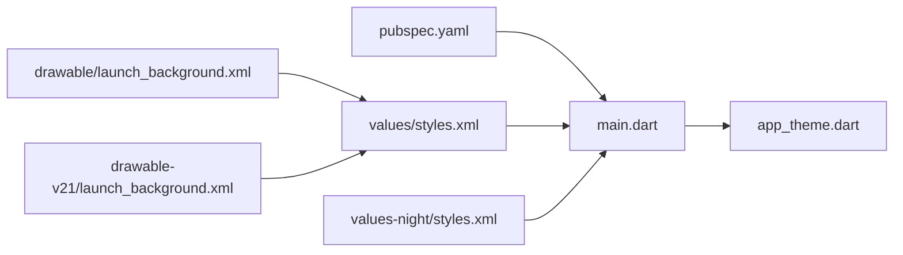

# Theme & UI Configuration

<cite>
**Referenced Files in This Document**
- [pubspec.yaml](file://pubspec.yaml)
- [main.dart](file://lib/main.dart)
- [app_theme.dart](file://lib/core/theme/app_theme.dart)
- [styles.xml (light)](file://android/app/src/main/res/values/styles.xml)
- [styles.xml (night)](file://android/app/src/main/res/values-night/styles.xml)
- [launch_background.xml (v19)](file://android/app/src/main/res/drawable/launch_background.xml)
- [launch_background.xml (v21)](file://android/app/src/main/res/drawable-v21/launch_background.xml)
</cite>

## Table of Contents
1. Introduction
2. Project Structure
3. Core Components
4. Architecture Overview
5. Detailed Component Analysis
6. Dependency Analysis
7. Performance Considerations
8. Troubleshooting Guide
9. Conclusion

## Introduction
This document explains CareBridge AI’s theme and UI configuration system. It covers the Material Design implementation, custom color system, typography settings, spacing scale, and how themes are applied across the app. It also outlines platform-specific adaptations for Android, accessibility considerations, responsive design patterns, and best practices for maintaining consistent UI across devices and screen densities.

## Project Structure
The theming setup is centered around a single Flutter theme definition and a minimal application entry point that applies the theme to the root MaterialApp. Platform-level splash and window themes are configured on Android to align with light and dark modes.

**Diagram sources**
- [pubspec.yaml:62-67](file://pubspec.yaml#L62-L67)
- [main.dart:20-34](file://lib/main.dart#L20-L34)
- [app_theme.dart:56-176](file://lib/core/theme/app_theme.dart#L56-L176)
- [styles.xml (light):1-19](file://android/app/src/main/res/values/styles.xml#L1-L19)
- [styles.xml (night):1-19](file://android/app/src/main/res/values-night/styles.xml#L1-L19)
- [launch_background.xml (v19):1-12](file://android/app/src/main/res/drawable/launch_background.xml#L1-L12)
- [launch_background.xml (v21):1-12](file://android/app/src/main/res/drawable-v21/launch_background.xml#L1-L12)

**Section sources**
- [pubspec.yaml:62-67](file://pubspec.yaml#L62-L67)
- [main.dart:20-34](file://lib/main.dart#L20-L34)

## Core Components
- AppColors: Centralized color tokens including brand colors, IMCI triage semantics, neutrals, and semantic indicators.
- Gap: Spacing scale and touch target sizing optimized for field conditions.
- AppTheme: Material 3 ThemeData factory providing the light theme with text, app bar, cards, buttons, inputs, chips, dividers, lists, and bottom navigation styling.
- Application bootstrap: The root widget wires up Riverpod, router, and applies the light theme via MaterialApp.

Key responsibilities:
- Color system: Consistent palette aligned with WHO IMCI conventions for triage visuals.
- Typography: Slightly enlarged default font size factor for legibility in bright sunlight.
- Component themes: Standardized shapes, elevations, and sizes for buttons, cards, inputs, chips, and navigation.
- Platform integration: Android window and splash themes prepared for light mode; dark mode support can be extended by adding a corresponding dark ThemeData.

**Section sources**
- [app_theme.dart:11-38](file://lib/core/theme/app_theme.dart#L11-L38)
- [app_theme.dart:40-54](file://lib/core/theme/app_theme.dart#L40-L54)
- [app_theme.dart:56-176](file://lib/core/theme/app_theme.dart#L56-L176)
- [main.dart:20-34](file://lib/main.dart#L20-L34)

## Architecture Overview
The theme architecture follows a simple, centralized pattern:
- The app entry point constructs the root widget and sets the theme.
- All screens and components consume the theme through Material widgets and the provided ThemeData.
- Android window/splash themes are configured separately to ensure consistent background during launch.

**Diagram sources**
- [main.dart:20-34](file://lib/main.dart#L20-L34)
- [app_theme.dart:56-176](file://lib/core/theme/app_theme.dart#L56-L176)
- [styles.xml (light):1-19](file://android/app/src/main/res/values/styles.xml#L1-L19)

## Detailed Component Analysis

### Color System and Semantics
- Brand colors define primary, accent, and surface tones.
- Triage colors map directly to IMCI guidance: red for urgent referral, amber for follow-up, green for home care/counseling.
- Neutrals provide ink hierarchy and line separators.
- Semantic colors include offline and info states.

Accessibility implications:
- High contrast between ink and surface ensures readability under bright sunlight.
- Triage colors are reserved for clinical meaning, not decoration, preserving semantic clarity.

**Section sources**
- [app_theme.dart:11-38](file://lib/core/theme/app_theme.dart#L11-L38)

### Spacing and Touch Targets
- Generous spacing scale supports one-handed use while holding an infant.
- Minimum tap target height exceeds Material minimums for better ergonomics in the field.

**Section sources**
- [app_theme.dart:40-54](file://lib/core/theme/app_theme.dart#L40-L54)

### Typography Settings
- Text theme uses a slightly larger font size factor to improve legibility in outdoor conditions.
- Title styles emphasize strong weight and readable sizes for headers.

**Section sources**
- [app_theme.dart:76-94](file://lib/core/theme/app_theme.dart#L76-L94)

### Component Themes
- AppBar: Flat elevation with subtle scrolled elevation; title style tuned for visibility.
- Cards: Minimal elevation with rounded corners and subtle borders.
- Buttons: Consistent heights, bold text, and clear visual hierarchy for filled and outlined variants.
- Inputs: Filled backgrounds, rounded borders, and focused state emphasis.
- Chips: Pill-shaped with neutral backgrounds and clear labels.
- Dividers and Lists: Subtle lines and consistent padding for scannability.
- Bottom Navigation: Fixed type with selected/unselected color contrast.

**Section sources**
- [app_theme.dart:83-174](file://lib/core/theme/app_theme.dart#L83-L174)

### Applying the Theme Across the App
- The root widget sets the theme once, ensuring all descendant widgets inherit it consistently.
- Router and providers are initialized after theme application, keeping UI concerns separate from data concerns.

**Section sources**
- [main.dart:20-34](file://lib/main.dart#L20-L34)

### Dark Mode Support
- Current implementation provides a light theme only.
- To enable dark mode, add a dark ThemeData variant and integrate dynamic theme switching at runtime or based on system preferences.
- Ensure triage semantics remain accessible and distinguishable in dark contexts.

[No sources needed since this section provides general guidance]

### Responsive Design Patterns
- Use the Gap scale for consistent spacing across breakpoints.
- Prefer flexible layouts and avoid fixed widths where possible.
- Maintain minimum touch targets regardless of screen size.
- Test on small phones and tablets to validate readability and interaction comfort.

[No sources needed since this section provides general guidance]

### Accessibility Considerations
- High contrast and large fonts support users in challenging lighting.
- Reserve triadic colors for their clinical meanings to maintain semantic consistency.
- Ensure focus states are visible and interactive elements meet minimum size guidelines.

[No sources needed since this section provides general guidance]

### Platform-Specific Adaptations (Android)
- Light and night window themes configure the Android window background during launch and while Flutter initializes.
- Splash backgrounds are defined for different API levels to ensure smooth transitions into the themed UI.

**Section sources**
- [styles.xml (light):1-19](file://android/app/src/main/res/values/styles.xml#L1-L19)
- [styles.xml (night):1-19](file://android/app/src/main/res/values-night/styles.xml#L1-L19)
- [launch_background.xml (v19):1-12](file://android/app/src/main/res/drawable/launch_background.xml#L1-L12)
- [launch_background.xml (v21):1-12](file://android/app/src/main/res/drawable-v21/launch_background.xml#L1-L12)

### iOS Theming Notes
- No explicit iOS theme files were found in the repository.
- For iOS, rely on Flutter’s ThemeData and consider integrating with system appearance if needed.

[No sources needed since this section provides general guidance]

## Dependency Analysis
The theme system has minimal dependencies:
- pubspec enables Material Design.
- main.dart imports and applies the theme.
- Android resources configure window and splash behavior.

**Diagram sources**
- [pubspec.yaml:62-67](file://pubspec.yaml#L62-L67)
- [main.dart:20-34](file://lib/main.dart#L20-L34)
- [app_theme.dart:56-176](file://lib/core/theme/app_theme.dart#L56-L176)
- [styles.xml (light):1-19](file://android/app/src/main/res/values/styles.xml#L1-L19)
- [styles.xml (night):1-19](file://android/app/src/main/res/values-night/styles.xml#L1-L19)
- [launch_background.xml (v19):1-12](file://android/app/src/main/res/drawable/launch_background.xml#L1-L12)
- [launch_background.xml (v21):1-12](file://android/app/src/main/res/drawable-v21/launch_background.xml#L1-L12)

**Section sources**
- [pubspec.yaml:62-67](file://pubspec.yaml#L62-L67)
- [main.dart:20-34](file://lib/main.dart#L20-L34)

## Performance Considerations
- Keep theme definitions static and immutable to avoid unnecessary rebuilds.
- Avoid heavy computations inside theme factories; precompute derived values when possible.
- Minimize theme changes at runtime; batch updates if dynamic switching is required.
- Use Material 3 defaults where appropriate to reduce customization overhead.
- On Android, ensure splash/background resources are lightweight to speed up launch.

[No sources needed since this section provides general guidance]

## Troubleshooting Guide
Common issues and resolutions:
- Inconsistent colors across screens: Ensure all components reference AppColors rather than hardcoded values.
- Low contrast in bright environments: Verify ink vs surface contrast and consider increasing font size factors.
- Touch targets too small: Enforce Gap.tapTarget for interactive elements.
- Launch background mismatch: Align Android window background with theme colors and verify drawable resources.
- Missing dark mode visuals: Add a dark ThemeData and wire it to system preference or user toggle.

[No sources needed since this section provides general guidance]

## Conclusion
CareBridge AI’s theming system centers on a clear, centralized Material 3 theme with a purpose-built color palette aligned to clinical triage semantics. The approach prioritizes legibility, accessibility, and ergonomic interactions in field conditions. Extending the system to support dark mode and additional platforms involves adding complementary theme definitions and ensuring consistent application across the UI tree. Following the documented best practices will help maintain a cohesive, performant, and accessible experience across diverse devices and screen densities.