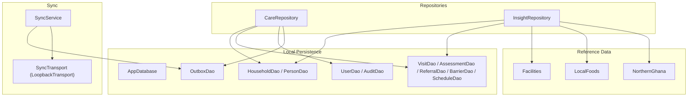
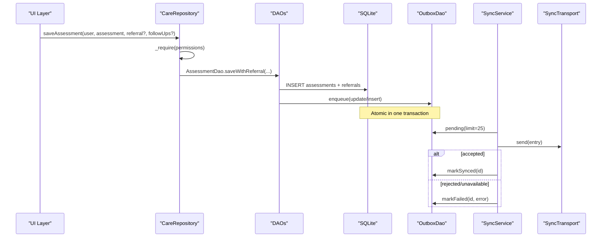
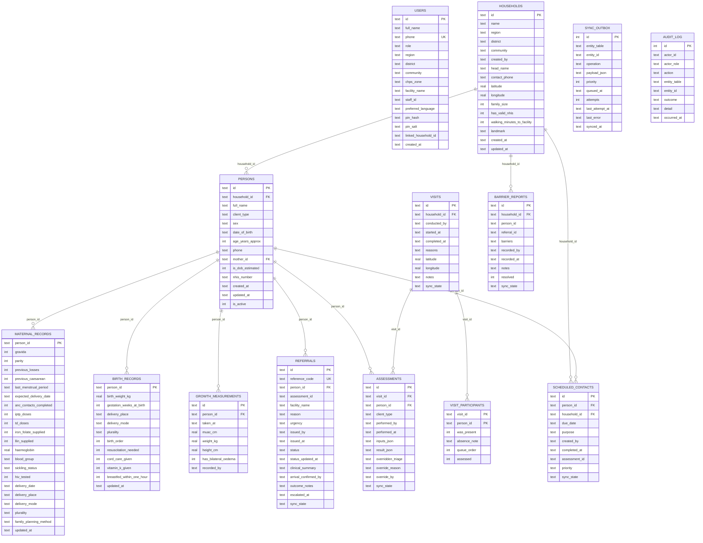
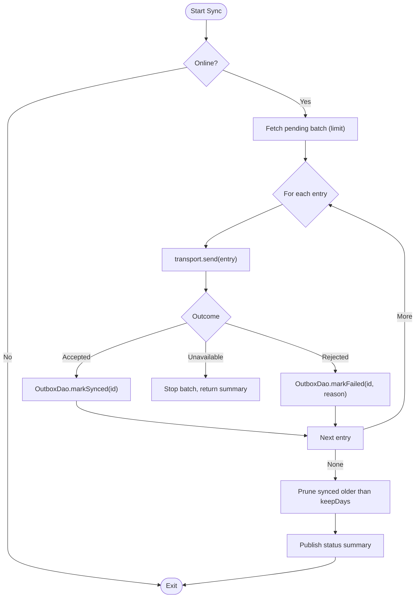
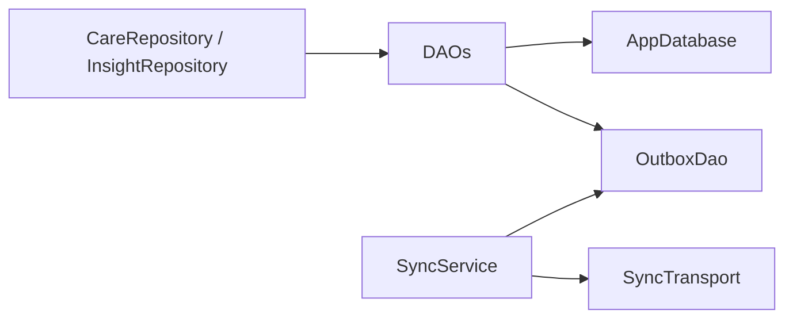
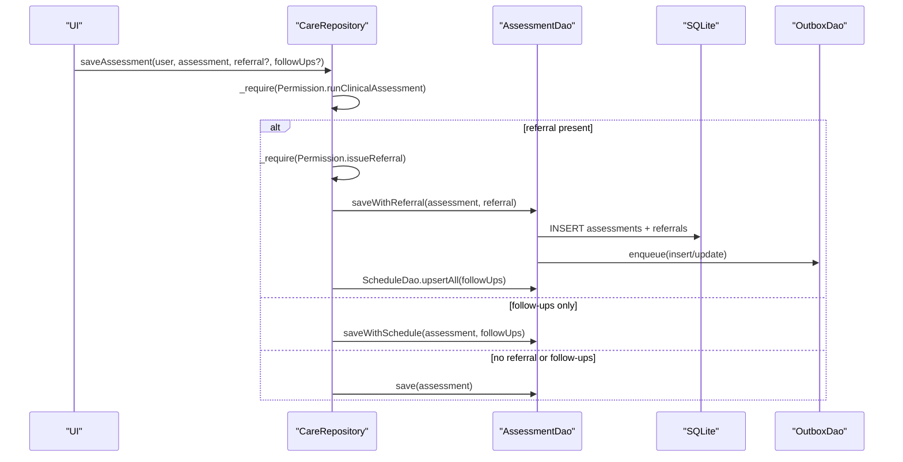

# Data Layer

<cite>
**Referenced Files in This Document**
- [app_database.dart](file://lib/data/local/app_database.dart)
- [household_dao.dart](file://lib/data/local/household_dao.dart)
- [user_dao.dart](file://lib/data/local/user_dao.dart)
- [visit_dao.dart](file://lib/data/local/visit_dao.dart)
- [outbox_dao.dart](file://lib/data/local/outbox_dao.dart)
- [care_repository.dart](file://lib/data/repositories/care_repository.dart)
- [insight_repository.dart](file://lib/data/repositories/insight_repository.dart)
- [sync_service.dart](file://lib/data/sync/sync_service.dart)
- [facilities.dart](file://lib/data/reference/facilities.dart)
- [local_foods.dart](file://lib/data/reference/local_foods.dart)
- [northern_ghana.dart](file://lib/data/reference/northern_ghana.dart)
</cite>

## Table of Contents
1. [Introduction](#introduction)
2. [Project Structure](#project-structure)
3. [Core Components](#core-components)
4. [Architecture Overview](#architecture-overview)
5. [Detailed Component Analysis](#detailed-component-analysis)
6. [Dependency Analysis](#dependency-analysis)
7. [Performance Considerations](#performance-considerations)
8. [Troubleshooting Guide](#troubleshooting-guide)
9. [Conclusion](#conclusion)
10. [Appendices](#appendices)

## Introduction
This document describes the offline-first data layer of CareBridge AI. It explains the SQLite schema (14 tables), the repository pattern for access control and abstraction, background synchronization, reference data management, validation rules, caching strategies, conflict resolution approaches, database optimization techniques, query performance considerations, migration strategy, and security and privacy controls. The design ensures that care delivery is never blocked by connectivity constraints while maintaining strong guarantees about data integrity, auditability, and safety-critical prioritization.

## Project Structure
The data layer is organized into:
- Local persistence: AppDatabase singleton, DAOs for entities, and an outbox for sync intent.
- Repositories: Access-controlled gateways enforcing permissions and scoping.
- Sync service: Background, opportunistic synchronization with priority batching.
- Reference data: Facilities, local foods, and administrative geography used to ground decisions and queries.



**Diagram sources**
- [app_database.dart:43-173](file://lib/data/local/app_database.dart#L43-L173)
- [household_dao.dart:22-162](file://lib/data/local/household_dao.dart#L22-L162)
- [visit_dao.dart:84-269](file://lib/data/local/visit_dao.dart#L84-L269)
- [user_dao.dart:117-340](file://lib/data/local/user_dao.dart#L117-L340)
- [outbox_dao.dart:160-276](file://lib/data/local/outbox_dao.dart#L160-L276)
- [care_repository.dart:55-127](file://lib/data/repositories/care_repository.dart#L55-L127)
- [insight_repository.dart:120-168](file://lib/data/repositories/insight_repository.dart#L120-L168)
- [sync_service.dart:96-146](file://lib/data/sync/sync_service.dart#L96-L146)
- [facilities.dart:57-118](file://lib/data/reference/facilities.dart#L57-L118)
- [local_foods.dart:172-220](file://lib/data/reference/local_foods.dart#L172-L220)
- [northern_ghana.dart:60-90](file://lib/data/reference/northern_ghana.dart#L60-L90)

**Section sources**
- [app_database.dart:1-173](file://lib/data/local/app_database.dart#L1-L173)
- [care_repository.dart:1-127](file://lib/data/repositories/care_repository.dart#L1-L127)
- [sync_service.dart:1-146](file://lib/data/sync/sync_service.dart#L1-L146)

## Core Components
- AppDatabase: Singleton managing SQLite lifecycle, foreign keys, schema creation, upgrade hooks, and test helpers.
- DAOs: Thin, transactional wrappers around SQL operations; every write enqueues a corresponding outbox entry.
- OutboxDao: Priority-based sync queue with exponential backoff, failure surfacing, and pruning.
- CareRepository: Centralized access control and scoping enforcement for all reads/writes.
- InsightRepository: Batched reads and in-memory scoring to produce day plans and vulnerability insights.
- SyncService: Opportunistic background sync on connectivity changes and periodic timers.
- Reference modules: Facilities, LocalFoods, NorthernGhana provide static datasets for decision support.

Key responsibilities:
- Offline-first writes are immediate and durable; sync is eventual and non-blocking.
- Clinical history is append-only where required (e.g., growth measurements).
- Role-based permissions and household scoping are enforced at the repository boundary.
- Audit logging captures permission denials and critical actions.

**Section sources**
- [app_database.dart:43-173](file://lib/data/local/app_database.dart#L43-L173)
- [outbox_dao.dart:160-276](file://lib/data/local/outbox_dao.dart#L160-L276)
- [care_repository.dart:55-127](file://lib/data/repositories/care_repository.dart#L55-L127)
- [insight_repository.dart:120-168](file://lib/data/repositories/insight_repository.dart#L120-L168)
- [sync_service.dart:96-146](file://lib/data/sync/sync_service.dart#L96-L146)

## Architecture Overview
The data layer follows an offline-first architecture:
- Writes commit locally within a single transaction and enqueue a sync intent atomically.
- A background sync process batches pending items by priority and attempts transmission opportunistically.
- Reference data informs clinical logic and user-facing guidance without blocking workflows.



**Diagram sources**
- [care_repository.dart:350-391](file://lib/data/repositories/care_repository.dart#L350-L391)
- [visit_dao.dart:284-308](file://lib/data/local/visit_dao.dart#L284-L308)
- [outbox_dao.dart:160-218](file://lib/data/local/outbox_dao.dart#L160-L218)
- [sync_service.dart:156-217](file://lib/data/sync/sync_service.dart#L156-L217)

## Detailed Component Analysis

### SQLite Schema (14 Tables)
The schema defines core entities and operational tables:
- users: Shared-device accounts with PIN hashes and role metadata.
- households: Family units with location and contact details.
- persons: Flat table for women, newborns, under-fives with soft deletes.
- maternal_records: One row per woman mirroring record book fields.
- birth_records: Fixed-at-birth facts driving early risk models.
- growth_measurements: Append-only series for trajectory analysis.
- visits: Encounters with geolocation and timing.
- visit_participants: Roll call capturing presence and absence notes.
- assessments: Raw inputs and results plus override tracking.
- referrals: Last-mile loop with status and escalation timestamps.
- barrier_reports: Reasons care did not happen, enabling pattern detection.
- scheduled_contacts: Engine-generated follow-ups.
- sync_outbox: Priority queue for background sync.
- audit_log: Immutable log of access and clinical overrides.

Indexes optimize common queries: zone lists, person lookups, visit histories, assessment timelines, referral statuses, barrier patterns, and outbox ordering.



**Diagram sources**
- [app_database.dart:194-556](file://lib/data/local/app_database.dart#L194-L556)

**Section sources**
- [app_database.dart:194-556](file://lib/data/local/app_database.dart#L194-L556)

### Repository Pattern and Access Control
CareRepository centralizes permission checks and scoping:
- Every method requires a user and validates Permission before any DAO call.
- Caregiver accounts are scoped to a linked household; violations are audited and denied explicitly.
- Clinical writes (measurements, assessments, referrals) require specific roles.
- Overrides require explicit clinician permission and a minimum-length reason.

```mermaid
classDiagram
class CareRepository {
-_require(user, permission, action, entityTable?, entityId?)
-_requireHouseholdScope(user, householdId, action)
-_requirePersonScope(user, personId, action)
+registerHousehold(user, household)
+registerFamily(user, household, mother?, maternalRecord?, children[], birthRecords{})
+visibleHouseholds(user)
+household(user, id)
+peopleIn(user, householdId)
+visitQueue(user, householdId)
+person(user, personId)
+savePerson(user, person)
+childrenOf(user, motherId)
+maternalRecord(user, personId)
+saveMaternalRecord(user, record)
+birthRecord(user, personId)
+saveBirthRecord(user, record)
+recordGrowth(user, measurement)
+growthSeries(user, personId)
+startVisit(user, visit, rollCall)
+completeVisit(user, visitId, notes?)
+saveAssessment(user, assessment, referral?, followUps[])
+overrideRecommendation(user, assessmentId, newTriage, reason)
+issueReferral(user, referral)
+confirmArrival(user, referenceCode)
+updateReferralStatus(user, referralId, status, outcomeNotes?)
+recordBarrier(user, report)
+dueContacts(user, horizonDays)
+scheduleContacts(user, contacts)
+markContactDone(user, contactId)
}
class UserDao
class HouseholdDao
class VisitDao
class AssessmentDao
class ReferralDao
class BarrierDao
class ScheduleDao
class AuditDao
CareRepository --> UserDao : "reads"
CareRepository --> HouseholdDao : "reads/writes"
CareRepository --> VisitDao : "reads/writes"
CareRepository --> AssessmentDao : "reads/writes"
CareRepository --> ReferralDao : "reads/writes"
CareRepository --> BarrierDao : "reads/writes"
CareRepository --> ScheduleDao : "reads/writes"
CareRepository --> AuditDao : "logs"
```

**Diagram sources**
- [care_repository.dart:55-127](file://lib/data/repositories/care_repository.dart#L55-L127)
- [user_dao.dart:117-340](file://lib/data/local/user_dao.dart#L117-L340)
- [household_dao.dart:22-162](file://lib/data/local/household_dao.dart#L22-L162)
- [visit_dao.dart:84-269](file://lib/data/local/visit_dao.dart#L84-L269)

**Section sources**
- [care_repository.dart:55-127](file://lib/data/repositories/care_repository.dart#L55-L127)
- [user_dao.dart:117-340](file://lib/data/local/user_dao.dart#L117-L340)

### Background Synchronization
SyncService implements opportunistic sync:
- Listens for connectivity changes and runs periodically.
- Batches up to N pending entries ordered by priority then time.
- Uses a transport interface; LoopbackTransport enables end-to-end testing.
- Tracks outcomes: accepted, rejected, unavailable; marks failures and prunes old synced rows.



**Diagram sources**
- [sync_service.dart:156-217](file://lib/data/sync/sync_service.dart#L156-L217)
- [outbox_dao.dart:187-276](file://lib/data/local/outbox_dao.dart#L187-L276)

**Section sources**
- [sync_service.dart:96-146](file://lib/data/sync/sync_service.dart#L96-L146)
- [sync_service.dart:156-217](file://lib/data/sync/sync_service.dart#L156-L217)
- [outbox_dao.dart:160-276](file://lib/data/local/outbox_dao.dart#L160-L276)

### Reference Data Management
- Facilities: Static list of facilities across five northern regions with tier and capability sets; supports adequate-for-referral selection preferring lowest adequate tier locally.
- LocalFoods: Seasonal, cost-tiered food dataset with nutrient profiles, local names, preparation notes, and safety cautions; provides recommendations and diversity gap filling.
- NorthernGhana: Administrative hierarchy (regions, districts, communities) and languages; seeds offline pickers and audio guidance.

These datasets are read-only and embedded to avoid network dependencies during fieldwork.

**Section sources**
- [facilities.dart:57-118](file://lib/data/reference/facilities.dart#L57-L118)
- [local_foods.dart:172-220](file://lib/data/reference/local_foods.dart#L172-L220)
- [northern_ghana.dart:60-90](file://lib/data/reference/northern_ghana.dart#L60-L90)

### Data Validation Rules
- PIN policy: Exactly 4 digits, no repeated digits, no simple sequences; stored as salted hash with iterative HMAC-SHA256.
- Growth measurements: Append-only inserts; misreads create new entries rather than overwriting.
- Assessments: Inputs and results persisted; overrides require clinician permission and a minimum-length reason.
- Referrals: Unique reference code; status transitions tracked with timestamps and optional confirmation.
- Households/persons: Soft delete via is_active flag; deactivation enqueued for sync.

**Section sources**
- [user_dao.dart:44-93](file://lib/data/local/user_dao.dart#L44-L93)
- [household_dao.dart:378-395](file://lib/data/local/household_dao.dart#L378-L395)
- [visit_dao.dart:418-460](file://lib/data/local/visit_dao.dart#L418-L460)
- [visit_dao.dart:488-514](file://lib/data/local/visit_dao.dart#L488-L514)

### Caching Strategies
- In-memory grouping: InsightRepository groups people by household and builds maps for latest growth and missed counts to avoid per-row queries.
- Latest-value queries: GrowthDao.latestForAll uses correlated subqueries to fetch most recent measurements efficiently.
- Index-driven filters: Visits, assessments, referrals, and barriers use indexes for fast filtering and sorting.

**Section sources**
- [insight_repository.dart:152-174](file://lib/data/repositories/insight_repository.dart#L152-L174)
- [household_dao.dart:399-412](file://lib/data/local/household_dao.dart#L399-L412)
- [household_dao.dart:583-597](file://lib/data/local/household_dao.dart#L583-L597)

### Conflict Resolution Approaches
- Last-write-wins based on updated_at semantics in sync payloads; merges are server-resolved to avoid complex client-side conflicts.
- Append-only clinical history prevents silent rewrites; trajectories rely on series rather than single-point updates.
- Outbox tracks retries with exponential backoff and surfaces persistent failures for human review.

**Section sources**
- [outbox_dao.dart:82-95](file://lib/data/local/outbox_dao.dart#L82-L95)
- [household_dao.dart:530-565](file://lib/data/local/household_dao.dart#L530-L565)

### Database Optimization Techniques
- Foreign key enforcement enabled globally.
- Strategic indexes:
  - Households: region/district/community, created_by.
  - Persons: household+active, mother_id, client_type+active.
  - Growth: person_id+taken_at DESC.
  - Visits: household+started_at, worker+started_at.
  - Assessments: person+performed_at, visit_id, overridden_triage.
  - Referrals: reference_code unique, status+issued_at, person_id+issued_at.
  - Barriers: household+recorded_at, recorded_at.
  - Scheduled contacts: completed_at+due_date, person_id+due_date.
  - Outbox: synced_at+priority+queued_at, entity_table+entity_id.
  - Audit: occurred_at DESC, actor_id+occurred_at.
- Batched reads and in-memory ranking reduce round trips.

**Section sources**
- [app_database.dart:95-103](file://lib/data/local/app_database.dart#L95-L103)
- [app_database.dart:247-250](file://lib/data/local/app_database.dart#L247-L250)
- [app_database.dart:276-280](file://lib/data/local/app_database.dart#L276-L280)
- [app_database.dart:355](file://lib/data/local/app_database.dart#L355)
- [app_database.dart:376-377](file://lib/data/local/app_database.dart#L376-L377)
- [app_database.dart:422-426](file://lib/data/local/app_database.dart#L422-L426)
- [app_database.dart:455-457](file://lib/data/local/app_database.dart#L455-L457)
- [app_database.dart:479-482](file://lib/data/local/app_database.dart#L479-L482)
- [app_database.dart:505-506](file://lib/data/local/app_database.dart#L505-L506)
- [app_database.dart:532-533](file://lib/data/local/app_database.dart#L532-L533)
- [app_database.dart:553-554](file://lib/data/local/app_database.dart#L553-L554)

### Query Performance Considerations
- Use indexed columns for WHERE clauses (region, district, community, person_id, visit_id, status, due_date).
- Prefer batched queries and grouped results to minimize round trips.
- Avoid scanning entire tables; leverage LIMIT and ORDER BY on indexed fields.
- Keep JSON payloads minimal; store structured fields when frequently queried.

[No sources needed since this section provides general guidance]

### Data Migration Strategies
- Versioned schema with kDatabaseVersion and onUpgrade hook; future versions add statements without editing earlier cases.
- clearAll resets demo data while preserving schema for rapid iteration.
- Tests can open an isolated in-memory database with the same schema.

**Section sources**
- [app_database.dart:37-39](file://lib/data/local/app_database.dart#L37-L39)
- [app_database.dart:163-166](file://lib/data/local/app_database.dart#L163-L166)
- [app_database.dart:138-161](file://lib/data/local/app_database.dart#L138-L161)
- [app_database.dart:117-128](file://lib/data/local/app_database.dart#L117-L128)

### Data Security, Privacy, and Access Control
- PIN hashing with per-user salt and iterative HMAC-SHA256; constant-time comparison.
- Role-based permissions enforced at repository boundary; caregiver scope bound to linked household.
- Audit log records sign-ins, permission denials, and clinical overrides; written locally first.
- Credentials excluded from sync payloads; device-local only.

**Section sources**
- [user_dao.dart:44-93](file://lib/data/local/user_dao.dart#L44-L93)
- [user_dao.dart:125-167](file://lib/data/local/user_dao.dart#L125-L167)
- [care_repository.dart:62-110](file://lib/data/repositories/care_repository.dart#L62-L110)
- [user_dao.dart:382-456](file://lib/data/local/user_dao.dart#L382-L456)

## Dependency Analysis
The data layer exhibits clear separation:
- Repositories depend on DAOs and enforce permissions.
- DAOs depend on AppDatabase and OutboxDao for persistence and sync intent.
- SyncService depends on OutboxDao and a pluggable SyncTransport.
- InsightRepository orchestrates batched DAO calls and applies domain engines.



**Diagram sources**
- [care_repository.dart:55-127](file://lib/data/repositories/care_repository.dart#L55-L127)
- [insight_repository.dart:120-168](file://lib/data/repositories/insight_repository.dart#L120-L168)
- [app_database.dart:43-173](file://lib/data/local/app_database.dart#L43-L173)
- [outbox_dao.dart:160-276](file://lib/data/local/outbox_dao.dart#L160-L276)
- [sync_service.dart:96-146](file://lib/data/sync/sync_service.dart#L96-L146)

**Section sources**
- [care_repository.dart:55-127](file://lib/data/repositories/care_repository.dart#L55-L127)
- [insight_repository.dart:120-168](file://lib/data/repositories/insight_repository.dart#L120-L168)
- [sync_service.dart:96-146](file://lib/data/sync/sync_service.dart#L96-L146)

## Performance Considerations
- Batched reads and in-memory ranking ensure responsive dashboards even with hundreds of households.
- Correlated subqueries and indexed sorts reduce latency for latest values and timelines.
- Small sync batches and priority ordering maximize progress during brief connectivity windows.
- Pruning synced outbox entries keeps storage bounded on shared devices.

[No sources needed since this section provides general guidance]

## Troubleshooting Guide
Common issues and remedies:
- Stuck outbox entries: Use SyncService.stuck() to list failing rows; retry via resetAttempts and runOnce.
- Permission denials: Review AuditDao.denials() to identify unauthorized attempts and correct role bindings.
- Missing data after crash: Verify transactions; app ensures atomicity between record and outbox enqueue.
- Slow queries: Ensure WHERE clauses use indexed fields; avoid unindexed LIKE scans on large tables.

**Section sources**
- [sync_service.dart:250-257](file://lib/data/sync/sync_service.dart#L250-L257)
- [outbox_dao.dart:241-261](file://lib/data/local/outbox_dao.dart#L241-L261)
- [user_dao.dart:445-456](file://lib/data/local/user_dao.dart#L445-L456)

## Conclusion
CareBridge AI’s data layer delivers robust offline-first functionality through a carefully designed SQLite schema, strict access control via repositories, and resilient background synchronization. Reference datasets enable context-aware decisions without network dependency. Optimizations such as indexing, batching, and append-only histories ensure performance and clinical integrity. Security and privacy are enforced through PIN hashing, role scoping, and comprehensive auditing.

[No sources needed since this section summarizes without analyzing specific files]

## Appendices

### Key Workflows

#### Save Assessment with Referral and Follow-ups


**Diagram sources**
- [care_repository.dart:350-391](file://lib/data/repositories/care_repository.dart#L350-L391)
- [visit_dao.dart:284-335](file://lib/data/local/visit_dao.dart#L284-L335)
- [outbox_dao.dart:160-181](file://lib/data/local/outbox_dao.dart#L160-L181)