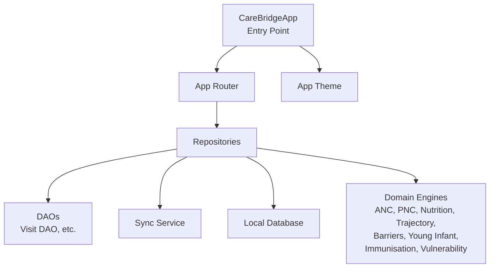
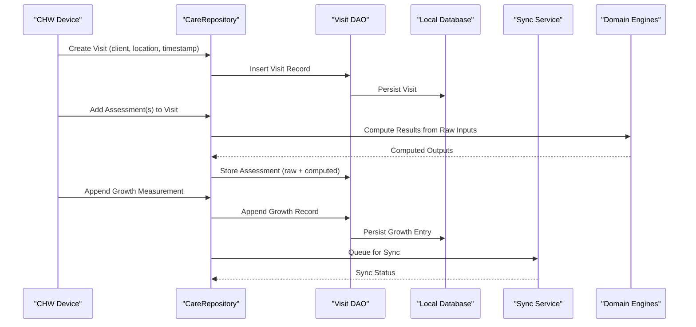
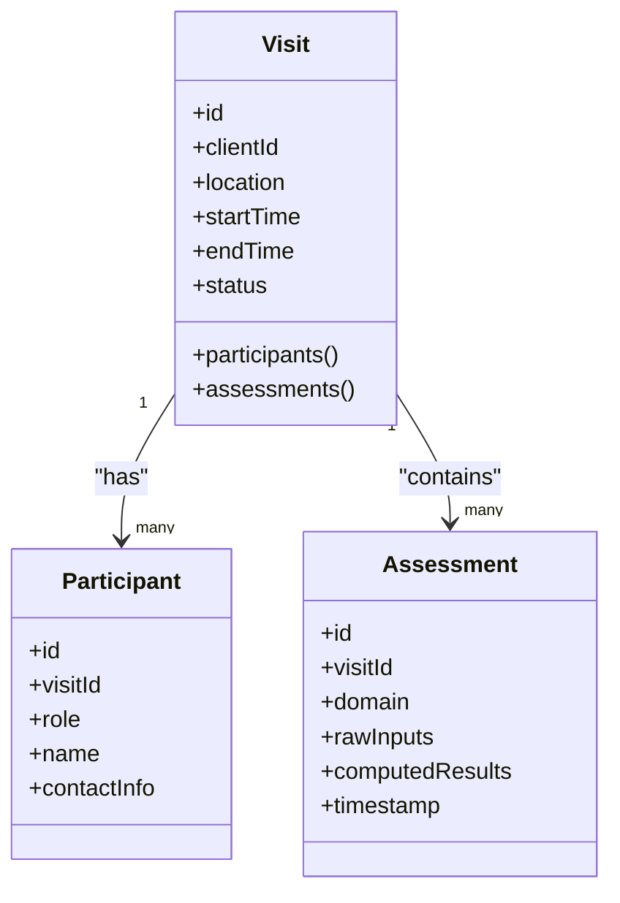
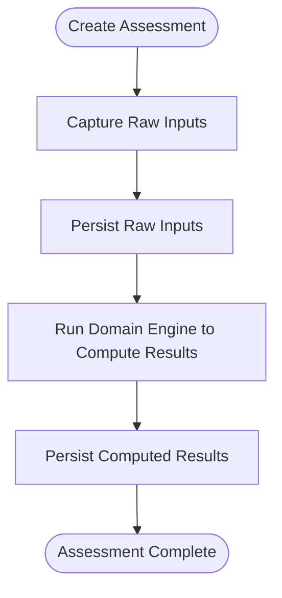
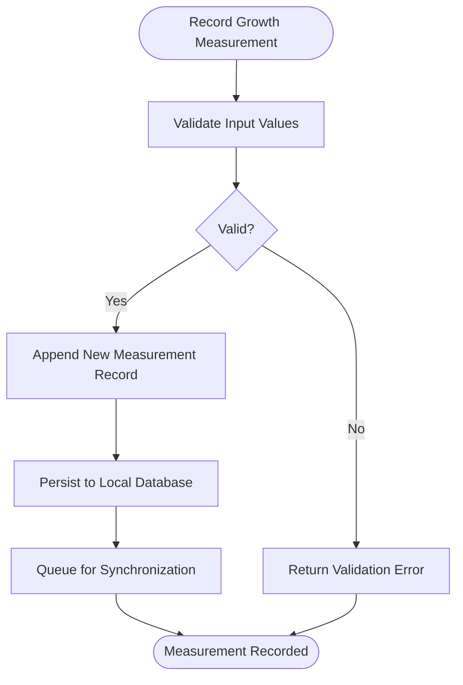
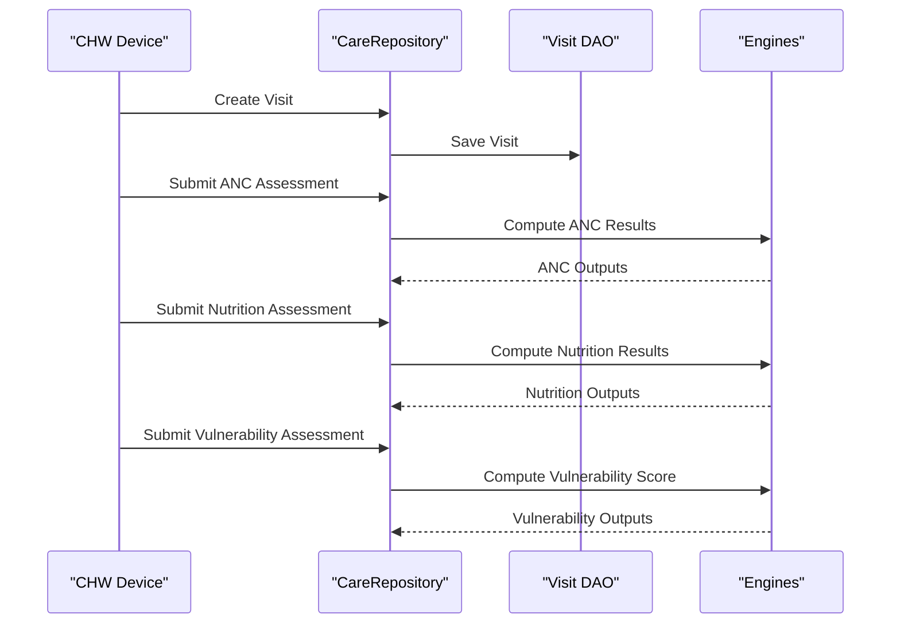
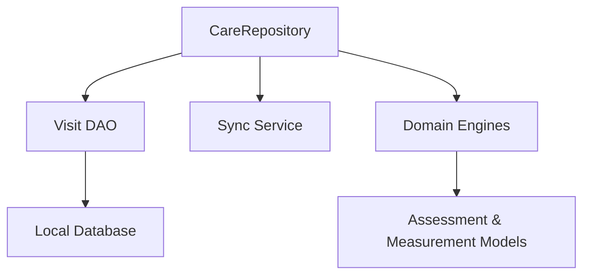

# Clinical Data Models

<cite>
**Referenced Files in This Document**
- [main.dart](file://lib/main.dart)
- [app_database.dart](file://lib/data/local/app_database.dart)
- [visit_dao.dart](file://lib/data/local/visit_dao.dart)
- [care_repository.dart](file://lib/data/repositories/care_repository.dart)
- [sync_service.dart](file://lib/data/sync/sync_service.dart)
- [anc_engine.dart](file://lib/domain/engines/anc_engine.dart)
- [pnc_engine.dart](file://lib/domain/engines/pnc_engine.dart)
- [nutrition_engine.dart](file://lib/domain/engines/nutrition_engine.dart)
- [trajectory_engine.dart](file://lib/domain/engines/trajectory_engine.dart)
- [barrier_engine.dart](file://lib/domain/engines/barrier_engine.dart)
- [young_infant_engine.dart](file://lib/domain/engines/young_infant_engine.dart)
- [immunisation_engine.dart](file://lib/domain/engines/immunisation_engine.dart)
- [vulnerability_engine.dart](file://lib/domain/engines/vulnerability_engine.dart)
</cite>

## Table of Contents
1. [Introduction](#introduction)
2. [Project Structure](#project-structure)
3. [Core Components](#core-components)
4. [Architecture Overview](#architecture-overview)
5. [Detailed Component Analysis](#detailed-component-analysis)
6. [Dependency Analysis](#dependency-analysis)
7. [Performance Considerations](#performance-considerations)
8. [Troubleshooting Guide](#troubleshooting-guide)
9. [Conclusion](#conclusion)

## Introduction
This document explains CareBridge AI’s clinical data models and workflows relevant to community health workers (CHWs). It covers maternal records, birth records, growth measurements, visits, visit participants, and assessments. It emphasizes the append-only design for growth measurements to preserve clinical history integrity, clarifies how a single visit can include multiple client assessments, and describes the assessment data structure that stores both raw inputs and computed results to support re-analysis. It also documents the visit participant tracking system and provides practical examples of CHW workflows and data entry patterns.

## Project Structure
CareBridge AI is a Flutter application organized into layers:
- Presentation layer: UI and routing
- Domain layer: business logic engines for ANC, PNC, nutrition, trajectory, barriers, young infant, immunization, and vulnerability
- Data layer: local database access, repositories, and sync service
- Core: app bootstrap, theme, router, and utilities

The application entry point initializes providers and delegates routing and theming to core modules. The data layer exposes DAOs and repositories that encapsulate persistence and synchronization. Domain engines implement clinical rules and computations over persisted entities.

**Diagram sources**
- [main.dart:16-34](file://lib/main.dart#L16-L34)
- [app_database.dart](file://lib/data/local/app_database.dart)
- [visit_dao.dart](file://lib/data/local/visit_dao.dart)
- [care_repository.dart](file://lib/data/repositories/care_repository.dart)
- [sync_service.dart](file://lib/data/sync/sync_service.dart)
- [anc_engine.dart](file://lib/domain/engines/anc_engine.dart)
- [pnc_engine.dart](file://lib/domain/engines/pnc_engine.dart)
- [nutrition_engine.dart](file://lib/domain/engines/nutrition_engine.dart)
- [trajectory_engine.dart](file://lib/domain/engines/trajectory_engine.dart)
- [barrier_engine.dart](file://lib/domain/engines/barrier_engine.dart)
- [young_infant_engine.dart](file://lib/domain/engines/young_infant_engine.dart)
- [immunisation_engine.dart](file://lib/domain/engines/immunisation_engine.dart)
- [vulnerability_engine.dart](file://lib/domain/engines/vulnerability_engine.dart)

**Section sources**
- [main.dart:16-34](file://lib/main.dart#L16-L34)

## Core Components
- Visit model and Visit DAO: define visit lifecycle, timestamps, location, and relationships to clients and participants; provide CRUD operations for encounters and participant lists.
- Assessment model: captures raw inputs and computed results per encounter, enabling re-analysis without altering historical data.
- Growth measurement model: append-only records linked to a client and visit, preserving complete longitudinal history.
- Maternal and birth records: entities representing pregnancy and delivery events tied to clients and visits.
- Repository layer: aggregates domain entities and coordinates persistence and synchronization.
- Domain engines: implement clinical logic for ANC, PNC, nutrition, trajectory analysis, barrier identification, young infant care, immunization schedules, and vulnerability scoring.

Key responsibilities:
- Visit DAO manages encounter records and participant tracking.
- Repositories expose methods to create visits, add assessments, and record growth measurements.
- Engines compute risk scores, flag anomalies, and generate recommendations based on stored data.

**Section sources**
- [visit_dao.dart](file://lib/data/local/visit_dao.dart)
- [care_repository.dart](file://lib/data/repositories/care_repository.dart)
- [sync_service.dart](file://lib/data/sync/sync_service.dart)
- [anc_engine.dart](file://lib/domain/engines/anc_engine.dart)
- [pnc_engine.dart](file://lib/domain/engines/pnc_engine.dart)
- [nutrition_engine.dart](file://lib/domain/engines/nutrition_engine.dart)
- [trajectory_engine.dart](file://lib/domain/engines/trajectory_engine.dart)
- [barrier_engine.dart](file://lib/domain/engines/barrier_engine.dart)
- [young_infant_engine.dart](file://lib/domain/engines/young_infant_engine.dart)
- [immunisation_engine.dart](file://lib/domain/engines/immunisation_engine.dart)
- [vulnerability_engine.dart](file://lib/domain/engines/vulnerability_engine.dart)

## Architecture Overview
The system follows an offline-first architecture with clear separation between presentation, domain, and data layers. Encounters (visits) are created by CHWs during home visits. Each visit can contain multiple assessments across different domains (e.g., ANC, PNC, nutrition). Growth measurements are appended to maintain a complete history. Assessments store both raw inputs and computed outputs to allow future recalculations as algorithms improve.

**Diagram sources**
- [care_repository.dart](file://lib/data/repositories/care_repository.dart)
- [visit_dao.dart](file://lib/data/local/visit_dao.dart)
- [sync_service.dart](file://lib/data/sync/sync_service.dart)
- [anc_engine.dart](file://lib/domain/engines/anc_engine.dart)
- [pnc_engine.dart](file://lib/domain/engines/pnc_engine.dart)
- [nutrition_engine.dart](file://lib/domain/engines/nutrition_engine.dart)
- [trajectory_engine.dart](file://lib/domain/engines/trajectory_engine.dart)
- [barrier_engine.dart](file://lib/domain/engines/barrier_engine.dart)
- [young_infant_engine.dart](file://lib/domain/engines/young_infant_engine.dart)
- [immunisation_engine.dart](file://lib/domain/engines/immunisation_engine.dart)
- [vulnerability_engine.dart](file://lib/domain/engines/vulnerability_engine.dart)

## Detailed Component Analysis

### Visit Model and Participant Tracking
Visits represent home encounters. They capture metadata such as client identifier, location, start/end times, and status. Participants track who was present during the visit (e.g., CHW, caregiver, family member), enabling accountability and context for assessments.

- Relationships:
  - One visit belongs to one client.
  - One visit can have many participants.
  - One visit can include multiple assessments across domains.

- Data entry pattern:
  - CHW creates a visit upon arrival at a household.
  - CHW adds participants present during the encounter.
  - CHW records assessments for the client within the same visit.

**Diagram sources**
- [visit_dao.dart](file://lib/data/local/visit_dao.dart)
- [care_repository.dart](file://lib/data/repositories/care_repository.dart)

**Section sources**
- [visit_dao.dart](file://lib/data/local/visit_dao.dart)
- [care_repository.dart](file://lib/data/repositories/care_repository.dart)

### Assessment Data Structure: Raw Inputs and Computed Results
Assessments store both raw inputs and computed results to ensure reproducibility and enable re-analysis when algorithms change. For example, an ANC assessment may include measured blood pressure and symptoms (raw inputs) alongside risk classification and recommended actions (computed results).

- Design principles:
  - Immutable historical snapshots: once saved, raw inputs remain unchanged.
  - Separate fields for computed outputs to allow recalculation without altering history.
  - Domain tagging to associate assessments with specific clinical areas (ANC, PNC, nutrition, etc.).

- Re-analysis workflow:
  - When algorithm updates occur, systems can recompute outputs using stored raw inputs.
  - Historical comparisons remain valid because raw data is preserved.

**Diagram sources**
- [anc_engine.dart](file://lib/domain/engines/anc_engine.dart)
- [pnc_engine.dart](file://lib/domain/engines/pnc_engine.dart)
- [nutrition_engine.dart](file://lib/domain/engines/nutrition_engine.dart)
- [barrier_engine.dart](file://lib/domain/engines/barrier_engine.dart)
- [young_infant_engine.dart](file://lib/domain/engines/young_infant_engine.dart)
- [immunisation_engine.dart](file://lib/domain/engines/immunisation_engine.dart)
- [vulnerability_engine.dart](file://lib/domain/engines/vulnerability_engine.dart)

**Section sources**
- [anc_engine.dart](file://lib/domain/engines/anc_engine.dart)
- [pnc_engine.dart](file://lib/domain/engines/pnc_engine.dart)
- [nutrition_engine.dart](file://lib/domain/engines/nutrition_engine.dart)
- [barrier_engine.dart](file://lib/domain/engines/barrier_engine.dart)
- [young_infant_engine.dart](file://lib/domain/engines/young_infant_engine.dart)
- [immunisation_engine.dart](file://lib/domain/engines/immunisation_engine.dart)
- [vulnerability_engine.dart](file://lib/domain/engines/vulnerability_engine.dart)

### Growth Measurements: Append-Only Design
Growth measurements are recorded as append-only entries to preserve complete longitudinal history. Each measurement includes child identifier, visit reference, measurement type (weight, height, head circumference), value, unit, and timestamp.

- Why append-only:
  - Prevents accidental or intentional alteration of historical data.
  - Ensures auditability and traceability for clinical decisions.
  - Supports accurate trend analysis and anomaly detection.

- Data entry pattern:
  - CHW records each measurement during a visit.
  - System appends new entries without modifying previous ones.
  - Aggregations and trends are derived from the full history.

**Diagram sources**
- [visit_dao.dart](file://lib/data/local/visit_dao.dart)
- [care_repository.dart](file://lib/data/repositories/care_repository.dart)
- [sync_service.dart](file://lib/data/sync/sync_service.dart)

**Section sources**
- [visit_dao.dart](file://lib/data/local/visit_dao.dart)
- [care_repository.dart](file://lib/data/repositories/care_repository.dart)
- [sync_service.dart](file://lib/data/sync/sync_service.dart)

### Maternal Records and Birth Records
Maternal records capture pregnancy-related information, including gestational age, complications, and care plan. Birth records document delivery details, newborn condition, and immediate postnatal care. Both are linked to clients and visits to maintain contextual integrity.

- Relationships:
  - Maternal record associated with a client and potentially multiple visits.
  - Birth record associated with a client and a specific visit marking delivery.

- Data entry pattern:
  - CHW updates maternal records during ANC visits.
  - Upon delivery, CHW creates a birth record linked to the current visit.
  - Postnatal assessments follow in subsequent visits.

**Section sources**
- [anc_engine.dart](file://lib/domain/engines/anc_engine.dart)
- [pnc_engine.dart](file://lib/domain/engines/pnc_engine.dart)
- [visit_dao.dart](file://lib/data/local/visit_dao.dart)

### Visit-to-Assessment Relationship in a Single Encounter
A single visit can include multiple assessments across different domains. For example, during one home visit, a CHW might record ANC, nutrition, and vulnerability assessments for the same client. This supports comprehensive care coordination and reduces redundant visits.

- Workflow:
  - CHW creates a visit for the client.
  - CHW selects relevant assessment forms based on client needs.
  - Each assessment is saved under the same visit ID.
  - Computed results are generated per assessment domain.

**Diagram sources**
- [care_repository.dart](file://lib/data/repositories/care_repository.dart)
- [visit_dao.dart](file://lib/data/local/visit_dao.dart)
- [anc_engine.dart](file://lib/domain/engines/anc_engine.dart)
- [nutrition_engine.dart](file://lib/domain/engines/nutrition_engine.dart)
- [vulnerability_engine.dart](file://lib/domain/engines/vulnerability_engine.dart)

**Section sources**
- [care_repository.dart](file://lib/data/repositories/care_repository.dart)
- [visit_dao.dart](file://lib/data/local/visit_dao.dart)
- [anc_engine.dart](file://lib/domain/engines/anc_engine.dart)
- [nutrition_engine.dart](file://lib/domain/engines/nutrition_engine.dart)
- [vulnerability_engine.dart](file://lib/domain/engines/vulnerability_engine.dart)

### CHW Workflows and Data Entry Patterns
Typical CHW workflows include:
- Home visit initiation: CHW logs arrival, selects client, and creates a visit.
- Participant registration: CHW records who was present (caregiver, family members).
- Multi-domain assessments: CHW completes relevant forms (ANC, PNC, nutrition, vulnerability).
- Growth measurement recording: CHW measures and appends growth data for children.
- Synthesis and recommendations: Engines compute results and suggest next steps.
- Offline persistence and sync: Data is stored locally and synchronized when connectivity is available.

These patterns ensure efficient data collection, clinical decision support, and continuity of care.

**Section sources**
- [visit_dao.dart](file://lib/data/local/visit_dao.dart)
- [care_repository.dart](file://lib/data/repositories/care_repository.dart)
- [sync_service.dart](file://lib/data/sync/sync_service.dart)
- [anc_engine.dart](file://lib/domain/engines/anc_engine.dart)
- [pnc_engine.dart](file://lib/domain/engines/pnc_engine.dart)
- [nutrition_engine.dart](file://lib/domain/engines/nutrition_engine.dart)
- [vulnerability_engine.dart](file://lib/domain/engines/vulnerability_engine.dart)

## Dependency Analysis
The repository layer depends on DAOs for persistence and on domain engines for computation. The sync service coordinates data synchronization with remote services. Engines depend on assessment and measurement models to perform calculations.

**Diagram sources**
- [care_repository.dart](file://lib/data/repositories/care_repository.dart)
- [visit_dao.dart](file://lib/data/local/visit_dao.dart)
- [sync_service.dart](file://lib/data/sync/sync_service.dart)
- [anc_engine.dart](file://lib/domain/engines/anc_engine.dart)
- [pnc_engine.dart](file://lib/domain/engines/pnc_engine.dart)
- [nutrition_engine.dart](file://lib/domain/engines/nutrition_engine.dart)
- [trajectory_engine.dart](file://lib/domain/engines/trajectory_engine.dart)
- [barrier_engine.dart](file://lib/domain/engines/barrier_engine.dart)
- [young_infant_engine.dart](file://lib/domain/engines/young_infant_engine.dart)
- [immunisation_engine.dart](file://lib/domain/engines/immunisation_engine.dart)
- [vulnerability_engine.dart](file://lib/domain/engines/vulnerability_engine.dart)

**Section sources**
- [care_repository.dart](file://lib/data/repositories/care_repository.dart)
- [visit_dao.dart](file://lib/data/local/visit_dao.dart)
- [sync_service.dart](file://lib/data/sync/sync_service.dart)

## Performance Considerations
- Offline-first design minimizes network calls and improves responsiveness in low-connectivity environments.
- Append-only growth measurements avoid expensive update operations and simplify conflict resolution.
- Storing raw inputs separately from computed results enables efficient re-analysis without re-capturing data.
- Batch synchronization reduces overhead and improves reliability when connectivity is intermittent.

[No sources needed since this section provides general guidance]

## Troubleshooting Guide
Common issues and resolutions:
- Missing participant records: Ensure all attendees are logged before submitting assessments.
- Incomplete assessments: Validate required fields before saving; engines may fail if inputs are missing.
- Growth measurement errors: Verify units and ranges; invalid values should be rejected at input validation.
- Sync failures: Check connectivity and retry queue; inspect error logs for server-side constraints.

**Section sources**
- [visit_dao.dart](file://lib/data/local/visit_dao.dart)
- [care_repository.dart](file://lib/data/repositories/care_repository.dart)
- [sync_service.dart](file://lib/data/sync/sync_service.dart)

## Conclusion
CareBridge AI’s clinical data models emphasize integrity, reproducibility, and usability for CHWs. The append-only design for growth measurements preserves historical accuracy, while assessments store both raw inputs and computed results to support ongoing analysis. Visits serve as containers for multiple assessments and participant tracking, enabling comprehensive care coordination. The modular architecture separates concerns across presentation, domain, and data layers, facilitating maintenance and extension.

[No sources needed since this section summarizes without analyzing specific files]