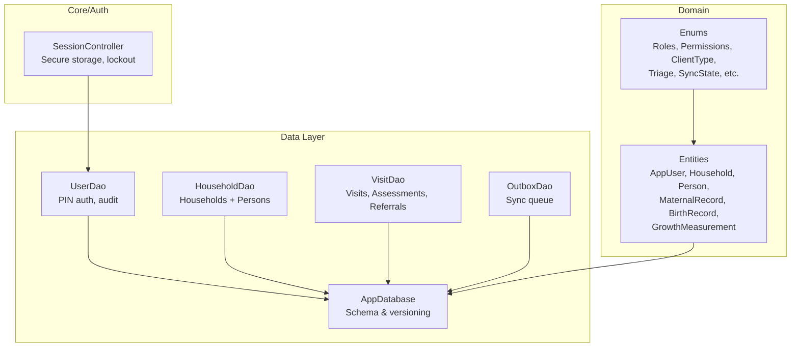
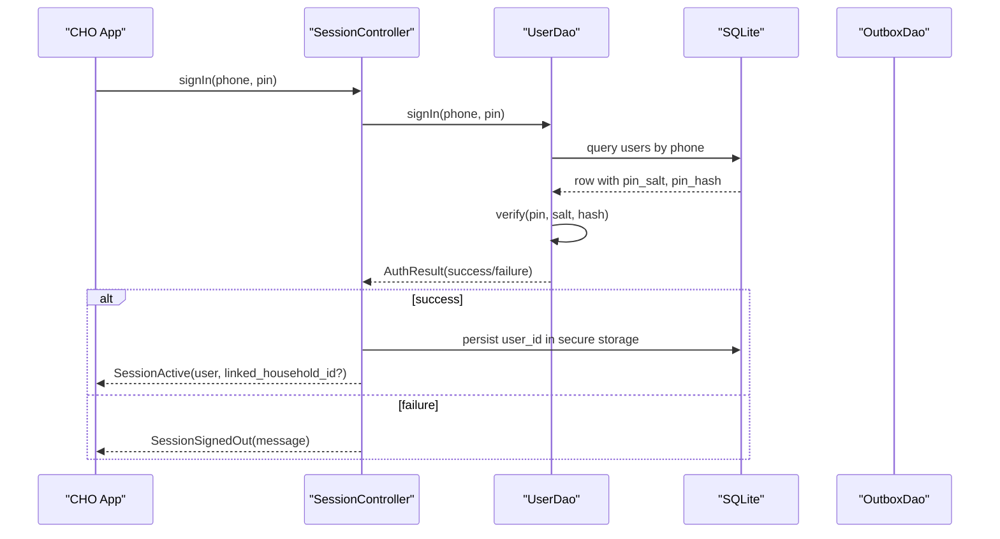
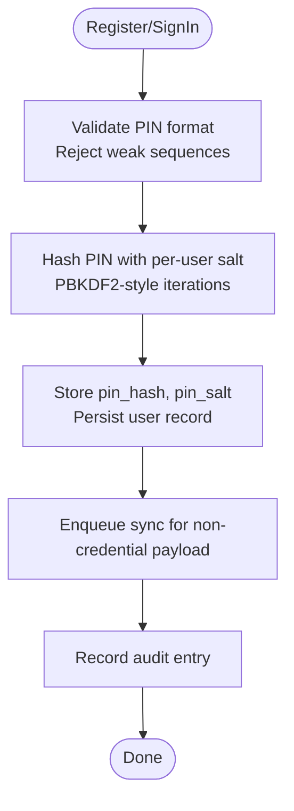
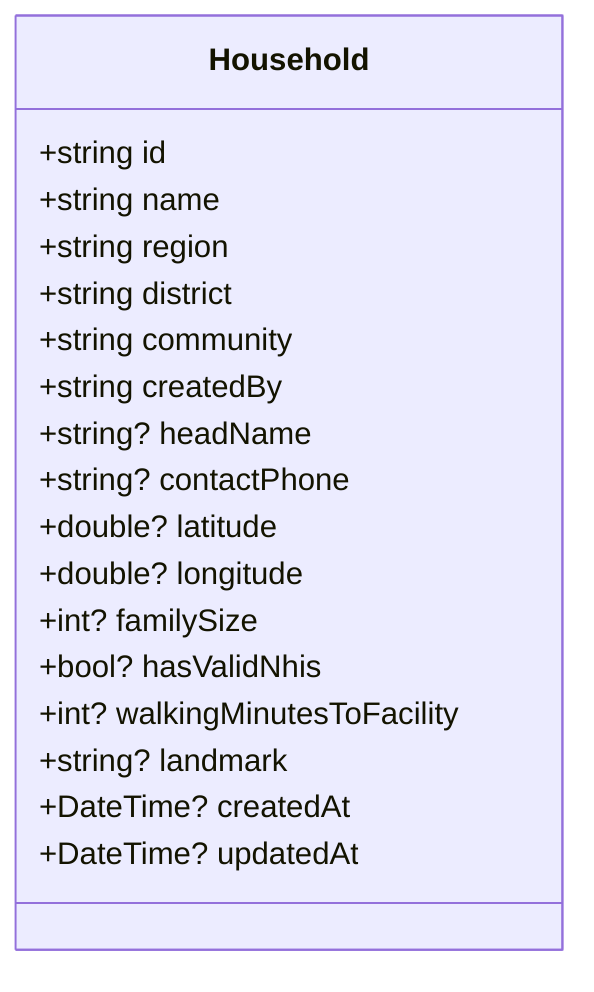
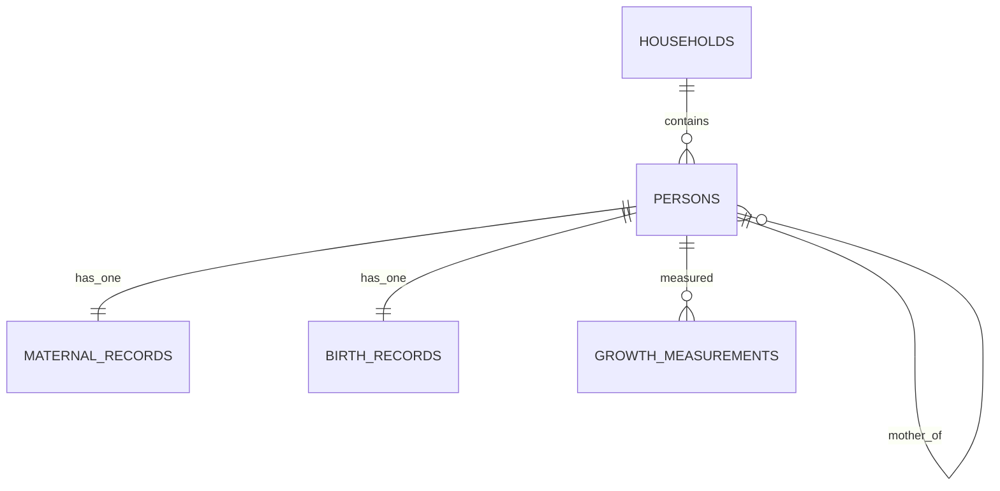
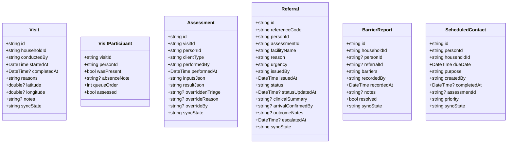
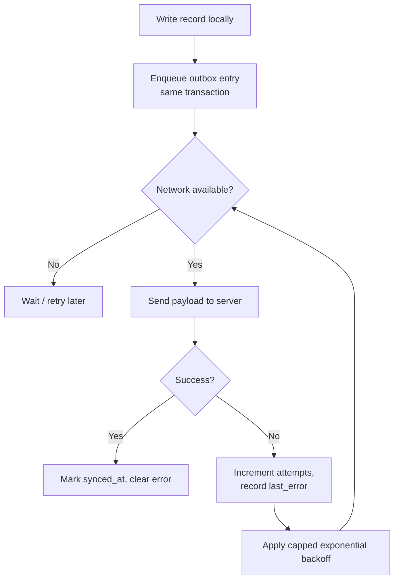
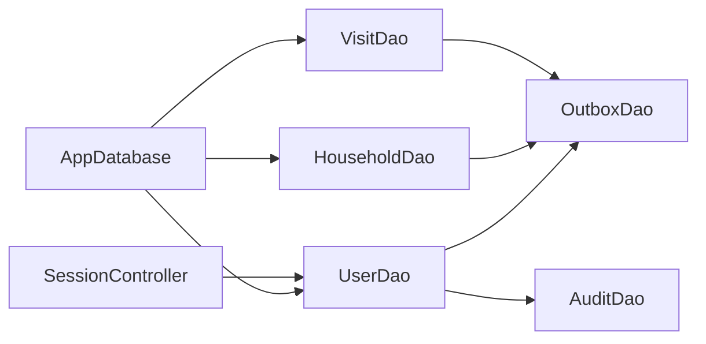

# Core Entities

<cite>
**Referenced Files in This Document**
- [app_database.dart](file://lib/data/local/app_database.dart)
- [user_dao.dart](file://lib/data/local/user_dao.dart)
- [household_dao.dart](file://lib/data/local/household_dao.dart)
- [visit_dao.dart](file://lib/data/local/visit_dao.dart)
- [outbox_dao.dart](file://lib/data/local/outbox_dao.dart)
- [session.dart](file://lib/core/auth/session.dart)
- [core.dart](file://lib/domain/entities/core.dart)
- [enums.dart](file://lib/domain/enums.dart)
</cite>

## Table of Contents
1. Introduction
2. Project Structure
3. Core Components
4. Architecture Overview
5. Detailed Component Analysis
6. Dependency Analysis
7. Performance Considerations
8. Troubleshooting Guide
9. Conclusion

## Introduction
This document explains CareBridge AI’s core database entities and how they form the foundation of an offline-first clinical assessment system for community health. It focuses on users, households, and persons (women, newborns, under-fives), their fields, constraints, and business rules. It also documents PIN-based authentication, household management for community health tracking, person records, primary key strategies, foreign key relationships, indexing patterns optimized for low-connectivity environments, and sample data structures.

## Project Structure
The database schema is defined as hand-written SQL within a single file to ensure reliability and simplicity in low-connectivity settings. DAOs encapsulate all persistence operations and integrate with an outbox mechanism to guarantee that every local write has a corresponding sync intent. Domain entities model the application’s data structures and provide mapping helpers for serialization.

**Diagram sources**
- [app_database.dart:168-173](file://lib/data/local/app_database.dart#L168-L173)
- [user_dao.dart:117-167](file://lib/data/local/user_dao.dart#L117-L167)
- [household_dao.dart:22-41](file://lib/data/local/household_dao.dart#L22-L41)
- [visit_dao.dart:84-102](file://lib/data/local/visit_dao.dart#L84-L102)
- [outbox_dao.dart:160-181](file://lib/data/local/outbox_dao.dart#L160-L181)
- [session.dart:71-112](file://lib/core/auth/session.dart#L71-L112)
- [core.dart:6-97](file://lib/domain/entities/core.dart#L6-L97)
- [enums.dart:10-66](file://lib/domain/enums.dart#L10-L66)

**Section sources**
- [app_database.dart:1-173](file://lib/data/local/app_database.dart#L1-L173)
- [core.dart:1-97](file://lib/domain/entities/core.dart#L1-L97)
- [enums.dart:1-66](file://lib/domain/enums.dart#L1-L66)

## Core Components
- Users: Shared-device accounts with phone-number identity and PIN-based security; role-based permissions; optional linkage to a single household for caregivers.
- Households: The unit of care delivery and risk; includes location metadata, head name, contact, family size, NHIS status, walking time, and landmark.
- Persons: A flat table representing women, newborns, and under-fives; supports mother-child links, estimated DOB flags, and active/inactive lifecycle.
- Maternal and Birth Records: One-to-one extensions for obstetric history and birth facts that drive ANC/PNC and young-infant risk models.
- Growth Measurements: Append-only anthropometric series enabling trajectory analysis and malnutrition detection.
- Visits, Assessments, Referrals, Barriers, Scheduled Contacts: Clinical event log capturing encounters, decisions, follow-ups, and barriers.
- Outbox and Audit: Offline-first guarantees via atomic transactions and an outbox queue; comprehensive audit trail for governance and safety.

**Section sources**
- [app_database.dart:194-556](file://lib/data/local/app_database.dart#L194-L556)
- [core.dart:99-697](file://lib/domain/entities/core.dart#L99-L697)
- [enums.dart:68-391](file://lib/domain/enums.dart#L68-L391)

## Architecture Overview
CareBridge AI uses SQLite as the source of truth with synchronous local writes and an outbox queue for eventual consistency. Foreign keys are enforced, soft deletes are used for historical integrity, and indexes are tailored to field queries. Authentication is PIN-based with per-user salt and hashing, and session state is persisted securely.

**Diagram sources**
- [session.dart:114-162](file://lib/core/auth/session.dart#L114-L162)
- [user_dao.dart:169-216](file://lib/data/local/user_dao.dart#L169-L216)
- [app_database.dart:194-221](file://lib/data/local/app_database.dart#L194-L221)

## Detailed Component Analysis

### Users Table and PIN-Based Authentication
- Primary Key: id (TEXT)
- Identity: phone (unique index), full_name, role, region, district, community
- Optional: chps_zone, facility_name, staff_id
- Preferences: preferred_language (default English)
- Security: pin_hash, pin_salt (per-user salted PBKDF2-style HMAC-SHA256)
- Linkage: linked_household_id (for caregiver scoping)
- Timestamps: created_at
- Indexes: idx_users_phone (unique) enforces unique login per device

Business Rules:
- Phone is the login identifier; uniqueness enforced at DB level.
- PIN validation rejects trivial sequences and repeated digits.
- Every permission denial and sign-in attempt is audited.
- Caregiver accounts can be scoped to exactly one household at creation.

Authentication Flow:
- Register: create or replace account, store hashed PIN and salt, enqueue sync for non-credential payload.
- Sign In: lookup by phone, verify PIN using constant-time comparison, record audit entry, return user.
- Change PIN: validate current PIN, generate new salt/hash, update record, audit change.

**Diagram sources**
- [user_dao.dart:125-167](file://lib/data/local/user_dao.dart#L125-L167)
- [user_dao.dart:169-216](file://lib/data/local/user_dao.dart#L169-L216)
- [user_dao.dart:294-326](file://lib/data/local/user_dao.dart#L294-L326)
- [app_database.dart:200-221](file://lib/data/local/app_database.dart#L200-L221)

**Section sources**
- [app_database.dart:200-221](file://lib/data/local/app_database.dart#L200-L221)
- [user_dao.dart:44-93](file://lib/data/local/user_dao.dart#L44-L93)
- [user_dao.dart:117-167](file://lib/data/local/user_dao.dart#L117-L167)
- [user_dao.dart:169-216](file://lib/data/local/user_dao.dart#L169-L216)
- [user_dao.dart:294-326](file://lib/data/local/user_dao.dart#L294-L326)
- [session.dart:71-112](file://lib/core/auth/session.dart#L71-L112)

### Households Table
- Primary Key: id (TEXT)
- Fields: name, region, district, community, created_by, head_name, contact_phone, latitude, longitude, family_size, has_valid_nhis, walking_minutes_to_facility, landmark
- Timestamps: created_at, updated_at
- Indexes: idx_households_community (region, district, community), idx_households_created_by

Business Rules:
- Household is the unit of care and shared risk.
- Landmark and walking time support route planning and referral feasibility.
- NHIS validity predicts access barriers.

Common Operations:
- Upsert with conflict resolution and outbox enqueue.
- Zone/caseload queries filtered by region/district/community and worker scope.
- Search across name, head, community, landmark.

**Diagram sources**
- [core.dart:102-222](file://lib/domain/entities/core.dart#L102-L222)
- [app_database.dart:227-249](file://lib/data/local/app_database.dart#L227-L249)

**Section sources**
- [app_database.dart:227-249](file://lib/data/local/app_database.dart#L227-L249)
- [household_dao.dart:22-162](file://lib/data/local/household_dao.dart#L22-L162)
- [core.dart:102-222](file://lib/domain/entities/core.dart#L102-L222)

### Persons Table and Related Records
- Primary Key: id (TEXT)
- Fields: household_id (FK), full_name, client_type, sex, date_of_birth, age_years_approx, phone, mother_id (self FK), is_dob_estimated, nhis_number
- Lifecycle: is_active (soft delete), timestamps created_at, updated_at
- Indexes: idx_persons_household (household_id, is_active), idx_persons_mother (mother_id), idx_persons_type (client_type, is_active)

Business Rules:
- Flat person model simplifies roll call across women, newborns, and under-fives.
- Mother-child link enables maternal history in child assessments.
- Estimated DOB flag reduces confidence in age-dependent recommendations.
- Soft deletes preserve history for safety and statistics.

Related Tables:
- MaternalRecords (person_id PK/FK): obstetric history aligned with national record book fields.
- BirthRecords (person_id PK/FK): fixed-at-birth facts driving young-infant risk.
- GrowthMeasurements (id PK, person_id FK): append-only series for trajectory analysis.

**Diagram sources**
- [app_database.dart:256-356](file://lib/data/local/app_database.dart#L256-L356)
- [core.dart:224-378](file://lib/domain/entities/core.dart#L224-L378)

**Section sources**
- [app_database.dart:256-356](file://lib/data/local/app_database.dart#L256-L356)
- [household_dao.dart:164-413](file://lib/data/local/household_dao.dart#L164-L413)
- [core.dart:224-378](file://lib/domain/entities/core.dart#L224-L378)

### Visits, Assessments, Referrals, Barriers, Scheduled Contacts
- Visits: encounter container with household, worker, timestamps, reasons, GPS, notes, sync_state.
- VisitParticipants: roll call per visit (who present/absent, assessed flag).
- Assessments: raw inputs and results, triage verdicts, overrides, sync_state.
- Referrals: reference code, urgency, status lifecycle, escalation, arrival confirmation.
- BarrierReports: why care did not happen, resolved flag, recorded_at.
- ScheduledContacts: due dates, purpose, priority, completion.

Indexes:
- visits: household, worker-date ordering.
- assessments: person-date, visit, override triage.
- referrals: unique reference_code, status-date, person-date.
- barrier_reports: household-date, date.
- scheduled_contacts: completed_date-due_date, person-due_date.

**Diagram sources**
- [app_database.dart:362-506](file://lib/data/local/app_database.dart#L362-L506)
- [visit_dao.dart:84-102](file://lib/data/local/visit_dao.dart#L84-L102)

**Section sources**
- [app_database.dart:362-506](file://lib/data/local/app_database.dart#L362-L506)
- [visit_dao.dart:84-800](file://lib/data/local/visit_dao.dart#L84-L800)

### Offline-First Sync Outbox and Audit
- Outbox: entity_table, entity_id, operation, payload_json, priority, queued_at, attempts, last_attempt_at, last_error, synced_at.
- Priority-driven ordering ensures urgent referrals leave before routine registrations.
- Exponential backoff with cap prevents battery drain and silent failures.
- AuditLog: actor_id, actor_role, action, entity_table, entity_id, outcome, detail, occurred_at.

**Diagram sources**
- [outbox_dao.dart:160-181](file://lib/data/local/outbox_dao.dart#L160-L181)
- [outbox_dao.dart:220-238](file://lib/data/local/outbox_dao.dart#L220-L238)
- [app_database.dart:515-534](file://lib/data/local/app_database.dart#L515-L534)

**Section sources**
- [outbox_dao.dart:1-277](file://lib/data/local/outbox_dao.dart#L1-L277)
- [app_database.dart:515-556](file://lib/data/local/app_database.dart#L515-L556)

## Dependency Analysis
- AppDatabase centralizes schema and versioning; DAOs depend on it for transactions and queries.
- UserDao integrates with OutboxDao for sync and AuditDao for governance.
- HouseholdDao and PersonDao manage core entities and related tables; they enqueue outbox entries for updates.
- VisitDao orchestrates multi-entity writes (visits, participants, assessments, referrals) atomically.
- SessionController persists signed-in user identity securely and enforces lockout policies.

**Diagram sources**
- [app_database.dart:168-173](file://lib/data/local/app_database.dart#L168-L173)
- [user_dao.dart:117-167](file://lib/data/local/user_dao.dart#L117-L167)
- [household_dao.dart:22-41](file://lib/data/local/household_dao.dart#L22-L41)
- [visit_dao.dart:84-102](file://lib/data/local/visit_dao.dart#L84-L102)
- [outbox_dao.dart:160-181](file://lib/data/local/outbox_dao.dart#L160-L181)
- [session.dart:71-112](file://lib/core/auth/session.dart#L71-L112)

**Section sources**
- [app_database.dart:168-173](file://lib/data/local/app_database.dart#L168-L173)
- [user_dao.dart:117-167](file://lib/data/local/user_dao.dart#L117-L167)
- [household_dao.dart:22-41](file://lib/data/local/household_dao.dart#L22-L41)
- [visit_dao.dart:84-102](file://lib/data/local/visit_dao.dart#L84-L102)
- [outbox_dao.dart:160-181](file://lib/data/local/outbox_dao.dart#L160-L181)
- [session.dart:71-112](file://lib/core/auth/session.dart#L71-L112)

## Performance Considerations
- Hand-written SQL avoids codegen overhead and keeps schema readable and maintainable.
- Foreign keys enforced to prevent orphaned records and skewed counts.
- Indexes tailored to frequent queries: zone lists, worker caseloads, person roll calls, growth series, assessments by person/visit, referrals by status/code, barriers by household/date, scheduled contacts by due/completion.
- Append-only growth measurements preserve trajectory integrity and avoid expensive in-place updates.
- Outbox prioritization ensures critical items transmit first during brief connectivity windows.
- Soft deletes maintain historical continuity without costly joins or deletions.

[No sources needed since this section provides general guidance]

## Troubleshooting Guide
- PIN issues: Ensure PIN meets format and complexity rules; verify per-user salt/hash exist; check audit logs for sign-in denials.
- Sync failures: Inspect outbox failing entries; review last_error and attempts; reset attempts after resolving network/server issues.
- Missing records: Confirm outbox enqueue occurs in same transaction as record write; verify foreign key constraints and cascades.
- Lockouts: In-memory lockout resets on app restart; sign-out clears state; audit logs capture denied actions.

**Section sources**
- [user_dao.dart:169-216](file://lib/data/local/user_dao.dart#L169-L216)
- [outbox_dao.dart:220-249](file://lib/data/local/outbox_dao.dart#L220-L249)
- [session.dart:114-162](file://lib/core/auth/session.dart#L114-L162)

## Conclusion
CareBridge AI’s core entities—users, households, and persons—form a robust, offline-first foundation for community health workflows. PIN-based authentication secures shared devices, while careful indexing, append-only histories, and an outbox queue ensure reliable performance and data integrity in low-connectivity settings. The design balances clinical rigor with practical field needs, enabling accurate assessments, safe referrals, and actionable insights.

[No sources needed since this section summarizes without analyzing specific files]