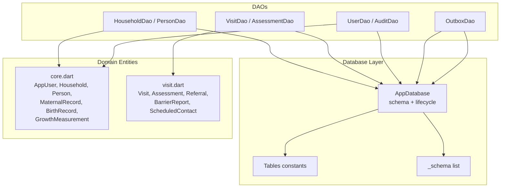
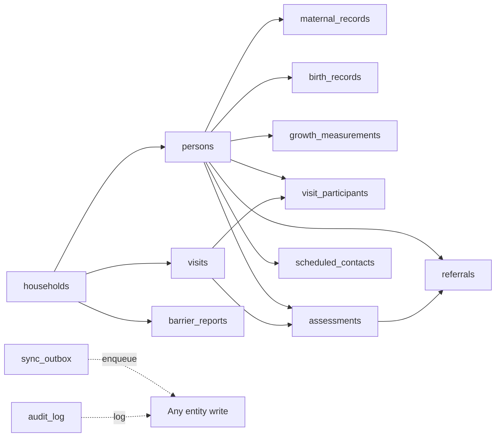

# Database Schema Design

<cite>
**Referenced Files in This Document**
- [app_database.dart](file://lib/data/local/app_database.dart)
- [household_dao.dart](file://lib/data/local/household_dao.dart)
- [visit_dao.dart](file://lib/data/local/visit_dao.dart)
- [user_dao.dart](file://lib/data/local/user_dao.dart)
- [outbox_dao.dart](file://lib/data/local/outbox_dao.dart)
- [core.dart](file://lib/domain/entities/core.dart)
- [visit.dart](file://lib/domain/entities/visit.dart)
</cite>

## Table of Contents
1. [Introduction](#introduction)
2. [Project Structure](#project-structure)
3. [Core Components](#core-components)
4. [Architecture Overview](#architecture-overview)
5. [Detailed Component Analysis](#detailed-component-analysis)
6. [Dependency Analysis](#dependency-analysis)
7. [Performance Considerations](#performance-considerations)
8. [Troubleshooting Guide](#troubleshooting-guide)
9. [Conclusion](#conclusion)
10. [Appendices](#appendices)

## Introduction
This document provides comprehensive database schema documentation for CareBridge AI’s SQLite implementation. It details the 14 interconnected tables, including household, person, visit, assessment, referral, and user entities. It explains primary and foreign key relationships, constraints, indexes, data validation rules, business constraints, referential integrity policies, migration strategies, version management, schema evolution patterns, data retention and archival mechanisms, backup procedures, sample queries, and optimization techniques for offline-first scenarios.

The design emphasizes:
- Offline-first with SQLite as the source of truth
- Append-only clinical history (e.g., growth measurements and assessments)
- Robust sync outbox ensuring every local write has a corresponding sync intent
- Strong referential integrity via foreign keys
- Performance-oriented indexing tailored to field workflows

## Project Structure
The database layer is implemented in Dart using sqflite with hand-written SQL and DAOs that encapsulate table operations. The schema is defined centrally and created on first run or upgrade.



**Diagram sources**
- [app_database.dart:168-172](file://lib/data/local/app_database.dart#L168-L172)
- [app_database.dart:177-192](file://lib/data/local/app_database.dart#L177-L192)
- [household_dao.dart:23-41](file://lib/data/local/household_dao.dart#L23-L41)
- [visit_dao.dart:234-271](file://lib/data/local/visit_dao.dart#L234-L271)
- [user_dao.dart:125-167](file://lib/data/local/user_dao.dart#L125-L167)
- [outbox_dao.dart:160-181](file://lib/data/local/outbox_dao.dart#L160-L181)
- [core.dart:102-170](file://lib/domain/entities/core.dart#L102-L170)
- [visit.dart:9-91](file://lib/domain/entities/visit.dart#L9-L91)

**Section sources**
- [app_database.dart:1-173](file://lib/data/local/app_database.dart#L1-L173)
- [app_database.dart:175-192](file://lib/data/local/app_database.dart#L175-L192)

## Core Components
- AppDatabase: Singleton managing database lifecycle, configuration (foreign keys enabled), creation, and upgrades. Versioned by kDatabaseVersion.
- Tables: Centralized table name constants to avoid runtime typos.
- _schema: List of CREATE TABLE statements and indexes executed at onCreate.
- DAOs: Data access objects for each entity area (households/persons, visits/assessments, users/audit, outbox).
- Domain entities: Model classes mapping to rows, providing serialization/deserialization and derived fields.

Key behaviors:
- Foreign keys enforced globally via PRAGMA.
- All writes enqueue an outbox entry within the same transaction.
- Soft deletes used for persons (is_active flag).
- Append-only for growth measurements and assessments.

**Section sources**
- [app_database.dart:37-42](file://lib/data/local/app_database.dart#L37-L42)
- [app_database.dart:90-103](file://lib/data/local/app_database.dart#L90-L103)
- [app_database.dart:168-172](file://lib/data/local/app_database.dart#L168-L172)
- [household_dao.dart:23-41](file://lib/data/local/household_dao.dart#L23-L41)
- [outbox_dao.dart:160-181](file://lib/data/local/outbox_dao.dart#L160-L181)

## Architecture Overview
The schema centers around households and persons, with clinical encounters (visits) linking to assessments, referrals, barrier reports, and scheduled contacts. Sync and audit are cross-cutting concerns.

```mermaid
erDiagram
USERS {
TEXT id PK
TEXT full_name
TEXT phone UK
TEXT role
TEXT region
TEXT district
TEXT community
TEXT chps_zone
TEXT facility_name
TEXT staff_id
TEXT preferred_language
TEXT pin_hash
TEXT pin_salt
TEXT linked_household_id
TEXT created_at
}
HOUSEHOLDS {
TEXT id PK
TEXT name
TEXT region
TEXT district
TEXT community
TEXT created_by
TEXT head_name
TEXT contact_phone
REAL latitude
REAL longitude
INTEGER family_size
INTEGER has_valid_nhis
INTEGER walking_minutes_to_facility
TEXT landmark
TEXT created_at
TEXT updated_at
}
PERSONS {
TEXT id PK
TEXT household_id FK
TEXT full_name
TEXT client_type
TEXT sex
TEXT date_of_birth
INTEGER age_years_approx
TEXT phone
TEXT mother_id FK
INTEGER is_dob_estimated
TEXT nhis_number
TEXT created_at
TEXT updated_at
INTEGER is_active
}
MATERNAL_RECORDS {
TEXT person_id PK,FK
INTEGER gravida
INTEGER parity
INTEGER previous_losses
INTEGER previous_caesarean
TEXT last_menstrual_period
TEXT expected_delivery_date
INTEGER anc_contacts_completed
INTEGER iptp_doses
INTEGER td_doses
INTEGER iron_folate_supplied
INTEGER llin_supplied
REAL haemoglobin
TEXT blood_group
TEXT sickling_status
INTEGER hiv_tested
TEXT delivery_date
TEXT delivery_place
TEXT delivery_mode
TEXT plurality
TEXT family_planning_method
TEXT updated_at
}
BIRTH_RECORDS {
TEXT person_id PK,FK
REAL birth_weight_kg
INTEGER gestation_weeks_at_birth
TEXT delivery_place
TEXT delivery_mode
TEXT plurality
INTEGER birth_order
INTEGER resuscitation_needed
INTEGER cord_care_given
INTEGER vitamin_k_given
INTEGER breastfed_within_one_hour
TEXT updated_at
}
GROWTH_MEASUREMENTS {
TEXT id PK
TEXT person_id FK
TEXT taken_at
REAL muac_cm
REAL weight_kg
REAL height_cm
INTEGER has_bilateral_oedema
TEXT recorded_by
}
VISITS {
TEXT id PK
TEXT household_id FK
TEXT conducted_by
TEXT started_at
TEXT completed_at
TEXT reasons
REAL latitude
REAL longitude
TEXT notes
TEXT sync_state
}
VISIT_PARTICIPANTS {
TEXT visit_id FK
TEXT person_id FK
INTEGER was_present
TEXT absence_note
INTEGER queue_order
INTEGER assessed
PRIMARY KEY(visit_id, person_id)
}
ASSESSMENTS {
TEXT id PK
TEXT visit_id FK
TEXT person_id FK
TEXT client_type
TEXT performed_by
TEXT performed_at
TEXT inputs_json
TEXT result_json
TEXT overridden_triage
TEXT override_reason
TEXT override_by
TEXT sync_state
}
REFERRALS {
TEXT id PK
TEXT reference_code UK
TEXT person_id FK
TEXT assessment_id
TEXT facility_name
TEXT reason
TEXT urgency
TEXT issued_by
TEXT issued_at
TEXT status
TEXT status_updated_at
TEXT clinical_summary
TEXT arrival_confirmed_by
TEXT outcome_notes
TEXT escalated_at
TEXT sync_state
}
BARRIER_REPORTS {
TEXT id PK
TEXT household_id FK
TEXT person_id
TEXT referral_id
TEXT barriers
TEXT recorded_by
TEXT recorded_at
TEXT notes
INTEGER resolved
TEXT sync_state
}
SCHEDULED_CONTACTS {
TEXT id PK
TEXT person_id FK
TEXT household_id FK
TEXT due_date
TEXT purpose
TEXT created_by
TEXT completed_at
TEXT assessment_id
TEXT priority
TEXT sync_state
}
SYNC_OUTBOX {
INTEGER id PK
TEXT entity_table
TEXT entity_id
TEXT operation
TEXT payload_json
INTEGER priority
TEXT queued_at
INTEGER attempts
TEXT last_attempt_at
TEXT last_error
TEXT synced_at
}
AUDIT_LOG {
INTEGER id PK
TEXT actor_id
TEXT actor_role
TEXT action
TEXT entity_table
TEXT entity_id
TEXT outcome
TEXT detail
TEXT occurred_at
}
PERSONS ||--o{ MATERNAL_RECORDS : "person_id"
PERSONS ||--o{ BIRTH_RECORDS : "person_id"
PERSONS ||--o{ GROWTH_MEASUREMENTS : "person_id"
PERSONS ||--o{ VISIT_PARTICIPANTS : "person_id"
PERSONS ||--o{ ASSESSMENTS : "person_id"
PERSONS ||--o{ REFERRALS : "person_id"
PERSONS ||--o{ SCHEDULED_CONTACTS : "person_id"
HOUSEHOLDS ||--o{ PERSONS : "household_id"
HOUSEHOLDS ||--o{ VISITS : "household_id"
HOUSEHOLDS ||--o{ BARRIER_REPORTS : "household_id"
HOUSEHOLDS ||--o{ SCHEDULED_CONTACTS : "household_id"
VISITS ||--o{ VISIT_PARTICIPANTS : "visit_id"
VISITS ||--o{ ASSESSMENTS : "visit_id"
ASSESSMENTS ||--o{ REFERRALS : "assessment_id"
```

**Diagram sources**
- [app_database.dart:194-555](file://lib/data/local/app_database.dart#L194-L555)

## Detailed Component Analysis

### Users and Authentication
- Table: users
- Primary key: id
- Unique index: phone
- Constraints: NOT NULL on core identity fields; PIN stored as salted hash; optional linked_household_id for caregiver scoping
- Indexes: idx_users_phone
- Business rules:
  - Multiple accounts per device supported
  - PIN policy enforced (length, complexity)
  - Audit logging for sign-in outcomes and account changes

Sample queries:
- Sign-in by phone: SELECT * FROM users WHERE phone = ? LIMIT 1
- Link caregiver to household: UPDATE users SET linked_household_id = ? WHERE id = ?

Optimization:
- Phone lookup uses unique index
- Audit log indexed by time and actor for quick retrieval

**Section sources**
- [app_database.dart:200-221](file://lib/data/local/app_database.dart#L200-L221)
- [user_dao.dart:125-167](file://lib/data/local/user_dao.dart#L125-L167)
- [user_dao.dart:169-216](file://lib/data/local/user_dao.dart#L169-L216)
- [user_dao.dart:294-326](file://lib/data/local/user_dao.dart#L294-L326)

### Households
- Table: households
- Primary key: id
- Indexes: idx_households_community (region, district, community), idx_households_created_by
- Business rules:
  - Geographic grouping supports zone-based planning
  - Optional GPS coordinates and landmark text for wayfinding
  - NHIS validity and walking time inform risk and referral feasibility

Sample queries:
- Zone listing: SELECT * FROM households WHERE region = ? AND district = ? AND community = ? ORDER BY community, name
- Caseload for worker: SELECT * FROM households WHERE created_by = ? OR (region = ? AND district = ?)

Optimization:
- Composite index accelerates community-scoped lists
- Worker caseload query leverages created_by index

**Section sources**
- [app_database.dart:227-249](file://lib/data/local/app_database.dart#L227-L249)
- [household_dao.dart:56-103](file://lib/data/local/household_dao.dart#L56-L103)

### Persons
- Table: persons
- Primary key: id
- Foreign keys: household_id -> households(id) ON DELETE CASCADE; mother_id -> persons(id) ON DELETE SET NULL
- Indexes: idx_persons_household (household_id, is_active), idx_persons_mother (mother_id), idx_persons_type (client_type, is_active)
- Business rules:
  - Flat model for women, newborns, under-fives
  - Soft delete via is_active
  - Mother-child linkage supports maternal history in child assessments

Sample queries:
- Active children in household: SELECT * FROM persons WHERE household_id = ? AND is_active = 1 ORDER BY client_type, date_of_birth
- Children of mother: SELECT * FROM persons WHERE mother_id = ? AND is_active = 1 ORDER BY date_of_birth DESC

Optimization:
- Composite index supports active-person filtering and sorting
- Mother index speeds sibling lookups

**Section sources**
- [app_database.dart:256-280](file://lib/data/local/app_database.dart#L256-L280)
- [household_dao.dart:294-349](file://lib/data/local/household_dao.dart#L294-L349)

### Maternal Records
- Table: maternal_records
- Primary key: person_id (also FK to persons(id) ON DELETE CASCADE)
- Business rules: Mirrors Ghana’s Maternal Health Record Book fields; ANC/PNC tracking; delivery metadata

Sample queries:
- Pregnant women: SELECT * FROM maternal_records WHERE delivery_date IS NULL AND last_menstrual_period IS NOT NULL
- Postpartum window: SELECT * FROM maternal_records WHERE delivery_date IS NOT NULL AND delivery_date >= ?

Optimization:
- Single-row per woman simplifies lookups

**Section sources**
- [app_database.dart:286-312](file://lib/data/local/app_database.dart#L286-L312)
- [household_dao.dart:415-476](file://lib/data/local/household_dao.dart#L415-L476)

### Birth Records
- Table: birth_records
- Primary key: person_id (FK to persons(id) ON DELETE CASCADE)
- Business rules: Fixed-at-birth facts drive young-infant risk model

Sample queries:
- For multiple newborns: SELECT * FROM birth_records WHERE person_id IN (?, ?, ...)

Optimization:
- Direct person_id lookup

**Section sources**
- [app_database.dart:319-335](file://lib/data/local/app_database.dart#L319-L335)
- [household_dao.dart:478-528](file://lib/data/local/household_dao.dart#L478-L528)

### Growth Measurements
- Table: growth_measurements
- Primary key: id
- Foreign key: person_id -> persons(id) ON DELETE CASCADE
- Index: idx_growth_person_date (person_id, taken_at DESC)
- Business rules: Append-only series; latest and historical series required for trajectory analysis

Sample queries:
- Series oldest first: SELECT * FROM growth_measurements WHERE person_id = ? ORDER BY taken_at ASC
- Latest measurement: SELECT * FROM growth_measurements WHERE person_id = ? ORDER BY taken_at DESC LIMIT 1

Optimization:
- Composite index supports both series and latest queries efficiently

**Section sources**
- [app_database.dart:342-356](file://lib/data/local/app_database.dart#L342-L356)
- [household_dao.dart:530-598](file://lib/data/local/household_dao.dart#L530-L598)

### Visits and Visit Participants
- Table: visits
- Primary key: id
- Foreign key: household_id -> households(id) ON DELETE CASCADE
- Indexes: idx_visits_household (household_id, started_at DESC), idx_visits_worker_date (conducted_by, started_at DESC)
- Table: visit_participants
- Primary key: composite (visit_id, person_id)
- Foreign keys: visit_id -> visits(id) ON DELETE CASCADE; person_id -> persons(id) ON DELETE CASCADE
- Business rules: One encounter can include multiple clients; presence and absence captured even if assessment skipped

Sample queries:
- Visit history for household: SELECT * FROM visits WHERE household_id = ? ORDER BY started_at DESC
- Recent absentees: SELECT vp.* FROM visit_participants vp JOIN visits v ON v.id = vp.visit_id WHERE vp.was_present = 0 AND v.started_at >= ? ORDER BY v.started_at DESC

Optimization:
- Composite indexes support common ordering and filtering

**Section sources**
- [app_database.dart:361-377](file://lib/data/local/app_database.dart#L361-L377)
- [app_database.dart:385-397](file://lib/data/local/app_database.dart#L385-L397)
- [visit_dao.dart:234-271](file://lib/data/local/visit_dao.dart#L234-L271)

### Assessments
- Table: assessments
- Primary key: id
- Foreign keys: visit_id -> visits(id) ON DELETE CASCADE; person_id -> persons(id) ON DELETE CASCADE
- Indexes: idx_assessments_person (person_id, performed_at DESC), idx_assessments_visit (visit_id), idx_assessments_overrides (overridden_triage)
- Business rules: Stores raw inputs and results; supports clinician overrides; append-only nature preserves history

Sample queries:
- By person timeline: SELECT * FROM assessments WHERE person_id = ? ORDER BY performed_at DESC
- Overrides for model training: SELECT * FROM assessments WHERE overridden_triage IS NOT NULL

Optimization:
- Person-time index supports timelines; override index isolates training signals

**Section sources**
- [app_database.dart:404-427](file://lib/data/local/app_database.dart#L404-L427)

### Referrals
- Table: referrals
- Primary key: id
- Unique index: idx_referrals_code (reference_code)
- Indexes: idx_referrals_status (status, issued_at DESC), idx_referrals_person (person_id, issued_at DESC)
- Business rules: Verifiable arrival loop; escalation when urgent referrals remain unconfirmed beyond threshold

Sample queries:
- Pending urgent: SELECT * FROM referrals WHERE status = 'issued' AND urgency IN ('immediate','sameDay') ORDER BY issued_at DESC
- Escalation candidates: SELECT * FROM referrals WHERE status = 'issued' AND hours_open >= 48 AND urgency IN ('immediate','sameDay')

Optimization:
- Status+time index supports dashboards and escalations

**Section sources**
- [app_database.dart:433-458](file://lib/data/local/app_database.dart#L433-L458)
- [visit.dart:418-545](file://lib/domain/entities/visit.dart#L418-L545)

### Barrier Reports
- Table: barrier_reports
- Primary key: id
- Foreign key: household_id -> households(id) ON DELETE CASCADE
- Indexes: idx_barriers_household (household_id, recorded_at DESC), idx_barriers_date (recorded_at DESC)
- Business rules: Captures why care did not happen; supports pattern detection across zones

Sample queries:
- Recent barriers per household: SELECT * FROM barrier_reports WHERE household_id = ? ORDER BY recorded_at DESC
- Date-range analysis: SELECT * FROM barrier_reports WHERE recorded_at >= ? AND recorded_at <= ?

Optimization:
- Household+date and date indexes support reporting

**Section sources**
- [app_database.dart:464-483](file://lib/data/local/app_database.dart#L464-L483)

### Scheduled Contacts
- Table: scheduled_contacts
- Primary key: id
- Foreign keys: person_id -> persons(id) ON DELETE CASCADE; household_id -> households(id) ON DELETE CASCADE
- Indexes: idx_contacts_due (completed_at, due_date), idx_contacts_person (person_id, due_date)
- Business rules: Generated by engines to ensure follow-ups; “Plan My Day” queries rely on due_date ordering

Sample queries:
- Plan my day: SELECT * FROM scheduled_contacts WHERE completed_at IS NULL ORDER BY due_date ASC
- Upcoming for person: SELECT * FROM scheduled_contacts WHERE person_id = ? AND completed_at IS NULL ORDER BY due_date ASC

Optimization:
- Due-date index optimizes daily planning

**Section sources**
- [app_database.dart:488-506](file://lib/data/local/app_database.dart#L488-L506)

### Sync Outbox
- Table: sync_outbox
- Primary key: id (autoincrement)
- Indexes: idx_outbox_pending (synced_at, priority, queued_at), idx_outbox_entity (entity_table, entity_id)
- Business rules: Every record write enqueues a sync intent in the same transaction; priority-driven ordering; exponential backoff; failure visibility

Sample queries:
- Pending batch: SELECT * FROM sync_outbox WHERE synced_at IS NULL ORDER BY priority ASC, queued_at ASC LIMIT 25
- Failing entries: SELECT * FROM sync_outbox WHERE synced_at IS NULL AND attempts >= 5 ORDER BY last_attempt_at DESC

Optimization:
- Composite index prioritizes critical items first; entity index supports deduplication and reconciliation

**Section sources**
- [app_database.dart:515-533](file://lib/data/local/app_database.dart#L515-L533)
- [outbox_dao.dart:160-181](file://lib/data/local/outbox_dao.dart#L160-L181)
- [outbox_dao.dart:220-238](file://lib/data/local/outbox_dao.dart#L220-L238)

### Audit Log
- Table: audit_log
- Primary key: id (autoincrement)
- Indexes: idx_audit_time (occurred_at DESC), idx_audit_actor (actor_id, occurred_at DESC)
- Business rules: Logs permission denials, sign-ins, clinical overrides; never blocks care delivery

Sample queries:
- Recent denials: SELECT * FROM audit_log WHERE outcome = 'denied' ORDER BY occurred_at DESC LIMIT 50
- Actor activity: SELECT * FROM audit_log WHERE actor_id = ? ORDER BY occurred_at DESC

Optimization:
- Time and actor indexes support fast auditing

**Section sources**
- [app_database.dart:540-555](file://lib/data/local/app_database.dart#L540-L555)
- [user_dao.dart:382-456](file://lib/data/local/user_dao.dart#L382-L456)

## Dependency Analysis
The schema exhibits clear hierarchical dependencies:
- households anchor persons and visits
- persons anchor clinical records (maternal, birth, growth), assessments, referrals, barrier reports, and scheduled contacts
- visits anchor participants and assessments
- sync_outbox and audit_log are cross-cutting



**Diagram sources**
- [app_database.dart:194-555](file://lib/data/local/app_database.dart#L194-L555)

**Section sources**
- [app_database.dart:194-555](file://lib/data/local/app_database.dart#L194-L555)

## Performance Considerations
- Indexing strategy:
  - Composite indexes align with frequent filters and orderings (e.g., household/community, person/date, visit/time)
  - Unique indexes enforce business keys (users.phone, referrals.reference_code)
- Query patterns:
  - Use LIMIT and proper ORDER BY to minimize memory usage on low-end devices
  - Batch operations where possible (e.g., latestForAll uses correlated subquery to avoid N+1)
- Transactional consistency:
  - Enforce foreign keys globally
  - Co-locate data writes and outbox enqueues in single transactions
- Append-only design:
  - Avoid expensive updates on clinical series; use inserts and aggregate in queries
- Storage hygiene:
  - Prune synced outbox entries after retention period
  - Soft deletes preserve history while limiting noise

[No sources needed since this section provides general guidance]

## Troubleshooting Guide
Common issues and resolutions:
- Foreign key violations: Ensure parent rows exist before inserting children; verify cascade behavior expectations
- Sync failures: Check sync_outbox.last_error and attempts; reset attempts after resolving underlying issue
- Missing data after crash: Verify transaction boundaries; app ensures atomicity between data and outbox
- Slow queries: Confirm appropriate indexes exist; review EXPLAIN plans for complex queries
- Audit gaps: AuditDao.record swallows errors intentionally; ensure DB is writable

Operational tips:
- Use openInMemory() for tests to isolate schema and data
- Clear all data via clearAll() for demo resets without reinstalling

**Section sources**
- [app_database.dart:116-128](file://lib/data/local/app_database.dart#L116-L128)
- [app_database.dart:138-161](file://lib/data/local/app_database.dart#L138-L161)
- [outbox_dao.dart:211-218](file://lib/data/local/outbox_dao.dart#L211-L218)
- [user_dao.dart:382-413](file://lib/data/local/user_dao.dart#L382-L413)

## Conclusion
CareBridge AI’s SQLite schema is designed for robust offline-first operation in low-connectivity environments. It balances clinical accuracy (append-only histories, soft deletes), operational efficiency (targeted indexes, transactional sync), and governance (audit logging, referential integrity). The 14-table design cleanly separates core entities from cross-cutting concerns like synchronization and auditing, enabling scalable evolution and reliable field performance.

[No sources needed since this section summarizes without analyzing specific files]

## Appendices

### Migration Strategy and Version Management
- Version constant: kDatabaseVersion controls schema lifecycle
- Upgrade hook: _upgrade(db, from, to) reserved for future migrations; add cases without editing earlier ones
- Creation: _createAll executes all statements in order

Best practices:
- Always add new statements rather than modifying existing ones
- Test migrations against older versions
- Keep schema small and readable for rapid iteration during development

**Section sources**
- [app_database.dart:37-42](file://lib/data/local/app_database.dart#L37-L42)
- [app_database.dart:163-166](file://lib/data/local/app_database.dart#L163-L166)
- [app_database.dart:168-172](file://lib/data/local/app_database.dart#L168-L172)

### Data Retention and Archival
- Outbox pruning: pruneSynced removes synced entries older than keepDays (default 14)
- Audit log: grows over time; consider periodic export/archival off-device
- Clinical history: append-only implies storage growth; archive old series if needed

Retention recommendations:
- Regularly prune synced outbox entries
- Export audit logs periodically
- Archive historical growth series beyond active care windows

**Section sources**
- [outbox_dao.dart:265-275](file://lib/data/local/outbox_dao.dart#L265-L275)

### Backup Procedures
- On Android/iOS, database file resides in application documents directory
- Back up carebridge.db regularly to prevent data loss
- For desktop/testing, temporary paths are used; ensure persistence path is configured appropriately

Backup steps:
- Locate database file path via _resolvePath logic
- Copy carebridge.db to secure storage
- Validate integrity with PRAGMA integrity_check

**Section sources**
- [app_database.dart:105-114](file://lib/data/local/app_database.dart#L105-L114)

### Sample Queries for Common Operations
- Household search by landmarks: SELECT * FROM households WHERE name LIKE ? OR head_name LIKE ? OR community LIKE ? OR landmark LIKE ? LIMIT 50
- Person search by name/NHIS: SELECT * FROM persons WHERE (full_name LIKE ? OR nhis_number LIKE ?) AND is_active = 1 LIMIT 50
- Defaulter list: SELECT vp.* FROM visit_participants vp JOIN visits v ON v.id = vp.visit_id WHERE vp.was_present = 0 AND v.started_at >= ? ORDER BY v.started_at DESC
- Nutrition watchlist: SELECT * FROM growth_measurements g WHERE g.taken_at = (SELECT MAX(g2.taken_at) FROM growth_measurements g2 WHERE g2.person_id = g.person_id) GROUP BY g.person_id HAVING has_bilateral_oedema = 1 OR muac_cm < 12.5

[No sources needed since this section provides general guidance]

### Optimization Techniques for Offline-First Scenarios
- Prefer indexed columns in WHERE clauses
- Use LIMIT and efficient ORDER BY to reduce memory footprint
- Batch reads/writes within transactions
- Leverage composite indexes matching query patterns
- Avoid heavy JSON parsing in hot paths; cache parsed results where appropriate

[No sources needed since this section provides general guidance]