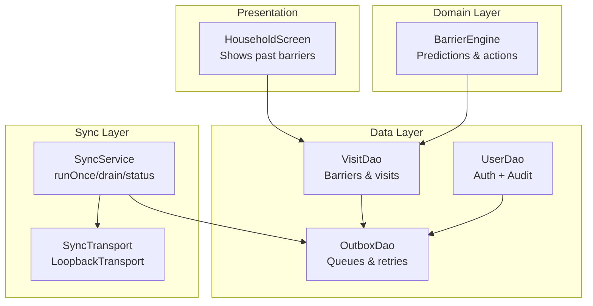
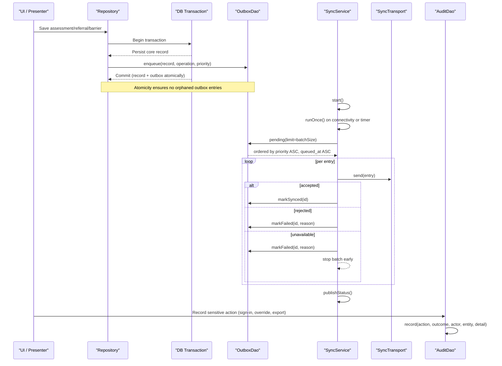
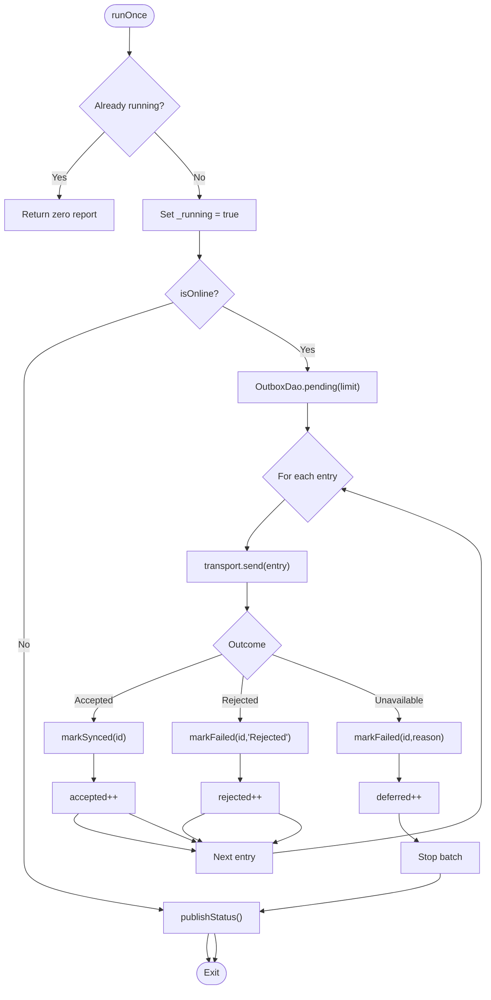
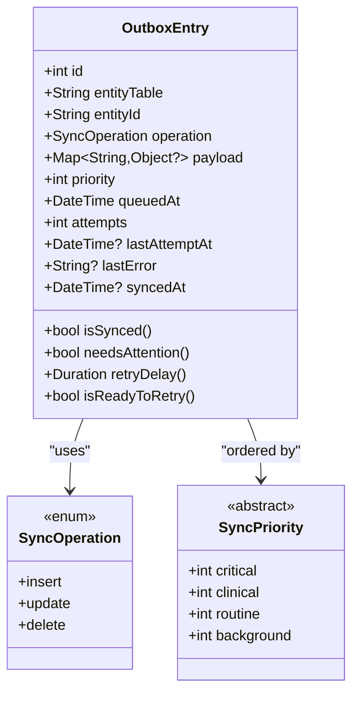
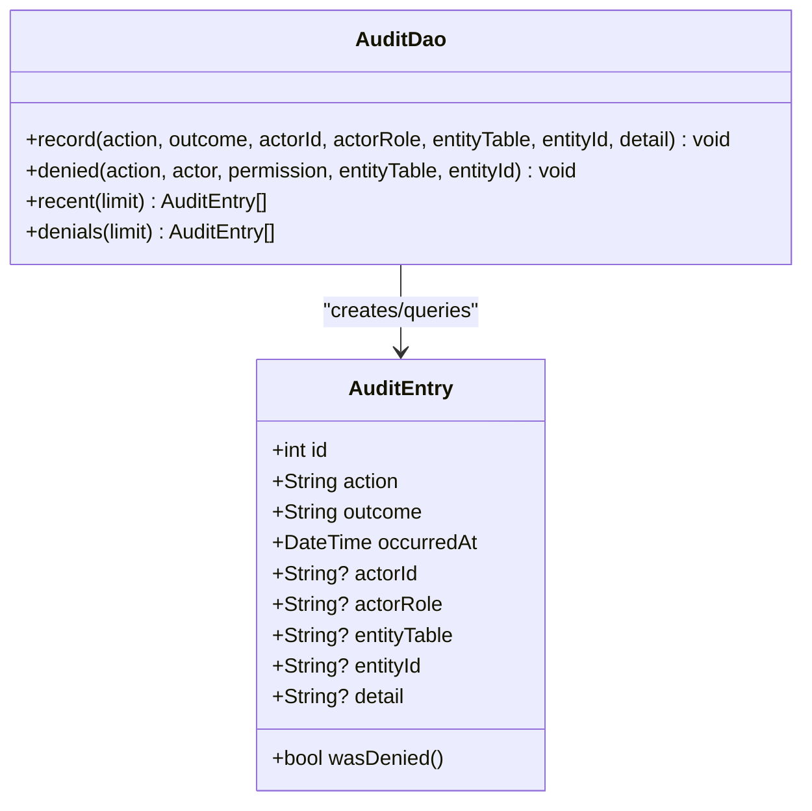
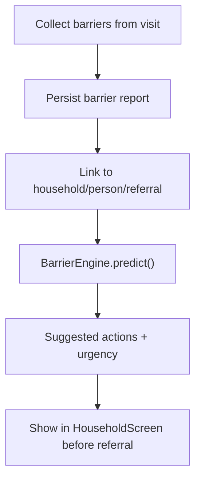
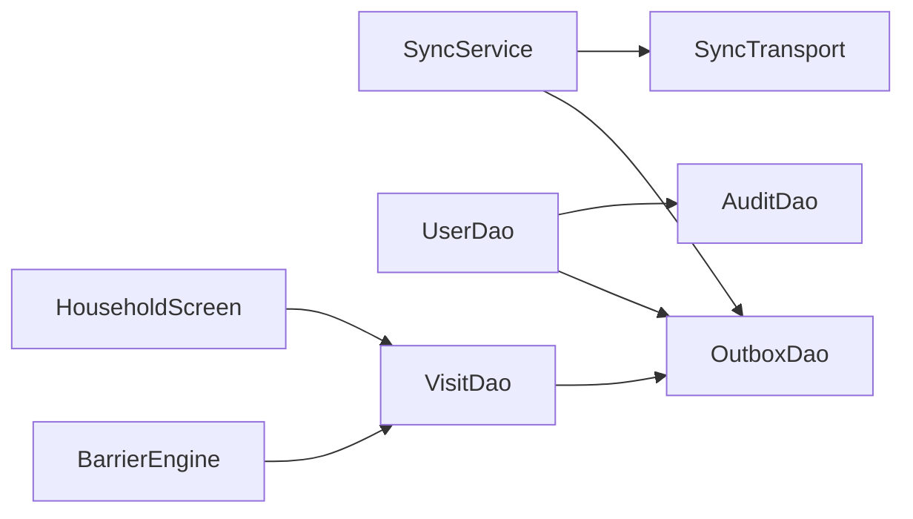

# Sync and Audit System

<cite>
**Referenced Files in This Document**
- [sync_service.dart](file://lib/data/sync/sync_service.dart)
- [outbox_dao.dart](file://lib/data/local/outbox_dao.dart)
- [user_dao.dart](file://lib/data/local/user_dao.dart)
- [visit_dao.dart](file://lib/data/local/visit_dao.dart)
- [barrier_engine.dart](file://lib/domain/engines/barrier_engine.dart)
- [visit.dart](file://lib/domain/entities/visit.dart)
- [household_screen.dart](file://lib/presentation/fhw/household_screen.dart)
</cite>

## Table of Contents
1. Introduction
2. Project Structure
3. Core Components
4. Architecture Overview
5. Detailed Component Analysis
6. Dependency Analysis
7. Performance Considerations
8. Troubleshooting Guide
9. Conclusion

## Introduction
This document explains CareBridge AI’s synchronization and audit systems that ensure offline-first reliability, priority-based delivery of urgent clinical events, and complete compliance-ready audit trails. It covers:
- The sync outbox mechanism that guarantees data consistency by queuing operations in the same transaction as data changes.
- A priority-based sync queue that ensures urgent referrals are sent before routine registrations.
- An audit log system that records permission denials, clinical overrides, and sensitive data access for accountability.
- The barrier reports system that captures why care was not delivered and informs follow-up actions.
Together, these systems maintain data consistency across devices while providing comprehensive audit trails required by health authorities.

## Project Structure
The relevant implementation is organized into:
- Data layer (local persistence and sync): Outbox DAO, User DAO with audit logging, Visit DAO for visit/barrier report storage.
- Domain layer: Barrier engine that predicts barriers and recommends actions.
- Presentation layer: Household screen that surfaces historical barriers to inform referrals.
- Sync service: Orchestrates background sync, connectivity monitoring, and batched sending.

**Diagram sources**
- [sync_service.dart:96-150](file://lib/data/sync/sync_service.dart#L96-L150)
- [outbox_dao.dart:160-221](file://lib/data/local/outbox_dao.dart#L160-L221)
- [user_dao.dart:117-167](file://lib/data/local/user_dao.dart#L117-L167)
- [barrier_engine.dart:28-55](file://lib/domain/engines/barrier_engine.dart#L28-L55)
- [visit_dao.dart:1-200](file://lib/data/local/visit_dao.dart#L1-L200)
- [household_screen.dart:180-190](file://lib/presentation/fhw/household_screen.dart#L180-L190)

**Section sources**
- [sync_service.dart:1-258](file://lib/data/sync/sync_service.dart#L1-L258)
- [outbox_dao.dart:1-277](file://lib/data/local/outbox_dao.dart#L1-L277)
- [user_dao.dart:1-457](file://lib/data/local/user_dao.dart#L1-L457)
- [visit_dao.dart:1-200](file://lib/data/local/visit_dao.dart#L1-L200)
- [barrier_engine.dart:28-400](file://lib/domain/engines/barrier_engine.dart#L28-L400)
- [visit.dart:564-605](file://lib/domain/entities/visit.dart#L564-L605)
- [household_screen.dart:159-190](file://lib/presentation/fhw/household_screen.dart#L159-L190)

## Core Components
- Sync Service: Manages background sync, connectivity-driven triggers, batched sending, and status broadcasting.
- Outbox DAO: Implements the outbox table, enqueueing within transactions, priority ordering, retry/backoff, and pruning.
- User DAO and Audit DAO: Handles secure sign-in, PIN management, and robust local audit logging for all sensitive actions.
- Barrier Engine: Analyzes household and zone data to predict barriers and recommend preemptive actions.
- Visit Entity and DAO: Stores barrier reports and links them to households/persons/referrals.
- Household Screen: Surfaces historical barriers to guide referral decisions.

Key responsibilities:
- Offline-first guarantee: Every data change is paired with an outbox entry in the same transaction.
- Priority-based sync: Urgent referrals leave before routine registrations.
- Resilient retries: Exponential backoff with capped delays; failures surfaced to users.
- Complete audit trail: Denials, overrides, and sensitive access recorded locally first.
- Barrier intelligence: Predicts likely barriers and suggests immediate actions.

**Section sources**
- [sync_service.dart:96-258](file://lib/data/sync/sync_service.dart#L96-L258)
- [outbox_dao.dart:34-115](file://lib/data/local/outbox_dao.dart#L34-L115)
- [user_dao.dart:382-457](file://lib/data/local/user_dao.dart#L382-L457)
- [barrier_engine.dart:28-55](file://lib/domain/engines/barrier_engine.dart#L28-L55)
- [visit.dart:564-605](file://lib/domain/entities/visit.dart#L564-L605)

## Architecture Overview
The sync and audit architecture combines a transactional outbox with a resilient sync loop and a local audit store.

**Diagram sources**
- [sync_service.dart:122-217](file://lib/data/sync/sync_service.dart#L122-L217)
- [outbox_dao.dart:160-221](file://lib/data/local/outbox_dao.dart#L160-L221)
- [user_dao.dart:182-216](file://lib/data/local/user_dao.dart#L182-L216)
- [user_dao.dart:382-413](file://lib/data/local/user_dao.dart#L382-L413)

## Detailed Component Analysis

### Sync Service
Responsibilities:
- Start periodic and connectivity-driven sync runs.
- Execute one batch at a time, respecting re-entrancy guards.
- Apply SendAccepted/SendRejected/SendUnavailable outcomes to update outbox state.
- Provide status stream and manual drain for user control.

Key behaviors:
- Opportunistic sync: runs immediately when connectivity returns and periodically otherwise.
- Small batches: default size limits reduce rollback risk during brief connectivity windows.
- Progress tracking: counts attempted, accepted, rejected, deferred; publishes summary.

**Diagram sources**
- [sync_service.dart:156-217](file://lib/data/sync/sync_service.dart#L156-L217)

**Section sources**
- [sync_service.dart:96-258](file://lib/data/sync/sync_service.dart#L96-L258)

### Outbox DAO
Responsibilities:
- Enqueue outbox entries inside the same transaction as data writes.
- Query pending entries ordered by priority then age.
- Track attempts, last attempt time, last error, and synced timestamp.
- Provide exponential backoff and readiness checks.
- Prune successfully synced rows after retention period.

Priority model:
- Critical (e.g., urgent referrals)
- Clinical (assessments, growth, barrier reports)
- Routine (registrations, visits, schedules)
- Background (housekeeping)

Retry logic:
- Backoff grows exponentially with attempts, clamped to a maximum delay.
- Entries become “needs attention” after repeated failures.

**Diagram sources**
- [outbox_dao.dart:32-47](file://lib/data/local/outbox_dao.dart#L32-L47)
- [outbox_dao.dart:49-115](file://lib/data/local/outbox_dao.dart#L49-L115)

**Section sources**
- [outbox_dao.dart:1-277](file://lib/data/local/outbox_dao.dart#L1-L277)

### Audit Log System
Responsibilities:
- Record every permission denial, sign-in attempt, clinical override, and sensitive data access.
- Ensure audit writes never block care delivery; failures are swallowed intentionally.
- Provide queries for recent activity and filtered denials.

Security considerations:
- PIN hashing with salt and iterative stretching.
- Constant-time comparison for PIN verification.
- Strong validation rules for PINs.

**Diagram sources**
- [user_dao.dart:342-380](file://lib/data/local/user_dao.dart#L342-L380)
- [user_dao.dart:382-457](file://lib/data/local/user_dao.dart#L382-L457)

**Section sources**
- [user_dao.dart:1-116](file://lib/data/local/user_dao.dart#L1-L116)
- [user_dao.dart:342-457](file://lib/data/local/user_dao.dart#L342-L457)

### Barrier Reports System
Responsibilities:
- Capture reasons why care was not delivered through structured barrier fields.
- Link barriers to households, persons, and referrals.
- Surface historical barriers to inform new referrals and avoid repeat discoveries.

Analysis and recommendations:
- Barrier engine predicts likely barriers based on recorded facts.
- Provides likelihood labels and preemptive actions tailored to urgency.

**Diagram sources**
- [visit.dart:564-605](file://lib/domain/entities/visit.dart#L564-L605)
- [barrier_engine.dart:28-55](file://lib/domain/engines/barrier_engine.dart#L28-L55)
- [household_screen.dart:180-190](file://lib/presentation/fhw/household_screen.dart#L180-L190)

**Section sources**
- [visit.dart:564-605](file://lib/domain/entities/visit.dart#L564-L605)
- [barrier_engine.dart:28-400](file://lib/domain/engines/barrier_engine.dart#L28-L400)
- [household_screen.dart:159-190](file://lib/presentation/fhw/household_screen.dart#L159-L190)

## Dependency Analysis
The components interact as follows:
- SyncService depends on OutboxDao for queue operations and on SyncTransport for network abstraction.
- UserDao enqueues outbox entries for user-related changes and records audit entries for security-sensitive actions.
- VisitDao persists barrier reports; BarrierEngine analyzes data to produce predictions and recommended actions.
- Presentation layers consume barrier insights to improve referral workflows.

**Diagram sources**
- [sync_service.dart:96-150](file://lib/data/sync/sync_service.dart#L96-L150)
- [outbox_dao.dart:160-221](file://lib/data/local/outbox_dao.dart#L160-L221)
- [user_dao.dart:117-167](file://lib/data/local/user_dao.dart#L117-L167)
- [barrier_engine.dart:28-55](file://lib/domain/engines/barrier_engine.dart#L28-L55)

**Section sources**
- [sync_service.dart:96-258](file://lib/data/sync/sync_service.dart#L96-L258)
- [outbox_dao.dart:160-277](file://lib/data/local/outbox_dao.dart#L160-L277)
- [user_dao.dart:117-167](file://lib/data/local/user_dao.dart#L117-L167)
- [barrier_engine.dart:28-400](file://lib/domain/engines/barrier_engine.dart#L28-L400)

## Performance Considerations
- Batch size: Small batches reduce rollback risk and maximize progress during brief connectivity windows.
- Ordering: Priority-first ordering ensures urgent referrals are transmitted early.
- Backoff: Exponential backoff prevents battery drain and server overload under persistent failures.
- Status streaming: UI updates without blocking sync operations.
- Pruning: Periodic cleanup of synced rows keeps storage bounded.

[No sources needed since this section provides general guidance]

## Troubleshooting Guide
Common issues and resolutions:
- Stuck entries: Use failing() to list entries needing human review; resetAttempts() to retry after fixing underlying issues.
- Network flaps: Unavailable outcomes stop the current batch early; subsequent connectivity triggers resume syncing.
- Repeated denials: Review AuditDao.denials() to identify unauthorized access attempts and address role/permission gaps.
- Storage growth: Ensure pruneSynced() runs regularly to remove old synced entries.

Operational tips:
- Monitor SyncService.status stream for real-time summaries.
- Use drain() for manual sync when connectivity is briefly available.
- Inspect OutboxEntry.lastError for specific failure reasons.

**Section sources**
- [sync_service.dart:244-257](file://lib/data/sync/sync_service.dart#L244-L257)
- [outbox_dao.dart:240-277](file://lib/data/local/outbox_dao.dart#L240-L277)
- [user_dao.dart:435-457](file://lib/data/local/user_dao.dart#L435-L457)

## Conclusion
CareBridge AI’s sync and audit systems provide robust offline-first reliability, prioritize urgent clinical events, and deliver comprehensive audit trails for compliance. The transactional outbox guarantees consistency between local data and sync intents, while the priority queue ensures life-saving referrals are sent promptly. The audit log captures all sensitive actions, enabling accountability and regulatory compliance. Barrier reports and predictive analysis enhance care delivery by surfacing obstacles and guiding proactive interventions. Together, these systems support reliable, auditable, and responsive community health workflows.